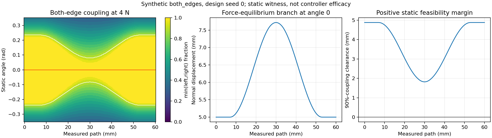

# Contact QP v1 验收统计与独立可修复性检查

本方法按 [acceptance_v1.json](acceptance_v1.json)、[CONTRACT_V1.md](CONTRACT_V1.md) 和 [SIM_MODEL_V1.md](SIM_MODEL_V1.md) 的既定要求展开，不放宽零力误差裕量，不用真人随机游走分数充当接触真值。本文的数值实验仅检查 **design seeds 0–9 的静态合成模型**，没有使用 acceptance seeds 1000–1019，也没有运行控制器或硬件。

## 验收单位、数据冻结与最小报告结构

一个配对单位是 `(scenario, seed)` 下完整的一组控制器运行。12 个场景、20 个验收种子、7 个算法共 **1,680 个必需运行**；设计集为另外 840 个运行。`full` 固定 gamma=1，`full_consistency` 才打开动作响应一致性；后者的结果不能替代前者成为事后挑选的主结果。

运行前记录下列冻结信息。仅记录 Git HEAD 不足以识别当前有未提交改动的工作树，应同时记录实际源码、参数和输入文件的内容哈希。

| 记录 | 必需字段 / 含义 |
|---|---|
| `experiment` | `schema_version`, `experiment_id`, `split`（design/acceptance）, `status`, `started_at`, `finished_at` |
| `provenance` | baseline commit；contract、acceptance、model 文档及实际源码/config 哈希；有效 ICRA 力/力矩参数；依赖版本；时间步、图像周期/延迟/尺寸；窗口和标定版本 |
| `manifest` | 按冻结顺序的 scenarios/seeds/algorithms；全部预期 run_id；目标力 4 N、路径 0.060 m、标称 T=3 s、监督时限 24 s；随机流说明 |
| `pairing` | 每对共同初始状态及外生场的哈希；每算法相同限值证明；matched 来源 full run_id、数据哈希及回放规则版本 |
| `run` | `run_id`, scenario/index, seed, algorithm, outcome, metric_valid, failure_reasons, first/last valid sample、active_start、actual_finish、elapsed、sample_count、日志路径/哈希 |
| `run.force` | RMSE、absolute_mean_bias、peak_absolute_error；使用的 F 通道、单位、采样时刻和样本数；另存无噪声物理力诊断 |
| `run.coverage` | total_path、invalid_forward_travel、unscanned_remainder、bad_path、valid_forward_union、valid_coverage_fraction、valid_coverage_rate；质量真值与时间/空间积分规则版本 |
| `run.diagnostics` | 原始/补偿当前力与图像历史对应力；LEFT/CENTER/RIGHT 观测及独立真值；五种速度；接受/拒绝 alpha；solver 与 task-infeasible 分类计数；证书/事务/能量异常；中心窗口诊断 |
| `bootstrap` | generator、seed、replicate_count、scenario/seed 顺序、索引张量形状/哈希、quantile method、paired-unit 说明 |
| `comparison` | scope（per_scenario/pooled）、metric、comparator、n_pairs/expected、pair_ids、各场景均值、点估计、单侧上下界中实际需要的一项、margin、严格/非严格不等式、pass/fail/not_evaluable |
| `decision` | manifest 完整性、39 个力门槛、6 个 pooled 质量置信界、18 个逐场景 coverage 均值门槛、完成/超时门槛及各阶段工程验收；失败原因列表；最终 accepted=false 时保持默认禁用 |

数字字段只有在有效时才填写有限值。缺失、非有限数值或无活动样本用 `null` 加明确失败原因，不把它们改成零或 `Infinity` 后混入 bootstrap。`complete_with_gaps` 是一个可计算指标的完成状态；`aborted`、超时和数值失败必须单独标识。

当前 SIM_MODEL 文本没有给出所有实现细节，执行验收前还必须锁定：法向位移/角度/加速度界，力统计通道，完整运动与噪声模型，活动区间事件，区间质量积分法，以及 matched 中重复位置/停顿的回放法。把这些写进实际配置和报告不是另改验收门槛；不可等到查看留出结果后再选择。

## 单次运行的指标

所有算法用相同的初始获取条件和扫描启动事件。区间从已确认接触后的 **active scan 起点** 到实际扫描完成或固定超时；包括扫描内全部停顿、恢复与瞬态，不按图像有效性删力样本，也不另设算法专属的稳态截取。模拟器的共同预备期应单列，不能通过扩大预备期在验收后排除不利瞬态。

令本区间当前压缩力为 F，误差 e=F−4。严格按 manifest 逐运行计算：

```text
rmse = sqrt(mean(e**2))
absolute_mean_bias = abs(mean(e))
peak_absolute_error = max(abs(e))
```

先对每个 run 取平方根、绝对值和峰值，再做运行间配对差；不得将多次运行的帧拼起来重算这些非线性指标。固定 5 ms 的原始控制采样使用算术均值；如记录步长变化，仍保留 manifest 算术均值为主指标并另报时间加权敏感性，不能在看到结果后切换定义。当前控制 `control_wrench` 的 Fz 是与 4 N 控制目标一致的候选主通道，须在验收前明确冻结；无噪声物理压缩力另报。图像相位对应的历史力不能进入当前力精度或能量端口指标。

质量验收合格只由独立 plant 的机械耦合定义：两侧窗口各自的耦合元素比例均达到 0.90；CENTER 不进入这个布尔量。当前 81 元素和 FeatureConfig 窗口对应 LEFT/CENTER/RIGHT 为 24/25/24 个元素，因此每侧至少 **22/24** 耦合。耦合深度门限 0.12 mm 是本合成模型的冻结参数，不是人体声窗阈值。若另外用独立 acoustic availability 标记 shadow/nonmonotonic 的声学缺口或 `complete_with_gaps`，应给它独立字段和口径；不能覆盖冻结的机械 coverage 指标，也不能用控制器 confidence 来定义它。

覆盖只使用 measured path。每个前向区间裁剪到 [0,L]，反向位移本身不增加前向覆盖，暂停不增加距离。必须记录所用区间真值规则；一种保守可复现规则是区间两端均满足两侧条件且数据有效才计有效，必要时用 plant 的接触切换点细分。不能把旧图像分数延伸到任意新的路径距离来宣称有效覆盖。

令 U_scan 为所有前向遍历区间的并集，U_valid 为其中独立真值合格区间的并集，D_bad 为不合格前向遍历长度的累计值。按 manifest 的“坏的前向距离，加未扫描剩余”表述：

```text
unscanned_remainder = L - length(U_scan)
bad_path = D_bad + unscanned_remainder
valid_coverage_fraction = length(U_valid) / L
valid_coverage_rate = length(U_valid) / active_elapsed
missing_union_coverage = L - length(U_valid)       # 另列诊断
```

单调扫描时 `bad_path == missing_union_coverage`；若回退后重扫，前者会计入重复坏遍历，后者只描述最终缺失并集，二者不能静默混为一个定义。报告同时保留分解项，可核查 root 实现是否采用相同口径。未扫描剩余在终止时仍计缺失；提前停住不能靠只统计已扫描部分获得好成绩。实际完成判定必须来自测得路径，不能只看 t_ref 到 T。24 s 时限使用严格 `elapsed < 24`。

## 配对 percentile bootstrap 的精确算法

按 manifest 中 scenarios 的顺序，12 个场景各有按升序排列的 20 个种子。同一 `(scenario,seed)` 的 full 和 comparator 共享初始状态以及固定的外生时间/空间场；不同算法速度变化时，场随实际时间/位置查询。不要依赖各控制器分支调用 RNG 的次数生成噪声，这会破坏配对。场景间使用 `SeedSequence([scenario_index, seed])` 独立子流。单独的镜像性质单元测试可以显式镜像刚度，但正式左右场景不能共享同一个随机场。

对任一指标 m 和比较器 c，先形成矩阵：

```text
D[s,j] = m(full, scenario_s, seed_j) - m(c, scenario_s, seed_j)
```

以下伪代码固定 generator 和量化插值，避免不同调用顺序隐含改变结果；所有指标和比较器复用同一索引张量，但各场景的索引独立。不要重采样帧，不把 full/comparator 拆开重采样，也不跨场景混合抽样。

```python
rng = np.random.Generator(np.random.PCG64(860910))
# b: bootstrap replicate; s: scenario; j: paired seed draw
I = rng.integers(0, 20, size=(10000, 12, 20), dtype=np.int64)
# 保存 sha256(I.astype('<i8').tobytes(order='C'))

def paired_bounds(D, selected_scenarios):
    assert D.shape == (12, 20)
    # 调用者先确认全部必要配对有效；D 的参与部分不允许 NaN。
    selected_scenarios = np.asarray(selected_scenarios, dtype=int)
    Ds = D[selected_scenarios]
    Is = I[:, selected_scenarios, :]
    samples = Ds[np.arange(len(selected_scenarios))[None, :, None], Is]
    scenario_replicates = samples.mean(axis=2)   # shape: (10000, S)
    pooled_replicates = scenario_replicates.mean(axis=1)
    return {
        'per_scenario_estimate': Ds.mean(axis=1),
        'per_scenario_lower95': np.quantile(scenario_replicates, .05, axis=0, method='linear'),
        'per_scenario_upper95': np.quantile(scenario_replicates, .95, axis=0, method='linear'),
        'pooled_estimate': Ds.mean(axis=1).mean(),
        'pooled_lower95': np.quantile(pooled_replicates, .05, method='linear'),
        'pooled_upper95': np.quantile(pooled_replicates, .95, method='linear'),
    }
```

对某个未参与场景可不计算 D；实现也可以先只组装参与矩阵，关键是按相同原始场景索引取 I。pooled 是**每场景相同权重、场景内每种子相同权重**；既不按扫描帧数加权，也不把各场景置信界平均充当 pooled 界。直接对“成对 run 指标差”的均值取普通 percentile 界，不能改成 BCa、Student-t、中心化 bootstrap 或“没有显著差异即通过”。.05 和 .95 分别是单侧 95% 界；两者同时展示时不是双侧 95% 区间。

所有原始差值、均值和判定保留双精度；表格四舍五入后的 −0.000 不参与判断。`numeric_equivalence_atol/rtol` 与最终命令容差只属于工程验证，不是力统计的额外正裕量。

## 明确的通过与失败规则

1. 力比较只用 `full − baseline`，覆盖全部 12 个场景。3 个力指标的每场景 upper95 均须 ≤0，且各指标等场景权重 pooled upper95 均须 ≤0：合计 **39 个门槛**。某个场景失败不能被总体改善抵消。
2. 质量 pooled 仅用冻结的 6 个 repairable 场景。对 baseline、matched_scan_speed、matched_rocking 分别要求 `upper95(Δbad_path) < 0` 与 `lower95(Δvalid_coverage_rate) >= 0`：合计 **6 个置信界门槛**。
3. 对上述每个质量比较器，6 个 repairable 场景各自的 `mean(Δvalid_coverage_fraction) >= 0`：共 **18 个描述性均值门槛**，不擅自换成显著性门槛。120 个 full repairable 运行均需在 24 s 前实际完成。
4. 所有 manifest 运行必需。任一 solver numerical failure、无效/缺失数据或 timeout 都阻止整体验收；不能删除失败配对或换种子。失败后的有限诊断指标可以保留，但不能把该 pair 标为成功。某比较所需 20 个 pairs 不齐全时，正式 CI 标 `not_evaluable`；不对残余成功子集计算一个可用于通过的 CI。
5. task-infeasible 的机械处理事件与数值 solver failure 分开记录；按合同执行的机械停止、事务不确定和证书失效也不能改称普通视觉 slack。最终 aborted 或丢数据仍阻止验收。图像质量低但测量有效，不等于 missing data。
6. 统计全部通过也不替代 baseline 100,000-tick 等价性、native/最终发布约束、事务故障注入、能量账本和阶段回归/性能验收。各单侧界按冻结规则逐项检查；不得称这些同时构成了联合 95% 概率保证。

边界自检：全零差值的力上界为 0，应通过力零裕量；同样全零的 bad_path 差值不满足严格改善，应失败。恒正力差必失败；恒负坏路径差且零覆盖率差满足对应质量门槛。已用人工常数差值和逐场景常数数组验证索引/均值/分位数，无需接触留出种子；上述索引张量的 SHA-256 为 `018632a66d8018af5bf4d6996b4d1ca03b06957cc1e85e0a87f65ac065adc53b`。

## matched 控制与留出集不能双重使用

matched 算法依照冻结规则保留 baseline 力/力矩律的符号及内部状态，所有限值和外生扰动一致。每个 matched run 必须指向同一个 `(scenario,seed)` 的 full run。full 和两个 matched 由同一个实验单位共同产生，不是额外独立样本；bootstrap 将整组一起抽取。

`matched_scan_speed` 直接使用函数 `alpha(s)` 有一个实际陷阱：full 在某位置 alpha=0 的停顿若被当作永久的空间查找值，比较器停住后再也到不了下个 s，会产生人为超时。冻结的回放实现应保留源 accepted-alpha 的有序记录和停顿时长，使用显式回放 cursor，在匹配位置重现一次停顿后继续后续记录；不能只删掉零值。重复坐标、延迟执行、插值及路径终点外行为应在设计集单元测试中确定。若选择每空间箱等效速度等替代定义，需在正式验收前明确标注其与原 schedule 的差别，不能事后暗改。

`matched_rocking` 对 baseline 自己请求的角速度，以 full 同位置的绝对角速度 envelope 截幅，保留 baseline 符号；baseline 请求 0 时仍为 0，不注入 full 的转动符号。应明确 envelope 来源是哪个速度端口，优先依据最终接受/发出的角速度而非未执行的 QP 提案，并记录 measured 角速度作为校验。时空重采样规则同样冻结。

先用 design 0–9 完成参数选择、renderer/阈值定义、统计单元测试、可修复性审查和全部回放规则。随后冻结全部配置/代码及输出目录，才执行 acceptance 1000–1019。不能用留出结果挑 full/full_consistency、改视觉阈值、缩小场景幅度、调 timeout/力裕量，或把难例从 repairable 表移走。

若留出验收失败，保留 manifest、全部运行和失败判定，结论是 NOT ACCEPTED/default disabled。相同数据上的修复后重跑须明确是已暴露数据，不能继续称作未经使用的独立验收；后续如需独立验证，应另立带版本的新协议，而不是覆盖原 v1 结果。matched 从对应 full 提取预先规定的 schedule 是本次固定比较的一部分，不是允许对留出表现再调参数。

## both_edges 在固定 4 N 下的实际静态检查

审查代码为 [plant.py](../../peirastic/contact_qp/plant.py)，本次源码 SHA-256 `ba1a02b90665308dfdbf7ef4b6bec1237951a3491398c3fd1c2804978eca71f2`，包含世界坐标表面、x/y 坡度反力及独立 acoustic availability。使用 5 个静态几何家族 × 10 个设计种子 × 121 个路径点（0–60 mm，0.5 mm 步长）× 281 个角度（−0.35 至 0.35 rad，0.0025 rad 步长），共 **1,700,050 个静态力平衡解**。移动表面需要额外时间相位网格，本次未纳入；delayed_execution 在这里只检查其静态几何，延迟对动态效果没有被验证。

静止、无噪声时，实际代码的固定控制 Fz 条件是：

```text
X_i = X_tcp + x_i*cos(theta)          # 本次静态构形 X_tcp=0
depth_i = z - x_i*sin(theta) - h(s,X_i)
Σ [cos(theta)-sin(theta)*dh/dX(s,X_i)] * k_i * max(depth_i,0) = 4 N
```

不能误用 `Σforce_i = 4` 代替工具 z 分量；存在横向表面坡度时，单独乘 cos(theta) 仍漏掉反力的工具 z 投影。给定 (s,theta)，本次网格全部有效刚度系数为正，左式随 z 单调。分析程序使用与 plant 相同的中心差分表面坡度，将 `x_i*sin(theta)+h_i` 排序，逐活动集精确解线性分段，力残差 <1e−12 N；再用实际 `_update_contact/control_wrench/window_coupling` 检查代表状态。Kelvin–Voigt 速度项在静态证据中为零。

| 合成家族，design 0–9 | 每个路径有至少一个静态角度解 | theta=0 的全路径/种子最小边缘比例 | theta=0 达到 90% 的最小深度裕量 |
|---|---:|---:|---:|
| both_edges | 是，1,210/1,210 | **1.000** | **+1.748 mm** |
| left_gap | 是，1,210/1,210 | 0.625 | −0.053 mm |
| right_gap | 是，1,210/1,210 | 0.583 | −0.073 mm |
| curvature | 是，1,210/1,210 | 1.000 | +1.383 mm |
| delayed_execution | 是，1,210/1,210 | 0.500 | −0.152 mm |

裕量指每侧达到 22/24 耦合所需的临界元素深度减去 0.12 mm，再取两侧和全部采样状态的最小值。正裕量表示该静态构形有余量，负值只表示这个 theta=0 构形不够，不能据此宣称整个场景不可修复。

`both_edges` 的高度为 `8 mm * bump(s) * (x/a)^2`。最大 bump 位于 s=30 mm。此时 theta=0 力平衡 z 为 **7.648–7.794 mm**；所需窗口内最大 |x/a| 为 0.90，对应凹陷仅 6.480 mm，所以两侧窗口已经全部达到耦合门限。最外端部分元素可能不同，但它们不属于本次规定的边缘窗口；不能把“整个 50 mm 面所有元素接触”偷换成窗口 ≥0.90 的要求。

apex 处两侧均达标的角度网格约为 −0.085 至 +0.0825 rad，具体边界随种子变化；theta=0 落在其中。沿 theta=0 的静态平衡支，在 20 mm/s 扫速下，以此路径网格有限差分估算的最大法向速度为 **3.820 mm/s**，低于 10 mm/s cap。这只支持运动学可行的初步判断：没有证明加速度、阻尼、接触瞬态、动作延迟、QP 相对 baseline 约束或能量 admission 都允许该支。

因此当前 both_edges 与 curvature 的确有固定 4 N 的静态可行构形，但它们是**瞬态跟踪测试**，不是持续静态双边缺口的示例。若 baseline 很快自行恢复，不能因 full 的改善很小就抬高力目标或事后增大凹陷来制造优势；保留场景及结果。若要声明 QP 修复有效，需要观察受扰进入过程中的独立机械真值、当前力误差、实际路径和有效覆盖率是否共同满足冻结比较。



一般的对称双边凹陷不一定可在固定力下修复。给定 theta，将每个 required window 内使 90% 元素达到耦合深度所需的 z 临界值排序，取两侧较大的 `z_req(theta)`；再计算其静态控制力 `F_req(theta)`。若在所有机械允许 theta 中 `F_req(theta)>4 N`，不存在固定 4 N 的静态达标构形。简单“中央平台 + 两边深 d”的模型会出现约 `K_center*d` 的先行负载，rocking 往往压低一边同时抬起另一边，不能自动克服这种对称几何限制。这里的抛物线 profile 和窗口位置没有触发该限制。

## 三类失败原因须分开

| 类别 | 可支持它的独立证据 | 不能作为证据的量 |
|---|---|---|
| 几何 / 机械不可达 | 在固定目标力和明确姿态/位移界下无静态构形，或有构形但在速度/加速度/接触/时间/能量界下无可达轨迹；前者需全域界或足够细化的证据 | 单个控制器没修好；粗网格没有命中；visual slack>0 |
| 声学观测不响应 / 映射错误 | 同机械状态下独立 renderer 的 shadow/nonmonotonic/flip 机制及局部动作前后像素/分数变化；机械耦合可已合格 | 把控制器低随机游走分数直接当机械真值；从真人相关性确定旋转符号 |
| 算法策略或执行代价 | 已有独立可行构形/轨迹，但 QP 的力优先、孔径预算、图像保持行、能量/最终执行 admission、动作延迟或权重使其选择别的动作；用日志与消融区分 | 把正 slack 命名为组织不可修复；忽略实际未发送或未测得的运动 |

静态网格找到合格状态能证明该采样点“存在一个构形”；没找到不能自动证明全局不存在。当前 PlantConfig 没有独立法向位移界，因此此证据还不能代替完整机械 admission 证书。动态验证还应检查连续可行支、起始条件到支的可达性、运动/力瞬态与 24 s 时限；静态 acoustic shadow 即使机械达标也可能继续低图像分数，属于独立观测压力测试。

复现静态证据：`/media/camp/EXT_DRIVE/envs/genesis/bin/python MD/contact_qp/acceptance_artifacts/check_static_feasibility.py`。输出 [逐路径/种子 JSON](acceptance_artifacts/static_feasibility_design.json) 包含配置、源码哈希、网格和全部限制，同时保留[本次模型源码快照](acceptance_artifacts/static_feasibility_model_snapshot.py.txt)，防止后续修改与旧数值混淆；仅写本 MD 产物目录。本文不报告任何留出控制器效果或真人新控制器结果。
