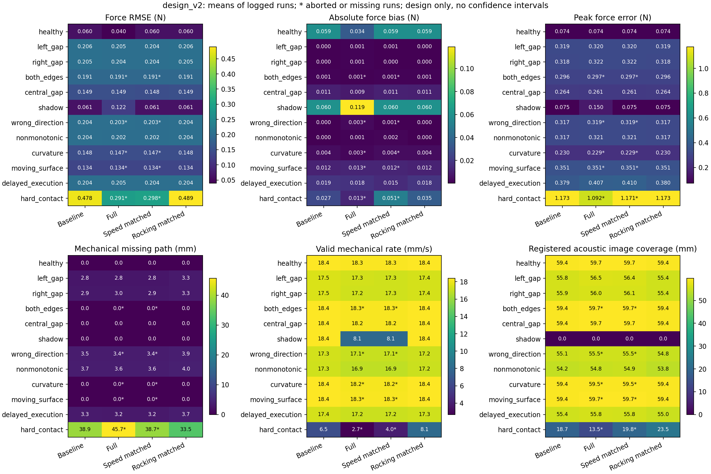
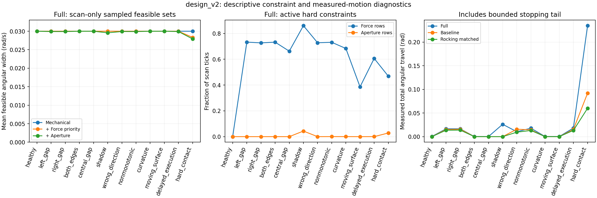
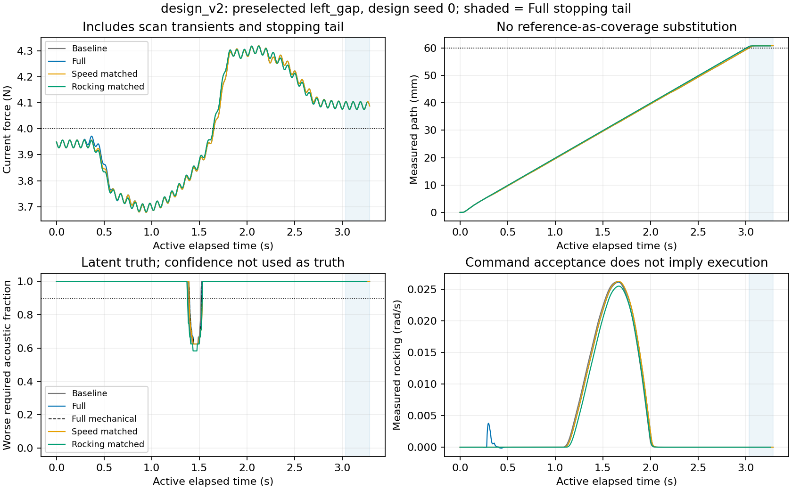
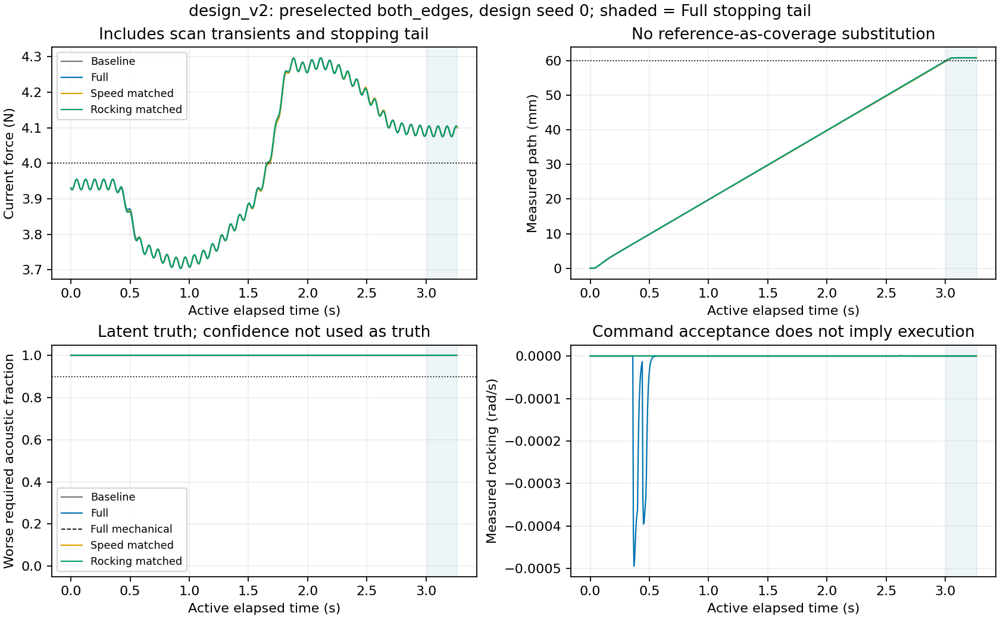
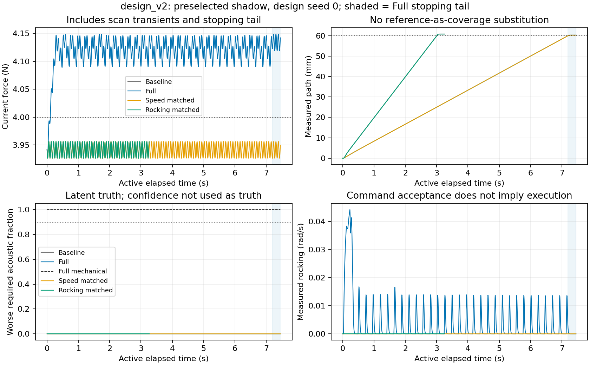
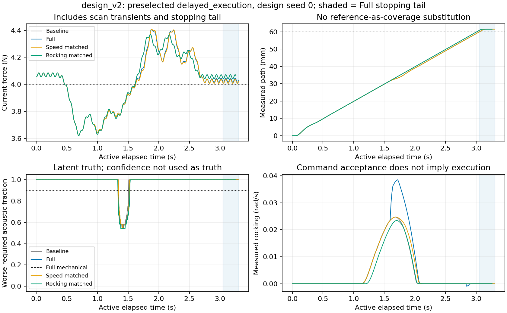

# Stage 2 合成设计集实验报告

当前主表来自 `design_v2`；**仅为设计集描述，未使用 acceptance seeds 1000–1019，不宣称统计验收通过**。本次读到 840/840 个运行指标，valid=809；状态 {'complete_with_gaps': 761, 'complete': 48, 'aborted': 31}，pair 异常文件 0 个。

均值采用每运行等权；中止运行的有限日志值仍保留在表内，其观察时长可能更短，不能作为成功证据。缺失运行明确计数，不补零，也不把未齐全的配对结果用于验收。图中 * 标记有中止或缺失的单元。

`design_v1` 保留为预备版本：777/840 指标，63 项缺失，状态 {'complete_with_gaps': 713, 'complete': 48, 'aborted': 16}，9 个 pair 异常。不能将两个版本挑选有利种子拼成一组。

**行为目标尚未达到。** Full 有 112/120 个有效完成运行，六个预列可修复场景中为 57/60。完整记录和实现测试通过不等于效果通过。六场景等权的 full−baseline 缺失路径变化为 -0.0211 mm，有效覆盖速度变化为 -0.1935 mm/s；与 matched_scan_speed 比较分别为 -0.00495 mm 和 +0.00151 mm/s。这里只是保存运行的描述性均值，不能用中止记录的有限指标绕过失败门槛。

shadow 的 baseline/full 机械缺失路径均为 0，独立 acoustic 与注册图像覆盖均为 0。Full 的平均耗时 7.45 s，对比 baseline 3.26 s；力 RMSE 0.12176 N 对比 0.06098 N。该固定遮挡没有被额外动作修复。局部力优先不等式不能替代端到端力误差比较。

## 各消融的完成状态与可修复场景均值

完成计数覆盖全部 120 个场景/种子运行；后四列只汇总六个可修复场景，各场景等权。中止数据仍保留，因此这些均值本身不代表成功。

| 算法 | complete / gaps / aborted | 可修复场景 RMSE(N) | missing(mm) | valid rate(mm/s) | measured angular travel(rad) |
|---|---:|---:|---:|---:|---:|
| baseline | 0 / 120 / 0 | 0.181 | 1.508 | 17.942 | 0.008 |
| image_only | 0 / 120 / 0 | 0.698 | 1.503 | 17.938 | 0.027 |
| no_aperture | 12 / 102 / 6 | 0.181 | 1.494 | 17.746 | 0.009 |
| full | 12 / 100 / 8 | 0.181 | 1.487 | 17.749 | 0.009 |
| full_consistency | 12 / 99 / 9 | 0.181 | 1.488 | 17.748 | 0.008 |
| matched_scan_speed | 12 / 100 / 8 | 0.181 | 1.492 | 17.747 | 0.008 |
| matched_rocking | 0 / 120 / 0 | 0.181 | 1.723 | 17.876 | 0.007 |

主线与 baseline 的直接描述性比较：left_gap：missing Δ=-0.059 mm、valid-rate Δ=-0.227 mm/s（10/10 pairs，0 失败对）；right_gap：missing Δ=+0.016 mm、valid-rate Δ=-0.260 mm/s（10/10 pairs，0 失败对）；delayed_execution：missing Δ=-0.083 mm、valid-rate Δ=-0.227 mm/s（10/10 pairs，0 失败对）。registered 图像覆盖的变化还会受到帧采样位置及扫描时序影响，不能单独证明机械修复有效。

## 统计口径与合成边界

固定目标 4 N；完整生产 nominal 力/力矩律，60 mm 路径、20 mm/s 标称扫描。外环观测来自合成 B-mode 像素经过真实随机游走提取，控制器不接收独立机械或 acoustic truth。LEFT/RIGHT 为要求窗口，CENTER 只诊断。

本设计闭环检查合成 plant、Cartesian QP 与 nominal/reference 的组合，不代表 native 最终发布协议、非原子设备事务或能量账本的 Stage 3 验收已完成。没有连接或驱动真实机器人。

力主指标使用当前带既定噪声的 control Fz；RMSE、绝对平均偏差、峰值逐运行计算。源日志指标包含扫描后的约 0.25 s 停止尾段，valid rate 分母也包含它。本报告原样报告该口径，同时将约束活跃比例和角速度可行区间另按 phase='scan' 重算，避免尾段复制的诊断标志偏置。

controller_ms 是离线运行的主机耗时，含 nominal/求解及安排的区间诊断；超过 5 ms 的计数是处理耗时诊断，不等于模拟真实执行故障。其 scan-only p95 和原始 p50/p99/max 保留在 CSV；并行运行机器上的计时不能作为硬实时上界。

机械 missing path 是源实现的 L−有效前向路径并集；registered image coverage 是按实际拍摄位置/有效相位及独立 acoustic availability 重建的图像并集。机械全耦合也可能因图像采样起止边界留下很小的 registered 缺口，因此 complete_with_gaps 不能一概解释为机械失接触。反向/重复行程另在 runs.csv 保留，不能以 reference endpoint 代替实际覆盖。

当前 both_edges 是瞬态跟踪家族，非持续双边静态缺口；[独立静态检查](ACCEPTANCE_METHOD.md) 已在设计种子下发现 θ=0、4 N 的两侧全耦合构形。shadow 的合成声学遮挡可在机械耦合良好时仍令边缘 acoustic availability=0，这两种真值必须分开。任何未修复或正视觉 slack 都不是人体不可修复性证明。

## Full 与 baseline 的逐场景原始运行均值

括号为 complete / gaps / aborted / missing 计数。力单位 N，missing 和 registered 单位 mm，rate 单位 mm/s；都来自完整保存的运行口径。

| 场景 | 算法（C/G/A/M） | RMSE | abs bias | peak | missing | valid rate | registered | acoustic fraction | angular rad |
|---|---|---:|---:|---:|---:|---:|---:|---:|---:|
| healthy | baseline (0/10/0/0) | 0.060 | 0.059 | 0.074 | 0.000 | 18.405 | 59.438 | 1.000 | 0.000 |
| healthy | full (1/9/0/0) | 0.040 | 0.034 | 0.074 | 0.000 | 18.293 | 59.690 | 1.000 | 0.000 |
| left_gap | baseline (0/10/0/0) | 0.206 | 0.000 | 0.319 | 2.830 | 17.537 | 55.838 | 0.953 | 0.015 |
| left_gap | full (0/10/0/0) | 0.205 | 0.001 | 0.320 | 2.771 | 17.310 | 56.482 | 0.954 | 0.017 |
| right_gap | baseline (0/10/0/0) | 0.205 | 0.000 | 0.318 | 2.950 | 17.500 | 55.918 | 0.951 | 0.016 |
| right_gap | full (1/9/0/0) | 0.204 | 0.001 | 0.322 | 2.966 | 17.240 | 56.045 | 0.951 | 0.017 |
| both_edges | baseline (0/10/0/0) | 0.191 | 0.001 | 0.296 | 0.000 | 18.405 | 59.438 | 1.000 | 0.000 |
| both_edges | full (5/4/1/0) | 0.191 | 0.001 | 0.297 | 0.000 | 18.279 | 59.699 | 1.000 | 0.000 |
| central_gap | baseline (0/10/0/0) | 0.149 | 0.011 | 0.264 | 0.000 | 18.405 | 59.438 | 1.000 | 0.000 |
| central_gap | full (3/7/0/0) | 0.149 | 0.009 | 0.261 | 0.000 | 18.243 | 59.749 | 1.000 | 0.000 |
| shadow | baseline (0/10/0/0) | 0.061 | 0.060 | 0.075 | 0.000 | 18.405 | 0.000 | 0.000 | 0.000 |
| shadow | full (0/10/0/0) | 0.122 | 0.119 | 0.150 | 0.000 | 8.054 | 0.000 | 0.000 | 0.026 |
| wrong_direction | baseline (0/10/0/0) | 0.204 | 0.000 | 0.317 | 3.470 | 17.340 | 55.118 | 0.942 | 0.016 |
| wrong_direction | full (0/9/1/0) | 0.203 | 0.003 | 0.319 | 3.401 | 17.099 | 55.478 | 0.943 | 0.010 |
| nonmonotonic | baseline (0/10/0/0) | 0.204 | 0.000 | 0.317 | 3.740 | 17.258 | 54.238 | 0.927 | 0.014 |
| nonmonotonic | full (0/10/0/0) | 0.202 | 0.001 | 0.321 | 3.600 | 16.884 | 54.760 | 0.929 | 0.018 |
| curvature | baseline (0/10/0/0) | 0.148 | 0.004 | 0.230 | 0.000 | 18.405 | 59.438 | 1.000 | 0.000 |
| curvature | full (0/9/1/0) | 0.147 | 0.003 | 0.229 | 0.000 | 18.215 | 59.485 | 1.000 | 0.000 |
| moving_surface | baseline (0/10/0/0) | 0.134 | 0.012 | 0.351 | 0.000 | 18.405 | 59.438 | 1.000 | 0.000 |
| moving_surface | full (2/7/1/0) | 0.134 | 0.013 | 0.351 | 0.000 | 18.274 | 59.695 | 1.000 | 0.000 |
| delayed_execution | baseline (0/10/0/0) | 0.204 | 0.019 | 0.379 | 3.270 | 17.402 | 55.438 | 0.946 | 0.015 |
| delayed_execution | full (0/10/0/0) | 0.205 | 0.018 | 0.407 | 3.187 | 17.175 | 55.845 | 0.947 | 0.018 |
| hard_contact | baseline (0/10/0/0) | 0.478 | 0.027 | 1.173 | 38.910 | 6.469 | 18.718 | 0.351 | 0.092 |
| hard_contact | full (0/6/4/0) | 0.291 | 0.013 | 1.092 | 45.698 | 2.691 | 13.496 | 0.238 | 0.235 |

全部 12×7 场景/消融单元及其样本数、范围、停止状态见 [scenario_ablation.csv](analysis_artifacts/design_v2/scenario_ablation.csv)；逐运行值见 [runs.csv](analysis_artifacts/design_v2/runs.csv)。不对设计集给出显著性、非劣性或总体成功概率结论。

## 摇摆限制与 matched 控制的实际运动

可行 ω 宽度依次表示机械约束、加入力优先约束、再加入孔径预算后的区间投影；它不是实际摇摆幅度。可行区间仅在安排了诊断的 scan 帧计算，−1 哨兵不参与均值；baseline/matched 没有 QP 区间诊断，标为未提供而非零宽。活跃行比例使用 scan tick；硬限制未贴边也可通过目标代价改变动作。

| 场景 | mechanical / force / complete ω 宽度(rad/s) | force / aperture 活跃比例 | matched speed 实际路程比 / 转动比 | matched rocking 实际路程比 / 转动比 |
|---|---|---|---|---|
| healthy | 0.0300 / 0.0300 / 0.0300 | 0.000 / 0.000 | 1.000 / 0.000 | 1.000 / 0.000 |
| left_gap | 0.0300 / 0.0300 / 0.0299 | 0.733 / 0.000 | 1.000 / 0.967 | 1.000 / 0.835 |
| right_gap | 0.0300 / 0.0300 / 0.0299 | 0.727 / 0.000 | 1.000 / 1.007 | 1.000 / 0.846 |
| both_edges | 0.0300 / 0.0300 / 0.0300 | 0.733 / 0.000 | 1.000 / 0.000 | 1.000 / 0.000 |
| central_gap | 0.0300 / 0.0300 / 0.0300 | 0.663 / 0.000 | 1.000 / 0.000 | 1.000 / 0.000 |
| shadow | 0.0300 / 0.0300 / 0.0296 | 0.861 / 0.043 | 1.000 / 0.000 | 1.008 / 0.000 |
| wrong_direction | 0.0300 / 0.0300 / 0.0299 | 0.728 / 0.000 | 1.000 / 1.585 | 1.000 / 0.905 |
| nonmonotonic | 0.0300 / 0.0300 / 0.0299 | 0.732 / 0.000 | 1.000 / 0.911 | 1.000 / 0.747 |
| curvature | 0.0300 / 0.0300 / 0.0300 | 0.684 / 0.000 | 1.000 / 0.000 | 1.000 / 0.000 |
| moving_surface | 0.0300 / 0.0300 / 0.0300 | 0.386 / 0.000 | 1.000 / 0.000 | 1.000 / 0.000 |
| delayed_execution | 0.0300 / 0.0300 / 0.0299 | 0.607 / 0.000 | 1.000 / 0.910 | 1.000 / 0.743 |
| hard_contact | 0.0300 / 0.0283 / 0.0279 | 0.469 / 0.028 | 1.000 / 0.727 | 1.003 / 0.255 |

运动比是每个完整配对中 comparator/full 的描述性比值，再在场景内等权平均；full 分母接近零时保留未定义，不把 0/0 设成 1。比值包括失败日志时同样受短运行影响，逐对 valid 标志、分母差值、elapsed 比见 CSV。matched 只规定回放/截幅规则，并不保证最终实际转动或总耗时恰好相等，尤其停止尾段和延迟执行必须检查。
完整明细：[matched_motion.csv](analysis_artifacts/design_v2/matched_motion.csv)。

## 恢复时间：描述性补充，不是新验收门槛

事件从 required latent acoustic min(L,R)<0.90 的首次记录开始，直到两侧连续 ≥0.90 保持至少 0.20 s 才确认恢复；报告恢复开始相对事件起点的时间，并记录确认时刻。短于 0.20 s 的好转后再次变坏仍属于同一个事件。记录起始已坏标为左删失；记录结束仍未确认的事件保留右删失和可观察时长，不删掉，也不把它们记成零恢复时间。无缺口运行单列。stop_tail 才确认的恢复另有字段，不能当作扫描期间修复成功。

| 场景 | 算法 | 事件数 | 确认恢复 | 未确认/删失 | 无缺口运行 | 已确认事件恢复时间中位(s) |
|---|---|---:|---:|---:|---:|---:|
| healthy | baseline | 0 | 0 | 0 | 10 | — |
| healthy | full | 0 | 0 | 0 | 10 | — |
| left_gap | baseline | 9 | 9 | 0 | 1 | 0.145 |
| left_gap | full | 9 | 9 | 0 | 1 | 0.150 |
| right_gap | baseline | 8 | 8 | 0 | 2 | 0.185 |
| right_gap | full | 8 | 8 | 0 | 2 | 0.187 |
| both_edges | baseline | 0 | 0 | 0 | 10 | — |
| both_edges | full | 0 | 0 | 0 | 10 | — |
| central_gap | baseline | 0 | 0 | 0 | 10 | — |
| central_gap | full | 0 | 0 | 0 | 10 | — |
| shadow | baseline | 10 | 0 | 10 | 0 | — |
| shadow | full | 10 | 0 | 10 | 0 | — |
| wrong_direction | baseline | 10 | 10 | 0 | 0 | 0.172 |
| wrong_direction | full | 10 | 10 | 0 | 0 | 0.175 |
| nonmonotonic | baseline | 10 | 10 | 0 | 0 | 0.227 |
| nonmonotonic | full | 10 | 10 | 0 | 0 | 0.227 |
| curvature | baseline | 0 | 0 | 0 | 10 | — |
| curvature | full | 0 | 0 | 0 | 10 | — |
| moving_surface | baseline | 0 | 0 | 0 | 10 | — |
| moving_surface | full | 0 | 0 | 0 | 10 | — |
| delayed_execution | baseline | 9 | 9 | 0 | 1 | 0.170 |
| delayed_execution | full | 9 | 9 | 0 | 1 | 0.175 |
| hard_contact | baseline | 20 | 20 | 0 | 0 | 1.010 |
| hard_contact | full | 10 | 2 | 8 | 0 | 4.367 |

逐事件边界、删失与确认 phase：[recovery_events.csv](analysis_artifacts/design_v2/recovery_events.csv)。中位数只描述确认恢复的事件，必须与未恢复数量一起读；没有把它解释为全部事件的恢复分布。

## 固定代表案例与失败保留

以下案例预先固定使用 design seed 0 的 left_gap、both_edges、shadow、delayed_execution；没有按效果最好的种子挑选。蓝色阴影仅标 full 的停止尾段，各算法按自身时间轴显示。

central_gap 的 Full 中，CENTER acoustic fraction<0.90 的 scan-tick 比例均值为 33.366%，而要求的左右 acoustic 恢复事件数为 0。中心诊断没有被混入边缘缺口统计。

已记录中止原因计数：`{'mechanical_infeasible': 23, 'progress_confirmation_rejected: final velocity reverses or exceeds admitted progress': 4, 'progress_confirmation_rejected: final velocity left the admitted motion subspace': 4}`。pair 级异常为 `[]`。异常前已保存 NPZ 但未写成 metrics.json 的文件也留在输入哈希索引中；不自行补造这些运行的完成状态。

失败记录的求解器原始诊断：`{'QPSolverOutput.PROXQP_MAX_ITER_REACHED': 15, 'not_recorded': 16}`；日志中的实际机械包络越界事件合计 0。`mechanical_infeasible` 是当时 QP/运动子空间 admission 的结果，不是静态接触几何不可修复的证明。若原始诊断为 MAX_ITER 而后续分类为 mechanical_rows_infeasible，两个事实均保留；不能改写成“所有数值失败已消失”。baseline/matched clip 后离开 H 或反向/超过允许进度也按中止保留，不放宽容差隐藏。

## 哈希与复现

- 输入 manifest SHA-256：`c8cded3de88c1dcd175b1c0a022c86884f500b835bbf1ffff44d6c658b61fef6`
- 数据文件索引 SHA-256：`55cd02df5d10fe2aec5926256ba54dfd7bfdb7569ec0f024a67acd13b6a3c6bd`
- manifest 中 plant / QP / runner 源码 SHA-256：`ba1a02b90665308dfdbf7ef4b6bec1237951a3491398c3fd1c2804978eca71f2` / `72a63d7291c6c44cdbdf4bf9400a58833715277a11e1be973893733801778fb2` / `5ca6ad7e362f86fb27eff8bd97f56071c400af57cabf4c3e061d94577f6482f5`
- sources.zip SHA-256：`9183da984737f431b1305199479eecb6c47dcd6bd9c465b158b81dd5caf9c8f7`；缺失时不能声称具有当次完整源码快照。
- 分析脚本 SHA-256：`2d516e58ecc9442be7bfa9e3c07583ae3710eb3c3a2afc570a36f562975ff474`
- 已核对 sources.zip 中 382 个源码文件；840 份 NPZ 的力/转动/耗时指标重算，最大绝对差 3.89e-16。
- 本次分析脚本快照：[report_design_snapshot.py.txt](analysis_artifacts/design_v2/report_design_snapshot.py.txt)。
- 配置/依赖版本与所有描述性结果：[summary.json](analysis_artifacts/design_v2/summary.json)；逐文件指纹：[input_hashes.json](analysis_artifacts/design_v2/input_hashes.json)。

复现：`/media/camp/EXT_DRIVE/envs/genesis/bin/python MD/contact_qp/analysis_artifacts/report_design.py --input MD/contact_qp/design_v2`。分析只读设计结果，不执行 controller/plant，不读取留出种子。
