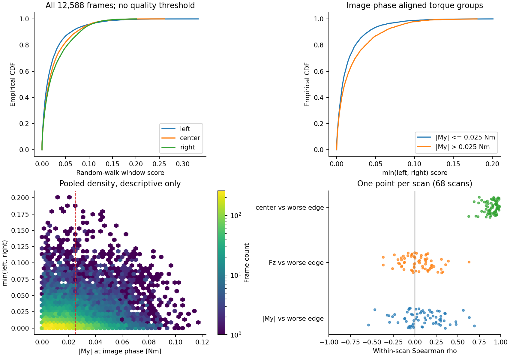
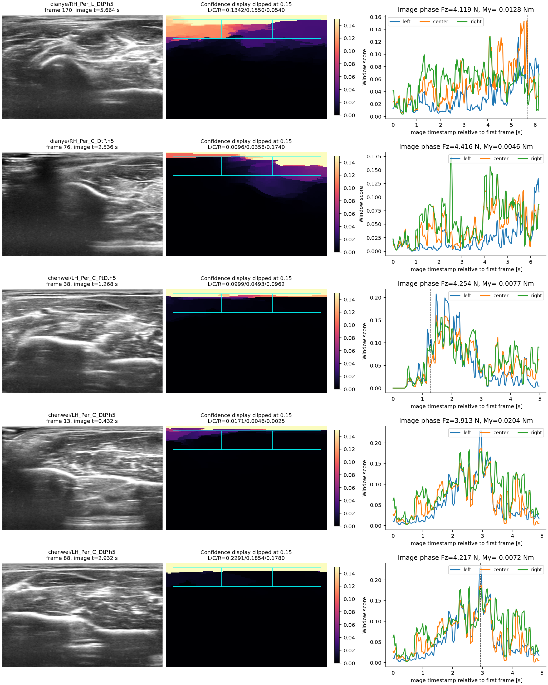

# 真人超声记录的接触信号描述性分析

2026-09-10。本报告分析现有控制器留下的 68 份记录、12,588 帧图像。补偿 My 处于既有 0.025 N·m 死区时，左右图像窗口分数仍覆盖较宽范围；小 My 因而不能替代图像观测。与此同时，当前随机游走分数的绝对尺度尚未校准，低数值不能直接命名为失接触，也不能据此统计缺陷率。这里没有新控制器的真人执行结果。

## 数据、时间与统计口径

输入为 [human_audit/summary.json](human_audit/summary.json) 所列 68 个 `uncalibrated/*.h5` 和对应逐帧 `features.csv`。CSV 全部重读；原 H5 只读核对时间、序号、力和图像元数据。所有图像的提取配置相同，配置 SHA-256 为 `eafec5c5b01b175bc5c702c32e36929e916441a8dce3f97329f0950e95024be2`，窗口版本 `fecfe5c107ef36f7ce31`。本报告没有改质量阈值或特征参数。

- 12,588/12,588 帧已解码、已有特征；提取器的无效帧数为 0。这个有效性检查只识别无灰度变化的 blank/no-image，不能证明每帧声学质量良好。
- 12,277 帧可与配置相位下的 TCP 和力同时匹配，占 **97.529%**。另外 311 帧全部位于各记录起始的连续前缀，每份 4–5 帧；它们保留在图像分布中，排除在力—图像配对统计之外，没有补零或边界外推。
- 图像片段时长合计 417.192 s，单份中位 6.183 s，范围 4.668–7.800 s。这是给定记录片段的时间跨度；不表示所有采集尝试或完整临床操作都已覆盖。
- 68 份均使用 `hflip=false`、crop `[753,1417,154,880]`、664×726、frame_id `us_prob`。元数据一致不能补足图像横轴到物理 TCP 的安装外参。
- 除明确写为“每份扫描”的统计外，分位数与相关系数按帧或原始采样点汇总，较长记录的权重更大。帧之间存在时间相关；不将 12,277 帧当作独立受试样本，不报告逐帧独立性假设下的显著性结论。

原始图像时间减去 0.151963650531 s 用于匹配 TCP，减去 0.151285903358 s 用于匹配力。这里是给定的有效相位偏移，不是本报告重新认证的硬件延迟。未读取 aligned H5，因此没有二次对齐。

| 流 | 样本数 | 相邻时间中位 / p95 / 最大，ms | 相位匹配绝对误差中位 / p95 / 最大，ms | 记录内缺失序号数 |
|---|---:|---:|---:|---:|
| 超声 | 12,588 | 32.085 / 36.038 / 38.350 | — | 0 |
| TCP | 76,993 | 5.278 / 9.781 / 11.827 | 1.399 / 3.345 / 5.062 | 3,726 |
| 补偿力 | 83,857 | 5.067 / 5.534 / 11.198 | 1.292 / 2.491 / 3.795 | 64 |

序号统计在每份文件内部独立计算，三个流都没有非递增序号。无超声 frame_index 缺号只说明本记录编号范围连续，不能排除编号之前的采集/发布丢失。TCP 缺号也不能仅凭 H5 归因于机器人、接收器或记录器。匹配误差是采样网格距离，不是实际同步误差。

既有 audit 的逐帧处理计时包含 JPEG 读取/解码、特征和匹配操作：中位 **33.876 ms**、p95 **34.920 ms**、最大 **65.886 ms**。这是该次离线运行的实测值，不是硬实时上界；显然不适合放入 5 ms 控制线程。配置发布率虽为 60 Hz，本批记录的图像间隔约为 30 Hz；逐帧顺序处理仍需考虑积压与最新帧策略。

## 固定目标力与图像对应力必须分开

原力流全部 83,857 个采样点中，`contact_force_n` 与 `wrench_tcp[:,2]` 逐点完全相同，均为本记录的正压缩标量。当前补偿 Fz 的中位为 **3.996 N**，p5–p95 为 **3.561–4.424 N**；相对既定 4 N 的绝对误差中位 **0.225 N**、p95 **0.500 N**。68 份记录各自 MAE 的等权平均为 **0.232 N**。这些描述已记录补偿信号的跟踪情况，不证明传感器绝对准确度或接触面积。

与图像有效相位配对的 Fz 是历史采样点：中位 **4.001 N**，p5–p95 **3.567–4.423 N**。在同一帧上，把这个历史值与“图像时间戳同一时刻最近的力”比较，绝对差中位 **0.118 N**、p95 **0.472 N**、最大 **1.795 N**。分布看似接近并不允许混用时序：图像解释可以用相位匹配的历史力，在线力控制与能量记账必须用当前力及其有效时间。控制压缩标量也不等于完整六维物理功率端口的符号认证。

## 不设置质量阈值的分布与力矩关系

窗口为归一化图像深度 0.04–0.22，横向 LEFT 0.04–0.34、CENTER 0.34–0.66、RIGHT 0.66–0.96。下表只报告连续分数；`min(L,R)` 是合同要求的两个边缘窗口中较低的分数，不是接触真值。

| 分数 | p5 | p25 | 中位 | p75 | p95 |
|---|---:|---:|---:|---:|---:|
| LEFT | 0.000199 | 0.003282 | 0.010971 | 0.029190 | 0.091691 |
| CENTER | 0.000212 | 0.004450 | 0.014075 | 0.036266 | 0.095495 |
| RIGHT | 0.000220 | 0.004545 | 0.015964 | 0.044113 | 0.098841 |
| min(L,R)，全部帧 | 0.000144 | 0.002568 | 0.008170 | 0.022124 | 0.065946 |
| min(L,R)，My 在死区内 | 0.000130 | 0.002489 | 0.007538 | 0.019718 | 0.056617 |
| min(L,R)，My 在死区外 | 0.000217 | 0.002921 | 0.010191 | 0.029455 | 0.080514 |

配对帧中 **7,879/12,277（64.177%）** 满足 `|My|≤0.025 N·m`，这是现有控制器死区的命中比例，**不是图像缺陷比例**。各份记录该比例范围 34.615%–97.790%，中位 62.333%。死区内分数分布和死区外明显重叠；每份记录死区内 min(L,R) 的四分位距中位仍为 0.01278。My 处于死区不能推出 ωy=0：惯性历史、其它运动轴、路径及内环执行均可能继续产生运动。

| Spearman 相关 | 全帧汇总 | 每份扫描相关的中位 [p25,p75] |
|---|---:|---:|
| \|My\| 与 min(L,R) | 0.101 | 0.084 [−0.055, 0.267] |
| My 与 R−L | 0.091 | 0.057 [−0.088, 0.267] |
| Fz 与 min(L,R) | −0.003 | 0.030 [−0.082, 0.147] |
| CENTER 与 min(L,R) | 0.921 | 0.910 [0.849, 0.948] |

这些是同相位信号的描述性关联。力/力矩相关在扫描间可变号，不能把某个总体系数解释为增力改善图像、或某个旋转符号有效。中心与边缘的高相关也可能包含共同灰度、同一拉普拉斯传播模型及记录间尺度差异，不能视为三个独立传感器相互验证。

中心低于左右两边的纯排序比例为 15.332%，左低于右为 60.637%；这两个数字都没有质量门限含义，也不能映射为物理偏载方向。按当前任务，CENTER 继续只作诊断，LEFT/RIGHT 的要求不能被中心平均值掩盖。



## 代表性帧与分数尺度的限制

下列帧按已有分数的极值/排序确定性选择，仅用于说明现象；不是随机抽样，也不是缺陷类别的频率估计。时间为该 H5 第一幅图像起算的图像时间；力矩均按上述相位匹配。原图、固定色标信心图及完整时间曲线见附图。

| 文件 / 帧 / 时间，s | L / C / R | Fz，N | My，N·m | 可直接描述的现象 |
|---|---|---:|---:|---|
| dianye/RH_Per_L_DtP，170，5.664 | 0.1342 / 0.1550 / 0.0540 | 4.119 | −0.01280 | 死区内中心分数高于右边，不能只看中心概括左右窗口。 |
| dianye/RH_Per_C_DtP，76，2.536 | 0.0096 / 0.0358 / 0.1740 | 4.416 | 0.00457 | 死区内左右分数差异大；原图也有明显横向亮度/纹理差异，但不能据此决定物理旋转正负。 |
| chenwei/LH_Per_C_PtD，38，1.268 | 0.0999 / 0.0493 / 0.0962 | 4.254 | −0.00773 | 中心比两边都低，示例说明 CENTER 不应自动触发本任务的边缘修复。 |
| chenwei/LH_Per_C_DtP，13，0.432 | 0.0171 / 0.0046 / 0.0025 | 3.913 | 0.02042 | 同一扫描死区内较低分数样本，原图仍有可见灰度纹理。 |
| 同文件，88，2.932 | 0.2291 / 0.1854 / 0.1780 | 4.217 | −0.00724 | 同一扫描死区内较高分数样本；两帧的 min(L,R) 从 0.00253 到 0.17796，不能由“小 My”单独区分。 |



检查配对预览可见，信心主要集中在图像顶部，浅层亮条之后往往迅速变暗；即使原图更深处仍有明显纹理，窗口分数也可能很低。这与当前实现的数学结构一致：顶边设为 1、底边为 0，边权使用 `exp(-90*(局部衰减后灰度差+横向惩罚))`，浅层强灰度跳变可能削弱从顶边进入内部的传播。窗口又只覆盖浅层固定比例，亮条位置、crop、显示灰度、衰减和对比参数都能影响数值尺度。这里是对代码与预览一致性的解释，不是对每个暗区成因的识别。

因此 **0.02、0.1 乃至其它未经校准的绝对阈值都不能直接解释为接触失败边界**。无阈值的连续分布揭示了目前特征的尺度和变动范围；它没有给出独立的声学窗口合格标签。真实几何、图像横轴符号、局部受约束动作的效果、边缘声窗可修复性，都不能从这批观测相关性中补证。合成实验里的质量阈值及真实耦合模型也不能自动迁移成这批真人图像的缺陷判据。

## 复现与产物

- [完整数值 statistics.json](human_analysis_artifacts/statistics.json)：分位数、相关、时间、五个事件。
- [逐扫描统计及输入 CSV 哈希](human_analysis_artifacts/scan_statistics.json)：可核对个体记录权重、边界覆盖及相关方向。
- [只读分析/绘图脚本](human_analysis_artifacts/analyze.py)：只写本目录 JSON 和 PNG，不修改 H5、特征 CSV 或控制代码。

在仓库根目录执行：

```bash
/media/camp/EXT_DRIVE/envs/genesis/bin/python MD/contact_qp/human_analysis_artifacts/analyze.py
```

该分析支持保留独立图像观测、审计图像时间与力时间、并检查中心/边缘分离。新 QP 是否改善有效覆盖、是否保持力精度，仍由合同规定的独立闭环实验验收；这份真人回放不是新控制器疗效或接触安全证明。
