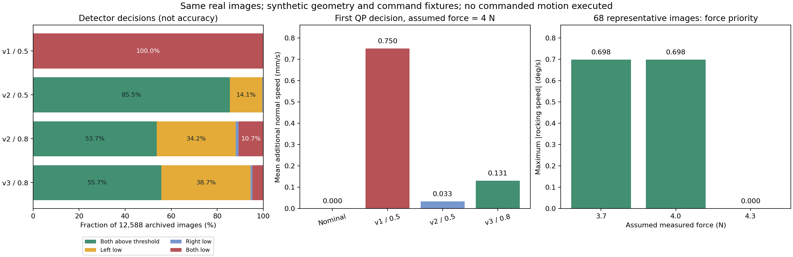
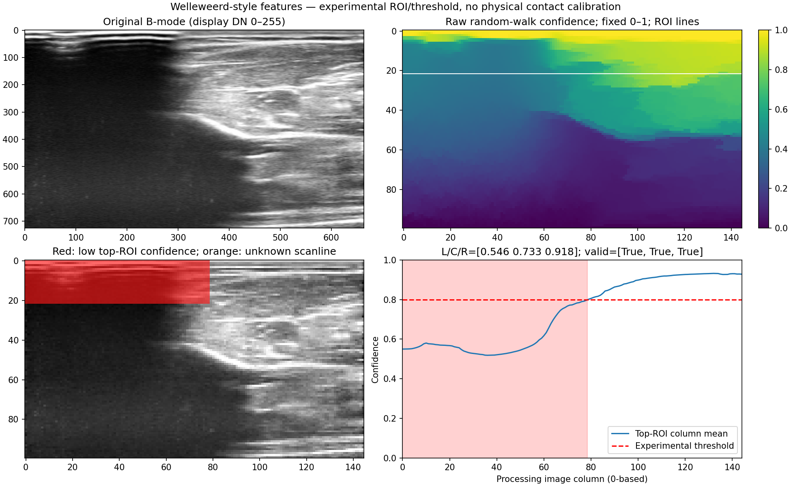

# 同批真人图像的新旧检测与 QP 决策验证

日期：2026-09-10。沿用已冻结的 68 段、12,588 帧原始 H5，未删除失败或低质量帧，未改源数据。本轮没有连接或启动机器人。

结论：新版恢复了有区分度的声窗检测，已知漏检例能触发朝缺失侧的修复建议；正常窗口在本次静态工况中保持原命令。它支持进入真机特性验证，但不能证明尚未执行的新命令改善了真实接触，也没有通过真实力精度的零退化验收。



## 1. 同帧检测结果

| 实现 / 判定阈值 | 左右均达阈值 | 仅左不足 | 仅右不足 | 双侧不足 |
|---|---:|---:|---:|---:|
| 旧 v1 / 0.5 | 0 | 0 | 0 | 12,588（100%） |
| CAMP v2 / 0.5 | 10,767（85.53%） | 1,775（14.10%） | 37（0.29%） | 9（0.07%） |
| CAMP v2 / 0.8，阈值对照 | 6,766（53.75%） | 4,310（34.24%） | 165（1.31%） | 1,347（10.70%） |
| Welleweerd profile v3 / 0.8 | 7,014（55.72%） | 4,877（38.74%） | 112（0.89%） | 585（4.65%） |

这是**检测决策分布，不是准确率**。没有逐帧接触真值，不能把“判成好图更多”或“判成坏图更多”直接当检测更准。中央窗口只记录，未用于上述类别。该批数据没有未知的必需窗口；这不代表全都贴合。

v1 在这一阈值下已饱和为全部双侧不足，无法给 QP 提供有效侧别信息。v2 修正 random-walk 后，沿用 0.5 对已知缺失例过于宽松。v3 使用论文风格的顶端 ROI confidence 聚合；**0.8 和 ROI 深度 22% 是本项目实验初值，论文没有给出这两个数值**。同为 0.8 的 v2 对照表明，不能把阈值变化带来的全部差异归功于更换 confidence map。

当前输出是图像列/声窗的低 confidence、达阈值和未知划分，并非已标定的物理贴合标签；阴影与不贴合仍可能产生相似声学缺失。全黑无动态范围输入另标未知，不能凭 random-walk 边界条件产生的高值宣布贴合。

## 2. 一个已知漏检例

`chenwei/RH_Per_C_PtD.h5:95` 的原图左侧大面积缺失，右侧保留组织信号：



| 项目 | v2 / 0.5 | v3 / 0.8 |
|---|---:|---:|
| 左 / 右 confidence | 0.549 / 0.866 | 0.546 / 0.918 |
| 判定 | 左右均达阈值，未请求修复 | 左侧不足 |
| 新增法向速度 | 0 | 0.366 mm/s |
| rocking | 0 | 0.590°/s，朝左侧增加加载 |
| 左 / 右局部法向速度 | 0 / 0 | 0.525 / 0.206 mm/s |
| α | 1 | 0.762 |

数值来自同一批主诊断的 4 N 工况，使用下节声明的仿真外参。说明的是“漏检例现在产生了方向合理的动作建议”，不是右侧一定保持真实图像质量，也不是该动作已经执行、修好了左侧。该例两个版本的左侧分数接近，触发变化主要来自阈值。

## 3. 外环修正是否更有针对性

每帧使用完全相同的静态输入，分别送入 nominal、v1、v2、v3，共 **50,352 次决策，全部成功**。

- v3 判为左右均达阈值的 **7,014 / 7,014 帧**保持 `v_n=0、ω=0、α=1`，在此工况下没有额外修复。
- **4,877 / 4,877 左单侧不足**与 **112 / 112 右单侧不足**给出相应方向的 rocking。几何左右仍需在实物上核对。
- v3 的 5,462 个左低窗口和 697 个右低窗口均有正的新增局部法向速度；这是控制意图，不是声学恢复成功率。
- v1 几乎一直将新增法向速度推到孔径预算上限；v3 将动作集中在有请求的窗口。

| 同一 4 N 静态工况 | 原名义指令 | v1 / 0.5 | v2 / 0.5 | v3 / 0.8 |
|---|---:|---:|---:|---:|
| 平均新增法向速度，mm/s | 0 | 0.750 | 0.033 | 0.131 |
| 平均首拍 α | 1 | 0.750 | 0.981 | 0.926 |
| 最大 rocking 绝对值，°/s | 0 | 0.105 | 0.709 | 0.710 |

主测试 v3 最大硬约束数值违反为 `3.05e-12`。QP 决策总耗时中位数 0.247 ms、P99 0.516 ms、最大 1.099 ms；这只测离线构造/求解，不含完整硬件循环，不能代替 5 ms 系统实时性验收。v1 同批存在一次 10.54 ms 长尾，保留在原始输出中。

### 测试假设与证据范围

本次逐帧独立求解第一拍，**没有将新命令积分成后续轨迹，也没有让原有录像对未执行动作作出响应**：

- TCP-face 为合成单位变换、半孔径 25 mm、图像方向 +1，均未声称是真实标定。
- 当前力假设为 4 N；没有把旧图像对齐力冒充新控制器的实时力。
- 名义路径速度为 `[0, 0.02, 0, 0, 0, 0]`，法向与 rocking 为零；步长 5 ms，上一拍等于名义速度。首拍加速度约束使 α 不小于 0.75，因此表中 α **不是稳态扫描速度或完成时间**。
- 图像年龄固定 0.16 s；不构成实际传输延迟/异步运动历史回放。
- 名义对照显式关闭图像任务和坏图推进损失，并非在线“图像丢失时继续原速”的实现。
- 能量约束关闭，未提供真实端口功历史；此实验不验证能量性质。
- 没有匹配真实执行速度/转动预算的闭环对照；不能据此宣称缺口长度、力 RMSE 或有效覆盖提高。

## 4. 发现的真实限制：过力时修复受到压制

每段固定取中间一帧，共 68 帧；分别用 3.7、4.0、4.3 N 以及零法向/示例力恢复两种名义输入，完成 **1,632 次决策**。代表帧选择不依赖新版质量或动作结果。

在 4.3 N 时，这些 v3 工况新增修复基本为零，最大 rocking 低于 `1e-10 rad/s`；若名义力恢复速度为 −0.6 mm/s，新外环保留该退让。3.7 / 4.0 N 的零法向对照仍可产生最大约 0.698°/s 的 rocking。

原因是当前严格的力优先条件：力误差为正时，新增动作在完整孔径两端都不能增加法向加载。为了压下欠缺的一侧而进行 rocking，另一部分法向组合可能违反该限制；代价折中后这些样例选择不加修复。**这是最优动作归零，不等于所有可行角速度区间都变成零**；三层可行区间已保留在 force-sweep JSONL。

所以图像检测修好后，实机上仍可能看到“已识别缺失，但 ω 很小”。应同时查看实际力误差、活跃的力优先行、孔径预算、松弛量和最终/实测运动。增大图像增益不能突破硬约束。本轮不偷偷放松既定力精度优先要求；先在实际 4 N 附近记录这种限制占比，再决定是否有证据支持缩小接触模型不确定性。

## 5. 真机入口与下一步

原 `ICRA_YM/script/run.sh record` 已接通 `--contact-qp-config`，继续使用原示教、prepare、4 N 寻触、监督停止和 H5 保存。每次 attempt 有独立 JSONL 和配置 metadata。

**可立即由用户运行的是 baseline：原控制器运动 + 新 confidence 记录。** 外环 active 还需真实孔径、TCP 外参、图像左右、registration 与测量源时限。已有参数不重复询问，未知物理量不使用仿真值冒充。

完整启动命令、从 baseline 提取实际配置的方法、shadow → active 的同入口命令及配对实验指标见 [真机运行说明](HARDWARE_TEST_RUNBOOK_V5.md)。首轮 baseline/active 对照保持同路径、4 N、相同扫描速度；实际运动和配准后的图像响应用于判断修复是否有效。

本轮流程验证成功保存 12 条模拟 H5，均标记 `simulated_workflow_only_no_qp`。这验证录制/路由，不假造 QP 闭环效果。

## 6. 重现与原始结果

工作目录均为 `/media/camp/EXT_DRIVE/RealUS_playground`。

```bash
env PYTHONNOUSERSITE=1 OPENBLAS_NUM_THREADS=1 OMP_NUM_THREADS=1 \
  PYTHONPATH="$PWD:$PWD/rm75_control" \
  /media/camp/EXT_DRIVE/envs/genesis/bin/python \
  scripts/extract_contact_replay_features.py --workers 6 \
  --output MD/contact_qp/replay_v5
```

提取器对已有 per-scan 结果核对源大小/时间、配置/代码与校验和后复用；配置变化须用新输出目录。

```bash
env PYTHONNOUSERSITE=1 OPENBLAS_NUM_THREADS=1 OMP_NUM_THREADS=1 \
  PYTHONPATH="$PWD:$PWD/rm75_control:/media/camp/EXT_DRIVE/envs/rm75/lib/python3.10/site-packages/cmeel.prefix/lib/python3.10/site-packages" \
  LD_LIBRARY_PATH=/media/camp/EXT_DRIVE/envs/rm75/lib/python3.10/site-packages/cmeel.prefix/lib \
  /media/camp/EXT_DRIVE/envs/rm75/bin/python \
  scripts/evaluate_contact_qp_replay.py \
  --input MD/contact_qp/replay_v5/features.jsonl \
  --output /tmp/contact_qp_main_repeat --forces 4 --nominal-modes isolated
```

力工况复现使用同一 Python 环境，将末四行改为：

```bash
  scripts/evaluate_contact_qp_replay.py \
  --input MD/contact_qp/replay_v5/representatives.jsonl \
  --output /tmp/contact_qp_force_repeat --intervals
```

原始产物：

- [检测统计](replay_v5/detection_summary.json)、[同帧特征](replay_v5/features.jsonl)、[提取身份](replay_v5/extraction_identity.json)。全量提取 208.78 s；v1 使用已冻结 CSV，v2/v3 均处理原 JPEG。
- [全量 QP 汇总](replay_v5/qp_main/summary.json)、[逐次决策](replay_v5/qp_main/qp_diagnostics.jsonl)、[透明性/方向/示例细节](replay_v5/behavior_details.json)。50,352 次决策总运行 49.21 s。
- [力工况汇总](replay_v5/qp_force_sweep/summary.json)、[逐次工况与可行区间](replay_v5/qp_force_sweep/qp_diagnostics.jsonl)。1,632 次决策总运行 2.12 s。
- [图表 PDF](replay_v5/comparison_overview.pdf)、[入口 ultra 审核](review_scan_entry_v5.md)。

本轮保留 V4 原交付与能量证据，未用本次离线数据扩张其证明范围；最终检查与 V5 变更身份另记于 `VALIDATION_V5.md` 和 `source_manifest_v5.json`。
