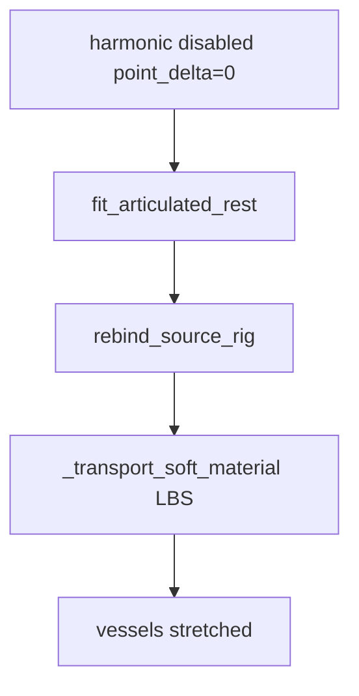

# Anatomy Retarget — commit `f820164` 完整代码归档

> 生成时间: 2026-07-18 01:21:43
> Git commit: `f820164b9927df4f61e84cd0bd59cf87baa4d9ff`
> Commit message: 血管炸修不好
> 仓库根目录: `/media/camp/EXT_DRIVE/RealUS_playground`
> 对比: `MD/debug_old.md`（0a21d7bd）、`MD/debug.md`（当前 v5.7）
>
> 本文档前半部分为**原理说明**（此 commit 实际行为）；后半部分**一字不差**复制该 commit 下全部 anatomy 相关源码。

---

## 0. 此版本特征（「血管炸修不好」）

| 项目 | **f820164** | 0a21d7bd | 当前 v5.7 |
|------|-------------|----------|-----------|
| 核心骨 fit | **`material_fit.fit_articulated_rest`** | harmonic + rigid preserve | `segment_length_fit` |
| 软组织 β transport | **禁用**（`soft_beta_transport: disabled`） | 完整 harmonic β | harmonic β + segment fit |
| 软组织跟随 | **`_transport_soft_material`**（driver LBS 拖软组织） | 仅 harmonic | Laplacian 骨残差（非 LBS posing） |
| `segment_length_fit.py` | 无 | 无 | 有 |
| cache | `source_template_v6` / articulated-material-fit | v5 | v5.7 integration |
| `anatomy_semantics.yaml` | **无** | 有 | 有 |
| 手/脚 | material_fit 内 hand shaft + foot igl | 无专门 fit | segment_length per-component |

**历史评价：** 手/脚相对更好，但 `_transport_soft_material` 把 bone driver 变换混到血管/器官 → **血管拉丝/爆炸**；shape 阶段甚至把 harmonic point_delta 置零，软组织不走 β cage。

---

## 1. 总览流水线（f820164）

```
Blender bake (RBF) → source_skin_volume (raw source + single material fit mode)
    ▼
apply_subject_beta_shape
    │  建 cage 但 soft_beta_transport **disabled**
    │  point_delta = 0；protected 骨/颅顶点不动
    │  fit_articulated_rest（material_fit.py）
    │      刚性 compound + 手/脚/长骨/脊椎/胸
    │      rebind_source_rig
    │      _transport_soft_material ← 血管灾难主因
    ▼
repair_containment(repair_tissues=()) + soft residual
    ▼
Genesis publish（可选）
```

---

## 2. Blender 接口

- **`blender_retarget_runner.py`**：headless Blender
- **`blender_retarget_script.py`**：Procrustes + RBF、driver 导出
- **`blender_rig_inspect.py`**：rig 调试

---

## 3. 配置

- 仅 **`anatomy_retarget.yaml`**（无 `anatomy_semantics.yaml`）
- **`rigged_asset.py`**：NPZ schema

---

## 4. 形变核心

### 4.1 `shape_volume.py`

- TetGen cage 仍建，但 **不对软组织应用 β harmonic 位移**（`point_delta` 全零）
- protected = bone_material | cranial_material 保持原位
- 调用 **`fit_articulated_rest`**

### 4.2 `material_fit.py`（此 commit 完整实现）

**希望实现的功能：**

- 按 semantic joint / material group 拟合刚性解剖（颅/盆/手/脚/长骨/脊椎/胸）
- **`rebind_source_rig`** 更新 bind
- **`_transport_soft_material`**：对非骨/non-cranial 顶点，用 **driver weights × bone global transforms** 混合位移（伪刚性 LBS）→ 器官/血管被骨 delta 拖拽

### 4.3 `containment.py`

SDF 内推；CLI `repair_tissues=()`。

---

## 5. Genesis 发布

- **`genesis_control.py` + `anatomy_drawer.py`**：ZMQ 5601 upsert，tissue 顶点色
- **`perception/apps/run_anatomy_retarget.py`**：包装 CLI

---

## 6. 血管/骨导出

- **`run_export_vessel_segments.py`** → `limb_vessel_planning/`

---

## 7. 数据流（此 commit 问题点）



---

## 8. 源码索引（共 58 个文件）

| # | 路径 | 首行摘要 |
|---|------|----------|
| 1 | `configs/anatomy/anatomy_retarget.yaml` | blend_path: /media/camp/EXT_DRIVE/tmp/Skeleton_Anatomy_Nervous_Rigged_Blend_2-81/Skeleton_ |
| 2 | `perception/apps/run_anatomy_retarget.py` | #!/usr/bin/env python3 |
| 3 | `src/projects/genesis_ue_sync/anatomy_retarget/blender_retarget_runner.py` | """Headless Blender runners for anatomy retargeting tasks.""" |
| 4 | `src/projects/genesis_ue_sync/anatomy_retarget/blender_scripts/blender_retarget_script.py` | """Retarget a rigged anatomy Blender asset to a SMPL-X canonical rest bundle. |
| 5 | `src/projects/genesis_ue_sync/anatomy_retarget/blender_scripts/blender_rig_inspect.py` | """Inspect the anatomy Blender rig and write a JSON report. |
| 6 | `src/projects/genesis_ue_sync/anatomy_retarget/rigged_asset.py` | """Schema helpers for anatomy meshes driven by SMPL-X through a source rig.""" |
| 7 | `src/projects/genesis_ue_sync/anatomy_retarget/obj_io.py` | """Minimal Wavefront OBJ read/write helpers for anatomy retarget previews.""" |
| 8 | `src/projects/genesis_ue_sync/anatomy_retarget/asset_align.py` | """Scale and align Blender-exported anatomy vertices to canonical SMPL-X rest space.""" |
| 9 | `src/projects/genesis_ue_sync/anatomy_retarget/canonical_export.py` | """Export subject-beta SMPL-X T-pose assets for anatomy retargeting.""" |
| 10 | `src/projects/genesis_ue_sync/anatomy_retarget/pose_adapter.py` | """Pose vector adapters for anatomy assets driven by SMPL/SMPL-X streams.""" |
| 11 | `src/projects/genesis_ue_sync/anatomy_retarget/anatomy_lbs.py` | """Skin retargeted anatomy assets with rigid LBS bones and soft-tissue DQS for organs.""" |
| 12 | `src/projects/genesis_ue_sync/anatomy_retarget/source_rebind.py` | """Keep Blender source-bone bind frames consistent with rest-space warps.""" |
| 13 | `src/projects/genesis_ue_sync/anatomy_retarget/source_skin_volume.py` | """Offline Skin_Glass -> neutral SMPL-X volumetric registration. |
| 14 | `src/projects/genesis_ue_sync/anatomy_retarget/shape_volume.py` | """TetGen/FEM harmonic subject-beta deformation for internal anatomy.""" |
| 15 | `src/projects/genesis_ue_sync/anatomy_retarget/material_fit.py` | """Shape-preserving articulated rest fitting for anatomy schema v5. |
| 16 | `src/projects/genesis_ue_sync/anatomy_retarget/containment.py` | """Read-only containment diagnostics against an SMPL-X skin surface. |
| 17 | `src/projects/genesis_ue_sync/anatomy_retarget/quality_gate.py` | """Strict, publication-blocking quality checks for SMPL-X anatomy assets.""" |
| 18 | `src/projects/genesis_ue_sync/anatomy_retarget/diagnostics.py` | """Mesh-level anatomy diagnostics for review outside the realtime viewer.""" |
| 19 | `src/projects/genesis_ue_sync/anatomy_retarget/bone_segment_diagnostics.py` | """Bone-chain, joint-anchor, and ligament classification diagnostics. |
| 20 | `src/projects/genesis_ue_sync/anatomy_retarget/anatomy_drawer.py` | """Genesis debug-mesh drawer for retargeted anatomy assets.""" |
| 21 | `src/projects/genesis_ue_sync/anatomy_retarget/viz_overlay.py` | """Matplotlib overlay helpers for anatomy / SMPL preview figures.""" |
| 22 | `src/projects/genesis_ue_sync/anatomy_retarget/planning_overlay.py` | """Genesis debug overlay for vessel planning assets (tube meshes, centerlines, point cloud |
| 23 | `src/projects/genesis_ue_sync/anatomy_retarget/genesis_control.py` | """Genesis-side registry and ZMQ subscriber for anatomy assets.""" |
| 24 | `src/projects/genesis_ue_sync/anatomy_retarget/leg_material.py` | """Stable leg material coordinates for scan anatomy diagnostics.""" |
| 25 | `src/projects/genesis_ue_sync/anatomy_retarget/leg_volume_coordinates/__init__.py` | """Canonical SMPL leg volumetric coordinate utilities.""" |
| 26 | `src/projects/genesis_ue_sync/anatomy_retarget/leg_volume_coordinates/paths.py` | """Canonical on-disk layout for leg volume coordinate datasets.""" |
| 27 | `src/projects/genesis_ue_sync/anatomy_retarget/leg_volume_coordinates/io.py` | """Mesh and centerline I/O for leg volume coordinate baking.""" |
| 28 | `src/projects/genesis_ue_sync/anatomy_retarget/leg_volume_coordinates/pose_bundle.py` | """Pose-aware coordinate bundle utilities for canonical SMPL leg charts. |
| 29 | `src/projects/genesis_ue_sync/anatomy_retarget/leg_volume_coordinates/lbs_bridge.py` | """Generic LBS bridge for pose-aware canonical/real coordinate conversion. |
| 30 | `src/projects/genesis_ue_sync/anatomy_retarget/leg_volume_coordinates/harmonic.py` | """Harmonic leg volume fields: surface Laplace-Beltrami and 3D FEM Dirichlet solves.""" |
| 31 | `src/projects/genesis_ue_sync/anatomy_retarget/leg_volume_coordinates/projection.py` | """Project anatomy vessel centerlines into canonical SMPL leg volume coordinates.""" |
| 32 | `src/projects/genesis_ue_sync/anatomy_retarget/leg_volume_coordinates/atlas.py` | """SMPL canonical left/right leg volumetric coordinate atlases.""" |
| 33 | `src/projects/genesis_ue_sync/anatomy_retarget/leg_volume_coordinates/butterfly.py` | """Interpolatory Butterfly-style subdivision for leg material surfaces. |
| 34 | `src/projects/genesis_ue_sync/anatomy_retarget/leg_volume_coordinates/layered_surface.py` | """Extract native d=0 skin from structured layered Laplace volume grids.""" |
| 35 | `src/projects/genesis_ue_sync/anatomy_retarget/leg_volume_coordinates/surface_refine.py` | """Surface precision refinement for canonical leg charts. |
| 36 | `src/projects/genesis_ue_sync/anatomy_retarget/leg_volume_coordinates/volume_refine.py` | """Volume precision refinement for canonical leg charts. |
| 37 | `src/projects/genesis_ue_sync/anatomy_retarget/leg_volume_coordinates/visualize.py` | """Diagnostic figures for leg volume coordinates.""" |
| 38 | `src/projects/genesis_ue_sync/anatomy_retarget/cli/run_anatomy_retarget.py` | #!/usr/bin/env python3 |
| 39 | `src/projects/genesis_ue_sync/anatomy_retarget/cli/run_export_canonical_tpose.py` | #!/usr/bin/env python3 |
| 40 | `src/projects/genesis_ue_sync/anatomy_retarget/cli/run_inspect_anatomy_rig.py` | #!/usr/bin/env python3 |
| 41 | `src/projects/genesis_ue_sync/anatomy_retarget/cli/run_anatomy_asset_control.py` | #!/usr/bin/env python3 |
| 42 | `src/projects/genesis_ue_sync/anatomy_retarget/cli/run_export_pose_preview.py` | """Offline preview exporter: skin the retargeted anatomy with a terminal-8 SMPL-X fit. |
| 43 | `src/projects/genesis_ue_sync/anatomy_retarget/cli/run_export_vessel_segments.py` | """Export artery/vein planning segments and skeleton OBJs from the retargeted anatomy asse |
| 44 | `src/projects/genesis_ue_sync/anatomy_retarget/cli/run_project_vessels_to_leg_skin.py` | #!/usr/bin/env python3 |
| 45 | `src/projects/genesis_ue_sync/anatomy_retarget/cli/run_bake_leg_volume_coordinates.py` | #!/usr/bin/env python3 |
| 46 | `src/projects/genesis_ue_sync/anatomy_retarget/cli/run_bake_leg_volume_laplace3d.py` | #!/usr/bin/env python3 |
| 47 | `src/projects/genesis_ue_sync/anatomy_retarget/cli/run_bake_leg_volume_ultimate.py` | #!/usr/bin/env python3 |
| 48 | `src/projects/genesis_ue_sync/anatomy_retarget/cli/run_export_layered_laplace3d_fm_atlas.py` | #!/usr/bin/env python3 |
| 49 | `src/projects/genesis_ue_sync/anatomy_retarget/cli/run_package_leg_volume_production.py` | #!/usr/bin/env python3 |
| 50 | `src/projects/genesis_ue_sync/anatomy_retarget/cli/run_validate_leg_precision.py` | #!/usr/bin/env python3 |
| 51 | `src/projects/genesis_ue_sync/anatomy_retarget/cli/__init__.py` | """Command line entry points for anatomy retargeting.""" |
| 52 | `src/projects/genesis_ue_sync/anatomy_retarget/__init__.py` | """Offline anatomy retargeting utilities for the Genesis/SMPL-X pipeline.""" |
| 53 | `tests/test_anatomy_cli_quality_mode.py` | from __future__ import annotations |
| 54 | `tests/test_anatomy_dqs.py` | from __future__ import annotations |
| 55 | `tests/test_anatomy_hand_chain_and_colors.py` | from __future__ import annotations |
| 56 | `tests/test_anatomy_quality_gate_regressions.py` | from __future__ import annotations |
| 57 | `tests/test_anatomy_retarget_e2e.py` | from __future__ import annotations |
| 58 | `tests/test_anatomy_soft_containment.py` | from __future__ import annotations |

---

## 9. 完整源码（verbatim，commit `f820164b9927df4f61e84cd0bd59cf87baa4d9ff`）


### 文件: `configs/anatomy/anatomy_retarget.yaml`

```yaml
blend_path: /media/camp/EXT_DRIVE/tmp/Skeleton_Anatomy_Nervous_Rigged_Blend_2-81/Skeleton_Anatomy_Nervous_Rigged_Blend_2-81/Skeleton_Anatomy_Nervous_Rigged_2-81.blend

include_collections:
  - Cardiovascular_Sys
  - Nervous_Sys
  - Respiratory_Sys
  - Digestive_Sys
  - Urinary_Sys
  - Skeletal_Sys

# Bones are rigid anatomy pieces. v4 keeps Blender sparse weights for long
# bones/limbs (preserve_source_weights) while smaller rigid pieces may still
# collapse to a single SMPL-X joint via rigid_mesh_to_smplx.
rigid_collections:
  - Skeletal_Sys

preserve_source_weights:
  - Humerus_L
  - Humerus_R
  - Radius_L
  - Radius_R
  - Ulna_L
  - Ulna_R
  - Femur_L
  - Femur_R
  - Tibia_L
  - Tibia_R
  - Fibula_L
  - Fibula_R
  - Patella_L
  - Patella_R
  - Interspinous_Ligament
  - Supraspinous_Ligament
  - Nuchal_Ligament

rigid_mesh_to_smplx: {}

exclude_meshes:
  - Body
  - Skin_Glass
  # Combined cardiovascular duplicate; keep separate Artery/Vein meshes for planning labels.
  - UNCUT_Cardiovascular

coordinate_transform: blender_y_up_to_genesis_z_up
blender_unit_scale: 0.01
canonical_rest_space: neutral
fallback_joint: pelvis
max_influences: 4
fail_on_unmapped_groups: true
default_transparent_alpha: 0.35

anatomy_to_smplx:
  Skeleton_SRT: pelvis
  Hip_bone: pelvis
  Hip_Organ_Hold_L: pelvis
  Hip_Organ_Hold_L1: pelvis
  Hip_Organ_Hold_L2: pelvis
  Hip_Organ_Hold_R: pelvis
  Hip_Organ_Hold_R1: pelvis
  Hip_Organ_Hold_R2: pelvis

  Femur_Rot_L: left_hip
  Knee_Rotate_L: left_knee
  Tibia_Bone_L: left_knee
  Tibia_Twist_L: left_ankle
  Ankle_Rot_L: left_ankle
  Arch_Rot_L: left_foot
  Patella_Rotate_L: left_knee

  Femur_Rot_R: right_hip
  Knee_Rotate_R: right_knee
  Tibia_Bone_R: right_knee
  Tibia_Twist_R: right_ankle
  Ankle_Rot_R: right_ankle
  Arch_Rot_R: right_foot
  Patella_Rotate_R: right_knee

  Spine_L5: spine1
  Spine_L4: spine1
  Spine_L3: spine1
  Spine_L2: spine2
  Spine_L1: spine2
  Spine_T12: spine2
  Spine_T11: spine2
  Spine_T10: spine2
  Spine_T9: spine2
  Spine_T8: spine3
  Spine_T7: spine3
  Spine_T6: spine3
  Spine_T5: spine3
  Spine_T4: spine3
  Spine_T3: spine3
  Spine_T2: spine3
  Spine_T1: spine3

  Spine_C7: neck
  Spine_C6: neck
  Spine_C5: neck
  Spine_C4: neck
  Spine_C3: neck
  Spine_C2: neck
  Spine_C1: neck
  Head_Bone: head
  Jaw_Bone_base: jaw
  Jaw_Bone_tip: jaw

  Sternum_Bone: spine3
  Heart_Bone: spine3

  Clavicle_Rot_L: left_collar
  Shoulder_Rotate_L: left_shoulder
  Elbow_Rot_L: left_elbow
  Forearm_Bone_L: left_elbow
  Forearm_Twist_L: left_wrist
  Wrist_Rotate_L: left_wrist
  Scapula_Bone_L: left_shoulder

  Clavicle_Rot_R: right_collar
  Shoulder_Rotate_R: right_shoulder
  Elbow_Rot_R: right_elbow
  Forearm_Bone_R: right_elbow
  Forearm_Twist_R: right_wrist
  Wrist_Rotate_R1: right_wrist
  Scapula_Bone_R: right_shoulder

  # The source rig numbers phalanges from fingertip toward the wrist.  Map by
  # hierarchy depth (proximal/middle/distal), not by the misleading suffix.
  Fingers_Rotate_L4: left_index1
  Finger_Index_L3: left_index1
  Fingers_Rotate_L9: left_index2
  Finger_Index_L2: left_index2
  Fingers_Rotate_L12: left_index3
  Finger_Index_L1: left_index3
  Fingers_Rotate_L3: left_middle1
  Finger_Middle_L3: left_middle1
  Fingers_Rotate_L8: left_middle2
  Finger_Middle_L2: left_middle2
  Fingers_Rotate_L13: left_middle3
  Finger_Middle_L1: left_middle3
  Fingers_Rotate_L1: left_pinky1
  Finger_Pinky_L3: left_pinky1
  Fingers_Rotate_L6: left_pinky2
  Finger_Pinky_L2: left_pinky2
  Fingers_Rotate_L15: left_pinky3
  Finger_Pinky_L1: left_pinky3
  Fingers_Rotate_L2: left_ring1
  Finger_Ring_L3: left_ring1
  Fingers_Rotate_L7: left_ring2
  Finger_Ring_L2: left_ring2
  Fingers_Rotate_L14: left_ring3
  Finger_Ring_L1: left_ring3
  Fingers_Rotate_L5: left_thumb1
  Finger_Thumb_L3: left_thumb1
  Fingers_Rotate_L10: left_thumb2
  Finger_Thumb_L2: left_thumb2
  Fingers_Rotate_L11: left_thumb3
  Finger_Thumb_L1: left_thumb3

  # The right hand uses anonymous Blender bone names, so the complete hierarchy
  # is intentionally explicit. This also makes an asset fail visibly if the
  # source blend changes instead of silently inheriting the wrist driver.
  Fingers_Rotate_R4: right_index1
  bone309: right_index1
  Finger_Rotate_R4: right_index2
  bone311: right_index2
  Fingers_Rotate_R7: right_index3
  bone313: right_index3
  Fingers_Rotate_R3: right_middle1
  bone315: right_middle1
  Finger_Rotate_R3: right_middle2
  bone317: right_middle2
  Fingers_Rotate_R8: right_middle3
  bone319: right_middle3
  Fingers_Rotate_R1: right_pinky1
  bone327: right_pinky1
  Finger_Rotate_R1: right_pinky2
  bone329: right_pinky2
  Fingers_Rotate_R10: right_pinky3
  bone331: right_pinky3
  Fingers_Rotate_R2: right_ring1
  bone321: right_ring1
  Finger_Rotate_R2: right_ring2
  bone323: right_ring2
  Fingers_Rotate_R9: right_ring3
  bone325: right_ring3
  Fingers_Rotate_R5: right_thumb1
  bone303: right_thumb1
  Finger_Rotate_R5: right_thumb2
  bone305: right_thumb2
  Fingers_Rotate_R6: right_thumb3
  bone307: right_thumb3

# Subject overrides are applied in the compound group's local frame.  The
# deterministic fit does not accept world-space offsets or axis-only scaling.
fit_overrides:
  skull:
    scale_multiplier: 1.0
    center_offset_local_m: [0.0, 0.0, 0.0]
  pelvis:
    scale_multiplier: 1.0
    center_offset_local_m: [0.0, 0.0, 0.0]

quality_gate:
  weight_sum_error: 1.0e-5
  anchor_rms_m: 0.010
  anchor_max_m: 0.020
  edge_ratio_max: 3.0
  edge_ratio_p999: 1.5
  inside_fraction: 0.995
  max_outside_m: 0.002
  critical_max_outside_m: 0.001
```

### 文件: `perception/apps/run_anatomy_retarget.py`

```py
#!/usr/bin/env python3
"""Terminal 9 wrapper: anatomy retarget + optional vessel/bone export."""

from __future__ import annotations

import argparse
import os
import runpy
import sys
from pathlib import Path


def _smplx_output_root(repo: Path) -> Path:
    return Path(os.environ.get("REALUS_SMPLX_OUTPUT_ROOT", repo / "smplx_outputs"))


def _latest_smplx_npz(repo: Path) -> Path | None:
    fit = _smplx_output_root(repo)
    if not fit.is_dir():
        return None
    runs = sorted([p for p in fit.iterdir() if p.is_dir()], key=lambda p: p.stat().st_mtime, reverse=True)
    for run in runs:
        cand = run / "moment_0000" / "smplx_result.npz"
        if cand.is_file():
            return cand
    return None


def _run_smplx_npz(repo: Path, run: str) -> Path:
    run_path = Path(run)
    if not run_path.is_absolute():
        run_path = _smplx_output_root(repo) / run_path
    candidate = run_path / "moment_0000" / "smplx_result.npz"
    if not candidate.is_file():
        raise FileNotFoundError(f"smplx_result.npz not found for --run {run}: {candidate}")
    return candidate


def main() -> int:
    repo = Path(os.environ.get("REALUS_PROJECT_ROOT", Path(__file__).resolve().parents[2]))
    os.chdir(repo)
    sys.path.insert(0, str(repo / "src"))

    ap = argparse.ArgumentParser(description=__doc__)
    ap.add_argument("--config", type=Path, default=repo / "configs/anatomy/anatomy_retarget.yaml")
    ap.add_argument("--run", type=str, default="", help="Capture run whose gender/betas must match anatomy and track")
    ap.add_argument("--gender", choices=["male", "female", "neutral"], default="male")
    ap.add_argument("--device", choices=["cpu", "cuda", "auto"], default="auto")
    ap.add_argument("--canonical-dir", type=Path, default=repo / "outputs/anatomy_retarget/latest_canonical")
    ap.add_argument("--output-dir", type=Path, default=repo / "outputs/anatomy_retarget/latest_asset")
    ap.add_argument("--publish-bind", type=str, default="tcp://127.0.0.1:5601")
    ap.add_argument("--publish-duration-s", type=float, default=5.0)
    ap.add_argument("--publish-genesis", action="store_true", default=True)
    ap.add_argument("--export-vessels", action="store_true", help="Also run leg vessel centerline + thigh bone export")
    args, unknown = ap.parse_known_args()

    exact_fit: Path | None = None
    if args.run:
        exact_fit = _run_smplx_npz(repo, args.run)
        from projects.genesis_ue_sync.anatomy_retarget.canonical_export import export_canonical_tpose, load_betas
        from projects.genesis_ue_sync.anatomy_retarget.pose_adapter import smplx_shape_hash

        betas = load_betas(exact_fit)
        shape_hash = smplx_shape_hash(betas, gender=args.gender)
        canonical_cache = repo / "outputs/anatomy_retarget/canonical_cache" / shape_hash
        manifest = canonical_cache / "source_manifest.json"
        if not manifest.is_file():
            export_canonical_tpose(
                betas=betas,
                output_dir=canonical_cache,
                staging_dir=None,
                gender=args.gender,
                device=args.device,
                source=str(exact_fit.parents[1]),
            )
        args.canonical_dir = canonical_cache

    argv = [
        "run_anatomy_retarget",
        "--config",
        str(args.config),
        "--canonical-dir",
        str(args.canonical_dir),
        "--output-dir",
        str(args.output_dir),
        "--publish-bind",
        str(args.publish_bind),
        "--publish-duration-s",
        str(args.publish_duration_s),
    ]
    if exact_fit is not None:
        argv.extend(["--motion-npz", str(exact_fit)])
    if args.publish_genesis:
        argv.append("--publish-genesis")
    argv.extend(unknown)
    sys.argv = argv
    try:
        runpy.run_module(
            "projects.genesis_ue_sync.anatomy_retarget.cli.run_anatomy_retarget",
            run_name="__main__",
        )
    except SystemExit as exc:
        code = int(exc.code or 0)
        if code != 0:
            return code

    if args.export_vessels:
        asset = Path(args.output_dir) / "anatomy_rigged.npz"
        v_argv = [
            "run_export_vessel_segments",
            "--asset-npz",
            str(asset),
            "--output-dir",
            str(repo / "outputs/anatomy_retarget/limb_vessel_planning"),
            "--canonical-dir",
            str(args.canonical_dir),
        ]
        motion_fit = exact_fit or _latest_smplx_npz(repo)
        if motion_fit is not None:
            v_argv.extend(["--motion-npz", str(motion_fit)])
        sys.argv = v_argv
        runpy.run_module(
            "projects.genesis_ue_sync.anatomy_retarget.cli.run_export_vessel_segments",
            run_name="__main__",
        )
    return 0


if __name__ == "__main__":
    raise SystemExit(main())
```

### 文件: `src/projects/genesis_ue_sync/anatomy_retarget/blender_retarget_runner.py`

```py
"""Headless Blender runners for anatomy retargeting tasks."""

from __future__ import annotations

import os
import json
import subprocess
import time
from dataclasses import dataclass
from pathlib import Path

from common.project import project_paths
from projects.genesis_ue_sync.config.toolchain import discover_blender_executable


BLENDER_SCRIPT_DIR = Path(__file__).resolve().parent / "blender_scripts"


@dataclass(frozen=True)
class BlenderRunResult:
    ok: bool
    command: list[str]
    log_path: Path
    elapsed_s: float
    returncode: int


def resolve_blender_binary() -> str:
    env_bin = os.environ.get("AMONGUS_BLENDER_BIN", "").strip()
    if env_bin:
        candidate = Path(env_bin).expanduser()
        if candidate.is_file() and os.access(candidate, os.X_OK):
            return str(candidate.resolve())
    return discover_blender_executable(project_paths(__file__))


def _run_blender(
    cmd: list[str],
    *,
    log_path: Path,
    timeout_s: float,
) -> BlenderRunResult:
    log_path.parent.mkdir(parents=True, exist_ok=True)
    t0 = time.perf_counter()
    with log_path.open("w", encoding="utf-8") as log:
        log.write("$ " + " ".join(cmd) + "\n\n")
        log.flush()
        proc = subprocess.run(
            cmd,
            stdout=log,
            stderr=subprocess.STDOUT,
            timeout=float(timeout_s),
            check=False,
        )
    elapsed = float(time.perf_counter() - t0)
    # Blender exits with code zero even when a background Python script raises.
    # Treat an uncaught traceback as failure so an incomplete bake can never be
    # normalized or published as if it were valid.
    log_text = log_path.read_text(encoding="utf-8", errors="replace")
    python_failed = "Traceback (most recent call last):" in log_text
    effective_returncode = int(proc.returncode) if int(proc.returncode) != 0 else (1 if python_failed else 0)
    return BlenderRunResult(
        ok=(effective_returncode == 0),
        command=list(cmd),
        log_path=log_path,
        elapsed_s=elapsed,
        returncode=effective_returncode,
    )


def _mapping_for_blender(mapping_path: Path, *, work_dir: Path) -> Path:
    src = Path(mapping_path).expanduser().resolve()
    if src.suffix.lower() == ".json":
        return src
    try:
        import yaml  # type: ignore

        payload = yaml.safe_load(src.read_text(encoding="utf-8"))
    except Exception:
        payload = json.loads(src.read_text(encoding="utf-8"))
    out = work_dir / "anatomy_retarget_mapping.runtime.json"
    out.parent.mkdir(parents=True, exist_ok=True)
    out.write_text(json.dumps(payload or {}, indent=2, ensure_ascii=True), encoding="utf-8")
    return out


def run_rig_inspect(
    *,
    blend_path: Path,
    output_json: Path,
    log_path: Path | None = None,
    timeout_s: float = 120.0,
    max_vertex_groups: int = 256,
) -> BlenderRunResult:
    blender = resolve_blender_binary()
    script = BLENDER_SCRIPT_DIR / "blender_rig_inspect.py"
    log = log_path or (output_json.parent / "blender_rig_inspect.log")
    cmd = [
        blender,
        "-b",
        str(Path(blend_path).expanduser().resolve()),
        "--python",
        str(script),
        "--",
        f"--output={Path(output_json).expanduser().resolve()}",
        f"--max-vertex-groups={int(max_vertex_groups)}",
    ]
    return _run_blender(cmd, log_path=log, timeout_s=timeout_s)


def run_retarget(
    *,
    blend_path: Path,
    canonical_dir: Path,
    mapping_path: Path,
    output_npz: Path,
    output_glb: Path,
    report_json: Path,
    log_path: Path | None = None,
    timeout_s: float = 900.0,
) -> BlenderRunResult:
    blender = resolve_blender_binary()
    script = BLENDER_SCRIPT_DIR / "blender_retarget_script.py"
    log = log_path or (report_json.parent / "blender_retarget.log")
    mapping_for_blender = _mapping_for_blender(Path(mapping_path), work_dir=Path(report_json).parent)
    cmd = [
        blender,
        "-b",
        str(Path(blend_path).expanduser().resolve()),
        "--python",
        str(script),
        "--",
        f"--canonical-dir={Path(canonical_dir).expanduser().resolve()}",
        f"--mapping={mapping_for_blender}",
        f"--output-npz={Path(output_npz).expanduser().resolve()}",
        f"--output-glb={Path(output_glb).expanduser().resolve()}",
        f"--report-json={Path(report_json).expanduser().resolve()}",
    ]
    return _run_blender(cmd, log_path=log, timeout_s=timeout_s)
```

### 文件: `src/projects/genesis_ue_sync/anatomy_retarget/blender_scripts/blender_retarget_script.py`

```py
"""Retarget a rigged anatomy Blender asset to a SMPL-X canonical rest bundle.

This script runs inside Blender and intentionally avoids project imports.

Strategy (per the asset README: only FK joints named *Rot*/*Rotate*/*Twist* may be
rotated):
1. Pose the rig's FK rotate bones so each limb segment direction matches the SMPL
   canonical T-pose (A-pose -> T-pose in pose space, deformed by the FULL original
   bone weights -> smooth, no tearing).
2. Skin all selected meshes with the original armature weights (numpy LBS replica
   of Blender's armature modifier).
3. Map the posed result into the canonical frame with one global similarity
   Procrustes plus a translation-only per-joint refinement (continuous blend).
"""

from __future__ import annotations

import argparse
import json
import math
import re
import sys
from pathlib import Path
from typing import Any

import bpy
import numpy as np
from mathutils import Matrix


def _argv_after_separator() -> list[str]:
    argv = list(sys.argv)
    if "--" in argv:
        return argv[argv.index("--") + 1 :]
    return []


def _parse_args() -> argparse.Namespace:
    p = argparse.ArgumentParser(description=__doc__)
    p.add_argument("--canonical-dir", type=Path, required=True)
    p.add_argument("--mapping", type=Path, required=True)
    p.add_argument("--output-npz", type=Path, required=True)
    p.add_argument("--output-glb", type=Path, required=True)
    p.add_argument("--report-json", type=Path, required=True)
    return p.parse_args(_argv_after_separator())


def _load_mapping(path: Path) -> dict[str, Any]:
    text = Path(path).read_text(encoding="utf-8")
    if path.suffix.lower() == ".json":
        return json.loads(text)
    try:
        import yaml  # type: ignore

        payload = yaml.safe_load(text)
        return dict(payload or {})
    except Exception as exc:
        raise RuntimeError(
            f"Cannot parse mapping file {path}. Use JSON or install PyYAML in Blender Python."
        ) from exc


def _global_bind_matrices(rest_joints: np.ndarray, parents: np.ndarray) -> np.ndarray:
    joints = np.asarray(rest_joints, dtype=np.float32).reshape(-1, 3)
    pa = np.asarray(parents, dtype=np.int32).reshape(-1)
    out = np.tile(np.eye(4, dtype=np.float32), (joints.shape[0], 1, 1))
    for idx in range(joints.shape[0]):
        out[idx, :3, 3] = joints[idx]
    return out


def _load_canonical(canonical_dir: Path, *, rest_space: str = "neutral") -> dict[str, Any]:
    weights_path = canonical_dir / "smpl_canonical_weights.npz"
    skeleton_path = canonical_dir / "smpl_canonical_skeleton.json"
    if not weights_path.is_file():
        raise FileNotFoundError(weights_path)
    if not skeleton_path.is_file():
        raise FileNotFoundError(skeleton_path)
    weights = np.load(weights_path, allow_pickle=True)
    skeleton = json.loads(skeleton_path.read_text(encoding="utf-8"))
    joint_names = [str(v) for v in weights["joint_names"].reshape(-1).tolist()]
    parents = np.asarray(weights["parents"], dtype=np.int32).reshape(-1)
    if str(rest_space).lower() == "neutral":
        rest_joints = np.asarray(skeleton["rest_joints_neutral"], dtype=np.float32).reshape(-1, 3)
        inverse_bind = np.linalg.inv(_global_bind_matrices(rest_joints, parents)).astype(np.float32)
    else:
        rest_joints = np.asarray(weights["rest_joints"], dtype=np.float32).reshape(-1, 3)
        inverse_bind = np.asarray(weights["inverse_bind"], dtype=np.float32).reshape(-1, 4, 4)
    return {
        "joint_names": joint_names,
        "parents": parents,
        "rest_joints": rest_joints,
        "inverse_bind": inverse_bind,
        "skeleton": skeleton,
    }


def _collections_for_object(obj: bpy.types.Object) -> list[str]:
    out: list[str] = []
    for collection in bpy.data.collections:
        try:
            if obj.name in collection.objects:
                out.append(str(collection.name))
        except Exception:
            pass
    return out


def _selected_meshes(config: dict[str, Any]) -> list[bpy.types.Object]:
    include_collections = set(str(v) for v in config.get("include_collections", []) or [])
    include_meshes = set(str(v) for v in config.get("include_meshes", []) or [])
    exclude_meshes = set(str(v) for v in config.get("exclude_meshes", []) or [])
    out: list[bpy.types.Object] = []
    for obj in bpy.data.objects:
        if obj.type != "MESH":
            continue
        if obj.name in exclude_meshes:
            continue
        collections = set(_collections_for_object(obj))
        if include_meshes and obj.name in include_meshes:
            out.append(obj)
            continue
        if include_collections and collections.intersection(include_collections):
            out.append(obj)
    if not out:
        raise RuntimeError("No anatomy meshes selected by mapping config")
    return sorted(out, key=lambda obj: obj.name)


def _armature() -> bpy.types.Object:
    arm = next((obj for obj in bpy.data.objects if obj.type == "ARMATURE"), None)
    if arm is None:
        raise RuntimeError("No armature found in the blend file")
    return arm


def _is_connective_tissue(name: str) -> bool:
    """Classify deformable skeletal connective tissue by source semantics."""
    normalized = str(name).lower()
    return any(
        token in normalized
        for token in ("ligament", "cartilage", "tendon", "fascia", "aponeuros")
    )


def _bone_parents(arm: bpy.types.Object) -> dict[str, str | None]:
    return {str(b.name): (str(b.parent.name) if b.parent else None) for b in arm.data.bones}


def _build_bone_to_joint(config: dict[str, Any], joint_names: list[str]) -> tuple[dict[str, int], dict[str, str]]:
    joint_index = {name: idx for idx, name in enumerate(joint_names)}
    mapping = config.get("anatomy_to_smplx", {}) or {}
    out: dict[str, int] = {}
    labels: dict[str, str] = {}
    for bone_name, joint_name in mapping.items():
        b = str(bone_name)
        j = str(joint_name)
        if j not in joint_index:
            continue
        out[b] = int(joint_index[j])
        labels[b] = j
    return out, labels


def _resolve_group_joint(
    group_name: str,
    *,
    direct: dict[str, int],
    parents_by_bone: dict[str, str | None],
    fallback: int,
) -> tuple[int, bool]:
    name = str(group_name)
    visited: set[str] = set()
    cur: str | None = name
    while cur and cur not in visited:
        visited.add(cur)
        if cur in direct:
            return int(direct[cur]), (cur != name)
        cur = parents_by_bone.get(cur)
    return int(fallback), True


def _triangulated_faces(poly_vertices: list[int]) -> list[tuple[int, int, int]]:
    if len(poly_vertices) < 3:
        return []
    if len(poly_vertices) == 3:
        return [(int(poly_vertices[0]), int(poly_vertices[1]), int(poly_vertices[2]))]
    root = int(poly_vertices[0])
    return [(root, int(poly_vertices[i]), int(poly_vertices[i + 1])) for i in range(1, len(poly_vertices) - 1)]


def _limit_weights(row: np.ndarray, max_influences: int) -> np.ndarray:
    if max_influences <= 0 or np.count_nonzero(row) <= max_influences:
        total = float(row.sum())
        return row / total if total > 0 else row
    keep = np.argpartition(row, -max_influences)[-max_influences:]
    out = np.zeros_like(row)
    out[keep] = row[keep]
    total = float(out.sum())
    if total > 0:
        out /= total
    return out


def _propagate_empty_vertex_data(
    *,
    mesh: bpy.types.Mesh,
    raw: np.ndarray,
    posed: np.ndarray,
    weights: np.ndarray,
    empty: np.ndarray,
) -> tuple[np.ndarray, np.ndarray]:
    """Fill unweighted vertices from their own connected component.

    Propagating displacement (rather than absolute position) preserves the local
    mesh shape. A disconnected component with no weighted seed is ambiguous and
    therefore fails the bake instead of silently attaching to the pelvis.
    """
    pending = np.asarray(empty, dtype=bool).copy()
    if not np.any(pending):
        return posed, weights
    neighbors: list[list[int]] = [[] for _ in range(len(mesh.vertices))]
    for edge in mesh.edges:
        a, b = (int(edge.vertices[0]), int(edge.vertices[1]))
        neighbors[a].append(b)
        neighbors[b].append(a)
    displacement = np.asarray(posed - raw, dtype=np.float32)
    while np.any(pending):
        filled: list[tuple[int, list[int]]] = []
        for vi in np.flatnonzero(pending).tolist():
            known = [vj for vj in neighbors[vi] if not pending[vj]]
            if known:
                filled.append((int(vi), known))
        if not filled:
            raise RuntimeError(
                f"mesh {mesh.name!r} contains {int(np.count_nonzero(pending))} unweighted "
                "vertices in a component without a weighted seed"
            )
        # Fill one graph-distance shell at a time so a result does not depend on
        # Blender's vertex iteration order.
        for vi, known in filled:
            displacement[vi] = np.mean(displacement[known], axis=0)
            weights[vi] = np.mean(weights[known], axis=0)
        for vi, _known in filled:
            pending[vi] = False
    posed = raw + displacement
    weights /= np.maximum(weights.sum(axis=1, keepdims=True), 1.0e-8)
    return posed.astype(np.float32), weights.astype(np.float32)


def _sparse_source_weights(
    mesh: bpy.types.Mesh,
    *,
    group_names: dict[int, str],
    bone_index: dict[str, int],
    max_influences: int,
) -> tuple[np.ndarray, np.ndarray, int]:
    """Extract normalized original Blender weights without collapsing bones."""
    k = max(1, int(max_influences))
    indices = np.zeros((len(mesh.vertices), k), dtype=np.int16)
    weights = np.zeros((len(mesh.vertices), k), dtype=np.float32)
    empty: list[int] = []
    for vi, vertex in enumerate(mesh.vertices):
        merged: dict[int, float] = {}
        for elem in vertex.groups:
            name = group_names.get(int(elem.group), "")
            if name not in bone_index or float(elem.weight) <= 0.0:
                continue
            bi = int(bone_index[name])
            merged[bi] = merged.get(bi, 0.0) + float(elem.weight)
        if not merged:
            empty.append(vi)
            continue
        selected = sorted(merged.items(), key=lambda item: item[1], reverse=True)[:k]
        total = max(sum(value for _idx, value in selected), 1.0e-12)
        for slot, (bi, value) in enumerate(selected):
            indices[vi, slot] = bi
            weights[vi, slot] = float(value / total)
    if empty:
        pending = set(empty)
        neighbors: list[list[int]] = [[] for _ in mesh.vertices]
        for edge in mesh.edges:
            a, b = int(edge.vertices[0]), int(edge.vertices[1])
            neighbors[a].append(b)
            neighbors[b].append(a)
        while pending:
            shell: list[tuple[int, int]] = []
            for vi in sorted(pending):
                known = next((vj for vj in neighbors[vi] if vj not in pending), None)
                if known is not None:
                    shell.append((vi, int(known)))
            if not shell:
                raise RuntimeError(
                    f"mesh {mesh.name!r} has an unweighted component with {len(pending)} vertices"
                )
            for vi, source in shell:
                indices[vi] = indices[source]
                weights[vi] = weights[source]
                pending.remove(vi)
    return indices, weights, len(empty)


def _rotation_between(src: np.ndarray, dst: np.ndarray) -> np.ndarray:
    a = np.asarray(src, dtype=np.float64).reshape(3)
    b = np.asarray(dst, dtype=np.float64).reshape(3)
    na, nb = float(np.linalg.norm(a)), float(np.linalg.norm(b))
    if na < 1.0e-8 or nb < 1.0e-8:
        return np.eye(3, dtype=np.float32)
    a /= na
    b /= nb
    v = np.cross(a, b)
    c = float(np.dot(a, b))
    s2 = float(np.dot(v, v))
    if s2 < 1.0e-12:
        if c > 0.0:
            return np.eye(3, dtype=np.float32)
        axis = np.cross(a, np.asarray([1.0, 0.0, 0.0]))
        if float(np.dot(axis, axis)) < 1.0e-8:
            axis = np.cross(a, np.asarray([0.0, 1.0, 0.0]))
        axis /= np.linalg.norm(axis)
        return (2.0 * np.outer(axis, axis) - np.eye(3)).astype(np.float32)
    vx = np.asarray([[0.0, -v[2], v[1]], [v[2], 0.0, -v[0]], [-v[1], v[0], 0.0]], dtype=np.float64)
    return (np.eye(3) + vx + vx @ vx * ((1.0 - c) / s2)).astype(np.float32)


def _procrustes_similarity(src: np.ndarray, dst: np.ndarray) -> tuple[float, np.ndarray, np.ndarray]:
    """Least-squares similarity (scale, R, t) mapping src points onto dst points."""
    a = np.asarray(src, dtype=np.float64).reshape(-1, 3)
    q = np.asarray(dst, dtype=np.float64).reshape(-1, 3)
    a_mean = a.mean(axis=0)
    q_mean = q.mean(axis=0)
    a_c = a - a_mean
    q_c = q - q_mean
    H = a_c.T @ q_c
    U, S, Vt = np.linalg.svd(H)
    D = np.eye(3)
    if float(np.linalg.det(Vt.T @ U.T)) < 0.0:
        D[2, 2] = -1.0
    R = Vt.T @ D @ U.T
    denom = float((a_c**2).sum())
    scale = float((S * np.diag(D)).sum() / max(denom, 1.0e-12))
    t = q_mean - scale * (R @ a_mean)
    return scale, R.astype(np.float32), t.astype(np.float32)


# Limb chains posed in FK order (parent before child). Directions are defined by
# primary anchor bone heads: joint -> child joint.
_POSE_CHAIN: list[tuple[str, str]] = [
    ("left_collar", "left_shoulder"),
    ("left_shoulder", "left_elbow"),
    ("left_elbow", "left_wrist"),
    ("right_collar", "right_shoulder"),
    ("right_shoulder", "right_elbow"),
    ("right_elbow", "right_wrist"),
    ("left_hip", "left_knee"),
    ("left_knee", "left_ankle"),
    ("left_ankle", "left_foot"),
    ("right_hip", "right_knee"),
    ("right_knee", "right_ankle"),
    ("right_ankle", "right_foot"),
]


def _primary_anchor_bones(direct: dict[str, int]) -> dict[int, str]:
    """Pick one anchor bone per mapped SMPL joint.

    Preference: first mapped bone whose name contains 'rot' (the FK rotate joints per
    the asset README), then 'twist', then the first mapped bone. Mapping insertion
    order is preserved.
    """
    by_joint: dict[int, list[str]] = {}
    for bone_name, joint in direct.items():
        by_joint.setdefault(int(joint), []).append(str(bone_name))
    out: dict[int, str] = {}
    for joint, names in by_joint.items():
        chosen = next((n for n in names if "rot" in n.lower()), None)
        if chosen is None:
            chosen = next((n for n in names if "twist" in n.lower()), None)
        out[joint] = chosen if chosen is not None else names[0]
    return out


def _pose_bone_head(arm: bpy.types.Object, bone_name: str) -> np.ndarray:
    pb = arm.pose.bones.get(bone_name)
    if pb is None:
        raise KeyError(f"Pose bone not found: {bone_name}")
    return np.asarray([pb.head.x, pb.head.y, pb.head.z], dtype=np.float32)


def _pose_armature_to_canonical(
    arm: bpy.types.Object,
    canonical: dict[str, Any],
    *,
    primary: dict[int, str],
    joint_names: list[str],
) -> dict[str, Any]:
    """Rotate FK anchor bones so limb segment directions match the canonical T-pose.

    Works entirely in armature object space; the residual global scale/rotation is
    absorbed later by the Procrustes alignment.
    """
    rest_joints = np.asarray(canonical["rest_joints"], dtype=np.float32).reshape(-1, 3)
    joint_index = {name: idx for idx, name in enumerate(joint_names)}

    mapped = sorted(primary)
    rest_anchors = np.stack([_pose_bone_head(arm, primary[j]) for j in mapped])
    _, Rg0, _ = _procrustes_similarity(rest_anchors, rest_joints[mapped])

    applied: dict[str, float] = {}
    for joint_name, child_name in _POSE_CHAIN:
        j = joint_index.get(joint_name)
        c = joint_index.get(child_name)
        if j is None or c is None or j not in primary or c not in primary:
            continue
        pb = arm.pose.bones.get(primary[j])
        if pb is None:
            continue
        cur_dir = _pose_bone_head(arm, primary[c]) - _pose_bone_head(arm, primary[j])
        target_dir = Rg0.T @ (rest_joints[c] - rest_joints[j])
        R = _rotation_between(cur_dir, target_dir)
        angle = math.degrees(
            math.acos(max(-1.0, min(1.0, (float(np.trace(R)) - 1.0) * 0.5)))
        )
        if angle < 0.05:
            applied[joint_name] = 0.0
            continue
        head = pb.head.copy()
        rot4 = Matrix.Identity(4)
        for r in range(3):
            for col in range(3):
                rot4[r][col] = float(R[r, col])
        pivot = Matrix.Translation(head) @ rot4 @ Matrix.Translation(-head)
        pb.matrix = pivot @ pb.matrix
        bpy.context.view_layer.update()
        applied[joint_name] = round(angle, 2)

    return {"pose_rotations_deg": applied}


def _bone_deform_matrices(arm: bpy.types.Object) -> dict[str, np.ndarray]:
    """Per-bone deform matrix in armature object space: D = pose_matrix @ rest^-1."""
    out: dict[str, np.ndarray] = {}
    for bone in arm.data.bones:
        pb = arm.pose.bones.get(bone.name)
        if pb is None:
            continue
        pose_m = np.asarray(pb.matrix, dtype=np.float64).reshape(4, 4)
        rest_m = np.asarray(bone.matrix_local, dtype=np.float64).reshape(4, 4)
        out[str(bone.name)] = (pose_m @ np.linalg.inv(rest_m)).astype(np.float32)
    return out


def _armature_local_bbox(arm: bpy.types.Object) -> tuple[np.ndarray, np.ndarray]:
    heads = np.stack(
        [np.asarray([b.head_local.x, b.head_local.y, b.head_local.z], dtype=np.float32) for b in arm.data.bones]
    )
    return heads.min(axis=0), heads.max(axis=0)


def _mesh_to_armature_transform(
    obj: bpy.types.Object,
    arm_inv: np.ndarray,
    arm_bbox: tuple[np.ndarray, np.ndarray],
) -> tuple[np.ndarray, str]:
    """Pick the transform that places this mesh into the armature-local frame.

    Some assets keep mesh data directly in the armature-local frame with an identity
    matrix_world while the armature object itself carries a unit/axis conversion. The
    standard Blender relation (arm_inv @ obj.matrix_world) blows such meshes up by the
    inverse armature scale. Choose per mesh by comparing the transformed bounding box
    against the armature bone bbox.
    """
    n = len(obj.data.vertices)
    raw = np.empty(n * 3, dtype=np.float32)
    obj.data.vertices.foreach_get("co", raw)
    pts = raw.reshape(n, 3)[:: max(1, n // 512)].astype(np.float64)
    world = np.asarray(obj.matrix_world, dtype=np.float64).reshape(4, 4)
    lo, hi = arm_bbox
    arm_span = float(np.max(hi - lo))
    arm_center = (lo + hi) * 0.5

    def _score(M: np.ndarray) -> float:
        p = pts @ M[:3, :3].T + M[:3, 3]
        span = float(np.max(p.max(axis=0) - p.min(axis=0)))
        center = (p.max(axis=0) + p.min(axis=0)) * 0.5
        return abs(math.log(max(span, 1.0e-6) / arm_span)) + float(
            np.linalg.norm(center - arm_center)
        ) / max(arm_span, 1.0e-6)

    standard = arm_inv @ world
    identity = np.eye(4, dtype=np.float64)
    if float(obj.matrix_world[0][0]) < 0.0:
        return standard, "standard_mirrored"
    if _score(identity) <= _score(standard):
        return identity, "identity"
    return standard, "standard"


def _merge_and_skin_meshes(
    meshes: list[bpy.types.Object],
    arm: bpy.types.Object,
    *,
    config: dict[str, Any],
    joint_names: list[str],
    direct_bone_to_joint: dict[str, int],
    parents_by_bone: dict[str, str | None],
    deform: dict[str, np.ndarray],
) -> tuple[np.ndarray, np.ndarray, np.ndarray, dict[str, Any]]:
    """Merge selected meshes; skin them with the FULL original bone weights.

    Replicates Blender's armature modifier in armature object space after explicitly
    normalizing every non-empty source weight row. Leaving ``1-sum(weights)`` at
    the bind position creates metre-scale edges when the weighted part moves.
    Collapsed SMPL-X driver weights are exported alongside for runtime LBS.
    """
    max_influences = int(config.get("max_influences", 4))
    fallback_joint_name = str(config.get("fallback_joint", "pelvis"))
    fallback_joint = joint_names.index(fallback_joint_name) if fallback_joint_name in joint_names else 0
    joint_count = len(joint_names)
    joint_index = {name: idx for idx, name in enumerate(joint_names)}
    source_bone_names = [str(b.name) for b in arm.data.bones]
    source_bone_index = {name: idx for idx, name in enumerate(source_bone_names)}
    head_bone = source_bone_index.get("Head_Bone")
    # The authored armature has a two-bone jaw chain, not a bone literally
    # called ``Jaw_Bone``.  Resolving the base first is essential: otherwise
    # controller-driven molars and the mandible are silently classified as
    # Head_Bone material during extraction.
    jaw_bone = source_bone_index.get("Jaw_Bone_base", source_bone_index.get("Jaw_Bone_tip"))
    rigid_collections = set(str(v) for v in config.get("rigid_collections", []) or [])
    rigid_mesh_to_smplx = {
        str(k): str(v)
        for k, v in (config.get("rigid_mesh_to_smplx", {}) or {}).items()
        if str(v) in joint_index
    }
    preserve_source_weights = set(str(v) for v in (config.get("preserve_source_weights", []) or []))
    arm_inv = np.asarray(arm.matrix_world.inverted(), dtype=np.float64).reshape(4, 4)
    arm_bbox = _armature_local_bbox(arm)
    frame_modes: dict[str, int] = {}

    all_vertices: list[np.ndarray] = []
    all_raw_vertices: list[np.ndarray] = []
    all_weights: list[np.ndarray] = []
    all_source_indices: list[np.ndarray] = []
    all_source_weights: list[np.ndarray] = []
    all_rigid_component_ids: list[np.ndarray] = []
    faces: list[tuple[int, int, int]] = []
    source_mesh_names: list[str] = []
    source_vertex_ranges: list[tuple[int, int]] = []
    source_tissues: list[str] = []
    source_mesh_controller_bones: list[int] = []
    source_mesh_material_groups: list[str] = []
    source_mesh_roles: list[str] = []
    fallback_groups: dict[str, int] = {}
    inherited_groups: dict[str, int] = {}
    rigid_meshes: list[str] = []
    empty_source_weight_vertices = 0
    missing_deform_groups: dict[str, int] = {}
    source_pose_edge_ratios: list[np.ndarray] = []
    vertex_offset = 0
    rigid_component_counter = 0

    def _is_source_descendant(bone_index: int, ancestor_index: int | None) -> bool:
        """Return whether a source bone belongs to an authored hierarchy branch."""
        if ancestor_index is None:
            return False
        current = int(bone_index)
        seen: set[int] = set()
        while current >= 0 and current not in seen:
            if current == int(ancestor_index):
                return True
            seen.add(current)
            parent_name = parents_by_bone.get(source_bone_names[current])
            current = source_bone_index.get(parent_name, -1) if parent_name is not None else -1
        return False

    def _mesh_semantics(name: str, tissue: str) -> tuple[str, str]:
        """Stable extraction-time material semantics; never infer these at runtime."""
        lower = name.lower()
        if any(token in lower for token in ("jaw", "mandible", "teeth_lower", "lower_teeth")):
            return "jaw", "jaw_compound"
        if any(token in lower for token in (
            "skull", "cranium", "brain", "fornix", "hippocamp", "ventric", "olfactory",
            "optic_chiasm", "teeth_upper", "upper_teeth",
        )):
            return "cranial", "cranial_compound"
        if "scapula" in lower:
            return "scapula", "shoulder_girdle"
        if any(token in lower for token in ("rib", "sternum", "thoracic")):
            return "thoracic", "thoracic_level"
        if any(token in lower for token in ("pelvis", "sacrum", "coccyx", "ilium", "ischium", "pubis")):
            return "pelvis", "pelvis_compound"
        if any(token in lower for token in (
            "calcaneus", "talus", "navicular", "cuboid", "cuneiform", "metatarsal",
            "phalanx_foot", "phalanges_foot", "foot",
        )):
            return "foot", "foot_compound"
        if tissue in {"vessel", "nerve", "organ", "connective_tissue"}:
            return "soft_tissue", tissue
        return "skeletal", "authored_mesh"

    for obj in meshes:
        source_mesh_names.append(str(obj.name))
        object_collections = set(_collections_for_object(obj))
        connective_tissue = _is_connective_tissue(str(obj.name))
        mesh_lower = str(obj.name).lower()
        if connective_tissue:
            source_tissues.append("connective_tissue")
        elif "heart" in mesh_lower:
            source_tissues.append("heart")
        elif "Skeletal_Sys" in object_collections:
            source_tissues.append("bone")
        elif "Cardiovascular_Sys" in object_collections:
            source_tissues.append("vessel")
        elif "Nervous_Sys" in object_collections:
            source_tissues.append("nerve")
        else:
            source_tissues.append("organ")
        material_group, role = _mesh_semantics(str(obj.name), source_tissues[-1])
        mesh = obj.data
        n = len(mesh.vertices)
        start = vertex_offset

        group_to_joint: dict[int, int] = {}
        group_names: dict[int, str] = {}
        for group in obj.vertex_groups:
            group_names[int(group.index)] = str(group.name)
            joint, inherited = _resolve_group_joint(
                group.name,
                direct=direct_bone_to_joint,
                parents_by_bone=parents_by_bone,
                fallback=fallback_joint,
            )
            group_to_joint[int(group.index)] = int(joint)
            if inherited:
                if int(joint) == int(fallback_joint) and group.name not in direct_bone_to_joint:
                    fallback_groups[group.name] = fallback_groups.get(group.name, 0) + 1
                else:
                    inherited_groups[group.name] = inherited_groups.get(group.name, 0) + 1

        source_indices, source_weights, source_empty_count = _sparse_source_weights(
            mesh,
            group_names=group_names,
            bone_index=source_bone_index,
            max_influences=max_influences,
        )

        to_arm, frame_mode = _mesh_to_armature_transform(obj, arm_inv, arm_bbox)
        frame_modes[frame_mode] = frame_modes.get(frame_mode, 0) + 1
        raw_local = np.empty(n * 3, dtype=np.float32)
        mesh.vertices.foreach_get("co", raw_local)
        raw = raw_local.reshape(n, 3).astype(np.float64) @ to_arm[:3, :3].T + to_arm[:3, 3]
        raw = raw.astype(np.float32)

        group_elems: dict[int, tuple[list[int], list[float]]] = {}
        w55 = np.zeros((n, joint_count), dtype=np.float32)
        for vi, vertex in enumerate(mesh.vertices):
            for elem in vertex.groups:
                gi = int(elem.group)
                wv = float(elem.weight)
                if wv <= 0.0:
                    continue
                idxs, ws = group_elems.setdefault(gi, ([], []))
                idxs.append(vi)
                ws.append(wv)
                w55[vi, group_to_joint.get(gi, fallback_joint)] += wv
        totals = w55.sum(axis=1)
        empty = totals <= 1.0e-8
        w55[~empty] /= totals[~empty][:, None]
        for vi in range(n):
            w55[vi] = _limit_weights(w55[vi], max_influences=max_influences)

        collections = set(_collections_for_object(obj))
        is_rigid = bool(
            rigid_collections
            and collections.intersection(rigid_collections)
            and not connective_tissue
        )
        preserve_weights = str(obj.name) in preserve_source_weights
        preserve_tokens = (
            "metacarpal",
            "metatarsal",
            "phalanx_hand",
            "phalanges_hand",
            "phalanx_foot",
            "phalanges_foot",
        )
        if is_rigid and any(token in mesh_lower for token in preserve_tokens):
            preserve_weights = True
        if is_rigid and not preserve_weights:
            joint_name = rigid_mesh_to_smplx.get(str(obj.name))
            if joint_name is None:
                joint = int(np.argmax(w55.mean(axis=0)))
            else:
                joint = int(joint_index[joint_name])
            w55[:, :] = 0.0
            w55[:, joint] = 1.0
            source_mass = np.zeros(len(source_bone_names), dtype=np.float64)
            for slot in range(source_indices.shape[1]):
                np.add.at(source_mass, source_indices[:, slot], source_weights[:, slot])
            rigid_source_bone = int(np.argmax(source_mass))
            foot_chain_roots: dict[str, int] = {}
            for side_key, root_name in (("left", "Ankle_Rot_L"), ("right", "Ankle_Rot_R")):
                if root_name in source_bone_index:
                    foot_chain_roots[side_key] = int(source_bone_index[root_name])
            side = None
            if mesh_lower.endswith("_l") or "_l_" in mesh_lower or mesh_lower.endswith("_hand_l"):
                side = "left"
            elif mesh_lower.endswith("_r") or "_r_" in mesh_lower or mesh_lower.endswith("_hand_r"):
                side = "right"
            if side is not None and any(
                token in mesh_lower for token in ("phalanx_foot", "phalanges_foot", "metatarsal")
            ):
                if side in foot_chain_roots:
                    rigid_source_bone = int(foot_chain_roots[side])
            source_indices[:, :] = rigid_source_bone
            source_weights[:, :] = 0.0
            source_weights[:, 0] = 1.0
            rigid_meshes.append(str(obj.name))
        elif is_rigid and preserve_weights:
            rigid_meshes.append(str(obj.name))

        source_totals = np.zeros(n, dtype=np.float32)
        for _gi, (idxs, ws) in group_elems.items():
            source_totals[np.asarray(idxs, dtype=np.int64)] += np.asarray(ws, dtype=np.float32)
        source_empty = source_totals <= 1.0e-8
        empty_source_weight_vertices += int(source_empty_count)

        acc = np.zeros((n, 3), dtype=np.float32)
        applied = np.zeros(n, dtype=np.float32)
        for gi, (idxs, ws) in group_elems.items():
            group_name = group_names.get(gi, "")
            D = deform.get(group_name)
            if D is None:
                missing_deform_groups[group_name] = missing_deform_groups.get(group_name, 0) + len(idxs)
                continue
            idx = np.asarray(idxs, dtype=np.int64)
            w = np.asarray(ws, dtype=np.float32) / np.maximum(source_totals[idx], 1.0e-8)
            acc[idx] += w[:, None] * (raw[idx] @ D[:3, :3].T + D[:3, 3])
            applied[idx] += w
        missing_vertex = (~source_empty) & (applied <= 1.0e-8)
        if np.any(missing_vertex):
            names = sorted(k for k, count in missing_deform_groups.items() if count > 0)
            raise RuntimeError(
                f"{obj.name}: {int(np.count_nonzero(missing_vertex))} weighted vertices have no "
                f"armature deform; missing groups sample={names[:12]}"
            )
        posed = raw.copy()
        valid = applied > 1.0e-8
        posed[valid] = acc[valid] / applied[valid, None]
        if np.any(source_empty):
            posed, w55 = _propagate_empty_vertex_data(
                mesh=mesh,
                raw=raw,
                posed=posed,
                weights=w55,
                empty=source_empty,
            )
        if len(mesh.edges):
            edge_idx = np.asarray(
                [(int(edge.vertices[0]), int(edge.vertices[1])) for edge in mesh.edges],
                dtype=np.int64,
            )
            raw_len = np.linalg.norm(raw[edge_idx[:, 0]] - raw[edge_idx[:, 1]], axis=1)
            posed_len = np.linalg.norm(posed[edge_idx[:, 0]] - posed[edge_idx[:, 1]], axis=1)
            valid_edge = raw_len > 1.0e-8
            if np.any(valid_edge):
                source_pose_edge_ratios.append((posed_len[valid_edge] / raw_len[valid_edge]).astype(np.float32))

        all_vertices.append(posed)
        all_raw_vertices.append(raw)
        all_weights.append(w55)
        all_source_indices.append(source_indices)
        all_source_weights.append(source_weights)
        if is_rigid:
            all_rigid_component_ids.append(np.full(n, rigid_component_counter, dtype=np.int32))
            rigid_component_counter += 1
        else:
            all_rigid_component_ids.append(np.full(n, -1, dtype=np.int32))
        controller_mass = np.zeros(len(source_bone_names), dtype=np.float64)
        for slot in range(source_indices.shape[1]):
            np.add.at(controller_mass, source_indices[:, slot], source_weights[:, slot])
        controller_bone = int(np.argmax(controller_mass))
        # Generic Molar/Canine/Incisor mesh names do not state upper versus
        # lower.  The authored controller hierarchy does, and is the only
        # reliable way to decide whether they must share the cranial compound
        # or remain part of the independent jaw.  Do not apply this semantic
        # override to soft meshes that merely happen to be head-driven.
        if source_tissues[-1] == "bone":
            if _is_source_descendant(controller_bone, jaw_bone):
                material_group, role = "jaw", "jaw_compound"
            elif _is_source_descendant(controller_bone, head_bone):
                material_group, role = "cranial", "cranial_compound"
        source_mesh_controller_bones.append(controller_bone)
        source_mesh_material_groups.append(material_group)
        source_mesh_roles.append(role)
        for poly in mesh.polygons:
            indices = [vertex_offset + int(i) for i in poly.vertices]
            faces.extend(_triangulated_faces(indices))
        vertex_offset += n
        source_vertex_ranges.append((start, vertex_offset))

    if fallback_groups and bool(config.get("fail_on_unmapped_groups", True)):
        raise RuntimeError(
            "Unmapped Blender vertex groups cannot silently fall back to pelvis: "
            + ", ".join(sorted(fallback_groups)[:24])
        )

    edge_ratio = np.concatenate(source_pose_edge_ratios) if source_pose_edge_ratios else np.ones(1, dtype=np.float32)
    return (
        np.concatenate(all_vertices, axis=0),
        np.asarray(faces, dtype=np.int32),
        np.concatenate(all_weights, axis=0),
        {
            "source_mesh_names": source_mesh_names,
            "source_vertex_ranges": source_vertex_ranges,
            "source_tissues": source_tissues,
            "source_mesh_controller_bones": source_mesh_controller_bones,
            "source_mesh_material_groups": source_mesh_material_groups,
            "source_mesh_roles": source_mesh_roles,
            "fallback_groups": fallback_groups,
            "inherited_groups": inherited_groups,
            "rigid_meshes": rigid_meshes,
            "frame_modes": frame_modes,
            "empty_source_weight_vertices": int(empty_source_weight_vertices),
            "missing_deform_groups": missing_deform_groups,
            "source_pose_edge_ratio_max": float(np.max(edge_ratio)),
            "source_pose_edge_ratio_p999": float(np.quantile(edge_ratio, 0.999)),
            "source_driver_indices": np.concatenate(all_source_indices, axis=0),
            "source_driver_weights": np.concatenate(all_source_weights, axis=0),
            "source_bone_names": source_bone_names,
            "rigid_component_ids": np.concatenate(all_rigid_component_ids, axis=0),
            "raw_vertices": np.concatenate(all_raw_vertices, axis=0),
        },
    )


def _align_rest_to_canonical(
    vertices: np.ndarray,
    weights: np.ndarray,
    canonical: dict[str, Any],
    *,
    arm: bpy.types.Object,
    primary: dict[int, str],
) -> tuple[np.ndarray, dict[str, Any], dict[str, np.ndarray]]:
    """Place the authored T-pose in the canonical metric frame.

    This extraction stage intentionally performs *only* a global similarity.
    Articulated bone fitting and the soft-tissue volume solve happen later with
    explicit material semantics.  The former whole-body RBF moved skull,
    pelvis, finger and toe vertices independently and permanently destroyed
    their authored shape before any rigid-preservation stage could run.
    """
    rest_joints = np.asarray(canonical["rest_joints"], dtype=np.float32).reshape(-1, 3)
    parents = np.asarray(canonical["parents"], dtype=np.int32).reshape(-1)
    joint_count = int(rest_joints.shape[0])

    mapped = sorted(primary)
    anchors = np.stack([_pose_bone_head(arm, primary[j]) for j in mapped])
    scale, Rg, tg = _procrustes_similarity(anchors, rest_joints[mapped])
    G = (scale * Rg).astype(np.float32)
    a_glob = anchors @ G.T + tg
    rms = float(np.sqrt(np.mean(np.sum((a_glob - rest_joints[mapped]) ** 2, axis=1))))

    offsets = np.zeros((joint_count, 3), dtype=np.float32)
    is_mapped = np.zeros(joint_count, dtype=bool)
    for k, j in enumerate(mapped):
        offsets[j] = rest_joints[j] - a_glob[k]
        is_mapped[j] = True

    def _nearest_mapped_ancestor(j: int) -> int:
        p = int(parents[j])
        while p >= 0 and not is_mapped[p]:
            p = int(parents[p])
        return p if p >= 0 else (mapped[0] if mapped else 0)

    for j in range(joint_count):
        if not is_mapped[j]:
            offsets[j] = offsets[_nearest_mapped_ancestor(j)]

    verts = np.asarray(vertices, dtype=np.float32) @ G.T + tg
    anchor_residual = a_glob - rest_joints[mapped]
    diag = {
        "mode": "fk_pose_global_similarity_only",
        "scale": float(scale),
        "initial_anchor_rms_m": rms,
        "anchor_rms_m": float(np.sqrt(np.mean(np.sum(anchor_residual**2, axis=1)))),
        "mapped_joints": int(len(mapped)),
        "max_joint_correction_m": float(np.max(np.linalg.norm(offsets, axis=1))),
        "max_joint_offset_m": float(np.max(np.linalg.norm(anchor_residual, axis=1))),
    }
    return verts.astype(np.float32), diag, {
        "linear": G.astype(np.float32),
        "rotation": Rg.astype(np.float32),
        "translation": tg.astype(np.float32),
        "joint_offsets": offsets.astype(np.float32),
    }


def _source_rig_canonical(
    arm: bpy.types.Object,
    *,
    direct: dict[str, int],
    parents_by_bone: dict[str, str | None],
    canonical: dict[str, Any],
    align: dict[str, np.ndarray],
    joint_names: list[str],
) -> dict[str, Any]:
    """Export the complete Blender hierarchy in canonical metric coordinates."""
    bones = list(arm.data.bones)
    names = [str(b.name) for b in bones]
    index = {name: idx for idx, name in enumerate(names)}
    source_parents = np.asarray(
        [index[str(b.parent.name)] if b.parent is not None else -1 for b in bones], dtype=np.int16
    )
    if any(parent >= idx for idx, parent in enumerate(source_parents.tolist())):
        raise RuntimeError("Blender source bones are not stored in parent-before-child order")
    joint_index = {name: idx for idx, name in enumerate(joint_names)}
    fallback = joint_index.get("pelvis", 0)
    linear = np.asarray(align["linear"], dtype=np.float64)
    rotation_global = np.asarray(align["rotation"], dtype=np.float64)
    translation = np.asarray(align["translation"], dtype=np.float64)
    offsets = np.asarray(align["joint_offsets"], dtype=np.float64)

    rest_global = np.tile(np.eye(4, dtype=np.float64), (len(bones), 1, 1))
    bone_head = np.zeros((len(bones), 3), dtype=np.float64)
    bone_tail = np.zeros((len(bones), 3), dtype=np.float64)
    joint_a = np.zeros(len(bones), dtype=np.int16)
    joint_b = np.zeros(len(bones), dtype=np.int16)
    blend = np.zeros(len(bones), dtype=np.float32)
    driver_types: list[str] = []
    frame_joints = np.full((len(bones), 3), -1, dtype=np.int16)

    _SIDE_LEFT = re.compile(r"(?:^|_)L(?:\d+)?$")
    _SIDE_RIGHT = re.compile(r"(?:^|_)R(?:\d+)?$")

    def _bone_side(name: str, lower: str) -> str | None:
        if _SIDE_LEFT.search(name) or lower.endswith("_l"):
            return "left"
        if _SIDE_RIGHT.search(name) or lower.endswith("_r"):
            return "right"
        return None

    def _is_foot_chain_bone(lower: str) -> bool:
        if "ankle_rot" in lower or "arch_rot" in lower:
            return True
        if any(
            token in lower
            for token in (
                "calcaneus",
                "talus",
                "navicular",
                "cuboid",
                "cuneiform",
                "metatarsal",
                "phalanx_foot",
                "phalanges_foot",
            )
        ):
            return True
        if "phalanx" in lower and "foot" in lower:
            return True
        if "metatarsal" in lower:
            return True
        return False

    def _canonical_point(point: np.ndarray) -> np.ndarray:
        return np.asarray(point, dtype=np.float64) @ linear.T + translation

    for bi, bone in enumerate(bones):
        name = str(bone.name)
        mapped, inherited = _resolve_group_joint(
            name, direct=direct, parents_by_bone=parents_by_bone, fallback=fallback
        )
        mapped = int(mapped)
        joint_a[bi] = mapped
        joint_b[bi] = mapped
        driver_type = "bind_follow" if inherited else "joint_local"

        # A source rig often has two deform bones for one anatomical joint
        # (rotate control + rigid follower).  Only the first direct mapping is
        # allowed to consume that SMPL-X rotation; later bones retain their
        # authored bind-local relation.
        if not inherited:
            ancestor = parents_by_bone.get(name)
            while ancestor is not None and ancestor not in direct:
                ancestor = parents_by_bone.get(ancestor)
            if ancestor is not None and int(direct[ancestor]) == mapped:
                driver_type = "bind_follow"

        lower = name.lower()
        if "scapula" in lower:
            driver_type = "rigid_group"
        elif "clavicle_rot" in lower:
            side = _bone_side(name, lower)
            if side is not None:
                joint_a[bi] = joint_index["spine3"]
                joint_b[bi] = joint_index[f"{side}_collar"]
                driver_type = "segment_root"
        elif "shoulder_rotate" in lower:
            side = _bone_side(name, lower)
            if side is not None:
                joint_a[bi] = joint_index[f"{side}_shoulder"]
                joint_b[bi] = joint_index[f"{side}_elbow"]
                driver_type = "segment_root"
        elif "knee_rotate" in lower:
            side = _bone_side(name, lower)
            if side is not None:
                joint_a[bi] = joint_index[f"{side}_knee"]
                joint_b[bi] = joint_index[f"{side}_ankle"]
                driver_type = "segment_root"
        elif _is_foot_chain_bone(lower) or "toes_rotate" in lower:
            side = _bone_side(name, lower)
            if side is not None:
                joint_a[bi] = joint_index[f"{side}_ankle"]
                joint_b[bi] = joint_index[f"{side}_foot"]
                if "ankle_rot" in lower:
                    driver_type = "rigid_group"
                elif "arch_rot" in lower:
                    joint_a[bi] = joint_index[f"{side}_foot"]
                    joint_b[bi] = joint_index[f"{side}_foot"]
                    driver_type = "joint_local"
                else:
                    driver_type = "bind_follow"
        elif "patella" in lower or "fibula" in lower:
            side = "left" if lower.endswith("_l") else "right"
            joint_a[bi] = joint_index[f"{side}_knee"]
            joint_b[bi] = joint_index[f"{side}_ankle"]
            driver_type = "rigid_group" if "patella" in lower else "bind_follow"
        elif "femur_rot" in lower or name.startswith("Femur_Rot_"):
            side = "left" if lower.endswith("_l") else "right"
            joint_a[bi] = joint_index[f"{side}_hip"]
            joint_b[bi] = joint_index[f"{side}_knee"]
            driver_type = "segment_root"
        elif "elbow_rot" in lower:
            # Share the elbow→wrist segment with Forearm_Bone so the elbow
            # anchor does not drift from the forearm driver under asymmetric
            # SMPL-X rest corrections (left elbow is often ~2× right).
            side = "left" if lower.endswith("_l") else "right"
            joint_a[bi] = joint_index[f"{side}_elbow"]
            joint_b[bi] = joint_index[f"{side}_wrist"]
            driver_type = "segment_root"
        elif "forearm_bone" in lower or "forearm_twist" in lower:
            side = "left" if lower.endswith("_l") else "right"
            joint_a[bi] = joint_index[f"{side}_elbow"]
            joint_b[bi] = joint_index[f"{side}_wrist"]
            blend[bi] = 0.78
            driver_type = "twist" if "twist" in lower else "segment_root"
        elif "tibia_bone" in lower or "tibia_twist" in lower:
            side = "left" if lower.endswith("_l") else "right"
            joint_a[bi] = joint_index[f"{side}_knee"]
            joint_b[bi] = joint_index[f"{side}_ankle"]
            blend[bi] = 0.78
            driver_type = "twist" if "twist" in lower else "segment_root"
        elif "wrist_rotate" in lower:
            side = _bone_side(name, lower)
            if side is not None:
                joint_a[bi] = joint_index[f"{side}_wrist"]
                joint_b[bi] = joint_index[f"{side}_wrist"]
                driver_type = "joint_local"
        elif name == "Head_Bone":
            # Head pitch/yaw/roll is an orientation DOF, not recoverable from
            # the short neck->head position vector.  Runtime uses the SMPL-X
            # head global frame and this bind coupling preserves Blender roll.
            joint_a[bi] = joint_index["head"]
            joint_b[bi] = joint_index["head"]
            driver_type = "rigid_group"
        elif lower.startswith("rib_bone_") or lower.startswith("rib_name_"):
            digits = "".join(ch for ch in name if ch.isdigit())
            rib_number = max(1, min(12, int(digits or "6")))
            joint_a[bi] = joint_index["spine2"]
            joint_b[bi] = joint_index["spine3"]
            blend[bi] = float((12 - rib_number) / 11.0)
            driver_type = "rigid_group"

        pb = arm.pose.bones.get(name)
        if pb is None:
            raise RuntimeError(f"missing source pose bone {name}")
        source_pose = np.asarray(pb.matrix, dtype=np.float64).reshape(4, 4)
        U, _S, Vt = np.linalg.svd(rotation_global @ source_pose[:3, :3])
        R = U @ Vt
        if np.linalg.det(R) < 0.0:
            U[:, -1] *= -1.0
            R = U @ Vt
        point = _canonical_point(source_pose[:3, 3])
        rest_global[bi, :3, :3] = R
        rest_global[bi, :3, 3] = point
        bone_head[bi] = _canonical_point(
            np.asarray([pb.head.x, pb.head.y, pb.head.z], dtype=np.float64)
        )
        bone_tail[bi] = _canonical_point(
            np.asarray([pb.tail.x, pb.tail.y, pb.tail.z], dtype=np.float64)
        )
        # Persist every frame dependency.  Runtime deliberately has no
        # child-joint fallback: an exporter must make the frame choice here.
        frame_joints[bi, 0] = joint_a[bi]
        frame_joints[bi, 1] = joint_b[bi]
        side = _bone_side(name, lower)
        if ("scapula" in lower or "clavicle" in lower) and side is not None:
            frame_joints[bi] = np.asarray(
                (joint_index["spine3"], joint_index[f"{side}_collar"], joint_index[f"{side}_shoulder"]),
                dtype=np.int16,
            )
            # The primary source driver remains shoulder for backward-compatible
            # LBS lookup while the explicit three-point frame controls it.
            joint_a[bi] = frame_joints[bi, 0]
        elif "pelvis" in lower:
            frame_joints[bi] = np.asarray(
                (joint_index["pelvis"], joint_index["left_hip"], joint_index["right_hip"]), dtype=np.int16
            )
            joint_a[bi] = frame_joints[bi, 0]
        elif name == "Head_Bone":
            frame_joints[bi] = np.asarray(
                (joint_index["head"], joint_index.get("left_eye", joint_index["head"]), joint_index.get("right_eye", joint_index["head"])),
                dtype=np.int16,
            )
            joint_a[bi] = frame_joints[bi, 0]
        driver_types.append(driver_type)

    rest_local = rest_global.copy()
    for bi, parent in enumerate(source_parents.tolist()):
        if int(parent) >= 0:
            rest_local[bi] = np.linalg.inv(rest_global[int(parent)]) @ rest_global[bi]

    return {
        "source_bone_names": names,
        "source_bone_parents": source_parents,
        "source_rest_global": rest_global.astype(np.float32),
        "source_rest_local": rest_local.astype(np.float32),
        "source_inverse_bind": np.linalg.inv(rest_global).astype(np.float32),
        "source_bone_head": bone_head.astype(np.float32),
        "source_bone_tail": bone_tail.astype(np.float32),
        "source_bone_smplx_a": joint_a,
        "source_bone_smplx_b": joint_b,
        "source_bone_blend": blend,
        "source_bone_driver_types": driver_types,
        "source_bone_frame_joints": frame_joints,
    }


def _export_glb(meshes: list[bpy.types.Object], output_glb: Path) -> None:
    bpy.ops.object.select_all(action="DESELECT")
    for obj in meshes:
        obj.select_set(True)
    if meshes:
        bpy.context.view_layer.objects.active = meshes[0]
    output_glb.parent.mkdir(parents=True, exist_ok=True)
    bpy.ops.export_scene.gltf(filepath=str(output_glb), export_format="GLB", use_selection=True)


def main() -> None:
    args = _parse_args()
    config = _load_mapping(args.mapping)
    canonical = _load_canonical(
        args.canonical_dir,
        rest_space=str(config.get("canonical_rest_space", "neutral")),
    )
    joint_names = list(canonical["joint_names"])
    direct, direct_labels = _build_bone_to_joint(config, joint_names)
    arm = _armature()
    parents_by_bone = _bone_parents(arm)
    meshes = _selected_meshes(config)
    primary = _primary_anchor_bones(direct)

    pose_diag = _pose_armature_to_canonical(
        arm, canonical, primary=primary, joint_names=joint_names
    )
    deform = _bone_deform_matrices(arm)
    vertices, faces, weights, diag = _merge_and_skin_meshes(
        meshes,
        arm,
        config=config,
        joint_names=joint_names,
        direct_bone_to_joint=direct,
        parents_by_bone=parents_by_bone,
        deform=deform,
    )
    posed_vertices = vertices.copy()
    vertices, rest_align, align_context = _align_rest_to_canonical(
        vertices,
        weights,
        canonical,
        arm=arm,
        primary=primary,
    )
    # Skin_Glass is never published as anatomy.  It is exported only as the
    # source boundary for the offline source-skin volume registration.
    skin = bpy.data.objects.get("Skin_Glass")
    skin_vertices = np.zeros((0, 3), dtype=np.float32)
    skin_faces = np.zeros((0, 3), dtype=np.int32)
    if skin is not None and skin.type == "MESH":
        skin_config = dict(config)
        skin_config["include_collections"] = []
        skin_config["include_meshes"] = [str(skin.name)]
        skin_config["exclude_meshes"] = []
        raw_skin, skin_faces, _skin_weights, _skin_diag = _merge_and_skin_meshes(
            [skin], arm, config=skin_config, joint_names=joint_names,
            direct_bone_to_joint=direct, parents_by_bone=parents_by_bone, deform=deform,
        )
        skin_global = raw_skin @ align_context["linear"].T + align_context["translation"]
        skin_vertices = skin_global.astype(np.float32)
    rest_align.update(pose_diag)
    source_rig = _source_rig_canonical(
        arm,
        direct=direct,
        parents_by_bone=parents_by_bone,
        canonical=canonical,
        align=align_context,
        joint_names=joint_names,
    )
    registration_reference = (
        np.asarray(diag["raw_vertices"], dtype=np.float32) @ align_context["linear"].T
        + align_context["translation"]
    ).astype(np.float32)
    source_inverse = np.linalg.inv(np.asarray(source_rig["source_rest_global"], dtype=np.float64))
    source_head_local = (
        np.einsum(
            "bij,bj->bi",
            source_inverse[:, :3, :3],
            np.asarray(source_rig["source_bone_head"], dtype=np.float64),
        )
        + source_inverse[:, :3, 3]
    )
    source_tail_local = (
        np.einsum(
            "bij,bj->bi",
            source_inverse[:, :3, :3],
            np.asarray(source_rig["source_bone_tail"], dtype=np.float64),
        )
        + source_inverse[:, :3, 3]
    )
    tri_edges = np.concatenate((faces[:, [0, 1]], faces[:, [1, 2]], faces[:, [2, 0]]), axis=0)
    before_len = np.linalg.norm(
        posed_vertices[tri_edges[:, 0]] - posed_vertices[tri_edges[:, 1]], axis=1
    )
    after_len = np.linalg.norm(vertices[tri_edges[:, 0]] - vertices[tri_edges[:, 1]], axis=1)
    valid_edge = before_len > 1.0e-8
    unit_similarity_scale = max(float(rest_align.get("scale", 1.0)), 1.0e-8)
    canonical_ratio = after_len[valid_edge] / (before_len[valid_edge] * unit_similarity_scale)

    args.output_npz.parent.mkdir(parents=True, exist_ok=True)
    np.savez_compressed(
        args.output_npz,
        vertices_rest=vertices.astype(np.float32),
        faces=faces.astype(np.int32),
        joint_names=np.asarray(joint_names, dtype=object),
        parents=np.asarray(canonical["parents"], dtype=np.int32),
        rest_joints=np.asarray(canonical["rest_joints"], dtype=np.float32),
        inverse_bind=np.asarray(canonical["inverse_bind"], dtype=np.float32),
        source_mesh_names=np.asarray(diag["source_mesh_names"], dtype=object),
        source_vertex_ranges=np.asarray(diag["source_vertex_ranges"], dtype=np.int32),
        source_tissues=np.asarray(diag["source_tissues"], dtype=object),
        source_mesh_controller_bones=np.asarray(diag["source_mesh_controller_bones"], dtype=np.int16),
        source_mesh_material_groups=np.asarray(diag["source_mesh_material_groups"], dtype=object),
        source_mesh_roles=np.asarray(diag["source_mesh_roles"], dtype=object),
        driver_indices=np.asarray(diag["source_driver_indices"], dtype=np.int16),
        driver_weights=np.asarray(diag["source_driver_weights"], dtype=np.float32),
        rigid_component_ids=np.asarray(diag["rigid_component_ids"], dtype=np.int32),
        source_bone_names=np.asarray(source_rig["source_bone_names"], dtype=object),
        source_bone_parents=np.asarray(source_rig["source_bone_parents"], dtype=np.int16),
        source_rest_local=np.asarray(source_rig["source_rest_local"], dtype=np.float32),
        source_bone_head_local=source_head_local.astype(np.float32),
        source_bone_tail_local=source_tail_local.astype(np.float32),
        source_bone_smplx_a=np.asarray(source_rig["source_bone_smplx_a"], dtype=np.int16),
        source_bone_smplx_b=np.asarray(source_rig["source_bone_smplx_b"], dtype=np.int16),
        source_bone_blend=np.asarray(source_rig["source_bone_blend"], dtype=np.float32),
        source_bone_driver_types=np.asarray(source_rig["source_bone_driver_types"], dtype=object),
        source_bone_frame_joints=np.asarray(source_rig["source_bone_frame_joints"], dtype=np.int16),
        registration_reference=registration_reference,
        source_skin_vertices=skin_vertices,
        source_skin_faces=np.asarray(skin_faces, dtype=np.int32),
        posed_vertices=np.zeros((0, 3), dtype=np.float32),
        pose_hash=np.asarray("", dtype=object),
        schema_version=np.asarray(5, dtype=np.int32),
        pose_format=np.asarray("smplx_body55_axis_angle", dtype=object),
        coordinate_system=np.asarray("genesis_z_up_m", dtype=object),
        metadata=np.asarray({"mapping": str(args.mapping), "driver_index_space": "blender_source_bones"}, dtype=object),
    )
    _export_glb(meshes, args.output_glb)
    report = {
        "blend_file": str(bpy.data.filepath),
        "output_npz": str(args.output_npz),
        "output_glb": str(args.output_glb),
        "mesh_count": int(len(meshes)),
        "vertex_count": int(vertices.shape[0]),
        "face_count": int(faces.shape[0]),
        "joint_count": int(len(joint_names)),
        "source_bone_count": int(len(source_rig["source_bone_names"])),
        "source_skin_vertices": int(len(skin_vertices)),
        "active_source_group_count": int(len(set(
            str(group.name) for obj in meshes for group in obj.vertex_groups
        ))),
        "rest_align": rest_align,
        "mesh_frame_modes": diag["frame_modes"],
        "primary_anchor_bones": {joint_names[j]: name for j, name in sorted(primary.items())},
        "direct_bone_mappings": direct_labels,
        "fallback_group_count": int(sum(diag["fallback_groups"].values())),
        "fallback_groups_sample": sorted(diag["fallback_groups"])[:80],
        "inherited_group_count": int(sum(diag["inherited_groups"].values())),
        "inherited_groups_sample": sorted(diag["inherited_groups"])[:80],
        "rigid_mesh_count": int(len(diag["rigid_meshes"])),
        "rigid_meshes_sample": sorted(diag["rigid_meshes"])[:80],
        "max_weight_sum_error": float(np.max(np.abs(weights.sum(axis=1) - 1.0))) if weights.size else 0.0,
        "empty_source_weight_vertices_repaired": int(diag["empty_source_weight_vertices"]),
        "missing_deform_groups": diag["missing_deform_groups"],
        "edge_stretch": {
            "source_to_pose_max": float(diag["source_pose_edge_ratio_max"]),
            "source_to_pose_p999": float(diag["source_pose_edge_ratio_p999"]),
            "pose_to_canonical_max": float(np.max(canonical_ratio)),
            "pose_to_canonical_p999": float(np.quantile(canonical_ratio, 0.999)),
        },
    }
    args.report_json.parent.mkdir(parents=True, exist_ok=True)
    args.report_json.write_text(json.dumps(report, indent=2, ensure_ascii=True), encoding="utf-8")
    print(f"anatomy retarget asset written -> {args.output_npz}", flush=True)


if __name__ == "__main__":
    main()
```

### 文件: `src/projects/genesis_ue_sync/anatomy_retarget/blender_scripts/blender_rig_inspect.py`

```py
"""Inspect the anatomy Blender rig and write a JSON report.

This script runs inside Blender:
    blender -b anatomy.blend --python blender_rig_inspect.py -- --output report.json
"""

from __future__ import annotations

import argparse
import json
import sys
from pathlib import Path
from typing import Any

import bpy


def _argv_after_separator() -> list[str]:
    argv = list(sys.argv)
    if "--" in argv:
        return argv[argv.index("--") + 1 :]
    return []


def _parse_args() -> argparse.Namespace:
    p = argparse.ArgumentParser(description=__doc__)
    p.add_argument("--output", type=Path, required=True)
    p.add_argument("--max-vertex-groups", type=int, default=256)
    return p.parse_args(_argv_after_separator())


def _collections_for_object(obj: bpy.types.Object) -> list[str]:
    out: list[str] = []
    for collection in bpy.data.collections:
        try:
            if obj.name in collection.objects:
                out.append(str(collection.name))
        except Exception:
            continue
    return sorted(out)


def _bone_record(bone: bpy.types.Bone) -> dict[str, Any]:
    return {
        "name": str(bone.name),
        "parent": str(bone.parent.name) if bone.parent else None,
        "children": [str(child.name) for child in bone.children],
        "head_local": [float(v) for v in bone.head_local],
        "tail_local": [float(v) for v in bone.tail_local],
        "roll": float(getattr(bone, "roll", 0.0)),
    }


def _mesh_record(obj: bpy.types.Object, *, max_vertex_groups: int) -> dict[str, Any]:
    groups = [str(group.name) for group in obj.vertex_groups]
    return {
        "name": str(obj.name),
        "collections": _collections_for_object(obj),
        "vertices": int(len(obj.data.vertices)),
        "faces": int(len(obj.data.polygons)),
        "modifiers": [{"name": str(mod.name), "type": str(mod.type)} for mod in obj.modifiers],
        "vertex_group_count": int(len(groups)),
        "vertex_groups": groups[: max(0, int(max_vertex_groups))],
    }


def inspect_scene(*, max_vertex_groups: int) -> dict[str, Any]:
    objects = list(bpy.data.objects)
    type_counts: dict[str, int] = {}
    for obj in objects:
        type_counts[str(obj.type)] = type_counts.get(str(obj.type), 0) + 1

    armatures = []
    for obj in objects:
        if obj.type != "ARMATURE":
            continue
        bones = [_bone_record(bone) for bone in obj.data.bones]
        armatures.append(
            {
                "name": str(obj.name),
                "bone_count": int(len(bones)),
                "bones": bones,
            }
        )

    meshes = [
        _mesh_record(obj, max_vertex_groups=max_vertex_groups)
        for obj in objects
        if obj.type == "MESH"
    ]
    meshes.sort(key=lambda row: str(row["name"]))

    collections = []
    for collection in bpy.data.collections:
        collections.append(
            {
                "name": str(collection.name),
                "object_count": int(len(collection.objects)),
                "objects": [str(obj.name) for obj in collection.objects],
                "children": [str(child.name) for child in collection.children],
            }
        )
    collections.sort(key=lambda row: str(row["name"]))

    return {
        "blend_file": str(bpy.data.filepath),
        "object_count": int(len(objects)),
        "types": type_counts,
        "collections": collections,
        "armatures": armatures,
        "meshes": meshes,
    }


def main() -> None:
    args = _parse_args()
    payload = inspect_scene(max_vertex_groups=int(args.max_vertex_groups))
    args.output.parent.mkdir(parents=True, exist_ok=True)
    args.output.write_text(json.dumps(payload, indent=2, ensure_ascii=True), encoding="utf-8")
    print(f"anatomy rig inspect written -> {args.output}", flush=True)


if __name__ == "__main__":
    main()
```

### 文件: `src/projects/genesis_ue_sync/anatomy_retarget/rigged_asset.py`

```py
"""Schema helpers for anatomy meshes driven by SMPL-X through a source rig."""

from __future__ import annotations

from dataclasses import dataclass, replace
from pathlib import Path
from typing import Any

import numpy as np


DEFAULT_POSE_FORMAT = "smplx_body55_axis_angle"
DEFAULT_COORDINATE_SYSTEM = "genesis_z_up_m"
ANATOMY_ASSET_SCHEMA_VERSION = 5
SOURCE_DRIVER_MODES: tuple[str, ...] = (
    "joint_local",
    "segment_root",
    "twist",
    "bind_follow",
    "rigid_group",
)

# Compact serialization for Blender's Bone.inherit_scale enum.  Keep this
# stable: source templates are intended to outlive the Blender process that
# produced them.
def _string_array(values: Any) -> np.ndarray:
    arr = np.asarray(values)
    if arr.dtype.kind in {"S", "U", "O"}:
        return np.asarray([str(v.decode("utf-8") if isinstance(v, bytes) else v) for v in arr.reshape(-1)], dtype=object)
    return np.asarray([str(v) for v in arr.reshape(-1)], dtype=object)


def source_global_from_local(rest_local: Any, parents: Any) -> np.ndarray:
    """Reconstruct source-rig global bind frames from the only persisted frames."""
    local = np.asarray(rest_local, dtype=np.float64).reshape(-1, 4, 4)
    pa = np.asarray(parents, dtype=np.int64).reshape(-1)
    if len(local) != len(pa):
        raise ValueError("source rest_local/parents length mismatch")
    result = np.empty_like(local)
    for bone, parent in enumerate(pa.tolist()):
        if int(parent) < 0:
            result[bone] = local[bone]
        else:
            if int(parent) >= bone:
                raise ValueError("source parents must be parent-before-child")
            result[bone] = result[int(parent)] @ local[bone]
    return result.astype(np.float32)


def _points_to_bone_local(points: Any, rest_global: Any) -> np.ndarray:
    pts = np.asarray(points, dtype=np.float64).reshape(-1, 3)
    inverse = np.linalg.inv(np.asarray(rest_global, dtype=np.float64).reshape(-1, 4, 4))
    return np.einsum("bij,bj->bi", inverse[:, :3, :3], pts) + inverse[:, :3, 3]


def _points_from_bone_local(points: Any, rest_global: Any) -> np.ndarray:
    pts = np.asarray(points, dtype=np.float64).reshape(-1, 3)
    global_bind = np.asarray(rest_global, dtype=np.float64).reshape(-1, 4, 4)
    return np.einsum("bij,bj->bi", global_bind[:, :3, :3], pts) + global_bind[:, :3, 3]


@dataclass(frozen=True)
class AnatomyRiggedAsset:
    vertices_rest: np.ndarray
    faces: np.ndarray
    lbs_weights: np.ndarray | None
    joint_names: list[str]
    parents: np.ndarray
    rest_joints: np.ndarray
    inverse_bind: np.ndarray
    source_mesh_names: list[str]
    source_vertex_ranges: np.ndarray | None = None
    source_tissues: list[str] | None = None
    # V5 makes mesh material semantics explicit.  These are per
    # ``source_mesh_names`` entry, not per vertex: consumers must never infer a
    # controller from an arbitrary vertex or from an object name at runtime.
    source_mesh_controller_bones: np.ndarray | None = None
    source_mesh_material_groups: list[str] | None = None
    source_mesh_roles: list[str] | None = None
    driver_indices: np.ndarray | None = None
    driver_weights: np.ndarray | None = None
    source_bone_names: list[str] | None = None
    source_bone_parents: np.ndarray | None = None
    source_rest_global: np.ndarray | None = None
    source_rest_local: np.ndarray | None = None
    source_inverse_bind: np.ndarray | None = None
    source_bone_head: np.ndarray | None = None
    source_bone_tail: np.ndarray | None = None
    source_bone_smplx_a: np.ndarray | None = None
    source_bone_smplx_b: np.ndarray | None = None
    source_bone_blend: np.ndarray | None = None
    source_bone_driver_types: list[str] | None = None
    # Up to three explicit SMPL-X joints used to construct a source-bone
    # driver frame.  ``-1`` is padding; column zero is always the primary
    # driver and agrees with source_bone_smplx_a.
    source_bone_frame_joints: np.ndarray | None = None
    rigid_component_ids: np.ndarray | None = None
    leg_material_coordinates: np.ndarray | None = None
    registration_reference: np.ndarray | None = None
    source_skin_vertices: np.ndarray | None = None
    source_skin_faces: np.ndarray | None = None
    pose_cache_vertices: np.ndarray | None = None
    pose_cache_hash: str = ""
    pose_format: str = DEFAULT_POSE_FORMAT
    coordinate_system: str = DEFAULT_COORDINATE_SYSTEM
    metadata: dict[str, Any] | None = None

    def validate(self) -> None:
        vertices = np.asarray(self.vertices_rest, dtype=np.float32)
        faces = np.asarray(self.faces, dtype=np.int32)
        weights = None if self.lbs_weights is None else np.asarray(self.lbs_weights, dtype=np.float32)
        parents = np.asarray(self.parents, dtype=np.int32).reshape(-1)
        rest_joints = np.asarray(self.rest_joints, dtype=np.float32)
        inverse_bind = np.asarray(self.inverse_bind, dtype=np.float32)
        joint_count = len(self.joint_names)

        if vertices.ndim != 2 or vertices.shape[1] != 3 or vertices.shape[0] == 0:
            raise ValueError(f"vertices_rest must be [N, 3], got {vertices.shape}")
        if faces.ndim != 2 or faces.shape[1] != 3:
            raise ValueError(f"faces must be [F, 3], got {faces.shape}")
        if weights is not None:
            if weights.shape != (vertices.shape[0], joint_count):
                raise ValueError(f"legacy lbs_weights must be {(vertices.shape[0], joint_count)}, got {weights.shape}")
            if np.any(weights < 0.0):
                raise ValueError("lbs_weights contains negative values")
        if self.driver_indices is not None or self.driver_weights is not None:
            if self.driver_indices is None or self.driver_weights is None:
                raise ValueError("driver_indices and driver_weights must be stored together")
            sparse_i = np.asarray(self.driver_indices, dtype=np.int32)
            sparse_w = np.asarray(self.driver_weights, dtype=np.float32)
            if sparse_i.shape != sparse_w.shape or sparse_i.ndim != 2 or sparse_i.shape[0] != vertices.shape[0]:
                raise ValueError("sparse drivers must both be [N, K]")
            source_count = len(self.source_bone_names or [])
            driver_count = source_count if source_count else joint_count
            if sparse_i.size and (int(sparse_i.min()) < 0 or int(sparse_i.max()) >= driver_count):
                raise ValueError("driver_indices contains an invalid source bone/joint")
            if not np.allclose(sparse_w.sum(axis=1), 1.0, atol=1.0e-5, rtol=0.0):
                raise ValueError("driver_weights rows must sum to one")
        if parents.shape != (joint_count,):
            raise ValueError(f"parents must be [{joint_count}], got {parents.shape}")
        if rest_joints.shape != (joint_count, 3):
            raise ValueError(f"rest_joints must be [{joint_count}, 3], got {rest_joints.shape}")
        if inverse_bind.shape != (joint_count, 4, 4):
            raise ValueError(f"inverse_bind must be [{joint_count}, 4, 4], got {inverse_bind.shape}")
        if faces.size and (int(faces.min()) < 0 or int(faces.max()) >= vertices.shape[0]):
            raise ValueError("faces contain vertex indices outside vertices_rest")
        if not np.all(np.isfinite(vertices)):
            raise ValueError("vertices_rest contains non-finite values")
        if self.registration_reference is not None and np.asarray(self.registration_reference).shape != vertices.shape:
            raise ValueError("registration_reference must match vertices_rest")
        mesh_count = len(self.source_mesh_names)
        if self.source_vertex_ranges is None or np.asarray(self.source_vertex_ranges).shape != (mesh_count, 2):
            raise ValueError("source_vertex_ranges must have one [start, stop] range per source mesh")
        ranges = np.asarray(self.source_vertex_ranges, dtype=np.int64)
        if np.any(ranges[:, 0] < 0) or np.any(ranges[:, 1] < ranges[:, 0]) or (mesh_count and int(ranges[-1, 1]) != len(vertices)):
            raise ValueError("source_vertex_ranges must be ordered and cover vertices_rest")
        mesh_semantics = {
            "source_mesh_controller_bones": self.source_mesh_controller_bones,
            "source_mesh_material_groups": self.source_mesh_material_groups,
            "source_mesh_roles": self.source_mesh_roles,
        }
        for name, value in mesh_semantics.items():
            if value is None or len(value) != mesh_count:
                raise ValueError(f"{name} must have one entry per source mesh")
        controllers = np.asarray(self.source_mesh_controller_bones, dtype=np.int32).reshape(-1)
        source_count_for_mesh = len(self.source_bone_names or [])
        if controllers.size and (int(controllers.min()) < 0 or int(controllers.max()) >= source_count_for_mesh):
            raise ValueError("source_mesh_controller_bones contains an invalid source bone")
        if any(not str(value) for value in (self.source_mesh_material_groups or [])):
            raise ValueError("source_mesh_material_groups may not contain empty values")
        if any(not str(value) for value in (self.source_mesh_roles or [])):
            raise ValueError("source_mesh_roles may not contain empty values")
        if self.source_skin_vertices is not None:
            skin_v = np.asarray(self.source_skin_vertices)
            skin_f = np.asarray(self.source_skin_faces)
            if skin_v.ndim != 2 or skin_v.shape[1] != 3 or skin_f.ndim != 2 or skin_f.shape[1] != 3:
                raise ValueError("source skin must be [N,3] vertices and [F,3] faces")
        if self.pose_cache_vertices is not None:
            cached = np.asarray(self.pose_cache_vertices)
            if cached.shape != vertices.shape or not np.all(np.isfinite(cached)):
                raise ValueError("pose_cache_vertices must be finite and match vertices_rest")
            if not str(self.pose_cache_hash):
                raise ValueError("pose_cache_hash is required with pose_cache_vertices")
        if weights is not None:
            if not np.all(np.isfinite(weights)):
                raise ValueError("lbs_weights contains non-finite values")
            row_sums = weights.sum(axis=1)
            if not np.allclose(row_sums, 1.0, atol=1.0e-5, rtol=0.0):
                raise ValueError(f"lbs_weights rows must sum to 1; max error={float(np.max(np.abs(row_sums - 1.0))):.6g}")
        if joint_count and int(parents[0]) not in (-1, 0):
            raise ValueError("parents[0] must be -1 or 0 for root")
        for idx, parent in enumerate(parents.tolist()):
            if idx == 0:
                continue
            if parent < 0 or parent >= idx:
                raise ValueError(f"parents[{idx}]={parent} must point to an earlier joint")

        if self.source_bone_names is not None:
            bone_count = len(self.source_bone_names)
            source_arrays = {
                "source_bone_parents": (self.source_bone_parents, (bone_count,)),
                "source_rest_global": (self.source_rest_global, (bone_count, 4, 4)),
                "source_inverse_bind": (self.source_inverse_bind, (bone_count, 4, 4)),
                "source_bone_smplx_a": (self.source_bone_smplx_a, (bone_count,)),
                "source_bone_smplx_b": (self.source_bone_smplx_b, (bone_count,)),
                "source_bone_blend": (self.source_bone_blend, (bone_count,)),
            }
            for name, (value, shape) in source_arrays.items():
                if value is None or np.asarray(value).shape != shape:
                    raise ValueError(f"{name} must be {shape} for source-rig v2")
            if self.source_bone_driver_types is None or len(self.source_bone_driver_types) != bone_count:
                raise ValueError("source_bone_driver_types must have one entry per source bone")
            unknown_modes = sorted(set(self.source_bone_driver_types) - set(SOURCE_DRIVER_MODES))
            if unknown_modes:
                raise ValueError(f"unknown source driver mode(s): {unknown_modes}")
            if self.source_bone_frame_joints is None:
                raise ValueError("schema v5 requires explicit source_bone_frame_joints")
            frame_joints = np.asarray(self.source_bone_frame_joints, dtype=np.int32)
            if frame_joints.shape != (bone_count, 3):
                raise ValueError("source_bone_frame_joints must be [source_bone_count, 3]")
            if np.any(frame_joints < -1) or np.any(frame_joints >= joint_count):
                raise ValueError("source_bone_frame_joints contains an invalid SMPL-X joint")
            if np.any(frame_joints[:, 0] < 0):
                raise ValueError("source_bone_frame_joints requires a primary joint in column zero")
            if not np.array_equal(frame_joints[:, 0], np.asarray(self.source_bone_smplx_a, dtype=np.int32)):
                raise ValueError("source_bone_frame_joints[:, 0] must match source_bone_smplx_a")
            source_parents = np.asarray(self.source_bone_parents, dtype=np.int32)
            for idx, parent in enumerate(source_parents.tolist()):
                if parent >= idx or parent < -1:
                    raise ValueError(f"source_bone_parents[{idx}]={parent} is not topological")
            if self.driver_indices is None or self.driver_weights is None:
                raise ValueError("source-rig v2 requires sparse driver indices and weights")

            fk_values = (self.source_rest_local, self.source_bone_head, self.source_bone_tail)
            if any(value is not None for value in fk_values):
                if not all(value is not None for value in fk_values):
                    raise ValueError("source-rig FK metadata must be stored as one complete set")
                fk_arrays = {
                    "source_rest_local": (self.source_rest_local, (bone_count, 4, 4)),
                    "source_bone_head": (self.source_bone_head, (bone_count, 3)),
                    "source_bone_tail": (self.source_bone_tail, (bone_count, 3)),
                }
                for name, (value, shape) in fk_arrays.items():
                    arr = np.asarray(value)
                    if arr.shape != shape:
                        raise ValueError(f"{name} must be {shape} for source-rig v3")
                    if not np.all(np.isfinite(arr)):
                        raise ValueError(f"{name} contains non-finite values")
                source_global = np.asarray(self.source_rest_global, dtype=np.float64)
                source_local = np.asarray(self.source_rest_local, dtype=np.float64)
                for idx, parent in enumerate(source_parents.tolist()):
                    reconstructed = (
                        source_local[idx]
                        if int(parent) < 0
                        else source_global[int(parent)] @ source_local[idx]
                    )
                    if not np.allclose(reconstructed, source_global[idx], atol=1.0e-4, rtol=0.0):
                        raise ValueError(
                            f"source_rest_local[{idx}] does not reconstruct source_rest_global"
                        )
                heads = np.asarray(self.source_bone_head, dtype=np.float64)
                tails = np.asarray(self.source_bone_tail, dtype=np.float64)
                if np.any(np.linalg.norm(tails - heads, axis=1) <= 1.0e-8):
                    raise ValueError("source bone head/tail contains a zero-length bone")


def _v5_semantic_defaults(asset: AnatomyRiggedAsset) -> AnatomyRiggedAsset:
    """Materialize explicit V5 semantics for programmatically built assets.

    Blender extraction always supplies these fields.  This narrow fallback
    keeps small unit fixtures usable while ensuring the serialized V5 asset
    never relies on runtime inference.
    """
    mesh_count = len(asset.source_mesh_names)
    if asset.source_bone_names is None:
        return asset
    frame = asset.source_bone_frame_joints
    if frame is None and asset.source_bone_smplx_a is not None and asset.source_bone_smplx_b is not None:
        frame = np.full((len(asset.source_bone_names), 3), -1, dtype=np.int16)
        frame[:, 0] = np.asarray(asset.source_bone_smplx_a, dtype=np.int16)
        frame[:, 1] = np.asarray(asset.source_bone_smplx_b, dtype=np.int16)
    controllers = asset.source_mesh_controller_bones
    if controllers is None and asset.source_vertex_ranges is not None and asset.driver_indices is not None and asset.driver_weights is not None:
        controllers = np.empty(mesh_count, dtype=np.int16)
        for mi, (start, stop) in enumerate(np.asarray(asset.source_vertex_ranges, dtype=np.int64)):
            indices = np.asarray(asset.driver_indices[start:stop], dtype=np.int64)
            weights = np.asarray(asset.driver_weights[start:stop], dtype=np.float64)
            mass = np.zeros(len(asset.source_bone_names), dtype=np.float64)
            if indices.size:
                np.add.at(mass, indices.reshape(-1), weights.reshape(-1))
            controllers[mi] = int(np.argmax(mass))
    tissues = list(asset.source_tissues or [])
    groups = asset.source_mesh_material_groups
    if groups is None and len(tissues) == mesh_count:
        groups = ["soft_tissue" if tissue in {"vessel", "nerve", "organ", "connective_tissue"} else "skeletal" for tissue in tissues]
    roles = asset.source_mesh_roles
    if roles is None:
        roles = ["authored_mesh"] * mesh_count
    return replace(
        asset,
        source_bone_frame_joints=frame,
        source_mesh_controller_bones=controllers,
        source_mesh_material_groups=groups,
        source_mesh_roles=roles,
    )


def save_rigged_asset(path: Path | str, asset: AnatomyRiggedAsset) -> Path:
    asset = _v5_semantic_defaults(asset)
    asset.validate()
    if asset.source_bone_names is None:
        raise ValueError("schema v5 requires a complete source rig")
    out = Path(path)
    out.parent.mkdir(parents=True, exist_ok=True)
    if asset.driver_indices is None or asset.driver_weights is None:
        if asset.lbs_weights is None:
            raise ValueError("asset requires either sparse drivers or legacy dense weights")
        driver_indices, driver_weights = sparse_driver_weights(asset.lbs_weights)
    else:
        driver_indices, driver_weights = asset.driver_indices, asset.driver_weights
    payload: dict[str, Any] = dict(
        schema_version=np.asarray(ANATOMY_ASSET_SCHEMA_VERSION, dtype=np.int32),
        vertices_rest=np.asarray(asset.vertices_rest, dtype=np.float32),
        faces=np.asarray(asset.faces, dtype=np.int32),
        joint_names=np.asarray(asset.joint_names, dtype=object),
        parents=np.asarray(asset.parents, dtype=np.int32),
        rest_joints=np.asarray(asset.rest_joints, dtype=np.float32),
        inverse_bind=np.asarray(asset.inverse_bind, dtype=np.float32),
        source_mesh_names=np.asarray(asset.source_mesh_names, dtype=object),
        source_vertex_ranges=np.asarray(
            asset.source_vertex_ranges if asset.source_vertex_ranges is not None else [], dtype=np.int32
        ).reshape(-1, 2),
        source_tissues=np.asarray(asset.source_tissues or [], dtype=object),
        source_mesh_controller_bones=np.asarray(asset.source_mesh_controller_bones, dtype=np.int16),
        source_mesh_material_groups=np.asarray(asset.source_mesh_material_groups, dtype=object),
        source_mesh_roles=np.asarray(asset.source_mesh_roles, dtype=object),
        driver_indices=np.asarray(driver_indices, dtype=np.int16),
        driver_weights=np.asarray(driver_weights, dtype=np.float32),
        pose_format=np.asarray(str(asset.pose_format), dtype=object),
        coordinate_system=np.asarray(str(asset.coordinate_system), dtype=object),
        metadata=np.asarray(asset.metadata or {}, dtype=object),
    )
    if asset.source_bone_names is not None:
        if asset.source_rest_local is None:
            raise ValueError("schema v5 requires source_rest_local")
        source_global = source_global_from_local(asset.source_rest_local, asset.source_bone_parents)
        head_local = _points_to_bone_local(asset.source_bone_head, source_global)
        tail_local = _points_to_bone_local(asset.source_bone_tail, source_global)
        payload.update(
            source_bone_names=np.asarray(asset.source_bone_names, dtype=object),
            source_bone_parents=np.asarray(asset.source_bone_parents, dtype=np.int16),
            source_rest_local=np.asarray(asset.source_rest_local, dtype=np.float32),
            source_bone_head_local=np.asarray(head_local, dtype=np.float32),
            source_bone_tail_local=np.asarray(tail_local, dtype=np.float32),
            source_bone_smplx_a=np.asarray(asset.source_bone_smplx_a, dtype=np.int16),
            source_bone_smplx_b=np.asarray(asset.source_bone_smplx_b, dtype=np.int16),
            source_bone_blend=np.asarray(asset.source_bone_blend, dtype=np.float32),
            source_bone_driver_types=np.asarray(asset.source_bone_driver_types, dtype=object),
            source_bone_frame_joints=np.asarray(asset.source_bone_frame_joints, dtype=np.int16),
            rigid_component_ids=np.asarray(
                asset.rigid_component_ids if asset.rigid_component_ids is not None else [], dtype=np.int32
            ),
            leg_material_coordinates=np.asarray(
                asset.leg_material_coordinates if asset.leg_material_coordinates is not None else [], dtype=np.float32
            ).reshape(-1, 3),
            registration_reference=np.asarray(
                asset.registration_reference if asset.registration_reference is not None else [], dtype=np.float32
            ).reshape(-1, 3),
            source_skin_vertices=np.asarray(
                asset.source_skin_vertices if asset.source_skin_vertices is not None else [], dtype=np.float32
            ).reshape(-1, 3),
            source_skin_faces=np.asarray(
                asset.source_skin_faces if asset.source_skin_faces is not None else [], dtype=np.int32
            ).reshape(-1, 3),
            posed_vertices=np.asarray(
                asset.pose_cache_vertices if asset.pose_cache_vertices is not None else [], dtype=np.float32
            ).reshape(-1, 3),
            pose_hash=np.asarray(str(asset.pose_cache_hash), dtype=object),
        )
    np.savez_compressed(
        out,
        **payload,
    )
    return out


def sparse_driver_weights(weights: Any, *, top_k: int = 4) -> tuple[np.ndarray, np.ndarray]:
    """Convert dense Blender-derived drivers to normalized sparse top-k form."""
    dense = np.asarray(weights, dtype=np.float32)
    if dense.ndim != 2 or dense.shape[1] == 0:
        raise ValueError(f"weights must be [N, J], got {dense.shape}")
    k = max(1, min(int(top_k), int(dense.shape[1])))
    indices = np.argpartition(dense, -k, axis=1)[:, -k:]
    values = np.take_along_axis(dense, indices, axis=1)
    order = np.argsort(-values, axis=1)
    indices = np.take_along_axis(indices, order, axis=1).astype(np.int16)
    values = np.take_along_axis(values, order, axis=1).astype(np.float32)
    values /= np.maximum(values.sum(axis=1, keepdims=True), 1.0e-8)
    return indices, values


def load_rigged_asset(path: Path | str, *, validate: bool = True) -> AnatomyRiggedAsset:
    data = np.load(Path(path), allow_pickle=True)
    schema = int(np.asarray(data["schema_version"]).reshape(-1)[0]) if "schema_version" in data.files else 0
    if schema != ANATOMY_ASSET_SCHEMA_VERSION:
        raise ValueError(
            f"{path} uses anatomy schema {schema}; schema {ANATOMY_ASSET_SCHEMA_VERSION} "
            "is required, rebuild from the source blend"
        )
    metadata: dict[str, Any] | None = None
    if "metadata" in data.files:
        raw_meta = data["metadata"]
        try:
            metadata = dict(raw_meta.item())
        except Exception:
            metadata = {}
    required = {
        "driver_indices", "driver_weights", "source_bone_names", "source_bone_parents",
        "source_rest_local", "source_bone_head_local", "source_bone_tail_local",
        "source_bone_smplx_a", "source_bone_smplx_b", "source_bone_blend",
        "source_bone_driver_types", "source_bone_frame_joints",
        "source_mesh_controller_bones", "source_mesh_material_groups", "source_mesh_roles",
    }
    missing = sorted(required - set(data.files))
    if missing:
        raise ValueError(f"{path} is missing schema-v5 fields: {missing}")
    driver_indices = np.asarray(data["driver_indices"], dtype=np.int16)
    driver_weights = np.asarray(data["driver_weights"], dtype=np.float32)
    source_parents = (
        np.asarray(data["source_bone_parents"], dtype=np.int32)
        if "source_bone_parents" in data.files else None
    )
    source_local = (
        np.asarray(data["source_rest_local"], dtype=np.float32)
        if "source_rest_local" in data.files else None
    )
    source_global = (
        source_global_from_local(source_local, source_parents)
        if source_local is not None and source_parents is not None else None
    )
    source_head = (
        _points_from_bone_local(data["source_bone_head_local"], source_global).astype(np.float32)
        if "source_bone_head_local" in data.files and source_global is not None else None
    )
    source_tail = (
        _points_from_bone_local(data["source_bone_tail_local"], source_global).astype(np.float32)
        if "source_bone_tail_local" in data.files and source_global is not None else None
    )
    asset = AnatomyRiggedAsset(
        vertices_rest=np.asarray(data["vertices_rest"], dtype=np.float32),
        faces=np.asarray(data["faces"], dtype=np.int32),
        lbs_weights=None,
        joint_names=[str(v) for v in _string_array(data["joint_names"]).tolist()],
        parents=np.asarray(data["parents"], dtype=np.int32),
        rest_joints=np.asarray(data["rest_joints"], dtype=np.float32),
        inverse_bind=np.asarray(data["inverse_bind"], dtype=np.float32),
        source_mesh_names=[str(v) for v in _string_array(data["source_mesh_names"]).tolist()],
        source_vertex_ranges=(
            np.asarray(data["source_vertex_ranges"], dtype=np.int32).reshape(-1, 2)
            if "source_vertex_ranges" in data.files
            else None
        ),
        source_tissues=(
            [str(v) for v in _string_array(data["source_tissues"]).tolist()]
            if "source_tissues" in data.files and data["source_tissues"].size
            else None
        ),
        source_mesh_controller_bones=np.asarray(data["source_mesh_controller_bones"], dtype=np.int32),
        source_mesh_material_groups=[str(v) for v in _string_array(data["source_mesh_material_groups"]).tolist()],
        source_mesh_roles=[str(v) for v in _string_array(data["source_mesh_roles"]).tolist()],
        driver_indices=driver_indices,
        driver_weights=driver_weights,
        source_bone_names=(
            [str(v) for v in _string_array(data["source_bone_names"]).tolist()]
            if "source_bone_names" in data.files
            else None
        ),
        source_bone_parents=source_parents,
        source_rest_global=source_global,
        source_rest_local=source_local,
        source_inverse_bind=(np.linalg.inv(source_global).astype(np.float32) if source_global is not None else None),
        source_bone_head=source_head,
        source_bone_tail=source_tail,
        source_bone_smplx_a=np.asarray(data["source_bone_smplx_a"], dtype=np.int32) if "source_bone_smplx_a" in data.files else None,
        source_bone_smplx_b=np.asarray(data["source_bone_smplx_b"], dtype=np.int32) if "source_bone_smplx_b" in data.files else None,
        source_bone_blend=np.asarray(data["source_bone_blend"], dtype=np.float32) if "source_bone_blend" in data.files else None,
        source_bone_driver_types=(
            [str(v) for v in _string_array(data["source_bone_driver_types"]).tolist()]
            if "source_bone_driver_types" in data.files
            else None
        ),
        source_bone_frame_joints=np.asarray(data["source_bone_frame_joints"], dtype=np.int32),
        rigid_component_ids=np.asarray(data["rigid_component_ids"], dtype=np.int32) if "rigid_component_ids" in data.files else None,
        leg_material_coordinates=np.asarray(data["leg_material_coordinates"], dtype=np.float32).reshape(-1, 3) if "leg_material_coordinates" in data.files and data["leg_material_coordinates"].size else None,
        registration_reference=np.asarray(data["registration_reference"], dtype=np.float32).reshape(-1, 3) if "registration_reference" in data.files and data["registration_reference"].size else None,
        source_skin_vertices=np.asarray(data["source_skin_vertices"], dtype=np.float32).reshape(-1, 3) if "source_skin_vertices" in data.files and data["source_skin_vertices"].size else None,
        source_skin_faces=np.asarray(data["source_skin_faces"], dtype=np.int32).reshape(-1, 3) if "source_skin_faces" in data.files and data["source_skin_faces"].size else None,
        pose_cache_vertices=np.asarray(data["posed_vertices"], dtype=np.float32).reshape(-1, 3) if "posed_vertices" in data.files and data["posed_vertices"].size else None,
        pose_cache_hash=str(data["pose_hash"].item()) if "pose_hash" in data.files else "",
        pose_format=str(data["pose_format"].item()) if "pose_format" in data.files else DEFAULT_POSE_FORMAT,
        coordinate_system=str(data["coordinate_system"].item()) if "coordinate_system" in data.files else DEFAULT_COORDINATE_SYSTEM,
        metadata=metadata,
    )
    if validate:
        asset.validate()
    return asset
```

### 文件: `src/projects/genesis_ue_sync/anatomy_retarget/obj_io.py`

```py
"""Minimal Wavefront OBJ read/write helpers for anatomy retarget previews."""

from __future__ import annotations

from pathlib import Path

import numpy as np


def write_obj(path: Path | str, vertices: np.ndarray, faces: np.ndarray, *, comment: str = "") -> Path:
    out = Path(path)
    out.parent.mkdir(parents=True, exist_ok=True)
    verts = np.asarray(vertices, dtype=np.float32).reshape(-1, 3)
    tris = np.asarray(faces, dtype=np.int64).reshape(-1, 3)
    with out.open("w", encoding="utf-8") as handle:
        if comment:
            handle.write(f"# {comment}\n")
        for v in verts:
            handle.write(f"v {float(v[0]):.6f} {float(v[1]):.6f} {float(v[2]):.6f}\n")
        for f in tris:
            handle.write(f"f {int(f[0]) + 1} {int(f[1]) + 1} {int(f[2]) + 1}\n")
    return out


def read_obj_vertices(path: Path | str) -> np.ndarray:
    verts: list[list[float]] = []
    with Path(path).open("r", encoding="utf-8") as handle:
        for line in handle:
            if line.startswith("v "):
                parts = line.split()
                verts.append([float(parts[1]), float(parts[2]), float(parts[3])])
    return np.asarray(verts, dtype=np.float32)
```

### 文件: `src/projects/genesis_ue_sync/anatomy_retarget/asset_align.py`

```py
"""Scale and align Blender-exported anatomy vertices to canonical SMPL-X rest space."""

from __future__ import annotations

from pathlib import Path
from typing import Any

import numpy as np

from .rigged_asset import AnatomyRiggedAsset, load_rigged_asset, save_rigged_asset

DEFAULT_BLENDER_UNIT_SCALE = 0.01
DEFAULT_PELVIS_JOINT = "pelvis"
DRAW_SPAN_MAX_M = 10.0


def _pelvis_index(joint_names: list[str], *, pelvis_joint: str) -> int:
    name = str(pelvis_joint)
    if name in joint_names:
        return int(joint_names.index(name))
    return 0


def normalize_vertices_to_canonical_rest(
    vertices_rest: np.ndarray,
    lbs_weights: np.ndarray,
    rest_joints: np.ndarray,
    *,
    unit_scale: float = DEFAULT_BLENDER_UNIT_SCALE,
    pelvis_index: int = 0,
) -> np.ndarray:
    """Map Blender world units (~cm) into canonical SMPL-X rest joint space (meters)."""
    verts = np.asarray(vertices_rest, dtype=np.float32) * float(unit_scale)
    weights = np.asarray(lbs_weights, dtype=np.float32)
    joints = np.asarray(rest_joints, dtype=np.float32).reshape(-1, 3)
    idx = int(np.clip(pelvis_index, 0, joints.shape[0] - 1))
    pelvis_w = weights[:, idx]
    total = float(pelvis_w.sum())
    if total > 1.0e-8:
        anchor = (verts * pelvis_w[:, None]).sum(axis=0) / total
    else:
        anchor = verts.mean(axis=0)
    target = joints[idx]
    return (verts - anchor + target).astype(np.float32)


def asset_rest_span_m(asset: AnatomyRiggedAsset) -> float:
    return float(np.max(np.ptp(np.asarray(asset.vertices_rest, dtype=np.float32), axis=0)))


def needs_vertex_rest_normalize(asset: AnatomyRiggedAsset, *, max_span_m: float = DRAW_SPAN_MAX_M) -> bool:
    return asset_rest_span_m(asset) > float(max_span_m)


def normalize_rigged_asset(
    asset: AnatomyRiggedAsset,
    config: dict[str, Any] | None = None,
) -> AnatomyRiggedAsset:
    if asset.source_bone_names is not None:
        raise ValueError("source-rig v2 must be exported in metric canonical coordinates; post-hoc scaling is forbidden")
    cfg = dict(config or {})
    pelvis_joint = str(cfg.get("fallback_joint", DEFAULT_PELVIS_JOINT))
    pelvis_idx = _pelvis_index(asset.joint_names, pelvis_joint=pelvis_joint)
    unit_scale = float(cfg.get("blender_unit_scale", DEFAULT_BLENDER_UNIT_SCALE))
    verts = normalize_vertices_to_canonical_rest(
        asset.vertices_rest,
        asset.lbs_weights,
        asset.rest_joints,
        unit_scale=unit_scale,
        pelvis_index=pelvis_idx,
    )
    meta = dict(asset.metadata or {})
    meta["vertex_rest_normalized"] = True
    meta["blender_unit_scale"] = unit_scale
    meta["align_pelvis_joint"] = pelvis_joint
    return type(asset)(**{**asset.__dict__, "vertices_rest": verts, "metadata": meta})


def normalize_rigged_asset_file(
    path: Path | str,
    *,
    config: dict[str, Any] | None = None,
    force: bool = False,
) -> AnatomyRiggedAsset:
    asset = load_rigged_asset(path, validate=True)
    if force or needs_vertex_rest_normalize(asset):
        asset = normalize_rigged_asset(asset, config)
        save_rigged_asset(path, asset)
    return asset
```

### 文件: `src/projects/genesis_ue_sync/anatomy_retarget/canonical_export.py`

```py
"""Export subject-beta SMPL-X T-pose assets for anatomy retargeting."""

from __future__ import annotations

import json
import shutil
from dataclasses import dataclass
from pathlib import Path
from typing import Any

import numpy as np

from projects.genesis_ue_sync.sim_platform.datasets.human_sequence import (
    HumanMotionSequence,
    _build_smpl_kwargs,
    _create_smpl_model,
    resolve_torch_device,
)


SMPLX_JOINT_NAMES_55 = [
    "pelvis",
    "left_hip",
    "right_hip",
    "spine1",
    "left_knee",
    "right_knee",
    "spine2",
    "left_ankle",
    "right_ankle",
    "spine3",
    "left_foot",
    "right_foot",
    "neck",
    "left_collar",
    "right_collar",
    "head",
    "left_shoulder",
    "right_shoulder",
    "left_elbow",
    "right_elbow",
    "left_wrist",
    "right_wrist",
    "jaw",
    "left_eye_smplhf",
    "right_eye_smplhf",
    "left_index1",
    "left_index2",
    "left_index3",
    "left_middle1",
    "left_middle2",
    "left_middle3",
    "left_pinky1",
    "left_pinky2",
    "left_pinky3",
    "left_ring1",
    "left_ring2",
    "left_ring3",
    "left_thumb1",
    "left_thumb2",
    "left_thumb3",
    "right_index1",
    "right_index2",
    "right_index3",
    "right_middle1",
    "right_middle2",
    "right_middle3",
    "right_pinky1",
    "right_pinky2",
    "right_pinky3",
    "right_ring1",
    "right_ring2",
    "right_ring3",
    "right_thumb1",
    "right_thumb2",
    "right_thumb3",
]


@dataclass(frozen=True)
class CanonicalExportResult:
    output_dir: Path
    subject_obj: Path
    neutral_obj: Path
    skeleton_json: Path
    weights_npz: Path
    manifest_json: Path


def load_betas(path_or_run_dir: Path | str) -> np.ndarray:
    path = Path(path_or_run_dir)
    if path.is_dir():
        candidates = [
            path / "beta_calibration" / "betas.npy",
            path / "betas.npy",
            path / "moment_0000" / "smplx_result.npz",
        ]
        path = next((candidate for candidate in candidates if candidate.is_file()), path)
    if not path.is_file():
        raise FileNotFoundError(f"Cannot find betas file from {path_or_run_dir}")
    if path.suffix.lower() == ".npy":
        return np.asarray(np.load(path), dtype=np.float32).reshape(-1)[:10]
    if path.suffix.lower() == ".npz":
        data = np.load(path)
        for key in ("betas", "shapes"):
            if key in data.files:
                return np.asarray(data[key], dtype=np.float32).reshape(-1)[:10]
    raise ValueError(f"Unsupported betas input: {path}")


def _make_sequence(*, betas: np.ndarray, gender: str, pose_dim: int = 165) -> HumanMotionSequence:
    return HumanMotionSequence(
        source_dataset="anatomy_retarget",
        sequence_name="canonical_tpose",
        source_path="",
        model_type="smplx",
        fps=30.0,
        gender=str(gender).lower(),
        betas=np.asarray(betas, dtype=np.float32).reshape(-1),
        poses=np.zeros((1, int(pose_dim)), dtype=np.float32),
        trans=np.zeros((1, 3), dtype=np.float32),
        image_names=[],
        cam_int=None,
        cam_ext=None,
        metadata={},
    )


def _repo_root() -> Path:
    return Path(__file__).resolve().parents[4]


def _resolve_smplx_pkl_model(*, gender: str) -> tuple[Path, str]:
    requested = str(gender).upper()
    repo = _repo_root()
    roots = [
        repo / "ref_code_library" / "EasyMocap" / "data" / "smplx",
        repo / "ref_code_library" / "InteractVLM" / "data" / "body_models",
        repo / "ref_code_library" / "HybrIK" / "model_files",
    ]
    for root in roots:
        for candidate_gender in (requested, "NEUTRAL", "MALE", "FEMALE"):
            candidate = root / "smplx" / f"SMPLX_{candidate_gender}.pkl"
            if candidate.is_file():
                return root, candidate_gender
    raise FileNotFoundError(
        "SMPL-X PKL models not found. Place SMPLX_MALE.pkl under ref_code_library/EasyMocap/data/smplx/smplx "
        "or provide SMPL-X NPZ models under dataset/intermediate/humans/body_models/smplx/models."
    )


def _forward_zero_pose_pkl_fallback(
    *,
    betas: np.ndarray,
    gender: str,
    device: str | None,
) -> tuple[np.ndarray, np.ndarray, np.ndarray, Any]:
    import smplx
    import torch

    torch_device = resolve_torch_device(device)
    model_root, resolved_gender = _resolve_smplx_pkl_model(gender=gender)
    model = smplx.create(
        model_path=str(model_root),
        model_type="smplx",
        gender=resolved_gender,
        ext="pkl",
        use_pca=False,
        flat_hand_mean=True,
    ).to(torch_device)
    beta = np.asarray(betas, dtype=np.float32).reshape(-1)[:10]
    if beta.size < 10:
        beta = np.pad(beta, (0, 10 - beta.size))
    zeros3 = torch.zeros((1, 3), dtype=torch.float32, device=torch_device)
    with torch.inference_mode():
        out = model(
            betas=torch.as_tensor(beta.reshape(1, 10), dtype=torch.float32, device=torch_device),
            global_orient=zeros3,
            body_pose=torch.zeros((1, 63), dtype=torch.float32, device=torch_device),
            left_hand_pose=torch.zeros((1, 45), dtype=torch.float32, device=torch_device),
            right_hand_pose=torch.zeros((1, 45), dtype=torch.float32, device=torch_device),
            jaw_pose=zeros3,
            leye_pose=zeros3,
            reye_pose=zeros3,
            transl=zeros3,
            return_verts=True,
        )
    vertices = out.vertices.detach().cpu().numpy().astype(np.float32)[0]
    joints = out.joints.detach().cpu().numpy().astype(np.float32)[0]
    faces = np.asarray(model.faces, dtype=np.int32)
    return vertices, joints, faces, model


def _forward_zero_pose(*, betas: np.ndarray, gender: str, device: str | None) -> tuple[np.ndarray, np.ndarray, np.ndarray, Any]:
    import torch

    torch_device = resolve_torch_device(device)
    seq = _make_sequence(betas=betas, gender=gender)
    try:
        model = _create_smpl_model(seq, torch_device)
        kwargs = _build_smpl_kwargs(seq, torch_device=torch_device)
        with torch.inference_mode():
            out = model(**kwargs)
    except FileNotFoundError:
        return _forward_zero_pose_pkl_fallback(betas=betas, gender=gender, device=device)
    vertices = out.vertices.detach().cpu().numpy().astype(np.float32)[0]
    joints = out.joints.detach().cpu().numpy().astype(np.float32)[0]
    faces = np.asarray(model.faces, dtype=np.int32)
    return vertices, joints, faces, model


def _write_obj(path: Path, vertices: np.ndarray, faces: np.ndarray) -> None:
    path.parent.mkdir(parents=True, exist_ok=True)
    with path.open("w", encoding="utf-8") as handle:
        handle.write("# SMPL-X canonical T-pose exported by anatomy_retarget\n")
        for vertex in np.asarray(vertices, dtype=np.float32).reshape(-1, 3):
            handle.write(f"v {float(vertex[0]):.8f} {float(vertex[1]):.8f} {float(vertex[2]):.8f}\n")
        for face in np.asarray(faces, dtype=np.int32).reshape(-1, 3):
            handle.write(f"f {int(face[0]) + 1} {int(face[1]) + 1} {int(face[2]) + 1}\n")


def _global_bind_mats(rest_joints: np.ndarray, parents: np.ndarray) -> np.ndarray:
    joints = np.asarray(rest_joints, dtype=np.float32).reshape(-1, 3)
    pa = np.asarray(parents, dtype=np.int32).reshape(-1)
    out = np.tile(np.eye(4, dtype=np.float32), (joints.shape[0], 1, 1))
    for idx in range(joints.shape[0]):
        local = np.eye(4, dtype=np.float32)
        if idx == 0 or int(pa[idx]) < 0:
            local[:3, 3] = joints[idx]
            out[idx] = local
        else:
            parent = int(pa[idx])
            local[:3, 3] = joints[idx] - joints[parent]
            out[idx] = out[parent] @ local
    return out


def _model_arrays(model: Any, *, joint_count: int) -> tuple[np.ndarray, np.ndarray]:
    weights = getattr(model, "lbs_weights", None)
    parents = getattr(model, "parents", None)
    if weights is None or parents is None:
        raise AttributeError("SMPL-X model must expose lbs_weights and parents")
    if hasattr(weights, "detach"):
        weights_np = weights.detach().cpu().numpy().astype(np.float32)
    else:
        weights_np = np.asarray(weights, dtype=np.float32)
    if hasattr(parents, "detach"):
        parents_np = parents.detach().cpu().numpy().astype(np.int32)
    else:
        parents_np = np.asarray(parents, dtype=np.int32)
    return weights_np[:, :joint_count], parents_np[:joint_count]


def _model_blendshape_arrays(model: Any) -> dict[str, np.ndarray]:
    """Extract neutral template-space shape/pose bases when available."""
    out: dict[str, np.ndarray] = {}
    for name in ("shapedirs", "posedirs", "v_template"):
        arr = getattr(model, name, None)
        if arr is None:
            continue
        if hasattr(arr, "detach"):
            arr = arr.detach().cpu().numpy()
        out[name] = np.asarray(arr, dtype=np.float32)
    return out


def export_canonical_tpose(
    *,
    betas: np.ndarray,
    output_dir: Path,
    gender: str = "male",
    device: str | None = "cpu",
    staging_dir: Path | None = None,
    source: str | None = None,
) -> CanonicalExportResult:
    out = Path(output_dir)
    out.mkdir(parents=True, exist_ok=True)
    beta_arr = np.asarray(betas, dtype=np.float32).reshape(-1)[:10]
    neutral_betas = np.zeros_like(beta_arr, dtype=np.float32)

    vertices_subject, joints_subject_all, faces, model = _forward_zero_pose(betas=beta_arr, gender=gender, device=device)
    vertices_neutral, joints_neutral_all, _faces2, _model2 = _forward_zero_pose(betas=neutral_betas, gender=gender, device=device)
    weights, parents = _model_arrays(model, joint_count=min(len(SMPLX_JOINT_NAMES_55), joints_subject_all.shape[0]))
    blendshape_arrays = _model_blendshape_arrays(model)
    joint_count = int(weights.shape[1])
    joint_names = SMPLX_JOINT_NAMES_55[:joint_count]
    joints_subject = np.asarray(joints_subject_all[:joint_count], dtype=np.float32)
    joints_neutral = np.asarray(joints_neutral_all[:joint_count], dtype=np.float32)
    bind = _global_bind_mats(joints_subject, parents)
    inverse_bind = np.linalg.inv(bind).astype(np.float32)

    subject_obj = out / "smpl_canonical_tpose.obj"
    neutral_obj = out / "smpl_canonical_tpose_neutral.obj"
    skeleton_json = out / "smpl_canonical_skeleton.json"
    weights_npz = out / "smpl_canonical_weights.npz"
    manifest_json = out / "source_manifest.json"

    _write_obj(subject_obj, vertices_subject, faces)
    _write_obj(neutral_obj, vertices_neutral, faces)
    skeleton_payload = {
        "model_type": "smplx",
        "gender": str(gender).lower(),
        "joint_names": joint_names,
        "parents": [int(v) for v in parents.tolist()],
        "rest_joints_subject": joints_subject.astype(float).tolist(),
        "rest_joints_neutral": joints_neutral.astype(float).tolist(),
        "inverse_bind": inverse_bind.astype(float).tolist(),
    }
    skeleton_json.write_text(json.dumps(skeleton_payload, indent=2, ensure_ascii=True), encoding="utf-8")
    np.savez_compressed(
        weights_npz,
        lbs_weights=weights.astype(np.float32),
        faces=faces.astype(np.int32),
        joint_names=np.asarray(joint_names, dtype=object),
        parents=parents.astype(np.int32),
        rest_joints=joints_subject.astype(np.float32),
        inverse_bind=inverse_bind.astype(np.float32),
        **blendshape_arrays,
    )
    manifest = {
        "source": str(source or ""),
        "gender": str(gender).lower(),
        "betas": [float(v) for v in beta_arr.tolist()],
        "subject_obj": str(subject_obj),
        "neutral_obj": str(neutral_obj),
        "skeleton_json": str(skeleton_json),
        "weights_npz": str(weights_npz),
        "has_shapedirs": bool("shapedirs" in blendshape_arrays),
        "has_posedirs": bool("posedirs" in blendshape_arrays),
    }
    manifest_json.write_text(json.dumps(manifest, indent=2, ensure_ascii=True), encoding="utf-8")

    result = CanonicalExportResult(
        output_dir=out,
        subject_obj=subject_obj,
        neutral_obj=neutral_obj,
        skeleton_json=skeleton_json,
        weights_npz=weights_npz,
        manifest_json=manifest_json,
    )
    if staging_dir is not None:
        stage = Path(staging_dir)
        stage.mkdir(parents=True, exist_ok=True)
        for src in (subject_obj, neutral_obj, skeleton_json, weights_npz, manifest_json):
            shutil.copy2(src, stage / src.name)
    return result

```

### 文件: `src/projects/genesis_ue_sync/anatomy_retarget/pose_adapter.py`

```py
"""Pose vector adapters for anatomy assets driven by SMPL/SMPL-X streams."""

from __future__ import annotations

import hashlib
import pickle
from functools import lru_cache
from pathlib import Path
from typing import Any

import numpy as np


SMPLX_RUNTIME_JOINT_COUNT = 55


def _repo_root() -> Path:
    return Path(__file__).resolve().parents[4]


def _default_smplx_model_path(gender: str) -> Path:
    requested = str(gender).strip().upper() or "MALE"
    roots = [
        _repo_root() / "ref_code_library" / "EasyMocap" / "data" / "smplx" / "smplx",
        _repo_root() / "ref_code_library" / "InteractVLM" / "data" / "body_models" / "smplx",
    ]
    for root in roots:
        candidate = root / f"SMPLX_{requested}.pkl"
        if candidate.is_file():
            return candidate.resolve()
    raise FileNotFoundError(f"SMPL-X {requested} model is required to decode EasyMocap hand PCA")


@lru_cache(maxsize=8)
def _hand_pca_components(model_path: str) -> tuple[np.ndarray, np.ndarray]:
    """Load the exact six-component hand bases used by EasyMocap SMPL-X."""
    with Path(model_path).open("rb") as handle:
        payload = pickle.load(handle, encoding="latin1")
    left = np.asarray(payload["hands_componentsl"], dtype=np.float32)[:6, :45]
    right = np.asarray(payload["hands_componentsr"], dtype=np.float32)[:6, :45]
    if left.shape != (6, 45) or right.shape != (6, 45):
        raise ValueError(f"Invalid SMPL-X hand PCA bases in {model_path}: {left.shape}, {right.shape}")
    return left, right


def easymocap_fit_to_smplx55(
    Rh: Any,
    poses: Any,
    *,
    gender: str = "male",
    model_path: str | Path | None = None,
) -> np.ndarray:
    """Map EasyMocap ``Rh + poses`` to the full [55, 3] SMPL-X pose.

    EasyMocap stores SMPL-X as body66 + left/right hand PCA6 + head9.  The
    official SMPL-X runtime order is body22 + head3 + left/right hand15.
    ``use_flat_mean=True`` is hard-coded by EasyMocap, so no MANO mean is added.
    """
    root = np.asarray(Rh, dtype=np.float32).reshape(3)
    flat = np.asarray(poses, dtype=np.float32).reshape(-1)
    out = np.zeros((SMPLX_RUNTIME_JOINT_COUNT, 3), dtype=np.float32)
    out[0] = root
    if flat.size == 165:
        full = flat.reshape(SMPLX_RUNTIME_JOINT_COUNT, 3).copy()
        full[0] = root
        return full.astype(np.float32)
    if flat.size != 87:
        raise ValueError(f"Expected EasyMocap SMPL-X 87D or full 165D pose, got {flat.size}")
    body22 = flat[:66].reshape(22, 3)
    out[1:22] = body22[1:22]
    out[22:25] = flat[78:87].reshape(3, 3)
    resolved = Path(model_path).expanduser().resolve() if model_path is not None else _default_smplx_model_path(gender)
    left_basis, right_basis = _hand_pca_components(str(resolved))
    out[25:40] = (flat[66:72].reshape(1, 6) @ left_basis).reshape(15, 3)
    out[40:55] = (flat[72:78].reshape(1, 6) @ right_basis).reshape(15, 3)
    return out


def smplx_shape_hash(betas: Any, *, gender: str = "male") -> str:
    beta = np.asarray(betas, dtype=np.float32).reshape(-1)[:10]
    digest = hashlib.sha256(str(gender).lower().encode("utf-8") + beta.tobytes()).hexdigest()
    return digest[:20]


def smplx_pose_hash(pose55: Any, transl: Any | None = None) -> str:
    pose = np.asarray(pose55, dtype=np.float32).reshape(55, 3)
    payload = pose.tobytes()
    if transl is not None:
        payload += np.asarray(transl, dtype=np.float32).reshape(3).tobytes()
    return hashlib.sha256(payload).hexdigest()[:20]


def axis_angle_to_rotation(axis_angle: Any) -> np.ndarray:
    """Single axis-angle vector [3] -> rotation matrix [3, 3]."""
    aa = np.asarray(axis_angle, dtype=np.float32).reshape(3)
    angle = float(np.linalg.norm(aa))
    if angle < 1.0e-8:
        return np.eye(3, dtype=np.float32)
    x, y, z = (aa / angle).tolist()
    c = float(np.cos(angle))
    s = float(np.sin(angle))
    one_c = 1.0 - c
    return np.asarray(
        [
            [c + x * x * one_c, x * y * one_c - z * s, x * z * one_c + y * s],
            [y * x * one_c + z * s, c + y * y * one_c, y * z * one_c - x * s],
            [z * x * one_c - y * s, z * y * one_c + x * s, c + z * z * one_c],
        ],
        dtype=np.float32,
    )


def anatomy_transl_from_track_drive(
    pose55_flat: Any,
    Th: Any,
    pelvis: Any | None,
) -> np.ndarray:
    """Pelvis-compensated translation for anatomy LBS from a flat pose55 + raw Th."""
    th = np.asarray(Th, dtype=np.float32).reshape(3)
    if pelvis is None:
        return th
    rh = np.asarray(pose55_flat, dtype=np.float32).reshape(-1)[:3]
    return easymocap_drive_translation(rh, th, pelvis)


def easymocap_drive_translation(Rh: Any, Th: Any, pelvis: Any) -> np.ndarray:
    """Convert EasyMocap (Rh, Th) into the translation expected by anatomy LBS.

    EasyMocap applies Rh about the canonical-frame origin (verts_world = R @ v + Th),
    while the anatomy LBS rotates the root about the canonical pelvis joint.
    Compensation: Th_eff = Th + R @ pelvis - pelvis.
    """
    R = axis_angle_to_rotation(Rh)
    p = np.asarray(pelvis, dtype=np.float32).reshape(3)
    t = np.asarray(Th, dtype=np.float32).reshape(3)
    return (t + R @ p - p).astype(np.float32)


def load_easymocap_smplx_fit_drive(
    npz_path: str | Path,
    *,
    gender: str = "male",
    model_path: str | Path | None = None,
) -> tuple[np.ndarray, np.ndarray]:
    """Load static UE/terminal-8 SMPL-X fit params for anatomy drive (pose55 flat, Th).

    The returned Th is the raw EasyMocap translation (plus root_align_offset when
    available); apply ``easymocap_drive_translation`` with the asset pelvis before
    feeding it into anatomy LBS.
    """
    data = np.load(Path(npz_path))
    Rh = np.asarray(data["Rh"], dtype=np.float32).reshape(3)
    poses = np.asarray(data["poses"], dtype=np.float32).reshape(-1)
    Th = np.asarray(data["Th"], dtype=np.float32).reshape(3)
    if "root_align_offset" in data.files:
        Th = Th + np.asarray(data["root_align_offset"], dtype=np.float32).reshape(3)
    pose55 = easymocap_fit_to_smplx55(
        Rh, poses, gender=gender, model_path=model_path
    ).reshape(-1)
    return pose55, Th


def pose_to_smplx55_axis_angle(pose: Any) -> np.ndarray:
    """Return a [55, 3] SMPL-X runtime pose from common axis-angle layouts.

    Supported inputs:
    - 72D SMPL axis-angle: copy root + first 21 body joints, ignore SMPL hand end joints.
    - 87D EasyMocap SMPL-X: decode body, face and both six-component hand PCA vectors.
    - 165D SMPL-X full axis-angle: reshape directly to 55 joints.
    - [J, 3] arrays: copy up to 55 joints.
    """
    arr = np.asarray(pose, dtype=np.float32)
    if arr.ndim == 2 and arr.shape[1] == 3:
        out = np.zeros((SMPLX_RUNTIME_JOINT_COUNT, 3), dtype=np.float32)
        n = min(SMPLX_RUNTIME_JOINT_COUNT, int(arr.shape[0]))
        out[:n] = arr[:n]
        return out
    flat = arr.reshape(-1)
    out = np.zeros((SMPLX_RUNTIME_JOINT_COUNT, 3), dtype=np.float32)
    if flat.size == 72:
        smpl = flat.reshape(24, 3)
        out[:22] = smpl[:22]
        return out
    if flat.size == 87:
        # This generic adapter has no separate EasyMocap ``Rh`` argument. Callers
        # that have ``Rh`` should use ``easymocap_fit_to_smplx55`` directly.
        return easymocap_fit_to_smplx55(flat[:3], flat)
    if flat.size == 165:
        return flat.reshape(SMPLX_RUNTIME_JOINT_COUNT, 3).astype(np.float32)
    if flat.size % 3 == 0:
        rows = flat.reshape(-1, 3)
        n = min(SMPLX_RUNTIME_JOINT_COUNT, int(rows.shape[0]))
        out[:n] = rows[:n]
        return out
    raise ValueError(f"Unsupported pose shape for SMPL-X anatomy drive: {arr.shape}")
```

### 文件: `src/projects/genesis_ue_sync/anatomy_retarget/anatomy_lbs.py`

```py
"""Skin retargeted anatomy assets with rigid LBS bones and soft-tissue DQS for organs."""

from __future__ import annotations

import os
from typing import Any

import numpy as np

from .pose_adapter import pose_to_smplx55_axis_angle
from .rigged_asset import AnatomyRiggedAsset


_CUDA_ASSET_CACHE: dict[int, tuple[Any, Any, Any, Any]] = {}


def _soft_tissue_vertex_mask(asset: AnatomyRiggedAsset) -> np.ndarray:
    """Return the vertices that may use dual-quaternion blending.

    Bone meshes intentionally retain matrix LBS: most of them have a single
    controlling bone and this preserves their authored rigid vertices exactly.
    The per-mesh tissue labels are optional in older in-memory assets, so a
    missing or malformed labelling deliberately falls back to LBS everywhere.
    """
    ranges = asset.source_vertex_ranges
    tissues = asset.source_tissues
    count = int(np.asarray(asset.vertices_rest).shape[0])
    if ranges is None or tissues is None:
        return np.zeros(count, dtype=bool)
    ranges = np.asarray(ranges, dtype=np.int64).reshape(-1, 2)
    if ranges.shape[0] != len(tissues):
        return np.zeros(count, dtype=bool)
    mask = np.zeros(count, dtype=bool)
    for (start, end), tissue in zip(ranges.tolist(), tissues):
        # Only labels exported by the extraction pipeline are trusted.  This
        # keeps unknown legacy assets on their historical LBS result.
        # Vessels and nerves deliberately stay on the authored LBS path.  The
        # former DQS-only path did not fix their real issue (rest-frame drift)
        # and visibly twisted long hand/foot branches relative to the Blender
        # reference.  DQS remains useful for compact organs.
        if str(tissue).strip().lower() not in {"organ", "connective_tissue"}:
            continue
        lo = max(0, int(start))
        hi = min(count, int(end))
        if hi > lo:
            mask[lo:hi] = True
    return mask


def _matrix_quaternions_numpy(transforms: np.ndarray) -> np.ndarray:
    """Convert proper rotation matrices to scalar-first unit quaternions."""
    matrices = np.asarray(transforms, dtype=np.float64).reshape(-1, 4, 4)[:, :3, :3]
    out = np.empty((matrices.shape[0], 4), dtype=np.float64)
    for index, matrix in enumerate(matrices):
        trace = float(np.trace(matrix))
        if trace > 0.0:
            scale = 2.0 * np.sqrt(trace + 1.0)
            out[index] = (0.25 * scale, (matrix[2, 1] - matrix[1, 2]) / scale,
                          (matrix[0, 2] - matrix[2, 0]) / scale, (matrix[1, 0] - matrix[0, 1]) / scale)
            continue
        diagonal = np.diag(matrix)
        axis = int(np.argmax(diagonal))
        if axis == 0:
            scale = 2.0 * np.sqrt(max(1.0 + matrix[0, 0] - matrix[1, 1] - matrix[2, 2], 1.0e-16))
            out[index] = ((matrix[2, 1] - matrix[1, 2]) / scale, 0.25 * scale,
                          (matrix[0, 1] + matrix[1, 0]) / scale, (matrix[0, 2] + matrix[2, 0]) / scale)
        elif axis == 1:
            scale = 2.0 * np.sqrt(max(1.0 + matrix[1, 1] - matrix[0, 0] - matrix[2, 2], 1.0e-16))
            out[index] = ((matrix[0, 2] - matrix[2, 0]) / scale, (matrix[0, 1] + matrix[1, 0]) / scale,
                          0.25 * scale, (matrix[1, 2] + matrix[2, 1]) / scale)
        else:
            scale = 2.0 * np.sqrt(max(1.0 + matrix[2, 2] - matrix[0, 0] - matrix[1, 1], 1.0e-16))
            out[index] = ((matrix[1, 0] - matrix[0, 1]) / scale, (matrix[0, 2] + matrix[2, 0]) / scale,
                          (matrix[1, 2] + matrix[2, 1]) / scale, 0.25 * scale)
    out /= np.maximum(np.linalg.norm(out, axis=1, keepdims=True), 1.0e-12)
    return out


def _dual_quaternion_skin_numpy(
    vertices: np.ndarray,
    indices: np.ndarray,
    weights: np.ndarray,
    transforms: np.ndarray,
) -> np.ndarray:
    """Skin points with sign-consistent dual-quaternion blending."""
    qr = _matrix_quaternions_numpy(transforms)
    translation = np.asarray(transforms, dtype=np.float64)[:, :3, 3]
    qd = 0.5 * np.concatenate(
        (-np.sum(translation * qr[:, 1:], axis=1, keepdims=True),
         qr[:, :1] * translation + np.cross(translation, qr[:, 1:])), axis=1
    )
    count = int(np.asarray(vertices).reshape(-1, 3).shape[0])
    selected_indices = np.asarray(indices, dtype=np.int64).reshape(count, -1)
    selected_r = qr[selected_indices]
    selected_d = qd[selected_indices]
    selected_w = np.asarray(weights, dtype=np.float64).reshape(count, -1)
    reference = selected_r[np.arange(selected_r.shape[0]), np.argmax(selected_w, axis=1)]
    signs = np.where(np.sum(selected_r * reference[:, None], axis=2, keepdims=True) < 0.0, -1.0, 1.0)
    real = np.sum(selected_r * selected_w[..., None] * signs, axis=1)
    dual = np.sum(selected_d * selected_w[..., None] * signs, axis=1)
    norm = np.maximum(np.linalg.norm(real, axis=1, keepdims=True), 1.0e-12)
    real /= norm
    dual /= norm
    vector = real[:, 1:]
    points = np.asarray(vertices, dtype=np.float64)
    twice_cross = 2.0 * np.cross(vector, points)
    rotated = points + real[:, :1] * twice_cross + np.cross(vector, twice_cross)
    offset = 2.0 * (
        real[:, :1] * dual[:, 1:]
        - dual[:, :1] * vector
        + np.cross(vector, dual[:, 1:])
    )
    return (rotated + offset).astype(np.float32)


def _matrix_quaternions_torch(transforms: Any) -> Any:
    """Torch equivalent of :func:`_matrix_quaternions_numpy`."""
    import torch

    matrix = transforms[:, :3, :3]
    count = matrix.shape[0]
    out = torch.empty((count, 4), dtype=matrix.dtype, device=matrix.device)
    trace = matrix[:, 0, 0] + matrix[:, 1, 1] + matrix[:, 2, 2]
    positive = trace > 0.0
    if torch.any(positive):
        scale = 2.0 * torch.sqrt(torch.clamp(trace[positive] + 1.0, min=1.0e-16))
        m = matrix[positive]
        out[positive] = torch.stack((0.25 * scale, (m[:, 2, 1] - m[:, 1, 2]) / scale,
                                     (m[:, 0, 2] - m[:, 2, 0]) / scale,
                                     (m[:, 1, 0] - m[:, 0, 1]) / scale), dim=1)
    diagonal = torch.stack((matrix[:, 0, 0], matrix[:, 1, 1], matrix[:, 2, 2]), dim=1)
    axis = torch.argmax(diagonal, dim=1)
    for choice in range(3):
        mask = (~positive) & (axis == choice)
        if not torch.any(mask):
            continue
        m = matrix[mask]
        if choice == 0:
            scale = 2.0 * torch.sqrt(torch.clamp(1.0 + m[:, 0, 0] - m[:, 1, 1] - m[:, 2, 2], min=1.0e-16))
            values = ( (m[:, 2, 1] - m[:, 1, 2]) / scale, 0.25 * scale,
                       (m[:, 0, 1] + m[:, 1, 0]) / scale, (m[:, 0, 2] + m[:, 2, 0]) / scale )
        elif choice == 1:
            scale = 2.0 * torch.sqrt(torch.clamp(1.0 + m[:, 1, 1] - m[:, 0, 0] - m[:, 2, 2], min=1.0e-16))
            values = ( (m[:, 0, 2] - m[:, 2, 0]) / scale, (m[:, 0, 1] + m[:, 1, 0]) / scale,
                       0.25 * scale, (m[:, 1, 2] + m[:, 2, 1]) / scale )
        else:
            scale = 2.0 * torch.sqrt(torch.clamp(1.0 + m[:, 2, 2] - m[:, 0, 0] - m[:, 1, 1], min=1.0e-16))
            values = ( (m[:, 1, 0] - m[:, 0, 1]) / scale, (m[:, 0, 2] + m[:, 2, 0]) / scale,
                       (m[:, 1, 2] + m[:, 2, 1]) / scale, 0.25 * scale )
        out[mask] = torch.stack(values, dim=1)
    return out / torch.clamp(torch.linalg.vector_norm(out, dim=1, keepdim=True), min=1.0e-12)


def _dual_quaternion_skin_torch(
    vertices: Any,
    indices: Any,
    weights: Any,
    transforms: Any,
) -> Any:
    import torch

    real_bones = _matrix_quaternions_torch(transforms)
    translation = transforms[:, :3, 3]
    dual_bones = 0.5 * torch.cat(
        (-torch.sum(translation * real_bones[:, 1:], dim=1, keepdim=True),
         real_bones[:, :1] * translation + torch.linalg.cross(translation, real_bones[:, 1:])), dim=1
    )
    real = real_bones[indices]
    dual = dual_bones[indices]
    reference = real[torch.arange(real.shape[0], device=real.device), torch.argmax(weights, dim=1)]
    signs = torch.where(torch.sum(real * reference[:, None], dim=2, keepdim=True) < 0.0, -1.0, 1.0)
    blended_real = torch.sum(real * weights[..., None] * signs, dim=1)
    blended_dual = torch.sum(dual * weights[..., None] * signs, dim=1)
    norm = torch.clamp(torch.linalg.vector_norm(blended_real, dim=1, keepdim=True), min=1.0e-12)
    blended_real = blended_real / norm
    blended_dual = blended_dual / norm
    vector = blended_real[:, 1:]
    twice_cross = 2.0 * torch.linalg.cross(vector, vertices)
    rotated = vertices + blended_real[:, :1] * twice_cross + torch.linalg.cross(vector, twice_cross)
    offset = 2.0 * (
        blended_real[:, :1] * blended_dual[:, 1:]
        - blended_dual[:, :1] * vector
        + torch.linalg.cross(vector, blended_dual[:, 1:])
    )
    return rotated + offset


def _dense_asset_weights(asset: AnatomyRiggedAsset) -> np.ndarray:
    if asset.lbs_weights is not None:
        return np.asarray(asset.lbs_weights, dtype=np.float32)
    if asset.driver_indices is None or asset.driver_weights is None or asset.source_bone_names is None:
        raise ValueError("asset has no usable skinning weights")
    dense = np.zeros((asset.vertices_rest.shape[0], len(asset.source_bone_names)), dtype=np.float32)
    rows = np.arange(dense.shape[0])
    for slot in range(asset.driver_indices.shape[1]):
        np.add.at(dense, (rows, asset.driver_indices[:, slot]), asset.driver_weights[:, slot])
    return dense


def _cuda_requested() -> bool:
    value = str(os.environ.get("AMONGUS_ANATOMY_LBS_DEVICE", "auto")).strip().lower()
    if value in {"cpu", "off", "false", "0"}:
        return False
    try:
        import torch

        return bool(torch.cuda.is_available())
    except Exception:
        return False


def _skin_vertices_cuda(
    asset: AnatomyRiggedAsset,
    transforms: np.ndarray,
    transl: Any | None,
) -> np.ndarray:
    import torch

    key = id(asset)
    cached = _CUDA_ASSET_CACHE.get(key)
    if cached is None:
        if asset.driver_indices is None or asset.driver_weights is None:
            from .rigged_asset import sparse_driver_weights

            indices, weights = sparse_driver_weights(asset.lbs_weights)
        else:
            indices, weights = asset.driver_indices, asset.driver_weights
        vertices_t = torch.as_tensor(asset.vertices_rest, dtype=torch.float32, device="cuda")
        indices_t = torch.as_tensor(indices, dtype=torch.long, device="cuda")
        weights_t = torch.as_tensor(weights, dtype=torch.float32, device="cuda")
        soft_mask_t = torch.as_tensor(_soft_tissue_vertex_mask(asset), dtype=torch.bool, device="cuda")
        cached = (vertices_t, indices_t, weights_t, soft_mask_t)
        _CUDA_ASSET_CACHE[key] = cached
    vertices_t, indices_t, weights_t, soft_mask_t = cached
    tf = torch.as_tensor(transforms, dtype=torch.float32, device="cuda")
    selected = tf[indices_t]
    blended = torch.sum(selected * weights_t[..., None, None], dim=1)
    ones = torch.ones((vertices_t.shape[0], 1), dtype=torch.float32, device="cuda")
    homo = torch.cat((vertices_t, ones), dim=1)
    posed = torch.bmm(blended, homo.unsqueeze(-1))[:, :3, 0]
    # DQS reduces candy-wrapper collapse in compact organs; vessels and nerves
    # stay on authored matrix LBS.
    if bool(torch.any(soft_mask_t)):
        dqs = _dual_quaternion_skin_torch(vertices_t, indices_t, weights_t, tf)
        posed = torch.where(soft_mask_t[:, None], dqs, posed)
    if transl is not None:
        posed = posed + torch.as_tensor(transl, dtype=torch.float32, device="cuda").reshape(1, 3)
    return posed.detach().cpu().numpy().astype(np.float32, copy=False)


def axis_angle_to_matrix(axis_angle: np.ndarray) -> np.ndarray:
    rows = np.asarray(axis_angle, dtype=np.float32).reshape(-1, 3)
    out = np.tile(np.eye(3, dtype=np.float32), (rows.shape[0], 1, 1))
    angles = np.linalg.norm(rows, axis=1)
    for idx, angle in enumerate(angles.tolist()):
        if float(angle) < 1.0e-8:
            continue
        axis = rows[idx] / float(angle)
        x, y, z = [float(v) for v in axis.tolist()]
        c = float(np.cos(angle))
        s = float(np.sin(angle))
        one_c = 1.0 - c
        out[idx] = np.asarray(
            [
                [c + x * x * one_c, x * y * one_c - z * s, x * z * one_c + y * s],
                [y * x * one_c + z * s, c + y * y * one_c, y * z * one_c - x * s],
                [z * x * one_c - y * s, z * y * one_c + x * s, c + z * z * one_c],
            ],
            dtype=np.float32,
        )
    return out


def joint_global_transforms(
    *,
    pose_axis_angle: Any,
    rest_joints: np.ndarray,
    parents: np.ndarray,
) -> np.ndarray:
    pose = pose_to_smplx55_axis_angle(pose_axis_angle)
    joints = np.asarray(rest_joints, dtype=np.float32).reshape(-1, 3)
    pa = np.asarray(parents, dtype=np.int32).reshape(-1)
    n = min(int(joints.shape[0]), int(pa.shape[0]), int(pose.shape[0]))
    rot = axis_angle_to_matrix(pose[:n])
    out = np.tile(np.eye(4, dtype=np.float32), (n, 1, 1))
    for idx in range(n):
        local = np.eye(4, dtype=np.float32)
        local[:3, :3] = rot[idx]
        if idx == 0 or int(pa[idx]) < 0:
            local[:3, 3] = joints[idx]
            out[idx] = local
        else:
            parent = int(pa[idx])
            local[:3, 3] = joints[idx] - joints[parent]
            out[idx] = out[parent] @ local
    return out


def _interpolate_rigid(a: np.ndarray, b: np.ndarray, alpha: float) -> np.ndarray:
    from scipy.spatial.transform import Rotation

    t = float(np.clip(alpha, 0.0, 1.0))
    Ra = np.asarray(a[:3, :3], dtype=np.float64)
    Rb = np.asarray(b[:3, :3], dtype=np.float64)
    delta = Rotation.from_matrix(Ra.T @ Rb).as_rotvec()
    R = Ra @ Rotation.from_rotvec(t * delta).as_matrix()
    out = np.eye(4, dtype=np.float32)
    out[:3, :3] = R.astype(np.float32)
    out[:3, 3] = ((1.0 - t) * a[:3, 3] + t * b[:3, 3]).astype(np.float32)
    return out


def _segment_frame(origin: np.ndarray, endpoint: np.ndarray, reference_x: np.ndarray) -> np.ndarray:
    """Stable limb/head frame with its Y axis fixed by anatomical endpoints."""
    y = np.array(endpoint - origin, dtype=np.float64, copy=True)
    y /= max(float(np.linalg.norm(y)), 1.0e-10)
    # ``reference_x`` is commonly a view into source_rest_global.  In-place
    # orthogonalisation must never corrupt the persisted bind matrix.
    x = np.array(reference_x, dtype=np.float64, copy=True)
    x -= float(x @ y) * y
    if float(np.linalg.norm(x)) < 1.0e-8:
        # A clavicle can be almost parallel to world X.  Choose the least
        # aligned canonical axis instead of producing a singular frame.
        x = np.eye(3, dtype=np.float64)[int(np.argmin(np.abs(y)))]
        x -= float(x @ y) * y
    x /= max(float(np.linalg.norm(x)), 1.0e-10)
    z = np.cross(x, y)
    z /= max(float(np.linalg.norm(z)), 1.0e-10)
    x = np.cross(y, z)
    out = np.eye(4, dtype=np.float64)
    out[:3, :3] = np.stack((x, y, z), axis=1)
    out[:3, 3] = origin
    return out


def _three_joint_frame(points: np.ndarray, joints: np.ndarray, reference_x: np.ndarray) -> np.ndarray:
    """Frame from the three explicit V5 driver joints.

    This is used for shoulder girdles, pelvis and head drivers.  It avoids the
    old implicit ``first child`` rule, which made a pelvis point at one hip and
    made a scapula inherit a humerus rotation.
    """
    ids = np.asarray(joints, dtype=np.int64)
    origin = np.asarray(points[int(ids[0])], dtype=np.float64)
    primary = np.asarray(points[int(ids[1])] - origin, dtype=np.float64)
    plane = np.asarray(points[int(ids[2])] - origin, dtype=np.float64)
    primary /= max(float(np.linalg.norm(primary)), 1.0e-10)
    normal = np.cross(primary, plane)
    if float(np.linalg.norm(normal)) < 1.0e-8:
        return _segment_frame(origin, origin + primary, reference_x)
    normal /= float(np.linalg.norm(normal))
    transverse = np.cross(normal, primary)
    transverse /= max(float(np.linalg.norm(transverse)), 1.0e-10)
    out = np.eye(4, dtype=np.float64)
    out[:3, :3] = np.stack((primary, transverse, normal), axis=1)
    out[:3, 3] = origin
    return out


def _endpoint_segment_delta(
    *,
    rest_a: np.ndarray,
    rest_b: np.ndarray,
    pose_a: np.ndarray,
    pose_b: np.ndarray,
    rest_reference_x: np.ndarray,
    proximal_delta: np.ndarray,
    distal_delta: np.ndarray | None = None,
    twist_alpha: float = 0.0,
) -> np.ndarray:
    """Rigid transform for a limb segment; no blended global translations."""
    if float(np.linalg.norm(rest_b - rest_a)) < 1.0e-8:
        return np.eye(4, dtype=np.float64)
    F0 = _segment_frame(rest_a, rest_b, rest_reference_x)
    reference_delta = np.asarray(proximal_delta, dtype=np.float64)
    if distal_delta is not None and float(twist_alpha) > 0.0:
        reference_delta = _interpolate_rigid(
            np.asarray(proximal_delta, dtype=np.float64),
            np.asarray(distal_delta, dtype=np.float64),
            float(twist_alpha),
        ).astype(np.float64)
    F1 = _segment_frame(pose_a, pose_b, reference_delta[:3, :3] @ rest_reference_x)
    return F1 @ np.linalg.inv(F0)


def _source_rest_local(asset: AnatomyRiggedAsset) -> np.ndarray:
    """Return the schema-v4 Blender bind-local matrices."""
    stored = getattr(asset, "source_rest_local", None)
    if stored is not None and np.asarray(stored).shape == np.asarray(asset.source_rest_global).shape:
        return np.asarray(stored, dtype=np.float64)
    raise ValueError("schema-v4 source rig is missing source_rest_local")


def source_bone_skinning_transforms(
    asset: AnatomyRiggedAsset,
    pose_axis_angle: Any,
) -> np.ndarray:
    """Solve the source rig once, in parent-before-child local FK order.

    Schema-v4 assets carry an explicit driver mode for every source bone.  A
    connected child never receives an independently translated global delta:
    its authored bind-local translation is retained and only its desired local
    rotation is updated.  This is the invariant that keeps elbow/wrist/finger
    and ankle/toe chains connected.
    """
    if asset.source_bone_names is None:
        raise ValueError("source bone transforms require an anatomy schema-v4 rig")
    pose_global = joint_global_transforms(
        pose_axis_angle=pose_axis_angle,
        rest_joints=asset.rest_joints,
        parents=asset.parents,
    ).astype(np.float64)
    rest_global = joint_global_transforms(
        pose_axis_angle=np.zeros((55, 3), dtype=np.float32),
        rest_joints=asset.rest_joints,
        parents=asset.parents,
    ).astype(np.float64)
    joint_delta = pose_global @ np.linalg.inv(rest_global)
    rest_points = np.asarray(asset.rest_joints, dtype=np.float64)
    pose_points = pose_global[:, :3, 3]
    modes = list(asset.source_bone_driver_types or [])
    if len(modes) != len(asset.source_bone_names):
        raise ValueError("schema-v4 source rig is missing explicit driver modes")
    rest_global_bones = np.asarray(asset.source_rest_global, dtype=np.float64)
    rest_local_bones = _source_rest_local(asset)
    posed_global = np.empty_like(rest_global_bones)
    source_parents = np.asarray(asset.source_bone_parents, dtype=np.int64)
    frame_joints = getattr(asset, "source_bone_frame_joints", None)
    if frame_joints is not None:
        frame_joints = np.asarray(frame_joints, dtype=np.int64)
    for bi, mode in enumerate(modes):
        parent = int(source_parents[bi])
        if mode == "bind_follow" and parent >= 0:
            posed_global[bi] = posed_global[parent] @ rest_local_bones[bi]
            continue

        a = int(asset.source_bone_smplx_a[bi])
        b = int(asset.source_bone_smplx_b[bi])
        alpha = float(asset.source_bone_blend[bi])
        explicit_frame = (
            frame_joints is not None
            and frame_joints.shape == (len(modes), 3)
            and np.all(frame_joints[bi] >= 0)
            and len(np.unique(frame_joints[bi])) == 3
        )
        if explicit_frame:
            rest_frame = _three_joint_frame(rest_points, frame_joints[bi], rest_global_bones[bi, :3, 0])
            pose_frame = _three_joint_frame(pose_points, frame_joints[bi], rest_global_bones[bi, :3, 0])
            delta = pose_frame @ np.linalg.inv(rest_frame)
        elif mode in {"segment_root", "rigid_group"} and a != b:
            delta = _endpoint_segment_delta(
                rest_a=rest_points[a],
                rest_b=rest_points[b],
                pose_a=pose_points[a],
                pose_b=pose_points[b],
                rest_reference_x=rest_global_bones[bi, :3, 0],
                proximal_delta=joint_delta[a],
                distal_delta=joint_delta[b],
                twist_alpha=0.0,
            )
        elif mode == "twist" and a != b:
            # Twist changes the transverse frame only.  Its primary axis must
            # still follow the complete posed segment; interpolating two full
            # global transforms rotates the downstream wrist/ankle offset away
            # from the segment endpoint.
            delta = _endpoint_segment_delta(
                rest_a=rest_points[a],
                rest_b=rest_points[b],
                pose_a=pose_points[a],
                pose_b=pose_points[b],
                rest_reference_x=rest_global_bones[bi, :3, 0],
                proximal_delta=joint_delta[a],
                distal_delta=joint_delta[b],
                twist_alpha=alpha,
            )
        else:
            delta = np.asarray(joint_delta[a], dtype=np.float64)

        desired_global = delta @ rest_global_bones[bi]
        if parent < 0:
            posed_global[bi] = desired_global
            continue
        local = np.asarray(rest_local_bones[bi], dtype=np.float64).copy()
        # The parent supplies all translation.  Only solve the child's desired
        # global rotation back into that already-posed parent frame.
        local[:3, :3] = np.linalg.solve(
            posed_global[parent, :3, :3], desired_global[:3, :3]
        )
        posed_global[bi] = posed_global[parent] @ local
    return (posed_global @ np.asarray(asset.source_inverse_bind, dtype=np.float64)).astype(np.float32)


def skin_vertices(
    asset: AnatomyRiggedAsset,
    pose_axis_angle: Any,
    *,
    transl: Any | None = None,
) -> np.ndarray:
    asset.validate()
    vertices = np.asarray(asset.vertices_rest, dtype=np.float32).reshape(-1, 3)
    if asset.source_bone_names is not None:
        transforms = source_bone_skinning_transforms(asset, pose_axis_angle)
    else:
        weights = _dense_asset_weights(asset)
        inverse_bind = np.asarray(asset.inverse_bind, dtype=np.float32)
        global_tf = joint_global_transforms(
            pose_axis_angle=pose_axis_angle,
            rest_joints=asset.rest_joints,
            parents=asset.parents,
        )
        joint_count = min(global_tf.shape[0], inverse_bind.shape[0], weights.shape[1])
        transforms = np.matmul(global_tf[:joint_count], inverse_bind[:joint_count])
    if _cuda_requested():
        return _skin_vertices_cuda(asset, transforms, transl)
    if asset.driver_indices is not None and asset.driver_weights is not None:
        selected = transforms[np.asarray(asset.driver_indices, dtype=np.int64)]
        blended = np.sum(selected * np.asarray(asset.driver_weights, dtype=np.float32)[..., None, None], axis=1)
        dqs_indices = np.asarray(asset.driver_indices, dtype=np.int64)
        dqs_weights = np.asarray(asset.driver_weights, dtype=np.float32)
    else:
        weights = _dense_asset_weights(asset)
        joint_count = min(transforms.shape[0], weights.shape[1])
        blended = np.matmul(weights[:, :joint_count], transforms[:joint_count].reshape(joint_count, 16)).reshape(-1, 4, 4)
        from .rigged_asset import sparse_driver_weights

        dqs_indices, dqs_weights = sparse_driver_weights(weights[:, :joint_count])
    homo = np.concatenate([vertices, np.ones((vertices.shape[0], 1), dtype=np.float32)], axis=1)
    posed = np.matmul(blended, homo[:, :, None])[:, :3, 0].astype(np.float32)
    soft_mask = _soft_tissue_vertex_mask(asset)
    if np.any(soft_mask):
        posed[soft_mask] = _dual_quaternion_skin_numpy(
            vertices[soft_mask],
            dqs_indices[soft_mask],
            dqs_weights[soft_mask],
            transforms,
        )
    if transl is not None:
        posed += np.asarray(transl, dtype=np.float32).reshape(1, 3)
    return posed


def skin_points(
    asset: AnatomyRiggedAsset,
    rest_points: Any,
    *,
    pose_axis_angle: Any,
    transl: Any | None = None,
    anchor_vertices: Any | None = None,
    anchor_weights: Any | None = None,
    neighbor_k: int = 4,
) -> np.ndarray:
    """Skin arbitrary rest points by interpolating LBS weights from nearby mesh vertices."""
    asset.validate()
    pts = np.asarray(rest_points, dtype=np.float32).reshape(-1, 3)
    if pts.shape[0] == 0:
        return pts.copy()
    verts = np.asarray(asset.vertices_rest if anchor_vertices is None else anchor_vertices, dtype=np.float32).reshape(-1, 3)
    weights = np.asarray(_dense_asset_weights(asset) if anchor_weights is None else anchor_weights, dtype=np.float32)
    k = max(1, min(int(neighbor_k), int(verts.shape[0])))
    try:
        from scipy.spatial import cKDTree

        dist, idx = cKDTree(verts).query(pts, k=k)
    except Exception:
        dist = np.linalg.norm(verts[:, None, :] - pts[None, :, :], axis=2).T
        idx = np.argsort(dist, axis=1)[:, :k]
        dist = np.take_along_axis(dist, idx, axis=1)
    if k == 1:
        dist = np.asarray(dist, dtype=np.float32).reshape(-1, 1)
        idx = np.asarray(idx, dtype=np.int64).reshape(-1, 1)
    w_dist = 1.0 / (np.square(dist) + 1.0e-8)
    w_dist /= np.maximum(w_dist.sum(axis=1, keepdims=True), 1.0e-8)
    point_weights = np.zeros((pts.shape[0], weights.shape[1]), dtype=np.float32)
    for ki in range(k):
        point_weights += w_dist[:, ki : ki + 1] * weights[idx[:, ki]]
    point_weights /= np.maximum(point_weights.sum(axis=1, keepdims=True), 1.0e-8)

    if asset.source_bone_names is not None:
        transforms = source_bone_skinning_transforms(asset, pose_axis_angle)
    else:
        inverse_bind = np.asarray(asset.inverse_bind, dtype=np.float32)
        global_tf = joint_global_transforms(
            pose_axis_angle=pose_axis_angle,
            rest_joints=asset.rest_joints,
            parents=asset.parents,
        )
        joint_count = min(global_tf.shape[0], inverse_bind.shape[0], weights.shape[1])
        transforms = np.matmul(global_tf[:joint_count], inverse_bind[:joint_count])
    joint_count = min(transforms.shape[0], weights.shape[1])
    blended = np.matmul(point_weights[:, :joint_count], transforms.reshape(joint_count, 16)).reshape(-1, 4, 4)
    homo = np.concatenate([pts, np.ones((pts.shape[0], 1), dtype=np.float32)], axis=1)
    posed = np.matmul(blended, homo[:, :, None])[:, :3, 0].astype(np.float32)
    if transl is not None:
        posed += np.asarray(transl, dtype=np.float32).reshape(1, 3)
    return posed


def compute_point_lbs_weights(
    asset: AnatomyRiggedAsset,
    rest_points: Any,
    *,
    anchor_vertices: Any | None = None,
    anchor_weights: Any | None = None,
    neighbor_k: int = 6,
) -> np.ndarray:
    """Interpolate LBS weights for arbitrary rest points from nearby mesh vertices."""
    asset.validate()
    pts = np.asarray(rest_points, dtype=np.float32).reshape(-1, 3)
    if pts.shape[0] == 0:
        width = len(asset.source_bone_names) if asset.source_bone_names is not None else len(asset.joint_names)
        return np.zeros((0, width), dtype=np.float32)
    verts = np.asarray(asset.vertices_rest if anchor_vertices is None else anchor_vertices, dtype=np.float32).reshape(-1, 3)
    weights = np.asarray(_dense_asset_weights(asset) if anchor_weights is None else anchor_weights, dtype=np.float32)
    k = max(1, min(int(neighbor_k), int(verts.shape[0])))
    try:
        from scipy.spatial import cKDTree

        dist, idx = cKDTree(verts).query(pts, k=k)
    except Exception:
        dist = np.linalg.norm(verts[:, None, :] - pts[None, :, :], axis=2).T
        idx = np.argsort(dist, axis=1)[:, :k]
        dist = np.take_along_axis(dist, idx, axis=1)
    if k == 1:
        dist = np.asarray(dist, dtype=np.float32).reshape(-1, 1)
        idx = np.asarray(idx, dtype=np.int64).reshape(-1, 1)
    w_dist = 1.0 / (np.square(dist) + 1.0e-8)
    w_dist /= np.maximum(w_dist.sum(axis=1, keepdims=True), 1.0e-8)
    point_weights = np.zeros((pts.shape[0], weights.shape[1]), dtype=np.float32)
    for ki in range(k):
        point_weights += w_dist[:, ki : ki + 1] * weights[idx[:, ki]]
    point_weights /= np.maximum(point_weights.sum(axis=1, keepdims=True), 1.0e-8)
    return point_weights


def skin_points_with_weights(
    asset: AnatomyRiggedAsset,
    rest_points: Any,
    point_weights: np.ndarray,
    *,
    pose_axis_angle: Any,
    transl: Any | None = None,
) -> np.ndarray:
    asset.validate()
    pts = np.asarray(rest_points, dtype=np.float32).reshape(-1, 3)
    weights = np.asarray(point_weights, dtype=np.float32)
    if asset.source_bone_names is not None:
        transforms = source_bone_skinning_transforms(asset, pose_axis_angle)
    else:
        inverse_bind = np.asarray(asset.inverse_bind, dtype=np.float32)
        global_tf = joint_global_transforms(
            pose_axis_angle=pose_axis_angle,
            rest_joints=asset.rest_joints,
            parents=asset.parents,
        )
        joint_count = min(global_tf.shape[0], inverse_bind.shape[0], weights.shape[1])
        transforms = np.matmul(global_tf[:joint_count], inverse_bind[:joint_count])
    joint_count = min(transforms.shape[0], weights.shape[1])
    blended = np.matmul(weights[:, :joint_count], transforms.reshape(joint_count, 16)).reshape(-1, 4, 4)
    homo = np.concatenate([pts, np.ones((pts.shape[0], 1), dtype=np.float32)], axis=1)
    posed = np.matmul(blended, homo[:, :, None])[:, :3, 0].astype(np.float32)
    if transl is not None:
        posed += np.asarray(transl, dtype=np.float32).reshape(1, 3)
    return posed
```

### 文件: `src/projects/genesis_ue_sync/anatomy_retarget/source_rebind.py`

```py
"""Keep Blender source-bone bind frames consistent with rest-space warps."""

from __future__ import annotations

from typing import Any

import numpy as np

from .rigged_asset import AnatomyRiggedAsset


def _weighted_rigid(source: np.ndarray, target: np.ndarray, weights: np.ndarray) -> np.ndarray:
    w = np.asarray(weights, dtype=np.float64).reshape(-1)
    w /= max(float(w.sum()), 1.0e-12)
    src_center = np.einsum("n,nj->j", w, source)
    dst_center = np.einsum("n,nj->j", w, target)
    x = source - src_center
    y = target - dst_center
    u, _s, vt = np.linalg.svd((x * w[:, None]).T @ y)
    rot = vt.T @ u.T
    if np.linalg.det(rot) < 0.0:
        vt[-1] *= -1.0
        rot = vt.T @ u.T
    out = np.eye(4, dtype=np.float64)
    out[:3, :3] = rot
    out[:3, 3] = dst_center - rot @ src_center
    return out


def rebind_source_rig(
    asset: AnatomyRiggedAsset,
    *,
    source_vertices: np.ndarray,
    target_vertices: np.ndarray,
    stage: str,
    minimum_weight: float = 0.05,
    bone_mask: np.ndarray | None = None,
) -> tuple[AnatomyRiggedAsset, dict[str, Any]]:
    """Synchronize source bind frames after a rest-space warp."""
    if asset.source_bone_names is None or asset.source_rest_global is None:
        return asset, {"stage": stage, "source_rig": "legacy_skip"}
    if asset.driver_indices is None or asset.driver_weights is None:
        raise ValueError("source-rig rebind requires sparse Blender driver weights")
    src = np.asarray(source_vertices, dtype=np.float64)
    dst = np.asarray(target_vertices, dtype=np.float64)
    if src.shape != dst.shape or src.shape != np.asarray(asset.vertices_rest).shape:
        raise ValueError("source/target vertices must match the anatomy rest mesh")
    idx = np.asarray(asset.driver_indices, dtype=np.int32)
    weights = np.asarray(asset.driver_weights, dtype=np.float64)
    old = np.asarray(asset.source_rest_global, dtype=np.float64)
    new = old.copy()
    bone_transforms = np.tile(np.eye(4, dtype=np.float64), (len(asset.source_bone_names), 1, 1))
    residuals: list[float] = []
    fitted = 0
    bone_only = np.asarray(bone_mask, dtype=bool) if bone_mask is not None else None
    for bone in range(len(asset.source_bone_names)):
        mask = idx == bone
        row_weight = np.where(mask, weights, 0.0).sum(axis=1)
        selected = row_weight >= float(minimum_weight)
        if bone_only is not None:
            selected &= bone_only
        if int(np.count_nonzero(selected)) < 3:
            continue
        transform = _weighted_rigid(src[selected], dst[selected], row_weight[selected])
        predicted = src[selected] @ transform[:3, :3].T + transform[:3, 3]
        residuals.append(
            float(
                np.sqrt(
                    np.average(
                        np.sum((predicted - dst[selected]) ** 2, axis=1),
                        weights=row_weight[selected],
                    )
                )
            )
        )
        new[bone] = transform @ old[bone]
        bone_transforms[bone] = transform
        fitted += 1
    parents = np.asarray(asset.source_bone_parents, dtype=np.int32)
    types = list(asset.source_bone_driver_types or [])
    old_local = (
        np.asarray(asset.source_rest_local, dtype=np.float64).copy()
        if asset.source_rest_local is not None
        else old.copy()
    )
    if asset.source_rest_local is None:
        for bone, parent in enumerate(parents.tolist()):
            if int(parent) >= 0:
                old_local[bone] = np.linalg.inv(old[int(parent)]) @ old[bone]
    hierarchy_preserved = 0
    for bone, parent in enumerate(parents.tolist()):
        if int(parent) < 0 or bone >= len(types):
            continue
        if str(types[bone]) != "bind_follow":
            continue
        new[bone] = new[int(parent)] @ old_local[bone]
        hierarchy_preserved += 1
    bone_transforms = new @ np.linalg.inv(old)
    inverse = np.linalg.inv(new).astype(np.float32)
    updates: dict[str, Any] = {
        "source_rest_global": new.astype(np.float32),
        "source_inverse_bind": inverse,
    }
    if asset.source_rest_local is not None:
        local = new.copy()
        for bone, parent in enumerate(parents.tolist()):
            if int(parent) >= 0:
                local[bone] = np.linalg.inv(new[int(parent)]) @ new[bone]
        updates["source_rest_local"] = local.astype(np.float32)
    for field_name in ("source_bone_head", "source_bone_tail"):
        value = getattr(asset, field_name)
        if value is None:
            continue
        points = np.asarray(value, dtype=np.float64)
        moved = np.einsum("bij,bj->bi", bone_transforms[:, :3, :3], points)
        moved += bone_transforms[:, :3, 3]
        updates[field_name] = moved.astype(np.float32)
    meta = dict(asset.metadata or {})
    history = list(meta.get("source_rig_rebind", []))
    history.append({"stage": str(stage), "fitted_bones": fitted})
    meta["source_rig_rebind"] = history
    result = type(asset)(**{**asset.__dict__, **updates, "metadata": meta})
    return result, {
        "stage": str(stage),
        "fitted_bones": int(fitted),
        "unfitted_bones": int(len(asset.source_bone_names) - fitted),
        "weighted_fit_rms_m": float(np.mean(residuals)) if residuals else 0.0,
        "weighted_fit_max_m": float(np.max(residuals)) if residuals else 0.0,
        "hierarchy_preserved_followers": int(hierarchy_preserved),
    }


def source_bind_roundtrip(asset: AnatomyRiggedAsset) -> dict[str, Any]:
    if asset.source_rest_global is None or asset.source_inverse_bind is None:
        return {"source_rig": "legacy_skip"}
    skin = np.asarray(asset.source_rest_global, dtype=np.float64) @ np.asarray(
        asset.source_inverse_bind, dtype=np.float64
    )
    identity_error = np.max(np.abs(skin - np.eye(4)[None, :, :]))
    return {"max_matrix_error": float(identity_error), "pass": bool(identity_error <= 1.0e-6)}
```

### 文件: `src/projects/genesis_ue_sync/anatomy_retarget/source_skin_volume.py`

```py
"""Offline Skin_Glass -> neutral SMPL-X volumetric registration.

The Blender skin is used only as a material boundary.  Internal anatomy is
transported by one continuous harmonic volume field; no anatomy vertex is
individually projected or clamped to the SMPL-X surface.
"""

from __future__ import annotations

import hashlib
from pathlib import Path
from typing import Any

import numpy as np

from .rigged_asset import AnatomyRiggedAsset
from .material_fit import bone_material_mask, cranial_material_mask
from .shape_volume import _load_obj, _sample_field, _tet_stiffness


_CAGE_VERSION = "source_skin_volume_v5_8_authored_internal_material"


def _signature(vertices: np.ndarray, faces: np.ndarray, enclosure_points: np.ndarray | None = None) -> str:
    digest = hashlib.sha256(_CAGE_VERSION.encode("utf-8"))
    digest.update(np.ascontiguousarray(vertices, dtype=np.float32).tobytes())
    digest.update(np.ascontiguousarray(faces, dtype=np.int32).tobytes())
    if enclosure_points is not None:
        digest.update(np.ascontiguousarray(enclosure_points, dtype=np.float32).tobytes())
    return digest.hexdigest()


def _voxel_union(
    vertices: np.ndarray, faces: np.ndarray, enclosure_points: np.ndarray | None = None
):
    """Turn visual seams/multiple shells into one watertight material domain."""
    import trimesh

    mesh = trimesh.Trimesh(vertices, faces, process=True)
    longest = float(np.max(mesh.extents))
    if not np.isfinite(longest) or longest <= 0.0:
        raise RuntimeError("Skin_Glass has invalid dimensions")
    pitch = longest / 180.0
    from scipy import ndimage
    import trimesh

    grid = mesh.voxelized(pitch).fill()
    # Skin_Glass contains small topological tunnels around facial openings.
    # A one-voxel closing removes those tunnels without changing the exterior
    # envelope.  Padding prevents scipy's closing from shrinking extremities
    # that touch the voxel-grid boundary.
    base = np.asarray(grid.matrix, dtype=bool)
    transform = np.asarray(grid.transform, dtype=np.float64).copy()
    padding = 3
    lower = np.full(3, -padding, dtype=np.int64)
    upper = np.asarray(base.shape, dtype=np.int64) + padding
    point_indices = np.zeros((0, 3), dtype=np.int64)
    if enclosure_points is not None and len(enclosure_points):
        inverse = np.linalg.inv(transform)
        homo = np.concatenate(
            (np.asarray(enclosure_points, dtype=np.float64), np.ones((len(enclosure_points), 1))),
            axis=1,
        )
        point_indices = np.rint((homo @ inverse.T)[:, :3]).astype(np.int64)
        lower = np.minimum(lower, np.min(point_indices, axis=0) - padding)
        upper = np.maximum(upper, np.max(point_indices, axis=0) + padding + 1)
    occupancy = np.zeros(tuple((upper - lower).tolist()), dtype=bool)
    shift = -lower
    occupancy[
        shift[0] : shift[0] + base.shape[0],
        shift[1] : shift[1] + base.shape[1],
        shift[2] : shift[2] + base.shape[2],
    ] = base
    if len(point_indices):
        occupied_base = np.argwhere(base)
        from scipy.spatial import cKDTree

        inside_bounds = np.all((point_indices >= 0) & (point_indices < np.asarray(base.shape)), axis=1)
        already_inside = np.zeros(len(point_indices), dtype=bool)
        already_inside[inside_bounds] = base[tuple(point_indices[inside_bounds].T)]
        outside = point_indices[~already_inside]
        if len(outside):
            _distance, nearest = cKDTree(occupied_base).query(outside, k=1)
            anchors = occupied_base[np.asarray(nearest, dtype=np.int64)]
            for start, stop in zip(anchors, outside):
                count = int(np.max(np.abs(stop - start))) + 1
                line = np.rint(np.linspace(start, stop, count)).astype(np.int64) + shift
                occupancy[tuple(line.T)] = True
    # One voxel of material margin keeps points that lie exactly on a sampled
    # boundary inside the tetrahedral domain after marching-cubes rounding.
    occupancy = ndimage.binary_dilation(occupancy, iterations=1)
    occupancy = ndimage.binary_closing(occupancy, iterations=1)
    occupancy = ndimage.binary_fill_holes(occupancy)
    transform[:3, 3] += transform[:3, :3] @ lower.astype(np.float64)
    closed = trimesh.voxel.VoxelGrid(occupancy, transform=transform)
    surface = closed.marching_cubes
    surface.apply_transform(transform)
    surface.remove_unreferenced_vertices()
    surface.fix_normals()
    surface = trimesh.Trimesh(surface.vertices, surface.faces, process=True)
    if not surface.is_watertight or not surface.is_volume:
        raise RuntimeError("Skin_Glass voxel union is not a closed volume")
    return surface, pitch


def _build_source_cage(
    vertices: np.ndarray,
    faces: np.ndarray,
    cache_path: Path,
    enclosure_points: np.ndarray | None = None,
) -> dict[str, np.ndarray]:
    signature = _signature(vertices, faces, enclosure_points)
    if cache_path.is_file():
        data = np.load(cache_path)
        cached = str(np.asarray(data.get("signature", "")).reshape(-1)[0])
        if cached == signature:
            return {key: np.asarray(data[key]) for key in data.files}

    import tetgen

    surface, pitch = _voxel_union(vertices, faces, enclosure_points)
    generator = tetgen.TetGen(
        np.asarray(surface.vertices, dtype=np.float64),
        np.asarray(surface.faces, dtype=np.int32),
    )
    meshing_backend = "tetgen_quality"
    try:
        nodes, elements, _attributes, _markers = generator.tetrahedralize(
            order=1,
            mindihedral=5.0,
            minratio=2.0,
            maxvolume=float(np.max(surface.extents) ** 3 / 4000.0),
            quiet=True,
        )
    except RuntimeError:
        # TetGen's quality refinement can fail in split_subface on the valid,
        # high-genus voxel-union skin.  PLC tetrahedralization without Steiner
        # refinement is deterministic for this surface and still gives a
        # conforming piecewise-linear volume field.  Degenerate Delaunay cells
        # are removed explicitly below.
        generator = tetgen.TetGen(
            np.asarray(surface.vertices, dtype=np.float64),
            np.asarray(surface.faces, dtype=np.int32),
        )
        nodes, elements, _attributes, _markers = generator.tetrahedralize(
            order=1, quality=False, quiet=True
        )
        meshing_backend = "tetgen_plc_no_refinement"
    nodes = np.asarray(nodes, dtype=np.float64)
    elements = np.asarray(elements, dtype=np.int32)
    tet = nodes[elements]
    determinant = np.linalg.det(tet[:, 1:] - tet[:, :1])
    valid = np.abs(determinant) > 1.0e-16
    elements = elements[valid]
    if not len(elements):
        raise RuntimeError("source volume cage contains no non-degenerate tetrahedra")
    boundary = np.unique(np.asarray(generator.trifaces, dtype=np.int32).reshape(-1))
    boundary_faces = np.asarray(generator.trifaces, dtype=np.int32).reshape(-1, 3)
    cache_path.parent.mkdir(parents=True, exist_ok=True)
    np.savez_compressed(
        cache_path,
        nodes=nodes.astype(np.float32),
        elements=elements,
        boundary=boundary.astype(np.int32),
        boundary_faces=boundary_faces.astype(np.int32),
        signature=np.asarray([signature]),
        voxel_pitch=np.asarray([pitch], dtype=np.float32),
        meshing_backend=np.asarray([meshing_backend]),
        removed_degenerate_tetrahedra=np.asarray([np.count_nonzero(~valid)], dtype=np.int32),
    )
    return {
        "nodes": nodes,
        "elements": elements,
        "boundary": boundary,
        "boundary_faces": boundary_faces,
        "signature": np.asarray([signature]),
        "voxel_pitch": np.asarray([pitch], dtype=np.float32),
        "meshing_backend": np.asarray([meshing_backend]),
        "removed_degenerate_tetrahedra": np.asarray([np.count_nonzero(~valid)], dtype=np.int32),
    }


def _topology_preserving_cage_registration(
    nodes: np.ndarray,
    elements: np.ndarray,
    boundary: np.ndarray,
    boundary_faces: np.ndarray,
    target: np.ndarray,
    target_faces: np.ndarray,
) -> tuple[np.ndarray, dict[str, float | int]]:
    """Fit the closed cage while retaining the last zero-inversion state."""
    import igl
    from scipy.sparse import coo_matrix, eye
    from scipy.sparse.linalg import factorized

    original = np.asarray(nodes, dtype=np.float64)
    elements = np.asarray(elements, dtype=np.int64)
    boundary = np.asarray(boundary, dtype=np.int64)
    source = original[boundary]
    local_index = np.full(len(original), -1, dtype=np.int64)
    local_index[boundary] = np.arange(len(boundary), dtype=np.int64)
    faces = local_index[np.asarray(boundary_faces, dtype=np.int64)]
    if np.any(faces < 0):
        raise RuntimeError("cage boundary faces reference a non-boundary node")
    edges = np.concatenate((faces[:, [0, 1]], faces[:, [1, 2]], faces[:, [2, 0]]), axis=0)
    edges = np.concatenate((edges, edges[:, ::-1]), axis=0)
    adjacency = coo_matrix(
        (np.ones(len(edges)), (edges[:, 0], edges[:, 1])), shape=(len(source), len(source))
    ).tocsr()
    adjacency.data[:] = 1.0
    degree = np.asarray(adjacency.sum(axis=1)).reshape(-1)
    laplacian = eye(len(source), format="csr") - adjacency.multiply(
        (1.0 / np.maximum(degree, 1.0))[:, None]
    )
    smoothness = (laplacian.T @ laplacian).tocsr()
    # Establish a safe coarse fit before relaxing the differential-coordinate
    # regularizer.  Jumping directly to the lower weight collapses filled face
    # openings; retaining 1e6 forever leaves a 2--3 cm boundary residual.
    weight_schedule = ((1000000.0, 10), (600000.0, 8), (300000.0, 8))
    differential = smoothness @ source
    registered = source.copy()
    base_tet = original[elements]
    base_det = np.linalg.det(base_tet[:, 1:] - base_tet[:, :1])
    initial_rms = 0.0
    accepted_iterations = 0
    minimum_ratio = 1.0
    locked = np.zeros(len(boundary), dtype=bool)
    stage_iterations: list[int] = []
    for weight, iteration_count in weight_schedule:
        solve = factorized((eye(len(source), format="csc") + weight * smoothness).tocsc())
        accepted_in_stage = 0
        locked[:] = False
        for _iteration in range(iteration_count):
            squared, _face_index, closest = igl.point_mesh_squared_distance(
                registered, target, target_faces
            )
            if accepted_iterations == 0:
                initial_rms = float(np.sqrt(np.mean(squared)))
            rhs = np.asarray(closest) + weight * differential
            proposal = np.column_stack([solve(rhs[:, axis]) for axis in range(3)])
            proposal[locked] = registered[locked]
            accepted = False
            for _barrier_iteration in range(12):
                proposal_field = _harmonic_step(
                    original, elements, boundary, proposal - source
                )
                trial = original + proposal_field
                trial_tet = trial[elements]
                ratio = np.linalg.det(trial_tet[:, 1:] - trial_tet[:, :1]) / base_det
                # Zero flips is insufficient for thin vessels: a nearly flat
                # tet creates an arbitrarily high-gradient interior field.
                bad = np.flatnonzero(ratio < 0.05)
                if not len(bad):
                    accepted = True
                    break
                bad_boundary = local_index[np.unique(elements[bad])]
                bad_boundary = bad_boundary[bad_boundary >= 0]
                newly_locked = bad_boundary[~locked[bad_boundary]]
                if not len(newly_locked):
                    break
                locked[newly_locked] = True
                proposal[locked] = registered[locked]
            if not accepted:
                break
            registered = proposal
            accepted_iterations += 1
            accepted_in_stage += 1
            minimum_ratio = min(minimum_ratio, float(np.min(ratio)))
        stage_iterations.append(int(accepted_in_stage))
    squared, _face_index, _closest = igl.point_mesh_squared_distance(
        registered, target, target_faces
    )
    return registered, {
        "initial_surface_rms_m": initial_rms,
        "final_surface_rms_m": float(np.sqrt(np.mean(squared))),
        "final_surface_max_m": float(np.sqrt(np.max(squared))),
        "accepted_surface_iterations": int(accepted_iterations),
        "accepted_surface_iterations_by_stage": stage_iterations,
        "surface_regularization_weights": [float(value[0]) for value in weight_schedule],
        "minimum_surface_jacobian_ratio": float(minimum_ratio),
        "locked_surface_vertices": int(np.count_nonzero(locked)),
    }


def _harmonic_step(
    nodes: np.ndarray,
    elements: np.ndarray,
    boundary: np.ndarray,
    boundary_values: np.ndarray,
) -> np.ndarray:
    from scipy.sparse.linalg import spsolve

    field = np.zeros_like(nodes, dtype=np.float64)
    field[boundary] = boundary_values
    interior = np.setdiff1d(np.arange(len(nodes)), boundary)
    stiffness = _tet_stiffness(nodes, elements)
    if len(interior):
        kii = stiffness[interior][:, interior]
        kib = stiffness[interior][:, boundary]
        for axis in range(3):
            field[interior, axis] = spsolve(kii, -(kib @ field[boundary, axis]))
    return field


def _incremental_harmonic_field(
    nodes: np.ndarray,
    elements: np.ndarray,
    boundary: np.ndarray,
    boundary_values: np.ndarray,
) -> tuple[np.ndarray, dict[str, float | int]]:
    """Reach the full boundary displacement without ever flipping a tetrahedron."""
    original = np.asarray(nodes, dtype=np.float64)
    current = original.copy()
    remaining = np.asarray(boundary_values, dtype=np.float64).copy()
    accepted = 0
    minimum_fraction = 1.0
    minimum_jacobian_ratio = float("inf")
    base_tet = original[np.asarray(elements, dtype=np.int64)]
    base_det = np.linalg.det(base_tet[:, 1:] - base_tet[:, :1])
    if np.any(np.abs(base_det) <= 1.0e-18):
        raise RuntimeError("source volume cage contains a degenerate tetrahedron")
    for _iteration in range(64):
        if float(np.max(np.linalg.norm(remaining, axis=1))) <= 1.0e-7:
            break
        fraction = 1.0
        while fraction >= 1.0 / 1024.0:
            step_boundary = remaining * fraction
            step = _harmonic_step(current, elements, boundary, step_boundary)
            trial = current + step
            trial_tet = trial[np.asarray(elements, dtype=np.int64)]
            trial_det = np.linalg.det(trial_tet[:, 1:] - trial_tet[:, :1])
            ratios = trial_det / base_det
            if np.all(ratios >= 0.05):
                current = trial
                remaining -= step_boundary
                accepted += 1
                minimum_fraction = min(minimum_fraction, fraction)
                minimum_jacobian_ratio = min(minimum_jacobian_ratio, float(np.min(ratios)))
                break
            fraction *= 0.5
        else:
            raise RuntimeError("harmonic volume registration cannot avoid tetrahedron inversion")
    else:
        raise RuntimeError("harmonic volume registration did not converge to the target boundary")
    return current - original, {
        "incremental_steps": int(accepted),
        "minimum_step_fraction": float(minimum_fraction),
        "minimum_jacobian_ratio": float(minimum_jacobian_ratio),
        "inverted_tetrahedra": 0,
    }


def apply_source_skin_volume_registration(
    asset: AnatomyRiggedAsset, *, canonical_dir: Path | str
) -> tuple[AnatomyRiggedAsset, dict[str, Any]]:
    if asset.source_skin_vertices is None or asset.source_skin_faces is None:
        raise RuntimeError("source template lacks Skin_Glass; force source template rebake")

    root = Path(canonical_dir)
    target_vertices, target_faces = _load_obj(root / "smpl_canonical_tpose_neutral.obj")
    skin_vertices = np.asarray(asset.source_skin_vertices, dtype=np.float64)
    skin_faces = np.asarray(asset.source_skin_faces, dtype=np.int32)
    query = np.asarray(asset.vertices_rest, dtype=np.float64)
    protected = bone_material_mask(asset) | cranial_material_mask(asset)
    cage = _build_source_cage(
        skin_vertices,
        skin_faces,
        root / "source_skin_volume_cage_v5_7.npz",
        enclosure_points=query[~protected],
    )
    nodes = np.asarray(cage["nodes"], dtype=np.float64)
    elements = np.asarray(cage["elements"], dtype=np.int32)
    boundary = np.asarray(cage["boundary"], dtype=np.int64)
    registered_boundary, surface_report = _topology_preserving_cage_registration(
        nodes,
        elements,
        boundary,
        np.asarray(cage["boundary_faces"], dtype=np.int32),
        target_vertices,
        target_faces,
    )
    boundary_values = registered_boundary - nodes[boundary]
    field, deformation_report = _incremental_harmonic_field(
        nodes, elements, boundary, boundary_values
    )
    delta, outside_count, outside_mask = _sample_field(query, cage=cage, field=field)
    soft_outside = outside_mask & ~protected
    if np.any(soft_outside):
        names: dict[str, int] = {}
        for name, (start, stop) in zip(asset.source_mesh_names, asset.source_vertex_ranges):
            count = int(np.count_nonzero(soft_outside[start:stop]))
            if count:
                names[str(name)] = count
        raise RuntimeError(
            f"source Skin_Glass domain excludes {np.count_nonzero(soft_outside)} soft anatomy vertices: "
            f"{dict(list(names.items())[:12])}"
        )
    # The authored internal anatomy and its Blender weights are a single rest
    # material.  The closed-skin field remains a boundary/Jacobian diagnostic,
    # but must not overwrite that material: the current hand correspondence
    # moves vessels by more than 10 cm while their controlling bones remain in
    # place.  Final subject fitting transports the complete internal material
    # once through explicit rigid/compound drivers instead.
    mapped = query.copy()
    source_volume = np.linalg.det(nodes[elements][:, 1:] - nodes[elements][:, :1])
    target_nodes = nodes + field
    target_volume = np.linalg.det(target_nodes[elements][:, 1:] - target_nodes[elements][:, :1])
    inverted = int(np.count_nonzero(source_volume * target_volume <= 0.0))
    if inverted:
        raise RuntimeError(f"source skin harmonic field inverted {inverted} tetrahedra")
    minimum_jacobian_ratio = float(np.min(target_volume / source_volume))
    if minimum_jacobian_ratio < 0.05:
        raise RuntimeError(
            f"source skin harmonic field is near-degenerate: min Jacobian ratio {minimum_jacobian_ratio:.6f}"
        )
    metadata = dict(asset.metadata or {})
    metadata["source_skin_volume_registration"] = "topology_preserving_harmonic_v5_8"
    result = type(asset)(
        **{**asset.__dict__, "vertices_rest": mapped.astype(np.float32), "metadata": metadata}
    )
    return result, {
        "backend": "topology_preserving_harmonic_v5_8",
        "cage_nodes": int(len(nodes)),
        "cage_tetrahedra": int(len(elements)),
        "cage_voxel_pitch_m": float(np.asarray(cage["voxel_pitch"]).reshape(-1)[0]),
        "cage_meshing_backend": str(np.asarray(cage["meshing_backend"]).reshape(-1)[0]),
        "removed_degenerate_tetrahedra": int(
            np.asarray(cage["removed_degenerate_tetrahedra"]).reshape(-1)[0]
        ),
        "outside_query_count": int(outside_count),
        "outside_protected_material_count": int(np.count_nonzero(outside_mask & protected)),
        "outside_soft_material_count": 0,
        "diagnostic_inverted_tetrahedra": 0,
        "minimum_jacobian_ratio": minimum_jacobian_ratio,
        "protected_material_vertices": int(np.count_nonzero(protected)),
        "anatomy_transport": "authored_internal_preserved",
        **deformation_report,
        **surface_report,
    }
```

### 文件: `src/projects/genesis_ue_sync/anatomy_retarget/shape_volume.py`

```py
"""TetGen/FEM harmonic subject-beta deformation for internal anatomy."""

from __future__ import annotations

import json
import hashlib
from pathlib import Path
from typing import Any

import numpy as np

from .rigged_asset import AnatomyRiggedAsset

def _load_obj(path: Path) -> tuple[np.ndarray, np.ndarray]:
    vertices: list[list[float]] = []
    faces: list[list[int]] = []
    for line in path.read_text(encoding="utf-8").splitlines():
        if line.startswith("v "):
            vertices.append([float(v) for v in line.split()[1:4]])
        elif line.startswith("f "):
            faces.append([int(v.split("/", 1)[0]) - 1 for v in line.split()[1:4]])
    return np.asarray(vertices, dtype=np.float64), np.asarray(faces, dtype=np.int32)


def _triangle_barycentric(points: np.ndarray, triangles: np.ndarray) -> np.ndarray:
    a = triangles[:, 0]
    v0, v1, v2 = triangles[:, 1] - a, triangles[:, 2] - a, points - a
    d00 = np.einsum("ij,ij->i", v0, v0)
    d01 = np.einsum("ij,ij->i", v0, v1)
    d11 = np.einsum("ij,ij->i", v1, v1)
    d20 = np.einsum("ij,ij->i", v2, v0)
    d21 = np.einsum("ij,ij->i", v2, v1)
    denom = np.maximum(d00 * d11 - d01 * d01, 1.0e-16)
    v = (d11 * d20 - d01 * d21) / denom
    w = (d00 * d21 - d01 * d20) / denom
    out = np.clip(np.stack((1.0 - v - w, v, w), axis=1), 0.0, 1.0)
    return out / np.maximum(out.sum(axis=1, keepdims=True), 1.0e-12)


def _build_cage(neutral_v: np.ndarray, neutral_f: np.ndarray, *, cache_path: Path) -> dict[str, np.ndarray]:
    if cache_path.is_file():
        data = np.load(cache_path)
        return {key: np.asarray(data[key]) for key in data.files}

    import igl
    import pymeshfix
    import tetgen
    import trimesh

    mesh = trimesh.Trimesh(neutral_v, neutral_f, process=False)
    body = max(mesh.split(only_watertight=False), key=lambda item: len(item.faces))
    fixer = pymeshfix.MeshFix(np.asarray(body.vertices), np.asarray(body.faces))
    fixer.repair(joincomp=True, remove_smallest_components=False)
    repaired_v = np.asarray(fixer.points, dtype=np.float64)
    repaired_f = np.asarray(fixer.faces, dtype=np.int32)
    repaired = trimesh.Trimesh(repaired_v, repaired_f, process=False)
    if not repaired.is_watertight:
        raise RuntimeError("neutral SMPL-X cage repair did not produce a watertight body")

    generator = tetgen.TetGen(repaired_v, repaired_f)
    nodes, elements, _attributes, _markers = generator.tetrahedralize(
        order=1,
        mindihedral=5.0,
        minratio=2.0,
        maxvolume=5.0e-4,
        quiet=True,
    )
    nodes = np.asarray(nodes, dtype=np.float64)
    elements = np.asarray(elements, dtype=np.int32)
    boundary = np.unique(np.asarray(generator.trifaces, dtype=np.int32).reshape(-1))
    _sq, face_index, closest = igl.point_mesh_squared_distance(nodes[boundary], neutral_v, neutral_f)
    source_triangles = neutral_f[np.asarray(face_index, dtype=np.int64)]
    source_bary = _triangle_barycentric(closest, neutral_v[source_triangles])
    cache_path.parent.mkdir(parents=True, exist_ok=True)
    np.savez_compressed(
        cache_path,
        nodes=nodes.astype(np.float32),
        elements=elements.astype(np.int32),
        boundary=boundary.astype(np.int32),
        source_triangles=source_triangles.astype(np.int32),
        source_bary=source_bary.astype(np.float32),
    )
    return {
        "nodes": nodes,
        "elements": elements,
        "boundary": boundary,
        "source_triangles": source_triangles,
        "source_bary": source_bary,
    }


def _tet_stiffness(nodes: np.ndarray, elements: np.ndarray):
    from scipy.sparse import coo_matrix

    tet = np.asarray(elements, dtype=np.int64)
    xyz = np.asarray(nodes[tet], dtype=np.float64)
    system = np.concatenate([np.ones((len(tet), 4, 1), dtype=np.float64), xyz], axis=2)
    determinants = np.linalg.det(xyz[:, 1:] - xyz[:, :1])
    volume = np.abs(determinants) / 6.0
    if np.any(volume <= 1.0e-18):
        raise RuntimeError("degenerate tetrahedron in neutral volume cage")
    gradients = np.linalg.inv(system)[:, 1:, :]
    local = volume[:, None, None] * np.einsum("tji,tjk->tik", gradients, gradients)
    row_idx = np.repeat(tet, 4, axis=1).reshape(-1)
    col_idx = np.tile(tet, (1, 4)).reshape(-1)
    values = local.reshape(-1)
    return coo_matrix((values, (row_idx, col_idx)), shape=(len(nodes), len(nodes))).tocsr()


def _solve_interior_harmonic(
    stiffness,
    interior: np.ndarray,
    boundary: np.ndarray,
    boundary_values: np.ndarray,
) -> np.ndarray:
    """Solve ``Kii x = -Kib boundary`` for one or more RHS columns."""
    from scipy.sparse.linalg import splu

    if interior.size == 0:
        return np.zeros((0, boundary_values.shape[-1]), dtype=np.float64)
    kii = stiffness[interior][:, interior].tocsc()
    kib = stiffness[interior][:, boundary]
    rhs = -(kib @ np.asarray(boundary_values, dtype=np.float64).reshape(len(boundary), -1))
    return np.asarray(splu(kii).solve(np.asarray(rhs, dtype=np.float64)), dtype=np.float64)


def _solve_harmonic_field(
    cage: dict[str, np.ndarray],
    *,
    surface_displacement: np.ndarray,
) -> np.ndarray:
    nodes = np.asarray(cage["nodes"], dtype=np.float64)
    elements = np.asarray(cage["elements"], dtype=np.int32)
    boundary = np.asarray(cage["boundary"], dtype=np.int64)
    triangles = np.asarray(cage["source_triangles"], dtype=np.int64)
    bary = np.asarray(cage["source_bary"], dtype=np.float64)
    boundary_values = np.sum(surface_displacement[triangles] * bary[:, :, None], axis=1)
    interior = np.setdiff1d(np.arange(len(nodes), dtype=np.int64), boundary, assume_unique=False)
    field = np.zeros((len(nodes), 3), dtype=np.float64)
    field[boundary] = boundary_values
    if interior.size:
        stiffness = _tet_stiffness(nodes, elements)
        for axis in range(3):
            field[interior, axis] = _solve_interior_harmonic(
                stiffness,
                interior,
                boundary,
                boundary_values[:, axis : axis + 1],
            ).reshape(-1)

    before = nodes[elements]
    after = (nodes + field)[elements]
    det0 = np.linalg.det(before[:, 1:] - before[:, :1])
    det1 = np.linalg.det(after[:, 1:] - after[:, :1])
    if np.any(det0 * det1 <= 0.0):
        raise RuntimeError("subject beta harmonic field flips one or more tetrahedra")
    return field


def _solve_harmonic_beta_basis(
    cage: dict[str, np.ndarray], surface_basis: np.ndarray
) -> np.ndarray:
    """Solve all SMPL-X beta directions with one sparse factorization."""
    nodes = np.asarray(cage["nodes"], dtype=np.float64)
    elements = np.asarray(cage["elements"], dtype=np.int32)
    boundary = np.asarray(cage["boundary"], dtype=np.int64)
    triangles = np.asarray(cage["source_triangles"], dtype=np.int64)
    bary = np.asarray(cage["source_bary"], dtype=np.float64)
    shapedirs = np.asarray(surface_basis, dtype=np.float64)
    if shapedirs.ndim != 3 or shapedirs.shape[1] != 3:
        raise ValueError(f"SMPL-X shapedirs must be [V,3,B], got {shapedirs.shape}")
    boundary_basis = np.sum(
        shapedirs[triangles] * bary[:, :, None, None], axis=1
    )
    interior = np.setdiff1d(
        np.arange(len(nodes), dtype=np.int64), boundary, assume_unique=False
    )
    basis = np.zeros((len(nodes), 3, shapedirs.shape[2]), dtype=np.float64)
    basis[boundary] = boundary_basis
    if interior.size:
        stiffness = _tet_stiffness(nodes, elements)
        solved = _solve_interior_harmonic(
            stiffness,
            interior,
            boundary,
            boundary_basis.reshape(len(boundary), -1),
        )
        basis[interior] = solved.reshape(len(interior), 3, shapedirs.shape[2])
    return basis.astype(np.float32)


def _beta_volume_field(
    *,
    root: Path,
    cage: dict[str, np.ndarray],
    betas: np.ndarray,
) -> tuple[np.ndarray, bool, str]:
    """Load/build the linear volume basis and combine it on CUDA when available."""
    weights_path = root / "smpl_canonical_weights.npz"
    weights = np.load(weights_path)
    if "shapedirs" not in weights.files:
        raise KeyError(f"{weights_path} does not contain SMPL-X shapedirs")
    shapedirs = np.asarray(weights["shapedirs"], dtype=np.float32)
    count = min(int(shapedirs.shape[2]), int(np.asarray(betas).size), 10)
    digest = hashlib.sha256()
    digest.update(np.asarray(cage["nodes"], dtype=np.float32).tobytes())
    digest.update(np.asarray(cage["elements"], dtype=np.int32).tobytes())
    digest.update(shapedirs[:, :, :count].tobytes())
    shared_cache = root.parent / "volume_beta_basis_v1"
    shared_cache.mkdir(parents=True, exist_ok=True)
    cache_path = shared_cache / f"{digest.hexdigest()[:24]}.npz"
    cache_hit = False
    basis: np.ndarray
    if cache_path.is_file():
        cached = np.load(cache_path)
        candidate = np.asarray(cached["field_basis"], dtype=np.float32)
        if candidate.shape == (len(cage["nodes"]), 3, count):
            basis = candidate
            cache_hit = True
        else:
            basis = _solve_harmonic_beta_basis(cage, shapedirs[:, :, :count])
    else:
        basis = _solve_harmonic_beta_basis(cage, shapedirs[:, :, :count])
    if not cache_hit:
        np.savez_compressed(cache_path, field_basis=basis)

    beta = np.asarray(betas, dtype=np.float32).reshape(-1)[:count]
    backend = "numpy"
    try:
        import torch

        if torch.cuda.is_available():
            with torch.inference_mode():
                field_t = torch.tensordot(
                    torch.as_tensor(basis, device="cuda"),
                    torch.as_tensor(beta, device="cuda"),
                    dims=([2], [0]),
                )
                field = field_t.cpu().numpy().astype(np.float64)
            backend = "cuda"
        else:
            field = np.tensordot(basis, beta, axes=(2, 0)).astype(np.float64)
    except Exception:
        field = np.tensordot(basis, beta, axes=(2, 0)).astype(np.float64)
    return field, cache_hit, backend


def _beta_basis_digest(cage: dict[str, np.ndarray], shapedirs: np.ndarray, count: int) -> str:
    digest = hashlib.sha256()
    digest.update(np.asarray(cage["nodes"], dtype=np.float32).tobytes())
    digest.update(np.asarray(cage["elements"], dtype=np.int32).tobytes())
    digest.update(np.asarray(shapedirs[:, :, :count], dtype=np.float32).tobytes())
    return digest.hexdigest()[:24]


def _tet_barycentric(points: np.ndarray, tetrahedra: np.ndarray) -> np.ndarray:
    tet = np.asarray(tetrahedra, dtype=np.float64)
    pts = np.asarray(points, dtype=np.float64)
    if len(tet) != len(pts):
        raise ValueError("points and tetrahedra must have the same length")
    system = np.concatenate(
        [np.ones((len(tet), 4, 1), dtype=np.float64), tet], axis=2
    )
    rhs = np.concatenate(
        [np.ones((len(pts), 1), dtype=np.float64), pts], axis=1
    )
    return np.einsum("pj,pjk->pk", rhs, np.linalg.inv(system))


def _sample_field(
    points: np.ndarray,
    *,
    cage: dict[str, np.ndarray],
    field: np.ndarray,
) -> tuple[np.ndarray, int, np.ndarray]:
    import igl

    nodes = np.asarray(cage["nodes"], dtype=np.float64)
    elements = np.asarray(cage["elements"], dtype=np.int64)
    tree = igl.AABB()
    tree.init(nodes, elements)
    element_index = np.asarray(
        igl.in_element(nodes, elements, np.asarray(points, dtype=np.float64), tree), dtype=np.int64
    )
    outside = element_index < 0
    displacement = np.zeros_like(points, dtype=np.float64)
    inside = ~outside
    if np.any(inside):
        selected = elements[element_index[inside]]
        bary = _tet_barycentric(points[inside], nodes[selected])
        displacement[inside] = np.sum(field[selected] * bary[:, :, None], axis=1)
    return displacement, int(np.count_nonzero(outside)), outside


def apply_subject_beta_shape(
    asset: AnatomyRiggedAsset,
    *,
    canonical_dir: Path | str,
    config: dict[str, Any] | None = None,
) -> tuple[AnatomyRiggedAsset, dict[str, Any]]:
    """Apply a subject-beta harmonic volume field to anatomy and source rig."""
    root = Path(canonical_dir)
    neutral_v, faces = _load_obj(root / "smpl_canonical_tpose_neutral.obj")
    subject_v, subject_faces = _load_obj(root / "smpl_canonical_tpose.obj")
    if neutral_v.shape != subject_v.shape or not np.array_equal(faces, subject_faces):
        raise ValueError("neutral and subject SMPL-X surfaces must share exact topology")
    cage = _build_cage(neutral_v, faces, cache_path=root / "neutral_volume_cage_v2.npz")
    manifest_path = root / "source_manifest.json"
    manifest = json.loads(manifest_path.read_text(encoding="utf-8")) if manifest_path.is_file() else {}
    beta_values = np.asarray(manifest.get("betas", []), dtype=np.float32).reshape(-1)
    basis_cache_hit = False
    basis_backend = "exact_surface_solve"
    displacement_cache_hit = False
    basis_digest = ""
    gender = str(manifest.get("gender", "neutral"))
    if beta_values.size and (root / "smpl_canonical_weights.npz").is_file():
        weights = np.load(root / "smpl_canonical_weights.npz")
        shapedirs = np.asarray(weights["shapedirs"], dtype=np.float64)
        count = min(shapedirs.shape[2], beta_values.size, 10)
        basis_digest = _beta_basis_digest(cage, shapedirs.astype(np.float32), count)
        predicted_surface_delta = np.tensordot(
            shapedirs[:, :, :count], beta_values[:count], axes=(2, 0)
        )
        surface_basis_error = float(
            np.max(np.linalg.norm((subject_v - neutral_v) - predicted_surface_delta, axis=1))
        )
        if surface_basis_error <= 1.0e-5:
            field, basis_cache_hit, basis_backend = _beta_volume_field(
                root=root, cage=cage, betas=beta_values
            )
        else:
            field = _solve_harmonic_field(cage, surface_displacement=subject_v - neutral_v)
            basis_backend = "exact_surface_solve_basis_mismatch"
    else:
        field = _solve_harmonic_field(cage, surface_displacement=subject_v - neutral_v)
        surface_basis_error = 0.0

    before = np.asarray(cage["nodes"], dtype=np.float64)[np.asarray(cage["elements"], dtype=np.int64)]
    after = (np.asarray(cage["nodes"], dtype=np.float64) + field)[np.asarray(cage["elements"], dtype=np.int64)]
    det0 = np.linalg.det(before[:, 1:] - before[:, :1])
    det1 = np.linalg.det(after[:, 1:] - after[:, :1])
    if np.any(det0 * det1 <= 0.0):
        raise RuntimeError("cached subject beta harmonic basis flips one or more tetrahedra")
    minimum_jacobian_ratio = float(np.min(det1 / det0))
    if minimum_jacobian_ratio < 0.05:
        raise RuntimeError(
            f"subject beta harmonic field is near-degenerate: min Jacobian ratio {minimum_jacobian_ratio:.6f}"
        )
    points = np.asarray(asset.vertices_rest, dtype=np.float64)
    # The source-skin constrained solve is the single rest-space soft-tissue
    # transport.  A second beta cage was evaluated in a different volume and
    # either extrapolated organs by centimetres or rejected valid anatomy at
    # the repaired boundary.  Beta still supplies the subject skeleton and
    # rigid material targets below; soft tissue remains on its one field.
    point_delta = np.zeros_like(points)
    outside_points = 0
    outside_mask = np.zeros(len(points), dtype=bool)
    displacement_cache_hit = False
    outside_by_tissue: dict[str, int] = {}
    skeleton = json.loads((root / "smpl_canonical_skeleton.json").read_text(encoding="utf-8"))
    from .material_fit import bone_material_mask, cranial_material_mask, fit_articulated_rest

    protected = bone_material_mask(asset) | cranial_material_mask(asset)
    max_extension_m = 0.0

    shaped_vertices = points + point_delta
    shaped_vertices[protected] = points[protected]
    meta = dict(asset.metadata or {})
    meta["shape_deformation"] = "tetgen_fem_harmonic_v5_soft_tissue"
    interim = type(asset)(
        **{
            **asset.__dict__,
            "vertices_rest": shaped_vertices.astype(np.float32),
            "rest_joints": np.asarray(skeleton["rest_joints_subject"], dtype=np.float32),
            "inverse_bind": np.asarray(skeleton["inverse_bind"], dtype=np.float32),
            "metadata": meta,
        }
    )
    result, articulated_report = fit_articulated_rest(
        interim,
        canonical_dir=root,
        config=config,
        subject=True,
        stage="subject_beta",
    )
    norm = np.linalg.norm(point_delta, axis=1)
    return result, {
        "backend": "tetgen_fem_harmonic_v5_soft_tissue",
        "beta_basis_cache_hit": bool(basis_cache_hit),
        "beta_displacement_cache_hit": bool(displacement_cache_hit),
        "soft_beta_transport": "disabled_single_source_volume_field",
        "beta_basis_combine_backend": str(basis_backend),
        "surface_basis_error_m": float(surface_basis_error),
        "tetra_vertices": int(len(cage["nodes"])),
        "tetrahedra": int(len(cage["elements"])),
        "mean_displacement_m": float(np.mean(norm)),
        "max_displacement_m": float(np.max(norm)),
        "outside_query_count": int(outside_points),
        "outside_query_by_tissue": outside_by_tissue,
        "max_cage_boundary_extension_m": float(max_extension_m),
        "minimum_jacobian_ratio": minimum_jacobian_ratio,
        "protected_material_vertices": int(np.count_nonzero(protected)),
        "articulated_rest_fit": articulated_report,
    }
```

### 文件: `src/projects/genesis_ue_sync/anatomy_retarget/material_fit.py`

```py
"""Shape-preserving articulated rest fitting for anatomy schema v5.

Rigid anatomy is fitted from semantic joints and material groups.  Soft
materials follow the finalized authored driver frames through their original
sparse weights.
"""

from __future__ import annotations

from pathlib import Path
import re
from typing import Any

import numpy as np

from .anatomy_lbs import joint_global_transforms
from .rigged_asset import AnatomyRiggedAsset
from .source_rebind import rebind_source_rig


_CRANIAL_TOKENS = (
    "skull",
    "cranium",
    "brain",
    "cerebr",
    "cerebell",
    "midbrain",
    "amygdala",
    "basal_ganglia",
    "corpus_callosum",
    "occipital_lobe",
    "temporal_lobe",
    "frontal_lobe",
    "parietal_lobe",
    "thalam",
    "hypothalam",
    "pituitary",
    "pineal",
)
_PELVIS_TOKENS = ("ilium", "sacrum", "ischium", "pubis", "pelvis")
_LONG_BONE_TOKENS = (
    "clavicle",
    "humerus",
    "radius",
    "ulna",
    "femur",
    "tibia",
    "fibula",
    "metacarpal",
    "phalanx_hand",
    "phalanges_hand",
    "finger_",
)
_FOOT_TOKENS = (
    "calcaneus",
    "talus",
    "navicular",
    "cuboid",
    "cuneiform",
    "metatarsal",
    "phalanx_foot",
    "phalanges_foot",
)


def _load_obj_vertices(path: Path) -> np.ndarray:
    vertices: list[list[float]] = []
    for line in path.read_text(encoding="utf-8").splitlines():
        if line.startswith("v "):
            vertices.append([float(v) for v in line.split()[1:4]])
    return np.asarray(vertices, dtype=np.float64)


def _rotation_between(source: np.ndarray, target: np.ndarray) -> np.ndarray:
    a = np.array(source, dtype=np.float64, copy=True)
    b = np.array(target, dtype=np.float64, copy=True)
    a /= max(float(np.linalg.norm(a)), 1.0e-12)
    b /= max(float(np.linalg.norm(b)), 1.0e-12)
    cross = np.cross(a, b)
    cosine = float(np.clip(a @ b, -1.0, 1.0))
    norm = float(np.linalg.norm(cross))
    if norm < 1.0e-10:
        if cosine > 0.0:
            return np.eye(3, dtype=np.float64)
        axis = np.eye(3)[int(np.argmin(np.abs(a)))]
        axis -= a * float(axis @ a)
        axis /= max(float(np.linalg.norm(axis)), 1.0e-12)
        return -np.eye(3) + 2.0 * np.outer(axis, axis)
    skew = np.asarray(
        ((0.0, -cross[2], cross[1]), (cross[2], 0.0, -cross[0]), (-cross[1], cross[0], 0.0)),
        dtype=np.float64,
    )
    return np.eye(3) + skew + skew @ skew * ((1.0 - cosine) / (norm * norm))


def _vector_set_rotation(source: np.ndarray, target: np.ndarray) -> np.ndarray:
    """Best proper rotation from two or more corresponding direction vectors."""
    src = np.asarray(source, dtype=np.float64).reshape(-1, 3)
    dst = np.asarray(target, dtype=np.float64).reshape(-1, 3)
    valid = (np.linalg.norm(src, axis=1) > 1.0e-8) & (np.linalg.norm(dst, axis=1) > 1.0e-8)
    src, dst = src[valid], dst[valid]
    if len(src) < 2:
        return _rotation_between(src[0], dst[0]) if len(src) else np.eye(3)
    src /= np.linalg.norm(src, axis=1, keepdims=True)
    dst /= np.linalg.norm(dst, axis=1, keepdims=True)
    u, _singular, vt = np.linalg.svd(src.T @ dst)
    row_rotation = u @ vt
    if np.linalg.det(row_rotation) < 0.0:
        u[:, -1] *= -1.0
        row_rotation = u @ vt
    return row_rotation.T


def shaft_preserving_segment_map(
    points: np.ndarray,
    *,
    source_a: np.ndarray,
    source_b: np.ndarray,
    target_a: np.ndarray,
    target_b: np.ndarray,
    end_fraction: float = 0.20,
) -> np.ndarray:
    """Fit segment length in the shaft while keeping both epiphyses rigid."""
    source = np.asarray(points, dtype=np.float64).reshape(-1, 3)
    sa = np.asarray(source_a, dtype=np.float64).reshape(3)
    sb = np.asarray(source_b, dtype=np.float64).reshape(3)
    ta = np.asarray(target_a, dtype=np.float64).reshape(3)
    tb = np.asarray(target_b, dtype=np.float64).reshape(3)
    source_vector = sb - sa
    target_vector = tb - ta
    source_length = float(np.linalg.norm(source_vector))
    target_length = float(np.linalg.norm(target_vector))
    if source_length < 1.0e-6 or target_length < 1.0e-6:
        return source.copy()
    source_axis = source_vector / source_length
    target_axis = target_vector / target_length
    rotation = _rotation_between(source_axis, target_axis)
    rigid = (source - sa) @ rotation.T + ta
    parameter = np.clip(((source - sa) @ source_axis) / source_length, 0.0, 1.0)
    lo = float(np.clip(end_fraction, 0.0, 0.45))
    hi = 1.0 - lo
    t = np.clip((parameter - lo) / max(hi - lo, 1.0e-6), 0.0, 1.0)
    smooth = t * t * (3.0 - 2.0 * t)
    return rigid + smooth[:, None] * (target_length - source_length) * target_axis


def _dominant_bone(asset: AnatomyRiggedAsset, start: int, stop: int) -> int | None:
    if asset.driver_indices is None or asset.driver_weights is None or asset.source_bone_names is None:
        return None
    indices = np.asarray(asset.driver_indices[start:stop], dtype=np.int64).reshape(-1)
    weights = np.asarray(asset.driver_weights[start:stop], dtype=np.float64).reshape(-1)
    mass = np.bincount(indices, weights=weights, minlength=len(asset.source_bone_names))
    return int(np.argmax(mass)) if mass.size and float(mass.max()) > 0.0 else None


def _controller(bone: int, parents: np.ndarray, modes: list[str]) -> int:
    current = int(bone)
    while current >= 0 and modes[current] == "bind_follow":
        current = int(parents[current])
    return int(bone if current < 0 else current)


def _source_joint_anchors(asset: AnatomyRiggedAsset) -> np.ndarray:
    target = np.asarray(asset.rest_joints, dtype=np.float64)
    anchors = target.copy()
    assigned = np.zeros(len(target), dtype=bool)
    modes = list(asset.source_bone_driver_types or [])
    global_bind = np.asarray(asset.source_rest_global, dtype=np.float64)
    for bone, mode in enumerate(modes):
        if mode == "bind_follow":
            continue
        joint = int(asset.source_bone_smplx_a[bone])
        if not assigned[joint]:
            anchors[joint] = global_bind[bone, :3, 3]
            assigned[joint] = True
    return anchors


def _joint_child(joint: int, parents: np.ndarray) -> int | None:
    children = np.flatnonzero(np.asarray(parents, dtype=np.int64) == int(joint))
    return int(children[0]) if len(children) else None


def _three_joint_frame(points: np.ndarray, joints: np.ndarray) -> np.ndarray:
    """Anatomical frame from origin, secondary landmark and distal landmark."""
    ids = np.asarray(joints, dtype=np.int64).reshape(3)
    origin = np.asarray(points[ids[0]], dtype=np.float64)
    x = np.asarray(points[ids[1]], dtype=np.float64) - origin
    y_hint = np.asarray(points[ids[2]], dtype=np.float64) - origin
    x /= max(float(np.linalg.norm(x)), 1.0e-10)
    z = np.cross(x, y_hint)
    z /= max(float(np.linalg.norm(z)), 1.0e-10)
    y = np.cross(z, x)
    y /= max(float(np.linalg.norm(y)), 1.0e-10)
    frame = np.eye(4, dtype=np.float64)
    frame[:3, :3] = np.stack((x, y, z), axis=1)
    frame[:3, 3] = origin
    return frame


def _fit_source_frames(asset: AnatomyRiggedAsset) -> tuple[np.ndarray, np.ndarray, np.ndarray]:
    old_global = np.asarray(asset.source_rest_global, dtype=np.float64)
    old_local = np.asarray(asset.source_rest_local, dtype=np.float64)
    source_parents = np.asarray(asset.source_bone_parents, dtype=np.int64)
    modes = list(asset.source_bone_driver_types or [])
    target_joints = np.asarray(asset.rest_joints, dtype=np.float64)
    source_anchors = _source_joint_anchors(asset)
    frame_joints = (
        np.asarray(asset.source_bone_frame_joints, dtype=np.int64)
        if asset.source_bone_frame_joints is not None
        else np.full((len(modes), 3), -1, dtype=np.int64)
    )
    new_global = np.empty_like(old_global)
    for bone, mode in enumerate(modes):
        parent = int(source_parents[bone])
        if mode == "bind_follow" and parent >= 0:
            new_global[bone] = new_global[parent] @ old_local[bone]
            continue
        a = int(asset.source_bone_smplx_a[bone])
        b = int(asset.source_bone_smplx_b[bone])
        if a == b and mode == "joint_local":
            child = _joint_child(a, asset.parents)
            if child is not None:
                b = child
        rotation = old_global[bone, :3, :3].copy()
        joint_name = asset.joint_names[a]
        explicit = frame_joints[bone]
        explicit_desired: np.ndarray | None = None
        if np.all(explicit >= 0) and len(np.unique(explicit)) == 3:
            source_frame = _three_joint_frame(source_anchors, explicit)
            target_frame = _three_joint_frame(target_joints, explicit)
            explicit_desired = target_frame @ np.linalg.inv(source_frame) @ old_global[bone]
            rotation = explicit_desired[:3, :3]
        elif joint_name in {"left_wrist", "right_wrist"}:
            side = joint_name.split("_", 1)[0]
            roots = [
                asset.joint_names.index(f"{side}_{finger}1")
                for finger in ("thumb", "index", "middle", "ring", "pinky")
                if f"{side}_{finger}1" in asset.joint_names
            ]
            if roots:
                rotation = _vector_set_rotation(
                    source_anchors[roots] - source_anchors[a],
                    target_joints[roots] - target_joints[a],
                ) @ rotation
        elif joint_name in {"left_ankle", "right_ankle"} and a != b:
            side = joint_name.split("_", 1)[0]
            knee = asset.joint_names.index(f"{side}_knee")
            rotation = _vector_set_rotation(
                np.stack((source_anchors[b] - source_anchors[a], source_anchors[knee] - source_anchors[a])),
                np.stack((target_joints[b] - target_joints[a], target_joints[knee] - target_joints[a])),
            ) @ rotation
        elif a != b:
            source_vector = source_anchors[b] - source_anchors[a]
            target_vector = target_joints[b] - target_joints[a]
            if float(np.linalg.norm(source_vector)) > 1.0e-6 and float(np.linalg.norm(target_vector)) > 1.0e-6:
                rotation = _rotation_between(source_vector, target_vector) @ rotation
        if explicit_desired is not None:
            desired = explicit_desired
        else:
            desired = np.eye(4, dtype=np.float64)
            desired[:3, :3] = rotation
            desired[:3, 3] = target_joints[a]
        if parent < 0:
            new_global[bone] = desired
        else:
            local = np.linalg.inv(new_global[parent]) @ desired
            new_global[bone] = new_global[parent] @ local

    # Retarget the *entire* authored pelvis-to-head chain, including discs.
    # The previous four independent vertebra-only spans left their disc parents
    # behind and even reversed Disc42/Spine_L1.  Use the actual parent path and
    # authored cumulative arc length so every element remains ordered.
    joint_id = {name: asset.joint_names.index(name) for name in asset.joint_names}
    source_names = list(asset.source_bone_names or [])
    spine_chain: list[int] = []
    if "Hip_bone" in source_names and "Head_Bone" in source_names:
        current = source_names.index("Head_Bone")
        while current >= 0:
            spine_chain.append(current)
            if current == source_names.index("Hip_bone"):
                break
            current = int(source_parents[current])
        spine_chain.reverse()
    anchors = (
        ("Hip_bone", "pelvis"),
        ("Spine_L5", "spine1"),
        ("Spine_L2", "spine2"),
        ("Spine_T8", "spine3"),
        ("Spine_C7", "neck"),
        ("Head_Bone", "head"),
    )
    anchor_positions: list[tuple[int, np.ndarray]] = []
    for bone_name, joint_name in anchors:
        if bone_name in source_names and joint_name in joint_id:
            anchor_positions.append((source_names.index(bone_name), target_joints[joint_id[joint_name]]))
    chain_set = set(spine_chain)
    for (start_bone, start_target), (stop_bone, stop_target) in zip(anchor_positions, anchor_positions[1:]):
        try:
            start_at = spine_chain.index(start_bone)
            stop_at = spine_chain.index(stop_bone)
        except ValueError:
            continue
        if stop_at <= start_at:
            continue
        segment = spine_chain[start_at : stop_at + 1]
        authored = old_global[segment, :3, 3]
        lengths = np.linalg.norm(np.diff(authored, axis=0), axis=1)
        fractions = np.r_[0.0, np.cumsum(lengths)]
        fractions /= max(float(fractions[-1]), 1.0e-8)
        rotation = _rotation_between(authored[-1] - authored[0], stop_target - start_target)
        for fraction, bone in zip(fractions.tolist(), segment):
            new_global[bone, :3, :3] = rotation @ old_global[bone, :3, :3]
            new_global[bone, :3, 3] = (1.0 - fraction) * start_target + fraction * stop_target

    # Each rib pair belongs to its authored thoracic level.  Retain the exact
    # rib-to-vertebra bind offset instead of collapsing every rib at spine2.
    rib_bones: set[int] = set()
    for bone, name in enumerate(source_names):
        match = re.fullmatch(r"Rib_(?:Bone|Name)_[LR](\d+)", name)
        if match is None:
            continue
        level_name = f"Spine_T{int(match.group(1))}"
        if level_name not in source_names:
            continue
        level = source_names.index(level_name)
        new_global[bone] = new_global[level] @ np.linalg.inv(old_global[level]) @ old_global[bone]
        rib_bones.add(bone)

    # Re-evaluate authored helper descendants after the spine/rib overrides.
    # Chain elements and rib roots are fixed roots for this pass.
    for bone, mode in enumerate(modes):
        parent = int(source_parents[bone])
        if bone in chain_set or bone in rib_bones or parent < 0:
            continue
        if mode == "bind_follow":
            new_global[bone] = new_global[parent] @ old_local[bone]
    new_local = new_global.copy()
    for bone, parent in enumerate(source_parents.tolist()):
        if int(parent) >= 0:
            new_local[bone] = np.linalg.inv(new_global[int(parent)]) @ new_global[bone]
    delta = new_global @ np.linalg.inv(old_global)
    return new_global, new_local, delta


def _transform_points(points: np.ndarray, transform: np.ndarray) -> np.ndarray:
    return np.asarray(points, dtype=np.float64) @ transform[:3, :3].T + transform[:3, 3]


def _aspect_ratio_change(source: np.ndarray, fitted: np.ndarray) -> float:
    # Singular-value extents are invariant to the rigid frame rotation applied
    # to pelvis/head compounds.  A world-axis AABB falsely reported a 15.8%
    # pelvis shape change for a mathematically uniform similarity transform.
    source_centered = np.asarray(source, dtype=np.float64) - np.mean(source, axis=0)
    fitted_centered = np.asarray(fitted, dtype=np.float64) - np.mean(fitted, axis=0)
    source_extent = np.sort(np.linalg.svd(source_centered, compute_uv=False))
    fitted_extent = np.sort(np.linalg.svd(fitted_centered, compute_uv=False))
    source_ratio = source_extent / max(float(source_extent[-1]), 1.0e-8)
    fitted_ratio = fitted_extent / max(float(fitted_extent[-1]), 1.0e-8)
    return float(np.max(np.abs(fitted_ratio - source_ratio) / np.maximum(source_ratio, 1.0e-8)))


def _protected_end_edge_change(
    asset: AnatomyRiggedAsset,
    *,
    start: int,
    stop: int,
    source: np.ndarray,
    fitted: np.ndarray,
    source_a: np.ndarray,
    source_b: np.ndarray,
) -> float:
    faces = np.asarray(asset.faces, dtype=np.int64)
    local = faces[np.all((faces >= int(start)) & (faces < int(stop)), axis=1)] - int(start)
    if not len(local):
        return 0.0
    edges = np.unique(
        np.sort(np.concatenate((local[:, [0, 1]], local[:, [1, 2]], local[:, [2, 0]])), axis=1),
        axis=0,
    )
    axis = np.asarray(source_b, dtype=np.float64) - np.asarray(source_a, dtype=np.float64)
    length = float(np.linalg.norm(axis))
    if length <= 1.0e-8:
        return 0.0
    axis /= length
    parameter = np.clip((np.asarray(source) - source_a) @ axis / length, 0.0, 1.0)
    protected = ((parameter[edges[:, 0]] <= 0.2) & (parameter[edges[:, 1]] <= 0.2)) | (
        (parameter[edges[:, 0]] >= 0.8) & (parameter[edges[:, 1]] >= 0.8)
    )
    edges = edges[protected]
    if not len(edges):
        return 0.0
    before = np.linalg.norm(source[edges[:, 0]] - source[edges[:, 1]], axis=1)
    after = np.linalg.norm(fitted[edges[:, 0]] - fitted[edges[:, 1]], axis=1)
    valid = before > 1.0e-8
    return float(np.max(np.abs(after[valid] / before[valid] - 1.0))) if np.any(valid) else 0.0


def _mesh_mask(asset: AnatomyRiggedAsset, predicate) -> np.ndarray:
    mask = np.zeros(len(asset.vertices_rest), dtype=bool)
    if asset.source_vertex_ranges is None:
        return mask
    tissues = list(asset.source_tissues or [""] * len(asset.source_mesh_names))
    for (start, stop), name, tissue in zip(asset.source_vertex_ranges, asset.source_mesh_names, tissues):
        if predicate(str(name).lower(), str(tissue).lower()):
            mask[int(start) : int(stop)] = True
    return mask


def cranial_material_mask(asset: AnatomyRiggedAsset) -> np.ndarray:
    """All Head_Bone material except the independently articulated jaw.

    Object names are not a reliable anatomical hierarchy: upper teeth and a
    number of intracranial structures have generic names.  Their Blender
    controller is the source of truth, so use the exported rig hierarchy when
    it is available and retain the token fallback only for tiny test assets.
    """
    names = list(asset.source_bone_names or [])
    if not names or asset.source_vertex_ranges is None:
        return _mesh_mask(asset, lambda name, _tissue: any(token in name for token in _CRANIAL_TOKENS))
    try:
        head = names.index("Head_Bone")
    except ValueError:
        return _mesh_mask(asset, lambda name, _tissue: any(token in name for token in _CRANIAL_TOKENS))
    jaw = names.index("Jaw_Bone_tip") if "Jaw_Bone_tip" in names else -1
    parents = np.asarray(asset.source_bone_parents, dtype=np.int64)

    def descends_from(bone: int, ancestor: int) -> bool:
        while bone >= 0:
            if bone == ancestor:
                return True
            bone = int(parents[bone])
        return False

    if asset.driver_indices is None or asset.driver_weights is None:
        return np.zeros(len(asset.vertices_rest), dtype=bool)
    cranial_bone = np.asarray(
        [
            descends_from(bone, head)
            and not (jaw >= 0 and descends_from(bone, jaw))
            for bone in range(len(names))
        ],
        dtype=bool,
    )
    indices = np.asarray(asset.driver_indices, dtype=np.int64)
    weights = np.asarray(asset.driver_weights, dtype=np.float64)
    return np.sum(weights * cranial_bone[indices], axis=1) >= 0.5


def jaw_material_mask(asset: AnatomyRiggedAsset) -> np.ndarray:
    """Meshes driven by the authored jaw subtree, including lower teeth."""
    names = list(asset.source_bone_names or [])
    if "Jaw_Bone_tip" not in names or asset.source_vertex_ranges is None:
        return _mesh_mask(asset, lambda name, _tissue: "mandible" in name)
    jaw = names.index("Jaw_Bone_tip")
    parents = np.asarray(asset.source_bone_parents, dtype=np.int64)
    if asset.driver_indices is None or asset.driver_weights is None:
        return np.zeros(len(asset.vertices_rest), dtype=bool)

    def descends_from_jaw(bone: int) -> bool:
        while bone >= 0:
            if bone == jaw:
                return True
            bone = int(parents[bone])
        return False

    jaw_bone = np.asarray(
        [descends_from_jaw(bone) for bone in range(len(names))], dtype=bool
    )
    indices = np.asarray(asset.driver_indices, dtype=np.int64)
    weights = np.asarray(asset.driver_weights, dtype=np.float64)
    return np.sum(weights * jaw_bone[indices], axis=1) >= 0.5


def bone_material_mask(asset: AnatomyRiggedAsset) -> np.ndarray:
    return _mesh_mask(asset, lambda _name, tissue: tissue == "bone")


def _surface_region(
    canonical_dir: Path,
    joint_names: list[str],
    names: tuple[str, ...],
    *,
    subject: bool,
) -> np.ndarray:
    weights = np.load(canonical_dir / "smpl_canonical_weights.npz", allow_pickle=True)
    surface = _load_obj_vertices(
        canonical_dir / ("smpl_canonical_tpose.obj" if subject else "smpl_canonical_tpose_neutral.obj")
    )
    ids = [joint_names.index(name) for name in names if name in joint_names]
    if not ids:
        return surface
    mass = np.asarray(weights["lbs_weights"], dtype=np.float64)[:, ids].sum(axis=1)
    threshold = max(0.15, float(np.quantile(mass[mass > 0.0], 0.35))) if np.any(mass > 0.0) else 0.15
    selected = surface[mass >= threshold]
    return selected if len(selected) >= 32 else surface[np.argsort(-mass)[: max(32, len(surface) // 50)]]


def _uniform_envelope_fit(
    points: np.ndarray,
    target: np.ndarray,
    *,
    reference_points: np.ndarray | None = None,
    scale_multiplier: float,
    center_offset: np.ndarray,
    margin: float,
    maximum_scale: float = 1.5,
    source_center: np.ndarray | None = None,
    target_center: np.ndarray | None = None,
) -> tuple[np.ndarray, float]:
    source = np.asarray(points, dtype=np.float64)
    reference = np.asarray(
        source if reference_points is None else reference_points, dtype=np.float64
    )
    destination = np.asarray(target, dtype=np.float64)
    source_lo, source_hi = np.quantile(reference, (0.01, 0.99), axis=0)
    target_lo, target_hi = np.quantile(destination, (0.01, 0.99), axis=0)
    resolved_source_center = (
        np.asarray(source_center, dtype=np.float64).reshape(3)
        if source_center is not None
        else 0.5 * (source_lo + source_hi)
    )
    resolved_target_center = (
        np.asarray(target_center, dtype=np.float64).reshape(3)
        if target_center is not None
        else 0.5 * (target_lo + target_hi) + np.asarray(center_offset, dtype=np.float64)
    )
    source_extent = 0.5 * (source_hi - source_lo)
    target_extent = 0.5 * (target_hi - target_lo)
    valid = source_extent > 1.0e-5
    base_scale = float(np.min(target_extent[valid] / source_extent[valid])) if np.any(valid) else 1.0
    scale = max(0.5, min(float(maximum_scale), margin * base_scale * float(scale_multiplier)))
    return resolved_target_center + scale * (source - resolved_source_center), scale


def _midline_envelope_centers(
    *,
    reference_points: np.ndarray,
    target_points: np.ndarray,
    source_anchors: np.ndarray,
    target_joints: np.ndarray,
    joint_names: list[str],
    center_offset: np.ndarray,
) -> tuple[np.ndarray, np.ndarray]:
    """Center cranial envelopes on the eye midline for left-right alignment."""
    left_name, right_name = "left_eye_smplhf", "right_eye_smplhf"
    if left_name not in joint_names or right_name not in joint_names:
        source_lo, source_hi = np.quantile(reference_points, (0.01, 0.99), axis=0)
        target_lo, target_hi = np.quantile(target_points, (0.01, 0.99), axis=0)
        return 0.5 * (source_lo + source_hi), 0.5 * (target_lo + target_hi) + center_offset
    left_id = joint_names.index(left_name)
    right_id = joint_names.index(right_name)
    source_lateral = source_anchors[right_id] - source_anchors[left_id]
    target_lateral = target_joints[right_id] - target_joints[left_id]
    source_lateral /= max(float(np.linalg.norm(source_lateral)), 1.0e-8)
    target_lateral /= max(float(np.linalg.norm(target_lateral)), 1.0e-8)
    source_eye_mid = 0.5 * (source_anchors[left_id] + source_anchors[right_id])
    target_eye_mid = 0.5 * (target_joints[left_id] + target_joints[right_id])
    source_lo, source_hi = np.quantile(reference_points, (0.01, 0.99), axis=0)
    target_lo, target_hi = np.quantile(target_points, (0.01, 0.99), axis=0)
    source_aabb = 0.5 * (source_lo + source_hi)
    target_aabb = 0.5 * (target_lo + target_hi) + center_offset
    source_center = source_aabb + (
        float((source_eye_mid - source_aabb) @ source_lateral) * source_lateral
    )
    target_center = target_aabb + (
        float((target_eye_mid - target_aabb) @ target_lateral) * target_lateral
    )
    return source_center, target_center


def _transport_soft_material(
    vertices: np.ndarray,
    old_vertices: np.ndarray,
    soft_material: np.ndarray,
    *,
    driver_indices: np.ndarray,
    driver_weights: np.ndarray,
    bone_delta: np.ndarray,
) -> None:
    if not np.any(soft_material):
        return
    indices = np.asarray(driver_indices, dtype=np.int64)[soft_material]
    weights = np.asarray(driver_weights, dtype=np.float64)[soft_material]
    transforms = bone_delta[indices]
    blended = np.sum(transforms * weights[..., None, None], axis=1)
    homogeneous = np.concatenate(
        (old_vertices[soft_material], np.ones((int(np.count_nonzero(soft_material)), 1))),
        axis=1,
    )
    vertices[soft_material] = np.matmul(blended, homogeneous[..., None])[:, :3, 0]


def _soft_material_mask(asset: AnatomyRiggedAsset) -> np.ndarray:
    mask = np.zeros(len(asset.vertices_rest), dtype=bool)
    if asset.source_vertex_ranges is None or asset.source_tissues is None:
        return mask
    for (start, stop), tissue in zip(asset.source_vertex_ranges, asset.source_tissues):
        if str(tissue).lower() != "bone":
            mask[int(start) : int(stop)] = True
    return mask


def _hand_mesh_segment(
    name: str,
    *,
    joint_names: list[str],
    source_anchors: np.ndarray,
    target_joints: np.ndarray,
    finger_tips: dict[tuple[str, str], np.ndarray],
) -> tuple[np.ndarray, np.ndarray, np.ndarray, np.ndarray] | None:
    """Resolve every authored hand bone to its own SMPL-X finger segment."""
    lower = str(name).lower()
    if not any(token in lower for token in ("metacarpal", "phalanx_hand", "phalanges_hand")):
        return None
    side = "left" if lower.endswith("_l") or "_hand_l" in lower else "right" if lower.endswith("_r") or "_hand_r" in lower else None
    digit_match = re.search(r"(?:^|_)([1-5])(?:st|nd|rd|th)?_", lower)
    if side is None or digit_match is None:
        return None
    finger = {1: "thumb", 2: "index", 3: "middle", 4: "ring", 5: "pinky"}[int(digit_match.group(1))]
    if "metacarpal" in lower:
        a_name, b_name = f"{side}_wrist", f"{side}_{finger}1"
    elif "proximal" in lower:
        a_name, b_name = f"{side}_{finger}1", f"{side}_{finger}2"
    elif "intermediate" in lower or "middle" in lower:
        a_name, b_name = f"{side}_{finger}2", f"{side}_{finger}3"
    elif "distal" in lower:
        # SMPL-X has three finger joints and no fingertip joint.  Continue the
        # last authored segment direction without inventing a shared hand scale.
        j2 = joint_names.index(f"{side}_{finger}2")
        j3 = joint_names.index(f"{side}_{finger}3")
        target_tip = finger_tips.get((side, finger))
        if target_tip is None:
            target_tip = target_joints[j3] + (target_joints[j3] - target_joints[j2])
        return (
            source_anchors[j3],
            source_anchors[j3] + (source_anchors[j3] - source_anchors[j2]),
            target_joints[j3],
            target_tip,
        )
    else:
        return None
    if a_name not in joint_names or b_name not in joint_names:
        return None
    a, b = joint_names.index(a_name), joint_names.index(b_name)
    return source_anchors[a], source_anchors[b], target_joints[a], target_joints[b]


def _finger_tip_targets(
    canonical_dir: Path,
    *,
    joint_names: list[str],
    target_joints: np.ndarray,
    subject: bool,
) -> dict[tuple[str, str], np.ndarray]:
    """Locate each fingertip from that finger's own SMPL-X skin weights."""
    weights = np.load(canonical_dir / "smpl_canonical_weights.npz", allow_pickle=True)
    surface = _load_obj_vertices(
        canonical_dir / ("smpl_canonical_tpose.obj" if subject else "smpl_canonical_tpose_neutral.obj")
    )
    lbs = np.asarray(weights["lbs_weights"], dtype=np.float64)
    result: dict[tuple[str, str], np.ndarray] = {}
    for side in ("left", "right"):
        for finger in ("thumb", "index", "middle", "ring", "pinky"):
            ids = [joint_names.index(f"{side}_{finger}{level}") for level in (1, 2, 3)]
            mass = lbs[:, ids].sum(axis=1)
            selected = surface[mass > 0.05]
            if len(selected) < 8:
                selected = surface[np.argsort(-mass)[:32]]
            j2, j3 = target_joints[ids[1]], target_joints[ids[2]]
            axis = j3 - j2
            axis /= max(float(np.linalg.norm(axis)), 1.0e-8)
            reach = float(np.quantile((selected - j3) @ axis, 0.99))
            # Keep the authored distal epiphysis just behind the skin front.
            result[(side, finger)] = j3 + 0.95 * max(0.0, reach) * axis
    return result


def _override(config: dict[str, Any], group: str) -> tuple[float, np.ndarray]:
    section = dict((config.get("fit_overrides", {}) or {}).get(group, {}) or {})
    scale = float(section.get("scale_multiplier", 1.0))
    offset = np.asarray(section.get("center_offset_local_m", [0.0, 0.0, 0.0]), dtype=np.float64).reshape(3)
    return scale, offset


def fit_articulated_rest(
    asset: AnatomyRiggedAsset,
    *,
    canonical_dir: Path | str,
    config: dict[str, Any] | None = None,
    subject: bool,
    stage: str,
) -> tuple[AnatomyRiggedAsset, dict[str, Any]]:
    """Fit rigid anatomy, rebind source frames, then transport soft tissue once."""
    asset.validate()
    cfg = dict(config or {})
    root = Path(canonical_dir)
    old_vertices = np.asarray(asset.vertices_rest, dtype=np.float64)
    vertices = old_vertices.copy()
    old_global = np.asarray(asset.source_rest_global, dtype=np.float64)
    new_global, new_local, bone_delta = _fit_source_frames(asset)
    source_anchors = _source_joint_anchors(asset)
    target_joints = np.asarray(asset.rest_joints, dtype=np.float64)
    source_parents = np.asarray(asset.source_bone_parents, dtype=np.int64)
    modes = list(asset.source_bone_driver_types or [])
    shaft_meshes = 0
    protected_end_edge_change = 0.0
    finger_tips = _finger_tip_targets(
        root,
        joint_names=asset.joint_names,
        target_joints=target_joints,
        subject=subject,
    )

    cranial = cranial_material_mask(asset)
    jaw = jaw_material_mask(asset)
    pelvis_material = _mesh_mask(
        asset, lambda name, tissue: tissue == "bone" and any(t in name for t in _PELVIS_TOKENS)
    )
    thorax_material = _mesh_mask(
        asset,
        lambda name, tissue: tissue == "bone"
        and any(token in name for token in ("sternum", "rib_")),
    )
    foot_material = _mesh_mask(
        asset,
        lambda name, tissue: tissue == "bone" and any(token in name for token in _FOOT_TOKENS),
    )
    bone_material = bone_material_mask(asset)
    fit_driver_indices = np.asarray(asset.driver_indices, dtype=np.int32)
    fit_driver_weights = np.asarray(asset.driver_weights, dtype=np.float64)

    if asset.source_vertex_ranges is not None and asset.source_tissues is not None:
        for (start, stop), name, tissue in zip(
            asset.source_vertex_ranges, asset.source_mesh_names, asset.source_tissues
        ):
            start_i, stop_i = int(start), int(stop)
            if str(tissue) != "bone":
                continue
            bone = _dominant_bone(asset, start_i, stop_i)
            if bone is None:
                continue
            if (
                np.any(cranial[start_i:stop_i])
                or np.any(jaw[start_i:stop_i])
                or np.any(pelvis_material[start_i:stop_i])
                or np.any(thorax_material[start_i:stop_i])
                or np.any(foot_material[start_i:stop_i])
            ):
                continue
            control = _controller(bone, source_parents, modes)
            a = int(asset.source_bone_smplx_a[control])
            b = int(asset.source_bone_smplx_b[control])
            lower = str(name).lower()
            if "scapula" in lower or "clavicle" in lower:
                vertices[start_i:stop_i] = _transform_points(
                    old_vertices[start_i:stop_i], bone_delta[bone]
                )
                continue
            hand_segment = _hand_mesh_segment(
                str(name),
                joint_names=asset.joint_names,
                source_anchors=source_anchors,
                target_joints=target_joints,
                finger_tips=finger_tips,
            )
            if "1st_metacarpal" in lower:
                vertices[start_i:stop_i] = _transform_points(
                    old_vertices[start_i:stop_i], bone_delta[bone]
                )
                continue
            if hand_segment is not None and "metacarpal" in lower:
                vertices[start_i:stop_i] = _transform_points(
                    old_vertices[start_i:stop_i], bone_delta[bone]
                )
                continue
            if hand_segment is not None:
                source_a, source_b, target_a, target_b = hand_segment
                fitted = shaft_preserving_segment_map(
                    old_vertices[start_i:stop_i],
                    source_a=source_a,
                    source_b=source_b,
                    target_a=target_a,
                    target_b=target_b,
                )
                vertices[start_i:stop_i] = fitted
                protected_end_edge_change = max(
                    protected_end_edge_change,
                    _protected_end_edge_change(
                        asset,
                        start=start_i,
                        stop=stop_i,
                        source=old_vertices[start_i:stop_i],
                        fitted=fitted,
                        source_a=source_a,
                        source_b=source_b,
                    ),
                )
                shaft_meshes += 1
                continue
            if a == b and modes[control] == "joint_local":
                child = _joint_child(a, asset.parents)
                if child is not None:
                    b = child
            if a != b and any(token in lower for token in _LONG_BONE_TOKENS):
                fitted = shaft_preserving_segment_map(
                    old_vertices[start_i:stop_i],
                    source_a=source_anchors[a],
                    source_b=source_anchors[b],
                    target_a=target_joints[a],
                    target_b=target_joints[b],
                )
                vertices[start_i:stop_i] = fitted
                protected_end_edge_change = max(
                    protected_end_edge_change,
                    _protected_end_edge_change(
                        asset,
                        start=start_i,
                        stop=stop_i,
                        source=old_vertices[start_i:stop_i],
                        fitted=fitted,
                        source_a=source_anchors[a],
                        source_b=source_anchors[b],
                    ),
                )
                shaft_meshes += 1
            else:
                vertices[start_i:stop_i] = _transform_points(
                    old_vertices[start_i:stop_i], bone_delta[bone]
                )

    skull_reference = _mesh_mask(
        asset,
        lambda name, tissue: tissue == "bone" and ("skull" in name or "cranium" in name),
    )
    cranial_scale = 1.0
    cranial_aspect_ratio_change = 0.0
    brain_skull_center_drift_m = 0.0
    cranial_envelope_center_before: np.ndarray | None = None
    cranial_envelope_center_after: np.ndarray | None = None
    cranial_soft_moved = np.zeros(len(vertices), dtype=bool)
    if np.any(cranial):
        source_names = list(asset.source_bone_names or [])
        if "Head_Bone" in source_names:
            vertices[cranial] = _transform_points(
                old_vertices[cranial], bone_delta[source_names.index("Head_Bone")]
            )
        old_cranial = vertices[cranial].copy()
        old_skull_center = (
            np.mean(vertices[skull_reference], axis=0)
            if np.any(skull_reference)
            else np.mean(old_cranial, axis=0)
        )
        old_brain_center = (
            np.mean(vertices[cranial & ~skull_reference], axis=0)
            if np.any(cranial & ~skull_reference)
            else old_skull_center
        )
        target_head = _surface_region(
            root,
            asset.joint_names,
            ("head", "left_eye_smplhf", "right_eye_smplhf"),
            subject=subject,
        )
        multiplier, local_offset = _override(cfg, "skull")
        head_index = asset.joint_names.index("head")
        head_frame = joint_global_transforms(
            pose_axis_angle=np.zeros((55, 3), dtype=np.float32),
            rest_joints=asset.rest_joints,
            parents=asset.parents,
        )[head_index]
        offset_world = head_frame[:3, :3] @ local_offset
        cranial_reference = (
            vertices[skull_reference] if np.any(skull_reference) else vertices[cranial]
        )
        cranial_envelope_center_before, cranial_envelope_center_after = _midline_envelope_centers(
            reference_points=cranial_reference,
            target_points=target_head,
            source_anchors=source_anchors,
            target_joints=target_joints,
            joint_names=asset.joint_names,
            center_offset=offset_world,
        )
        vertices[cranial], cranial_scale = _uniform_envelope_fit(
            vertices[cranial],
            target_head,
            reference_points=cranial_reference,
            scale_multiplier=multiplier,
            center_offset=offset_world,
            margin=0.96,
            source_center=cranial_envelope_center_before,
            target_center=cranial_envelope_center_after,
        )
        cranial_soft_moved = cranial & ~bone_material
        cranial_aspect_ratio_change = _aspect_ratio_change(old_cranial, vertices[cranial])
        new_skull_center = (
            np.mean(vertices[skull_reference], axis=0)
            if np.any(skull_reference)
            else np.mean(vertices[cranial], axis=0)
        )
        new_brain_center = (
            np.mean(vertices[cranial & ~skull_reference], axis=0)
            if np.any(cranial & ~skull_reference)
            else new_skull_center
        )
        brain_skull_center_drift_m = float(
            np.linalg.norm(
                (new_brain_center - new_skull_center)
                - cranial_scale * (old_brain_center - old_skull_center)
            )
        )

    if np.any(jaw):
        source_names = list(asset.source_bone_names or [])
        if "Jaw_Bone_tip" in source_names:
            jaw_base = _transform_points(
                old_vertices[jaw], bone_delta[source_names.index("Jaw_Bone_tip")]
            )
            if cranial_envelope_center_before is not None and cranial_envelope_center_after is not None:
                vertices[jaw] = cranial_envelope_center_after + cranial_scale * (
                    jaw_base - cranial_envelope_center_before
                )
            else:
                vertices[jaw] = jaw_base

    pelvis = pelvis_material
    pelvis_scale = 1.0
    pelvis_aspect_ratio_change = 0.0
    if np.any(pelvis):
        old_pelvis = old_vertices[pelvis].copy()
        multiplier, local_offset = _override(cfg, "pelvis")
        pelvis_id = asset.joint_names.index("pelvis")
        left_hip_id = asset.joint_names.index("left_hip")
        right_hip_id = asset.joint_names.index("right_hip")

        def pelvis_frame(points: np.ndarray) -> np.ndarray:
            p = points[pelvis_id]
            left = points[left_hip_id] - p
            right = points[right_hip_id] - p
            spine = points[asset.joint_names.index("spine1")] - p
            lateral = right - left
            lateral /= max(float(np.linalg.norm(lateral)), 1.0e-8)
            vertical = spine - lateral * float(spine @ lateral)
            vertical /= max(float(np.linalg.norm(vertical)), 1.0e-8)
            depth = np.cross(lateral, vertical)
            depth /= max(float(np.linalg.norm(depth)), 1.0e-8)
            return np.stack((lateral, vertical, depth), axis=1)

        target_frame = pelvis_frame(target_joints)
        source_left = source_anchors[left_hip_id]
        source_right = source_anchors[right_hip_id]
        target_left = target_joints[left_hip_id]
        target_right = target_joints[right_hip_id]
        source_center = 0.5 * (source_left + source_right)
        target_center = 0.5 * (target_left + target_right)
        source_axis = source_right - source_left
        target_axis = target_right - target_left
        rotation = _rotation_between(source_axis, target_axis)
        pelvis_scale = float(
            np.linalg.norm(target_axis) / max(float(np.linalg.norm(source_axis)), 1.0e-12)
            * multiplier
        )
        vertices[pelvis] = (
            (old_vertices[pelvis] - source_center) @ rotation.T * pelvis_scale
            + target_center
            + target_frame @ local_offset
        )
        pelvis_aspect_ratio_change = _aspect_ratio_change(old_pelvis, vertices[pelvis])

    thorax = thorax_material
    thorax_scale = 1.0
    thorax_axis_scale = np.ones(3, dtype=np.float64)
    if np.any(thorax):
        for (start, stop), tissue in zip(asset.source_vertex_ranges, asset.source_tissues):
            start_i, stop_i = int(start), int(stop)
            if str(tissue).lower() != "bone" or not np.any(thorax[start_i:stop_i]):
                continue
            controller = _dominant_bone(asset, start_i, stop_i)
            if controller is not None:
                vertices[start_i:stop_i] = _transform_points(
                    old_vertices[start_i:stop_i], bone_delta[controller]
                )

    foot_report: dict[str, Any] = {}
    surface_faces = np.asarray(
        np.load(root / "smpl_canonical_weights.npz", allow_pickle=True)["faces"], dtype=np.int32
    )
    subject_surface = _load_obj_vertices(
        root / ("smpl_canonical_tpose.obj" if subject else "smpl_canonical_tpose_neutral.obj")
    )
    for side in ("left", "right"):
        suffix = "_l" if side == "left" else "_r"
        foot = _mesh_mask(
            asset,
            lambda name, tissue, suffix=suffix: tissue == "bone"
            and any(token in name for token in _FOOT_TOKENS)
            and (name.endswith(suffix) or f"{suffix}_" in name),
        )
        if not np.any(foot):
            continue
        target_foot = _surface_region(
            root,
            asset.joint_names,
            (f"{side}_ankle", f"{side}_foot"),
            subject=subject,
        )
        ankle = target_joints[asset.joint_names.index(f"{side}_ankle")]
        forward = target_joints[asset.joint_names.index(f"{side}_foot")] - ankle
        forward /= max(float(np.linalg.norm(forward)), 1.0e-8)
        root_name = f"Ankle_Rot_{'L' if side == 'left' else 'R'}"
        source_names = list(asset.source_bone_names or [])
        if root_name in source_names:
            vertices[foot] = _transform_points(
                old_vertices[foot], bone_delta[source_names.index(root_name)]
            )
        source_reach = float(np.quantile((vertices[foot] - ankle) @ forward, 0.995))
        target_reach = float(np.quantile((target_foot - ankle) @ forward, 0.995))
        scale = 0.95 * target_reach / max(source_reach, 1.0e-5)
        vertices[foot] = ankle + scale * (vertices[foot] - ankle)
        import igl

        rigid_offset = np.zeros(3, dtype=np.float64)
        for _iteration in range(8):
            signed, _face_index, closest, _normal = igl.signed_distance(
                vertices[foot], subject_surface, surface_faces
            )
            outside = np.asarray(signed) > 0.0
            if not np.any(outside):
                break
            step = np.median(np.asarray(closest)[outside] - vertices[foot][outside], axis=0)
            length = float(np.linalg.norm(step))
            if length <= 1.0e-6:
                break
            step *= min(1.0, 0.005 / length)
            vertices[foot] += step
            rigid_offset += step
        for _proximal_iteration in range(3):
            proximal = ((vertices[foot] - ankle) @ forward) <= 0.30 * max(target_reach, 1.0e-5)
            signed, _face_index, closest, _normal = igl.signed_distance(
                vertices[foot][proximal], subject_surface, surface_faces
            )
            outside = np.asarray(signed) > 0.0
            if not np.any(outside):
                break
            step = np.median(
                np.asarray(closest)[outside] - vertices[foot][proximal][outside], axis=0
            )
            step -= forward * float(step @ forward)
            length = float(np.linalg.norm(step))
            if length <= 1.0e-7:
                break
            step *= min(1.0, 0.005 / length)
            vertices[foot] += step
            rigid_offset += step
        foot_report[side] = {
            "uniform_scale": float(scale),
            "source_reach_m": source_reach,
            "target_reach_m": target_reach,
            "surface_center_offset_m": rigid_offset.tolist(),
        }

    interim = type(asset)(
        **{
            **asset.__dict__,
            "vertices_rest": vertices.astype(np.float32),
            "source_rest_global": new_global.astype(np.float32),
            "source_rest_local": new_local.astype(np.float32),
            "source_inverse_bind": np.linalg.inv(new_global).astype(np.float32),
        }
    )
    rebound, rebind_report = rebind_source_rig(
        interim,
        source_vertices=old_vertices,
        target_vertices=vertices,
        stage=stage,
        bone_mask=bone_material,
    )
    new_global = np.asarray(rebound.source_rest_global, dtype=np.float64)
    new_local = np.asarray(rebound.source_rest_local, dtype=np.float64)
    bone_delta = new_global @ np.linalg.inv(old_global)

    soft_material = _soft_material_mask(asset)
    soft_material &= ~(cranial_soft_moved | jaw)
    _transport_soft_material(
        vertices,
        old_vertices,
        soft_material,
        driver_indices=fit_driver_indices,
        driver_weights=fit_driver_weights,
        bone_delta=bone_delta,
    )

    endpoints_delta = bone_delta
    head = np.asarray(asset.source_bone_head, dtype=np.float64)
    tail = np.asarray(asset.source_bone_tail, dtype=np.float64)
    new_head = np.einsum("bij,bj->bi", endpoints_delta[:, :3, :3], head) + endpoints_delta[:, :3, 3]
    new_tail = np.einsum("bij,bj->bi", endpoints_delta[:, :3, :3], tail) + endpoints_delta[:, :3, 3]
    for bone, mode in enumerate(modes):
        a = int(asset.source_bone_smplx_a[bone])
        b = int(asset.source_bone_smplx_b[bone])
        if mode in {"segment_root", "twist", "rigid_group"} and a != b:
            new_head[bone] = target_joints[a]
            new_tail[bone] = target_joints[b]
        elif mode == "joint_local":
            joint_name = asset.joint_names[a]
            new_head[bone] = target_joints[a]
            if joint_name in {"left_wrist", "right_wrist"}:
                side = joint_name.split("_", 1)[0]
                index_name = f"{side}_index1"
                if index_name in asset.joint_names:
                    new_tail[bone] = target_joints[asset.joint_names.index(index_name)]
            else:
                child = _joint_child(a, asset.parents)
                if child is not None:
                    new_tail[bone] = target_joints[child]
    anchor_error = np.asarray(
        [
            np.linalg.norm(new_global[bone, :3, 3] - target_joints[int(asset.source_bone_smplx_a[bone])])
            for bone, mode in enumerate(modes)
            if mode != "bind_follow"
        ],
        dtype=np.float64,
    )
    metadata = dict(asset.metadata or {})
    history = list(metadata.get("articulated_rest_fit", []))
    report = {
        "stage": str(stage),
        "backend": "articulated_material_fit_v5",
        "shaft_meshes": int(shaft_meshes),
        "cranial_uniform_scale": float(cranial_scale),
        "cranial_aspect_ratio_change": float(cranial_aspect_ratio_change),
        "brain_skull_center_drift_m": float(brain_skull_center_drift_m),
        "pelvis_uniform_scale": float(pelvis_scale),
        "pelvis_aspect_ratio_change": float(pelvis_aspect_ratio_change),
        "thorax_uniform_scale": float(thorax_scale),
        "thorax_axis_scale": thorax_axis_scale.tolist(),
        "long_bone_end_edge_change": float(protected_end_edge_change),
        "feet": foot_report,
        "source_rig_rebind": rebind_report,
        "anchor_rms_m": float(np.sqrt(np.mean(anchor_error * anchor_error))) if len(anchor_error) else 0.0,
        "anchor_max_m": float(np.max(anchor_error)) if len(anchor_error) else 0.0,
    }
    history.append(report)
    metadata["articulated_rest_fit"] = history
    result = type(asset)(
        **{
            **rebound.__dict__,
            "vertices_rest": vertices.astype(np.float32),
            "source_bone_head": new_head.astype(np.float32),
            "source_bone_tail": new_tail.astype(np.float32),
            "registration_reference": vertices.astype(np.float32),
            "driver_indices": fit_driver_indices,
            "driver_weights": fit_driver_weights,
            "metadata": metadata,
        }
    )
    result.validate()
    return result, report
```

### 文件: `src/projects/genesis_ue_sync/anatomy_retarget/containment.py`

```py
"""Read-only containment diagnostics against an SMPL-X skin surface.

Schema v4 never projects anatomy vertices to the skin at pose time and never
rebinds the source rig after fitting.  Containment failures are evidence for a
failed upstream material/volume fit and therefore block publication.
"""

from __future__ import annotations

from pathlib import Path
from typing import Any

import numpy as np

from .rigged_asset import AnatomyRiggedAsset


def load_body_surface(path: Path | str) -> tuple[np.ndarray, np.ndarray]:
    import trimesh

    mesh = trimesh.load(Path(path), process=False)
    if not isinstance(mesh, trimesh.Trimesh):
        mesh = mesh.dump(concatenate=True)
    parts = mesh.split(only_watertight=False)
    body = max(parts, key=lambda item: len(item.faces)) if parts else mesh
    return np.asarray(body.vertices, dtype=np.float64), np.asarray(body.faces, dtype=np.int32)


def signed_distance(
    points: np.ndarray,
    surface_vertices: np.ndarray,
    surface_faces: np.ndarray,
    *,
    batch_size: int = 50000,
) -> tuple[np.ndarray, np.ndarray, np.ndarray]:
    import igl

    signed_parts: list[np.ndarray] = []
    closest_parts: list[np.ndarray] = []
    normal_parts: list[np.ndarray] = []
    pts = np.asarray(points, dtype=np.float64).reshape(-1, 3)
    surface = np.asarray(surface_vertices, dtype=np.float64)
    faces = np.asarray(surface_faces, dtype=np.int32)
    for start in range(0, len(pts), int(batch_size)):
        values, face_index, closest, _unused = igl.signed_distance(
            pts[start : start + int(batch_size)], surface, faces
        )
        values = np.asarray(values, dtype=np.float64)
        closest = np.asarray(closest, dtype=np.float64)
        triangles = surface[faces[np.asarray(face_index, dtype=np.int64)]]
        normals = np.cross(triangles[:, 1] - triangles[:, 0], triangles[:, 2] - triangles[:, 0])
        normals /= np.maximum(np.linalg.norm(normals, axis=1, keepdims=True), 1.0e-12)
        direction = pts[start : start + int(batch_size)] - closest
        normals[np.einsum("ij,ij->i", direction, normals) * values < 0.0] *= -1.0
        signed_parts.append(values)
        closest_parts.append(closest)
        normal_parts.append(normals)
    if not signed_parts:
        empty = np.zeros((0, 3), dtype=np.float64)
        return np.zeros(0, dtype=np.float64), empty, empty
    return np.concatenate(signed_parts), np.concatenate(closest_parts), np.concatenate(normal_parts)


def repair_containment(
    asset: AnatomyRiggedAsset,
    *,
    surface_vertices: np.ndarray,
    surface_faces: np.ndarray,
    stage: str,
    strict: bool = True,
    repair_tissues: tuple[str, ...] = (),
    **_unused: Any,
) -> tuple[AnatomyRiggedAsset, dict[str, Any]]:
    """Report containment without changing geometry or bind matrices."""
    if repair_tissues:
        raise ValueError("schema v4 containment is diagnostic-only; fix the upstream volume fit")
    if asset.source_vertex_ranges is None or asset.source_tissues is None:
        raise ValueError("containment diagnostics require mesh ranges and tissue labels")
    values, _closest, _normal = signed_distance(
        asset.vertices_rest, surface_vertices, surface_faces
    )
    remaining: dict[str, int] = {}
    over_limit: dict[str, int] = {}
    remaining_meshes: dict[str, int] = {}
    for mesh_name, (start, stop), tissue in zip(
        asset.source_mesh_names, asset.source_vertex_ranges, asset.source_tissues
    ):
        local = values[int(start) : int(stop)]
        tissue_name = str(tissue)
        count = int(np.count_nonzero(local > 0.0))
        tolerance = 0.001 if tissue_name == "bone" else 0.002
        severe = int(np.count_nonzero(local > tolerance))
        remaining[tissue_name] = remaining.get(tissue_name, 0) + count
        over_limit[tissue_name] = over_limit.get(tissue_name, 0) + severe
        if count:
            remaining_meshes[str(mesh_name)] = count
    if strict and any(over_limit.values()):
        raise RuntimeError(f"{stage} containment failed: {over_limit}")
    return asset, {
        "stage": str(stage),
        "backend": "signed_distance_diagnostic_only_v4",
        "initial_outside_count": int(np.count_nonzero(values > 0.0)),
        "final_outside_count": int(np.count_nonzero(values > 0.0)),
        "mean_displacement_m": 0.0,
        "max_displacement_m": 0.0,
        "remaining_margin_violations": remaining,
        "over_limit_count": over_limit,
        "remaining_meshes": dict(
            sorted(remaining_meshes.items(), key=lambda item: item[1], reverse=True)[:20]
        ),
        "source_rig": "unchanged",
        "repair_tissues": [],
    }
```

### 文件: `src/projects/genesis_ue_sync/anatomy_retarget/quality_gate.py`

```py
"""Strict, publication-blocking quality checks for SMPL-X anatomy assets."""

from __future__ import annotations

import json
from pathlib import Path
from typing import Any

import numpy as np

from .rigged_asset import AnatomyRiggedAsset


DEFAULT_LIMITS: dict[str, float] = {
    "weight_sum_error": 1.0e-5,
    "anchor_rms_m": 0.010,
    "anchor_max_m": 0.020,
    "edge_ratio_max": 3.0,
    "edge_ratio_p999": 1.5,
    "edge_growth_max_m": 0.01,
    "inside_fraction": 0.995,
    "max_outside_m": 0.002,
    "critical_max_outside_m": 0.001,
    "hand_foot_inside_fraction": 0.99,
    "hand_foot_max_outside_m": 0.005,
    "brain_inside_skull_fraction": 0.995,
    "brain_skull_center_drift_m": 0.002,
    "compound_aspect_ratio_change": 0.02,
    "long_bone_end_edge_change": 0.02,
    "foot_subtree_gap_m": 0.005,
    "digit_rigid_offset_m": 0.002,
    # Soft-tissue meshes have to be judged independently.  A handful of
    # badly sheared vessel triangles used to disappear in the global mesh
    # percentile, even though they are conspicuous in the arm preview.
    "soft_edge_ratio_p999": 1.10,
    "soft_edge_growth_max_m": 0.001,
    "foot_reach_min_ratio": 0.90,
    "foot_reach_max_ratio": 0.97,
    "cranial_shared_transform_rms_m": 1.0e-6,
    "upper_teeth_skull_distance_drift_m": 0.001,
}


def _subject_surface(canonical_dir: Path) -> tuple[np.ndarray, np.ndarray]:
    import trimesh

    mesh = trimesh.load(Path(canonical_dir) / "smpl_canonical_tpose.obj", process=False)
    if not isinstance(mesh, trimesh.Trimesh):
        mesh = mesh.dump(concatenate=True)
    parts = mesh.split(only_watertight=False)
    body = max(parts, key=lambda item: len(item.faces)) if parts else mesh
    return np.asarray(body.vertices, dtype=np.float64), np.asarray(body.faces, dtype=np.int32)


def _signed_distances(points: np.ndarray, canonical_dir: Path, *, batch_size: int = 50000) -> np.ndarray:
    """Signed distance to the subject SMPL-X body; negative values are inside."""
    import igl

    surface_v, surface_f = _subject_surface(canonical_dir)
    values: list[np.ndarray] = []
    pts = np.asarray(points, dtype=np.float64).reshape(-1, 3)
    for start in range(0, pts.shape[0], int(batch_size)):
        signed, _face, _closest, _normal = igl.signed_distance(
            pts[start : start + int(batch_size)], surface_v, surface_f
        )
        values.append(np.asarray(signed, dtype=np.float32))
    return np.concatenate(values) if values else np.zeros(0, dtype=np.float32)


def _containment_by_tissue(asset: AnatomyRiggedAsset, signed: np.ndarray) -> dict[str, dict[str, float | int]]:
    ranges = asset.source_vertex_ranges
    tissues = asset.source_tissues
    groups: dict[str, list[np.ndarray]] = {}
    if ranges is not None and tissues is not None and len(ranges) == len(tissues):
        for (start, stop), tissue in zip(np.asarray(ranges, dtype=np.int64), tissues):
            groups.setdefault(str(tissue), []).append(signed[int(start) : int(stop)])
    else:
        groups["all"] = [signed]
    result: dict[str, dict[str, float | int]] = {}
    for tissue, chunks in groups.items():
        values = np.concatenate(chunks) if chunks else np.zeros(0, dtype=np.float32)
        outside = values > 0.0
        result[tissue] = {
            "vertex_count": int(values.size),
            "outside_count": int(np.count_nonzero(outside)),
            "inside_fraction": float(np.mean(~outside)) if values.size else 1.0,
            "max_outside_m": float(max(0.0, float(np.max(values)))) if values.size else 0.0,
            "min_skin_distance_m": float(max(0.0, -float(np.max(values)))) if values.size else 0.0,
        }
    return result


def _region_containment(asset: AnatomyRiggedAsset, signed: np.ndarray) -> dict[str, dict[str, float | int]]:
    regions: dict[str, list[np.ndarray]] = {"hand_bones": [], "foot_bones": []}
    for name, (start, stop), tissue in zip(
        asset.source_mesh_names, asset.source_vertex_ranges, asset.source_tissues
    ):
        if str(tissue) != "bone":
            continue
        lower = str(name).lower()
        if any(token in lower for token in ("metacarpal", "phalanx_hand", "phalanges_hand")):
            regions["hand_bones"].append(signed[int(start) : int(stop)])
        if any(token in lower for token in ("calcaneus", "talus", "navicular", "cuboid", "cuneiform", "metatarsal", "phalanx_foot", "phalanges_foot")):
            regions["foot_bones"].append(signed[int(start) : int(stop)])
    result: dict[str, dict[str, float | int]] = {}
    for name, chunks in regions.items():
        values = np.concatenate(chunks) if chunks else np.zeros(0, dtype=np.float32)
        result[name] = {
            "vertex_count": int(values.size),
            "inside_fraction": float(np.mean(values <= 0.0)) if values.size else 1.0,
            "max_outside_m": float(max(0.0, float(np.max(values)))) if values.size else 0.0,
        }
    return result


def _brain_skull_metrics(asset: AnatomyRiggedAsset) -> dict[str, float | int]:
    from scipy.spatial import ConvexHull

    skull_chunks: list[np.ndarray] = []
    brain_chunks: list[np.ndarray] = []
    # Keep this deliberately broader than the visible lobe meshes.  The
    # previous list missed deep-brain meshes (fornix/hippocampus/ventricles),
    # so a visibly displaced brain could still pass the publication gate.
    brain_tokens = (
        "brain", "cerebr", "cerebell", "amygdala", "basal_ganglia",
        "corpus_callosum", "lobe", "thalam", "hypothalam", "midbrain",
        "pons", "medulla", "fornix", "hippocamp", "ventric", "pituitar",
        "pineal", "olfactory", "optic_chiasm", "chiasm",
    )
    for name, (start, stop) in zip(asset.source_mesh_names, asset.source_vertex_ranges):
        lower = str(name).lower()
        points = np.asarray(asset.vertices_rest[int(start) : int(stop)], dtype=np.float64)
        if "skull" in lower or "cranium" in lower:
            skull_chunks.append(points)
        elif any(token in lower for token in brain_tokens):
            brain_chunks.append(points)
    if not skull_chunks or not brain_chunks:
        return {"brain_vertices": 0, "inside_fraction": 0.0, "max_outside_m": float("inf")}
    skull = np.concatenate(skull_chunks)
    brain = np.concatenate(brain_chunks)
    # ``Upper_Skull`` is an open cranial cap in the authored asset.  Close its
    # missing base in the anatomical inferior direction before testing brain
    # containment; the raw convex hull would cut through the cerebellum.
    names = list(asset.joint_names)
    if "head" in names and "neck" in names:
        superior = np.asarray(asset.rest_joints[names.index("head")], dtype=np.float64) - np.asarray(
            asset.rest_joints[names.index("neck")], dtype=np.float64
        )
    else:
        superior = np.asarray((0.0, 1.0, 0.0), dtype=np.float64)
    superior /= max(float(np.linalg.norm(superior)), 1.0e-8)
    height = (skull @ superior)
    lower = skull[height <= np.quantile(height, 0.12)]
    base_extension = 0.45 * float(np.ptp(height))
    skull_center = np.mean(skull, axis=0)
    axial = skull_center + ((lower - skull_center) @ superior)[:, None] * superior[None, :]
    lower_radial = axial + 1.30 * (lower - axial)
    closed_skull = np.concatenate(
        (skull, lower_radial - base_extension * superior[None, :]), axis=0
    )
    hull = ConvexHull(closed_skull)
    normals = hull.equations[:, :3]
    offsets = hull.equations[:, 3]
    plane_distance = brain @ normals.T + offsets[None, :]
    outside = np.max(plane_distance, axis=1)
    return {
        "brain_vertices": int(len(brain)),
        "inside_fraction": float(np.mean(outside <= 1.0e-6)),
        "max_outside_m": float(max(0.0, float(np.max(outside)))),
    }


def _mesh_edges(asset: AnatomyRiggedAsset, start: int, stop: int) -> np.ndarray:
    """Return mesh-local triangles as global unique-undirected edges."""
    faces = np.asarray(asset.faces, dtype=np.int64)
    selected = faces[np.all((faces >= int(start)) & (faces < int(stop)), axis=1)]
    if not len(selected):
        return np.empty((0, 2), dtype=np.int64)
    edges = np.concatenate((selected[:, [0, 1]], selected[:, [1, 2]], selected[:, [2, 0]]), axis=0)
    edges.sort(axis=1)
    return np.unique(edges, axis=0)


def _soft_mesh_pose_stretch(asset: AnatomyRiggedAsset) -> dict[str, dict[str, float | int]]:
    """Per-mesh pose deformation diagnostics for vessels, nerves and organs."""
    if asset.pose_cache_vertices is None:
        return {}
    rest = np.asarray(asset.vertices_rest, dtype=np.float64)
    posed = np.asarray(asset.pose_cache_vertices, dtype=np.float64)
    result: dict[str, dict[str, float | int]] = {}
    for name, (start, stop), tissue in zip(asset.source_mesh_names, asset.source_vertex_ranges, asset.source_tissues):
        if str(tissue) not in {"vessel", "nerve", "organ"}:
            continue
        edges = _mesh_edges(asset, int(start), int(stop))
        if not len(edges):
            continue
        before = np.linalg.norm(rest[edges[:, 0]] - rest[edges[:, 1]], axis=1)
        after = np.linalg.norm(posed[edges[:, 0]] - posed[edges[:, 1]], axis=1)
        valid = before > 2.0e-4
        if not np.any(valid):
            continue
        ratio = after[valid] / before[valid]
        result[str(name)] = {
            "tissue": str(tissue),
            "edge_count": int(np.count_nonzero(valid)),
            "ratio_p999": float(np.quantile(ratio, 0.999)),
            "ratio_max": float(np.max(ratio)),
            "max_growth_m": float(np.max(after - before)),
        }
    return result


def _similarity(source: np.ndarray, target: np.ndarray) -> tuple[np.ndarray, float, np.ndarray]:
    """Return the least-squares proper similarity mapping ``source`` to target."""
    src = np.asarray(source, dtype=np.float64)
    dst = np.asarray(target, dtype=np.float64)
    src_center, dst_center = np.mean(src, axis=0), np.mean(dst, axis=0)
    a, b = src - src_center, dst - dst_center
    u, singular, vt = np.linalg.svd(a.T @ b)
    rotation = u @ vt
    if np.linalg.det(rotation) < 0.0:
        u[:, -1] *= -1.0
        rotation = u @ vt
    scale = float(np.sum(singular) / max(float(np.sum(a * a)), 1.0e-12))
    translation = dst_center - scale * (src_center @ rotation)
    return rotation, scale, translation


def _cranial_compound_metrics(asset: AnatomyRiggedAsset) -> dict[str, Any]:
    """Verify head compound membership and the upper-teeth/skull transform.

    Mesh names are retained for reporting, while source-rig hierarchy is used
    when available: any mesh fully controlled by Head_Bone descendants but not
    Jaw_Bone descendants belongs to the cranial compound.  This catches names
    such as Fornix and Upper_Teeth without maintaining a fragile whitelist.
    """
    source = asset.registration_reference
    if source is None:
        return {"available": False, "member_meshes": [], "upper_teeth_meshes": []}
    source = np.asarray(source, dtype=np.float64)
    final = np.asarray(asset.vertices_rest, dtype=np.float64)
    bone_names = [str(name).lower() for name in (asset.source_bone_names or [])]
    head_index = next((i for i, name in enumerate(bone_names) if name in {"head_bone", "head"}), None)
    jaw_index = next((i for i, name in enumerate(bone_names) if name in {"jaw_bone", "jaw"}), None)
    descendants: set[int] = set()
    jaw_descendants: set[int] = set()
    if head_index is not None and asset.source_bone_parents is not None:
        parents = np.asarray(asset.source_bone_parents, dtype=np.int64)
        for index in range(len(parents)):
            ancestry: set[int] = set()
            cursor = index
            while cursor >= 0 and cursor not in ancestry:
                ancestry.add(cursor)
                cursor = int(parents[cursor])
            if head_index in ancestry:
                descendants.add(index)
            if jaw_index is not None and jaw_index in ancestry:
                jaw_descendants.add(index)
    skull_ranges: list[tuple[int, int]] = []
    member_ranges: list[tuple[str, int, int]] = []
    teeth_ranges: list[tuple[str, int, int]] = []
    for mesh_index, (name, vertex_range) in enumerate(zip(asset.source_mesh_names, asset.source_vertex_ranges)):
        start, stop = map(int, vertex_range)
        lower = str(name).lower()
        is_head_member = not bool(descendants)
        if descendants and asset.driver_indices is not None and asset.driver_weights is not None:
            ids = np.asarray(asset.driver_indices[start:stop], dtype=np.int64)
            weights = np.asarray(asset.driver_weights[start:stop], dtype=np.float64)
            active = set(ids[weights > 1.0e-5].tolist())
            is_head_member = bool(active) and active.issubset(descendants) and not bool(active & jaw_descendants)
        is_upper_teeth = (
            ("upper" in lower and ("tooth" in lower or "teeth" in lower))
            or any(token in lower for token in ("molar", "premolar", "incisor", "canine"))
        ) and is_head_member
        is_skull = "skull" in lower or "cranium" in lower
        is_member = is_skull or any(token in lower for token in (
            "brain", "cerebr", "cerebell", "amygdala", "fornix", "hippocamp", "ventric",
            "thalam", "hypothalam", "midbrain", "pons", "medulla", "pituitar", "pineal",
            "olfactory", "optic_chiasm", "chiasm",
        )) or is_upper_teeth
        if descendants:
            is_member = is_member or is_head_member
        if is_skull:
            skull_ranges.append((start, stop))
        if is_member:
            member_ranges.append((str(name), start, stop))
        if is_upper_teeth:
            teeth_ranges.append((str(name), start, stop))
    if not skull_ranges:
        return {"available": False, "member_meshes": [name for name, *_ in member_ranges], "upper_teeth_meshes": [name for name, *_ in teeth_ranges]}
    skull_idx = np.concatenate([np.arange(start, stop) for start, stop in skull_ranges])
    rotation, scale, translation = _similarity(source[skull_idx], final[skull_idx])
    def residual(start: int, stop: int) -> np.ndarray:
        predicted = scale * (source[start:stop] @ rotation) + translation
        return np.linalg.norm(final[start:stop] - predicted, axis=1)
    member_errors = [residual(start, stop) for _name, start, stop in member_ranges]
    teeth_errors = [residual(start, stop) for _name, start, stop in teeth_ranges]
    errors = np.concatenate(member_errors) if member_errors else np.zeros(0)
    teeth = np.concatenate(teeth_errors) if teeth_errors else np.zeros(0)
    return {
        "available": True,
        "member_meshes": [name for name, *_ in member_ranges],
        "upper_teeth_meshes": [name for name, *_ in teeth_ranges],
        "member_count": len(member_ranges),
        "shared_transform_rms_m": float(np.sqrt(np.mean(errors * errors))) if len(errors) else float("inf"),
        "upper_teeth_skull_distance_drift_m": float(np.sqrt(np.mean(teeth * teeth))) if len(teeth) else float("inf"),
    }


def _foot_reach_metrics(asset: AnatomyRiggedAsset, canonical_dir: Path) -> dict[str, dict[str, float]]:
    """Measure complete foot-bone reach against the final SMPL-X foot surface."""
    surface, _faces = _subject_surface(canonical_dir)
    names = list(asset.joint_names)
    result: dict[str, dict[str, float]] = {}
    foot_tokens = ("calcaneus", "talus", "navicular", "cuboid", "cuneiform", "metatarsal", "phalanx_foot", "phalanges_foot")
    for side in ("left", "right"):
        ankle_name, foot_name = f"{side}_ankle", f"{side}_foot"
        if ankle_name not in names or foot_name not in names:
            continue
        ankle = np.asarray(asset.rest_joints[names.index(ankle_name)], dtype=np.float64)
        forward = np.asarray(asset.rest_joints[names.index(foot_name)], dtype=np.float64) - ankle
        forward /= max(float(np.linalg.norm(forward)), 1.0e-8)
        chunks: list[np.ndarray] = []
        suffix = "_l" if side == "left" else "_r"
        for name, (start, stop), tissue in zip(asset.source_mesh_names, asset.source_vertex_ranges, asset.source_tissues):
            lower = str(name).lower()
            if str(tissue) == "bone" and any(token in lower for token in foot_tokens) and (lower.endswith(suffix) or f"{suffix}_" in lower):
                chunks.append(np.asarray(asset.vertices_rest[int(start):int(stop)], dtype=np.float64))
        if not chunks:
            continue
        # A local cylinder around ankle->foot avoids taking a leg or opposite
        # foot point when the person is lying down.
        local = surface[np.linalg.norm(np.cross(surface - ankle, forward), axis=1) < 0.16]
        target = float(np.quantile((local - ankle) @ forward, 0.995)) if len(local) else 0.0
        reach = float(np.quantile((np.concatenate(chunks) - ankle) @ forward, 0.995))
        result[side] = {"bone_reach_m": reach, "skin_reach_m": target, "reach_ratio": reach / max(target, 1.0e-8)}
    return result


def _bone_pose_edge_stretch(asset: AnatomyRiggedAsset) -> dict[str, float]:
    if asset.pose_cache_vertices is None or asset.registration_reference is None:
        return {"max": float("inf"), "p999": float("inf"), "max_growth_m": float("inf")}
    bone_vertex = np.zeros(len(asset.vertices_rest), dtype=bool)
    for (start, stop), tissue in zip(asset.source_vertex_ranges, asset.source_tissues):
        if str(tissue) == "bone":
            bone_vertex[int(start) : int(stop)] = True
    faces = np.asarray(asset.faces, dtype=np.int64)
    faces = faces[np.all(bone_vertex[faces], axis=1)]
    edges = np.concatenate((faces[:, [0, 1]], faces[:, [1, 2]], faces[:, [2, 0]]), axis=0)
    source = np.asarray(asset.registration_reference, dtype=np.float64)
    posed = np.asarray(asset.pose_cache_vertices, dtype=np.float64)
    before = np.linalg.norm(source[edges[:, 0]] - source[edges[:, 1]], axis=1)
    after = np.linalg.norm(posed[edges[:, 0]] - posed[edges[:, 1]], axis=1)
    valid = before > 2.0e-4
    ratio = after[valid] / before[valid]
    return {
        "max": float(np.max(ratio)),
        "p999": float(np.quantile(ratio, 0.999)),
        "max_growth_m": float(np.max(after - before)),
    }


def evaluate_asset_quality(
    asset: AnatomyRiggedAsset,
    *,
    canonical_dir: Path | str,
    blender_report: dict[str, Any] | None = None,
    limits: dict[str, float] | None = None,
) -> dict[str, Any]:
    """Evaluate all deterministic gates and return a JSON-serializable report."""
    thresholds = dict(DEFAULT_LIMITS)
    thresholds.update({str(k): float(v) for k, v in (limits or {}).items()})
    if asset.driver_weights is not None:
        weights = np.asarray(asset.driver_weights, dtype=np.float32)
    elif asset.lbs_weights is not None:
        weights = np.asarray(asset.lbs_weights, dtype=np.float32)
    else:
        raise ValueError("asset contains no skinning weights")
    names = list(asset.joint_names)
    weight_error = float(np.max(np.abs(weights.sum(axis=1) - 1.0)))
    hand_names = [
        name for name in names
        if (name.startswith("left_") or name.startswith("right_"))
        and any(token in name for token in ("index", "middle", "pinky", "ring", "thumb"))
    ]
    if asset.source_bone_names is not None:
        active_bones = set(
            int(idx)
            for idx in np.asarray(asset.driver_indices, dtype=np.int64)[
                np.asarray(asset.driver_weights, dtype=np.float32) > 0.0
            ].tolist()
        )
        active_hands = []
        for name in hand_names:
            joint = names.index(name)
            mapped = np.flatnonzero(
                (np.asarray(asset.source_bone_smplx_a) == joint)
                | (np.asarray(asset.source_bone_smplx_b) == joint)
            )
            if any(int(bone) in active_bones for bone in mapped.tolist()):
                active_hands.append(name)
    else:
        active_hands = [name for name in hand_names if np.any(weights[:, names.index(name)] > 0.0)]

    source_report = dict(blender_report or {})
    rest_align = dict(source_report.get("rest_align", {}) or {})
    stretch = dict(source_report.get("edge_stretch", {}) or {})
    signed = _signed_distances(asset.vertices_rest, Path(canonical_dir))
    containment = _containment_by_tissue(asset, signed)
    regions = _region_containment(asset, signed)
    brain_skull = _brain_skull_metrics(asset)
    bone_pose_stretch = _bone_pose_edge_stretch(asset)
    soft_pose_stretch = _soft_mesh_pose_stretch(asset)
    cranial_compound = _cranial_compound_metrics(asset)
    foot_reach = _foot_reach_metrics(asset, Path(canonical_dir))

    failures: list[str] = []
    volume_report = dict(source_report.get("volume_registration", {}) or {})
    inverted_tetrahedra = int(
        volume_report.get(
            "inverted_tetrahedra",
            volume_report.get("diagnostic_inverted_tetrahedra", -1),
        )
    )
    if inverted_tetrahedra != 0:
        failures.append(f"volume registration contains {inverted_tetrahedra} inverted tetrahedra")
    if not np.all(np.isfinite(weights)) or np.any(weights < 0.0):
        failures.append("weights contain NaN/Inf or negative values")
    if weight_error > thresholds["weight_sum_error"]:
        failures.append(f"weight sum error {weight_error:.3g} exceeds {thresholds['weight_sum_error']:.3g}")
    if len(active_hands) != 30:
        failures.append(f"only {len(active_hands)}/30 SMPL-X finger joints have non-zero weights")
    active_groups = int(source_report.get("active_source_group_count", 0))
    if asset.source_bone_names is not None and active_groups != 175:
        failures.append(f"expected 175 explicit Blender vertex groups, report contains {active_groups}")
    anchor_rms = float(rest_align.get("anchor_rms_m", float("inf")))
    anchor_max = float(rest_align.get("max_joint_offset_m", float("inf")))
    if anchor_rms > thresholds["anchor_rms_m"]:
        failures.append(f"anchor RMS {anchor_rms * 1000.0:.1f} mm exceeds {thresholds['anchor_rms_m'] * 1000.0:.1f} mm")
    if anchor_max > thresholds["anchor_max_m"]:
        failures.append(f"anchor max {anchor_max * 1000.0:.1f} mm exceeds {thresholds['anchor_max_m'] * 1000.0:.1f} mm")
    # Intermediate initializer metrics remain diagnostic.  The production gate
    # compares the original Blender geometry directly with the final asset.
    stages = [
        (
            "source_to_final",
            float(stretch.get("source_to_final_max", float("inf"))),
            float(stretch.get("source_to_final_p999", float("inf"))),
            float(stretch.get("source_to_final_max_growth_m", float("inf"))),
        ),
        (
            "bone_to_pose_cache",
            float(bone_pose_stretch["max"]),
            float(bone_pose_stretch["p999"]),
            float(bone_pose_stretch["max_growth_m"]),
        ),
    ]
    for stage, maximum, p999, growth in stages:
        if maximum > thresholds["edge_ratio_max"]:
            failures.append(f"{stage} max edge ratio {maximum:.2f} exceeds {thresholds['edge_ratio_max']:.2f}")
        if p999 > thresholds["edge_ratio_p999"]:
            failures.append(f"{stage} p99.9 edge ratio {p999:.2f} exceeds {thresholds['edge_ratio_p999']:.2f}")
        if growth > thresholds["edge_growth_max_m"]:
            failures.append(
                f"{stage} maximum absolute edge growth {growth * 1000.0:.1f} mm exceeds "
                f"{thresholds['edge_growth_max_m'] * 1000.0:.1f} mm"
            )
    # Whole-tissue containment remains diagnostic: an organ/vessel mesh can
    # legitimately touch an open mouth, eye or authored skin opening, and one
    # aggregate SDF cannot identify the requested rig failures.  Publication
    # is blocked by the explicit hand/foot, cranial-compound, protected-end,
    # chain endpoint/gap/axis and zero-Jacobian gates below.
    for region, metrics in regions.items():
        if float(metrics["inside_fraction"]) < thresholds["hand_foot_inside_fraction"]:
            failures.append(
                f"{region} containment {float(metrics['inside_fraction']) * 100.0:.2f}% is below "
                f"{thresholds['hand_foot_inside_fraction'] * 100.0:.2f}%"
            )
        if float(metrics["max_outside_m"]) > thresholds["hand_foot_max_outside_m"]:
            failures.append(
                f"{region} maximum protrusion {float(metrics['max_outside_m']) * 1000.0:.1f} mm exceeds "
                f"{thresholds['hand_foot_max_outside_m'] * 1000.0:.1f} mm"
            )
    if float(brain_skull["inside_fraction"]) < thresholds["brain_inside_skull_fraction"]:
        failures.append(
            f"brain inside skull {float(brain_skull['inside_fraction']) * 100.0:.2f}% is below "
            f"{thresholds['brain_inside_skull_fraction'] * 100.0:.2f}%"
        )
    if not bool(cranial_compound.get("available", False)):
        failures.append("cranial compound membership/skull reference is unavailable")
    else:
        shared_rms = float(cranial_compound["shared_transform_rms_m"])
        if shared_rms > thresholds["cranial_shared_transform_rms_m"]:
            failures.append(
                f"cranial compound shared-transform RMS {shared_rms * 1000.0:.3f} mm exceeds "
                f"{thresholds['cranial_shared_transform_rms_m'] * 1000.0:.3f} mm"
            )
        upper_teeth = list(cranial_compound.get("upper_teeth_meshes", []))
        if not upper_teeth:
            failures.append("cranial compound is missing an Upper_Teeth mesh")
        else:
            drift = float(cranial_compound["upper_teeth_skull_distance_drift_m"])
            if drift > thresholds["upper_teeth_skull_distance_drift_m"]:
                failures.append(
                    f"upper-teeth/skull transform drift {drift * 1000.0:.3f} mm exceeds "
                    f"{thresholds['upper_teeth_skull_distance_drift_m'] * 1000.0:.3f} mm"
                )
    material_report = dict(source_report.get("material_shape") or {})
    for group in ("cranial", "pelvis"):
        change = float(material_report.get(f"{group}_aspect_ratio_change", float("inf")))
        if change > thresholds["compound_aspect_ratio_change"]:
            failures.append(f"{group} aspect-ratio change {change * 100.0:.2f}% exceeds {thresholds['compound_aspect_ratio_change'] * 100.0:.2f}%")
    center_drift = float(material_report.get("brain_skull_center_drift_m", float("inf")))
    if center_drift > thresholds["brain_skull_center_drift_m"]:
        failures.append(f"brain/skull center drift {center_drift * 1000.0:.2f} mm exceeds {thresholds['brain_skull_center_drift_m'] * 1000.0:.2f} mm")
    end_change = float(material_report.get("long_bone_end_edge_change", float("inf")))
    if end_change > thresholds["long_bone_end_edge_change"]:
        failures.append(f"long-bone protected-end edge change {end_change * 100.0:.2f}% exceeds {thresholds['long_bone_end_edge_change'] * 100.0:.2f}%")
    digit_offset = float(material_report.get("maximum_digit_rigid_offset_m", float("inf")))
    if digit_offset > thresholds["digit_rigid_offset_m"]:
        failures.append(f"digit rigid centering offset {digit_offset * 1000.0:.2f} mm exceeds {thresholds['digit_rigid_offset_m'] * 1000.0:.2f} mm")
    for side, metrics in dict(material_report.get("feet") or {}).items():
        gap = float(metrics.get("forefoot_gap_before_m", float("inf"))) - float(
            metrics.get("forefoot_rigid_shift_m", 0.0)
        )
        if gap > thresholds["foot_subtree_gap_m"]:
            failures.append(f"{side} midfoot/forefoot gap {gap * 1000.0:.2f} mm exceeds {thresholds['foot_subtree_gap_m'] * 1000.0:.2f} mm")
    for side in ("left", "right"):
        metrics = foot_reach.get(side)
        if metrics is None:
            failures.append(f"{side} foot reach could not be measured")
            continue
        ratio = float(metrics["reach_ratio"])
        if not thresholds["foot_reach_min_ratio"] <= ratio <= thresholds["foot_reach_max_ratio"]:
            failures.append(
                f"{side} foot bone reach {ratio * 100.0:.1f}% is outside "
                f"[{thresholds['foot_reach_min_ratio'] * 100.0:.1f}, {thresholds['foot_reach_max_ratio'] * 100.0:.1f}]% of SMPL-X foot"
            )
    for mesh, metrics in soft_pose_stretch.items():
        p999 = float(metrics["ratio_p999"])
        growth = float(metrics["max_growth_m"])
        if p999 > thresholds["soft_edge_ratio_p999"]:
            failures.append(
                f"{mesh} soft edge p99.9 ratio {p999:.3f} exceeds {thresholds['soft_edge_ratio_p999']:.3f}"
            )
        if growth > thresholds["soft_edge_growth_max_m"]:
            failures.append(
                f"{mesh} soft edge growth {growth * 1000.0:.2f} mm exceeds "
                f"{thresholds['soft_edge_growth_max_m'] * 1000.0:.2f} mm"
            )
    pose_report = dict(source_report.get("pose_cache_report") or {})
    pose_over_limit = dict(pose_report.get("over_limit_count") or {})
    if any(int(value) > 0 for value in pose_over_limit.values()):
        failures.append(f"saved-pose containment exceeds publication limits: {pose_over_limit}")
    bone_chain_report = dict(source_report.get("bone_segment_diagnostics") or {})
    failed_chains = [
        name
        for name, metrics in dict(bone_chain_report.get("joints") or {}).items()
        if not bool(metrics.get("pass", False))
    ]
    if failed_chains:
        failures.append(f"bone-chain endpoint/gap/axis regression failed: {failed_chains}")
    head_orientation = dict(bone_chain_report.get("head_orientation") or {})
    if head_orientation and not bool(head_orientation.get("pass", False)):
        failures.append("head orientation regression failed")

    return {
        "schema_version": 4,
        "passed": not failures,
        "failures": failures,
        "thresholds": thresholds,
        "weights": {
            "max_sum_error": weight_error,
            "negative_count": int(np.count_nonzero(weights < 0.0)),
            "nonfinite_count": int(np.count_nonzero(~np.isfinite(weights))),
            "active_finger_joints": len(active_hands),
        },
        "anchors": {"rms_m": anchor_rms, "max_m": anchor_max},
        "edge_stretch": stretch,
        "bone_pose_edge_stretch": bone_pose_stretch,
        "soft_mesh_pose_stretch": soft_pose_stretch,
        "volume_registration": volume_report,
        "bone_chains": bone_chain_report,
        "containment_backend": "libigl_exact_signed_distance",
        "containment": containment,
        "regional_containment": regions,
        "brain_skull": brain_skull,
        "cranial_compound": cranial_compound,
        "foot_reach": foot_reach,
        "material_shape": material_report,
    }


def write_quality_report(path: Path | str, report: dict[str, Any]) -> Path:
    out = Path(path)
    out.parent.mkdir(parents=True, exist_ok=True)
    out.write_text(json.dumps(report, indent=2, ensure_ascii=True), encoding="utf-8")
    return out
```

### 文件: `src/projects/genesis_ue_sync/anatomy_retarget/diagnostics.py`

```py
"""Mesh-level anatomy diagnostics for review outside the realtime viewer."""

from __future__ import annotations

import json
from pathlib import Path
from typing import Any

import numpy as np

from .containment import signed_distance
from .rigged_asset import AnatomyRiggedAsset


def write_mesh_diagnostics(
    asset: AnatomyRiggedAsset,
    *,
    surface_vertices: np.ndarray,
    surface_faces: np.ndarray,
    output_path: Path | str,
) -> dict[str, Any]:
    values, _closest, _normals = signed_distance(asset.vertices_rest, surface_vertices, surface_faces)
    entries: list[dict[str, Any]] = []
    ranges = np.asarray(asset.source_vertex_ranges, dtype=np.int64) if asset.source_vertex_ranges is not None else np.zeros((0, 2), dtype=np.int64)
    tissues = list(asset.source_tissues or [])
    for mesh_idx, (name, bounds, tissue) in enumerate(zip(asset.source_mesh_names, ranges, tissues)):
        start, stop = (int(bounds[0]), int(bounds[1]))
        verts = np.asarray(asset.vertices_rest[start:stop], dtype=np.float32)
        idx = np.asarray(asset.driver_indices[start:stop], dtype=np.int64)
        weight = np.asarray(asset.driver_weights[start:stop], dtype=np.float32)
        mass = np.bincount(idx.reshape(-1), weights=weight.reshape(-1), minlength=len(asset.source_bone_names or []))
        dominant = int(mass.argmax())
        source_name = (asset.source_bone_names or [])[dominant] if asset.source_bone_names else asset.joint_names[dominant]
        probability = mass / max(float(mass.sum()), 1.0e-12)
        nonzero = probability[probability > 1.0e-8]
        entropy = float(-np.sum(nonzero * np.log(nonzero)))
        extent = np.ptp(verts, axis=0)
        longest = float(np.max(extent))
        shortest = float(max(np.min(extent), 1.0e-6))
        driver_type = "legacy"
        if asset.source_bone_driver_types is not None and asset.source_bone_names is not None:
            driver_type = str(asset.source_bone_driver_types[dominant])
        entries.append({
            "mesh_index": mesh_idx,
            "mesh": str(name),
            "tissue": str(tissue),
            "vertices": int(stop - start),
            "centroid_m": [float(v) for v in verts.mean(axis=0)],
            "extent_m": [float(v) for v in extent],
            "driver_bone": source_name,
            "driver_type": driver_type,
            "driver_weight_entropy": entropy,
            "dominant_driver_mass": float(probability[dominant]),
            "extent_aspect_ratio": longest / shortest,
            "outside_vertices": int(np.count_nonzero(values[start:stop] > 0.0)),
            "max_signed_distance_m": float(np.max(values[start:stop])),
        })
    report = {"mesh_count": len(entries), "meshes": entries}
    out = Path(output_path)
    out.write_text(json.dumps(report, indent=2, ensure_ascii=True), encoding="utf-8")
    return report
```

### 文件: `src/projects/genesis_ue_sync/anatomy_retarget/bone_segment_diagnostics.py`

```py
"""Bone-chain, joint-anchor, and ligament classification diagnostics.

The original report only compared a mesh skinned with all of its weights with
the same mesh moved by its dominant bone.  That is a useful rigidity metric,
but it cannot detect two rigid components that have both moved away from their
shared joint.  The joint diagnostics below therefore operate on the Blender
bind bone endpoints and compare their posed shared anchor with the posed
SMPL-X joint.
"""

from __future__ import annotations

import json
from pathlib import Path
from typing import Any

import numpy as np

from .anatomy_lbs import joint_global_transforms, source_bone_skinning_transforms, skin_vertices
from .rigged_asset import AnatomyRiggedAsset

ENDPOINT_LIMIT_M = 0.005
AXIS_LIMIT_DEG = 3.0
GAP_CHANGE_LIMIT_M = 0.002
HEAD_ORIENTATION_LIMIT_DEG = 2.0

SEGMENT_MESHES = {
    "forearm_left": ("Radius_L", "Ulna_L", "Forearm_Bone_L", "Forearm_Twist_L"),
    "forearm_right": ("Radius_R", "Ulna_R", "Forearm_Bone_R", "Forearm_Twist_R"),
    "shin_left": ("Tibia_L", "Fibula_L", "Tibia_Bone_L", "Tibia_Twist_L", "Patella_L"),
    "shin_right": ("Tibia_R", "Fibula_R", "Tibia_Bone_R", "Tibia_Twist_R", "Patella_R"),
    "shoulder_left": ("Scapula_L", "Humerus_L"),
    "shoulder_right": ("Scapula_R", "Humerus_R"),
    "head": ("Upper_Skull",),
}

# The names identify the controlling Blender chain, not anatomy mesh names.
# Endpoint selection is geometric (nearest head/tail to the SMPL-X rest joint),
# so this table does not encode a screenshot-specific offset or direction.
JOINT_CHAINS = {
    "shoulder_left": {
        "joint": "left_shoulder",
        "proximal": ("Scapula_Bone_L", "Clavicle_Rot_L"),
        "distal": ("Shoulder_Rotate_L",),
        "axes": (("Shoulder_Rotate_L", "left_shoulder", "left_elbow"),),
    },
    "shoulder_right": {
        "joint": "right_shoulder",
        "proximal": ("Scapula_Bone_R", "Clavicle_Rot_R"),
        "distal": ("Shoulder_Rotate_R",),
        "axes": (("Shoulder_Rotate_R", "right_shoulder", "right_elbow"),),
    },
    "elbow_left": {
        "joint": "left_elbow",
        "proximal": ("Shoulder_Rotate_L", "Elbow_Rot_L"),
        "distal": ("Forearm_Bone_L", "Forearm_Twist_L"),
        "axes": (
            ("Shoulder_Rotate_L", "left_shoulder", "left_elbow"),
            ("Forearm_Bone_L", "left_elbow", "left_wrist"),
        ),
    },
    "elbow_right": {
        "joint": "right_elbow",
        "proximal": ("Shoulder_Rotate_R", "Elbow_Rot_R"),
        "distal": ("Forearm_Bone_R", "Forearm_Twist_R"),
        "axes": (
            ("Shoulder_Rotate_R", "right_shoulder", "right_elbow"),
            ("Forearm_Bone_R", "right_elbow", "right_wrist"),
        ),
    },
    "wrist_left": {
        "joint": "left_wrist",
        "proximal": ("Forearm_Bone_L", "Forearm_Twist_L"),
        "distal": ("Wrist_Rotate_L",),
        "axes": (("Forearm_Bone_L", "left_elbow", "left_wrist"),),
    },
    "wrist_right": {
        "joint": "right_wrist",
        "proximal": ("Forearm_Bone_R", "Forearm_Twist_R"),
        "distal": ("Wrist_Rotate_R1", "Wrist_Rotate_R"),
        "axes": (("Forearm_Bone_R", "right_elbow", "right_wrist"),),
    },
    "index_proximal_left": {
        "joint": "left_index1",
        "proximal": ("Wrist_Rotate_L",),
        "distal": ("Fingers_Rotate_L4", "Finger_Index_L3"),
        "axes": (("Wrist_Rotate_L", "left_wrist", "left_index1"),),
    },
    "index_proximal_right": {
        "joint": "right_index1",
        "proximal": ("Wrist_Rotate_R1", "Wrist_Rotate_R"),
        "distal": ("Fingers_Rotate_R4", "bone309"),
        "axes": (("Wrist_Rotate_R1", "right_wrist", "right_index1"),),
    },
    "knee_left": {
        "joint": "left_knee",
        "proximal": ("Femur_Rot_L", "Knee_Rotate_L"),
        "distal": ("Tibia_Bone_L", "Tibia_Twist_L"),
        "axes": (
            ("Femur_Rot_L", "left_hip", "left_knee"),
            ("Tibia_Bone_L", "left_knee", "left_ankle"),
        ),
    },
    "knee_right": {
        "joint": "right_knee",
        "proximal": ("Femur_Rot_R", "Knee_Rotate_R"),
        "distal": ("Tibia_Bone_R", "Tibia_Twist_R"),
        "axes": (
            ("Femur_Rot_R", "right_hip", "right_knee"),
            ("Tibia_Bone_R", "right_knee", "right_ankle"),
        ),
    },
    "ankle_left": {
        "joint": "left_ankle",
        "proximal": ("Tibia_Bone_L", "Tibia_Twist_L"),
        "distal": ("Ankle_Rot_L",),
        "axes": (
            ("Tibia_Bone_L", "left_knee", "left_ankle"),
            ("Ankle_Rot_L", "left_ankle", "left_foot"),
        ),
    },
    "ankle_right": {
        "joint": "right_ankle",
        "proximal": ("Tibia_Bone_R", "Tibia_Twist_R"),
        "distal": ("Ankle_Rot_R",),
        "axes": (
            ("Tibia_Bone_R", "right_knee", "right_ankle"),
            ("Ankle_Rot_R", "right_ankle", "right_foot"),
        ),
    },
}

def _mesh_slice(asset: AnatomyRiggedAsset, name: str) -> slice | None:
    if name not in asset.source_mesh_names:
        return None
    idx = asset.source_mesh_names.index(name)
    start, stop = map(int, asset.source_vertex_ranges[idx])
    return slice(start, stop)


def _bone_axis(vertices: np.ndarray) -> np.ndarray:
    centered = vertices - vertices.mean(axis=0, keepdims=True)
    _u, _s, vt = np.linalg.svd(centered, full_matrices=False)
    axis = vt[0]
    axis /= max(float(np.linalg.norm(axis)), 1.0e-10)
    return axis


def _angle_deg(a: np.ndarray, b: np.ndarray) -> float:
    a = a / max(float(np.linalg.norm(a)), 1.0e-10)
    b = b / max(float(np.linalg.norm(b)), 1.0e-10)
    return float(np.degrees(np.arccos(np.clip(float(a @ b), -1.0, 1.0))))


def _undirected_angle_deg(a: np.ndarray, b: np.ndarray) -> float:
    return min(_angle_deg(a, b), _angle_deg(-np.asarray(a), b))


def _transform_point(transform: np.ndarray, point: np.ndarray) -> np.ndarray:
    return np.asarray(transform[:3, :3], dtype=np.float64) @ point + np.asarray(
        transform[:3, 3], dtype=np.float64
    )


def _bone_endpoints(asset: AnatomyRiggedAsset) -> tuple[np.ndarray, np.ndarray, bool]:
    """Return bind-space heads/tails, with a deterministic v2 fallback.

    V3 source templates contain exact Blender head/tail probes.  Legacy v2
    assets only contain bind matrices; for those, the matrix origin is the head
    and either a child's origin or the mapped SMPL-X segment length supplies the
    tail.  The report marks this lower-confidence path explicitly.
    """
    count = len(asset.source_bone_names or [])
    head = getattr(asset, "source_bone_head", None)
    tail = getattr(asset, "source_bone_tail", None)
    if head is not None and tail is not None:
        h = np.asarray(head, dtype=np.float64)
        t = np.asarray(tail, dtype=np.float64)
        if h.shape == (count, 3) and t.shape == (count, 3):
            return h, t, False

    rest_global = np.asarray(asset.source_rest_global, dtype=np.float64)
    parents = np.asarray(asset.source_bone_parents, dtype=np.int64)
    heads = rest_global[:, :3, 3].copy()
    tails = heads.copy()
    rest_joints = np.asarray(asset.rest_joints, dtype=np.float64)
    children: list[list[int]] = [[] for _ in range(count)]
    for child, parent in enumerate(parents.tolist()):
        if parent >= 0:
            children[parent].append(child)
    for bi in range(count):
        if children[bi]:
            # A connected/nearest child is the best legacy estimate of a tail.
            candidate = min(children[bi], key=lambda ci: float(np.linalg.norm(heads[ci] - heads[bi])))
            if float(np.linalg.norm(heads[candidate] - heads[bi])) > 1.0e-8:
                tails[bi] = heads[candidate]
                continue
        a = int(asset.source_bone_smplx_a[bi])
        b = int(asset.source_bone_smplx_b[bi])
        length = float(np.linalg.norm(rest_joints[b] - rest_joints[a])) if a != b else 0.02
        axis = rest_global[bi, :3, 1]
        axis /= max(float(np.linalg.norm(axis)), 1.0e-10)
        tails[bi] = heads[bi] + max(length, 1.0e-3) * axis
    return heads, tails, True


def _first_bone_index(names: list[str], candidates: tuple[str, ...]) -> int | None:
    by_name = {name: idx for idx, name in enumerate(names)}
    return next((by_name[name] for name in candidates if name in by_name), None)


def _nearest_endpoint(head: np.ndarray, tail: np.ndarray, target: np.ndarray) -> tuple[np.ndarray, str]:
    if float(np.linalg.norm(head - target)) <= float(np.linalg.norm(tail - target)):
        return head, "head"
    return tail, "tail"


def _joint_chain_diagnostic(
    asset: AnatomyRiggedAsset,
    *,
    spec: dict[str, Any],
    source_transforms: np.ndarray,
    rest_heads: np.ndarray,
    rest_tails: np.ndarray,
    posed_smplx_joints: np.ndarray,
    translation: np.ndarray,
    endpoint_fallback: bool,
) -> dict[str, Any]:
    joint_index = {name: idx for idx, name in enumerate(asset.joint_names)}
    source_names = list(asset.source_bone_names or [])
    joint_name = str(spec["joint"])
    ji = joint_index[joint_name]
    target_rest = np.asarray(asset.rest_joints[ji], dtype=np.float64)
    target_pose = np.asarray(posed_smplx_joints[ji], dtype=np.float64) + translation

    role_data: dict[str, Any] = {}
    anchors_rest: list[np.ndarray] = []
    anchors_pose: list[np.ndarray] = []
    selected_indices: list[int] = []
    for role in ("proximal", "distal"):
        bi = _first_bone_index(source_names, tuple(spec[role]))
        if bi is None:
            role_data[role] = {"available": False, "candidates": list(spec[role])}
            continue
        anchor_rest, endpoint = _nearest_endpoint(rest_heads[bi], rest_tails[bi], target_rest)
        anchor_pose = _transform_point(source_transforms[bi], anchor_rest) + translation
        anchors_rest.append(anchor_rest)
        anchors_pose.append(anchor_pose)
        selected_indices.append(bi)
        role_data[role] = {
            "available": True,
            "source_bone": source_names[bi],
            "endpoint": endpoint,
            "smplx_joint_error_m": float(np.linalg.norm(anchor_pose - target_pose)),
        }

    if len(anchors_pose) == 2:
        shared_pose = 0.5 * (anchors_pose[0] + anchors_pose[1])
        rest_gap = float(np.linalg.norm(anchors_rest[0] - anchors_rest[1]))
        posed_gap = float(np.linalg.norm(anchors_pose[0] - anchors_pose[1]))
        anchor_error = float(np.linalg.norm(shared_pose - target_pose))
        gap_change = abs(posed_gap - rest_gap)
    else:
        anchor_error = float("inf")
        rest_gap = posed_gap = gap_change = float("inf")

    axes: list[dict[str, Any]] = []
    for bone_name, smplx_a, smplx_b in spec["axes"]:
        bi = _first_bone_index(source_names, (bone_name,))
        if bi is None:
            axes.append({"source_bone": bone_name, "available": False})
            continue
        rest_axis = rest_tails[bi] - rest_heads[bi]
        posed_axis = np.asarray(source_transforms[bi, :3, :3], dtype=np.float64) @ rest_axis
        target_axis = posed_smplx_joints[joint_index[smplx_b]] - posed_smplx_joints[joint_index[smplx_a]]
        axes.append(
            {
                "source_bone": bone_name,
                "available": True,
                "smplx_segment": [smplx_a, smplx_b],
                "axis_error_deg": _undirected_angle_deg(posed_axis, target_axis),
            }
        )
    axis_error = max((float(item["axis_error_deg"]) for item in axes if item.get("available")), default=float("inf"))

    connected = False
    parents = np.asarray(asset.source_bone_parents, dtype=np.int64)
    if len(selected_indices) == 2:
        proximal, distal = selected_indices
        connected = bool(parents[distal] == proximal and rest_gap <= 1.0e-5)

    passed = bool(
        np.isfinite(anchor_error)
        and anchor_error <= ENDPOINT_LIMIT_M
        and gap_change <= GAP_CHANGE_LIMIT_M
        and axis_error <= AXIS_LIMIT_DEG
    )
    return {
        "smplx_joint": joint_name,
        "endpoint_source": "derived_legacy_bind" if endpoint_fallback else "blender_bind_probes",
        "roles": role_data,
        "source_shared_anchor_error_m": anchor_error,
        "source_rest_gap_m": rest_gap,
        "posed_gap_m": posed_gap,
        "gap_change_m": gap_change,
        "axis_error_deg": axis_error,
        "axes": axes,
        "connected_in_source": connected,
        "pass": passed,
    }


def _head_orientation_diagnostic(
    asset: AnatomyRiggedAsset,
    *,
    source_transforms: np.ndarray,
    pose_global: np.ndarray,
    rest_global: np.ndarray,
) -> dict[str, Any]:
    source_names = list(asset.source_bone_names or [])
    bi = _first_bone_index(source_names, ("Head_Bone",))
    joint_index = {name: idx for idx, name in enumerate(asset.joint_names)}
    if bi is None or "head" not in joint_index:
        return {"available": False, "orientation_error_deg": float("inf"), "pass": False}
    source_rest = np.asarray(asset.source_rest_global[bi], dtype=np.float64)
    source_posed = np.asarray(source_transforms[bi], dtype=np.float64) @ source_rest
    source_motion = source_posed[:3, :3] @ source_rest[:3, :3].T
    hi = joint_index["head"]
    smplx_motion = pose_global[hi, :3, :3] @ rest_global[hi, :3, :3].T
    relative = source_motion.T @ smplx_motion
    trace_cos = np.clip((float(np.trace(relative)) - 1.0) * 0.5, -1.0, 1.0)
    error = float(np.degrees(np.arccos(trace_cos)))
    return {
        "available": True,
        "source_bone": source_names[bi],
        "comparison": "runtime_motion_vs_smplx_global_motion",
        "orientation_error_deg": error,
        "pass": bool(error <= HEAD_ORIENTATION_LIMIT_DEG),
    }


def _endpoint_error(expected: np.ndarray, posed: np.ndarray) -> dict[str, float]:
    """Measure deformation relative to the expected posed rigid component.

    Comparing a posed mesh directly with its rest coordinates incorrectly counts
    the subject's global motion as an endpoint error.  Both inputs here are in
    the same posed/world frame: ``expected`` is the mesh transformed by its
    dominant Blender bone and ``posed`` is the full sparse Blender LBS result.
    """
    expected_axis = _bone_axis(expected)
    t = expected @ expected_axis
    expected_span = float(t.max() - t.min())
    if expected_span < 1.0e-6:
        return {"endpoint_error_m": 0.0, "axis_error_deg": 0.0, "length_error_m": 0.0}
    end_indices = (int(np.argmin(t)), int(np.argmax(t)))
    endpoint = max(float(np.linalg.norm(posed[i] - expected[i])) for i in end_indices)
    posed_axis = _bone_axis(posed)
    posed_span = float(np.ptp(posed @ posed_axis))
    return {
        "endpoint_error_m": float(endpoint),
        "axis_error_deg": min(
            _angle_deg(expected_axis, posed_axis), _angle_deg(-expected_axis, posed_axis)
        ),
        "length_error_m": abs(posed_span - expected_span),
    }


def _dominant_source_bone(asset: AnatomyRiggedAsset, sl: slice) -> int:
    indices = np.asarray(asset.driver_indices, dtype=np.int64)[sl]
    weights = np.asarray(asset.driver_weights, dtype=np.float64)[sl]
    mass = np.zeros(len(asset.source_bone_names or []), dtype=np.float64)
    np.add.at(mass, indices.reshape(-1), weights.reshape(-1))
    return int(np.argmax(mass))


def classify_ligament_meshes(asset: AnatomyRiggedAsset, mesh_diagnostics: dict[str, Any]) -> list[dict[str, Any]]:
    rigid_meshes = set((asset.metadata or {}).get("rigid_meshes") or [])
    entries: list[dict[str, Any]] = []
    for item in mesh_diagnostics.get("meshes", []):
        name = str(item.get("mesh", ""))
        ratio = float(item.get("extent_aspect_ratio", 0.0))
        driver = str(item.get("driver_bone", ""))
        tissue = str(item.get("tissue", ""))
        flags: list[str] = []
        if ratio >= 8.0:
            if name in rigid_meshes and tissue != "bone":
                flags.append("mis_rigid_collapse")
            if tissue == "bone":
                flags.append("high_aspect_bone_review")
        if "Spine_C" in driver and ratio >= 8.0:
            flags.append("single_spine_driver")
        if flags:
            entries.append({"mesh": name, "flags": flags, "driver_bone": driver, "extent_aspect_ratio": ratio})
    return entries


def write_bone_segment_diagnostics(
    asset: AnatomyRiggedAsset,
    *,
    pose_axis_angle: np.ndarray,
    transl: np.ndarray | None,
    output_path: Path | str,
    mesh_diagnostics: dict[str, Any] | None = None,
) -> dict[str, Any]:
    posed = skin_vertices(asset, pose_axis_angle, transl=transl)
    source_transforms = source_bone_skinning_transforms(asset, pose_axis_angle)
    translation = np.zeros(3, dtype=np.float64) if transl is None else np.asarray(transl, dtype=np.float64)
    pose_global = joint_global_transforms(
        pose_axis_angle=pose_axis_angle,
        rest_joints=asset.rest_joints,
        parents=asset.parents,
    ).astype(np.float64)
    rest_global = joint_global_transforms(
        pose_axis_angle=np.zeros((55, 3), dtype=np.float32),
        rest_joints=asset.rest_joints,
        parents=asset.parents,
    ).astype(np.float64)
    posed_smplx_joints = pose_global[:, :3, 3]

    # Keep the former result as an explicitly named submetric.  It can expose
    # LBS bending, but can no longer make the whole report pass on its own.
    rigidity_segments: dict[str, Any] = {}
    rigidity_failures: list[str] = []
    for label, mesh_names in SEGMENT_MESHES.items():
        items: list[dict[str, Any]] = []
        for name in mesh_names:
            sl = _mesh_slice(asset, name)
            if sl is None:
                continue
            rest = np.asarray(asset.vertices_rest, dtype=np.float64)[sl]
            dominant = _dominant_source_bone(asset, sl)
            transform = np.asarray(source_transforms[dominant], dtype=np.float64)
            expected = rest @ transform[:3, :3].T + transform[:3, 3] + translation
            err = _endpoint_error(expected, posed[sl])
            err["mesh"] = name
            err["dominant_source_bone"] = str(asset.source_bone_names[dominant])
            err["pass"] = bool(
                err["endpoint_error_m"] <= ENDPOINT_LIMIT_M and err["axis_error_deg"] <= AXIS_LIMIT_DEG
            )
            if not err["pass"]:
                rigidity_failures.append(f"rigidity/{label}/{name}")
            items.append(err)
        rigidity_segments[label] = items

    rest_heads, rest_tails, endpoint_fallback = _bone_endpoints(asset)
    joints: dict[str, Any] = {}
    joint_failures: list[str] = []
    for label, spec in JOINT_CHAINS.items():
        result = _joint_chain_diagnostic(
            asset,
            spec=spec,
            source_transforms=np.asarray(source_transforms, dtype=np.float64),
            rest_heads=rest_heads,
            rest_tails=rest_tails,
            posed_smplx_joints=posed_smplx_joints,
            translation=translation,
            endpoint_fallback=endpoint_fallback,
        )
        joints[label] = result
        if not result["pass"]:
            joint_failures.append(f"joint/{label}")

    head = _head_orientation_diagnostic(
        asset,
        source_transforms=np.asarray(source_transforms, dtype=np.float64),
        pose_global=pose_global,
        rest_global=rest_global,
    )
    head_failures = [] if head["pass"] else ["head/orientation"]

    ligaments = classify_ligament_meshes(asset, mesh_diagnostics or {})
    failures = joint_failures + head_failures + rigidity_failures
    report = {
        "endpoint_limit_m": ENDPOINT_LIMIT_M,
        "axis_limit_deg": AXIS_LIMIT_DEG,
        "gap_change_limit_m": GAP_CHANGE_LIMIT_M,
        "head_orientation_limit_deg": HEAD_ORIENTATION_LIMIT_DEG,
        "joints": joints,
        "head_orientation": head,
        "rigidity_segments": rigidity_segments,
        # Compatibility alias for older report readers.  Its values are no
        # longer sufficient to determine the top-level pass state.
        "segments": rigidity_segments,
        "ligament_flags": ligaments,
        "passed": len(failures) == 0,
        "failures": failures,
        "pass_requires": ["joint_anchors", "joint_gap_change", "joint_axes", "head_orientation", "rigidity"],
    }
    out = Path(output_path)
    out.write_text(json.dumps(report, indent=2, ensure_ascii=True), encoding="utf-8")
    return report
```

### 文件: `src/projects/genesis_ue_sync/anatomy_retarget/anatomy_drawer.py`

```py
"""Genesis debug-mesh drawer for retargeted anatomy assets."""

from __future__ import annotations

import os
from pathlib import Path
from typing import Any

import numpy as np

from projects.genesis_ue_sync.anatomy_retarget.anatomy_lbs import skin_vertices
from projects.genesis_ue_sync.anatomy_retarget.pose_adapter import smplx_pose_hash
from projects.genesis_ue_sync.anatomy_retarget.rigged_asset import AnatomyRiggedAsset, load_rigged_asset
from projects.genesis_ue_sync.multiview_realtime.viz.debug_mesh_draw import replace_colored_debug_mesh
from projects.genesis_ue_sync.multiview_realtime.viz.genesis_viewer_lock import try_viewer_render_lock
from projects.genesis_ue_sync.sim_platform.simulation.runtime import GenesisPlatformRuntime


def _rgba_float_to_uint8(color: tuple[float, float, float, float], opacity: float | None = None) -> np.ndarray:
    rgba = np.asarray(color, dtype=np.float32).reshape(4).copy()
    if opacity is not None:
        rgba[3] = float(opacity)
    if float(np.max(rgba)) <= 1.0:
        rgba = rgba * 255.0
    return np.clip(rgba, 0, 255).astype(np.uint8)


_TISSUE_RGBA = {
    "artery": (0.92, 0.05, 0.05, 0.88),
    "vein": (0.08, 0.25, 0.95, 0.88),
    "bone": (0.94, 0.92, 0.86, 0.95),
    "heart": (0.92, 0.05, 0.05, 0.90),
    "organ": (0.55, 0.55, 0.55, 0.75),
    "nerve": (0.95, 0.85, 0.20, 0.80),
    "connective_tissue": (0.70, 0.55, 0.40, 0.55),
    "default": (0.80, 0.05, 0.05, 0.85),
}


def _mesh_color_rgba(mesh_name: str, tissue: str) -> tuple[float, float, float, float]:
    lower = str(mesh_name).lower()
    tissue_key = str(tissue).lower()
    if tissue_key == "heart" or "heart" in lower:
        return _TISSUE_RGBA["heart"]
    if tissue_key == "bone":
        return _TISSUE_RGBA["bone"]
    if tissue_key == "organ":
        return _TISSUE_RGBA["organ"]
    if tissue_key == "nerve":
        return _TISSUE_RGBA["nerve"]
    if tissue_key == "connective_tissue":
        return _TISSUE_RGBA["connective_tissue"]
    if tissue_key == "vessel":
        if "vein" in lower:
            return _TISSUE_RGBA["vein"]
        if "arter" in lower:
            return _TISSUE_RGBA["artery"]
        return _TISSUE_RGBA["artery"]
    return _TISSUE_RGBA["default"]


def _vertex_colors_for_asset(
    asset: AnatomyRiggedAsset,
    *,
    fallback_rgba: tuple[float, float, float, float],
    opacity: float,
) -> np.ndarray:
    vertex_count = len(asset.vertices_rest)
    colors = np.tile(
        _rgba_float_to_uint8(fallback_rgba, opacity),
        (vertex_count, 1),
    )
    if asset.source_vertex_ranges is None or asset.source_tissues is None:
        return colors
    mesh_names = asset.source_mesh_names or [""] * len(asset.source_tissues)
    for (start, stop), tissue, mesh_name in zip(
        asset.source_vertex_ranges, asset.source_tissues, mesh_names
    ):
        rgba = _rgba_float_to_uint8(_mesh_color_rgba(str(mesh_name), str(tissue)), opacity)
        colors[int(start) : int(stop)] = rgba
    return colors


class AnatomyLbsDrawer:
    def __init__(
        self,
        runtime: GenesisPlatformRuntime,
        *,
        asset: AnatomyRiggedAsset,
        model_id: str,
        color_rgba: tuple[float, float, float, float] = (0.8, 0.05, 0.05, 0.85),
    ) -> None:
        self.runtime = runtime
        self.asset = asset
        self.model_id = str(model_id)
        self.default_color_rgba = tuple(float(v) for v in color_rgba)
        self.opacity = float(color_rgba[3])
        self.visible = True
        self._mesh_node: Any = None
        self._last_pose: np.ndarray | None = None
        self._last_transl: np.ndarray | None = None

    def _render_faces(self) -> np.ndarray:
        """Hide optional tissue layers without deleting them from the asset."""
        faces = np.asarray(self.asset.faces, dtype=np.int32)
        if bool((self.asset.metadata or {}).get("show_connective_tissue", False)):
            return faces
        if self.asset.source_vertex_ranges is None or self.asset.source_tissues is None:
            return faces
        hidden = np.zeros(len(self.asset.vertices_rest), dtype=bool)
        for (start, stop), tissue in zip(self.asset.source_vertex_ranges, self.asset.source_tissues):
            if str(tissue) == "connective_tissue":
                hidden[int(start) : int(stop)] = True
        return faces[~np.any(hidden[faces], axis=1)]

    @classmethod
    def from_npz(
        cls,
        runtime: GenesisPlatformRuntime,
        *,
        path: Path | str,
        model_id: str,
        color_rgba: tuple[float, float, float, float] = (0.8, 0.05, 0.05, 0.85),
    ) -> "AnatomyLbsDrawer":
        return cls(runtime, asset=load_rigged_asset(path), model_id=model_id, color_rgba=color_rgba)

    def clear_node(self) -> None:
        if self._mesh_node is None:
            return
        node = self._mesh_node
        for attempt in (0.15, 0.35, 0.75):
            with try_viewer_render_lock(self.runtime, timeout_s=attempt) as acquired:
                if not acquired:
                    continue
                try:
                    self.runtime.scene.clear_debug_object(node)
                except Exception:
                    pass
                else:
                    self._mesh_node = None
                    return
        self._mesh_node = None

    def set_visible(self, visible: bool) -> None:
        self.visible = bool(visible)
        if not self.visible:
            self.clear_node()
        else:
            self.redraw_last()

    def set_opacity(self, opacity: float) -> None:
        self.opacity = float(max(0.0, min(1.0, float(opacity))))
        if self.opacity <= 0.0:
            self.clear_node()
        else:
            self.visible = True
            self.redraw_last()

    def restore_opacity(self) -> None:
        self.opacity = float(self.default_color_rgba[3])
        self.visible = True
        self.redraw_last()

    def set_render_mode(self, mode: str, *, transparent_alpha: float = 0.35) -> None:
        text = str(mode).strip().lower()
        if text == "hidden":
            self.set_visible(False)
        elif text == "transparent":
            self.set_opacity(float(transparent_alpha))
        elif text == "opaque":
            self.set_opacity(1.0)
        else:
            raise ValueError(f"Unsupported anatomy render mode: {mode}")

    def redraw_last(self) -> bool:
        if self._last_pose is None:
            return False
        return self.draw(self._last_pose, transl=self._last_transl, force=True)

    def draw(self, pose_axis_angle: Any, *, transl: Any | None = None, force: bool = False) -> bool:
        pose = np.asarray(pose_axis_angle, dtype=np.float32).reshape(-1)
        new_transl = None if transl is None else np.asarray(transl, dtype=np.float32).reshape(3)
        if (
            not force
            and self._mesh_node is not None
            and self._last_pose is not None
            and pose.shape == self._last_pose.shape
            and np.allclose(pose, self._last_pose, atol=1.0e-5)
            and (
                (new_transl is None and self._last_transl is None)
                or (
                    new_transl is not None
                    and self._last_transl is not None
                    and np.allclose(new_transl, self._last_transl, atol=1.0e-5)
                )
            )
        ):
            return True
        self._last_pose = pose.copy()
        self._last_transl = None if new_transl is None else new_transl.copy()
        if not self.visible or self.opacity <= 0.0:
            self.clear_node()
            return True
        cache_hit = (
            not bool(os.environ.get("AMONGUS_ANATOMY_FORCE_LIVE_LBS", "").strip())
            and self.asset.pose_cache_vertices is not None
            and self.asset.pose_cache_hash == smplx_pose_hash(pose, new_transl)
        )
        vertices = (
            np.asarray(self.asset.pose_cache_vertices, dtype=np.float32)
            if cache_hit
            else skin_vertices(self.asset, pose, transl=transl)
        )
        if not np.all(np.isfinite(vertices)):
            return False
        span_m = float(np.max(np.ptp(vertices, axis=0)))
        if span_m < 0.05 or span_m > 10.0:
            import logging

            logging.getLogger(__name__).warning(
                "anatomy draw skipped model_id=%s span_m=%.3f (expected 0.05..10)",
                self.model_id,
                span_m,
            )
            return False

        import trimesh

        mesh = trimesh.Trimesh(vertices=vertices, faces=self._render_faces(), process=False)
        rgba = _vertex_colors_for_asset(
            self.asset,
            fallback_rgba=self.default_color_rgba,
            opacity=self.opacity,
        )
        mesh.visual.vertex_colors = rgba

        self._mesh_node = replace_colored_debug_mesh(
            self.runtime,
            mesh,
            self._mesh_node,
            double_sided=True,
        )
        return self._mesh_node is not None
```

### 文件: `src/projects/genesis_ue_sync/anatomy_retarget/viz_overlay.py`

```py
"""Matplotlib overlay helpers for anatomy / SMPL preview figures."""

from __future__ import annotations

from pathlib import Path

import numpy as np

SMPL_TPOSE_COLOR = "#3366cc"
SMPL_POSED_COLOR = "#d0a000"
ANATOMY_COLOR = "#cc3333"
LEG_BONE_COLOR = "#f5f0dc"
LEG_BONE_EDGE = "#333333"


def _preview_overlay_legend(*, include_bones: bool) -> list:
    from matplotlib.lines import Line2D

    handles = [
        Line2D(
            [0],
            [0],
            marker="o",
            color="w",
            markerfacecolor=ANATOMY_COLOR,
            markersize=5,
            alpha=0.85,
            linestyle="None",
            label="anatomy",
        ),
        Line2D(
            [0],
            [0],
            marker="o",
            color="w",
            markerfacecolor=SMPL_TPOSE_COLOR,
            markersize=5,
            alpha=0.85,
            linestyle="None",
            label="smpl tpose",
        ),
        Line2D(
            [0],
            [0],
            marker="o",
            color="w",
            markerfacecolor=SMPL_POSED_COLOR,
            markersize=5,
            alpha=0.85,
            linestyle="None",
            label="smpl fit posed",
        ),
    ]
    if include_bones:
        handles.append(
            Line2D(
                [0],
                [0],
                marker="o",
                color="w",
                markerfacecolor=LEG_BONE_COLOR,
                markeredgecolor=LEG_BONE_EDGE,
                markeredgewidth=0.6,
                markersize=6,
                linestyle="None",
                label="leg bones",
            )
        )
    return handles


def _overlay_legend_handles(*, anatomy_label: str, smpl_label: str, smpl_color: str, include_bones: bool) -> list:
    from matplotlib.lines import Line2D

    handles = [
        Line2D(
            [0],
            [0],
            marker="o",
            color="w",
            markerfacecolor=ANATOMY_COLOR,
            markersize=5,
            alpha=0.85,
            linestyle="None",
            label=anatomy_label,
        ),
        Line2D(
            [0],
            [0],
            marker="o",
            color="w",
            markerfacecolor=smpl_color,
            markersize=5,
            alpha=0.85,
            linestyle="None",
            label=smpl_label,
        ),
    ]
    if include_bones:
        handles.append(
            Line2D(
                [0],
                [0],
                marker="o",
                color="w",
                markerfacecolor=LEG_BONE_COLOR,
                markeredgecolor=LEG_BONE_EDGE,
                markeredgewidth=0.6,
                markersize=6,
                linestyle="None",
                label="leg bones",
            )
        )
    return handles


def _leg_bone_legend_handle():
    from matplotlib.lines import Line2D

    return Line2D(
        [0],
        [0],
        marker="o",
        color="w",
        markerfacecolor=LEG_BONE_COLOR,
        markeredgecolor=LEG_BONE_EDGE,
        markeredgewidth=0.6,
        markersize=6,
        linestyle="None",
        label="leg bones",
    )


def is_leg_vein_centerline_label(label: str) -> bool:
    """True for exported leg vein centerline names (SUPFEM/POP omit trailing _V)."""
    s = str(label)
    return s.endswith("_V") or s.endswith("SUPFEMV") or s.endswith("POPV")


def _centerline_legend_handle(label: str, rgb: tuple[int, int, int]):
    from matplotlib.lines import Line2D

    color = tuple(v / 255.0 for v in rgb)
    return Line2D([0], [0], color=color, linewidth=2.2, label=label)


def _polyline_arc_params(line: np.ndarray) -> np.ndarray:
    pts = np.asarray(line, dtype=np.float32).reshape(-1, 3)
    if pts.shape[0] <= 1:
        return np.zeros(pts.shape[0], dtype=np.float32)
    seg = np.linalg.norm(np.diff(pts, axis=0), axis=1)
    total = float(np.sum(seg))
    if total < 1.0e-8:
        return np.linspace(0.0, 1.0, pts.shape[0], dtype=np.float32)
    cum = np.concatenate([[0.0], np.cumsum(seg)])
    return (cum / total).astype(np.float32)


def _polyline_rest_length(line: np.ndarray) -> float:
    pts = np.asarray(line, dtype=np.float32).reshape(-1, 3)
    if pts.shape[0] <= 1:
        return 0.0
    return float(np.linalg.norm(np.diff(pts, axis=0), axis=1).sum())


def _rotation_from_vectors(a: np.ndarray, b: np.ndarray) -> np.ndarray:
    a = np.asarray(a, dtype=np.float64).reshape(3)
    b = np.asarray(b, dtype=np.float64).reshape(3)
    na = float(np.linalg.norm(a))
    nb = float(np.linalg.norm(b))
    if na < 1.0e-8 or nb < 1.0e-8:
        return np.eye(3, dtype=np.float32)
    a /= na
    b /= nb
    v = np.cross(a, b)
    c = float(np.dot(a, b))
    if c > 0.9999:
        return np.eye(3, dtype=np.float32)
    if c < -0.9999:
        ortho = np.array([1.0, 0.0, 0.0], dtype=np.float64)
        if abs(a[0]) > 0.9:
            ortho = np.array([0.0, 1.0, 0.0], dtype=np.float64)
        axis = np.cross(a, ortho)
        axis /= max(float(np.linalg.norm(axis)), 1.0e-8)
        vx = np.array(
            [[0.0, -axis[2], axis[1]], [axis[2], 0.0, -axis[0]], [-axis[1], axis[0], 0.0]],
            dtype=np.float64,
        )
        return (np.eye(3, dtype=np.float64) - 2.0 * (vx @ vx)).astype(np.float32)
    vx = np.array([[0.0, -v[2], v[1]], [v[2], 0.0, -v[0]], [-v[1], v[0], 0.0]], dtype=np.float64)
    return (np.eye(3) + vx + vx @ vx * (1.0 / (1.0 + c))).astype(np.float32)


def _transfer_polyline_rigid(rest_line: np.ndarray, posed_start: np.ndarray, posed_end: np.ndarray) -> np.ndarray:
    """Rigidly move a rest polyline between skinned endpoints (preserves local shape)."""
    rest = np.asarray(rest_line, dtype=np.float32).reshape(-1, 3)
    p0 = np.asarray(posed_start, dtype=np.float32).reshape(3)
    p1 = np.asarray(posed_end, dtype=np.float32).reshape(3)
    if rest.shape[0] <= 1:
        return rest.copy()
    dr = rest[-1] - rest[0]
    dp = p1 - p0
    lr = float(np.linalg.norm(dr))
    lp = float(np.linalg.norm(dp))
    if lr < 1.0e-8:
        return np.stack([p0 + (p1 - p0) * t for t in _polyline_arc_params(rest)], axis=0).astype(np.float32)
    rot = _rotation_from_vectors(dr, dp)
    scale = lp / lr
    out = ((rest - rest[0]) @ rot.T) * scale + p0
    out[0] = p0
    out[-1] = p1
    return out.astype(np.float32)


def _snap_polyline_to_segment_mesh(
    line: np.ndarray,
    posed_vertices: np.ndarray,
    segment_mask: np.ndarray,
    *,
    max_dist: float = 0.018,
    blend: float = 0.25,
) -> np.ndarray:
    """Softly pull interior points toward the posed segment mesh (same label)."""
    pts = np.asarray(line, dtype=np.float32).reshape(-1, 3)
    mask = np.asarray(segment_mask, dtype=bool).reshape(-1)
    seg_pts = np.asarray(posed_vertices, dtype=np.float32).reshape(-1, 3)[mask]
    if seg_pts.shape[0] == 0 or pts.shape[0] <= 2:
        return pts.copy()
    try:
        from scipy.spatial import cKDTree

        tree = cKDTree(seg_pts)
    except Exception:
        return pts.copy()
    out = pts.copy()
    alpha = float(np.clip(blend, 0.0, 1.0))
    for i in range(1, pts.shape[0] - 1):
        d, j = tree.query(out[i], k=1)
        if float(d) <= float(max_dist):
            target = seg_pts[int(j)]
            out[i] = ((1.0 - alpha) * out[i] + alpha * target).astype(np.float32)
    return out


def refresh_short_rigid_centerlines(
    centerlines_posed: dict[str, np.ndarray],
    centerlines_rest: dict[str, np.ndarray],
    *,
    labels: tuple[str, ...] = ("L_POPV", "R_POPV"),
) -> None:
    for label in labels:
        rest = centerlines_rest.get(label)
        posed = centerlines_posed.get(label)
        if rest is None or posed is None or np.asarray(rest).shape[0] < 2:
            continue
        centerlines_posed[label] = _transfer_polyline_rigid(
            np.asarray(rest, dtype=np.float32),
            np.asarray(posed[0], dtype=np.float32),
            np.asarray(posed[-1], dtype=np.float32),
        )


def skin_centerlines_to_posed(
    asset: AnatomyRiggedAsset,
    centerlines_rest: dict[str, np.ndarray],
    *,
    pose_axis_angle: Any,
    transl: Any | None = None,
    anchor_vertices: np.ndarray | None = None,
    anchor_weights: np.ndarray | None = None,
    posed_segment_vertices: np.ndarray | None = None,
    posed_segment_labels: np.ndarray | None = None,
    short_segment_length_m: float = 0.11,
) -> dict[str, np.ndarray]:
    """Skin each rest centerline point with asset (Blender-exported) LBS weights."""
    from projects.genesis_ue_sync.anatomy_retarget.anatomy_lbs import skin_points

    anchor_kw = {
        "anchor_vertices": anchor_vertices,
        "anchor_weights": anchor_weights,
        "neighbor_k": 6,
    }
    skin_kw = {"pose_axis_angle": pose_axis_angle, "transl": transl, **anchor_kw}
    out: dict[str, np.ndarray] = {}
    for label, line in centerlines_rest.items():
        arr = np.asarray(line, dtype=np.float32).reshape(-1, 3)
        if arr.shape[0] < 2:
            continue
        out[label] = skin_points(asset, arr, **skin_kw)
    return out


def _align_branch_exit_rotation(
    upstream: np.ndarray,
    downstream: np.ndarray,
    *,
    blend: float = 0.58,
) -> None:
    """Rotate downstream interior points toward upstream exit direction (endpoints unchanged)."""
    up = np.asarray(upstream, dtype=np.float32).reshape(-1, 3)
    down = np.asarray(downstream, dtype=np.float32).reshape(-1, 3)
    if up.shape[0] < 2 or down.shape[0] < 4:
        return
    up_dir = up[-1] - up[-2]
    nu = float(np.linalg.norm(up_dir))
    if nu < 1.0e-6:
        return
    up_dir = (up_dir / nu).astype(np.float32)
    anchor = down[0].copy()
    alpha = float(np.clip(blend, 0.0, 1.0))
    for idx in range(1, down.shape[0] - 1):
        vec = down[idx] - anchor
        ln = float(np.linalg.norm(vec))
        if ln < 1.0e-6:
            continue
        cur_dir = (vec / ln).astype(np.float32)
        target_dir = (1.0 - alpha) * cur_dir + alpha * up_dir
        tn = float(np.linalg.norm(target_dir))
        if tn < 1.0e-6:
            continue
        target_dir = (target_dir / tn).astype(np.float32)
        down[idx] = anchor + target_dir * ln


def align_centerline_junction_tangents(centerlines: dict[str, np.ndarray], *, blend: float = 0.68) -> None:
    """Nudge downstream branches at shared junctions (calf splits from POP)."""
    for up_label, down_label in (
        ("L_POPV", "L_POST_TIB_V"),
        ("L_POPV", "L_PERONEAL_V"),
        ("R_POPV", "R_POST_TIB_V"),
        ("R_POPV", "R_PERONEAL_V"),
    ):
        up = centerlines.get(up_label)
        down = centerlines.get(down_label)
        if up is None or down is None or up.shape[0] < 2 or down.shape[0] < 3:
            continue
        up_dir = up[-1] - up[-2]
        nu = float(np.linalg.norm(up_dir))
        if nu < 1.0e-6:
            continue
        up_dir = (up_dir / nu).astype(np.float32)
        anchor = np.asarray(down[0], dtype=np.float32).reshape(3)
        seg = np.asarray(down[1], dtype=np.float32).reshape(3) - anchor
        seg_len = float(np.linalg.norm(seg))
        if seg_len < 1.0e-6:
            continue
        target = anchor + up_dir * seg_len
        alpha = float(np.clip(blend, 0.0, 1.0))
        down[1] = ((1.0 - alpha) * down[1] + alpha * target).astype(np.float32)


def align_sup_pop_exit_rotations(centerlines: dict[str, np.ndarray]) -> None:
    for up_label, down_label in (("L_SUPFEMV", "L_POPV"), ("R_SUPFEMV", "R_POPV")):
        up = centerlines.get(up_label)
        down = centerlines.get(down_label)
        if up is None or down is None:
            continue
        _align_branch_exit_rotation(up, down, blend=0.58)


def pin_centerline_junctions(centerlines: dict[str, np.ndarray]) -> None:
    """Re-pin shared junction endpoints so adjacent segments meet exactly."""
    groups = (
        (("L_COM_FEM_V", -1), ("L_SUPFEMV", 0), ("L_SAPH_V", 0)),
        (("R_COM_FEM_V", -1), ("R_SUPFEMV", 0), ("R_SAPH_V", 0)),
        (("L_SUPFEMV", -1), ("L_POPV", 0)),
        (("R_SUPFEMV", -1), ("R_POPV", 0)),
        (("L_POPV", -1), ("L_POST_TIB_V", 0), ("L_PERONEAL_V", 0)),
        (("R_POPV", -1), ("R_POST_TIB_V", 0), ("R_PERONEAL_V", 0)),
    )
    for group in groups:
        pts: list[np.ndarray] = []
        refs: list[tuple[str, int]] = []
        for label, end in group:
            line = centerlines.get(label)
            if line is None or line.shape[0] < 1:
                continue
            idx = 0 if end == 0 else -1
            pts.append(np.asarray(line[idx], dtype=np.float32).reshape(3))
            refs.append((label, end))
        if len(pts) < 2:
            continue
        junction = np.mean(np.stack(pts, axis=0), axis=0).astype(np.float32)
        for label, end in refs:
            if end == 0:
                centerlines[label][0] = junction
            else:
                centerlines[label][-1] = junction


def _bbox_from_centerlines(centerlines: dict[str, np.ndarray], *, pad: float = 0.07) -> tuple[np.ndarray, np.ndarray] | None:
    lines = [
        np.asarray(line, dtype=np.float32).reshape(-1, 3)
        for line in centerlines.values()
        if np.asarray(line, dtype=np.float32).size >= 6
    ]
    if not lines:
        return None
    pts = np.concatenate(lines, axis=0)
    span = np.ptp(pts, axis=0)
    margin = np.maximum(span * float(pad), 0.035).astype(np.float32)
    return pts.min(axis=0) - margin, pts.max(axis=0) + margin


def _clip_points_near_centerlines(
    points: np.ndarray,
    centerlines: dict[str, np.ndarray],
    *,
    radius: float = 0.11,
) -> np.ndarray:
    pts = np.asarray(points, dtype=np.float32).reshape(-1, 3)
    chunks = [np.asarray(line, dtype=np.float32).reshape(-1, 3) for line in centerlines.values() if np.asarray(line).size]
    if not chunks:
        return pts
    anchors = np.concatenate(chunks, axis=0)
    try:
        from scipy.spatial import cKDTree

        dist, _ = cKDTree(anchors).query(pts, k=1)
        return pts[dist <= float(radius)]
    except Exception:
        return pts


def _clip_points_aabb(points: np.ndarray, lo: np.ndarray, hi: np.ndarray) -> np.ndarray:
    pts = np.asarray(points, dtype=np.float32).reshape(-1, 3)
    mask = np.all(pts >= lo[None, :], axis=1) & np.all(pts <= hi[None, :], axis=1)
    return pts[mask]


def _fit_axis_limits(ax, clouds: list[np.ndarray], i: int, j: int, *, pad: float = 0.08) -> None:
    chunks = [np.asarray(c, dtype=np.float32).reshape(-1, 3) for c in clouds if c is not None and np.asarray(c).size]
    if not chunks:
        return
    pts = np.concatenate(chunks, axis=0)
    xs = pts[:, i]
    ys = pts[:, j]
    if xs.size == 0:
        return
    xr = float(np.ptp(xs))
    yr = float(np.ptp(ys))
    mx = max(xr, yr, 1.0e-3) * pad
    ax.set_xlim(float(xs.min()) - mx, float(xs.max()) + mx)
    ax.set_ylim(float(ys.min()) - mx, float(ys.max()) + mx)


def dense_body_cloud(vertices: np.ndarray, *, step: int = 1) -> np.ndarray:
    pts = np.asarray(vertices, dtype=np.float32).reshape(-1, 3)
    return pts[:: max(1, int(step))]


def anatomy_cloud(vertices: np.ndarray, *, step: int = 8) -> np.ndarray:
    pts = np.asarray(vertices, dtype=np.float32).reshape(-1, 3)
    return pts[:: max(1, int(step))]


def _bone_axis_frame(pts: np.ndarray) -> tuple[np.ndarray, np.ndarray, np.ndarray, np.ndarray]:
    centered = pts - pts.mean(axis=0)
    _, _, vh = np.linalg.svd(centered, full_matrices=False)
    axis = vh[0].astype(np.float32)
    u = vh[1].astype(np.float32) if vh.shape[0] > 1 else np.array([1.0, 0.0, 0.0], dtype=np.float32)
    v = vh[2].astype(np.float32) if vh.shape[0] > 2 else np.cross(axis, u).astype(np.float32)
    return axis, u, v, pts.mean(axis=0).astype(np.float32)


def _bone_marker_station_layout(pts: np.ndarray) -> tuple[int, int]:
    """Return (stations_along_axis, points_per_cross_section) from bone length."""
    n_verts = int(pts.shape[0])
    if n_verts <= 8:
        return max(2, n_verts // 2), max(2, min(4, n_verts))
    centered = pts - pts.mean(axis=0)
    _, _, vh = np.linalg.svd(centered, full_matrices=False)
    length = max(float(np.ptp(centered @ vh[0])), 1.0e-4)
    if length < 0.08:
        return 4, 4
    lo, hi = 0.08, 0.445
    t = float(np.clip((length - lo) / max(hi - lo, 1.0e-4), 0.0, 1.0))
    stations = int(round(8 + t * 20))
    ring = 5 if length < 0.30 else 6
    stations = int(np.clip(stations, 6, 28))
    ring = int(np.clip(ring, 4, min(8, max(4, n_verts // max(stations, 1)))))
    return stations, ring


def _pick_cross_section_ring(
    slab: np.ndarray,
    *,
    origin: np.ndarray,
    u: np.ndarray,
    v: np.ndarray,
    n_ring: int,
) -> np.ndarray:
    if slab.shape[0] == 0:
        return np.zeros((0, 3), dtype=np.float32)
    if slab.shape[0] <= n_ring:
        return slab.astype(np.float32)
    rel = slab - origin[None, :]
    ang = np.arctan2(rel @ v, rel @ u)
    targets = np.linspace(-np.pi, np.pi, int(n_ring), endpoint=False)
    picks: list[np.ndarray] = []
    used: set[int] = set()
    for target in targets:
        delta = np.angle(np.exp(1j * (ang - float(target))))
        order = np.argsort(np.abs(delta))
        for idx in order.tolist():
            if idx not in used:
                used.add(idx)
                picks.append(slab[idx])
                break
    if not picks:
        return slab[: int(n_ring)].astype(np.float32)
    return np.stack(picks, axis=0).astype(np.float32)


def _sample_bone_marker_points(pts: np.ndarray) -> np.ndarray:
    """Multi-point cross-sections along the bone axis so projections read as solid shafts."""
    pts = np.asarray(pts, dtype=np.float32).reshape(-1, 3)
    if pts.shape[0] == 0:
        return pts
    if pts.shape[0] <= 12:
        return pts.copy()
    axis, u, v, origin = _bone_axis_frame(pts)
    centered = pts - origin[None, :]
    t = centered @ axis
    t_min, t_max = float(t.min()), float(t.max())
    span = max(t_max - t_min, 1.0e-4)
    n_stations, n_ring = _bone_marker_station_layout(pts)
    band = max(span / max(2 * n_stations, 1), 0.004)
    picks: list[np.ndarray] = []
    for frac in np.linspace(0.04, 0.96, int(n_stations)):
        t_cut = t_min + float(frac) * span
        slab = pts[np.abs(t - t_cut) <= band]
        if slab.shape[0] < 3:
            idx = int(np.argmin(np.abs(t - t_cut)))
            picks.append(pts[idx : idx + 1])
            continue
        ring = _pick_cross_section_ring(slab, origin=origin, u=u, v=v, n_ring=n_ring)
        picks.append(ring)
    if not picks:
        return pts.copy()
    out = np.concatenate(picks, axis=0).astype(np.float32)
    _, uniq_idx = np.unique(np.round(out, 5), axis=0, return_index=True)
    return out[np.sort(uniq_idx)]


def _bone_marker_sample_count(
    pts: np.ndarray,
    *,
    min_samples: int = 4,
    max_samples: int = 42,
) -> int:
    """Legacy helper: approximate total marker count for reporting."""
    if pts.shape[0] <= min_samples:
        return int(pts.shape[0])
    stations, ring = _bone_marker_station_layout(pts)
    return int(min(pts.shape[0], stations * ring))


def sparse_leg_bone_vertices(
    vertices: np.ndarray,
    raw: "np.lib.npyio.NpzFile",
    mesh_names: set[str] | frozenset[str],
    *,
    samples_per_mesh: int | None = None,
    min_samples: int = 4,
    max_samples: int = 42,
) -> np.ndarray:
    """Sample leg bones as cross-section rings along each shaft (length-adaptive density)."""
    names = [str(v) for v in raw["source_mesh_names"].reshape(-1).tolist()]
    ranges = np.asarray(raw["source_vertex_ranges"], dtype=np.int64).reshape(-1, 2)
    chunks: list[np.ndarray] = []
    for mesh_name, (start, end) in zip(names, ranges, strict=True):
        if mesh_name not in mesh_names:
            continue
        pts = np.asarray(vertices[int(start) : int(end)], dtype=np.float32).reshape(-1, 3)
        if pts.shape[0] == 0:
            continue
        if samples_per_mesh is not None:
            # Back-compat: treat as stations and use 5 points per ring.
            centered = pts - pts.mean(axis=0)
            _, _, vh = np.linalg.svd(centered, full_matrices=False)
            axis = vh[0]
            order = np.argsort(centered @ axis)
            picks: list[np.ndarray] = []
            for q in np.linspace(0.02, 0.98, int(samples_per_mesh)):
                idx = int(order[int(round(float(q) * (order.shape[0] - 1)))])
                picks.append(pts[idx])
            chunks.append(np.stack(picks, axis=0))
            continue
        chunks.append(_sample_bone_marker_points(pts))
    if not chunks:
        return np.zeros((0, 3), dtype=np.float32)
    return np.concatenate(chunks, axis=0).astype(np.float32)


def draw_preview_overlay(
    path: Path,
    *,
    smpl_tpose: np.ndarray,
    anatomy_tpose: np.ndarray,
    smpl_posed: np.ndarray,
    anatomy_posed: np.ndarray,
    leg_bones_tpose: np.ndarray | None = None,
    leg_bones_posed: np.ndarray | None = None,
) -> None:
    import matplotlib.pyplot as plt

    path = Path(path)
    path.parent.mkdir(parents=True, exist_ok=True)
    fig, axes = plt.subplots(2, 3, figsize=(15, 10))
    views = [(0, 1, "XY front"), (2, 1, "ZY side"), (0, 2, "XZ top")]

    st = dense_body_cloud(smpl_tpose, step=1)
    sp = dense_body_cloud(smpl_posed, step=1)
    at = anatomy_cloud(anatomy_tpose, step=8)
    ap = anatomy_cloud(anatomy_posed, step=8)

    for col, (i, j, name) in enumerate(views):
        ax = axes[0, col]
        ax.scatter(at[:, i], at[:, j], s=0.35, c=ANATOMY_COLOR, alpha=0.32)
        ax.scatter(st[:, i], st[:, j], s=0.45, c=SMPL_TPOSE_COLOR, alpha=0.42)
        if leg_bones_tpose is not None and leg_bones_tpose.size:
            ax.scatter(
                leg_bones_tpose[:, i],
                leg_bones_tpose[:, j],
                s=10.0,
                c=LEG_BONE_COLOR,
                edgecolors=LEG_BONE_EDGE,
                linewidths=0.35,
                alpha=0.9,
                marker="o",
            )
        ax.set_title(f"T-pose {name}")
        ax.set_aspect("equal")

        ax = axes[1, col]
        ax.scatter(ap[:, i], ap[:, j], s=0.35, c=ANATOMY_COLOR, alpha=0.32)
        ax.scatter(sp[:, i], sp[:, j], s=0.45, c=SMPL_POSED_COLOR, alpha=0.42)
        if leg_bones_posed is not None and leg_bones_posed.size:
            ax.scatter(
                leg_bones_posed[:, i],
                leg_bones_posed[:, j],
                s=10.0,
                c=LEG_BONE_COLOR,
                edgecolors=LEG_BONE_EDGE,
                linewidths=0.35,
                alpha=0.9,
                marker="o",
            )
        ax.set_title(f"Posed {name}")
        ax.set_aspect("equal")

    include_bones = leg_bones_tpose is not None and leg_bones_tpose.size > 0
    fig.legend(
        handles=_preview_overlay_legend(include_bones=include_bones),
        loc="outside lower center",
        ncol=3 + int(include_bones),
        fontsize=8,
    )
    plt.tight_layout(rect=(0, 0.06, 1, 1))
    plt.savefig(path, dpi=120)
    plt.close(fig)


def draw_regional_preview_overlay(
    path: Path,
    *,
    title: str,
    smpl_tpose: np.ndarray,
    anatomy_tpose: np.ndarray,
    smpl_posed: np.ndarray,
    anatomy_posed: np.ndarray,
    padding_m: float = 0.025,
) -> None:
    """Write orthographic rest/posed close-ups for one anatomical region."""
    import matplotlib.pyplot as plt

    path = Path(path)
    path.parent.mkdir(parents=True, exist_ok=True)
    figure, axes = plt.subplots(2, 3, figsize=(14, 8))
    views = ((0, 1, "front"), (2, 1, "side"), (0, 2, "top"))
    panels = (
        (np.asarray(smpl_tpose), np.asarray(anatomy_tpose), SMPL_TPOSE_COLOR, "T-pose"),
        (np.asarray(smpl_posed), np.asarray(anatomy_posed), SMPL_POSED_COLOR, "posed"),
    )
    for row, (body, region, body_color, pose_label) in enumerate(panels):
        region = region.reshape(-1, 3)
        lo = region.min(axis=0) - float(padding_m)
        hi = region.max(axis=0) + float(padding_m)
        body_mask = np.all((body >= lo) & (body <= hi), axis=1)
        local_body = body[body_mask]
        for column, (i, j, view_name) in enumerate(views):
            axis = axes[row, column]
            axis.scatter(local_body[:, i], local_body[:, j], s=2.0, c=body_color, alpha=0.32)
            axis.scatter(region[:, i], region[:, j], s=1.2, c=ANATOMY_COLOR, alpha=0.70)
            axis.set_aspect("equal")
            axis.set_title(f"{pose_label} {view_name}")
            _fit_axis_limits(axis, [local_body, region], i, j)
            axis.grid(True, alpha=0.10)
    figure.suptitle(title)
    figure.legend(
        handles=_overlay_legend_handles(
            anatomy_label="regional anatomy",
            smpl_label="SMPL-X skin",
            smpl_color=SMPL_TPOSE_COLOR,
            include_bones=False,
        ),
        loc="outside lower center",
        ncol=2,
    )
    figure.tight_layout(rect=(0, 0.06, 1, 0.97))
    plt.savefig(path, dpi=180)
    plt.close(figure)


def draw_vein_on_body_pose_figure(
    path: Path,
    *,
    smpl_tpose: np.ndarray,
    smpl_posed: np.ndarray,
    tpose_centerlines: dict[str, np.ndarray],
    posed_centerlines: dict[str, np.ndarray],
    segment_colors: dict[str, tuple[int, int, int]],
    leg_bones_tpose: np.ndarray | None = None,
    leg_bones_posed: np.ndarray | None = None,
    title: str,
) -> None:
    import matplotlib.pyplot as plt

    path = Path(path)
    path.parent.mkdir(parents=True, exist_ok=True)
    fig, axes = plt.subplots(2, 2, figsize=(14, 12))
    # Seated posed: leg side = XY (view from +Z), top = XZ (view from +Y).
    panel_specs = (
        (0, 0, smpl_tpose, SMPL_TPOSE_COLOR, tpose_centerlines, leg_bones_tpose, 0, 1, "T-pose front"),
        (0, 1, smpl_tpose, SMPL_TPOSE_COLOR, tpose_centerlines, leg_bones_tpose, 2, 1, "T-pose side"),
        (1, 0, smpl_posed, SMPL_POSED_COLOR, posed_centerlines, leg_bones_posed, 0, 1, "Posed leg side"),
        (1, 1, smpl_posed, SMPL_POSED_COLOR, posed_centerlines, leg_bones_posed, 0, 2, "Posed top"),
    )
    legend_handles: list = []
    legend_labels: list[str] = []
    for row, col, body, body_color, centerlines, bones, i, j, panel_title in panel_specs:
        ax = axes[row, col]
        body_show = np.asarray(body, dtype=np.float32).reshape(-1, 3)
        if row == 1:
            body_show = _clip_points_near_centerlines(body_show, centerlines, radius=0.11)
        else:
            bbox = _bbox_from_centerlines(centerlines)
            if bbox is not None:
                body_show = _clip_points_aabb(body_show, bbox[0], bbox[1])
        body_pts = dense_body_cloud(body_show, step=1)
        ax.scatter(
            body_pts[:, i],
            body_pts[:, j],
            s=0.45,
            c=body_color,
            alpha=0.40,
        )
        for label in sorted(centerlines):
            if not is_leg_vein_centerline_label(label):
                continue
            line = np.asarray(centerlines[label], dtype=np.float32).reshape(-1, 3)
            if line.shape[0] < 2:
                continue
            rgb = segment_colors.get(str(label), (170, 170, 170))
            color = tuple(v / 255.0 for v in rgb)
            ax.plot(
                line[:, i],
                line[:, j],
                "-",
                color=color,
                linewidth=2.4,
                alpha=0.96,
                solid_capstyle="round",
            )
            if label not in legend_labels:
                legend_handles.append(_centerline_legend_handle(str(label), rgb))
                legend_labels.append(str(label))
        if bones is not None and bones.size:
            ax.scatter(
                bones[:, i],
                bones[:, j],
                s=7.0,
                c=LEG_BONE_COLOR,
                edgecolors=LEG_BONE_EDGE,
                linewidths=0.25,
                alpha=0.82,
                marker="o",
            )
        line_clouds = [line for line in centerlines.values() if np.asarray(line).size]
        _fit_axis_limits(ax, [body_show, *line_clouds, bones], i, j)
        ax.set_aspect("equal")
        ax.set_title(panel_title)
        ax.grid(True, alpha=0.10)
    fig.suptitle(title, fontsize=12, y=0.98)
    if leg_bones_tpose is not None and leg_bones_tpose.size:
        legend_handles.append(_leg_bone_legend_handle())
    fig.legend(handles=legend_handles, loc="outside lower center", ncol=4, fontsize=7)
    fig.subplots_adjust(left=0.06, right=0.98, top=0.90, bottom=0.16, hspace=0.52, wspace=0.22)
    plt.savefig(path, dpi=150)
    plt.close(fig)
```

### 文件: `src/projects/genesis_ue_sync/anatomy_retarget/planning_overlay.py`

```py
"""Genesis debug overlay for vessel planning assets (tube meshes, centerlines, point clouds)."""

from __future__ import annotations

import logging
from pathlib import Path
from typing import Any

import numpy as np

from projects.genesis_ue_sync.anatomy_retarget.leg_volume_coordinates.io import read_centerline_obj, read_obj_mesh
from projects.genesis_ue_sync.multiview_realtime.viz.genesis_viewer_lock import try_viewer_render_lock

logger = logging.getLogger(__name__)

DEFAULT_PLANNING_ROOT = Path("outputs/anatomy_retarget/limb_vessel_planning")

_VESSEL_RGBA = {
    "artery": (220, 40, 40, 210),
    "vein": (40, 90, 220, 210),
    "default": (180, 80, 200, 190),
}
_BONE_RGBA = (240, 220, 80, 220)


def _read_colored_ply(path: Path) -> tuple[np.ndarray, np.ndarray | None]:
    verts: list[list[float]] = []
    colors: list[list[int]] = []
    in_header = True
    with path.open("r", encoding="utf-8") as handle:
        for line in handle:
            if in_header:
                if line.strip() == "end_header":
                    in_header = False
                continue
            parts = line.split()
            if len(parts) < 3:
                continue
            verts.append([float(parts[0]), float(parts[1]), float(parts[2])])
            if len(parts) >= 6:
                colors.append([int(parts[3]), int(parts[4]), int(parts[5])])
    v = np.asarray(verts, dtype=np.float32)
    c = np.asarray(colors, dtype=np.uint8) if colors else None
    return v, c


def _mesh_rgba_for_name(name: str) -> tuple[int, int, int, int]:
    lower = name.lower()
    if "arter" in lower:
        return _VESSEL_RGBA["artery"]
    if "vein" in lower:
        return _VESSEL_RGBA["vein"]
    return _VESSEL_RGBA["default"]


class PlanningOverlayDrawer:
    """Draw vessel tube meshes, centerline segments, and planning point clouds in Genesis."""

    def __init__(
        self,
        runtime: Any,
        *,
        planning_root: Path | str = DEFAULT_PLANNING_ROOT,
        max_pointcloud_points: int = 2500,
        centerline_radius_m: float = 0.004,
        point_radius_m: float = 0.006,
    ) -> None:
        self.runtime = runtime
        self.planning_root = Path(planning_root)
        self.max_pointcloud_points = max(64, int(max_pointcloud_points))
        self.centerline_radius_m = float(centerline_radius_m)
        self.point_radius_m = float(point_radius_m)
        self._nodes: list[Any] = []
        self._loaded_mtime: float = 0.0

    def reload_if_changed(self, *, force: bool = False) -> bool:
        report = self.planning_root / "planning_report.json"
        mtime = 0.0
        if report.is_file():
            mtime = report.stat().st_mtime
        elif self.planning_root.is_dir():
            try:
                mtime = max(p.stat().st_mtime for p in self.planning_root.rglob("*") if p.is_file())
            except ValueError:
                mtime = 0.0
        if not force and mtime <= self._loaded_mtime + 1e-6:
            return False
        self._loaded_mtime = mtime
        self.redraw()
        return True

    def clear(self) -> None:
        with try_viewer_render_lock(self.runtime, timeout_s=0.05) as acquired:
            if not acquired:
                return
            for node in self._nodes:
                try:
                    self.runtime.scene.clear_debug_object(node)
                except Exception:
                    try:
                        self.runtime.scene._visualizer.context.clear_debug_object(node)
                    except Exception:
                        pass
        self._nodes.clear()

    def redraw(self) -> None:
        self.clear()
        if not self.planning_root.is_dir():
            return
        with try_viewer_render_lock(self.runtime, timeout_s=0.2) as acquired:
            if not acquired:
                return
            ctx = getattr(self.runtime.scene, "_visualizer", None)
            ctx = ctx.context if ctx is not None else self.runtime.scene
            self._draw_vessel_meshes(ctx)
            self._draw_centerlines(ctx)
            self._draw_pointcloud(ctx)
        logger.info("planning overlay redraw root=%s nodes=%d", self.planning_root, len(self._nodes))

    def _draw_vessel_meshes(self, ctx: Any) -> None:
        vessel_dir = self.planning_root / "vessel_segments"
        if not vessel_dir.is_dir():
            return
        import trimesh

        for obj_path in sorted(vessel_dir.glob("*_posed.obj")):
            try:
                verts, faces = read_obj_mesh(obj_path)
            except Exception as exc:
                logger.debug("skip vessel mesh %s: %s", obj_path, exc)
                continue
            if verts.size == 0 or faces.size == 0:
                continue
            mesh = trimesh.Trimesh(vertices=verts, faces=faces, process=False)
            rgba = _mesh_rgba_for_name(obj_path.stem)
            mesh.visual.vertex_colors = np.tile(np.asarray(rgba, dtype=np.uint8), (len(mesh.vertices), 1))
            try:
                node = self.runtime.scene.draw_debug_mesh(mesh)
            except Exception:
                continue
            self._nodes.append(node)

    def _draw_centerlines(self, ctx: Any) -> None:
        cl_dir = self.planning_root / "centerlines"
        if not cl_dir.is_dir():
            return
        posed = cl_dir / "vessel_centerlines_posed.obj"
        if not posed.is_file():
            posed = cl_dir / "vessel_centerlines_rest.obj"
        if not posed.is_file():
            return
        try:
            branches = read_centerline_obj(posed)
        except Exception as exc:
            logger.debug("centerline read failed: %s", exc)
            return
        for label, pts in branches.items():
            arr = np.asarray(pts, dtype=np.float64).reshape(-1, 3)
            if arr.shape[0] < 2:
                continue
            rgba = _mesh_rgba_for_name(str(label))
            color = tuple(float(c) / 255.0 for c in rgba[:3]) + (float(rgba[3]) / 255.0,)
            for i in range(arr.shape[0] - 1):
                try:
                    node = ctx.draw_debug_line(
                        arr[i].tolist(),
                        arr[i + 1].tolist(),
                        radius=self.centerline_radius_m,
                        color=color,
                    )
                    self._nodes.append(node)
                except Exception:
                    pass

    def _draw_pointcloud(self, ctx: Any) -> None:
        ply = self.planning_root / "pointclouds" / "vessel_segments_points.ply"
        if not ply.is_file():
            return
        try:
            pts, colors = _read_colored_ply(ply)
        except Exception as exc:
            logger.debug("ply read failed: %s", exc)
            return
        if pts.shape[0] == 0:
            return
        if pts.shape[0] > self.max_pointcloud_points:
            idx = np.linspace(0, pts.shape[0] - 1, self.max_pointcloud_points, dtype=int)
            pts = pts[idx]
            if colors is not None:
                colors = colors[idx]
        if colors is not None and colors.shape[0] == pts.shape[0]:
            groups: dict[tuple[int, int, int], list[np.ndarray]] = {}
            for p, c in zip(pts, colors, strict=True):
                key = (int(c[0]), int(c[1]), int(c[2]))
                groups.setdefault(key, []).append(p)
            for rgb, batch in groups.items():
                pos = np.asarray(batch, dtype=np.float64)
                color = (rgb[0] / 255.0, rgb[1] / 255.0, rgb[2] / 255.0, 0.9)
                try:
                    node = ctx.draw_debug_spheres(pos, radius=self.point_radius_m, color=color)
                    self._nodes.append(node)
                except Exception:
                    pass
        else:
            color = (0.9, 0.85, 0.3, 0.85)
            try:
                node = ctx.draw_debug_spheres(np.asarray(pts, dtype=np.float64), radius=self.point_radius_m, color=color)
                self._nodes.append(node)
            except Exception:
                pass
```

### 文件: `src/projects/genesis_ue_sync/anatomy_retarget/genesis_control.py`

```py
"""Genesis-side registry and ZMQ subscriber for anatomy assets."""

from __future__ import annotations

import json
import logging
import threading
from pathlib import Path
from typing import Any

import numpy as np

from projects.genesis_ue_sync.anatomy_retarget.anatomy_drawer import AnatomyLbsDrawer
from projects.genesis_ue_sync.multiview_realtime.track_stream import TOPIC_ANATOMY_ASSET_V1
from projects.genesis_ue_sync.sim_platform.simulation.runtime import GenesisPlatformRuntime

logger = logging.getLogger(__name__)


def _color_from_payload(payload: dict[str, Any], default: tuple[float, float, float, float]) -> tuple[float, float, float, float]:
    raw = payload.get("color_rgba")
    if raw is None:
        return default
    vals = [float(v) for v in list(raw)]
    if len(vals) != 4:
        return default
    return tuple(vals)  # type: ignore[return-value]


class AnatomyAssetRegistry:
    def __init__(
        self,
        runtime: GenesisPlatformRuntime,
        *,
        default_color_rgba: tuple[float, float, float, float] = (0.8, 0.05, 0.05, 0.85),
        default_transparent_alpha: float = 0.35,
    ) -> None:
        self.runtime = runtime
        self.default_color_rgba = tuple(float(v) for v in default_color_rgba)
        self.default_transparent_alpha = float(default_transparent_alpha)
        self._drawers: dict[str, AnatomyLbsDrawer] = {}

    def upsert(self, *, model_id: str, asset_npz: Path | str, color_rgba: tuple[float, float, float, float] | None = None) -> AnatomyLbsDrawer:
        model = str(model_id)
        # Replace the entire anatomy overlay so stale debug meshes cannot stack.
        stale = list(self._drawers.keys())
        for stale_id in stale:
            if stale_id != model:
                self.delete(stale_id)
        old = self._drawers.pop(model, None)
        if old is not None:
            old.clear_node()
        drawer = AnatomyLbsDrawer.from_npz(
            self.runtime,
            path=asset_npz,
            model_id=model,
            color_rgba=color_rgba or self.default_color_rgba,
        )
        self._drawers[model] = drawer
        logger.info("anatomy asset upsert model_id=%s asset=%s", model, asset_npz)
        return drawer

    def delete(self, model_id: str) -> None:
        drawer = self._drawers.pop(str(model_id), None)
        if drawer is not None:
            drawer.clear_node()
            logger.info("anatomy asset deleted model_id=%s", model_id)

    def clear_all(self) -> None:
        for drawer in list(self._drawers.values()):
            drawer.clear_node()
        self._drawers.clear()
        logger.info("all anatomy assets cleared")

    def apply_control(self, payload: dict[str, Any]) -> None:
        action = str(payload.get("action", "")).strip().lower()
        model_id = str(payload.get("model_id", "patient_anatomy"))
        if action == "upsert":
            asset_npz = payload.get("asset_npz")
            if not asset_npz:
                raise ValueError("anatomy upsert requires asset_npz")
            for stale_id in list(self._drawers.keys()):
                if stale_id != model_id:
                    self.delete(stale_id)
            self.upsert(
                model_id=model_id,
                asset_npz=str(asset_npz),
                color_rgba=_color_from_payload(payload, self.default_color_rgba),
            )
            return
        if action == "delete":
            self.delete(model_id)
            return
        if action == "clear_all":
            self.clear_all()
            return
        drawer = self._drawers.get(model_id)
        if drawer is None:
            logger.warning("anatomy action ignored for unknown model_id=%s action=%s", model_id, action)
            return
        if action == "set_visible":
            drawer.set_visible(bool(payload.get("visible", True)))
        elif action == "set_opacity":
            drawer.set_opacity(float(payload.get("opacity", drawer.opacity)))
        elif action == "restore_opacity":
            drawer.restore_opacity()
        elif action == "set_render_mode":
            drawer.set_render_mode(str(payload.get("mode", "opaque")), transparent_alpha=self.default_transparent_alpha)
        else:
            logger.warning("unknown anatomy asset action=%s", action)

    def draw_all(
        self,
        pose_axis_angle: Any,
        *,
        transl: Any | None = None,
        shape_hash: str = "",
    ) -> bool:
        """Draw only assets baked for the incoming SMPL-X body shape."""
        incoming = str(shape_hash or "")
        drawn = False
        for model_id, drawer in list(self._drawers.items()):
            expected = str((drawer.asset.metadata or {}).get("shape_hash", ""))
            if incoming and expected and incoming != expected:
                logger.error(
                    "anatomy drive rejected model_id=%s shape_hash=%s asset_shape_hash=%s",
                    model_id,
                    incoming,
                    expected,
                )
                drawer.clear_node()
                continue
            drawn = bool(drawer.draw(pose_axis_angle, transl=transl)) or drawn
        return drawn

    def canonical_pelvis(self) -> np.ndarray | None:
        """Canonical-frame pelvis joint shared by registered assets (None if empty)."""
        for drawer in self._drawers.values():
            joints = np.asarray(drawer.asset.rest_joints, dtype=np.float32).reshape(-1, 3)
            if joints.size:
                return joints[0]
        return None

    @property
    def model_ids(self) -> list[str]:
        return sorted(self._drawers)


class AnatomyAssetSubscriber:
    def __init__(self, registry: AnatomyAssetRegistry, *, connect: str, topic: str = TOPIC_ANATOMY_ASSET_V1) -> None:
        self.registry = registry
        self.connect = str(connect)
        self.topic = str(topic).encode("utf-8")
        self._stop = threading.Event()
        self._thread: threading.Thread | None = None
        self._sock: Any = None

    def start(self) -> None:
        if self._thread is not None:
            return
        self._thread = threading.Thread(target=self._recv_loop, name="AnatomyAssetSubscriber", daemon=True)
        self._thread.start()
        logger.info("anatomy asset subscriber started connect=%s", self.connect)

    def stop(self) -> None:
        self._stop.set()
        if self._sock is not None:
            try:
                self._sock.close(0)
            except Exception:
                pass

    def close(self) -> None:
        self.stop()

    def _recv_loop(self) -> None:
        import zmq

        ctx = zmq.Context.instance()
        sock = ctx.socket(zmq.SUB)
        self._sock = sock
        sock.setsockopt(zmq.RCVTIMEO, 100)
        sock.connect(self.connect)
        sock.setsockopt(zmq.SUBSCRIBE, self.topic)
        while not self._stop.is_set():
            try:
                parts = sock.recv_multipart()
            except zmq.Again:
                continue
            except Exception:
                if self._stop.is_set():
                    break
                continue
            if len(parts) < 2:
                continue
            try:
                payload = json.loads(parts[-1].decode("utf-8"))
                if str(payload.get("payload_kind")) != "anatomy_asset":
                    continue
                self.registry.apply_control(payload)
            except Exception as exc:
                logger.warning("anatomy asset control failed: %s", exc)
```

### 文件: `src/projects/genesis_ue_sync/anatomy_retarget/leg_material.py`

```py
"""Stable leg material coordinates for scan anatomy diagnostics."""

from __future__ import annotations

from typing import Any

import numpy as np

from .rigged_asset import AnatomyRiggedAsset


def _segment_coordinate(points: np.ndarray, hip: np.ndarray, knee: np.ndarray, ankle: np.ndarray) -> tuple[np.ndarray, np.ndarray, np.ndarray]:
    upper = knee - hip
    lower = ankle - knee
    lu, ll = max(float(np.linalg.norm(upper)), 1.0e-8), max(float(np.linalg.norm(lower)), 1.0e-8)
    tu = np.clip(((points - hip) @ upper) / (lu * lu), 0.0, 1.0)
    tl = np.clip(((points - knee) @ lower) / (ll * ll), 0.0, 1.0)
    pu, pl = hip + tu[:, None] * upper, knee + tl[:, None] * lower
    du, dl = np.linalg.norm(points - pu, axis=1), np.linalg.norm(points - pl, axis=1)
    use_lower = dl < du
    axis_point = np.where(use_lower[:, None], pl, pu)
    tangent = np.where(use_lower[:, None], lower / ll, upper / lu)
    h = np.where(use_lower, (lu + tl * ll) / (lu + ll), tu * lu / (lu + ll))
    return h.astype(np.float32), axis_point.astype(np.float32), tangent.astype(np.float32)


def compute_leg_material_coordinates(
    asset: AnatomyRiggedAsset,
    *,
    skin_vertices: np.ndarray,
    max_leg_radius_m: float = 0.30,
) -> tuple[AnatomyRiggedAsset, dict[str, Any]]:
    """Encode eligible bone/vessel points as ``(theta, h, d)``.

    The representation is deliberately material-space only: online LBS never
    projects vessels to the skin.  Non-leg vertices remain NaN.
    """
    points = np.asarray(asset.vertices_rest, dtype=np.float32)
    xi = np.full((len(points), 3), np.nan, dtype=np.float32)
    names = {name: idx for idx, name in enumerate(asset.joint_names)}
    required = ("left_hip", "left_knee", "left_ankle", "right_hip", "right_knee", "right_ankle", "pelvis")
    if any(name not in names for name in required):
        return asset, {"enabled": False, "reason": "missing SMPL-X leg joints"}
    joints = np.asarray(asset.rest_joints, dtype=np.float32)
    skin = np.asarray(skin_vertices, dtype=np.float32)
    try:
        from scipy.spatial import cKDTree

        nearest_skin = cKDTree(skin).query(points, k=1)[1]
    except Exception:
        nearest_skin = np.argmin(np.linalg.norm(skin[:, None] - points[None, :], axis=2), axis=0)

    # Only bones and vessels are scan anatomy; nerves/organs must not be
    # accidentally assigned a leg atlas merely due to spatial proximity.
    eligible = np.zeros(len(points), dtype=bool)
    if asset.source_vertex_ranges is not None and asset.source_tissues is not None:
        for (start, stop), tissue in zip(asset.source_vertex_ranges, asset.source_tissues):
            if str(tissue) in {"bone", "vessel"}:
                eligible[int(start) : int(stop)] = True

    assigned_side = np.full(len(points), -1, dtype=np.int8)
    for side in ("left", "right"):
        hip, knee, ankle = (joints[names[f"{side}_hip"]], joints[names[f"{side}_knee"]], joints[names[f"{side}_ankle"]])
        h, axis, tangent = _segment_coordinate(points, hip, knee, ankle)
        radial = points - axis
        radial -= np.sum(radial * tangent, axis=1, keepdims=True) * tangent
        radius = np.linalg.norm(radial, axis=1)
        skin_h, skin_axis, skin_tangent = _segment_coordinate(skin[nearest_skin], hip, knee, ankle)
        skin_radial = skin[nearest_skin] - skin_axis
        skin_radial -= np.sum(skin_radial * skin_tangent, axis=1, keepdims=True) * skin_tangent
        skin_radius = np.maximum(np.linalg.norm(skin_radial, axis=1), 1.0e-4)
        medial = joints[names["pelvis"]] - hip
        e1 = medial[None, :] - np.sum(medial[None, :] * tangent, axis=1, keepdims=True) * tangent
        e1 /= np.maximum(np.linalg.norm(e1, axis=1, keepdims=True), 1.0e-8)
        e2 = np.cross(tangent, e1)
        theta = np.mod(np.arctan2(np.sum(radial * e2, axis=1), np.sum(radial * e1, axis=1)), 2.0 * np.pi)
        candidate = eligible & (h >= -0.02) & (h <= 1.02) & (radius <= float(max_leg_radius_m))
        # Assign points only to their closest limb axis to avoid pelvis overlap.
        other_side = "right" if side == "left" else "left"
        other_h, other_axis, _ = _segment_coordinate(
            points,
            joints[names[f"{other_side}_hip"]],
            joints[names[f"{other_side}_knee"]],
            joints[names[f"{other_side}_ankle"]],
        )
        other_radius = np.linalg.norm(points - other_axis, axis=1)
        candidate &= radius < other_radius
        candidate |= (np.abs(radius - other_radius) <= 1.0e-8) & (h <= other_h)
        xi[candidate] = np.stack((theta[candidate], h[candidate], np.clip(1.0 - radius[candidate] / skin_radius[candidate], 0.0, 1.0)), axis=1)
        assigned_side[candidate] = 0 if side == "left" else 1
        del skin_h, other_h
    result = type(asset)(**{**asset.__dict__, "leg_material_coordinates": xi})
    finite = np.isfinite(xi[:, 0])
    return result, {
        "enabled": True,
        "coordinate_system": "theta_h_d_material_v1",
        "vertex_count": int(np.count_nonzero(finite)),
        "side_counts": {"left": int(np.count_nonzero(assigned_side == 0)), "right": int(np.count_nonzero(assigned_side == 1))},
        "depth_range": [float(np.nanmin(xi[:, 2])) if np.any(finite) else 0.0, float(np.nanmax(xi[:, 2])) if np.any(finite) else 0.0],
    }
```

### 文件: `src/projects/genesis_ue_sync/anatomy_retarget/leg_volume_coordinates/__init__.py`

```py
"""Canonical SMPL leg volumetric coordinate utilities."""

from .atlas import (
    LegVolumeAtlas,
    LegVolumeConfig,
    VesselSkinProjection,
    bake_leg_volume_atlases,
    load_leg_volume_atlas,
    save_leg_volume_atlas,
)
from .lbs_bridge import LbsKinematicState, PoseBatch, apply_lbs_pose, inverse_lbs_pose
from .pose_bundle import query_pose_aware_coordinates
from .projection import project_vessel_centerlines_to_skin, remap_vessel_projection_to_skin
from .surface_refine import SurfaceAtlasRefiner
from .volume_refine import VolumeTetRefiner
from .butterfly import ButterflySurface, make_butterfly_surface

__all__ = [
    "LegVolumeAtlas",
    "LegVolumeConfig",
    "LbsKinematicState",
    "PoseBatch",
    "ButterflySurface",
    "SurfaceAtlasRefiner",
    "VolumeTetRefiner",
    "VesselSkinProjection",
    "apply_lbs_pose",
    "bake_leg_volume_atlases",
    "inverse_lbs_pose",
    "load_leg_volume_atlas",
    "make_butterfly_surface",
    "project_vessel_centerlines_to_skin",
    "query_pose_aware_coordinates",
    "remap_vessel_projection_to_skin",
    "save_leg_volume_atlas",
]
```

### 文件: `src/projects/genesis_ue_sync/anatomy_retarget/leg_volume_coordinates/paths.py`

```py
"""Canonical on-disk layout for leg volume coordinate datasets."""

from __future__ import annotations

from pathlib import Path
from typing import Literal

LegSide = Literal["left", "right"]


def repo_root() -> Path:
    return Path(__file__).resolve().parents[5]


def leg_volume_dataset_root() -> Path:
    return repo_root() / "dataset/processed/anatomy_retarget/leg_volume_coordinates"


def leg_volume_atlas_dir() -> Path:
    return leg_volume_dataset_root() / "atlas"


def leg_volume_layered_atlas_dir() -> Path:
    """Final registered/Butterfly + layered Laplace3D atlas used for material lookup."""
    return leg_volume_dataset_root() / "atlas_layered_laplace3d"


def leg_volume_production_dir() -> Path:
    """Clean production package for material atlas, vessels, bake files, and figures."""
    return leg_volume_dataset_root() / "production"


def leg_volume_production_atlas_dir() -> Path:
    return leg_volume_production_dir() / "atlas"


def leg_volume_production_vessels_dir() -> Path:
    return leg_volume_production_dir() / "vessels"


def leg_volume_production_figures_dir() -> Path:
    return leg_volume_production_dir() / "figures"


def leg_volume_bake_dir() -> Path:
    return leg_volume_dataset_root() / "bake"


def leg_volume_figures_dir() -> Path:
    return leg_volume_bake_dir() / "figures"


def atlas_path(side: LegSide) -> Path:
    return leg_volume_atlas_dir() / f"atlas_{side}.npz"


def layered_atlas_path(side: LegSide) -> Path:
    return leg_volume_layered_atlas_dir() / f"atlas_{side}.npz"


def production_atlas_path(side: LegSide) -> Path:
    return leg_volume_production_atlas_dir() / f"atlas_{side}.npz"


def production_vessel_material_path() -> Path:
    return leg_volume_production_vessels_dir() / "vessel_material_coordinates.npz"


def resolve_repo_path(raw: str | Path, *, base_dir: Path | None = None) -> Path:
    """Resolve config paths relative to the repository root."""
    text = str(raw).strip()
    if not text:
        raise ValueError("Path must not be empty.")
    path = Path(text).expanduser()
    if path.is_absolute():
        return path.resolve()
    root = repo_root()
    return (root / path).resolve()


def ensure_dataset_layout() -> None:
    leg_volume_atlas_dir().mkdir(parents=True, exist_ok=True)
    leg_volume_figures_dir().mkdir(parents=True, exist_ok=True)
    leg_volume_production_atlas_dir().mkdir(parents=True, exist_ok=True)
    leg_volume_production_vessels_dir().mkdir(parents=True, exist_ok=True)
    leg_volume_production_figures_dir().mkdir(parents=True, exist_ok=True)
```

### 文件: `src/projects/genesis_ue_sync/anatomy_retarget/leg_volume_coordinates/io.py`

```py
"""Mesh and centerline I/O for leg volume coordinate baking."""

from __future__ import annotations

from pathlib import Path

import numpy as np


def read_obj_mesh(path: Path | str) -> tuple[np.ndarray, np.ndarray]:
    """Read vertices and triangular faces from a minimal OBJ."""
    vertices: list[list[float]] = []
    faces: list[list[int]] = []
    with Path(path).open("r", encoding="utf-8") as handle:
        for line in handle:
            if line.startswith("v "):
                parts = line.split()
                vertices.append([float(parts[1]), float(parts[2]), float(parts[3])])
            elif line.startswith("f "):
                raw = [part.split("/")[0] for part in line.split()[1:]]
                idx = [int(v) - 1 for v in raw]
                if len(idx) == 3:
                    faces.append(idx)
                elif len(idx) > 3:
                    for i in range(1, len(idx) - 1):
                        faces.append([idx[0], idx[i], idx[i + 1]])
    return np.asarray(vertices, dtype=np.float32), np.asarray(faces, dtype=np.int32)


def read_centerline_obj(path: Path | str) -> dict[str, np.ndarray]:
    """Read multi-object polyline OBJ written by the vessel export."""
    out: dict[str, np.ndarray] = {}
    current: str | None = None
    pts: list[list[float]] = []
    with Path(path).open("r", encoding="utf-8") as handle:
        for line in handle:
            if line.startswith("o "):
                if current is not None and pts:
                    out[current] = np.asarray(pts, dtype=np.float32)
                current = line[2:].strip()
                pts = []
            elif line.startswith("v "):
                parts = line.split()
                pts.append([float(parts[1]), float(parts[2]), float(parts[3])])
    if current is not None and pts:
        out[current] = np.asarray(pts, dtype=np.float32)
    return out


def write_centerline_obj(path: Path | str, centerlines: dict[str, np.ndarray], *, comment: str = "") -> Path:
    """Write each centerline as an OBJ object with line elements."""
    out = Path(path)
    out.parent.mkdir(parents=True, exist_ok=True)
    offset = 1
    with out.open("w", encoding="utf-8") as handle:
        if comment:
            handle.write(f"# {comment}\n")
        for label, line in centerlines.items():
            pts = np.asarray(line, dtype=np.float32).reshape(-1, 3)
            if pts.shape[0] == 0:
                continue
            handle.write(f"o {label}\n")
            for p in pts:
                handle.write(f"v {float(p[0]):.6f} {float(p[1]):.6f} {float(p[2]):.6f}\n")
            if pts.shape[0] >= 2:
                indices = " ".join(str(offset + i) for i in range(pts.shape[0]))
                handle.write(f"l {indices}\n")
            offset += pts.shape[0]
    return out
```

### 文件: `src/projects/genesis_ue_sync/anatomy_retarget/leg_volume_coordinates/pose_bundle.py`

```py
"""Pose-aware coordinate bundle utilities for canonical SMPL leg charts.

The base atlas coordinate is xi=(theta,h,d).  This module attaches a local
canonical frame F_can(xi) and represents probe/anatomy orientation as a
relative rotation rho = F_can^T R_can.
"""

from __future__ import annotations

from dataclasses import dataclass
from typing import TYPE_CHECKING, Literal

import numpy as np

if TYPE_CHECKING:  # pragma: no cover
    from .atlas import LegVolumeAtlas

FrameSource = Literal["geometric"]


@dataclass(frozen=True)
class PoseAwareQuery:
    """Canonical pose-aware coordinates for points and optional rotations."""

    xi: np.ndarray
    points_can: np.ndarray
    frames_can: np.ndarray
    rho_matrices: np.ndarray
    rho_rotvec: np.ndarray
    surface_state: np.ndarray
    volume_state: np.ndarray


def normalize_theta(theta: np.ndarray) -> np.ndarray:
    """Normalize radians to [0,1) for neural states."""
    return (np.mod(np.asarray(theta, dtype=np.float32), 2.0 * np.pi) / (2.0 * np.pi)).astype(np.float32)


def _normalize(v: np.ndarray, fallback: np.ndarray) -> np.ndarray:
    arr = np.asarray(v, dtype=np.float64).reshape(3)
    n = float(np.linalg.norm(arr))
    if not np.isfinite(n) or n <= 1.0e-10:
        arr = np.asarray(fallback, dtype=np.float64).reshape(3)
        n = max(float(np.linalg.norm(arr)), 1.0e-10)
    return (arr / n).astype(np.float64)


def _orthonormal_frame(e_theta: np.ndarray, e_h: np.ndarray, e_d: np.ndarray) -> np.ndarray:
    d_axis = _normalize(e_d, np.asarray([0.0, 0.0, 1.0], dtype=np.float64))
    h_raw = np.asarray(e_h, dtype=np.float64).reshape(3)
    h_axis = h_raw - float(h_raw @ d_axis) * d_axis
    h_axis = _normalize(h_axis, np.asarray([0.0, 1.0, 0.0], dtype=np.float64))
    theta_raw = np.asarray(e_theta, dtype=np.float64).reshape(3)
    theta_axis = theta_raw - float(theta_raw @ d_axis) * d_axis - float(theta_raw @ h_axis) * h_axis
    if float(np.linalg.norm(theta_axis)) <= 1.0e-10:
        theta_axis = np.cross(h_axis, d_axis)
    theta_axis = _normalize(theta_axis, np.cross(h_axis, d_axis))
    # Recompute h so columns satisfy e_theta x e_h = e_d.
    h_axis = _normalize(np.cross(d_axis, theta_axis), h_axis)
    return np.stack([theta_axis, h_axis, d_axis], axis=1).astype(np.float32)


def orthonormalize_frames(frames: np.ndarray) -> np.ndarray:
    """Project approximate frame matrices onto SO(3)."""
    mats = np.asarray(frames, dtype=np.float32).reshape(-1, 3, 3)
    out = np.empty_like(mats)
    for i, mat in enumerate(mats):
        out[i] = _orthonormal_frame(mat[:, 0], mat[:, 1], mat[:, 2])
    return out


def rotation_matrix_to_rotvec(rotations: np.ndarray) -> np.ndarray:
    """Convert rotation matrices to axis-angle vectors."""
    mats = np.asarray(rotations, dtype=np.float64).reshape(-1, 3, 3)
    out = np.zeros((mats.shape[0], 3), dtype=np.float64)
    for i, mat in enumerate(mats):
        trace = float(np.trace(mat))
        cos_angle = np.clip((trace - 1.0) * 0.5, -1.0, 1.0)
        angle = float(np.arccos(cos_angle))
        if angle <= 1.0e-8:
            out[i] = np.asarray(
                [
                    0.5 * (mat[2, 1] - mat[1, 2]),
                    0.5 * (mat[0, 2] - mat[2, 0]),
                    0.5 * (mat[1, 0] - mat[0, 1]),
                ],
                dtype=np.float64,
            )
            continue
        denom = max(2.0 * np.sin(angle), 1.0e-10)
        axis = np.asarray(
            [
                (mat[2, 1] - mat[1, 2]) / denom,
                (mat[0, 2] - mat[2, 0]) / denom,
                (mat[1, 0] - mat[0, 1]) / denom,
            ],
            dtype=np.float64,
        )
        out[i] = axis * angle
    return out.astype(np.float32)


def rotvec_to_rotation_matrix(rotvec: np.ndarray) -> np.ndarray:
    """Convert axis-angle vectors to rotation matrices."""
    vecs = np.asarray(rotvec, dtype=np.float64).reshape(-1, 3)
    mats = np.zeros((vecs.shape[0], 3, 3), dtype=np.float64)
    eye = np.eye(3, dtype=np.float64)
    for i, vec in enumerate(vecs):
        angle = float(np.linalg.norm(vec))
        if angle <= 1.0e-10:
            mats[i] = eye
            continue
        axis = vec / angle
        x, y, z = axis.tolist()
        skew = np.asarray([[0.0, -z, y], [z, 0.0, -x], [-y, x, 0.0]], dtype=np.float64)
        mats[i] = eye + np.sin(angle) * skew + (1.0 - np.cos(angle)) * (skew @ skew)
    return mats.astype(np.float32)


def estimate_local_frames(atlas: "LegVolumeAtlas", points: np.ndarray, xi: np.ndarray | None = None) -> np.ndarray:
    """Estimate F_can=[e_theta,e_h,e_d] at canonical points.

    e_d follows increasing d (skin toward medial core).  e_h follows the
    hip-knee-ankle longitudinal tangent after projection into the iso-d plane.
    e_theta completes a right-handed frame.
    """
    from .atlas import _axis_point_and_tangent, query_atlas_coordinates
    from .harmonic import medial_point_at_station

    pts = np.asarray(points, dtype=np.float32).reshape(-1, 3)
    if xi is None:
        xi, _skin = query_atlas_coordinates(atlas, pts)
    coords = np.asarray(xi, dtype=np.float32).reshape(-1, 3)
    frames = np.zeros((pts.shape[0], 3, 3), dtype=np.float32)
    for i, (p, coord) in enumerate(zip(pts, coords, strict=True)):
        h_value = float(coord[1])
        core = medial_point_at_station(atlas.core_h, atlas.core_points, h_value).astype(np.float64)
        _axis_pt, tangent = _axis_point_and_tangent(atlas.hip, atlas.knee, atlas.ankle, h_value)
        e_d = core - np.asarray(p, dtype=np.float64).reshape(3)
        if float(np.linalg.norm(e_d)) <= 1.0e-8:
            e_d = -np.asarray(tangent, dtype=np.float64).reshape(3)
        e_h = np.asarray(tangent, dtype=np.float64).reshape(3)
        e_theta = np.cross(e_h, e_d)
        frames[i] = _orthonormal_frame(e_theta, e_h, e_d)
    return frames.astype(np.float32)


def _resolve_local_frames(
    atlas: "LegVolumeAtlas",
    points: np.ndarray,
    xi: np.ndarray,
    *,
    frame_source: FrameSource,
) -> np.ndarray:
    if frame_source != "geometric":
        raise ValueError(f"Unsupported frame_source={frame_source!r}; only 'geometric' is supported.")
    return estimate_local_frames(atlas, points, xi)


def pose_states_from_xi_rho(xi: np.ndarray, rho_rotvec: np.ndarray) -> tuple[np.ndarray, np.ndarray]:
    """Return surface and volume neural states from xi and relative pose."""
    coords = np.asarray(xi, dtype=np.float32).reshape(-1, 3)
    rho = np.asarray(rho_rotvec, dtype=np.float32).reshape(-1, 3)
    theta01 = normalize_theta(coords[:, 0]).reshape(-1, 1)
    surface_state = np.concatenate([theta01, coords[:, 1:2], rho], axis=1).astype(np.float32)
    volume_state = np.concatenate([theta01, coords[:, 1:3], rho], axis=1).astype(np.float32)
    return surface_state, volume_state


def query_pose_aware_coordinates(
    atlas: "LegVolumeAtlas",
    points_can: np.ndarray,
    rotations_can: np.ndarray | None = None,
    *,
    frame_source: FrameSource = "geometric",
) -> PoseAwareQuery:
    """Map canonical Cartesian position+orientation to intrinsic q=(xi,rho)."""
    from .atlas import query_atlas_coordinates

    pts = np.asarray(points_can, dtype=np.float32).reshape(-1, 3)
    xi, _skin = query_atlas_coordinates(atlas, pts)
    frames = _resolve_local_frames(
        atlas,
        pts,
        xi,
        frame_source=frame_source,
    )
    if rotations_can is None:
        rho_mats = np.repeat(np.eye(3, dtype=np.float32).reshape(1, 3, 3), pts.shape[0], axis=0)
    else:
        rotations = np.asarray(rotations_can, dtype=np.float32).reshape(-1, 3, 3)
        if rotations.shape[0] != pts.shape[0]:
            raise ValueError("rotations_can must have one rotation per point")
        rho_mats = np.einsum("nij,njk->nik", np.swapaxes(frames, 1, 2), rotations).astype(np.float32)
    rho_rotvec = rotation_matrix_to_rotvec(rho_mats)
    surface_state, volume_state = pose_states_from_xi_rho(xi, rho_rotvec)
    return PoseAwareQuery(
        xi=xi.astype(np.float32),
        points_can=pts.astype(np.float32),
        frames_can=frames.astype(np.float32),
        rho_matrices=rho_mats.astype(np.float32),
        rho_rotvec=rho_rotvec.astype(np.float32),
        surface_state=surface_state,
        volume_state=volume_state,
    )


def canonical_rotations_from_rho(frames_can: np.ndarray, rho_rotvec: np.ndarray) -> np.ndarray:
    """Reconstruct canonical rotations R_can = F_can * rho."""
    frames = np.asarray(frames_can, dtype=np.float32).reshape(-1, 3, 3)
    rho = rotvec_to_rotation_matrix(rho_rotvec)
    return np.einsum("nij,njk->nik", frames, rho).astype(np.float32)

```

### 文件: `src/projects/genesis_ue_sync/anatomy_retarget/leg_volume_coordinates/lbs_bridge.py`

```py
"""Generic LBS bridge for pose-aware canonical/real coordinate conversion.

This module does not own SMPL parameter inference.  It expects upstream SMPL
code to provide per-joint transforms already evaluated for beta and SMPL pose
Theta, plus local skinning weights W(p_can).
"""

from __future__ import annotations

from dataclasses import dataclass

import numpy as np


@dataclass(frozen=True)
class PoseBatch:
    points: np.ndarray
    rotations: np.ndarray


@dataclass(frozen=True)
class LbsKinematicState:
    """Evaluated LBS state for one patient/frame."""

    joint_transforms: np.ndarray
    beta: np.ndarray | None = None
    smpl_theta: np.ndarray | None = None


def _as_points(points: np.ndarray) -> np.ndarray:
    return np.asarray(points, dtype=np.float32).reshape(-1, 3)


def _as_rotations(rotations: np.ndarray, count: int) -> np.ndarray:
    arr = np.asarray(rotations, dtype=np.float32)
    if arr.size == 9 and count != 1:
        arr = np.repeat(arr.reshape(1, 3, 3), count, axis=0)
    return arr.reshape(count, 3, 3)


def _orthonormalize_rotations(rotations: np.ndarray) -> np.ndarray:
    mats = np.asarray(rotations, dtype=np.float64).reshape(-1, 3, 3)
    out = np.zeros_like(mats)
    for i, mat in enumerate(mats):
        u, _s, vt = np.linalg.svd(mat)
        r = u @ vt
        if float(np.linalg.det(r)) < 0.0:
            u[:, -1] *= -1.0
            r = u @ vt
        out[i] = r
    return out.astype(np.float32)


def blend_lbs_transforms(weights: np.ndarray, joint_transforms: np.ndarray) -> np.ndarray:
    """Blend K joint transforms into one 4x4 transform per point."""
    w = np.asarray(weights, dtype=np.float32).reshape(-1, np.asarray(weights).shape[-1])
    transforms = np.asarray(joint_transforms, dtype=np.float32).reshape(-1, 4, 4)
    if w.shape[1] != transforms.shape[0]:
        raise ValueError("weights last dimension must match joint_transforms count")
    return np.einsum("nk,kij->nij", w, transforms).astype(np.float32)


def apply_lbs_pose(
    points_can: np.ndarray,
    rotations_can: np.ndarray,
    weights: np.ndarray,
    state: LbsKinematicState,
) -> PoseBatch:
    """Forward LBS: (p_can,R_can) -> (p_real,R_real)."""
    points = _as_points(points_can)
    rotations = _as_rotations(rotations_can, points.shape[0])
    blended = blend_lbs_transforms(weights, state.joint_transforms)
    homo = np.concatenate([points, np.ones((points.shape[0], 1), dtype=np.float32)], axis=1)
    points_real = np.einsum("nij,nj->ni", blended, homo)[:, :3]
    rot_raw = np.einsum("nij,njk->nik", blended[:, :3, :3], rotations)
    return PoseBatch(points=points_real.astype(np.float32), rotations=_orthonormalize_rotations(rot_raw))


def inverse_lbs_pose(
    points_real: np.ndarray,
    rotations_real: np.ndarray,
    weights: np.ndarray,
    state: LbsKinematicState,
) -> PoseBatch:
    """Approximate inverse LBS using the inverse blended transform per point."""
    points = _as_points(points_real)
    rotations = _as_rotations(rotations_real, points.shape[0])
    blended = blend_lbs_transforms(weights, state.joint_transforms)
    inv = np.linalg.inv(blended.astype(np.float64)).astype(np.float32)
    homo = np.concatenate([points, np.ones((points.shape[0], 1), dtype=np.float32)], axis=1)
    points_can = np.einsum("nij,nj->ni", inv, homo)[:, :3]
    rot_raw = np.einsum("nij,njk->nik", inv[:, :3, :3], rotations)
    return PoseBatch(points=points_can.astype(np.float32), rotations=_orthonormalize_rotations(rot_raw))

```

### 文件: `src/projects/genesis_ue_sync/anatomy_retarget/leg_volume_coordinates/harmonic.py`

```py
"""Harmonic leg volume fields: surface Laplace-Beltrami and 3D FEM Dirichlet solves."""

from __future__ import annotations

from dataclasses import dataclass

import numpy as np

LegSide = str


@dataclass(frozen=True)
class MeshQualityOptions:
    area_epsilon: float = 1.0e-14
    edge_epsilon: float = 1.0e-12
    max_aspect_ratio: float = 120.0
    cotangent_abs_max: float = 50.0
    mass_diagonal_epsilon: float = 1.0e-12
    regularization: float = 1.0e-8


@dataclass(frozen=True)
class LaplacianBuildResult:
    laplacian: object
    mass: object
    mass_diagonal: np.ndarray
    face_areas: np.ndarray
    face_normals: np.ndarray
    valid_faces: np.ndarray


@dataclass(frozen=True)
class HarmonicVolumeMesh:
    vertices: np.ndarray
    tets: np.ndarray
    skin_vertex_indices: np.ndarray
    medial_vertex_indices: np.ndarray


@dataclass(frozen=True)
class LegHarmonicFields:
    skin_h: np.ndarray
    skin_theta: np.ndarray
    skin_d: np.ndarray
    vol_h: np.ndarray
    vol_theta: np.ndarray
    vol_d: np.ndarray
    volume_mesh: HarmonicVolumeMesh
    medial_curve_h: np.ndarray
    medial_curve_points: np.ndarray
    metadata: dict[str, object]


def _cotangent(a: np.ndarray, b: np.ndarray, max_abs: float) -> float:
    cross_norm = float(np.linalg.norm(np.cross(a, b)))
    if cross_norm <= 1.0e-20:
        return 0.0
    raw = float(np.dot(a, b) / cross_norm)
    return float(np.clip(raw, -float(max_abs), float(max_abs)))


def build_cotangent_laplacian(
    vertices: np.ndarray,
    faces: np.ndarray,
    *,
    options: MeshQualityOptions | None = None,
) -> LaplacianBuildResult:
    from scipy import sparse

    opts = options or MeshQualityOptions()
    verts = np.asarray(vertices, dtype=np.float64)
    tris = np.asarray(faces, dtype=np.int64)
    n_vertices = int(verts.shape[0])
    n_faces = int(tris.shape[0])
    face_areas = np.zeros((n_faces,), dtype=np.float64)
    face_normals = np.zeros((n_faces, 3), dtype=np.float64)
    valid_faces = np.zeros((n_faces,), dtype=bool)
    mass_diag = np.zeros((n_vertices,), dtype=np.float64)
    rows: list[int] = []
    cols: list[int] = []
    data: list[float] = []

    def add_weight(i: int, j: int, value: float) -> None:
        if not np.isfinite(value):
            return
        rows.extend((i, j))
        cols.extend((j, i))
        data.extend((value, value))

    for face_idx, (i, j, k) in enumerate(tris):
        p0, p1, p2 = verts[i], verts[j], verts[k]
        e01, e12, e20 = p1 - p0, p2 - p1, p0 - p2
        edge_lengths = np.asarray([np.linalg.norm(e01), np.linalg.norm(e12), np.linalg.norm(e20)], dtype=np.float64)
        normal_raw = np.cross(e01, p2 - p0)
        area = 0.5 * float(np.linalg.norm(normal_raw))
        face_areas[face_idx] = area
        if area > 0.0:
            face_normals[face_idx] = normal_raw / max(2.0 * area, 1.0e-20)
        if not np.isfinite(area) or area <= float(opts.area_epsilon) or np.any(edge_lengths <= float(opts.edge_epsilon)):
            continue
        valid_faces[face_idx] = True
        mass_diag[[i, j, k]] += area / 3.0
        cot_i = _cotangent(p1 - p0, p2 - p0, float(opts.cotangent_abs_max))
        cot_j = _cotangent(p2 - p1, p0 - p1, float(opts.cotangent_abs_max))
        cot_k = _cotangent(p0 - p2, p1 - p2, float(opts.cotangent_abs_max))
        add_weight(j, k, 0.5 * cot_i)
        add_weight(k, i, 0.5 * cot_j)
        add_weight(i, j, 0.5 * cot_k)

    weights = sparse.coo_matrix((data, (rows, cols)), shape=(n_vertices, n_vertices)).tocsr()
    weights.sum_duplicates()
    degree = np.asarray(weights.sum(axis=1)).reshape(-1)
    laplacian = sparse.diags(degree, format="csr") - weights
    if float(opts.regularization) > 0.0:
        laplacian = laplacian + sparse.eye(n_vertices, format="csr") * float(opts.regularization)
    mass_diag = np.maximum(mass_diag, float(opts.mass_diagonal_epsilon))
    mass = sparse.diags(mass_diag, format="csr")
    return LaplacianBuildResult(
        laplacian=laplacian,
        mass=mass,
        mass_diagonal=mass_diag,
        face_areas=face_areas,
        face_normals=face_normals,
        valid_faces=valid_faces,
    )


def _dirichlet_fixed_unique(
    fixed_indices: np.ndarray,
    fixed_values: np.ndarray,
) -> tuple[np.ndarray, np.ndarray]:
    fixed_map: dict[int, float] = {}
    for idx, val in zip(np.asarray(fixed_indices, dtype=np.int64).reshape(-1), np.asarray(fixed_values, dtype=np.float64).reshape(-1), strict=True):
        fixed_map[int(idx)] = float(val)
    fixed = np.asarray(list(fixed_map.keys()), dtype=np.int64)
    values = np.asarray([fixed_map[int(i)] for i in fixed], dtype=np.float64)
    return fixed, values


class _DirichletSolver:
    """Reuse sparse LU on the interior block for repeated Dirichlet solves."""

    def __init__(self, laplacian: object, *, vertex_count: int) -> None:
        from scipy import sparse

        self._laplacian = laplacian
        self._vertex_count = int(vertex_count)
        self._factors: dict[tuple[int, ...], object] = {}

    def solve(
        self,
        *,
        fixed_indices: np.ndarray,
        fixed_values: np.ndarray,
        clip_min: float | None = None,
        clip_max: float | None = None,
    ) -> np.ndarray:
        from scipy import sparse
        from scipy.sparse import linalg as spla

        fixed, values = _dirichlet_fixed_unique(fixed_indices, fixed_values)
        u = np.zeros((self._vertex_count,), dtype=np.float64)
        u[fixed] = values
        interior_mask = np.ones((self._vertex_count,), dtype=bool)
        interior_mask[fixed] = False
        interior = np.nonzero(interior_mask)[0]
        if interior.size:
            key = tuple(int(v) for v in np.sort(fixed).tolist())
            if key not in self._factors:
                block = self._laplacian[interior][:, interior]
                if sparse.issparse(block):
                    block = block.tocsc()
                self._factors[key] = spla.splu(block)
            rhs = -self._laplacian[interior][:, fixed] @ u[fixed]
            u[interior] = self._factors[key].solve(rhs)
        u = np.nan_to_num(u, nan=0.0, posinf=1.0, neginf=0.0)
        if clip_min is not None or clip_max is not None:
            lo = -np.inf if clip_min is None else float(clip_min)
            hi = np.inf if clip_max is None else float(clip_max)
            u = np.clip(u, lo, hi)
        return u.astype(np.float64)


def solve_dirichlet_values(
    laplacian: object,
    *,
    fixed_indices: np.ndarray,
    fixed_values: np.ndarray,
    vertex_count: int,
    clip_min: float | None = None,
    clip_max: float | None = None,
    solver: _DirichletSolver | None = None,
) -> np.ndarray:
    if solver is not None:
        return solver.solve(
            fixed_indices=fixed_indices,
            fixed_values=fixed_values,
            clip_min=clip_min,
            clip_max=clip_max,
        )
    from scipy.sparse import linalg as spla

    fixed, values = _dirichlet_fixed_unique(fixed_indices, fixed_values)
    u = np.zeros((int(vertex_count),), dtype=np.float64)
    u[fixed] = values
    interior_mask = np.ones((int(vertex_count),), dtype=bool)
    interior_mask[fixed] = False
    interior = np.nonzero(interior_mask)[0]
    if interior.size:
        rhs = -laplacian[interior][:, fixed] @ u[fixed]
        u[interior] = spla.spsolve(laplacian[interior][:, interior], rhs)
    u = np.nan_to_num(u, nan=0.0, posinf=1.0, neginf=0.0)
    if clip_min is not None or clip_max is not None:
        lo = -np.inf if clip_min is None else float(clip_min)
        hi = np.inf if clip_max is None else float(clip_max)
        u = np.clip(u, lo, hi)
    return u.astype(np.float64)


def compute_face_gradients(
    vertices: np.ndarray,
    faces: np.ndarray,
    scalar: np.ndarray,
    face_areas: np.ndarray,
    face_normals: np.ndarray,
) -> np.ndarray:
    verts = np.asarray(vertices, dtype=np.float64)
    tris = np.asarray(faces, dtype=np.int64)
    values = np.asarray(scalar, dtype=np.float64).reshape(-1)
    gradients = np.zeros((tris.shape[0], 3), dtype=np.float64)
    for face_idx, (i, j, k) in enumerate(tris):
        area = float(face_areas[face_idx])
        if area <= 1.0e-20:
            continue
        p0, p1, p2 = verts[[i, j, k]]
        n = face_normals[face_idx]
        edge_i, edge_j, edge_k = p2 - p1, p0 - p2, p1 - p0
        gradients[face_idx] = (
            values[i] * np.cross(n, edge_i) + values[j] * np.cross(n, edge_j) + values[k] * np.cross(n, edge_k)
        ) / (2.0 * area)
    return gradients


def area_weighted_vertex_vectors(
    faces: np.ndarray,
    face_vectors: np.ndarray,
    face_areas: np.ndarray,
    *,
    vertex_count: int,
    normalize: bool = False,
) -> np.ndarray:
    tris = np.asarray(faces, dtype=np.int64)
    vectors = np.asarray(face_vectors, dtype=np.float64)
    areas = np.asarray(face_areas, dtype=np.float64).reshape(-1)
    accum = np.zeros((int(vertex_count), 3), dtype=np.float64)
    for face_idx, tri in enumerate(tris):
        weight = float(areas[face_idx])
        if weight <= 0.0:
            continue
        accum[tri] += vectors[face_idx].reshape(1, 3) * weight
    if normalize:
        norms = np.linalg.norm(accum, axis=1, keepdims=True)
        valid = norms[:, 0] > 1.0e-12
        accum[valid] /= norms[valid]
    return accum.astype(np.float64)


def _assemble_tet_laplacian(vertices: np.ndarray, tets: np.ndarray) -> object:
    from scipy import sparse

    verts = np.asarray(vertices, dtype=np.float64)
    elems = np.asarray(tets, dtype=np.int64)
    n = int(verts.shape[0])
    rows: list[int] = []
    cols: list[int] = []
    data: list[float] = []

    for tet in elems:
        idx = np.asarray(tet, dtype=np.int64).reshape(4)
        coords = verts[idx]
        mat = np.column_stack([np.ones(4, dtype=np.float64), coords])
        det_a = float(np.linalg.det(mat))
        if abs(det_a) <= 1.0e-18:
            continue
        inv_a = np.linalg.inv(mat)
        grads = inv_a[:, 1:4]
        vol = abs(det_a) / 6.0
        stiff = vol * (grads @ grads.T)
        for i in range(4):
            for j in range(4):
                val = float(stiff[i, j])
                if abs(val) <= 1.0e-18:
                    continue
                rows.extend((int(idx[i]), int(idx[j])))
                cols.extend((int(idx[j]), int(idx[i])))
                data.extend((val, val))

    mat = sparse.coo_matrix((data, (rows, cols)), shape=(n, n)).tocsr()
    mat.sum_duplicates()
    return (mat + sparse.eye(n, format="csr") * 1.0e-8).tocsr()


def _filter_tets(vertices: np.ndarray, tets: np.ndarray) -> np.ndarray:
    verts = np.asarray(vertices, dtype=np.float64)
    elems = np.asarray(tets, dtype=np.int64)
    keep: list[np.ndarray] = []
    for tet in elems:
        p = verts[tet]
        vol = float(np.dot(p[1] - p[0], np.cross(p[2] - p[0], p[3] - p[0])))
        if abs(vol) <= 1.0e-18:
            continue
        edges = [
            np.linalg.norm(p[1] - p[0]),
            np.linalg.norm(p[2] - p[0]),
            np.linalg.norm(p[3] - p[0]),
            np.linalg.norm(p[2] - p[1]),
            np.linalg.norm(p[3] - p[1]),
            np.linalg.norm(p[3] - p[2]),
        ]
        if max(edges) / max(min(edges), 1.0e-8) > 25.0:
            continue
        keep.append(tet.astype(np.int32))
    if not keep:
        return np.zeros((0, 4), dtype=np.int32)
    return np.stack(keep, axis=0).astype(np.int32)


def _local_frame(
    hip: np.ndarray,
    knee: np.ndarray,
    ankle: np.ndarray,
    pelvis: np.ndarray,
    station: float,
) -> tuple[np.ndarray, np.ndarray, np.ndarray, np.ndarray]:
    from .atlas import _axis_point_and_tangent

    axis, tangent = _axis_point_and_tangent(hip, knee, ankle, float(station))
    medial = np.asarray(pelvis, dtype=np.float64).reshape(3) - np.asarray(hip, dtype=np.float64).reshape(3)
    e1 = medial - float(medial @ tangent) * tangent
    if float(np.linalg.norm(e1)) < 1.0e-8:
        e1 = np.asarray([1.0, 0.0, 0.0], dtype=np.float64)
    e1 = e1 / max(float(np.linalg.norm(e1)), 1.0e-8)
    e2 = np.cross(tangent, e1)
    e2 = e2 / max(float(np.linalg.norm(e2)), 1.0e-8)
    return axis.astype(np.float64), tangent.astype(np.float64), e1, e2


def _skin_radius_lookup(
    skin_vertices: np.ndarray,
    skin_station: np.ndarray,
    skin_theta: np.ndarray,
    hip: np.ndarray,
    knee: np.ndarray,
    ankle: np.ndarray,
) -> tuple[np.ndarray, np.ndarray, np.ndarray]:
    from .atlas import _piecewise_station

    skin = np.asarray(skin_vertices, dtype=np.float64)
    station = np.asarray(skin_station, dtype=np.float64)
    theta = np.mod(np.asarray(skin_theta, dtype=np.float64), 2.0 * np.pi)
    _s, axis_pts = _piecewise_station(skin.astype(np.float32), hip, knee, ankle)
    del _s
    radial = np.linalg.norm(skin - axis_pts, axis=1)
    station_bins = np.linspace(float(station.min()), float(station.max()), 28)
    theta_bins = np.linspace(0.0, 2.0 * np.pi, 33)
    max_radius = np.zeros((station_bins.size - 1, theta_bins.size - 1), dtype=np.float64)
    for si in range(station_bins.size - 1):
        s_mask = (station >= station_bins[si]) & (station < station_bins[si + 1])
        for ti in range(theta_bins.size - 1):
            t_mask = (theta >= theta_bins[ti]) & (theta < theta_bins[ti + 1])
            mask = s_mask & t_mask
            if np.any(mask):
                max_radius[si, ti] = float(np.quantile(radial[mask], 0.96))
    return station_bins, theta_bins, max_radius


def _lookup_skin_radius(
    station: float,
    theta: float,
    station_bins: np.ndarray,
    theta_bins: np.ndarray,
    max_radius: np.ndarray,
) -> float:
    si = int(np.clip(np.searchsorted(station_bins, station, side="right") - 1, 0, max_radius.shape[0] - 1))
    ti = int(np.clip(np.searchsorted(theta_bins, np.mod(theta, 2.0 * np.pi), side="right") - 1, 0, max_radius.shape[1] - 1))
    val = float(max_radius[si, ti])
    if val <= 1.0e-8:
        return float(np.max(max_radius))
    return val


def _dedupe_points(points: np.ndarray, *, tol: float = 1.0e-5) -> np.ndarray:
    pts = np.asarray(points, dtype=np.float64).reshape(-1, 3)
    if pts.shape[0] <= 1:
        return pts
    keep: list[np.ndarray] = []
    for p in pts:
        if not any(float(np.linalg.norm(p - q)) < float(tol) for q in keep):
            keep.append(p)
    if not keep:
        return np.zeros((0, 3), dtype=np.float64)
    return np.stack(keep, axis=0).astype(np.float64)


def _collect_skin_section_points(
    skin_vertices: np.ndarray,
    skin_faces: np.ndarray,
    skin_station: np.ndarray,
    h_value: float,
    *,
    tol: float = 0.003,
) -> np.ndarray:
    verts = np.asarray(skin_vertices, dtype=np.float64)
    faces = np.asarray(skin_faces, dtype=np.int64)
    h_field = np.asarray(skin_station, dtype=np.float64)
    h_target = float(h_value)
    pts_list: list[np.ndarray] = []
    for tri in faces:
        for a, b in ((int(tri[0]), int(tri[1])), (int(tri[1]), int(tri[2])), (int(tri[2]), int(tri[0]))):
            ha = float(h_field[a] - h_target)
            hb = float(h_field[b] - h_target)
            if abs(ha) <= float(tol):
                pts_list.append(verts[a])
            if abs(hb) <= float(tol):
                pts_list.append(verts[b])
            if ha * hb < 0.0:
                denom = ha - hb
                if abs(denom) > 1.0e-10:
                    t = ha / denom
                    if -1.0e-6 <= t <= 1.0 + 1.0e-6:
                        t = float(np.clip(t, 0.0, 1.0))
                        pts_list.append((1.0 - t) * verts[a] + t * verts[b])
    if not pts_list:
        return np.zeros((0, 3), dtype=np.float64)
    return _dedupe_points(np.stack(pts_list, axis=0), tol=max(float(tol), 1.0e-5))


def _project_points_to_plane(
    points: np.ndarray,
    origin: np.ndarray,
    e1: np.ndarray,
    e2: np.ndarray,
    tangent: np.ndarray,
) -> np.ndarray:
    rel = np.asarray(points, dtype=np.float64).reshape(-1, 3) - np.asarray(origin, dtype=np.float64).reshape(1, 3)
    t = np.asarray(tangent, dtype=np.float64).reshape(3)
    rel = rel - (rel @ t)[:, None] * t.reshape(1, 3)
    e1v = np.asarray(e1, dtype=np.float64).reshape(3)
    e2v = np.asarray(e2, dtype=np.float64).reshape(3)
    return np.stack([rel @ e1v, rel @ e2v], axis=1).astype(np.float64)


def _medial_uv_from_boundary(uv: np.ndarray, *, grid_size: int = 128) -> tuple[float, float]:
    from matplotlib.path import Path as MplPath
    from scipy.ndimage import distance_transform_edt

    pts = np.asarray(uv, dtype=np.float64).reshape(-1, 2)
    if pts.shape[0] < 3:
        return 0.0, 0.0
    center = np.mean(pts, axis=0)
    ang = np.arctan2(pts[:, 1] - center[1], pts[:, 0] - center[0])
    ordered = pts[np.argsort(ang)]
    mn = ordered.min(axis=0)
    mx = ordered.max(axis=0)
    span = np.maximum(mx - mn, 1.0e-4)
    pad = np.maximum(span * 0.08, 0.002)
    origin = mn - pad
    extent = span + 2.0 * pad
    res = int(grid_size)
    scale = float(res / max(float(np.max(extent)), 1.0e-6))
    yy, xx = np.mgrid[0:res, 0:res]
    sample_uv = np.stack(
        [
            origin[0] + (xx.ravel() + 0.5) / scale,
            origin[1] + (yy.ravel() + 0.5) / scale,
        ],
        axis=1,
    )
    inside = MplPath(ordered).contains_points(sample_uv)
    grid = inside.reshape(res, res)
    if not np.any(grid):
        return float(center[0]), float(center[1])
    dist = distance_transform_edt(grid)
    iy, ix = np.unravel_index(int(np.argmax(dist)), dist.shape)
    u = float(origin[0] + (float(ix) + 0.5) / scale)
    v = float(origin[1] + (float(iy) + 0.5) / scale)
    return u, v


def _point_to_segment_distance(points: np.ndarray, a: np.ndarray, b: np.ndarray) -> np.ndarray:
    pts = np.asarray(points, dtype=np.float64).reshape(-1, 3)
    a_v = np.asarray(a, dtype=np.float64).reshape(3)
    b_v = np.asarray(b, dtype=np.float64).reshape(3)
    ab = b_v - a_v
    denom = float(ab @ ab)
    if denom <= 1.0e-16:
        return np.linalg.norm(pts - a_v.reshape(1, 3), axis=1)
    t = np.clip(((pts - a_v.reshape(1, 3)) @ ab) / denom, 0.0, 1.0)
    closest = a_v.reshape(1, 3) + t[:, None] * ab.reshape(1, 3)
    return np.linalg.norm(pts - closest, axis=1)


def _point_to_polyline_distance(points: np.ndarray, curve_points: np.ndarray) -> np.ndarray:
    pts = np.asarray(points, dtype=np.float64).reshape(-1, 3)
    curve = np.asarray(curve_points, dtype=np.float64).reshape(-1, 3)
    if curve.shape[0] == 0:
        return np.full((pts.shape[0],), np.inf, dtype=np.float64)
    if curve.shape[0] == 1:
        return np.linalg.norm(pts - curve.reshape(1, 3), axis=1)
    dist = np.full((pts.shape[0],), np.inf, dtype=np.float64)
    for i in range(curve.shape[0] - 1):
        dist = np.minimum(dist, _point_to_segment_distance(pts, curve[i], curve[i + 1]))
    return dist


def _distance_to_skin_vertices(points: np.ndarray, skin_vertices: np.ndarray) -> np.ndarray:
    pts = np.asarray(points, dtype=np.float64).reshape(-1, 3)
    skin = np.asarray(skin_vertices, dtype=np.float64).reshape(-1, 3)
    try:
        from scipy.spatial import cKDTree

        dist, _ = cKDTree(skin).query(pts, k=1)
        return np.asarray(dist, dtype=np.float64).reshape(-1)
    except Exception:
        dist = np.linalg.norm(skin[:, None, :] - pts[None, :, :], axis=2)
        return np.min(dist, axis=0)


def compute_volume_d_distance_ratio(
    volume_vertices: np.ndarray,
    skin_vertices: np.ndarray,
    medial_curve_points: np.ndarray,
) -> np.ndarray:
    """Normalized distance from skin toward shrink medial core: d=0 skin, d=1 core."""
    verts = np.asarray(volume_vertices, dtype=np.float64).reshape(-1, 3)
    d_skin = _distance_to_skin_vertices(verts, skin_vertices)
    d_medial = _point_to_polyline_distance(verts, medial_curve_points)
    return np.clip(d_skin / np.maximum(d_skin + d_medial, 1.0e-8), 0.0, 1.0).astype(np.float64)


def _point_to_segment_distance_2d(point: np.ndarray, a: np.ndarray, b: np.ndarray) -> float:
    p = np.asarray(point, dtype=np.float64).reshape(2)
    a_v = np.asarray(a, dtype=np.float64).reshape(2)
    b_v = np.asarray(b, dtype=np.float64).reshape(2)
    ab = b_v - a_v
    denom = float(ab @ ab)
    if denom <= 1.0e-16:
        return float(np.linalg.norm(p - a_v))
    t = float(np.clip(((p - a_v) @ ab) / denom, 0.0, 1.0))
    closest = a_v + t * ab
    return float(np.linalg.norm(p - closest))


def _dist_to_polygon_boundary_2d(point: np.ndarray, polygon_uv: np.ndarray) -> float:
    poly = np.asarray(polygon_uv, dtype=np.float64).reshape(-1, 2)
    if poly.shape[0] < 2:
        return 0.0
    dist = np.inf
    for i in range(poly.shape[0]):
        j = (i + 1) % poly.shape[0]
        dist = min(dist, _point_to_segment_distance_2d(point, poly[i], poly[j]))
    return float(dist)


def boundary_uv_from_section_segments(
    segments: np.ndarray,
    core: np.ndarray,
    e1: np.ndarray,
    e2: np.ndarray,
) -> np.ndarray:
    """Order iso-h skin section segments into one closed 2D polygon in (u,v)."""
    segs = np.asarray(segments, dtype=np.float64).reshape(-1, 2, 3)
    if segs.size == 0:
        return np.zeros((0, 2), dtype=np.float64)
    core_v = np.asarray(core, dtype=np.float64).reshape(3)
    e1_v = np.asarray(e1, dtype=np.float64).reshape(3)
    e2_v = np.asarray(e2, dtype=np.float64).reshape(3)
    flat = segs.reshape(-1, 3)
    rel = flat - core_v.reshape(1, 3)
    uv = np.stack([rel @ e1_v, rel @ e2_v], axis=1)
    keep: list[np.ndarray] = []
    for p in uv:
        if not any(float(np.linalg.norm(p - q)) < 1.0e-5 for q in keep):
            keep.append(p)
    if len(keep) < 3:
        return np.zeros((0, 2), dtype=np.float64)
    ordered = np.stack(keep, axis=0)
    center = np.mean(ordered, axis=0)
    ang = np.arctan2(ordered[:, 1] - center[1], ordered[:, 0] - center[0])
    return ordered[np.argsort(ang)].astype(np.float64)


def d_value_slice_uv(point_uv: np.ndarray, boundary_uv: np.ndarray) -> float:
    """Slice d from medial origin (0,0) to skin polygon boundary."""
    from matplotlib.path import Path as MplPath

    uv = np.asarray(point_uv, dtype=np.float64).reshape(2)
    poly = np.asarray(boundary_uv, dtype=np.float64).reshape(-1, 2)
    if poly.shape[0] < 3 or not MplPath(poly).contains_point(uv):
        return float("nan")
    r_core = float(np.linalg.norm(uv))
    r_skin = _dist_to_polygon_boundary_2d(uv, poly)
    return float(r_skin / max(r_skin + r_core, 1.0e-10))


def _dist_to_polygon_boundary_2d_batch(points: np.ndarray, polygon_uv: np.ndarray) -> np.ndarray:
    pts = np.asarray(points, dtype=np.float64).reshape(-1, 2)
    poly = np.asarray(polygon_uv, dtype=np.float64).reshape(-1, 2)
    if poly.shape[0] < 2:
        return np.zeros((pts.shape[0],), dtype=np.float64)
    dist = np.full((pts.shape[0],), np.inf, dtype=np.float64)
    for i in range(poly.shape[0]):
        j = (i + 1) % poly.shape[0]
        a_v = poly[i]
        b_v = poly[j]
        ab = b_v - a_v
        denom = float(ab @ ab)
        if denom <= 1.0e-16:
            seg_dist = np.linalg.norm(pts - a_v.reshape(1, 2), axis=1)
        else:
            t = np.clip(((pts - a_v.reshape(1, 2)) @ ab) / denom, 0.0, 1.0)
            closest = a_v.reshape(1, 2) + t[:, None] * ab.reshape(1, 2)
            seg_dist = np.linalg.norm(pts - closest, axis=1)
        dist = np.minimum(dist, seg_dist)
    return dist.astype(np.float64)


def build_cross_section_d_grid_slice(
    boundary_uv: np.ndarray,
    *,
    radius: float,
    grid_size: int = 128,
) -> tuple[np.ndarray, np.ndarray, np.ndarray]:
    """Smooth slice d grid: analytic distance ratio inside the skin polygon only."""
    from matplotlib.path import Path as MplPath

    poly = np.asarray(boundary_uv, dtype=np.float64).reshape(-1, 2)
    r = max(float(radius), 1.0e-3)
    axis_vals = np.linspace(-r, r, int(grid_size), dtype=np.float64)
    gu, gv = np.meshgrid(axis_vals, axis_vals, indexing="xy")
    gd = np.full(gu.shape, np.nan, dtype=np.float64)
    if poly.shape[0] < 3:
        return gu.astype(np.float32), gv.astype(np.float32), gd.astype(np.float32)
    path = MplPath(poly)
    flat_uv = np.stack([gu.ravel(), gv.ravel()], axis=1)
    inside = path.contains_points(flat_uv)
    if np.any(inside):
        uv_in = flat_uv[inside]
        r_core = np.linalg.norm(uv_in, axis=1)
        r_skin = _dist_to_polygon_boundary_2d_batch(uv_in, poly)
        vals = r_skin / np.maximum(r_skin + r_core, 1.0e-10)
        out = np.full((flat_uv.shape[0],), np.nan, dtype=np.float64)
        out[inside] = vals
        gd = out.reshape(gu.shape)
    return gu.astype(np.float32), gv.astype(np.float32), gd.astype(np.float32)


def trace_streamlines_slice_uv(
    boundary_uv: np.ndarray,
    *,
    n_rays: int = 16,
    step_size: float = 0.00035,
    start_radius: float = 0.0015,
    max_steps: int = 240,
) -> list[np.ndarray]:
    """Integrate -grad d in the slice plane from medial core toward skin."""
    from matplotlib.path import Path as MplPath

    poly = np.asarray(boundary_uv, dtype=np.float64).reshape(-1, 2)
    if poly.shape[0] < 3:
        return []
    path = MplPath(poly)

    def grad_at(uv: np.ndarray) -> np.ndarray:
        eps = max(float(step_size) * 0.75, 5.0e-4)
        g = np.zeros(2, dtype=np.float64)
        for axis in range(2):
            step = np.zeros(2, dtype=np.float64)
            step[axis] = eps
            vp = d_value_slice_uv(uv + step, poly)
            vm = d_value_slice_uv(uv - step, poly)
            if np.isfinite(vp) and np.isfinite(vm):
                g[axis] = (vp - vm) / (2.0 * eps)
        return g

    lines: list[np.ndarray] = []
    for theta0 in np.linspace(0.0, 2.0 * np.pi, int(n_rays), endpoint=False):
        direction = np.asarray([np.cos(float(theta0)), np.sin(float(theta0))], dtype=np.float64)
        pos = direction * float(start_radius)
        if not path.contains_point(pos):
            continue
        pts: list[np.ndarray] = [pos.copy()]
        for _ in range(int(max_steps)):
            d0 = d_value_slice_uv(pos, poly)
            if not np.isfinite(d0) or float(d0) <= 0.015:
                break
            grad = grad_at(pos)
            gn = float(np.linalg.norm(grad))
            if gn <= 1.0e-10:
                step_dir = direction
            else:
                step_dir = -grad / gn
            trial = pos + float(step_size) * step_dir
            if not path.contains_point(trial):
                # Binary search to boundary so lines stop at skin, not outside.
                lo, hi = 0.0, 1.0
                for _ in range(12):
                    mid = 0.5 * (lo + hi)
                    probe = pos + mid * float(step_size) * step_dir
                    if path.contains_point(probe):
                        lo = mid
                    else:
                        hi = mid
                pos = pos + lo * float(step_size) * step_dir
                pts.append(pos.copy())
                break
            pos = trial
            pts.append(pos.copy())
        if len(pts) >= 2:
            lines.append(np.stack(pts, axis=0).astype(np.float32))
    return lines


def compute_shrink_medial_curve(
    skin_vertices: np.ndarray,
    skin_faces: np.ndarray,
    skin_station: np.ndarray,
    *,
    hip: np.ndarray,
    knee: np.ndarray,
    ankle: np.ndarray,
    pelvis: np.ndarray,
    stations: np.ndarray,
) -> tuple[np.ndarray, np.ndarray]:
    """Medial core from 2D cross-section shrink (max-inscribed circle via distance transform)."""
    h_out = np.asarray(stations, dtype=np.float32).reshape(-1)
    medial_pts = np.zeros((h_out.shape[0], 3), dtype=np.float32)
    for i, s in enumerate(h_out.tolist()):
        axis, tangent, e1, e2 = _local_frame(hip, knee, ankle, pelvis, float(s))
        section = _collect_skin_section_points(skin_vertices, skin_faces, skin_station, float(s))
        if section.shape[0] < 3:
            medial_pts[i] = axis.astype(np.float32)
            continue
        uv = _project_points_to_plane(section, axis, e1, e2, tangent)
        u, v = _medial_uv_from_boundary(uv)
        medial_pts[i] = (axis + u * e1 + v * e2).astype(np.float32)
    return h_out, medial_pts


def medial_point_at_station(medial_curve_h: np.ndarray, medial_curve_points: np.ndarray, station: float) -> np.ndarray:
    h = np.asarray(medial_curve_h, dtype=np.float64).reshape(-1)
    pts = np.asarray(medial_curve_points, dtype=np.float64).reshape(-1, 3)
    if pts.shape[0] == 0:
        raise ValueError("medial curve is empty")
    if pts.shape[0] == 1:
        return pts[0].astype(np.float32)
    s = float(station)
    if s <= float(h[0]):
        return pts[0].astype(np.float32)
    if s >= float(h[-1]):
        return pts[-1].astype(np.float32)
    j = int(np.searchsorted(h, s))
    t = (s - float(h[j - 1])) / max(float(h[j] - h[j - 1]), 1.0e-8)
    return ((1.0 - t) * pts[j - 1] + t * pts[j]).astype(np.float32)


def build_volume_delaunay_mesh(
    skin_vertices: np.ndarray,
    skin_station: np.ndarray,
    skin_theta: np.ndarray,
    *,
    hip: np.ndarray,
    knee: np.ndarray,
    ankle: np.ndarray,
    pelvis: np.ndarray,
    proximal_station: float,
    distal_station: float,
    interior_station_count: int = 24,
    interior_theta_count: int = 18,
    interior_radial_count: int = 5,
    medial_curve_h: np.ndarray | None = None,
    medial_curve_points: np.ndarray | None = None,
) -> HarmonicVolumeMesh:
    from scipy.spatial import Delaunay

    skin = np.asarray(skin_vertices, dtype=np.float64)
    n_skin = int(skin.shape[0])
    station_bins, theta_bins, max_radius = _skin_radius_lookup(
        skin, skin_station, skin_theta, hip, knee, ankle
    )
    interior_pts: list[np.ndarray] = []
    medial_vertex_indices: list[int] = []
    stations = np.linspace(float(proximal_station) + 0.03, float(distal_station) - 0.03, int(interior_station_count))
    thetas = np.linspace(0.0, 2.0 * np.pi, int(interior_theta_count), endpoint=False)
    radial_fracs = np.linspace(0.10, 0.92, int(interior_radial_count))
    for s in stations:
        if medial_curve_h is not None and medial_curve_points is not None and int(np.asarray(medial_curve_h).size) > 0:
            center = medial_point_at_station(medial_curve_h, medial_curve_points, float(s))
        else:
            center, _tangent, _e1, _e2 = _local_frame(hip, knee, ankle, pelvis, float(s))
            center = center.astype(np.float32)
        _axis, tangent, e1, e2 = _local_frame(hip, knee, ankle, pelvis, float(s))
        del _axis
        medial_vertex_indices.append(n_skin + len(interior_pts))
        interior_pts.append(np.asarray(center, dtype=np.float64).reshape(3))
        for theta in thetas:
            skin_r = _lookup_skin_radius(float(s), float(theta), station_bins, theta_bins, max_radius)
            rel = np.cos(float(theta)) * e1 + np.sin(float(theta)) * e2
            for frac in radial_fracs:
                interior_pts.append(np.asarray(center, dtype=np.float64).reshape(3) + float(frac) * float(skin_r) * rel)
    if interior_pts:
        interior = np.stack(interior_pts, axis=0).astype(np.float64)
    else:
        interior = np.zeros((0, 3), dtype=np.float64)
    all_vertices = np.vstack([skin, interior]).astype(np.float64)
    delaunay = Delaunay(all_vertices)
    tets = _filter_tets(all_vertices, delaunay.simplices.astype(np.int32))
    return HarmonicVolumeMesh(
        vertices=all_vertices.astype(np.float32),
        tets=tets,
        skin_vertex_indices=np.arange(n_skin, dtype=np.int32),
        medial_vertex_indices=np.asarray(medial_vertex_indices, dtype=np.int32),
    )


def _surface_theta_from_medial(
    skin_vertices: np.ndarray,
    *,
    side: LegSide,
    hip: np.ndarray,
    knee: np.ndarray,
    ankle: np.ndarray,
    pelvis: np.ndarray,
) -> np.ndarray:
    from .atlas import _piecewise_station, _side_sign

    pts = np.asarray(skin_vertices, dtype=np.float64)
    station, axis_pts = _piecewise_station(pts.astype(np.float32), hip, knee, ankle)
    medial = np.asarray(pelvis, dtype=np.float64).reshape(3) - np.asarray(hip, dtype=np.float64).reshape(3)
    theta = np.zeros(pts.shape[0], dtype=np.float64)
    for i, s in enumerate(station.tolist()):
        _axis, tangent = _local_frame(hip, knee, ankle, pelvis, float(s))[0:2]
        del _axis
        e1 = medial - float(medial @ tangent) * tangent
        if float(np.linalg.norm(e1)) < 1.0e-8:
            e1 = np.asarray([-_side_sign(side), 0.0, 0.0], dtype=np.float64)
        e1 = e1 / max(float(np.linalg.norm(e1)), 1.0e-8)
        e2 = np.cross(tangent, e1)
        e2 = e2 / max(float(np.linalg.norm(e2)), 1.0e-8)
        rel = pts[i] - axis_pts[i]
        rel = rel - float(rel @ tangent) * tangent
        ang = float(np.arctan2(float(rel @ e2), float(rel @ e1)))
        if ang < 0.0:
            ang += 2.0 * np.pi
        theta[i] = ang
    return theta.astype(np.float64)


def _volume_radial_fraction(
    points: np.ndarray,
    *,
    side: LegSide,
    hip: np.ndarray,
    knee: np.ndarray,
    ankle: np.ndarray,
    pelvis: np.ndarray,
    station_bins: np.ndarray,
    theta_bins: np.ndarray,
    max_radius: np.ndarray,
) -> np.ndarray:
    from .atlas import _piecewise_station

    pts = np.asarray(points, dtype=np.float64)
    station, axis_pts = _piecewise_station(pts.astype(np.float32), hip, knee, ankle)
    theta = _surface_theta_from_medial(
        pts,
        side=side,
        hip=hip,
        knee=knee,
        ankle=ankle,
        pelvis=pelvis,
    )
    radial = np.linalg.norm(pts - axis_pts, axis=1)
    skin_r = np.array(
        [_lookup_skin_radius(float(s), float(t), station_bins, theta_bins, max_radius) for s, t in zip(station, theta, strict=True)],
        dtype=np.float64,
    )
    return np.clip(radial / np.maximum(skin_r, 1.0e-8), 0.0, 1.25)


def solve_leg_harmonic_fields(
    skin_vertices: np.ndarray,
    skin_faces: np.ndarray,
    skin_station: np.ndarray,
    *,
    side: LegSide,
    hip: np.ndarray,
    knee: np.ndarray,
    ankle: np.ndarray,
    pelvis: np.ndarray,
    proximal_station: float,
    distal_station: float,
    proximal_band: float = 0.04,
    distal_band: float = 0.04,
    inner_core_radius_frac: float = 0.14,
    interior_station_count: int = 24,
    interior_theta_count: int = 18,
    interior_radial_count: int = 5,
    medial_station_count: int = 48,
) -> LegHarmonicFields:
    skin = np.asarray(skin_vertices, dtype=np.float64)
    faces = np.asarray(skin_faces, dtype=np.int64)
    station = np.asarray(skin_station, dtype=np.float64)
    lap = build_cotangent_laplacian(skin, faces)

    prox = np.where(station <= float(proximal_station) + float(proximal_band))[0]
    dist = np.where(station >= float(distal_station) - float(distal_band))[0]
    if prox.size < 3:
        prox = np.argsort(station)[: max(3, skin.shape[0] // 32)]
    if dist.size < 3:
        dist = np.argsort(station)[-max(3, skin.shape[0] // 32) :]
    skin_h = solve_dirichlet_values(
        lap.laplacian,
        fixed_indices=np.concatenate([prox, dist]),
        fixed_values=np.concatenate([np.zeros(prox.size), np.ones(dist.size)]),
        vertex_count=int(skin.shape[0]),
        clip_min=0.0,
        clip_max=1.0,
    )

    theta_seed = _surface_theta_from_medial(
        skin,
        side=side,
        hip=hip,
        knee=knee,
        ankle=ankle,
        pelvis=pelvis,
    )
    skin_theta = np.mod(theta_seed, 2.0 * np.pi).astype(np.float64)

    medial_stations = np.linspace(float(proximal_station) + 0.03, float(distal_station) - 0.03, int(medial_station_count))
    medial_curve_h, medial_curve_points = compute_shrink_medial_curve(
        skin,
        faces,
        station,
        hip=hip,
        knee=knee,
        ankle=ankle,
        pelvis=pelvis,
        stations=medial_stations,
    )

    volume_mesh = build_volume_delaunay_mesh(
        skin.astype(np.float32),
        station.astype(np.float32),
        skin_theta.astype(np.float32),
        hip=hip,
        knee=knee,
        ankle=ankle,
        pelvis=pelvis,
        proximal_station=float(proximal_station),
        distal_station=float(distal_station),
        interior_station_count=int(interior_station_count),
        interior_theta_count=int(interior_theta_count),
        interior_radial_count=int(interior_radial_count),
        medial_curve_h=medial_curve_h,
        medial_curve_points=medial_curve_points,
    )
    vol_lap = _assemble_tet_laplacian(volume_mesh.vertices, volume_mesh.tets)
    n_vol = int(volume_mesh.vertices.shape[0])
    skin_idx = np.asarray(volume_mesh.skin_vertex_indices, dtype=np.int64)

    vol_solver = _DirichletSolver(vol_lap, vertex_count=n_vol)
    vol_d = compute_volume_d_distance_ratio(
        volume_mesh.vertices,
        skin,
        medial_curve_points,
    ).astype(np.float32)
    vol_h = vol_solver.solve(
        fixed_indices=skin_idx,
        fixed_values=skin_h,
        clip_min=0.0,
        clip_max=1.0,
    )
    vol_theta = vol_solver.solve(
        fixed_indices=skin_idx,
        fixed_values=skin_theta,
    )
    vol_theta = np.mod(vol_theta, 2.0 * np.pi)

    metadata = {
        "surface_solver": "cotan_laplace_beltrami_dirichlet",
        "volume_solver": "tet_linear_fem_dirichlet_h_theta",
        "volume_d_method": "normalized_skin_to_shrink_medial_distance",
        "core_method": "cross_section_shrink_distance_transform",
        "volume_vertex_count": int(n_vol),
        "volume_tet_count": int(volume_mesh.tets.shape[0]),
        "proximal_anchor_count": int(prox.size),
        "distal_anchor_count": int(dist.size),
        "medial_curve_count": int(medial_curve_h.shape[0]),
        "medial_anchor_count": int(volume_mesh.medial_vertex_indices.size),
    }
    return LegHarmonicFields(
        skin_h=skin_h.astype(np.float32),
        skin_theta=skin_theta.astype(np.float32),
        skin_d=np.zeros(skin.shape[0], dtype=np.float32),
        vol_h=vol_h.astype(np.float32),
        vol_theta=vol_theta.astype(np.float32),
        vol_d=vol_d.astype(np.float32),
        volume_mesh=volume_mesh,
        medial_curve_h=medial_curve_h.astype(np.float32),
        medial_curve_points=medial_curve_points.astype(np.float32),
        metadata=metadata,
    )


def sample_volume_xi_points(
    fields: LegHarmonicFields,
    *,
    d_levels: tuple[float, ...],
    h_tolerance: float = 0.04,
    max_points_per_level: int = 4000,
    seed: int = 0,
) -> tuple[np.ndarray, np.ndarray]:
    rng = np.random.default_rng(int(seed))
    verts = np.asarray(fields.volume_mesh.vertices, dtype=np.float32)
    h = np.asarray(fields.vol_h, dtype=np.float32)
    theta = np.asarray(fields.vol_theta, dtype=np.float32)
    d = np.asarray(fields.vol_d, dtype=np.float32)
    points: list[np.ndarray] = []
    xi: list[np.ndarray] = []
    for level in d_levels:
        target = float(level)
        band = np.abs(d - target) <= max(0.035, 0.5 * (1.0 / max(len(d_levels), 1)))
        idx = np.flatnonzero(band)
        if idx.size == 0:
            idx = np.argsort(np.abs(d - target))[:128]
        if idx.size > int(max_points_per_level):
            idx = rng.choice(idx, size=int(max_points_per_level), replace=False)
        pts = verts[idx]
        xi_level = np.stack([theta[idx], h[idx], d[idx]], axis=1).astype(np.float32)
        points.append(pts)
        xi.append(xi_level)
    if not points:
        return np.zeros((0, 3), dtype=np.float32), np.zeros((0, 3), dtype=np.float32)
    return np.vstack(points).astype(np.float32), np.vstack(xi).astype(np.float32)


_VOLUME_INTERP_CACHE: dict[tuple[int | str, ...], tuple[object, object, object, object]] = {}


def _volume_interp_cache_key(fields: LegHarmonicFields) -> tuple[int | str, ...]:
    atlas_id = fields.metadata.get("atlas_id")
    if atlas_id is not None:
        side = str(fields.metadata.get("side", ""))
        return ("atlas", side, int(atlas_id))
    return (
        int(fields.volume_mesh.vertices.ctypes.data),
        int(fields.vol_h.ctypes.data),
        int(fields.vol_theta.ctypes.data),
    )


def _skin_vertices_from_fields(fields: LegHarmonicFields) -> np.ndarray:
    verts = np.asarray(fields.volume_mesh.vertices, dtype=np.float64)
    idx = np.asarray(fields.volume_mesh.skin_vertex_indices, dtype=np.int64)
    if idx.size:
        return verts[idx]
    return verts


def _volume_interpolators(fields: LegHarmonicFields) -> tuple[object, object, object, object]:
    from scipy.interpolate import LinearNDInterpolator
    from scipy.spatial import cKDTree

    key = _volume_interp_cache_key(fields)
    cached = _VOLUME_INTERP_CACHE.get(key)
    if cached is not None:
        return cached
    verts = np.asarray(fields.volume_mesh.vertices, dtype=np.float64)
    theta = np.asarray(fields.vol_theta, dtype=np.float64)
    cached = (
        LinearNDInterpolator(verts, np.asarray(fields.vol_h, dtype=np.float64)),
        LinearNDInterpolator(verts, np.cos(theta)),
        LinearNDInterpolator(verts, np.sin(theta)),
        cKDTree(verts),
    )
    _VOLUME_INTERP_CACHE[key] = cached
    return cached


def interpolate_volume_field(
    fields: LegHarmonicFields,
    points: np.ndarray,
    *,
    _interps: tuple[object, object, object, object] | None = None,
) -> tuple[np.ndarray, np.ndarray, np.ndarray]:
    pts = np.asarray(points, dtype=np.float64).reshape(-1, 3)
    h_interp, cos_interp, sin_interp, nearest_tree = _interps or _volume_interpolators(fields)
    h_out = np.asarray(h_interp(pts), dtype=np.float64)
    cos_out = np.asarray(cos_interp(pts), dtype=np.float64)
    sin_out = np.asarray(sin_interp(pts), dtype=np.float64)
    invalid = ~(np.isfinite(h_out) & np.isfinite(cos_out) & np.isfinite(sin_out))
    if np.any(invalid):
        _dist, idx = nearest_tree.query(pts[invalid], k=1)
        idx = np.asarray(idx, dtype=np.int64).reshape(-1)
        theta = np.asarray(fields.vol_theta, dtype=np.float64)
        h_out[invalid] = np.asarray(fields.vol_h, dtype=np.float64)[idx]
        cos_out[invalid] = np.cos(theta[idx])
        sin_out[invalid] = np.sin(theta[idx])
    t_out = np.mod(np.arctan2(sin_out, cos_out), 2.0 * np.pi)
    d_out = compute_volume_d_distance_ratio(pts, _skin_vertices_from_fields(fields), fields.medial_curve_points)
    h_out = np.clip(np.nan_to_num(h_out, nan=0.0, posinf=1.0, neginf=0.0), 0.0, 1.0)
    t_out = np.nan_to_num(t_out, nan=0.0)
    d_out = np.clip(np.nan_to_num(d_out, nan=0.0, posinf=1.0, neginf=0.0), 0.0, 1.0)
    return h_out.astype(np.float32), t_out.astype(np.float32), d_out.astype(np.float32)


def grad_d_at(
    fields: LegHarmonicFields,
    point: np.ndarray,
    *,
    eps: float = 0.0025,
) -> np.ndarray:
    """Central-difference gradient of the analytic distance-ratio d field."""
    p = np.asarray(point, dtype=np.float64).reshape(3)
    skin = _skin_vertices_from_fields(fields)
    medial = fields.medial_curve_points
    grad = np.zeros(3, dtype=np.float64)
    d0 = float(compute_volume_d_distance_ratio(p.reshape(1, 3), skin, medial)[0])
    for axis in range(3):
        step = np.zeros(3, dtype=np.float64)
        step[axis] = float(eps)
        dp = float(compute_volume_d_distance_ratio((p + step).reshape(1, 3), skin, medial)[0])
        dm = float(compute_volume_d_distance_ratio((p - step).reshape(1, 3), skin, medial)[0])
        grad[axis] = (dp - dm) / (2.0 * float(eps))
    if not np.isfinite(d0):
        return np.zeros(3, dtype=np.float32)
    return grad.astype(np.float32)


def _angular_distance_scalar(a: float, b: float) -> float:
    return float(abs((float(a) - float(b) + np.pi) % (2.0 * np.pi) - np.pi))


def _padded_skin_aabb(skin_vertices: np.ndarray, *, pad_frac: float = 0.10) -> tuple[np.ndarray, np.ndarray]:
    skin = np.asarray(skin_vertices, dtype=np.float64).reshape(-1, 3)
    mn = skin.min(axis=0)
    mx = skin.max(axis=0)
    span = np.maximum(mx - mn, 1.0e-4)
    pad = span * float(pad_frac)
    return (mn - pad).astype(np.float64), (mx + pad).astype(np.float64)


def _point_inside_aabb(point: np.ndarray, lo: np.ndarray, hi: np.ndarray) -> bool:
    p = np.asarray(point, dtype=np.float64).reshape(3)
    return bool(np.all(p >= lo) and np.all(p <= hi))


def trace_streamline_core_to_skin(
    fields: LegHarmonicFields,
    atlas: object,
    *,
    theta0: float,
    h_axis: float,
    n_steps: int = 48,
    step_size: float = 0.006,
) -> np.ndarray:
    """Trace a fixed-(theta, h) streamline from shrink medial core (d~1) toward skin (d~0)."""
    from .atlas import _axis_point_and_tangent, _piecewise_station

    _, tangent = _axis_point_and_tangent(atlas.hip, atlas.knee, atlas.ankle, float(h_axis))
    tangent = np.asarray(tangent, dtype=np.float64).reshape(3)

    if hasattr(atlas, "core_h") and hasattr(atlas, "core_points") and np.asarray(atlas.core_points).size:
        core = medial_point_at_station(np.asarray(atlas.core_h, dtype=np.float32), np.asarray(atlas.core_points, dtype=np.float32), float(h_axis))
    else:
        core, _tangent = _axis_point_and_tangent(atlas.hip, atlas.knee, atlas.ankle, float(h_axis))
    core = np.asarray(core, dtype=np.float64).reshape(3)
    skin = np.asarray(atlas.skin_vertices, dtype=np.float32)
    lo, hi = _padded_skin_aabb(skin, pad_frac=0.10)
    skin_station, _ = _piecewise_station(skin, atlas.hip, atlas.knee, atlas.ankle)
    skin_theta = np.mod(np.asarray(atlas.skin_theta, dtype=np.float32), 2.0 * np.pi)
    delta = (skin_theta - float(theta0) + np.pi) % (2.0 * np.pi) - np.pi
    score = np.abs(delta) + 2.5 * np.abs(skin_station - float(h_axis))
    anchor = skin[int(np.argmin(score))].astype(np.float64)

    interps = _volume_interpolators(fields)
    pos = core.copy()
    path: list[np.ndarray] = [pos.copy()]
    prev_d = 1.0
    stall = 0
    for _ in range(max(8, int(n_steps))):
        if not _point_inside_aabb(pos, lo, hi):
            break
        _h, _t, d = interpolate_volume_field(fields, pos.reshape(1, 3), _interps=interps)
        d_val = float(d[0])
        if d_val <= 0.03 or float(np.linalg.norm(pos - anchor)) <= 0.014:
            path.append(anchor.copy())
            break
        if d_val > prev_d + 0.02:
            break
        if abs(d_val - prev_d) < 1.0e-4:
            stall += 1
            if stall >= 5:
                break
        else:
            stall = 0
        prev_d = d_val
        grad = grad_d_at(fields, pos).astype(np.float64)
        grad = grad - float(grad @ tangent) * tangent
        gn = float(np.linalg.norm(grad))
        if gn <= 1.0e-10:
            radial = anchor - core
            radial = radial - float(radial @ tangent) * tangent
            gn = float(np.linalg.norm(radial))
            if gn <= 1.0e-10:
                break
            direction = radial / gn
        else:
            direction = -grad / gn
        pos = pos + float(step_size) * direction
        if not _point_inside_aabb(pos, lo, hi):
            break
        path.append(pos.copy())
    return np.stack(path, axis=0).astype(np.float32)


def build_cross_section_d_grid(
    fields: LegHarmonicFields,
    atlas: object,
    *,
    h_axis: float,
    core: np.ndarray,
    e1: np.ndarray,
    e2: np.ndarray,
    radius: float,
    grid_size: int = 96,
    boundary_uv: np.ndarray | None = None,
    section_segments: np.ndarray | None = None,
) -> tuple[np.ndarray, np.ndarray, np.ndarray]:
    """Sample slice d on a cross-section plane (analytic 2D distance ratio inside skin polygon)."""
    del fields, h_axis
    if boundary_uv is None:
        if section_segments is None or np.asarray(section_segments).size == 0:
            r = max(float(radius), 1.0e-3)
            axis_vals = np.linspace(-r, r, int(grid_size), dtype=np.float64)
            gu, gv = np.meshgrid(axis_vals, axis_vals, indexing="xy")
            return gu.astype(np.float32), gv.astype(np.float32), np.full(gu.shape, np.nan, dtype=np.float32)
        boundary_uv = boundary_uv_from_section_segments(section_segments, core, e1, e2)
    return build_cross_section_d_grid_slice(boundary_uv, radius=float(radius), grid_size=int(grid_size))
```

### 文件: `src/projects/genesis_ue_sync/anatomy_retarget/leg_volume_coordinates/projection.py`

```py
"""Project anatomy vessel centerlines into canonical SMPL leg volume coordinates."""

from __future__ import annotations

from pathlib import Path

import numpy as np

from .atlas import LegVolumeAtlas, VesselSkinProjection
from .atlas import _piecewise_station, _piecewise_station_unclipped, _theta_for_points, query_atlas_coordinates
from .io import read_centerline_obj, write_centerline_obj


def _side_for_label(label: str) -> str | None:
    if label.startswith("L_"):
        return "left"
    if label.startswith("R_"):
        return "right"
    return None


def _resample_polyline_max_step(points: np.ndarray, *, max_step: float = 0.0035) -> np.ndarray:
    pts = np.asarray(points, dtype=np.float32).reshape(-1, 3)
    if pts.shape[0] < 2:
        return pts.copy()
    seg = np.linalg.norm(np.diff(pts, axis=0), axis=1)
    total = float(np.sum(seg))
    if total <= 1.0e-8:
        return pts[:1].copy()
    count = max(int(np.ceil(total / float(max_step))) + 1, pts.shape[0])
    src_s = np.concatenate([[0.0], np.cumsum(seg)])
    dst_s = np.linspace(0.0, total, count, dtype=np.float32)
    out = np.zeros((count, 3), dtype=np.float32)
    for dim in range(3):
        out[:, dim] = np.interp(dst_s, src_s, pts[:, dim]).astype(np.float32)
    out[0] = pts[0]
    out[-1] = pts[-1]
    return out


def _smooth_resampled_polyline(points: np.ndarray, *, passes: int = 4, alpha: float = 0.45) -> np.ndarray:
    """Smooth a scan-prior curve without moving its topology endpoints."""
    pts = np.asarray(points, dtype=np.float32).reshape(-1, 3)
    if pts.shape[0] < 4:
        return pts.copy()
    out = pts.copy()
    blend = float(np.clip(alpha, 0.0, 1.0))
    for _ in range(max(1, int(passes))):
        nxt = out.copy()
        nxt[1:-1] = (1.0 - blend) * out[1:-1] + blend * 0.5 * (out[:-2] + out[2:])
        nxt[0] = pts[0]
        nxt[-1] = pts[-1]
        out = nxt
    return out.astype(np.float32)


def _atlas_station_bounds(atlas: LegVolumeAtlas) -> tuple[float, float]:
    meta = atlas.metadata or {}
    lo = float(meta.get("proximal_station", 0.0))
    hi = float(meta.get("distal_station", 1.0))
    return lo, hi


def _clip_polyline_to_atlas_chart(atlas: LegVolumeAtlas, points: np.ndarray) -> tuple[np.ndarray, bool, bool]:
    """Clip anatomy samples to the cylindrical leg chart instead of clamping foot points."""
    pts = np.asarray(points, dtype=np.float32).reshape(-1, 3)
    if pts.shape[0] < 2:
        return pts.copy(), True, True
    lo, hi = _atlas_station_bounds(atlas)
    station = _piecewise_station_unclipped(pts, atlas.hip, atlas.knee, atlas.ankle)
    inside = (station >= lo) & (station <= hi)
    clipped: list[np.ndarray] = []

    def append_unique(point: np.ndarray) -> None:
        p = np.asarray(point, dtype=np.float32).reshape(3)
        if not clipped or float(np.linalg.norm(clipped[-1] - p)) > 1.0e-6:
            clipped.append(p)

    def crossing_point(i: int, level: float) -> np.ndarray | None:
        denom = float(station[i + 1] - station[i])
        if abs(denom) < 1.0e-8:
            return None
        t = (float(level) - float(station[i])) / denom
        if t < -1.0e-6 or t > 1.0 + 1.0e-6:
            return None
        t = float(np.clip(t, 0.0, 1.0))
        return ((1.0 - t) * pts[i] + t * pts[i + 1]).astype(np.float32)

    if inside[0]:
        append_unique(pts[0])
    for i in range(pts.shape[0] - 1):
        levels: list[float] = []
        a = float(station[i])
        b = float(station[i + 1])
        if (a < lo <= b) or (b < lo <= a):
            levels.append(lo)
        if (a <= hi < b) or (b <= hi < a):
            levels.append(hi)
        levels.sort(key=lambda level: abs(float(level) - a))
        for level in levels:
            hit = crossing_point(i, level)
            if hit is not None:
                append_unique(hit)
        if inside[i + 1]:
            append_unique(pts[i + 1])
    if len(clipped) < 2:
        nearest = int(np.argmin(np.minimum(np.abs(station - lo), np.abs(station - hi))))
        return pts[max(0, nearest - 1) : min(pts.shape[0], nearest + 2)].copy(), bool(inside[0]), bool(inside[-1])
    return np.stack(clipped, axis=0).astype(np.float32), bool(inside[0]), bool(inside[-1])


def _continuous_skin_projection(
    atlas: LegVolumeAtlas,
    points: np.ndarray,
    *,
    xi_hint: np.ndarray | None = None,
    h_band: float = 0.045,
    continuity_weight: float = 2.5,
    max_candidates: int = 192,
    fixed_points: dict[int, tuple[np.ndarray, np.ndarray]] | None = None,
) -> tuple[np.ndarray, np.ndarray]:
    """Project a polyline to continuous points on nearby SMPL skin triangles."""
    pts = np.asarray(points, dtype=np.float32).reshape(-1, 3)
    if xi_hint is not None:
        xi_arr = np.asarray(xi_hint, dtype=np.float32).reshape(-1, 3)
        if xi_arr.shape[0] != pts.shape[0]:
            raise ValueError("xi_hint must have the same length as points.")
        theta = np.mod(xi_arr[:, 0], 2.0 * np.pi).astype(np.float32)
        h = np.clip(xi_arr[:, 1], 0.0, 1.0).astype(np.float32)
    else:
        h, _core = _piecewise_station(pts, atlas.hip, atlas.knee, atlas.ankle)
        theta = _theta_for_points(pts, atlas, side=atlas.side, hip=atlas.hip, knee=atlas.knee, ankle=atlas.ankle, pelvis=atlas.pelvis)
    fixed = fixed_points or {}
    all_candidates: list[list[tuple[np.ndarray, np.ndarray, float]]] = []
    for i, (p, hh, tt) in enumerate(zip(pts, h, theta, strict=True)):
        if i in fixed:
            xi_fixed, p_fixed = fixed[i]
            cand = [(np.asarray(p_fixed, dtype=np.float32).reshape(3), np.asarray(xi_fixed, dtype=np.float32).reshape(3), 0.0)]
            all_candidates.append(cand)
            continue
        cand = _candidate_triangle_projection(atlas, p, float(hh), float(tt), h_band=float(h_band))
        cand = sorted(cand, key=lambda item: float(item[2]))[: max(4, int(max_candidates))]
        all_candidates.append(cand)
    if not all_candidates:
        return np.zeros((0, 3), dtype=np.float32), np.zeros((0, 3), dtype=np.float32)
    chosen = _solve_candidate_path(all_candidates, continuity_weight=float(continuity_weight))
    projected = [all_candidates[i][choice][0] for i, choice in enumerate(chosen)]
    xis = [all_candidates[i][choice][1] for i, choice in enumerate(chosen)]
    p_skin = np.stack(projected, axis=0).astype(np.float32) if projected else np.zeros((0, 3), dtype=np.float32)
    xi_skin = np.stack(xis, axis=0).astype(np.float32) if xis else np.zeros((0, 3), dtype=np.float32)
    return xi_skin.astype(np.float32), p_skin


def _solve_candidate_path(
    candidates: list[list[tuple[np.ndarray, np.ndarray, float]]],
    *,
    continuity_weight: float,
) -> list[int]:
    """Dynamic-program the smoothest candidate sequence for one projected line."""
    costs: list[np.ndarray] = []
    back: list[np.ndarray] = []
    first = np.asarray([c[2] for c in candidates[0]], dtype=np.float64)
    costs.append(first)
    back.append(np.full(first.shape, -1, dtype=np.int32))
    for i in range(1, len(candidates)):
        prev_pts = np.stack([c[0] for c in candidates[i - 1]], axis=0).astype(np.float64)
        cur_pts = np.stack([c[0] for c in candidates[i]], axis=0).astype(np.float64)
        prev_xi = np.stack([c[1] for c in candidates[i - 1]], axis=0).astype(np.float64)
        cur_xi = np.stack([c[1] for c in candidates[i]], axis=0).astype(np.float64)
        data = np.asarray([c[2] for c in candidates[i]], dtype=np.float64)
        trans = np.linalg.norm(prev_pts[:, None, :] - cur_pts[None, :, :], axis=2) * float(continuity_weight)
        dtheta = np.abs((prev_xi[:, None, 0] - cur_xi[None, :, 0] + np.pi) % (2.0 * np.pi) - np.pi)
        dh = np.abs(prev_xi[:, None, 1] - cur_xi[None, :, 1])
        trans = trans + 0.035 * dtheta + 0.16 * dh
        total = costs[-1][:, None] + trans + data[None, :]
        best_prev = np.argmin(total, axis=0).astype(np.int32)
        best_cost = total[best_prev, np.arange(total.shape[1])]
        costs.append(best_cost)
        back.append(best_prev)
    chosen = [int(np.argmin(costs[-1]))]
    for i in range(len(candidates) - 1, 0, -1):
        chosen.append(int(back[i][chosen[-1]]))
    return list(reversed(chosen))


_ATLAS_AXIS_CHART_CACHE: dict[tuple[int, int], tuple[np.ndarray, np.ndarray]] = {}


def _skin_axis_chart(atlas: LegVolumeAtlas) -> tuple[np.ndarray, np.ndarray]:
    """Axis-chart (h, theta) on the current skin surface for legacy vessel projection."""
    key = (int(id(atlas)), int(np.asarray(atlas.skin_vertices).shape[0]))
    cached = _ATLAS_AXIS_CHART_CACHE.get(key)
    if cached is not None:
        return cached
    skin = np.asarray(atlas.skin_vertices, dtype=np.float32)
    h, _core = _piecewise_station(skin, atlas.hip, atlas.knee, atlas.ankle)
    theta = _theta_for_points(
        skin,
        atlas,
        side=atlas.side,
        hip=atlas.hip,
        knee=atlas.knee,
        ankle=atlas.ankle,
        pelvis=atlas.pelvis,
    )
    cached = (h.astype(np.float32), theta.astype(np.float32))
    _ATLAS_AXIS_CHART_CACHE[key] = cached
    return cached


def _candidate_triangle_projection(
    atlas: LegVolumeAtlas,
    point: np.ndarray,
    h_value: float,
    theta_value: float,
    *,
    h_band: float,
) -> list[tuple[np.ndarray, np.ndarray, float]]:
    """Return continuous triangle-surface candidates as (p_skin, xi, cost)."""
    p = np.asarray(point, dtype=np.float32).reshape(3)
    verts = np.asarray(atlas.skin_vertices, dtype=np.float32)
    faces = np.asarray(atlas.skin_faces, dtype=np.int32)
    skin_h, skin_theta = _skin_axis_chart(atlas)
    mask = (np.min(skin_h[faces], axis=1) <= float(h_value) + float(h_band)) & (
        np.max(skin_h[faces], axis=1) >= float(h_value) - float(h_band)
    )
    face_idx = np.flatnonzero(mask)
    if face_idx.size < 12:
        face_h = np.mean(skin_h[faces], axis=1)
        face_idx = np.argsort(np.abs(face_h - float(h_value)))[: min(128, faces.shape[0])]
    candidates: list[tuple[np.ndarray, np.ndarray, float]] = []
    target_feature = _theta_h_feature(float(theta_value), float(h_value))
    for fi in face_idx.tolist():
        tri = faces[int(fi)]
        feature_tri = np.stack(
            [
                _theta_h_feature(float(skin_theta[int(vi)]), float(skin_h[int(vi)]))
                for vi in tri.tolist()
            ],
            axis=0,
        )
        _feature_q, bary = _closest_point_on_triangle(target_feature, feature_tri[0], feature_tri[1], feature_tri[2])
        q = np.sum(verts[tri] * bary.reshape(3, 1), axis=0)
        xi = _interpolate_face_xi(atlas, tri, bary)
        normal = _interpolate_face_normal(atlas, tri, bary)
        inward = -normal
        v = p - q
        along = float(v @ inward)
        line_dist = float(np.linalg.norm(v - along * inward))
        behind_penalty = max(0.0, -along) * 0.25
        theta_penalty = 0.14 * _angular_distance(float(xi[0]), float(theta_value))
        h_penalty = 0.22 * abs(float(xi[1]) - float(h_value))
        score = line_dist + behind_penalty + theta_penalty + h_penalty
        candidates.append((q.astype(np.float32), xi.astype(np.float32), float(score)))
    return candidates


def _theta_h_feature(theta: float, h_value: float) -> np.ndarray:
    return np.asarray([0.18 * np.cos(theta), 0.18 * np.sin(theta), 0.65 * float(h_value)], dtype=np.float32)


def _angular_distance(a: float, b: float) -> float:
    return float(abs((float(a) - float(b) + np.pi) % (2.0 * np.pi) - np.pi))


def _closest_point_on_triangle(p: np.ndarray, a: np.ndarray, b: np.ndarray, c: np.ndarray) -> tuple[np.ndarray, np.ndarray]:
    """Closest point on triangle with barycentric coordinates."""
    ab = b - a
    ac = c - a
    ap = p - a
    d1 = float(ab @ ap)
    d2 = float(ac @ ap)
    if d1 <= 0.0 and d2 <= 0.0:
        return a, np.asarray([1.0, 0.0, 0.0], dtype=np.float32)
    bp = p - b
    d3 = float(ab @ bp)
    d4 = float(ac @ bp)
    if d3 >= 0.0 and d4 <= d3:
        return b, np.asarray([0.0, 1.0, 0.0], dtype=np.float32)
    vc = d1 * d4 - d3 * d2
    if vc <= 0.0 and d1 >= 0.0 and d3 <= 0.0:
        v = d1 / max(d1 - d3, 1.0e-8)
        return (a + v * ab).astype(np.float32), np.asarray([1.0 - v, v, 0.0], dtype=np.float32)
    cp = p - c
    d5 = float(ab @ cp)
    d6 = float(ac @ cp)
    if d6 >= 0.0 and d5 <= d6:
        return c, np.asarray([0.0, 0.0, 1.0], dtype=np.float32)
    vb = d5 * d2 - d1 * d6
    if vb <= 0.0 and d2 >= 0.0 and d6 <= 0.0:
        w = d2 / max(d2 - d6, 1.0e-8)
        return (a + w * ac).astype(np.float32), np.asarray([1.0 - w, 0.0, w], dtype=np.float32)
    va = d3 * d6 - d5 * d4
    if va <= 0.0 and (d4 - d3) >= 0.0 and (d5 - d6) >= 0.0:
        w = (d4 - d3) / max((d4 - d3) + (d5 - d6), 1.0e-8)
        return (b + w * (c - b)).astype(np.float32), np.asarray([0.0, 1.0 - w, w], dtype=np.float32)
    denom = max(va + vb + vc, 1.0e-8)
    v = vb / denom
    w = vc / denom
    u = 1.0 - v - w
    return (u * a + v * b + w * c).astype(np.float32), np.asarray([u, v, w], dtype=np.float32)


def _interpolate_face_xi(atlas: LegVolumeAtlas, tri: np.ndarray, bary: np.ndarray) -> np.ndarray:
    weights = np.asarray(bary, dtype=np.float32).reshape(3)
    skin_h, skin_theta = _skin_axis_chart(atlas)
    theta = skin_theta[tri]
    h = skin_h[tri]
    sin_t = float(np.sum(np.sin(theta) * weights))
    cos_t = float(np.sum(np.cos(theta) * weights))
    th = float(np.mod(np.arctan2(sin_t, cos_t), 2.0 * np.pi))
    hh = float(np.sum(h * weights))
    return np.asarray([th, hh, 0.0], dtype=np.float32)


def _interpolate_face_normal(atlas: LegVolumeAtlas, tri: np.ndarray, bary: np.ndarray) -> np.ndarray:
    n = np.sum(np.asarray(atlas.skin_normals, dtype=np.float32)[tri] * np.asarray(bary, dtype=np.float32).reshape(3, 1), axis=0)
    n = n / max(float(np.linalg.norm(n)), 1.0e-8)
    return n.astype(np.float32)


def _atlas_has_harmonic_volume(atlas: LegVolumeAtlas) -> bool:
    return int(np.asarray(atlas.harmonic_vertices).size) > 0 and int(np.asarray(atlas.harmonic_tets).size) > 0


_SURFACE_REFINER_CACHE: dict[int, object] = {}


def _surface_refiner_for_atlas(atlas: LegVolumeAtlas) -> object:
    key = int(id(atlas))
    cached = _SURFACE_REFINER_CACHE.get(key)
    if cached is not None:
        return cached
    from .surface_refine import SurfaceAtlasRefiner

    refiner = SurfaceAtlasRefiner.from_atlas(atlas)
    refiner.candidate_k = max(int(refiner.candidate_k), 256)
    _SURFACE_REFINER_CACHE[key] = refiner
    return refiner


def _skin_points_from_xi(
    atlas: LegVolumeAtlas,
    xi: np.ndarray,
    *,
    reference_points: np.ndarray | None = None,
) -> tuple[np.ndarray, np.ndarray]:
    """Map chart coordinates (theta, h, d=0) to continuous skin triangle positions."""
    coords = np.asarray(xi, dtype=np.float32).reshape(-1, 3)
    theta = np.mod(coords[:, 0], 2.0 * np.pi).astype(np.float32)
    h = np.clip(coords[:, 1], 0.0, 1.0).astype(np.float32)
    xi_skin = np.stack([theta, h, np.zeros(theta.shape[0], dtype=np.float32)], axis=1).astype(np.float32)
    refs = None if reference_points is None else np.asarray(reference_points, dtype=np.float32).reshape(-1, 3)
    p_skin = _surface_refiner_for_atlas(atlas).xi_to_p(xi_skin, reference_points=refs)
    return p_skin.astype(np.float32), xi_skin


def _harmonic_skin_projection(
    atlas: LegVolumeAtlas,
    points: np.ndarray,
    *,
    fixed_points: dict[int, tuple[np.ndarray, np.ndarray]] | None = None,
) -> tuple[np.ndarray, np.ndarray]:
    """Project vessel samples to d=0 by querying the baked harmonic volume field."""
    pts = np.asarray(points, dtype=np.float32).reshape(-1, 3)
    _xi_vol, _p_vol = query_atlas_coordinates(atlas, pts)
    p_skin, xi_skin = _skin_points_from_xi(atlas, _xi_vol, reference_points=pts)
    fixed = fixed_points or {}
    for idx, (xi_fixed, p_fixed) in fixed.items():
        i = int(idx)
        if 0 <= i < p_skin.shape[0]:
            xi_skin[i] = np.asarray(xi_fixed, dtype=np.float32).reshape(3)
            p_skin[i] = np.asarray(p_fixed, dtype=np.float32).reshape(3)
    return xi_skin.astype(np.float32), p_skin.astype(np.float32)


def _harmonic_project_single_point(atlas: LegVolumeAtlas, point: np.ndarray) -> tuple[np.ndarray, np.ndarray]:
    xi, p = _harmonic_skin_projection(atlas, np.asarray(point, dtype=np.float32).reshape(1, 3))
    return xi.reshape(3).astype(np.float32), p.reshape(3).astype(np.float32)


def _project_single_point(atlas: LegVolumeAtlas, point: np.ndarray, *, h_band: float = 0.05) -> tuple[np.ndarray, np.ndarray]:
    if _atlas_has_harmonic_volume(atlas):
        return _harmonic_project_single_point(atlas, point)
    p = np.asarray(point, dtype=np.float32).reshape(1, 3)
    h, _core = _piecewise_station(p, atlas.hip, atlas.knee, atlas.ankle)
    theta = _theta_for_points(p, atlas, side=atlas.side, hip=atlas.hip, knee=atlas.knee, ankle=atlas.ankle, pelvis=atlas.pelvis)
    candidates = _candidate_triangle_projection(atlas, p.reshape(3), float(h[0]), float(theta[0]), h_band=float(h_band))
    best = int(np.argmin(np.asarray([c[2] for c in candidates], dtype=np.float32)))
    q, xi, _score = candidates[best]
    return xi.astype(np.float32), q.astype(np.float32)


def _manual_junction_groups() -> list[tuple[tuple[str, int], ...]]:
    groups: list[tuple[tuple[str, int], ...]] = []
    for prefix in ("L", "R"):
        groups.extend(
            [
                ((f"{prefix}_COM_FEM_V", -1), (f"{prefix}_SUPFEMV", 0), (f"{prefix}_SAPH_V", 0), (f"{prefix}_DEEP_FEM_V", 0)),
                ((f"{prefix}_SUPFEMV", -1), (f"{prefix}_POPV", 0)),
                ((f"{prefix}_POPV", -1), (f"{prefix}_POST_TIB_V", 0), (f"{prefix}_PERONEAL_V", 0)),
            ]
        )
    return groups


def _auto_junction_groups(
    original_lines: dict[str, np.ndarray],
    *,
    tolerance: float = 0.012,
) -> list[tuple[tuple[str, int], ...]]:
    """Cluster same-side segment endpoints that already meet in anatomy space."""
    endpoints: list[tuple[str, int, np.ndarray]] = []
    for label, line in original_lines.items():
        side = _side_for_label(label)
        if side is None:
            continue
        arr = np.asarray(line, dtype=np.float32).reshape(-1, 3)
        if arr.shape[0] < 2:
            continue
        endpoints.append((label, 0, arr[0]))
        endpoints.append((label, -1, arr[-1]))
    used = np.zeros(len(endpoints), dtype=bool)
    groups: list[tuple[tuple[str, int], ...]] = []
    for i, (label_i, idx_i, point_i) in enumerate(endpoints):
        if used[i]:
            continue
        side_i = _side_for_label(label_i)
        group: list[tuple[str, int]] = [(label_i, idx_i)]
        used[i] = True
        for j in range(i + 1, len(endpoints)):
            if used[j]:
                continue
            label_j, idx_j, point_j = endpoints[j]
            if _side_for_label(label_j) != side_i:
                continue
            if float(np.linalg.norm(point_j - point_i)) <= float(tolerance):
                group.append((label_j, idx_j))
                used[j] = True
        if len(group) >= 2:
            groups.append(tuple(group))
    return groups


def _junction_groups(original_lines: dict[str, np.ndarray]) -> list[tuple[tuple[str, int], ...]]:
    groups = _manual_junction_groups()
    groups.extend(_auto_junction_groups(original_lines))
    return groups


def _projected_junction_constraints(
    original_lines: dict[str, np.ndarray],
    atlases: dict[str, LegVolumeAtlas],
) -> dict[str, dict[int, tuple[np.ndarray, np.ndarray]]]:
    constraints: dict[str, dict[int, tuple[np.ndarray, np.ndarray]]] = {}
    for group in _junction_groups(original_lines):
        available = [(label, idx) for label, idx in group if label in original_lines]
        if len(available) < 2:
            continue
        side = _side_for_label(available[0][0])
        if side is None or side not in atlases:
            continue
        original_pts = []
        resolved: list[tuple[str, int]] = []
        for label, idx in available:
            arr = np.asarray(original_lines[label], dtype=np.float32)
            pos = idx if idx >= 0 else arr.shape[0] + idx
            if 0 <= pos < arr.shape[0]:
                original_pts.append(arr[pos])
                resolved.append((label, pos))
        if len(original_pts) < 2:
            continue
        shared_original = np.median(np.stack(original_pts, axis=0), axis=0)
        shared_xi, shared_skin = _project_single_point(atlases[side], shared_original)
        for label, pos in resolved:
            constraints.setdefault(label, {})[int(pos)] = (shared_xi, shared_skin)
    return constraints


def _remap_original_index_to_resampled(
    idx: int,
    *,
    original_count: int,
    resampled_count: int,
) -> int:
    if original_count <= 1:
        return 0
    pos = int(idx) if int(idx) >= 0 else int(original_count) + int(idx)
    pos = int(np.clip(pos, 0, original_count - 1))
    if resampled_count <= 1:
        return 0
    return int(round(pos * (resampled_count - 1) / (original_count - 1)))


def _remap_fixed_points_for_resampled_line(
    fixed_points: dict[int, tuple[np.ndarray, np.ndarray]] | None,
    *,
    original_count: int,
    resampled_count: int,
    retain_start: bool = True,
    retain_end: bool = True,
) -> dict[int, tuple[np.ndarray, np.ndarray]] | None:
    if not fixed_points:
        return None
    remapped: dict[int, tuple[np.ndarray, np.ndarray]] = {}
    for idx, value in fixed_points.items():
        pos = _remap_original_index_to_resampled(
            int(idx),
            original_count=int(original_count),
            resampled_count=int(resampled_count),
        )
        if int(idx) == 0 and not retain_start:
            continue
        if int(idx) == int(original_count) - 1 and not retain_end:
            continue
        remapped[int(pos)] = value
    return remapped or None


def _remove_projection_spikes(
    original: np.ndarray,
    projected: np.ndarray,
    xi: np.ndarray,
    *,
    spike_distance: float = 0.03,
) -> tuple[np.ndarray, np.ndarray, np.ndarray]:
    """Drop isolated surface projection spikes while preserving endpoints."""
    src = np.asarray(original, dtype=np.float32).reshape(-1, 3)
    proj = np.asarray(projected, dtype=np.float32).reshape(-1, 3)
    xis = np.asarray(xi, dtype=np.float32).reshape(-1, 3)
    if proj.shape[0] < 3:
        return src, proj, xis
    keep = np.ones(proj.shape[0], dtype=bool)
    for i in range(1, proj.shape[0] - 1):
        if not keep[i - 1]:
            continue
        d0 = float(np.linalg.norm(proj[i] - proj[i - 1]))
        d1 = float(np.linalg.norm(proj[i + 1] - proj[i]))
        bridge = float(np.linalg.norm(proj[i + 1] - proj[i - 1]))
        if d0 > float(spike_distance) and d1 > float(spike_distance) and bridge < 0.7 * max(d0, d1):
            keep[i] = False
    return src[keep], proj[keep], xis[keep]


def _smooth_projected_surface_line(
    atlas: LegVolumeAtlas,
    projected: np.ndarray,
    xi: np.ndarray,
    *,
    fixed_points: dict[int, tuple[np.ndarray, np.ndarray]] | None = None,
    passes: int = 5,
    alpha: float = 0.42,
) -> tuple[np.ndarray, np.ndarray]:
    """Smooth a d=0 curve and reproject every moved sample onto skin triangles."""
    proj = np.asarray(projected, dtype=np.float32).reshape(-1, 3)
    xis = np.asarray(xi, dtype=np.float32).reshape(-1, 3)
    if proj.shape[0] < 4:
        return proj.copy(), xis.copy()
    fixed = fixed_points or {}
    fixed_idx = set(int(k) for k in fixed.keys())
    blend = float(np.clip(alpha, 0.0, 1.0))
    out = proj.copy()
    out_xi = xis.copy()
    for _ in range(max(1, int(passes))):
        smooth = out.copy()
        smooth[1:-1] = (1.0 - blend) * out[1:-1] + blend * 0.5 * (out[:-2] + out[2:])
        theta = np.unwrap(out_xi[:, 0].astype(np.float64))
        h = out_xi[:, 1].astype(np.float64)
        theta_s = theta.copy()
        h_s = h.copy()
        theta_s[1:-1] = (1.0 - blend) * theta[1:-1] + blend * 0.5 * (theta[:-2] + theta[2:])
        h_s[1:-1] = (1.0 - blend) * h[1:-1] + blend * 0.5 * (h[:-2] + h[2:])
        for idx in fixed_idx:
            if 0 <= idx < smooth.shape[0]:
                xi_fixed, p_fixed = fixed[idx]
                smooth[idx] = np.asarray(p_fixed, dtype=np.float32).reshape(3)
                theta_s[idx] = float(np.asarray(xi_fixed, dtype=np.float32).reshape(3)[0])
                h_s[idx] = float(np.asarray(xi_fixed, dtype=np.float32).reshape(3)[1])
        next_proj = out.copy()
        next_xi = out_xi.copy()
        for i in range(out.shape[0]):
            if i in fixed_idx:
                continue
            candidates = _candidate_triangle_projection(
                atlas,
                smooth[i],
                float(np.clip(h_s[i], 0.0, 1.0)),
                float(np.mod(theta_s[i], 2.0 * np.pi)),
                h_band=0.05,
            )
            best = int(np.argmin(np.asarray([c[2] for c in candidates], dtype=np.float32)))
            next_proj[i], next_xi[i], _score = candidates[best]
        out = next_proj.astype(np.float32)
        out_xi = next_xi.astype(np.float32)
    return out.astype(np.float32), out_xi.astype(np.float32)


def _smooth_projected_xi_line(
    atlas: LegVolumeAtlas,
    projected: np.ndarray,
    xi: np.ndarray,
    *,
    fixed_points: dict[int, tuple[np.ndarray, np.ndarray]] | None = None,
    passes: int = 3,
    alpha: float = 0.35,
) -> tuple[np.ndarray, np.ndarray]:
    """Smooth (theta, h) along a vessel line and re-lookup skin positions from the chart."""
    xis = np.asarray(xi, dtype=np.float32).reshape(-1, 3)
    if xis.shape[0] < 4:
        return np.asarray(projected, dtype=np.float32).reshape(-1, 3).copy(), xis.copy()
    fixed = fixed_points or {}
    fixed_idx = {int(k) for k in fixed.keys()}
    blend = float(np.clip(alpha, 0.0, 1.0))
    out_xi = xis.copy()
    for _ in range(max(1, int(passes))):
        theta = np.unwrap(out_xi[:, 0].astype(np.float64))
        h = out_xi[:, 1].astype(np.float64)
        theta_s = theta.copy()
        h_s = h.copy()
        theta_s[1:-1] = (1.0 - blend) * theta[1:-1] + blend * 0.5 * (theta[:-2] + theta[2:])
        h_s[1:-1] = (1.0 - blend) * h[1:-1] + blend * 0.5 * (h[:-2] + h[2:])
        for idx in fixed_idx:
            if 0 <= idx < out_xi.shape[0]:
                xi_fixed, _p_fixed = fixed[idx]
                xi_fixed = np.asarray(xi_fixed, dtype=np.float32).reshape(3)
                theta_s[idx] = float(xi_fixed[0])
                h_s[idx] = float(xi_fixed[1])
        out_xi[:, 0] = np.mod(theta_s, 2.0 * np.pi).astype(np.float32)
        out_xi[:, 1] = np.clip(h_s, 0.0, 1.0).astype(np.float32)
        out_xi[:, 2] = 0.0
    p_skin, out_xi = _skin_points_from_xi(atlas, out_xi, reference_points=projected)
    for idx in fixed_idx:
        if 0 <= idx < out_xi.shape[0]:
            xi_fixed, p_fixed = fixed[idx]
            out_xi[idx] = np.asarray(xi_fixed, dtype=np.float32).reshape(3)
            p_skin[idx] = np.asarray(p_fixed, dtype=np.float32).reshape(3)
    return p_skin.astype(np.float32), out_xi.astype(np.float32)


def _pin_projected_junctions(
    projected_lines: dict[str, np.ndarray],
    xi_lines: dict[str, np.ndarray],
    original_lines: dict[str, np.ndarray],
    atlases: dict[str, LegVolumeAtlas],
) -> None:
    """Make topological vessel junctions share one skin point after projection."""
    for group in _junction_groups(original_lines):
        available = [(label, idx) for label, idx in group if label in projected_lines and label in original_lines]
        if len(available) < 2:
            continue
        side = _side_for_label(available[0][0])
        if side is None or side not in atlases:
            continue
        original_pts = []
        for label, idx in available:
            arr = np.asarray(original_lines[label], dtype=np.float32)
            pos = idx if idx >= 0 else arr.shape[0] + idx
            original_pts.append(arr[pos])
        shared_original = np.median(np.stack(original_pts, axis=0), axis=0)
        shared_xi, shared_skin = _project_single_point(atlases[side], shared_original)
        for label, idx in available:
            original_count = int(np.asarray(original_lines[label], dtype=np.float32).shape[0])
            resampled_count = int(np.asarray(projected_lines[label], dtype=np.float32).shape[0])
            pos = _remap_original_index_to_resampled(
                int(idx),
                original_count=original_count,
                resampled_count=resampled_count,
            )
            projected_lines[label][pos] = shared_skin
            xi_lines[label][pos] = shared_xi


def remap_vessel_projection_to_skin(
    source_npz: Path | str,
    atlases: dict[str, LegVolumeAtlas],
    *,
    output_obj: Path | str | None = None,
    output_npz: Path | str | None = None,
) -> tuple[VesselSkinProjection, dict[str, np.ndarray]]:
    """Remap already-baked vessel surface coordinates to the current atlas skin.

    This is the stable path when the vessel topology/coordinates were baked on a
    previous atlas and only the skin surface was smoothed or subdivided.
    """
    payload = np.load(Path(source_npz), allow_pickle=True)
    labels_in = np.asarray(payload["labels"], dtype=object)
    xi_in = np.asarray(payload["xi_skin"], dtype=np.float32).reshape(-1, 3)
    original_in = np.asarray(payload["original_points"], dtype=np.float32).reshape(-1, 3)
    ref_in = np.asarray(payload["projected_points"], dtype=np.float32).reshape(-1, 3)
    side_in = np.asarray(payload["side"], dtype=object) if "side" in payload.files else np.asarray([_side_for_label(str(v)) for v in labels_in])

    from .surface_refine import SurfaceAtlasRefiner

    refiners: dict[str, SurfaceAtlasRefiner] = {}
    for side, atlas in atlases.items():
        skin_h, skin_theta = _skin_axis_chart(atlas)
        refiners[side] = SurfaceAtlasRefiner(
            vertices=np.asarray(atlas.skin_vertices, dtype=np.float32),
            faces=np.asarray(atlas.skin_faces, dtype=np.int32),
            theta=np.asarray(skin_theta, dtype=np.float32),
            h=np.asarray(skin_h, dtype=np.float32),
            candidate_k=256,
        )

    projected = np.zeros_like(original_in, dtype=np.float32)
    projected_lines: dict[str, np.ndarray] = {}
    xi_lines: dict[str, np.ndarray] = {}
    for label_obj in labels_in:
        label = str(label_obj)
        if label in projected_lines:
            continue
        idx = np.flatnonzero(labels_in == label_obj)
        if idx.size == 0:
            continue
        side = str(side_in[idx[0]]) if side_in.size else str(_side_for_label(label))
        if side not in refiners:
            continue
        pts = refiners[side].xi_to_p(xi_in[idx], reference_points=ref_in[idx]).astype(np.float32)
        projected[idx] = pts
        projected_lines[label] = pts
        xi_lines[label] = xi_in[idx].astype(np.float32)

    projection = VesselSkinProjection(
        labels=labels_in.astype(object),
        original_points=original_in.astype(np.float32),
        projected_points=projected.astype(np.float32),
        xi_skin=xi_in.astype(np.float32),
        side=side_in.astype(object),
    )
    if output_obj is not None:
        write_centerline_obj(output_obj, projected_lines, comment="Baked vessel coordinates remapped to current atlas skin d=0")
    if output_npz is not None:
        out = Path(output_npz)
        out.parent.mkdir(parents=True, exist_ok=True)
        np.savez_compressed(
            out,
            labels=projection.labels,
            side=projection.side,
            original_points=projection.original_points,
            projected_points=projection.projected_points,
            xi_skin=projection.xi_skin,
        )
    return projection, projected_lines


def project_vessel_centerlines_to_skin(
    centerline_obj: Path | str,
    atlases: dict[str, LegVolumeAtlas],
    *,
    output_obj: Path | str | None = None,
    output_npz: Path | str | None = None,
) -> tuple[VesselSkinProjection, dict[str, np.ndarray]]:
    """Project T-pose vessel centerlines to the SMPL skin surface d=0."""
    centerlines = read_centerline_obj(centerline_obj)
    labels: list[str] = []
    sides: list[str] = []
    original: list[np.ndarray] = []
    projected: list[np.ndarray] = []
    xis: list[np.ndarray] = []
    projected_lines: dict[str, np.ndarray] = {}
    xi_lines: dict[str, np.ndarray] = {}
    sampled_lines: dict[str, np.ndarray] = {}
    junction_constraints = _projected_junction_constraints(centerlines, atlases)
    for label, line in centerlines.items():
        side = _side_for_label(label)
        if side is None or side not in atlases:
            continue
        raw_pts = np.asarray(line, dtype=np.float32).reshape(-1, 3)
        pts = _resample_polyline_max_step(raw_pts)
        pts, retain_start, retain_end = _clip_polyline_to_atlas_chart(atlases[side], pts)
        pts = _smooth_resampled_polyline(pts)
        fixed = _remap_fixed_points_for_resampled_line(
            junction_constraints.get(label),
            original_count=raw_pts.shape[0],
            resampled_count=pts.shape[0],
            retain_start=retain_start,
            retain_end=retain_end,
        )
        if _atlas_has_harmonic_volume(atlases[side]):
            xi_skin, p_skin = _continuous_skin_projection(
                atlases[side],
                pts,
                fixed_points=fixed,
                max_candidates=64,
            )
        else:
            xi_skin, p_skin = _continuous_skin_projection(atlases[side], pts, fixed_points=fixed)
            p_skin, xi_skin = _smooth_projected_surface_line(atlases[side], p_skin, xi_skin, fixed_points=fixed)
        pts, p_skin, xi_skin = _remove_projection_spikes(pts, p_skin, xi_skin)
        sampled_lines[label] = pts.astype(np.float32)
        projected_lines[label] = p_skin.astype(np.float32)
        xi_lines[label] = xi_skin.astype(np.float32)
    _pin_projected_junctions(projected_lines, xi_lines, centerlines, atlases)
    for label, pts in sampled_lines.items():
        side = _side_for_label(label)
        if side is None or label not in projected_lines:
            continue
        arr = np.asarray(pts, dtype=np.float32).reshape(-1, 3)
        labels.extend([label] * arr.shape[0])
        sides.extend([side] * arr.shape[0])
        original.append(arr)
        projected.append(projected_lines[label].astype(np.float32))
        xis.append(xi_lines[label].astype(np.float32))
    if original:
        projection = VesselSkinProjection(
            labels=np.asarray(labels, dtype=object),
            original_points=np.vstack(original).astype(np.float32),
            projected_points=np.vstack(projected).astype(np.float32),
            xi_skin=np.vstack(xis).astype(np.float32),
            side=np.asarray(sides, dtype=object),
        )
    else:
        projection = VesselSkinProjection(
            labels=np.asarray([], dtype=object),
            original_points=np.zeros((0, 3), dtype=np.float32),
            projected_points=np.zeros((0, 3), dtype=np.float32),
            xi_skin=np.zeros((0, 3), dtype=np.float32),
            side=np.asarray([], dtype=object),
        )
    if output_obj is not None:
        write_centerline_obj(output_obj, projected_lines, comment="Vessel centerlines projected to SMPL leg skin d=0")
    if output_npz is not None:
        out = Path(output_npz)
        out.parent.mkdir(parents=True, exist_ok=True)
        np.savez_compressed(
            out,
            labels=projection.labels,
            side=projection.side,
            original_points=projection.original_points,
            projected_points=projection.projected_points,
            xi_skin=projection.xi_skin,
        )
    return projection, projected_lines
```

### 文件: `src/projects/genesis_ue_sync/anatomy_retarget/leg_volume_coordinates/atlas.py`

```py
"""SMPL canonical left/right leg volumetric coordinate atlases."""

from __future__ import annotations

from dataclasses import dataclass
import json
from pathlib import Path
from typing import Literal

import numpy as np

from .io import read_obj_mesh

LegSide = Literal["left", "right"]


@dataclass(frozen=True)
class LegVolumeConfig:
    """Configuration for SMPL leg volume harmonic field bake."""

    proximal_station: float = 0.02
    distal_station: float = 1.0
    max_radius_m: float = 0.26
    radial_quantile: float = 0.985
    station_count: int = 48
    d_levels: tuple[float, ...] = (0.0, 0.2, 0.4, 0.6, 0.8, 1.0)
    skin_sample_stride: int = 1
    inner_core_radius_frac: float = 0.14
    interior_station_count: int = 24
    interior_theta_count: int = 18
    interior_radial_count: int = 8
    proximal_band: float = 0.04
    distal_band: float = 0.04

    @classmethod
    def fast_preview(cls) -> "LegVolumeConfig":
        """Small bake preset for smoke tests and quick diagnostic figures."""
        return cls(
            station_count=16,
            skin_sample_stride=4,
            interior_station_count=8,
            interior_theta_count=8,
            interior_radial_count=4,
            d_levels=(0.0, 0.5, 1.0),
        )


@dataclass(frozen=True)
class LegVolumeAtlas:
    side: LegSide
    skin_vertices: np.ndarray
    skin_faces: np.ndarray
    full_vertex_indices: np.ndarray
    skin_theta: np.ndarray
    skin_h: np.ndarray
    skin_d: np.ndarray
    skin_normals: np.ndarray
    core_points: np.ndarray
    core_h: np.ndarray
    volume_points: np.ndarray
    volume_xi: np.ndarray
    hip: np.ndarray
    knee: np.ndarray
    ankle: np.ndarray
    pelvis: np.ndarray
    seam_theta: float
    harmonic_vertices: np.ndarray
    harmonic_tets: np.ndarray
    harmonic_h: np.ndarray
    harmonic_theta: np.ndarray
    harmonic_d: np.ndarray
    metadata: dict[str, object]

    @property
    def skin_frames(self) -> np.ndarray:
        """On-demand local frames at skin vertices."""
        from .pose_bundle import estimate_local_frames

        xi = np.stack([self.skin_theta, self.skin_h, self.skin_d], axis=1).astype(np.float32)
        return estimate_local_frames(self, self.skin_vertices, xi)

    @property
    def volume_frames(self) -> np.ndarray:
        """On-demand local frames at stored volume samples."""
        from .pose_bundle import estimate_local_frames

        return estimate_local_frames(self, self.volume_points, self.volume_xi)


@dataclass(frozen=True)
class VesselSkinProjection:
    labels: np.ndarray
    original_points: np.ndarray
    projected_points: np.ndarray
    xi_skin: np.ndarray
    side: np.ndarray


def load_canonical_smpl(canonical_dir: Path | str) -> tuple[np.ndarray, np.ndarray, dict[str, object]]:
    """Load canonical SMPL vertices/faces/joints from an anatomy canonical directory."""
    root = Path(canonical_dir)
    manifest_path = root / "source_manifest.json"
    obj_path = root / "smpl_canonical_tpose.obj"
    skeleton_path = root / "smpl_canonical_skeleton.json"
    if manifest_path.is_file():
        manifest = json.loads(manifest_path.read_text(encoding="utf-8"))
        obj_path = Path(str(manifest.get("subject_obj", obj_path)))
        skeleton_path = Path(str(manifest.get("skeleton_json", skeleton_path)))
    vertices, faces = read_obj_mesh(obj_path)
    if faces.size == 0:
        weights_path = root / "smpl_canonical_weights.npz"
        if weights_path.is_file():
            with np.load(weights_path, allow_pickle=True) as payload:
                if "faces" in payload.files:
                    faces = np.asarray(payload["faces"], dtype=np.int32)
    skeleton = json.loads(skeleton_path.read_text(encoding="utf-8"))
    return vertices.astype(np.float32), faces.astype(np.int32), skeleton


def save_leg_volume_atlas(path: Path | str, atlas: LegVolumeAtlas) -> Path:
    out = Path(path)
    out.parent.mkdir(parents=True, exist_ok=True)
    np.savez_compressed(
        out,
        side=np.asarray(atlas.side),
        skin_vertices=np.asarray(atlas.skin_vertices, dtype=np.float32),
        skin_faces=np.asarray(atlas.skin_faces, dtype=np.int32),
        full_vertex_indices=np.asarray(atlas.full_vertex_indices, dtype=np.int32),
        skin_theta=np.asarray(atlas.skin_theta, dtype=np.float32),
        skin_h=np.asarray(atlas.skin_h, dtype=np.float32),
        skin_d=np.asarray(atlas.skin_d, dtype=np.float32),
        skin_normals=np.asarray(atlas.skin_normals, dtype=np.float32),
        core_points=np.asarray(atlas.core_points, dtype=np.float32),
        core_h=np.asarray(atlas.core_h, dtype=np.float32),
        volume_points=np.asarray(atlas.volume_points, dtype=np.float32),
        volume_xi=np.asarray(atlas.volume_xi, dtype=np.float32),
        hip=np.asarray(atlas.hip, dtype=np.float32),
        knee=np.asarray(atlas.knee, dtype=np.float32),
        ankle=np.asarray(atlas.ankle, dtype=np.float32),
        pelvis=np.asarray(atlas.pelvis, dtype=np.float32),
        seam_theta=np.asarray(float(atlas.seam_theta), dtype=np.float32),
        harmonic_vertices=np.asarray(atlas.harmonic_vertices, dtype=np.float32),
        harmonic_tets=np.asarray(atlas.harmonic_tets, dtype=np.int32),
        harmonic_h=np.asarray(atlas.harmonic_h, dtype=np.float32),
        harmonic_theta=np.asarray(atlas.harmonic_theta, dtype=np.float32),
        harmonic_d=np.asarray(atlas.harmonic_d, dtype=np.float32),
        metadata_json=np.asarray(json.dumps(atlas.metadata, ensure_ascii=True)),
    )
    return out


def load_leg_volume_atlas(path: Path | str) -> LegVolumeAtlas:
    payload = np.load(Path(path), allow_pickle=False)
    side_raw = payload["side"]
    side = str(side_raw.item() if side_raw.shape == () else side_raw.reshape(-1)[0])
    metadata = json.loads(str(payload["metadata_json"].item())) if "metadata_json" in payload.files else {}
    return LegVolumeAtlas(
        side=side,  # type: ignore[arg-type]
        skin_vertices=np.asarray(payload["skin_vertices"], dtype=np.float32),
        skin_faces=np.asarray(payload["skin_faces"], dtype=np.int32),
        full_vertex_indices=np.asarray(payload["full_vertex_indices"], dtype=np.int32),
        skin_theta=np.asarray(payload["skin_theta"], dtype=np.float32),
        skin_h=np.asarray(payload["skin_h"], dtype=np.float32),
        skin_d=np.asarray(payload["skin_d"], dtype=np.float32),
        skin_normals=np.asarray(payload["skin_normals"], dtype=np.float32)
        if "skin_normals" in payload.files
        else np.zeros_like(np.asarray(payload["skin_vertices"], dtype=np.float32)),
        core_points=np.asarray(payload["core_points"], dtype=np.float32),
        core_h=np.asarray(payload["core_h"], dtype=np.float32),
        volume_points=np.asarray(payload["volume_points"], dtype=np.float32),
        volume_xi=np.asarray(payload["volume_xi"], dtype=np.float32),
        hip=np.asarray(payload["hip"], dtype=np.float32),
        knee=np.asarray(payload["knee"], dtype=np.float32),
        ankle=np.asarray(payload["ankle"], dtype=np.float32),
        pelvis=np.asarray(payload["pelvis"], dtype=np.float32),
        seam_theta=float(np.asarray(payload["seam_theta"]).reshape(-1)[0]),
        harmonic_vertices=np.asarray(payload["harmonic_vertices"], dtype=np.float32)
        if "harmonic_vertices" in payload.files
        else np.zeros((0, 3), dtype=np.float32),
        harmonic_tets=np.asarray(payload["harmonic_tets"], dtype=np.int32)
        if "harmonic_tets" in payload.files
        else np.zeros((0, 4), dtype=np.int32),
        harmonic_h=np.asarray(payload["harmonic_h"], dtype=np.float32)
        if "harmonic_h" in payload.files
        else np.zeros((0,), dtype=np.float32),
        harmonic_theta=np.asarray(payload["harmonic_theta"], dtype=np.float32)
        if "harmonic_theta" in payload.files
        else np.zeros((0,), dtype=np.float32),
        harmonic_d=np.asarray(payload["harmonic_d"], dtype=np.float32)
        if "harmonic_d" in payload.files
        else np.zeros((0,), dtype=np.float32),
        metadata=metadata,
    )


def _joint(skeleton: dict[str, object], name: str) -> np.ndarray:
    names = [str(v) for v in skeleton["joint_names"]]  # type: ignore[index]
    if name not in names:
        raise KeyError(f"SMPL joint not found: {name}")
    idx = names.index(name)
    joints = np.asarray(skeleton["rest_joints_subject"], dtype=np.float32)  # type: ignore[index]
    return joints[idx].astype(np.float32)


def _side_sign(side: LegSide) -> float:
    return 1.0 if side == "left" else -1.0


def _piecewise_station(points: np.ndarray, hip: np.ndarray, knee: np.ndarray, ankle: np.ndarray) -> tuple[np.ndarray, np.ndarray]:
    pts = np.asarray(points, dtype=np.float32).reshape(-1, 3)
    h = np.asarray(hip, dtype=np.float32).reshape(3)
    k = np.asarray(knee, dtype=np.float32).reshape(3)
    a = np.asarray(ankle, dtype=np.float32).reshape(3)
    hk = k - h
    ka = a - k
    l1 = max(float(np.linalg.norm(hk)), 1.0e-8)
    l2 = max(float(np.linalg.norm(ka)), 1.0e-8)
    t1 = np.clip(((pts - h.reshape(1, 3)) @ hk) / (l1 * l1), 0.0, 1.0)
    t2 = np.clip(((pts - k.reshape(1, 3)) @ ka) / (l2 * l2), 0.0, 1.0)
    q1 = h.reshape(1, 3) + t1[:, None] * hk.reshape(1, 3)
    q2 = k.reshape(1, 3) + t2[:, None] * ka.reshape(1, 3)
    d1 = np.linalg.norm(pts - q1, axis=1)
    d2 = np.linalg.norm(pts - q2, axis=1)
    use_calf = d2 < d1
    station = np.where(use_calf, (l1 + t2 * l2) / (l1 + l2), t1 * l1 / (l1 + l2))
    closest = np.where(use_calf[:, None], q2, q1)
    return station.astype(np.float32), closest.astype(np.float32)


def _piecewise_station_unclipped(points: np.ndarray, hip: np.ndarray, knee: np.ndarray, ankle: np.ndarray) -> np.ndarray:
    """Station along the hip-knee-ankle axis before clamping at the ankle cut."""
    pts = np.asarray(points, dtype=np.float32).reshape(-1, 3)
    h = np.asarray(hip, dtype=np.float32).reshape(3)
    k = np.asarray(knee, dtype=np.float32).reshape(3)
    a = np.asarray(ankle, dtype=np.float32).reshape(3)
    hk = k - h
    ka = a - k
    l1 = max(float(np.linalg.norm(hk)), 1.0e-8)
    l2 = max(float(np.linalg.norm(ka)), 1.0e-8)
    t1_raw = ((pts - h.reshape(1, 3)) @ hk) / (l1 * l1)
    t2_raw = ((pts - k.reshape(1, 3)) @ ka) / (l2 * l2)
    t1 = np.clip(t1_raw, 0.0, 1.0)
    t2 = np.clip(t2_raw, 0.0, 1.0)
    q1 = h.reshape(1, 3) + t1[:, None] * hk.reshape(1, 3)
    q2 = k.reshape(1, 3) + t2[:, None] * ka.reshape(1, 3)
    d1 = np.linalg.norm(pts - q1, axis=1)
    d2 = np.linalg.norm(pts - q2, axis=1)
    use_calf = d2 < d1
    station = np.where(use_calf, (l1 + t2_raw * l2) / (l1 + l2), t1_raw * l1 / (l1 + l2))
    return station.astype(np.float32)


def _axis_point_and_tangent(hip: np.ndarray, knee: np.ndarray, ankle: np.ndarray, station: float) -> tuple[np.ndarray, np.ndarray]:
    h = np.asarray(hip, dtype=np.float32).reshape(3)
    k = np.asarray(knee, dtype=np.float32).reshape(3)
    a = np.asarray(ankle, dtype=np.float32).reshape(3)
    l1 = max(float(np.linalg.norm(k - h)), 1.0e-8)
    l2 = max(float(np.linalg.norm(a - k)), 1.0e-8)
    distance = float(np.clip(station, 0.0, 1.0)) * (l1 + l2)
    if distance <= l1:
        tangent = (k - h) / l1
        point = h + distance * tangent
    else:
        tangent = (a - k) / l2
        point = k + (distance - l1) * tangent
    return point.astype(np.float32), tangent.astype(np.float32)


def _theta_for_points(points: np.ndarray, atlas: LegVolumeAtlas | None, *, side: LegSide, hip: np.ndarray, knee: np.ndarray, ankle: np.ndarray, pelvis: np.ndarray) -> np.ndarray:
    pts = np.asarray(points, dtype=np.float32).reshape(-1, 3)
    station, axis_pts = _piecewise_station(pts, hip, knee, ankle)
    medial = np.asarray(pelvis, dtype=np.float32).reshape(3) - np.asarray(hip, dtype=np.float32).reshape(3)
    theta = np.zeros(pts.shape[0], dtype=np.float32)
    for i, s in enumerate(station.tolist()):
        _axis_pt, tangent = _axis_point_and_tangent(hip, knee, ankle, float(s))
        e1 = medial - float(medial @ tangent) * tangent
        if float(np.linalg.norm(e1)) < 1.0e-8:
            e1 = np.asarray([-_side_sign(side), 0.0, 0.0], dtype=np.float32)
        e1 = e1 / max(float(np.linalg.norm(e1)), 1.0e-8)
        e2 = np.cross(tangent, e1)
        e2 = e2 / max(float(np.linalg.norm(e2)), 1.0e-8)
        rel = pts[i] - axis_pts[i]
        rel = rel - float(rel @ tangent) * tangent
        ang = float(np.arctan2(float(rel @ e2), float(rel @ e1)))
        if ang < 0.0:
            ang += 2.0 * np.pi
        theta[i] = ang
    del atlas
    return theta


def _remap_faces(faces: np.ndarray, mask: np.ndarray) -> tuple[np.ndarray, np.ndarray]:
    full_idx = np.flatnonzero(mask).astype(np.int32)
    local = np.full(mask.shape[0], -1, dtype=np.int32)
    local[full_idx] = np.arange(full_idx.shape[0], dtype=np.int32)
    tri_mask = np.all(mask[np.asarray(faces, dtype=np.int32)], axis=1)
    local_faces = local[np.asarray(faces, dtype=np.int32)[tri_mask]]
    return full_idx, local_faces.astype(np.int32)


def _compute_vertex_normals(vertices: np.ndarray, faces: np.ndarray) -> np.ndarray:
    verts = np.asarray(vertices, dtype=np.float32).reshape(-1, 3)
    tris = np.asarray(faces, dtype=np.int32).reshape(-1, 3)
    normals = np.zeros_like(verts, dtype=np.float32)
    if tris.size == 0:
        return normals
    for tri in tris:
        a, b, c = verts[tri[0]], verts[tri[1]], verts[tri[2]]
        n = np.cross(b - a, c - a)
        area2 = float(np.linalg.norm(n))
        if area2 <= 1.0e-12:
            continue
        normals[tri] += n.reshape(1, 3)
    norm = np.linalg.norm(normals, axis=1, keepdims=True)
    valid = norm[:, 0] > 1.0e-8
    normals[valid] /= norm[valid]
    return normals.astype(np.float32)


def _hermite_skin_to_core(
    skin: np.ndarray,
    core: np.ndarray,
    normals: np.ndarray,
    d_value: float,
) -> np.ndarray:
    """Curve from skin to core with derivative at skin along inward normal."""
    p0 = np.asarray(skin, dtype=np.float32).reshape(-1, 3)
    p1 = np.asarray(core, dtype=np.float32).reshape(-1, 3)
    n = np.asarray(normals, dtype=np.float32).reshape(-1, 3)
    d = float(np.clip(d_value, 0.0, 1.0))
    length = np.linalg.norm(p1 - p0, axis=1, keepdims=True).clip(min=1.0e-6)
    m0 = -n * length
    m1 = p1 - p0
    h00 = 2.0 * d**3 - 3.0 * d**2 + 1.0
    h10 = d**3 - 2.0 * d**2 + d
    h01 = -2.0 * d**3 + 3.0 * d**2
    h11 = d**3 - d**2
    return (h00 * p0 + h10 * m0 + h01 * p1 + h11 * m1).astype(np.float32)


def _build_side_atlas(
    vertices: np.ndarray,
    faces: np.ndarray,
    skeleton: dict[str, object],
    *,
    side: LegSide,
    config: LegVolumeConfig,
) -> LegVolumeAtlas:
    from .harmonic import LegHarmonicFields, sample_volume_xi_points, solve_leg_harmonic_fields

    pelvis = _joint(skeleton, "pelvis")
    hip = _joint(skeleton, f"{side}_hip")
    knee = _joint(skeleton, f"{side}_knee")
    ankle = _joint(skeleton, f"{side}_ankle")
    station, axis_pts = _piecewise_station(vertices, hip, knee, ankle)
    station_for_cut = _piecewise_station_unclipped(vertices, hip, knee, ankle)
    radial = np.linalg.norm(vertices - axis_pts, axis=1)
    sign_mask = (vertices[:, 0] - float(pelvis[0])) * _side_sign(side) >= -0.015
    station_mask = (station_for_cut >= float(config.proximal_station)) & (station_for_cut <= float(config.distal_station))
    candidate = sign_mask & station_mask & (radial <= float(config.max_radius_m))
    if np.count_nonzero(candidate) > 16:
        radius_limit = min(float(config.max_radius_m), float(np.quantile(radial[candidate], float(config.radial_quantile))))
        candidate &= radial <= radius_limit
    full_idx, local_faces = _remap_faces(faces, candidate)
    skin_vertices = vertices[full_idx].astype(np.float32)
    skin_station, skin_core = _piecewise_station(skin_vertices, hip, knee, ankle)
    skin_station = skin_station.astype(np.float32)
    skin_normals = _compute_vertex_normals(skin_vertices, local_faces)
    radial_vec = skin_vertices - skin_core
    radial_norm = np.linalg.norm(radial_vec, axis=1, keepdims=True).clip(min=1.0e-8)
    radial_unit = radial_vec / radial_norm
    missing_normals = np.linalg.norm(skin_normals, axis=1) <= 1.0e-8
    skin_normals[missing_normals] = radial_unit[missing_normals]
    flip = np.sum(skin_normals * radial_unit, axis=1) < 0.0
    skin_normals[flip] *= -1.0

    harmonic: LegHarmonicFields = solve_leg_harmonic_fields(
        skin_vertices,
        local_faces,
        skin_station,
        side=side,
        hip=hip,
        knee=knee,
        ankle=ankle,
        pelvis=pelvis,
        proximal_station=float(config.proximal_station),
        distal_station=float(config.distal_station),
        proximal_band=float(config.proximal_band),
        distal_band=float(config.distal_band),
        inner_core_radius_frac=float(config.inner_core_radius_frac),
        interior_station_count=int(config.interior_station_count),
        interior_theta_count=int(config.interior_theta_count),
        interior_radial_count=int(config.interior_radial_count),
        medial_station_count=int(config.station_count),
    )
    skin_theta = harmonic.skin_theta.astype(np.float32)
    skin_h = harmonic.skin_h.astype(np.float32)
    skin_d = harmonic.skin_d.astype(np.float32)

    core_h = np.linspace(float(config.proximal_station), float(config.distal_station), int(config.station_count), dtype=np.float32)
    from .harmonic import medial_point_at_station

    core_points = np.stack(
        [medial_point_at_station(harmonic.medial_curve_h, harmonic.medial_curve_points, float(s)) for s in core_h],
        axis=0,
    ).astype(np.float32)
    volume_points, volume_xi = sample_volume_xi_points(
        harmonic,
        d_levels=tuple(float(v) for v in config.d_levels),
        seed=17 if side == "left" else 23,
    )

    metadata: dict[str, object] = {
        "method": "harmonic_dirichlet_tet_fem",
        "topology": "single_leg_cylindrical_chart_without_foot",
        "proximal_station": float(config.proximal_station),
        "distal_station": float(config.distal_station),
        "distal_boundary": "ankle_cut",
        "foot_policy": "excluded_from_leg_chart",
        "max_radius_m": float(config.max_radius_m),
        "skin_vertex_count": int(skin_vertices.shape[0]),
        "skin_face_count": int(local_faces.shape[0]),
        "volume_sample_count": int(volume_points.shape[0]),
        **harmonic.metadata,
    }
    return LegVolumeAtlas(
        side=side,
        skin_vertices=skin_vertices,
        skin_faces=local_faces,
        full_vertex_indices=full_idx,
        skin_theta=skin_theta,
        skin_h=skin_h,
        skin_d=skin_d,
        skin_normals=skin_normals,
        core_points=core_points,
        core_h=core_h,
        volume_points=volume_points.astype(np.float32),
        volume_xi=volume_xi.astype(np.float32),
        hip=hip,
        knee=knee,
        ankle=ankle,
        pelvis=pelvis,
        seam_theta=0.0,
        harmonic_vertices=harmonic.volume_mesh.vertices.astype(np.float32),
        harmonic_tets=harmonic.volume_mesh.tets.astype(np.int32),
        harmonic_h=harmonic.vol_h.astype(np.float32),
        harmonic_theta=harmonic.vol_theta.astype(np.float32),
        harmonic_d=harmonic.vol_d.astype(np.float32),
        metadata=metadata,
    )


def bake_leg_volume_atlases(
    canonical_dir: Path | str,
    *,
    config: LegVolumeConfig | None = None,
) -> dict[str, LegVolumeAtlas]:
    cfg = config or LegVolumeConfig()
    vertices, faces, skeleton = load_canonical_smpl(canonical_dir)
    return {
        "left": _build_side_atlas(vertices, faces, skeleton, side="left", config=cfg),
        "right": _build_side_atlas(vertices, faces, skeleton, side="right", config=cfg),
    }


def query_atlas_coordinates(atlas: LegVolumeAtlas, points: np.ndarray) -> tuple[np.ndarray, np.ndarray]:
    """Return xi and nearest skin projection for arbitrary points in canonical space."""
    from .harmonic import HarmonicVolumeMesh, LegHarmonicFields, interpolate_volume_field, medial_point_at_station

    pts = np.asarray(points, dtype=np.float32).reshape(-1, 3)
    if atlas.harmonic_vertices.size and atlas.harmonic_tets.size:
        fields = LegHarmonicFields(
            skin_h=atlas.skin_h.astype(np.float32),
            skin_theta=atlas.skin_theta.astype(np.float32),
            skin_d=atlas.skin_d.astype(np.float32),
            vol_h=atlas.harmonic_h.astype(np.float32),
            vol_theta=atlas.harmonic_theta.astype(np.float32),
            vol_d=atlas.harmonic_d.astype(np.float32),
            volume_mesh=HarmonicVolumeMesh(
                vertices=atlas.harmonic_vertices.astype(np.float32),
                tets=atlas.harmonic_tets.astype(np.int32),
                skin_vertex_indices=np.arange(int(atlas.skin_vertices.shape[0]), dtype=np.int32),
                medial_vertex_indices=np.zeros(0, dtype=np.int32),
            ),
            medial_curve_h=atlas.core_h.astype(np.float32),
            medial_curve_points=atlas.core_points.astype(np.float32),
            metadata={"atlas_id": id(atlas), "side": atlas.side},
        )
        h, theta, d = interpolate_volume_field(fields, pts)
        xi = np.stack([theta, h, d], axis=1).astype(np.float32)
    else:
        h, _axis_core = _piecewise_station(pts, atlas.hip, atlas.knee, atlas.ankle)
        core = np.stack(
            [medial_point_at_station(atlas.core_h, atlas.core_points, float(hi)) for hi in h.tolist()],
            axis=0,
        ).astype(np.float32)
        theta = _theta_for_points(pts, atlas, side=atlas.side, hip=atlas.hip, knee=atlas.knee, ankle=atlas.ankle, pelvis=atlas.pelvis)
        query = np.stack([np.cos(theta), np.sin(theta), h], axis=1)
        skin_feat = np.stack([np.cos(atlas.skin_theta), np.sin(atlas.skin_theta), atlas.skin_h], axis=1)
        try:
            from scipy.spatial import cKDTree

            _dist, idx = cKDTree(skin_feat).query(query, k=1)
        except Exception:
            dist = np.linalg.norm(skin_feat[:, None, :] - query[None, :, :], axis=2).T
            idx = np.argmin(dist, axis=1)
        p_skin = atlas.skin_vertices[np.asarray(idx, dtype=np.int64)]
        dist_to_core = np.linalg.norm(pts - core, axis=1)
        dist_skin_to_core = np.linalg.norm(p_skin - core, axis=1)
        d = 1.0 - dist_to_core / np.maximum(dist_skin_to_core, 1.0e-8)
        xi = np.stack([theta, h, np.clip(d, 0.0, 1.0)], axis=1).astype(np.float32)
    query = np.stack([np.cos(xi[:, 0]), np.sin(xi[:, 0]), xi[:, 1]], axis=1)
    skin_feat = np.stack([np.cos(atlas.skin_theta), np.sin(atlas.skin_theta), atlas.skin_h], axis=1)
    try:
        from scipy.spatial import cKDTree

        _dist, idx = cKDTree(skin_feat).query(query, k=1)
    except Exception:
        dist = np.linalg.norm(skin_feat[:, None, :] - query[None, :, :], axis=2).T
        idx = np.argmin(dist, axis=1)
    p_skin = atlas.skin_vertices[np.asarray(idx, dtype=np.int64)]
    return xi, p_skin.astype(np.float32)
```

### 文件: `src/projects/genesis_ue_sync/anatomy_retarget/leg_volume_coordinates/butterfly.py`

```py
"""Interpolatory Butterfly-style subdivision for leg material surfaces.

Unlike Loop subdivision, this keeps every existing vertex fixed. Only edge
points are inserted, with a stencil back to the input atlas vertices so LBS
weights and material coordinates remain traceable after ICP/registration.
"""

from __future__ import annotations

from dataclasses import dataclass

import numpy as np

from .atlas import LegVolumeAtlas, _compute_vertex_normals


@dataclass(frozen=True)
class ButterflySurface:
    vertices: np.ndarray
    faces: np.ndarray
    theta: np.ndarray
    h: np.ndarray
    d: np.ndarray
    normals: np.ndarray
    full_vertex_indices: np.ndarray
    stencil_indptr: np.ndarray
    stencil_indices: np.ndarray
    stencil_weights: np.ndarray
    source_full_vertex_indices: np.ndarray
    level: int
    stencil_nnz: int


def _add_weight(row: dict[int, float], col: int, weight: float) -> None:
    if abs(float(weight)) <= 1.0e-14:
        return
    row[int(col)] = row.get(int(col), 0.0) + float(weight)


def _combine_rows(rows: list[dict[int, float]], terms: list[tuple[int, float]]) -> dict[int, float]:
    out: dict[int, float] = {}
    for src, scale in terms:
        for col, weight in rows[int(src)].items():
            _add_weight(out, col, float(scale) * float(weight))
    return out


def _build_topology(vertex_count: int, faces: np.ndarray) -> tuple[dict[tuple[int, int], list[int]], dict[tuple[int, int], list[int]]]:
    edge_faces: dict[tuple[int, int], list[int]] = {}
    edge_opp: dict[tuple[int, int], list[int]] = {}
    for face_idx, tri_raw in enumerate(np.asarray(faces, dtype=np.int64).reshape(-1, 3)):
        a, b, c = (int(v) for v in tri_raw.tolist())
        for u, v, opp in ((a, b, c), (b, c, a), (c, a, b)):
            key = (min(u, v), max(u, v))
            edge_faces.setdefault(key, []).append(int(face_idx))
            edge_opp.setdefault(key, []).append(int(opp))
    return edge_faces, edge_opp


def _opposite_across(edge_faces: dict[tuple[int, int], list[int]], edge_opp: dict[tuple[int, int], list[int]], a: int, b: int, avoid: set[int]) -> int | None:
    key = (min(int(a), int(b)), max(int(a), int(b)))
    for opp in edge_opp.get(key, []):
        if int(opp) not in avoid:
            return int(opp)
    return None


def _butterfly_edge_terms(
    edge_faces: dict[tuple[int, int], list[int]],
    edge_opp: dict[tuple[int, int], list[int]],
    a: int,
    b: int,
) -> list[tuple[int, float]]:
    """Return a classic interpolatory Butterfly stencil where topology allows it."""
    key = (min(a, b), max(a, b))
    opps = [int(v) for v in edge_opp.get(key, [])]
    if len(edge_faces.get(key, [])) < 2 or len(opps) < 2:
        return [(a, 0.5), (b, 0.5)]

    c, d = opps[:2]
    wings: list[int] = []
    for u, v in ((a, c), (b, c), (a, d), (b, d)):
        wing = _opposite_across(edge_faces, edge_opp, u, v, {a, b, c, d})
        if wing is not None:
            wings.append(wing)
    if len(wings) < 4:
        return [(a, 0.5), (b, 0.5), (c, 0.125), (d, 0.125), (a, -0.125), (b, -0.125)]
    return [(a, 0.5), (b, 0.5), (c, 0.125), (d, 0.125)] + [(w, -0.0625) for w in wings[:4]]


def _subdivide_once(rows_to_base: list[dict[int, float]], faces: np.ndarray) -> tuple[list[dict[int, float]], np.ndarray]:
    faces_i = np.asarray(faces, dtype=np.int64).reshape(-1, 3)
    edge_faces, edge_opp = _build_topology(len(rows_to_base), faces_i)
    next_rows = [dict(row) for row in rows_to_base]
    edge_new_index: dict[tuple[int, int], int] = {}
    for a, b in sorted(edge_faces):
        edge_new_index[(a, b)] = len(next_rows)
        next_rows.append(_combine_rows(rows_to_base, _butterfly_edge_terms(edge_faces, edge_opp, a, b)))

    next_faces: list[list[int]] = []
    for tri_raw in faces_i:
        a, b, c = (int(v) for v in tri_raw.tolist())
        eab = edge_new_index[(min(a, b), max(a, b))]
        ebc = edge_new_index[(min(b, c), max(b, c))]
        eca = edge_new_index[(min(c, a), max(c, a))]
        next_faces.extend(([a, eab, eca], [b, ebc, eab], [c, eca, ebc], [eab, ebc, eca]))
    return next_rows, np.asarray(next_faces, dtype=np.int32)


def _apply_rows(rows: list[dict[int, float]], values: np.ndarray) -> np.ndarray:
    arr = np.asarray(values)
    out_shape = (len(rows),) + arr.shape[1:]
    out = np.zeros(out_shape, dtype=np.float64)
    values64 = arr.astype(np.float64, copy=False)
    for ridx, row in enumerate(rows):
        for col, weight in row.items():
            out[ridx] += float(weight) * values64[int(col)]
    return out


def _rows_to_csr(rows: list[dict[int, float]]) -> tuple[np.ndarray, np.ndarray, np.ndarray]:
    indptr = np.zeros((len(rows) + 1,), dtype=np.int64)
    indices: list[int] = []
    weights: list[float] = []
    for ridx, row in enumerate(rows):
        for col, weight in sorted(row.items()):
            if abs(float(weight)) <= 1.0e-12:
                continue
            indices.append(int(col))
            weights.append(float(weight))
        indptr[ridx + 1] = len(indices)
    return indptr, np.asarray(indices, dtype=np.int32), np.asarray(weights, dtype=np.float32)


def _dominant_full_ids(rows: list[dict[int, float]], full_vertex_indices: np.ndarray) -> np.ndarray:
    full = np.asarray(full_vertex_indices, dtype=np.int64).reshape(-1)
    out = np.zeros((len(rows),), dtype=np.int32)
    for ridx, row in enumerate(rows):
        best_col = max(row.items(), key=lambda item: abs(float(item[1])))[0]
        out[ridx] = int(full[int(best_col)])
    return out


def make_butterfly_surface(atlas: LegVolumeAtlas, *, level: int = 2) -> ButterflySurface:
    """Return an interpolatory Butterfly-style surface with inherited chart data."""
    lvl = max(0, int(level))
    base_vertices = np.asarray(atlas.skin_vertices, dtype=np.float64).reshape(-1, 3)
    faces = np.asarray(atlas.skin_faces, dtype=np.int32).reshape(-1, 3)
    rows: list[dict[int, float]] = [{i: 1.0} for i in range(base_vertices.shape[0])]
    for _ in range(lvl):
        rows, faces = _subdivide_once(rows, faces)

    vertices = _apply_rows(rows, base_vertices)
    h = _apply_rows(rows, np.asarray(atlas.skin_h, dtype=np.float64).reshape(-1)).reshape(-1)
    d = _apply_rows(rows, np.asarray(atlas.skin_d, dtype=np.float64).reshape(-1)).reshape(-1)
    theta = np.mod(np.asarray(atlas.skin_theta, dtype=np.float64).reshape(-1), 2.0 * np.pi)
    cos_t = _apply_rows(rows, np.cos(theta).reshape(-1)).reshape(-1)
    sin_t = _apply_rows(rows, np.sin(theta).reshape(-1)).reshape(-1)
    theta_out = np.mod(np.arctan2(sin_t, cos_t), 2.0 * np.pi)
    normals = _compute_vertex_normals(vertices.astype(np.float32), faces.astype(np.int32)).astype(np.float32)
    full_ids = _dominant_full_ids(rows, atlas.full_vertex_indices)
    indptr, indices, weights = _rows_to_csr(rows)
    return ButterflySurface(
        vertices=vertices.astype(np.float32),
        faces=faces.astype(np.int32),
        theta=theta_out.astype(np.float32),
        h=np.clip(h, 0.0, 1.0).astype(np.float32),
        d=np.clip(d, 0.0, 1.0).astype(np.float32),
        normals=normals,
        full_vertex_indices=full_ids,
        stencil_indptr=indptr,
        stencil_indices=indices,
        stencil_weights=weights,
        source_full_vertex_indices=np.asarray(atlas.full_vertex_indices, dtype=np.int32).reshape(-1),
        level=lvl,
        stencil_nnz=int(indices.shape[0]),
    )
```

### 文件: `src/projects/genesis_ue_sync/anatomy_retarget/leg_volume_coordinates/layered_surface.py`

```py
"""Extract native d=0 skin from structured layered Laplace volume grids."""

from __future__ import annotations

import numpy as np

from .atlas import _compute_vertex_normals


def layered_grid_vid(si: int, ri: int, ti: int, *, theta_count: int, radial_count: int) -> int:
    return (int(si) * int(radial_count) + int(ri)) * int(theta_count) + (int(ti) % int(theta_count))


def extract_native_layered_skin(
    vertices: np.ndarray,
    h: np.ndarray,
    theta: np.ndarray,
    d: np.ndarray,
    *,
    station_count: int,
    theta_count: int,
    radial_count: int,
    base_skin_vertices: np.ndarray,
    base_full_vertex_indices: np.ndarray,
) -> dict[str, np.ndarray]:
    """Build skin mesh from the outer structured shell (radial index = radial_count - 1)."""
    verts = np.asarray(vertices, dtype=np.float64).reshape(-1, 3)
    h_flat = np.asarray(h, dtype=np.float64).reshape(-1)
    theta_flat = np.mod(np.asarray(theta, dtype=np.float64).reshape(-1), 2.0 * np.pi)
    d_flat = np.asarray(d, dtype=np.float64).reshape(-1)
    si_count = int(station_count)
    ti_count = int(theta_count)
    ri_outer = int(radial_count) - 1

    shell_ids = np.asarray(
        [layered_grid_vid(si, ri_outer, ti, theta_count=ti_count, radial_count=int(radial_count)) for si in range(si_count) for ti in range(ti_count)],
        dtype=np.int64,
    )
    skin_vertices = verts[shell_ids].astype(np.float32)
    skin_h = h_flat[shell_ids].astype(np.float32)
    skin_theta = theta_flat[shell_ids].astype(np.float32)
    skin_d = d_flat[shell_ids].astype(np.float32)

    id_map = {int(vid): int(local) for local, vid in enumerate(shell_ids.tolist())}
    faces: list[list[int]] = []
    for si in range(si_count - 1):
        for ti in range(ti_count):
            ti1 = (ti + 1) % ti_count
            corners = (
                layered_grid_vid(si, ri_outer, ti, theta_count=ti_count, radial_count=int(radial_count)),
                layered_grid_vid(si + 1, ri_outer, ti, theta_count=ti_count, radial_count=int(radial_count)),
                layered_grid_vid(si, ri_outer, ti1, theta_count=ti_count, radial_count=int(radial_count)),
                layered_grid_vid(si + 1, ri_outer, ti1, theta_count=ti_count, radial_count=int(radial_count)),
            )
            v00, v10, v01, v11 = (id_map[int(c)] for c in corners)
            faces.append([v00, v10, v01])
            faces.append([v01, v10, v11])
    skin_faces = np.asarray(faces, dtype=np.int32)
    skin_normals = _compute_vertex_normals(skin_vertices, skin_faces)

    base_pts = np.asarray(base_skin_vertices, dtype=np.float64).reshape(-1, 3)
    base_ids = np.asarray(base_full_vertex_indices, dtype=np.int64).reshape(-1)
    full_vertex_indices = np.empty((skin_vertices.shape[0],), dtype=np.int32)
    chunk = 4096
    for start in range(0, skin_vertices.shape[0], chunk):
        stop = min(start + chunk, skin_vertices.shape[0])
        query = skin_vertices[start:stop].astype(np.float64)
        dist = np.sum(np.square(query[:, None, :] - base_pts[None, :, :]), axis=2)
        nn = np.argmin(dist, axis=1)
        full_vertex_indices[start:stop] = base_ids[nn].astype(np.int32)

    return {
        "skin_vertices": skin_vertices,
        "skin_faces": skin_faces,
        "skin_h": skin_h,
        "skin_theta": skin_theta.astype(np.float32),
        "skin_d": skin_d.astype(np.float32),
        "skin_normals": skin_normals.astype(np.float32),
        "full_vertex_indices": full_vertex_indices,
    }
```

### 文件: `src/projects/genesis_ue_sync/anatomy_retarget/leg_volume_coordinates/surface_refine.py`

```py
"""Surface precision refinement for canonical leg charts.

This module is geometry-first: on the skin surface the baked SMPL mesh
defines a piecewise-linear map between chart coordinates ``(theta, h)``
and canonical 3D points.
"""

from __future__ import annotations

from dataclasses import dataclass, field

import numpy as np

from .atlas import LegVolumeAtlas

TAU = float(2.0 * np.pi)


def wrap_angle_delta(pred: np.ndarray | float, target: np.ndarray | float) -> np.ndarray:
    """Smallest signed angular difference ``pred - target`` in radians."""
    return ((np.asarray(pred) - np.asarray(target) + np.pi) % TAU - np.pi).astype(np.float32)


def _barycentric_2d(point: np.ndarray, tri: np.ndarray) -> np.ndarray | None:
    a, b, c = tri
    v0 = b - a
    v1 = c - a
    v2 = point - a
    den = float(v0[0] * v1[1] - v1[0] * v0[1])
    if abs(den) <= 1.0e-12:
        return None
    v = float((v2[0] * v1[1] - v1[0] * v2[1]) / den)
    w = float((v0[0] * v2[1] - v2[0] * v0[1]) / den)
    u = 1.0 - v - w
    return np.asarray([u, v, w], dtype=np.float32)


def _closest_point_segment_2d(point: np.ndarray, a: np.ndarray, b: np.ndarray) -> tuple[np.ndarray, float]:
    ab = b - a
    den = float(ab @ ab)
    if den <= 1.0e-12:
        return a, 0.0
    t = float(np.clip(((point - a) @ ab) / den, 0.0, 1.0))
    return a + t * ab, t


def _closest_barycentric_2d(point: np.ndarray, tri: np.ndarray) -> np.ndarray:
    bary = _barycentric_2d(point, tri)
    if bary is not None and float(np.min(bary)) >= 0.0:
        return bary
    best_bary = np.asarray([1.0, 0.0, 0.0], dtype=np.float32)
    best_dist = float("inf")
    for i, j in ((0, 1), (1, 2), (2, 0)):
        closest, t = _closest_point_segment_2d(point, tri[i], tri[j])
        dist = float(np.sum(np.square(point - closest)))
        if dist < best_dist:
            b = np.zeros(3, dtype=np.float32)
            b[i] = 1.0 - t
            b[j] = t
            best_bary = b
            best_dist = dist
    return best_bary


def _closest_point_triangle_3d(point: np.ndarray, tri: np.ndarray) -> tuple[np.ndarray, np.ndarray]:
    """Return closest point and barycentric coordinates on a 3D triangle."""
    a, b, c = tri
    ab = b - a
    ac = c - a
    ap = point - a
    d1 = float(ab @ ap)
    d2 = float(ac @ ap)
    if d1 <= 0.0 and d2 <= 0.0:
        return a, np.asarray([1.0, 0.0, 0.0], dtype=np.float32)

    bp = point - b
    d3 = float(ab @ bp)
    d4 = float(ac @ bp)
    if d3 >= 0.0 and d4 <= d3:
        return b, np.asarray([0.0, 1.0, 0.0], dtype=np.float32)

    vc = d1 * d4 - d3 * d2
    if vc <= 0.0 and d1 >= 0.0 and d3 <= 0.0:
        v = d1 / (d1 - d3)
        return a + v * ab, np.asarray([1.0 - v, v, 0.0], dtype=np.float32)

    cp = point - c
    d5 = float(ab @ cp)
    d6 = float(ac @ cp)
    if d6 >= 0.0 and d5 <= d6:
        return c, np.asarray([0.0, 0.0, 1.0], dtype=np.float32)

    vb = d5 * d2 - d1 * d6
    if vb <= 0.0 and d2 >= 0.0 and d6 <= 0.0:
        w = d2 / (d2 - d6)
        return a + w * ac, np.asarray([1.0 - w, 0.0, w], dtype=np.float32)

    va = d3 * d6 - d5 * d4
    if va <= 0.0 and (d4 - d3) >= 0.0 and (d5 - d6) >= 0.0:
        w = (d4 - d3) / ((d4 - d3) + (d5 - d6))
        return b + w * (c - b), np.asarray([0.0, 1.0 - w, w], dtype=np.float32)

    denom = 1.0 / (va + vb + vc)
    v = vb * denom
    w = vc * denom
    return a + ab * v + ac * w, np.asarray([1.0 - v - w, v, w], dtype=np.float32)


@dataclass
class SurfaceAtlasRefiner:
    """Piecewise-linear high-precision skin map for ``d=0`` queries."""

    vertices: np.ndarray
    faces: np.ndarray
    theta: np.ndarray
    h: np.ndarray
    vertex_snap_tol: float = 1.0e-7
    candidate_k: int = 64
    _face_tree: object | None = field(default=None, init=False, repr=False)
    _face_features: np.ndarray = field(default_factory=lambda: np.zeros((0, 3), dtype=np.float32), init=False, repr=False)

    def __post_init__(self) -> None:
        face_theta = self.theta[self.faces]
        theta_feature = np.stack([np.mean(np.cos(face_theta), axis=1), np.mean(np.sin(face_theta), axis=1)], axis=1)
        self._face_features = np.concatenate([theta_feature, np.mean(self.h[self.faces], axis=1, keepdims=True)], axis=1).astype(np.float32)
        try:
            from scipy.spatial import cKDTree

            self._face_tree = cKDTree(self._face_features)
        except Exception:
            self._face_tree = None

    @classmethod
    def from_atlas(cls, atlas: LegVolumeAtlas) -> "SurfaceAtlasRefiner":
        return cls(
            vertices=np.asarray(atlas.skin_vertices, dtype=np.float32).reshape(-1, 3),
            faces=np.asarray(atlas.skin_faces, dtype=np.int32).reshape(-1, 3),
            theta=np.mod(np.asarray(atlas.skin_theta, dtype=np.float32).reshape(-1), TAU),
            h=np.asarray(atlas.skin_h, dtype=np.float32).reshape(-1),
        )

    def xi_to_p(self, xi_radians: np.ndarray, reference_points: np.ndarray | None = None) -> np.ndarray:
        xi = np.asarray(xi_radians, dtype=np.float32).reshape(-1, 3)
        refs = None if reference_points is None else np.asarray(reference_points, dtype=np.float32).reshape(-1, 3)
        if refs is not None and refs.shape[0] != xi.shape[0]:
            raise ValueError("reference_points must have the same length as xi_radians.")
        out = np.empty((xi.shape[0], 3), dtype=np.float32)
        for row, sample in enumerate(xi):
            ref = None if refs is None else refs[row]
            out[row] = self._surface_point_for_theta_h(float(sample[0]), float(sample[1]), reference_point=ref)
        return out

    def p_to_xi(self, points_can: np.ndarray) -> tuple[np.ndarray, np.ndarray]:
        points = np.asarray(points_can, dtype=np.float32).reshape(-1, 3)
        xi = np.empty((points.shape[0], 3), dtype=np.float32)
        dist = np.empty((points.shape[0],), dtype=np.float32)
        tri_vertices = self.vertices[self.faces]
        for row, point in enumerate(points):
            best_dist = float("inf")
            best_face = self.faces[0]
            best_bary = np.asarray([1.0, 0.0, 0.0], dtype=np.float32)
            for face, tri in zip(self.faces, tri_vertices, strict=True):
                closest, bary = _closest_point_triangle_3d(point, tri)
                d2 = float(np.sum(np.square(point - closest)))
                if d2 < best_dist:
                    best_dist = d2
                    best_face = face
                    best_bary = bary
            theta_tri = self._unwrapped_face_theta(best_face)
            theta = float(best_bary @ theta_tri)
            h = float(best_bary @ self.h[best_face])
            xi[row] = np.asarray([theta % TAU, np.clip(h, 0.0, 1.0), 0.0], dtype=np.float32)
            dist[row] = float(np.sqrt(max(best_dist, 0.0)))
        return xi, dist

    def _surface_point_for_theta_h(self, theta: float, h: float, *, reference_point: np.ndarray | None = None) -> np.ndarray:
        if reference_point is not None:
            return self._surface_point_for_theta_h_with_reference(theta, h, np.asarray(reference_point, dtype=np.float32))
        theta_delta = wrap_angle_delta(self.theta, theta)
        vertex_score = np.square(theta_delta / TAU) + np.square(self.h - float(h))
        nearest_vertex = int(np.argmin(vertex_score))
        if float(vertex_score[nearest_vertex]) <= float(self.vertex_snap_tol):
            return self.vertices[nearest_vertex].copy()
        best_face = self.faces[0]
        best_bary = np.asarray([1.0, 0.0, 0.0], dtype=np.float32)
        best_score = float("inf")
        found_inside = False
        for face in self._candidate_faces(theta, h):
            theta_tri = self._unwrapped_face_theta(face)
            theta_q = float(theta_tri[0] + wrap_angle_delta(theta, theta_tri[0]))
            tri_uv = np.stack([theta_tri, self.h[face]], axis=1).astype(np.float32)
            point_uv = np.asarray([theta_q, h], dtype=np.float32)
            bary = _barycentric_2d(point_uv, tri_uv)
            if bary is not None and float(np.min(bary)) >= -1.0e-5:
                score = -float(np.min(bary))
                if (not found_inside) or score < best_score:
                    best_face = face
                    best_bary = bary
                    best_score = score
                    found_inside = True
            elif not found_inside:
                bary = _closest_barycentric_2d(point_uv, tri_uv)
                closest_uv = bary @ tri_uv
                score = float(np.sum(np.square(point_uv - closest_uv)))
                if score < best_score:
                    best_face = face
                    best_bary = bary
                    best_score = score
        return (best_bary @ self.vertices[best_face]).astype(np.float32)

    def _surface_point_for_theta_h_with_reference(self, theta: float, h: float, reference_point: np.ndarray) -> np.ndarray:
        """Resolve overlapping UV candidates by closest 3D point to a coarse reference."""
        theta_delta = wrap_angle_delta(self.theta, theta)
        vertex_score = np.square(theta_delta / TAU) + np.square(self.h - float(h))
        snap = np.flatnonzero(vertex_score <= float(self.vertex_snap_tol))
        if snap.size:
            ref = np.asarray(reference_point, dtype=np.float32).reshape(3)
            best = snap[int(np.argmin(np.sum(np.square(self.vertices[snap] - ref), axis=1)))]
            return self.vertices[int(best)].copy()
        candidates: list[tuple[float, float, np.ndarray, np.ndarray]] = []
        best_uv_score = float("inf")
        query_h = float(h)
        for face in self._candidate_faces(theta, h):
            theta_tri = self._unwrapped_face_theta(face)
            theta_q = float(theta_tri[0] + wrap_angle_delta(theta, theta_tri[0]))
            tri_uv = np.stack([theta_tri, self.h[face]], axis=1).astype(np.float32)
            point_uv = np.asarray([theta_q, query_h], dtype=np.float32)
            bary = _barycentric_2d(point_uv, tri_uv)
            if bary is not None and float(np.min(bary)) >= -1.0e-5:
                uv_score = 0.0
            else:
                bary = _closest_barycentric_2d(point_uv, tri_uv)
                closest_uv = bary @ tri_uv
                uv_score = float(np.sum(np.square(point_uv - closest_uv)))
            point = (bary @ self.vertices[face]).astype(np.float32)
            ref_score = float(np.sum(np.square(point - reference_point)))
            candidates.append((uv_score, ref_score, point, face))
            best_uv_score = min(best_uv_score, uv_score)
        uv_tol = max(best_uv_score + 1.0e-10, 1.0e-8)
        near_uv = [item for item in candidates if item[0] <= uv_tol] or candidates
        return min(near_uv, key=lambda item: item[1])[2].astype(np.float32)

    def _unwrapped_face_theta(self, face: np.ndarray) -> np.ndarray:
        raw = self.theta[face].astype(np.float32)
        base = float(raw[0])
        return np.asarray([base + float(wrap_angle_delta(v, base)) for v in raw], dtype=np.float32)

    def _candidate_faces(self, theta: float, h: float) -> np.ndarray:
        if self.faces.shape[0] <= int(self.candidate_k):
            return self.faces
        query = np.asarray([[np.cos(theta), np.sin(theta), float(h)]], dtype=np.float32)
        k = min(int(self.candidate_k), int(self.faces.shape[0]))
        if self._face_tree is not None:
            _dist, idx = self._face_tree.query(query, k=k)
            return self.faces[np.asarray(idx, dtype=np.int64).reshape(-1)]
        dist = np.sum(np.square(self._face_features - query), axis=1)
        return self.faces[np.argsort(dist)[:k]]
```

### 文件: `src/projects/genesis_ue_sync/anatomy_retarget/leg_volume_coordinates/volume_refine.py`

```py
"""Volume precision refinement for canonical leg charts.

This module uses the baked harmonic tetrahedral volume as a deterministic
precision layer.
"""

from __future__ import annotations

from dataclasses import dataclass

import numpy as np

from .atlas import LegVolumeAtlas
from .harmonic import HarmonicVolumeMesh, LegHarmonicFields, interpolate_volume_field
from .surface_refine import TAU, wrap_angle_delta


def _barycentric_tet(point: np.ndarray, tet: np.ndarray) -> np.ndarray | None:
    a = tet[0].astype(np.float64)
    mat = np.stack([tet[1] - a, tet[2] - a, tet[3] - a], axis=1).astype(np.float64)
    rhs = np.asarray(point, dtype=np.float64).reshape(3) - a
    try:
        local = np.linalg.solve(mat, rhs)
    except np.linalg.LinAlgError:
        return None
    return np.asarray([1.0 - local.sum(), local[0], local[1], local[2]], dtype=np.float64)


def _clip_barycentric(weights: np.ndarray) -> np.ndarray:
    w = np.asarray(weights, dtype=np.float64).reshape(4)
    w = np.maximum(w, 0.0)
    total = float(w.sum())
    if total <= 1.0e-12:
        return np.asarray([1.0, 0.0, 0.0, 0.0], dtype=np.float64)
    return w / total


@dataclass
class VolumeTetRefiner:
    """High-precision volume map backed by the harmonic tetrahedral atlas."""

    vertices: np.ndarray
    tets: np.ndarray
    theta: np.ndarray
    h: np.ndarray
    d: np.ndarray
    fields: LegHarmonicFields
    candidate_k: int = 256
    newton_steps: int = 0
    finite_diff_eps: float = 1.0e-4

    @classmethod
    def from_atlas(
        cls,
        atlas: LegVolumeAtlas,
        *,
        candidate_k: int = 256,
        newton_steps: int = 0,
        finite_diff_eps: float = 1.0e-4,
    ) -> "VolumeTetRefiner | None":
        if atlas.harmonic_vertices.size == 0 or atlas.harmonic_tets.size == 0:
            return None
        mesh = HarmonicVolumeMesh(
            vertices=np.asarray(atlas.harmonic_vertices, dtype=np.float32).reshape(-1, 3),
            tets=np.asarray(atlas.harmonic_tets, dtype=np.int32).reshape(-1, 4),
            skin_vertex_indices=np.arange(int(atlas.skin_vertices.shape[0]), dtype=np.int32),
            medial_vertex_indices=np.zeros(0, dtype=np.int32),
        )
        fields = LegHarmonicFields(
            skin_h=np.asarray(atlas.skin_h, dtype=np.float32),
            skin_theta=np.asarray(atlas.skin_theta, dtype=np.float32),
            skin_d=np.asarray(atlas.skin_d, dtype=np.float32),
            vol_h=np.asarray(atlas.harmonic_h, dtype=np.float32),
            vol_theta=np.asarray(atlas.harmonic_theta, dtype=np.float32),
            vol_d=np.asarray(atlas.harmonic_d, dtype=np.float32),
            volume_mesh=mesh,
            medial_curve_h=np.asarray(atlas.core_h, dtype=np.float32),
            medial_curve_points=np.asarray(atlas.core_points, dtype=np.float32),
            metadata={},
        )
        return cls(
            vertices=mesh.vertices,
            tets=mesh.tets,
            theta=np.mod(np.asarray(atlas.harmonic_theta, dtype=np.float32).reshape(-1), TAU),
            h=np.asarray(atlas.harmonic_h, dtype=np.float32).reshape(-1),
            d=np.asarray(atlas.harmonic_d, dtype=np.float32).reshape(-1),
            fields=fields,
            candidate_k=int(candidate_k),
            newton_steps=int(newton_steps),
            finite_diff_eps=float(finite_diff_eps),
        )

    def p_to_xi(self, points_can: np.ndarray) -> np.ndarray:
        points = np.asarray(points_can, dtype=np.float32).reshape(-1, 3)
        h, theta, d = interpolate_volume_field(self.fields, points)
        return np.stack([theta, h, d], axis=1).astype(np.float32)

    def xi_to_p(self, xi_radians: np.ndarray, reference_points: np.ndarray | None = None) -> np.ndarray:
        xi = np.asarray(xi_radians, dtype=np.float32).reshape(-1, 3)
        refs = None if reference_points is None else np.asarray(reference_points, dtype=np.float32).reshape(-1, 3)
        if refs is not None and refs.shape[0] != xi.shape[0]:
            raise ValueError("reference_points must have the same length as xi_radians.")
        initial = refs.copy() if refs is not None else self._initial_points_from_xi(xi, None)
        out = np.empty_like(initial)
        for idx, (target, start) in enumerate(zip(xi, initial, strict=True)):
            ref = None if refs is None else refs[idx]
            out[idx] = self._newton_refine(target, start, reference_point=ref)
        return out.astype(np.float32)

    def _initial_points_from_xi(self, xi: np.ndarray, refs: np.ndarray | None) -> np.ndarray:
        centroids = self._xi_centroids()
        query = self._xi_feature(xi)
        try:
            from scipy.spatial import cKDTree

            _dist, candidates = cKDTree(centroids).query(query, k=min(int(self.candidate_k), self.tets.shape[0]))
            candidates = np.asarray(candidates, dtype=np.int64).reshape(xi.shape[0], -1)
        except Exception:
            dist = np.linalg.norm(centroids[:, None, :] - query[None, :, :], axis=2).T
            candidates = np.argsort(dist, axis=1)[:, : min(int(self.candidate_k), self.tets.shape[0])]
        if refs is not None:
            p_candidates = self._p_candidates(refs)
            candidates = np.asarray(
                [np.unique(np.concatenate([a, b])).astype(np.int64) for a, b in zip(candidates, p_candidates, strict=True)],
                dtype=object,
            )

        points = np.empty((xi.shape[0], 3), dtype=np.float32)
        for row, target in enumerate(xi):
            ref = None if refs is None else refs[row]
            row_candidates = np.asarray(candidates[row], dtype=np.int64).reshape(-1)
            best_point = ref.copy() if ref is not None else self.vertices[self.tets[row_candidates[0]]].mean(axis=0)
            best_score = float("inf")
            for tet_idx in row_candidates:
                tet = self.tets[int(tet_idx)]
                xi_tet = self._unwrapped_tet_xi(tet, float(target[0]))
                bary = _barycentric_tet(np.asarray([target[0], target[1], target[2]], dtype=np.float32), xi_tet)
                if bary is None:
                    continue
                inside_penalty = float(np.sum(np.square(np.minimum(bary, 0.0))))
                weights = bary if inside_penalty <= 1.0e-10 else _clip_barycentric(bary)
                point = (weights @ self.vertices[tet]).astype(np.float32)
                ref_score = 0.0 if ref is None else float(np.sum(np.square(point - ref)))
                score = inside_penalty * 1.0e6 + ref_score
                if score < best_score:
                    best_score = score
                    best_point = point
            points[row] = best_point
        return points

    def _p_candidates(self, refs: np.ndarray) -> np.ndarray:
        centroids = self.vertices[self.tets].mean(axis=1).astype(np.float32)
        try:
            from scipy.spatial import cKDTree

            _dist, candidates = cKDTree(centroids).query(
                np.asarray(refs, dtype=np.float32).reshape(-1, 3),
                k=min(int(self.candidate_k), self.tets.shape[0]),
            )
            return np.asarray(candidates, dtype=np.int64).reshape(refs.shape[0], -1)
        except Exception:
            dist = np.linalg.norm(centroids[:, None, :] - refs[None, :, :], axis=2).T
            return np.argsort(dist, axis=1)[:, : min(int(self.candidate_k), self.tets.shape[0])]

    def _newton_refine(self, xi_target: np.ndarray, start: np.ndarray, *, reference_point: np.ndarray | None = None) -> np.ndarray:
        p = np.asarray(start, dtype=np.float64).reshape(3).copy()
        ref = None if reference_point is None else np.asarray(reference_point, dtype=np.float64).reshape(3)
        target = np.asarray(xi_target, dtype=np.float64).reshape(3)
        for _ in range(max(0, int(self.newton_steps))):
            current = self.p_to_xi(p.reshape(1, 3))[0].astype(np.float64)
            residual = np.asarray(
                [
                    float(wrap_angle_delta(current[0], target[0])),
                    current[1] - target[1],
                    current[2] - target[2],
                ],
                dtype=np.float64,
            )
            if float(np.linalg.norm(residual)) <= 1.0e-8:
                break
            jac = self._finite_difference_jacobian(p)
            if ref is not None:
                pos_weight = 0.5
                lhs = np.vstack([jac, np.eye(3, dtype=np.float64) * pos_weight])
                rhs = np.concatenate([residual, (p - ref) * pos_weight], axis=0)
            else:
                lhs = jac
                rhs = residual
            try:
                step, *_ = np.linalg.lstsq(lhs, rhs, rcond=None)
            except np.linalg.LinAlgError:
                break
            step = np.clip(step, -0.01, 0.01)
            best_p = p
            best_norm = float(np.linalg.norm(residual))
            for scale in (1.0, 0.5, 0.25, 0.1):
                trial = p - scale * step
                trial_xi = self.p_to_xi(trial.reshape(1, 3))[0].astype(np.float64)
                trial_res = np.asarray(
                    [
                        float(wrap_angle_delta(trial_xi[0], target[0])),
                        trial_xi[1] - target[1],
                        trial_xi[2] - target[2],
                    ],
                    dtype=np.float64,
                )
                norm = float(np.linalg.norm(trial_res))
                if ref is not None:
                    norm += 0.5 * float(np.linalg.norm(trial - ref))
                if np.isfinite(norm) and norm < best_norm:
                    best_norm = norm
                    best_p = trial
                    break
            if np.allclose(best_p, p):
                break
            p = best_p
        return p.astype(np.float32)

    def _finite_difference_jacobian(self, point: np.ndarray) -> np.ndarray:
        p = np.asarray(point, dtype=np.float64).reshape(3)
        eps = float(self.finite_diff_eps)
        jac = np.zeros((3, 3), dtype=np.float64)
        for axis in range(3):
            delta = np.zeros(3, dtype=np.float64)
            delta[axis] = eps
            plus = self.p_to_xi((p + delta).reshape(1, 3))[0].astype(np.float64)
            minus = self.p_to_xi((p - delta).reshape(1, 3))[0].astype(np.float64)
            jac[:, axis] = np.asarray(
                [
                    float(wrap_angle_delta(plus[0], minus[0])) / (2.0 * eps),
                    (plus[1] - minus[1]) / (2.0 * eps),
                    (plus[2] - minus[2]) / (2.0 * eps),
                ],
                dtype=np.float64,
            )
        return jac

    def _unwrapped_tet_xi(self, tet: np.ndarray, query_theta: float) -> np.ndarray:
        theta = float(query_theta) + wrap_angle_delta(self.theta[tet], float(query_theta))
        return np.stack([theta, self.h[tet], self.d[tet]], axis=1).astype(np.float32)

    def _xi_feature(self, xi: np.ndarray) -> np.ndarray:
        arr = np.asarray(xi, dtype=np.float32).reshape(-1, 3)
        return np.stack([np.cos(arr[:, 0]), np.sin(arr[:, 0]), arr[:, 1], arr[:, 2]], axis=1).astype(np.float32)

    def _xi_centroids(self) -> np.ndarray:
        theta = np.mod(self.theta[self.tets], TAU)
        return np.stack(
            [
                np.mean(np.cos(theta), axis=1),
                np.mean(np.sin(theta), axis=1),
                np.mean(self.h[self.tets], axis=1),
                np.mean(self.d[self.tets], axis=1),
            ],
            axis=1,
        ).astype(np.float32)
```

### 文件: `src/projects/genesis_ue_sync/anatomy_retarget/leg_volume_coordinates/visualize.py`

```py
"""Diagnostic figures for leg volume coordinates."""

from __future__ import annotations

import sys
from pathlib import Path

import numpy as np

from .atlas import LegVolumeAtlas, _axis_point_and_tangent
from .harmonic import (
    HarmonicVolumeMesh,
    LegHarmonicFields,
    boundary_uv_from_section_segments,
    build_cross_section_d_grid,
    medial_point_at_station,
)
from .io import read_centerline_obj


def _register_axes3d() -> None:
    """Load pip matplotlib's mplot3d when a stale system mpl_toolkits is on sys.path."""
    import importlib.util
    import matplotlib

    if "mpl_toolkits.mplot3d" in sys.modules:
        return
    site_root = Path(matplotlib.__file__).resolve().parent.parent
    init = site_root / "mpl_toolkits" / "mplot3d" / "__init__.py"
    if not init.is_file():
        import mpl_toolkits.mplot3d  # noqa: F401
        return
    for name in list(sys.modules):
        if name == "mpl_toolkits" or name.startswith("mpl_toolkits."):
            del sys.modules[name]
    spec = importlib.util.spec_from_file_location(
        "mpl_toolkits.mplot3d",
        init,
        submodule_search_locations=[str(init.parent)],
    )
    if spec is None or spec.loader is None:
        import mpl_toolkits.mplot3d  # noqa: F401
        return
    mod = importlib.util.module_from_spec(spec)
    sys.modules["mpl_toolkits.mplot3d"] = mod
    spec.loader.exec_module(mod)
    from matplotlib.projections import register_projection

    register_projection(mod.Axes3D)


def _atlas_harmonic_fields(atlas: LegVolumeAtlas) -> LegHarmonicFields | None:
    if atlas.harmonic_vertices.size == 0 or atlas.harmonic_tets.size == 0:
        return None
    return LegHarmonicFields(
        skin_h=atlas.skin_h.astype(np.float32),
        skin_theta=atlas.skin_theta.astype(np.float32),
        skin_d=atlas.skin_d.astype(np.float32),
        vol_h=atlas.harmonic_h.astype(np.float32),
        vol_theta=atlas.harmonic_theta.astype(np.float32),
        vol_d=atlas.harmonic_d.astype(np.float32),
        volume_mesh=HarmonicVolumeMesh(
            vertices=atlas.harmonic_vertices.astype(np.float32),
            tets=atlas.harmonic_tets.astype(np.int32),
            skin_vertex_indices=np.arange(int(atlas.skin_vertices.shape[0]), dtype=np.int32),
            medial_vertex_indices=np.zeros(0, dtype=np.int32),
        ),
        medial_curve_h=atlas.core_h.astype(np.float32),
        medial_curve_points=atlas.core_points.astype(np.float32),
        metadata={},
    )


def _set_true_aspect_3d(ax, pts: np.ndarray, *, pad_frac: float = 0.06) -> None:
    """Set axis limits and box aspect to the true XYZ span (no squashing)."""
    p = np.asarray(pts, dtype=np.float32).reshape(-1, 3)
    if p.shape[0] == 0:
        return
    mn = p.min(axis=0)
    mx = p.max(axis=0)
    span = np.maximum(mx - mn, 1.0e-4)
    pad = span * float(pad_frac)
    ax.set_xlim(float(mn[0] - pad[0]), float(mx[0] + pad[0]))
    ax.set_ylim(float(mn[1] - pad[1]), float(mx[1] + pad[1]))
    ax.set_zlim(float(mn[2] - pad[2]), float(mx[2] + pad[2]))
    ax.set_box_aspect((float(span[0]), float(span[1]), float(span[2])))


def _set_equal_3d(ax, pts: np.ndarray) -> None:
    """Cube bounding box (legacy); prefer _set_true_aspect_3d for leg shape."""
    _set_true_aspect_3d(ax, pts)


def _bbox_from_centerlines(centerlines: dict[str, np.ndarray], *, pad: float = 0.07) -> tuple[np.ndarray, np.ndarray] | None:
    lines = [
        np.asarray(line, dtype=np.float32).reshape(-1, 3)
        for line in centerlines.values()
        if np.asarray(line, dtype=np.float32).size >= 6
    ]
    if not lines:
        return None
    pts = np.concatenate(lines, axis=0)
    span = np.ptp(pts, axis=0)
    margin = np.maximum(span * float(pad), 0.035).astype(np.float32)
    return pts.min(axis=0) - margin, pts.max(axis=0) + margin


def _clip_points_aabb(points: np.ndarray, lo: np.ndarray, hi: np.ndarray) -> np.ndarray:
    pts = np.asarray(points, dtype=np.float32).reshape(-1, 3)
    mask = np.all(pts >= lo[None, :], axis=1) & np.all(pts <= hi[None, :], axis=1)
    return pts[mask]


def _skin_aabb(skin: np.ndarray, *, pad_frac: float = 0.08) -> tuple[np.ndarray, np.ndarray]:
    pts = np.asarray(skin, dtype=np.float32).reshape(-1, 3)
    mn = pts.min(axis=0)
    mx = pts.max(axis=0)
    span = np.maximum(mx - mn, 1.0e-4)
    pad = span * float(pad_frac)
    return (mn - pad).astype(np.float32), (mx + pad).astype(np.float32)


def _truncate_path_to_aabb(path: np.ndarray, lo: np.ndarray, hi: np.ndarray) -> np.ndarray:
    pts = np.asarray(path, dtype=np.float32).reshape(-1, 3)
    if pts.shape[0] <= 1:
        return pts
    keep: list[np.ndarray] = [pts[0]]
    for p in pts[1:]:
        if np.all(p >= lo) and np.all(p <= hi):
            keep.append(p)
        else:
            break
    return np.stack(keep, axis=0).astype(np.float32)


def _section_frame(atlas: LegVolumeAtlas, station: float) -> tuple[np.ndarray, np.ndarray, np.ndarray, np.ndarray]:
    core = medial_point_at_station(atlas.core_h, atlas.core_points, float(station))
    _, tangent = _axis_point_and_tangent(atlas.hip, atlas.knee, atlas.ankle, float(station))
    ref = atlas.pelvis - atlas.hip
    e1 = ref - float(ref @ tangent) * tangent
    if float(np.linalg.norm(e1)) < 1.0e-8:
        e1 = np.asarray([1.0, 0.0, 0.0], dtype=np.float32)
    e1 = e1 / max(float(np.linalg.norm(e1)), 1.0e-8)
    e2 = np.cross(tangent, e1)
    e2 = e2 / max(float(np.linalg.norm(e2)), 1.0e-8)
    return core.astype(np.float32), tangent.astype(np.float32), e1.astype(np.float32), e2.astype(np.float32)


def _mask_grid_outside_polygon(
    gu: np.ndarray,
    gv: np.ndarray,
    values: np.ndarray,
    polygon_uv: np.ndarray,
) -> np.ndarray:
    from matplotlib.path import Path as MplPath

    poly = np.asarray(polygon_uv, dtype=np.float64).reshape(-1, 2)
    out = np.asarray(values, dtype=np.float64).reshape(gu.shape)
    if poly.shape[0] < 3:
        return out
    flat_uv = np.stack([gu.ravel(), gv.ravel()], axis=1)
    inside = MplPath(poly).contains_points(flat_uv)
    masked = out.ravel().copy()
    masked[~inside] = np.nan
    return masked.reshape(gu.shape)


def _plot_skin_section_segments(
    ax,
    segments: np.ndarray,
    core: np.ndarray,
    e1: np.ndarray,
    e2: np.ndarray,
    *,
    color: str = "#08519c",
    linewidth: float = 2.0,
    label: str | None = "skin d=0",
) -> None:
    """Draw iso-h skin intersection as segment arcs (no bogus polygon chords)."""
    segs = np.asarray(segments, dtype=np.float32).reshape(-1, 2, 3)
    if segs.size == 0:
        return
    core_v = np.asarray(core, dtype=np.float32).reshape(3)
    e1_v = np.asarray(e1, dtype=np.float32).reshape(3)
    e2_v = np.asarray(e2, dtype=np.float32).reshape(3)
    for seg in segs:
        rel = seg - core_v.reshape(1, 3)
        seg_uv = np.stack([rel @ e1_v, rel @ e2_v], axis=1)
        ax.plot(seg_uv[:, 0], seg_uv[:, 1], color=color, linewidth=linewidth)
    if label:
        ax.plot([], [], color=color, linewidth=linewidth, label=label)


def _skin_anchor_at_chart(atlas: LegVolumeAtlas, *, h_axis: float, theta0: float) -> np.ndarray:
    skin = np.asarray(atlas.skin_vertices, dtype=np.float32)
    skin_station, _ = _piecewise_station(skin, atlas.hip, atlas.knee, atlas.ankle)
    skin_theta = np.mod(np.asarray(atlas.skin_theta, dtype=np.float32), 2.0 * np.pi)
    delta = (skin_theta - float(theta0) + np.pi) % (2.0 * np.pi) - np.pi
    score = np.abs(delta) + 2.5 * np.abs(skin_station - float(h_axis))
    return skin[int(np.argmin(score))].astype(np.float32)


def _skin_inward_arrow_vectors(atlas: LegVolumeAtlas, origins: np.ndarray, *, scale: float = 0.012) -> np.ndarray:
    """Unit arrows from skin points toward medial core at the same axis station."""
    pts = np.asarray(origins, dtype=np.float32).reshape(-1, 3)
    station, core = _piecewise_station(pts, atlas.hip, atlas.knee, atlas.ankle)
    dirs = np.asarray(core, dtype=np.float32) - pts
    norms = np.linalg.norm(dirs, axis=1, keepdims=True)
    dirs = dirs / np.maximum(norms, 1.0e-8)
    return (dirs * float(scale)).astype(np.float32)


def _structured_radial_iso_contours(
    uv_grid: np.ndarray,
    d_grid: np.ndarray,
    levels: tuple[float, ...],
) -> list[tuple[float, np.ndarray]]:
    """Iso-d loops from a station slice grid (radial x theta), guaranteed inside skin ring."""
    uv = np.asarray(uv_grid, dtype=np.float64).reshape(-1, 2)
    radial_count, theta_count = int(d_grid.shape[0]), int(d_grid.shape[1])
    uv = uv.reshape(radial_count, theta_count, 2)
    d_vals = np.asarray(d_grid, dtype=np.float64).reshape(radial_count, theta_count)
    loops: list[tuple[float, np.ndarray]] = []
    for level in levels:
        pts: list[np.ndarray] = []
        for ti in range(theta_count):
            col_d = d_vals[:, ti]
            col_uv = uv[:, ti, :]
            for ri in range(radial_count - 1):
                d0 = float(col_d[ri])
                d1 = float(col_d[ri + 1])
                if not (min(d0, d1) <= float(level) <= max(d0, d1)):
                    continue
                if abs(d1 - d0) <= 1.0e-10:
                    continue
                t = (float(level) - d0) / (d1 - d0)
                pts.append(((1.0 - t) * col_uv[ri] + t * col_uv[ri + 1]).astype(np.float64))
        if len(pts) >= 3:
            ring = np.stack(pts, axis=0)
            loops.append((float(level), ring))
    return loops


def _material_ray_core_to_skin(
    atlas: LegVolumeAtlas,
    *,
    h_axis: float,
    theta0: float,
    n_pts: int = 20,
) -> np.ndarray:
    """Fixed-(theta,h) ray from medial core to skin anchor; stable for figures."""
    core, _tangent, _e1, _e2 = _section_frame(atlas, float(h_axis))
    anchor = _skin_anchor_at_chart(atlas, h_axis=float(h_axis), theta0=float(theta0))
    ts = np.linspace(0.0, 1.0, max(2, int(n_pts)), dtype=np.float32)
    return np.stack([(1.0 - t) * core + t * anchor for t in ts], axis=0).astype(np.float32)


def _viridis_rgb(values: np.ndarray) -> np.ndarray:
    import matplotlib.cm as cm
    import matplotlib.colors as mcolors

    vals = np.clip(np.asarray(values, dtype=np.float64).reshape(-1), 0.0, 1.0)
    rgba = cm.viridis(mcolors.Normalize(vmin=0.0, vmax=1.0)(vals))
    return (rgba[:, :3] * 255.0).astype(np.uint8)


def export_d_colored_pointcloud_ply(
    path: Path | str,
    points: np.ndarray,
    d_values: np.ndarray,
    *,
    max_points: int = 16000,
) -> Path:
    """Write a d-colored ASCII PLY point cloud for external viewers."""
    out = Path(path)
    out.parent.mkdir(parents=True, exist_ok=True)
    pts = np.asarray(points, dtype=np.float32).reshape(-1, 3)
    d = np.asarray(d_values, dtype=np.float32).reshape(-1)
    if pts.shape[0] != d.shape[0]:
        raise ValueError("points and d_values must have the same length.")
    if pts.shape[0] > int(max_points):
        pick = np.linspace(0, pts.shape[0] - 1, int(max_points), dtype=np.int64)
        pts = pts[pick]
        d = d[pick]
    rgb = _viridis_rgb(d)
    lines = [
        "ply",
        "format ascii 1.0",
        f"element vertex {pts.shape[0]}",
        "property float x",
        "property float y",
        "property float z",
        "property uchar red",
        "property uchar green",
        "property uchar blue",
        "end_header",
    ]
    for p, c in zip(pts, rgb, strict=True):
        lines.append(f"{float(p[0]):.6f} {float(p[1]):.6f} {float(p[2]):.6f} {int(c[0])} {int(c[1])} {int(c[2])}")
    out.write_text("\n".join(lines) + "\n", encoding="ascii")
    return out


def _fit_axis_limits(ax, clouds: list[np.ndarray], i: int, j: int, *, pad: float = 0.08) -> None:
    chunks = [np.asarray(c, dtype=np.float32).reshape(-1, 3) for c in clouds if c is not None and np.asarray(c).size]
    if not chunks:
        return
    pts = np.concatenate(chunks, axis=0)
    xs = pts[:, i]
    ys = pts[:, j]
    xr = float(np.ptp(xs))
    yr = float(np.ptp(ys))
    margin = max(xr, yr, 1.0e-3) * float(pad)
    ax.set_xlim(float(xs.min()) - margin, float(xs.max()) + margin)
    ax.set_ylim(float(ys.min()) - margin, float(ys.max()) + margin)


def draw_leg_volume_fields_3d(path: Path | str, atlases: dict[str, LegVolumeAtlas]) -> Path:
    """Draw skin, core, and representative d-flow rays for both legs."""
    _register_axes3d()
    import matplotlib.pyplot as plt

    out = Path(path)
    out.parent.mkdir(parents=True, exist_ok=True)
    fig = plt.figure(figsize=(14, 7))
    for plot_idx, side in enumerate(("left", "right"), start=1):
        atlas = atlases[side]
        ax = fig.add_subplot(1, 2, plot_idx, projection="3d")
        skin = atlas.skin_vertices
        skin_station, _ = _piecewise_station(skin, atlas.hip, atlas.knee, atlas.ankle)
        mid_leg = (skin_station >= 0.12) & (skin_station <= 0.90)
        if not np.any(mid_leg):
            mid_leg = np.ones((skin.shape[0],), dtype=bool)
        skin_show = skin[mid_leg]
        if atlas.skin_faces.size:
            faces = np.asarray(atlas.skin_faces, dtype=np.int32)
            face_station = np.mean(skin_station[faces], axis=1)
            face_keep = face_station < 0.90
            if np.any(face_keep):
                ax.plot_trisurf(
                    skin[:, 0],
                    skin[:, 1],
                    skin[:, 2],
                    triangles=faces[face_keep],
                    color="#9ecae1",
                    alpha=0.16,
                    linewidth=0.0,
                    shade=False,
                )
        step = max(1, skin_show.shape[0] // 1400)
        ax.scatter(skin_show[::step, 0], skin_show[::step, 1], skin_show[::step, 2], s=1.0, c="#08519c", alpha=0.28)
        ax.scatter(atlas.core_points[:, 0], atlas.core_points[:, 1], atlas.core_points[:, 2], s=8, c="black", alpha=0.85, label="core d=1")
        ray_count = 16
        valid_idx = np.flatnonzero(mid_leg)
        pick = valid_idx[np.linspace(0, valid_idx.shape[0] - 1, ray_count, dtype=np.int64)]
        for vi in pick:
            h_axis = float(_piecewise_station(skin[int(vi) : int(vi) + 1], atlas.hip, atlas.knee, atlas.ankle)[0][0])
            theta0 = float(atlas.skin_theta[int(vi)])
            line = _material_ray_core_to_skin(atlas, h_axis=h_axis, theta0=theta0)
            if line.shape[0] >= 2:
                ax.plot(
                    line[:, 0],
                    line[:, 1],
                    line[:, 2],
                    color="#d95f02",
                    alpha=0.35,
                    linewidth=0.8,
                    label="d rays core→skin" if int(vi) == int(pick[0]) else None,
                )
        arrow_step = max(1, skin_show.shape[0] // 45)
        origins = skin_show[::arrow_step]
        arrows = _skin_inward_arrow_vectors(atlas, origins, scale=0.012)
        ax.quiver(
            origins[:, 0],
            origins[:, 1],
            origins[:, 2],
            arrows[:, 0],
            arrows[:, 1],
            arrows[:, 2],
            color="#08519c",
            linewidth=0.8,
            alpha=0.75,
            normalize=False,
            label="inward d (skin→core)" if plot_idx == 1 else None,
        )
        ax.set_title(f"{side} leg volume field")
        ax.set_xlabel("X")
        ax.set_ylabel("Y")
        ax.set_zlabel("Z")
        _set_true_aspect_3d(ax, np.vstack([skin, atlas.core_points]))
    fig.suptitle("SMPL canonical leg harmonic volume fields: skin d=0 to medial core d=1")
    plt.tight_layout()
    fig.savefig(out, dpi=140)
    plt.close(fig)
    return out


def _nearest_core_for_points(atlas: LegVolumeAtlas, points: np.ndarray) -> tuple[np.ndarray, np.ndarray]:
    pts = np.asarray(points, dtype=np.float32).reshape(-1, 3)
    from .atlas import _piecewise_station

    h, core = _piecewise_station(pts, atlas.hip, atlas.knee, atlas.ankle)
    return h.astype(np.float32), core.astype(np.float32)


def _piecewise_station(points: np.ndarray, hip: np.ndarray, knee: np.ndarray, ankle: np.ndarray) -> tuple[np.ndarray, np.ndarray]:
    from .atlas import _piecewise_station as _pps

    return _pps(points, hip, knee, ankle)


def _skin_section_by_axis_station(atlas: LegVolumeAtlas, h_value: float) -> tuple[np.ndarray, np.ndarray]:
    """Iso-h cross-section using skeleton axis station, not harmonic h."""
    verts = np.asarray(atlas.skin_vertices, dtype=np.float32)
    normals = np.asarray(atlas.skin_normals, dtype=np.float32)
    station, _core = _piecewise_station(verts, atlas.hip, atlas.knee, atlas.ankle)
    h = station.astype(np.float32)
    faces = np.asarray(atlas.skin_faces, dtype=np.int32)
    return _skin_section_segments_from_fields(verts, normals, h, faces, float(h_value))


def _skin_section_segments_from_fields(
    verts: np.ndarray,
    normals: np.ndarray,
    h: np.ndarray,
    faces: np.ndarray,
    h_value: float,
) -> tuple[np.ndarray, np.ndarray]:
    segments: list[np.ndarray] = []
    normal_segments: list[np.ndarray] = []
    for tri in faces:
        pts: list[np.ndarray] = []
        ns: list[np.ndarray] = []
        for a, b in ((int(tri[0]), int(tri[1])), (int(tri[1]), int(tri[2])), (int(tri[2]), int(tri[0]))):
            ha = float(h[a] - float(h_value))
            hb = float(h[b] - float(h_value))
            if ha == 0.0 and hb == 0.0:
                continue
            if ha == 0.0:
                pts.append(verts[a])
                ns.append(normals[a])
            elif hb == 0.0:
                pts.append(verts[b])
                ns.append(normals[b])
            elif ha * hb < 0.0:
                hit = _section_edge_intersection(verts[a], verts[b], normals[a], normals[b], float(h[a]), float(h[b]), float(h_value))
                if hit is not None:
                    p, n = hit
                    pts.append(p)
                    ns.append(n)
        if len(pts) >= 2:
            unique_pts: list[np.ndarray] = []
            unique_ns: list[np.ndarray] = []
            for p, n in zip(pts, ns, strict=True):
                if not any(float(np.linalg.norm(p - q)) < 1.0e-6 for q in unique_pts):
                    unique_pts.append(p)
                    unique_ns.append(n)
            if len(unique_pts) >= 2:
                segments.append(np.stack(unique_pts[:2], axis=0))
                normal_segments.append(np.stack(unique_ns[:2], axis=0))
    if not segments:
        return np.zeros((0, 2, 3), dtype=np.float32), np.zeros((0, 2, 3), dtype=np.float32)
    return np.stack(segments, axis=0).astype(np.float32), np.stack(normal_segments, axis=0).astype(np.float32)


def _section_edge_intersection(
    p0: np.ndarray,
    p1: np.ndarray,
    n0: np.ndarray,
    n1: np.ndarray,
    h0: float,
    h1: float,
    h_value: float,
) -> tuple[np.ndarray, np.ndarray] | None:
    denom = float(h1 - h0)
    if abs(denom) < 1.0e-8:
        return None
    t = (float(h_value) - float(h0)) / denom
    if t < -1.0e-6 or t > 1.0 + 1.0e-6:
        return None
    t = float(np.clip(t, 0.0, 1.0))
    p = (1.0 - t) * p0 + t * p1
    n = (1.0 - t) * n0 + t * n1
    n = n / max(float(np.linalg.norm(n)), 1.0e-8)
    return p.astype(np.float32), n.astype(np.float32)


def _skin_section_segments(atlas: LegVolumeAtlas, h_value: float) -> tuple[np.ndarray, np.ndarray]:
    """Exact iso-h intersection with SMPL leg triangles as line segments."""
    return _skin_section_by_axis_station(atlas, float(h_value))


def draw_d_slice_contours(
    path: Path | str,
    atlas: LegVolumeAtlas,
    *,
    h_value: float = 0.55,
    d_levels: tuple[float, ...] = (0.0, 0.25, 0.5, 0.75, 1.0),
) -> Path:
    """Draw cross-section iso-d contours on one leg from harmonic field samples."""
    import matplotlib.pyplot as plt

    out = Path(path)
    out.parent.mkdir(parents=True, exist_ok=True)
    segments, _normal_segments = _skin_section_by_axis_station(atlas, float(h_value))
    station = float(h_value)
    core = medial_point_at_station(atlas.core_h, atlas.core_points, station)
    _, tangent = _axis_point_and_tangent(atlas.hip, atlas.knee, atlas.ankle, station)
    ref = atlas.pelvis - atlas.hip
    e1 = ref - float(ref @ tangent) * tangent
    if float(np.linalg.norm(e1)) < 1.0e-8:
        e1 = np.asarray([1.0, 0.0, 0.0], dtype=np.float32)
    e1 = e1 / max(float(np.linalg.norm(e1)), 1.0e-8)
    e2 = np.cross(tangent, e1)
    e2 = e2 / max(float(np.linalg.norm(e2)), 1.0e-8)

    fig, ax = plt.subplots(1, 1, figsize=(7, 7))
    harmonic = _atlas_harmonic_fields(atlas)
    if harmonic is None or atlas.harmonic_vertices.size == 0:
        ax.text(0.0, 0.0, "Harmonic volume field unavailable", ha="center", va="center")
        fig.savefig(out, dpi=150)
        plt.close(fig)
        return out

    if segments.shape[0]:
        flat = segments.reshape(-1, 3)
        rel = flat - core.reshape(1, 3)
        radius = float(np.max(np.linalg.norm(np.stack([rel @ e1, rel @ e2], axis=1), axis=1)))
    else:
        radius = 0.08
    boundary_uv = boundary_uv_from_section_segments(segments, core, e1, e2)
    gu, gv, gd = build_cross_section_d_grid(
        harmonic,
        atlas,
        h_axis=station,
        core=core,
        e1=e1,
        e2=e2,
        radius=radius,
        grid_size=128,
        boundary_uv=boundary_uv,
    )
    colors = plt.rcParams["axes.prop_cycle"].by_key().get("color", ["C0", "C1", "C2", "C3", "C4"])
    contour_levels = [float(v) for v in d_levels if 0.0 < float(v) < 1.0]
    if np.isfinite(gd).any() and contour_levels:
        ax.contour(gu, gv, gd, levels=contour_levels, colors=colors[1 : 1 + len(contour_levels)], linewidths=1.6)
    for d_idx, d_target in enumerate(d_levels):
        if float(d_target) == 1.0:
            ax.scatter([0.0], [0.0], s=32, c="black", label="core d=1")
        elif float(d_target) == 0.0:
            ax.plot([], [], color="#08519c", linewidth=2.0, label="d=0.00 (skin)")
        else:
            ax.plot([], [], color=colors[d_idx % len(colors)], linewidth=1.6, label=f"d={float(d_target):.2f}")

    if boundary_uv.shape[0] >= 3:
        from matplotlib.path import Path as MplPath

        section_path = MplPath(boundary_uv)
        for theta0 in np.linspace(0.0, 2.0 * np.pi, 16, endpoint=False):
            direction = np.asarray([np.cos(float(theta0)), np.sin(float(theta0))], dtype=np.float64)
            hit_r = 0.0
            for probe_r in np.linspace(0.0, float(radius), 240):
                if section_path.contains_point(direction * probe_r):
                    hit_r = float(probe_r)
            if hit_r > 1.0e-5:
                line = np.stack([np.zeros(2, dtype=np.float32), (direction * hit_r).astype(np.float32)], axis=0)
                ax.plot(line[:, 0], line[:, 1], color="#fdae6b", alpha=0.45, linewidth=0.8)
    ax.plot([], [], color="#fdae6b", alpha=0.75, linewidth=1.0, label="d rays core→skin")

    if segments.shape[0]:
        for seg in segments:
            seg_uv = np.stack([(seg - core.reshape(1, 3)) @ e1, (seg - core.reshape(1, 3)) @ e2], axis=1)
            ax.plot(seg_uv[:, 0], seg_uv[:, 1], color="#08519c", linewidth=2.0, alpha=0.9)
        ax.plot([], [], color="#2171b5", linewidth=1.0, alpha=0.75, linestyle="--", label="axis iso-h ref")
    ax.scatter([0.0], [0.0], s=18, c="black")
    ax.set_title(f"{atlas.side} leg harmonic iso-d cross-section (h={station:.2f})")
    ax.set_xlabel("section u")
    ax.set_ylabel("section v")
    ax.set_aspect("equal")
    ax.grid(True, alpha=0.25)
    ax.legend(loc="best", fontsize=8)
    fig.tight_layout()
    fig.savefig(out, dpi=150)
    plt.close(fig)
    return out


def draw_vessel_projection(
    path: Path | str,
    original_centerline_obj: Path | str,
    projected_lines: dict[str, np.ndarray],
    atlases: dict[str, LegVolumeAtlas] | None = None,
    smpl_vertices: np.ndarray | None = None,
) -> Path:
    """Draw T-pose vessel centerlines and their d=0 skin projection."""
    import matplotlib.pyplot as plt

    out = Path(path)
    out.parent.mkdir(parents=True, exist_ok=True)
    original = read_centerline_obj(original_centerline_obj)
    display_lines = dict(original)
    display_lines.update({f"{label}_projected": line for label, line in projected_lines.items()})
    smpl_show: np.ndarray | None = None
    if smpl_vertices is not None and atlases is None:
        smpl = np.asarray(smpl_vertices, dtype=np.float32).reshape(-1, 3)
        bbox = _bbox_from_centerlines(display_lines)
        if bbox is not None:
            smpl_show = _clip_points_aabb(smpl, bbox[0], bbox[1])
        else:
            smpl_show = smpl
    fig, axes = plt.subplots(1, 2, figsize=(14, 6))
    views = ((0, 1, "front XY"), (2, 1, "side ZY"))
    for ax, (i, j, title) in zip(axes, views, strict=True):
        if smpl_show is not None and smpl_show.size:
            step = max(1, smpl_show.shape[0] // 1600)
            ax.scatter(
                smpl_show[::step, i],
                smpl_show[::step, j],
                s=0.55,
                c="#08519c",
                alpha=0.32,
                    label="canonical SMPL skin" if title == "front XY" else None,
            )
        elif atlases is not None:
            for side, atlas in atlases.items():
                skin = np.asarray(atlas.skin_vertices, dtype=np.float32)
                step = max(1, skin.shape[0] // 900)
                ax.scatter(
                    skin[::step, i],
                    skin[::step, j],
                    s=1.0,
                    c="#08519c",
                    alpha=0.28,
                    label=f"{side} ultimate skin" if title == "front XY" else None,
                )
        for label, line in original.items():
            if label not in projected_lines:
                continue
            pts = np.asarray(line, dtype=np.float32)
            proj = np.asarray(projected_lines[label], dtype=np.float32)
            ax.plot(pts[:, i], pts[:, j], color="#666666", alpha=0.45, linewidth=1.0, linestyle="--")
            ax.plot(proj[:, i], proj[:, j], linewidth=1.8, label=label)
        ax.set_aspect("equal")
        ax.set_title(title)
        ax.grid(True, alpha=0.2)
        clouds = [smpl_show] if smpl_show is not None else []
        clouds.extend([np.asarray(line, dtype=np.float32).reshape(-1, 3) for line in original.values()])
        clouds.extend([np.asarray(line, dtype=np.float32).reshape(-1, 3) for line in projected_lines.values()])
        _fit_axis_limits(ax, clouds, i, j)
    handles, labels = axes[0].get_legend_handles_labels()
    if handles:
        fig.legend(handles, labels, loc="outside lower center", ncol=4, fontsize=7)
    fig.suptitle("T-pose vessel centerlines projected to baked ultimate skin d=0")
    fig.tight_layout(rect=(0, 0.08, 1, 1))
    fig.savefig(out, dpi=140)
    plt.close(fig)
    return out


def draw_layered_laplace3d_3d(
    path: Path | str,
    atlas: LegVolumeAtlas,
    vertices: np.ndarray,
    d: np.ndarray,
) -> Path:
    """3D scatter of layered Laplace d field volume samples."""
    _register_axes3d()
    import matplotlib.pyplot as plt

    out = Path(path)
    out.parent.mkdir(parents=True, exist_ok=True)
    fig = plt.figure(figsize=(8, 7))
    ax = fig.add_subplot(1, 1, 1, projection="3d")
    pts = np.asarray(vertices, dtype=np.float32)
    vals = np.asarray(d, dtype=np.float32)
    pick = np.linspace(0, pts.shape[0] - 1, min(4500, pts.shape[0]), dtype=np.int64)
    sc = ax.scatter(pts[pick, 0], pts[pick, 1], pts[pick, 2], c=vals[pick], s=2.0, cmap="viridis", alpha=0.65)
    core = np.asarray(atlas.core_points, dtype=np.float32)
    ax.plot(core[:, 0], core[:, 1], core[:, 2], color="black", linewidth=1.2, label="medial core")
    fig.colorbar(sc, ax=ax, shrink=0.72, label="3D Laplace d")
    ax.set_title(f"{atlas.side} layered 3D Laplace d field")
    ax.set_xlabel("X")
    ax.set_ylabel("Y")
    ax.set_zlabel("Z")
    _set_true_aspect_3d(ax, np.vstack([pts[pick], core]))
    ax.legend(loc="best")
    fig.tight_layout()
    fig.savefig(out, dpi=150)
    plt.close(fig)
    return out


def draw_layered_laplace3d_slice(
    path: Path | str,
    atlas: LegVolumeAtlas,
    vertices: np.ndarray,
    d: np.ndarray,
    *,
    h_value: float,
    vertex_h: np.ndarray | None = None,
    theta_count: int | None = None,
    radial_count: int | None = None,
    title: str | None = None,
) -> Path:
    """2D cross-section contour of layered Laplace d field."""
    import matplotlib.pyplot as plt

    out = Path(path)
    out.parent.mkdir(parents=True, exist_ok=True)
    station = float(h_value)
    core, _tangent, e1, e2 = _section_frame(atlas, station)
    segments, _ = _skin_section_by_axis_station(atlas, station)
    if segments.shape[0]:
        flat = segments.reshape(-1, 3)
        rel = flat - core.reshape(1, 3)
        radius = float(np.max(np.linalg.norm(np.stack([rel @ e1, rel @ e2], axis=1), axis=1)))
    else:
        radius = 0.08

    verts = np.asarray(vertices, dtype=np.float64)
    vals = np.asarray(d, dtype=np.float64)
    if vertex_h is not None:
        h_arr = np.asarray(vertex_h, dtype=np.float64).reshape(-1)
        stations = np.unique(np.round(h_arr, 5))
        nearest = float(stations[int(np.argmin(np.abs(stations - station)))])
        slice_mask = np.abs(h_arr - nearest) <= 1.0e-4
        if np.count_nonzero(slice_mask) >= 12:
            verts = verts[slice_mask]
            vals = vals[slice_mask]

    fig, ax = plt.subplots(1, 1, figsize=(7, 7))
    levels = [0.25, 0.5, 0.75]
    level_colors = ["#ff7f0e", "#2ca02c", "#d62728"]
    rel = verts - core.reshape(1, 3)
    uv_pts = np.stack([rel @ e1, rel @ e2], axis=1)
    structured = (
        theta_count is not None
        and radial_count is not None
        and int(theta_count) > 1
        and int(radial_count) > 1
        and uv_pts.shape[0] == int(theta_count) * int(radial_count)
    )
    if structured:
        uv_grid = uv_pts.reshape(int(radial_count), int(theta_count), 2)
        d_grid = vals.reshape(int(radial_count), int(theta_count))
        skin_uv = uv_grid[-1]
        ax.plot(
            np.r_[skin_uv[:, 0], skin_uv[0, 0]],
            np.r_[skin_uv[:, 1], skin_uv[0, 1]],
            color="#08519c",
            linewidth=2.0,
            label="skin d=0 (layered mesh)",
        )
        for level, color in zip(levels, level_colors, strict=True):
            for iso_level, ring in _structured_radial_iso_contours(uv_grid, d_grid, (float(level),)):
                order = np.argsort(np.arctan2(ring[:, 1], ring[:, 0]))
                ring = ring[order]
                ax.plot(
                    np.r_[ring[:, 0], ring[0, 0]],
                    np.r_[ring[:, 1], ring[0, 1]],
                    color=color,
                    linewidth=1.7,
                )
    else:
        _plot_skin_section_segments(ax, segments, core, e1, e2)
        boundary_uv = boundary_uv_from_section_segments(segments, core, e1, e2)
        if uv_pts.shape[0] >= 12 and boundary_uv.shape[0] >= 3:
            from matplotlib.tri import Triangulation

            tri = Triangulation(uv_pts[:, 0], uv_pts[:, 1])
            centroids = np.stack(
                [
                    np.mean(uv_pts[tri.triangles, 0], axis=1),
                    np.mean(uv_pts[tri.triangles, 1], axis=1),
                ],
                axis=1,
            )
            from matplotlib.path import Path as MplPath

            inside = MplPath(boundary_uv).contains_points(centroids)
            tri.set_mask(~inside)
            ax.tricontour(tri, vals, levels=levels, colors=level_colors, linewidths=1.7)
    for level, color in zip(levels, ["#ff7f0e", "#2ca02c", "#d62728"], strict=True):
        ax.plot([], [], color=color, linewidth=1.7, label=f"d={level:.2f}")
    ax.scatter([0.0], [0.0], s=28, c="black", label="medial core")
    ax.set_title(title or f"{atlas.side} layered 3D Laplace d slice (h={station:.2f})")
    ax.set_xlabel("section u")
    ax.set_ylabel("section v")
    ax.set_aspect("equal")
    ax.grid(True, alpha=0.25)
    ax.legend(loc="best", fontsize=8)
    fig.tight_layout()
    fig.savefig(out, dpi=150)
    plt.close(fig)
    return out


def write_production_figures(
    fig_dir: Path | str,
    atlases: dict[str, LegVolumeAtlas],
    *,
    layered_bake_dir: Path | None = None,
    slice_h: float = 0.55,
    vessel_centerline_obj: Path | None = None,
    projected_lines: dict[str, np.ndarray] | None = None,
) -> list[Path]:
    """Regenerate all diagnostic PNGs and d-colored PLY point clouds in one folder."""
    _register_axes3d()
    out = Path(fig_dir)
    out.mkdir(parents=True, exist_ok=True)
    written: list[Path] = []

    draw_leg_volume_fields_3d(out / "material_surface_volume_fields_3d.png", atlases)
    written.append(out / "material_surface_volume_fields_3d.png")
    for side, atlas in atlases.items():
        draw_d_slice_contours(out / f"{side}_material_surface_d_slice_contours.png", atlas, h_value=float(slice_h))
        written.append(out / f"{side}_material_surface_d_slice_contours.png")
        draw_d_slice_contours(out / f"{side}_reference_2d_slice.png", atlas, h_value=float(slice_h))
        written.append(out / f"{side}_reference_2d_slice.png")
        if atlas.harmonic_vertices.size and atlas.harmonic_d.size:
            ply = export_d_colored_pointcloud_ply(
                out / f"{side}_harmonic_volume_d.ply",
                atlas.harmonic_vertices,
                atlas.harmonic_d,
            )
            written.append(ply)
        if atlas.skin_vertices.size:
            ply_skin = export_d_colored_pointcloud_ply(
                out / f"{side}_ultimate_skin_d.ply",
                atlas.skin_vertices,
                atlas.skin_d,
            )
            written.append(ply_skin)

    if layered_bake_dir is not None:
        bake_dir = Path(layered_bake_dir)
        for side, atlas in atlases.items():
            npz_path = bake_dir / f"{side}_layered_laplace3d.npz"
            if not npz_path.is_file():
                continue
            with np.load(npz_path, allow_pickle=False) as payload:
                vertices = np.asarray(payload["vertices"], dtype=np.float32)
                d = np.asarray(payload["d"], dtype=np.float32)
                vertex_h = np.asarray(payload["h"], dtype=np.float32)
                meta = {}
                if "metadata_json" in payload.files:
                    import json

                    meta = json.loads(str(payload["metadata_json"].item()))
            draw_layered_laplace3d_3d(out / f"{side}_layered_laplace3d_3d.png", atlas, vertices, d)
            written.append(out / f"{side}_layered_laplace3d_3d.png")
            draw_layered_laplace3d_slice(
                out / f"{side}_layered_laplace3d_slice.png",
                atlas,
                vertices,
                d,
                h_value=float(slice_h),
                vertex_h=vertex_h,
                theta_count=int(meta["theta_count"]) if "theta_count" in meta else None,
                radial_count=int(meta["radial_count"]) if "radial_count" in meta else None,
                title=f"{side} layered 3D Laplace d slice (h={float(slice_h):.2f})",
            )
            written.append(out / f"{side}_layered_laplace3d_slice.png")
            ply_layered = export_d_colored_pointcloud_ply(
                out / f"{side}_layered_laplace3d_d.ply",
                vertices,
                d,
            )
            written.append(ply_layered)

    if vessel_centerline_obj is not None and projected_lines:
        draw_vessel_projection(out / "vessel_projection_d0.png", vessel_centerline_obj, projected_lines, atlases=atlases)
        written.append(out / "vessel_projection_d0.png")

    return written
```

### 文件: `src/projects/genesis_ue_sync/anatomy_retarget/cli/run_anatomy_retarget.py`

```py
#!/usr/bin/env python3
"""Run the offline Blender anatomy retarget step and optionally publish it to Genesis."""

from __future__ import annotations

import argparse
import atexit
import hashlib
import json
import logging
import os
import tempfile
import time
from pathlib import Path
from typing import Any

import numpy as np

from common.project import project_paths
from projects.genesis_ue_sync.anatomy_retarget.asset_align import normalize_rigged_asset_file
from projects.genesis_ue_sync.anatomy_retarget.blender_retarget_runner import run_retarget
from projects.genesis_ue_sync.anatomy_retarget.containment import (
    load_body_surface,
    repair_containment,
)
from projects.genesis_ue_sync.anatomy_retarget.anatomy_lbs import joint_global_transforms, skin_vertices
from projects.genesis_ue_sync.anatomy_retarget.pose_adapter import (
    easymocap_drive_translation,
    load_easymocap_smplx_fit_drive,
    smplx_pose_hash,
    smplx_shape_hash,
)
from projects.genesis_ue_sync.anatomy_retarget.quality_gate import evaluate_asset_quality, write_quality_report
from projects.genesis_ue_sync.anatomy_retarget.rigged_asset import load_rigged_asset, save_rigged_asset
from projects.genesis_ue_sync.anatomy_retarget.shape_volume import apply_subject_beta_shape
from projects.genesis_ue_sync.anatomy_retarget.leg_material import compute_leg_material_coordinates
from projects.genesis_ue_sync.anatomy_retarget.diagnostics import write_mesh_diagnostics
from projects.genesis_ue_sync.anatomy_retarget.bone_segment_diagnostics import write_bone_segment_diagnostics
from projects.genesis_ue_sync.anatomy_retarget.source_skin_volume import apply_source_skin_volume_registration
from projects.genesis_ue_sync.multiview_realtime.track_stream import (
    DEFAULT_ANATOMY_ASSET_PUB_BIND,
    TOPIC_ANATOMY_ASSET_V1,
    anatomy_asset_control_to_dict,
)


def _load_config(path: Path) -> dict[str, Any]:
    text = Path(path).read_text(encoding="utf-8")
    if path.suffix.lower() == ".json":
        return dict(json.loads(text))
    try:
        import yaml  # type: ignore

        return dict(yaml.safe_load(text) or {})
    except Exception:
        return dict(json.loads(text))


def _file_digest(path: Path) -> str:
    digest = hashlib.sha256()
    with Path(path).open("rb") as handle:
        for block in iter(lambda: handle.read(1 << 20), b""):
            digest.update(block)
    return digest.hexdigest()


def _cache_key(*paths: Path, extra: str = "") -> str:
    digest = hashlib.sha256(extra.encode("utf-8"))
    for path in paths:
        digest.update(str(Path(path).resolve()).encode("utf-8"))
        digest.update(_file_digest(Path(path)).encode("ascii"))
    return digest.hexdigest()[:24]


def parse_args() -> argparse.Namespace:
    paths = project_paths(__file__)
    p = argparse.ArgumentParser(description=__doc__)
    p.add_argument("--config", type=Path, default=paths.configs_root / "anatomy" / "anatomy_retarget.yaml")
    p.add_argument("--canonical-dir", type=Path, default=paths.outputs_root / "anatomy_retarget" / "latest_canonical")
    p.add_argument("--output-dir", type=Path, default=paths.outputs_root / "anatomy_retarget" / "latest_asset")
    p.add_argument("--blend", type=Path, default=None)
    p.add_argument("--force-source-rebake", action="store_true", help="Ignore source/shape retarget caches.")
    p.add_argument("--profile-first-frame", action="store_true", help="Write source/shape/pose/publish timing report.")
    p.add_argument(
        "--refresh-diagnostics",
        action="store_true",
        help="Run slow mesh/SDF diagnostics even when source and shape caches hit.",
    )
    p.add_argument(
        "--show-connective-tissue",
        action="store_true",
        help="Render ligament/tendon connective-tissue meshes in Genesis (hidden by default).",
    )
    p.add_argument("--motion-npz", type=Path, default=None, help="Exact saved SMPL-X fit for final-pose containment/cache")
    p.add_argument("--timeout-s", type=float, default=900.0)
    p.add_argument("--publish-genesis", action="store_true")
    p.add_argument("--publish-bind", type=str, default=DEFAULT_ANATOMY_ASSET_PUB_BIND)
    p.add_argument("--publish-duration-s", type=float, default=2.0)
    p.add_argument("--publish-rate-hz", type=float, default=10.0)
    p.add_argument("--model-id", type=str, default="patient_anatomy")
    p.add_argument("--color-rgba", type=str, default="0.8,0.05,0.05,0.85")
    quality_mode = p.add_mutually_exclusive_group()
    quality_mode.add_argument(
        "--enforce-quality-gate",
        action="store_true",
        help=(
            "CI/agent validation mode: reject a bake that fails quality checks, preserve it as "
            "a failed staging asset, and do not publish or replace the output directory."
        ),
    )
    quality_mode.add_argument(
        "--allow-quality-fail",
        action="store_true",
        help=(
            "Deprecated compatibility flag. Quality failures are diagnostic by default and do "
            "not block replacing or publishing the requested output."
        ),
    )
    return p.parse_args()


def _parse_rgba(raw: str) -> tuple[float, float, float, float]:
    vals = [float(v.strip()) for v in str(raw).split(",") if v.strip()]
    if len(vals) != 4:
        raise ValueError(f"Expected color as r,g,b,a, got {raw!r}")
    return tuple(max(0.0, min(1.0, v)) for v in vals)  # type: ignore[return-value]


def _quality_failure_blocks_publish(*, passed: bool, enforce_quality_gate: bool) -> bool:
    """Return whether quality diagnostics should stop output replacement/publication."""

    return bool(not passed and enforce_quality_gate)


def _publish_upsert(
    *,
    bind: str,
    model_id: str,
    asset_npz: Path,
    color_rgba: tuple[float, float, float, float],
    duration_s: float,
    rate_hz: float,
) -> int:
    import zmq

    ctx = zmq.Context.instance()
    sock = ctx.socket(zmq.PUB)
    sock.bind(str(bind))
    payload = anatomy_asset_control_to_dict(
        action="upsert",
        model_id=str(model_id),
        asset_npz=str(asset_npz.resolve()),
        color_rgba=color_rgba,
        timestamp_ns=time.time_ns(),
    )
    topic = TOPIC_ANATOMY_ASSET_V1.encode("utf-8")
    body = json.dumps(payload, ensure_ascii=True).encode("utf-8")
    end = time.time() + max(0.1, float(duration_s))
    interval = 1.0 / max(1.0, float(rate_hz))
    sent = 0
    time.sleep(0.2)
    clear_payload = anatomy_asset_control_to_dict(
        action="clear_all",
        model_id=str(model_id),
        timestamp_ns=time.time_ns(),
    )
    body_clear = json.dumps(clear_payload, ensure_ascii=True).encode("utf-8")
    sock.send_multipart([topic, body_clear])
    time.sleep(0.1)
    while time.time() < end:
        sock.send_multipart([topic, body])
        sent += 1
        time.sleep(interval)
    sock.close(0)
    return int(sent)


def main() -> int:
    logging.basicConfig(level=logging.INFO, format="%(levelname)s %(message)s")
    args = parse_args()
    started_at = time.perf_counter()
    profile: dict[str, float] = {}
    cfg = _load_config(args.config)
    blend = args.blend or Path(str(cfg.get("blend_path", "")))
    if not blend:
        raise ValueError("Missing anatomy blend path; pass --blend or set blend_path in config.")
    out_dir = Path(args.output_dir).expanduser().resolve()
    out_dir.parent.mkdir(parents=True, exist_ok=True)
    stage_dir = Path(tempfile.mkdtemp(prefix=f".{out_dir.name}.staging-", dir=str(out_dir.parent)))
    def _preserve_uncommitted_stage() -> None:
        if not stage_dir.exists():
            return
        failed_dir = out_dir.parent / f"{out_dir.name}.failed-{time.strftime('%Y%m%d-%H%M%S')}"
        suffix = 1
        while failed_dir.exists():
            failed_dir = out_dir.parent / f"{out_dir.name}.failed-{time.strftime('%Y%m%d-%H%M%S')}-{suffix}"
            suffix += 1
        try:
            os.replace(stage_dir, failed_dir)
            logging.error("uncommitted anatomy bake preserved at %s", failed_dir)
        except Exception:
            logging.exception("could not preserve failed anatomy staging directory %s", stage_dir)

    atexit.register(_preserve_uncommitted_stage)
    output_npz = stage_dir / "anatomy_rigged.npz"
    output_glb = stage_dir / "anatomy_rigged.glb"
    report_json = stage_dir / "retarget_report.json"
    manifest_path = Path(args.canonical_dir) / "source_manifest.json"
    manifest = json.loads(manifest_path.read_text(encoding="utf-8")) if manifest_path.is_file() else {}
    betas = manifest.get("betas", [])
    gender = str(manifest.get("gender", "male"))
    cache_root = out_dir.parent / "cache_v4"
    source_key = _cache_key(
        Path(blend), Path(args.config), Path(args.canonical_dir) / "smpl_canonical_tpose_neutral.obj",
        Path(__file__).resolve().parents[1] / "blender_scripts" / "blender_retarget_script.py",
        Path(__file__).resolve().parents[1] / "source_skin_volume.py",
        Path(__file__).resolve().parents[1] / "shape_volume.py",
        Path(__file__).resolve().parents[1] / "material_fit.py",
        extra="source-template-v6-articulated-material-fit",
    )
    shape_hash = smplx_shape_hash(betas, gender=gender) if betas else "neutral"
    source_cache = cache_root / "source_template_v6" / f"{source_key}.npz"
    shape_key = _cache_key(
        Path(args.canonical_dir) / "smpl_canonical_tpose.obj",
        Path(__file__).resolve().parents[1] / "shape_volume.py",
        Path(__file__).resolve().parents[1] / "material_fit.py",
        Path(__file__).resolve().parents[1] / "leg_material.py",
        extra=f"{source_key}:{shape_hash}:subject-shape-v6",
    )
    shape_cache = cache_root / "shape" / f"{shape_key}.npz"
    source_cache_hit = source_cache.is_file() and not args.force_source_rebake
    shape_cache_hit = shape_cache.is_file() and not args.force_source_rebake
    containment_reports: list[dict[str, Any]] = []
    registration_report: dict[str, Any] = {}
    blender_report: dict[str, Any]
    if source_cache_hit:
        asset = load_rigged_asset(source_cache, validate=True)
        cached_meta = dict(asset.metadata or {})
        registration_report = dict(cached_meta.get("registration_report") or {})
        blender_report = dict(cached_meta.get("source_blender_report") or {})
        containment_reports.extend(list(cached_meta.get("source_containment_reports") or []))
        logging.info("source-rig cache hit key=%s", source_key)
    else:
        result = run_retarget(
            blend_path=blend, canonical_dir=args.canonical_dir, mapping_path=args.config,
            output_npz=output_npz, output_glb=output_glb, report_json=report_json,
            timeout_s=float(args.timeout_s),
        )
        if not result.ok:
            logging.error("Blender retarget failed returncode=%s log=%s", result.returncode, result.log_path)
            return int(result.returncode or 1)
        normalize_rigged_asset_file(output_npz, config=cfg, force=False)
        asset = load_rigged_asset(output_npz, validate=True)
        asset, source_skin_report = apply_source_skin_volume_registration(
            asset, canonical_dir=args.canonical_dir
        )
        registration_report = {
            "backend": "source_skin_volume_only_v5_4",
            "source_skin_volume": source_skin_report,
        }
        if str(cfg.get("canonical_rest_space", "neutral")).lower() == "neutral":
            neutral_surface = load_body_surface(Path(args.canonical_dir) / "smpl_canonical_tpose_neutral.obj")
            asset, neutral_containment = repair_containment(
                asset, surface_vertices=neutral_surface[0], surface_faces=neutral_surface[1],
                stage="neutral_canonical", strict=False,
                repair_tissues=(),
            )
            containment_reports.append(neutral_containment)
        blender_report = json.loads(report_json.read_text(encoding="utf-8"))
        blender_report.setdefault("rest_align", {}).update(
            {
                "anchor_rms_m": 0.0,
                "max_joint_offset_m": 0.0,
                "mode": "raw_source_then_single_subject_material_fit_v5",
            }
        )
        blender_report["volume_registration"] = source_skin_report
        source_meta = dict(asset.metadata or {})
        source_meta.update({
            "registration_report": registration_report,
            "source_blender_report": blender_report,
            "source_containment_reports": containment_reports,
            "source_skin_volume_report": source_skin_report,
            "articulated_source_report": {"stage": "deferred_to_subject"},
            "source_cache_key": source_key,
        })
        asset = type(asset)(**{**asset.__dict__, "metadata": source_meta})
        source_cache.parent.mkdir(parents=True, exist_ok=True)
        save_rigged_asset(source_cache, asset)
        logging.info("source_template_v6 stored key=%s", source_key)
    profile["source_template_s"] = time.perf_counter() - started_at
    bind_roundtrip = {
        "max_matrix_error": float(np.max(np.abs(
            np.asarray(asset.source_rest_global, dtype=np.float64)
            @ np.asarray(asset.source_inverse_bind, dtype=np.float64)
            - np.eye(4, dtype=np.float64)[None]
        ))),
    }
    zero_pose_vertices = skin_vertices(asset, np.zeros((55, 3), dtype=np.float32))
    bind_roundtrip["zero_pose_vertex_error_m"] = float(
        np.max(np.linalg.norm(zero_pose_vertices - np.asarray(asset.vertices_rest, dtype=np.float32), axis=1))
    )
    bind_roundtrip["pass"] = bool(
        bind_roundtrip.get("pass", True)
        and bind_roundtrip["zero_pose_vertex_error_m"] <= 1.0e-5
    )
    if not bool(bind_roundtrip.get("pass", True)):
        raise RuntimeError(f"source bind round-trip failed: {bind_roundtrip}")

    source_vertices = (
        np.asarray(asset.registration_reference, dtype=np.float32).copy()
        if asset.registration_reference is not None else asset.vertices_rest.copy()
    )
    subject_surface = load_body_surface(Path(args.canonical_dir) / "smpl_canonical_tpose.obj")
    shape_report: dict[str, Any] = {"backend": "subject_bind_direct"}
    if shape_cache_hit:
        asset = load_rigged_asset(shape_cache, validate=True)
        cached_meta = dict(asset.metadata or {})
        shape_report = dict(cached_meta.get("shape_report") or shape_report)
        containment_reports.extend(list(cached_meta.get("shape_containment_reports") or []))
        logging.info("subject-shape cache hit shape_hash=%s", shape_hash)
    else:
        if str(cfg.get("canonical_rest_space", "neutral")).lower() == "neutral":
            asset, shape_report = apply_subject_beta_shape(
                asset, canonical_dir=args.canonical_dir, config=cfg
            )
        asset, subject_containment = repair_containment(
            asset, surface_vertices=subject_surface[0], surface_faces=subject_surface[1],
            stage="subject_beta", strict=False,
            repair_tissues=(),
        )
        containment_reports.append(subject_containment)
        asset, leg_material_report = compute_leg_material_coordinates(
            asset, skin_vertices=subject_surface[0]
        )
        shape_meta = dict(asset.metadata or {})
        shape_meta.update({
            "shape_report": shape_report,
            "shape_containment_reports": [subject_containment],
            "leg_material_report": leg_material_report,
        })
        asset = type(asset)(**{**asset.__dict__, "metadata": shape_meta})
        shape_cache.parent.mkdir(parents=True, exist_ok=True)
        save_rigged_asset(shape_cache, asset)
        logging.info("subject-shape cache stored shape_hash=%s", shape_hash)
    profile["subject_shape_s"] = time.perf_counter() - started_at - profile["source_template_s"]
    pose_report: dict[str, Any] | None = None
    if args.motion_npz is not None:
        motion_path = Path(args.motion_npz).expanduser().resolve()
        motion = np.load(motion_path)
        motion_betas = np.asarray(motion["shapes"], dtype=np.float32).reshape(-1)[:10]
        motion_shape_hash = smplx_shape_hash(motion_betas, gender=gender)
        expected_shape_hash = smplx_shape_hash(betas, gender=gender) if betas else ""
        if expected_shape_hash and motion_shape_hash != expected_shape_hash:
            raise ValueError(
                f"motion/canonical shape mismatch: motion={motion_shape_hash} canonical={expected_shape_hash}"
            )
        pose55, raw_transl = load_easymocap_smplx_fit_drive(motion_path, gender=gender)
        effective_transl = easymocap_drive_translation(pose55[:3], raw_transl, asset.rest_joints[0])
        cache_hash = smplx_pose_hash(pose55, effective_transl)
        runtime_key = _cache_key(
            Path(__file__).resolve().parents[1] / "anatomy_lbs.py",
            Path(__file__).resolve().parents[1] / "pose_adapter.py",
            extra="runtime-source-fk-v5.6",
        )
        pose_cache = cache_root / "pose" / f"{shape_key}-{runtime_key}-{cache_hash}.npz"
        if pose_cache.is_file() and not args.force_source_rebake:
            cached_pose = load_rigged_asset(pose_cache, validate=True)
            pose_report = dict((cached_pose.metadata or {}).get("pose_cache_report") or {})
            asset = type(asset)(
                **{
                    **asset.__dict__,
                    "pose_cache_vertices": cached_pose.pose_cache_vertices,
                    "pose_cache_hash": cached_pose.pose_cache_hash,
                }
            )
            logging.info("pose cache hit pose_hash=%s", cache_hash)
        else:
            posed_vertices = skin_vertices(asset, pose55, transl=effective_transl)
            if "vertices" not in motion.files or "faces" not in motion.files:
                raise ValueError(f"{motion_path} must include official posed SMPL-X vertices/faces")
            pose_cache_vertices = posed_vertices
            pose_report = {
                "stage": "final_pose",
                "backend": "runtime_local_fk_v4",
                "repair_tissues": [],
            }
            asset = type(asset)(
                **{
                    **asset.__dict__,
                    "pose_cache_vertices": pose_cache_vertices,
                    "pose_cache_hash": cache_hash,
                }
            )
            pose_meta = dict(asset.metadata or {})
            pose_meta["pose_cache_report"] = pose_report
            pose_asset = type(asset)(**{**asset.__dict__, "metadata": pose_meta})
            pose_cache.parent.mkdir(parents=True, exist_ok=True)
            save_rigged_asset(pose_cache, pose_asset)
            logging.info("pose cache stored pose_hash=%s", cache_hash)
        if pose_report is not None:
            containment_reports.append(pose_report)

    # Schema-v5 assets contain runtime data only.  Cache keys and diagnostics
    # belong in JSON sidecars and must not leak into the published NPZ.
    meta = {
        "gender": gender,
        "betas": betas,
        "shape_hash": smplx_shape_hash(betas, gender=gender) if betas else "",
        "canonical_source": str(manifest.get("source", "")),
        "show_connective_tissue": bool(args.show_connective_tissue),
    }
    asset = type(asset)(**{**asset.__dict__, "metadata": meta})
    save_rigged_asset(output_npz, asset)
    mesh_diagnostics = write_mesh_diagnostics(
        asset,
        surface_vertices=subject_surface[0],
        surface_faces=subject_surface[1],
        output_path=stage_dir / "anatomy_mesh_diagnostics.json",
    )
    bone_segment_report: dict[str, Any] | None = None
    if args.motion_npz is not None:
        motion_path = Path(args.motion_npz).expanduser().resolve()
        pose55, raw_transl = load_easymocap_smplx_fit_drive(motion_path, gender=gender)
        effective_transl = easymocap_drive_translation(pose55[:3], raw_transl, asset.rest_joints[0])
        bone_segment_report = write_bone_segment_diagnostics(
            asset,
            pose_axis_angle=pose55,
            transl=effective_transl,
            output_path=stage_dir / "bone_segment_diagnostics.json",
            mesh_diagnostics=mesh_diagnostics,
        )
    profile["pose_and_diagnostics_s"] = time.perf_counter() - started_at - profile["source_template_s"] - profile["subject_shape_s"]
    profile["total_pre_publish_s"] = time.perf_counter() - started_at
    if args.profile_first_frame:
        (stage_dir / "first_frame_profile.json").write_text(
            json.dumps({"seconds": profile, "source_cache_hit": source_cache_hit, "shape_cache_hit": shape_cache_hit}, indent=2),
            encoding="utf-8",
        )
        logging.info("first-frame profile %s", {key: round(value, 3) for key, value in profile.items()})
    tri_edges = np.concatenate(
        (asset.faces[:, [0, 1]], asset.faces[:, [1, 2]], asset.faces[:, [2, 0]]), axis=0
    )
    before_len = np.linalg.norm(
        source_vertices[tri_edges[:, 0]] - source_vertices[tri_edges[:, 1]], axis=1
    )
    after_len = np.linalg.norm(
        asset.vertices_rest[tri_edges[:, 0]] - asset.vertices_rest[tri_edges[:, 1]], axis=1
    )
    # Ratios on nearly coincident CAD seam vertices are numerically meaningless
    # (e.g. 0.04 mm -> 0.4 mm looks like 10x but is not a visible spike).
    # Keep a separate absolute-growth gate for every edge.
    valid_edges = before_len > 2.0e-4
    post_ratio = after_len[valid_edges] / before_len[valid_edges]
    blender_report.setdefault("edge_stretch", {}).update(
        {
            "source_to_final_max": float(np.max(post_ratio)),
            "source_to_final_p999": float(np.quantile(post_ratio, 0.999)),
            "source_to_final_max_growth_m": float(np.max(after_len - before_len)),
            "ratio_ignored_sub_0_2mm_edges": int(np.count_nonzero(~valid_edges)),
        }
    )
    if asset.pose_cache_vertices is not None:
        cached_len = np.linalg.norm(
            asset.pose_cache_vertices[tri_edges[:, 0]] - asset.pose_cache_vertices[tri_edges[:, 1]], axis=1
        )
        cached_ratio = cached_len[valid_edges] / before_len[valid_edges]
        blender_report["edge_stretch"].update(
            {
                "source_to_pose_cache_max": float(np.max(cached_ratio)),
                "source_to_pose_cache_p999": float(np.quantile(cached_ratio, 0.999)),
                "source_to_pose_cache_max_growth_m": float(np.max(cached_len - before_len)),
            }
        )
    blender_report.update(
        {
            "registration": registration_report,
            "shape": shape_report,
            "containment_stages": containment_reports,
            "pose_cache_report": pose_report,
            "source_bind_roundtrip": bind_roundtrip,
            "bone_segment_diagnostics": bone_segment_report,
            "material_shape": dict(shape_report.get("articulated_rest_fit") or {}),
        }
    )
    report_json.write_text(json.dumps(blender_report, indent=2, ensure_ascii=True), encoding="utf-8")
    quality = evaluate_asset_quality(
        asset,
        canonical_dir=args.canonical_dir,
        blender_report=blender_report,
        limits=dict(cfg.get("quality_gate", {}) or {}),
    )
    write_quality_report(stage_dir / "quality_report.json", quality)
    if not quality["passed"]:
        for failure in quality["failures"]:
            logging.error("quality: %s", failure)
        if _quality_failure_blocks_publish(
            passed=bool(quality["passed"]),
            enforce_quality_gate=bool(args.enforce_quality_gate),
        ):
            failed_dir = out_dir.parent / f"{out_dir.name}.failed-{time.strftime('%Y%m%d-%H%M%S')}"
            os.replace(stage_dir, failed_dir)
            logging.error("quality gate rejected anatomy asset; previous asset remains unchanged")
            logging.error("failed bake diagnostics preserved at %s", failed_dir)
            return 2
        logging.warning(
            "quality diagnostics failed, but enforcement is disabled; continuing with output replacement%s",
            " and Genesis publication" if args.publish_genesis else "",
        )

    previous_dir: Path | None = None
    if out_dir.exists():
        previous_dir = out_dir.parent / f"{out_dir.name}.previous-{time.strftime('%Y%m%d-%H%M%S')}"
        os.replace(out_dir, previous_dir)
    try:
        os.replace(stage_dir, out_dir)
    except Exception:
        if previous_dir is not None and previous_dir.exists() and not out_dir.exists():
            os.replace(previous_dir, out_dir)
        raise
    output_npz = out_dir / "anatomy_rigged.npz"
    logging.info(
        "retarget ok vertices=%s faces=%s joints=%s output=%s",
        asset.vertices_rest.shape[0],
        asset.faces.shape[0],
        len(asset.joint_names),
        output_npz,
    )
    if args.publish_genesis:
        sent = _publish_upsert(
            bind=str(args.publish_bind),
            model_id=str(args.model_id),
            asset_npz=output_npz,
            color_rgba=_parse_rgba(str(args.color_rgba)),
            duration_s=float(args.publish_duration_s),
            rate_hz=float(args.publish_rate_hz),
        )
        logging.info("published anatomy upsert sent=%s bind=%s", sent, args.publish_bind)
    return 0


if __name__ == "__main__":
    raise SystemExit(main())
```

### 文件: `src/projects/genesis_ue_sync/anatomy_retarget/cli/run_export_canonical_tpose.py`

```py
#!/usr/bin/env python3
"""Export a subject-beta SMPL-X canonical T-pose bundle for anatomy retargeting."""

from __future__ import annotations

import argparse
import logging
from pathlib import Path

from common.project import project_paths
from projects.genesis_ue_sync.anatomy_retarget.canonical_export import export_canonical_tpose, load_betas


def parse_args() -> argparse.Namespace:
    paths = project_paths(__file__)
    p = argparse.ArgumentParser(description=__doc__)
    p.add_argument("--betas", type=Path, required=True, help="betas.npy, smplx_result.npz, or a terminal-8 run directory.")
    p.add_argument("--output-dir", type=Path, default=paths.outputs_root / "anatomy_retarget" / "canonical")
    p.add_argument("--staging-dir", type=Path, default=paths.outputs_root / "anatomy_retarget" / "latest_canonical")
    p.add_argument("--gender", type=str, default="male", choices=["male", "female", "neutral"])
    p.add_argument("--device", type=str, default="cpu", choices=["cpu", "cuda", "auto"])
    p.add_argument("--no-staging", action="store_true")
    return p.parse_args()


def main() -> int:
    logging.basicConfig(level=logging.INFO, format="%(levelname)s %(message)s")
    args = parse_args()
    betas = load_betas(args.betas)
    result = export_canonical_tpose(
        betas=betas,
        output_dir=args.output_dir,
        staging_dir=None if args.no_staging else args.staging_dir,
        gender=str(args.gender),
        device=str(args.device),
        source=str(args.betas),
    )
    logging.info("canonical T-pose exported -> %s", result.output_dir)
    if not args.no_staging:
        logging.info("canonical staging updated -> %s", args.staging_dir)
    return 0


if __name__ == "__main__":
    raise SystemExit(main())
```

### 文件: `src/projects/genesis_ue_sync/anatomy_retarget/cli/run_inspect_anatomy_rig.py`

```py
#!/usr/bin/env python3
"""Inspect the rig hierarchy and mesh binding data in an anatomy Blender file."""

from __future__ import annotations

import argparse
import json
import logging
from pathlib import Path

from common.project import project_paths
from projects.genesis_ue_sync.anatomy_retarget.blender_retarget_runner import run_rig_inspect


DEFAULT_BLEND = Path(
    "/media/camp/EXT_DRIVE/tmp/Skeleton_Anatomy_Nervous_Rigged_Blend_2-81/"
    "Skeleton_Anatomy_Nervous_Rigged_Blend_2-81/"
    "Skeleton_Anatomy_Nervous_Rigged_2-81.blend"
)


def parse_args() -> argparse.Namespace:
    paths = project_paths(__file__)
    p = argparse.ArgumentParser(description=__doc__)
    p.add_argument("--blend", type=Path, default=DEFAULT_BLEND)
    p.add_argument("--output-json", type=Path, default=paths.outputs_root / "anatomy_retarget" / "rig_inspect.json")
    p.add_argument("--log-path", type=Path, default=None)
    p.add_argument("--timeout-s", type=float, default=120.0)
    p.add_argument("--max-vertex-groups", type=int, default=256)
    return p.parse_args()


def main() -> int:
    logging.basicConfig(level=logging.INFO, format="%(levelname)s %(message)s")
    args = parse_args()
    result = run_rig_inspect(
        blend_path=args.blend,
        output_json=args.output_json,
        log_path=args.log_path,
        timeout_s=float(args.timeout_s),
        max_vertex_groups=int(args.max_vertex_groups),
    )
    if not result.ok:
        logging.error("Blender rig inspect failed returncode=%s log=%s", result.returncode, result.log_path)
        return int(result.returncode or 1)
    payload = json.loads(args.output_json.read_text(encoding="utf-8"))
    logging.info(
        "inspect ok objects=%s armatures=%s meshes=%s output=%s",
        payload.get("object_count"),
        len(payload.get("armatures") or []),
        len(payload.get("meshes") or []),
        args.output_json,
    )
    return 0


if __name__ == "__main__":
    raise SystemExit(main())
```

### 文件: `src/projects/genesis_ue_sync/anatomy_retarget/cli/run_anatomy_asset_control.py`

```py
#!/usr/bin/env python3
"""Publish anatomy asset display/lifecycle control messages to Genesis."""

from __future__ import annotations

import argparse
import json
import time

from projects.genesis_ue_sync.multiview_realtime.track_stream import (
    DEFAULT_ANATOMY_ASSET_PUB_BIND,
    TOPIC_ANATOMY_ASSET_V1,
    anatomy_asset_control_to_dict,
)


def parse_args() -> argparse.Namespace:
    p = argparse.ArgumentParser(description=__doc__)
    p.add_argument("--bind", type=str, default=DEFAULT_ANATOMY_ASSET_PUB_BIND)
    p.add_argument("--model-id", type=str, default="patient_anatomy")
    p.add_argument(
        "--action",
        type=str,
        required=True,
        choices=("delete", "clear_all", "set_visible", "set_opacity", "restore_opacity", "set_render_mode"),
    )
    p.add_argument("--visible", action=argparse.BooleanOptionalAction, default=True)
    p.add_argument("--opacity", type=float, default=None)
    p.add_argument("--mode", type=str, default=None, choices=("hidden", "transparent", "opaque"))
    p.add_argument("--duration-s", type=float, default=1.0)
    p.add_argument("--rate-hz", type=float, default=10.0)
    return p.parse_args()


def main() -> int:
    import zmq

    args = parse_args()
    ctx = zmq.Context.instance()
    sock = ctx.socket(zmq.PUB)
    sock.bind(str(args.bind))
    payload = anatomy_asset_control_to_dict(
        action=str(args.action),
        model_id=str(args.model_id),
        visible=bool(args.visible) if str(args.action) == "set_visible" else None,
        opacity=args.opacity,
        mode=args.mode,
        timestamp_ns=time.time_ns(),
    )
    topic = TOPIC_ANATOMY_ASSET_V1.encode("utf-8")
    body = json.dumps(payload, ensure_ascii=True).encode("utf-8")
    time.sleep(0.2)
    end = time.time() + max(0.1, float(args.duration_s))
    interval = 1.0 / max(1.0, float(args.rate_hz))
    sent = 0
    while time.time() < end:
        sock.send_multipart([topic, body])
        sent += 1
        time.sleep(interval)
    sock.close(0)
    print(f"published anatomy control action={args.action} model_id={args.model_id} sent={sent} bind={args.bind}", flush=True)
    return 0


if __name__ == "__main__":
    raise SystemExit(main())
```

### 文件: `src/projects/genesis_ue_sync/anatomy_retarget/cli/run_export_pose_preview.py`

```py
"""Offline preview exporter: skin the retargeted anatomy with a terminal-8 SMPL-X fit.

Outputs OBJ files for Blender-side inspection:
  - anatomy_tpose.obj      retargeted anatomy in the subject canonical T-pose
  - smpl_tpose.obj         subject canonical SMPL-X T-pose (overlay reference)
  - anatomy_posed.obj      anatomy skinned with the captured Rh/Th/poses
  - smpl_fit_posed.obj     fitted orange SMPL-X mesh from the capture (overlay reference)
  - smpl_drive_check.obj   canonical SMPL-X mesh re-skinned through the anatomy LBS path
  - preview_report.json    drive-check RMS vs fitted vertices + spans

The drive-check RMS validates the whole pose pipeline (pose adapter + LBS + pivot
compensation): a small value (< ~0.02 m) means the anatomy receives exactly the same
motion as the fitted orange mesh.
"""

from __future__ import annotations

import argparse
import json
from pathlib import Path

import numpy as np

from projects.genesis_ue_sync.anatomy_retarget.anatomy_lbs import joint_global_transforms, skin_vertices
from projects.genesis_ue_sync.anatomy_retarget.obj_io import read_obj_vertices, write_obj
from projects.genesis_ue_sync.anatomy_retarget.pose_adapter import (
    easymocap_drive_translation,
    easymocap_fit_to_smplx55,
)
from projects.genesis_ue_sync.anatomy_retarget.rigged_asset import load_rigged_asset
from projects.genesis_ue_sync.anatomy_retarget.viz_overlay import (
    draw_preview_overlay,
    draw_regional_preview_overlay,
    sparse_leg_bone_vertices,
)

DEFAULT_ASSET = Path("outputs/anatomy_retarget/latest_asset/anatomy_rigged.npz")
DEFAULT_CANONICAL = Path("outputs/anatomy_retarget/latest_canonical")
DEFAULT_OUTPUT = Path("outputs/anatomy_retarget/preview")

LEG_BONE_VIZ_MESHES = frozenset(
    {"Femur_L", "Femur_R", "Tibia_L", "Tibia_R", "Fibula_L", "Fibula_R", "Patella_L", "Patella_R"}
)


def _regional_vertices(asset, vertices: np.ndarray, region: str) -> np.ndarray:
    indices: list[np.ndarray] = []
    for name, (start, stop), tissue in zip(
        asset.source_mesh_names, asset.source_vertex_ranges, asset.source_tissues
    ):
        lower = str(name).lower()
        side = "left" if lower.endswith("_l") else "right" if lower.endswith("_r") else ""
        include = False
        if region == "head":
            include = any(token in lower for token in ("skull", "brain", "cerebr", "cerebell", "lobe", "amygdala", "thalam"))
        elif region == "pelvis":
            include = str(tissue) == "bone" and any(token in lower for token in ("ilium", "sacrum", "ischium", "pubis", "pelvis"))
        elif region == "thorax":
            include = str(tissue) == "bone" and any(
                token in lower
                for token in ("rib_", "sternum", "scapula", "clavicle", "cervical", "thoracic")
            )
        elif region in {"left_hand", "right_hand"}:
            include = side == region.split("_", 1)[0] and str(tissue) == "bone" and any(
                token in lower for token in ("metacarpal", "phalanx_hand", "phalanges_hand")
            )
        elif region in {"left_arm_hand", "right_arm_hand"}:
            include = side == region.split("_", 1)[0] and str(tissue) == "bone" and any(
                token in lower
                for token in (
                    "humerus", "radius", "ulna", "scaphoid", "lunate", "triquetrum",
                    "pisiform", "trapezium", "trapezoid", "capitate", "hamate",
                    "metacarpal", "phalanx_hand", "phalanges_hand",
                )
            )
        elif region in {"left_foot", "right_foot"}:
            include = side == region.split("_", 1)[0] and str(tissue) == "bone" and any(
                token in lower
                for token in ("calcaneus", "talus", "navicular", "cuboid", "cuneiform", "metatarsal", "phalanx_foot", "phalanges_foot")
            )
        if include:
            indices.append(np.arange(int(start), int(stop), dtype=np.int64))
    if not indices:
        return np.zeros((0, 3), dtype=np.float32)
    return np.asarray(vertices, dtype=np.float32)[np.concatenate(indices)]


def _load_root_align_offset(motion_npz: Path, data: "np.lib.npyio.NpzFile") -> np.ndarray:
    if "root_align_offset" in data.files:
        return np.asarray(data["root_align_offset"], dtype=np.float32).reshape(3)
    moment_json = motion_npz.parent / "moment.json"
    if moment_json.is_file():
        info = json.loads(moment_json.read_text(encoding="utf-8")).get("smpl_root_alignment") or {}
        if info.get("applied") and info.get("offset_m") is not None:
            return np.asarray(info["offset_m"], dtype=np.float32).reshape(3)
    return np.zeros(3, dtype=np.float32)


def _span(vertices: np.ndarray) -> list[float]:
    return [float(v) for v in np.ptp(np.asarray(vertices, dtype=np.float32).reshape(-1, 3), axis=0)]


def parse_args() -> argparse.Namespace:
    p = argparse.ArgumentParser(description=__doc__, formatter_class=argparse.RawDescriptionHelpFormatter)
    p.add_argument("--asset-npz", type=Path, default=DEFAULT_ASSET)
    p.add_argument("--motion-npz", type=Path, required=True, help="smplx_result.npz from a terminal-8 capture")
    p.add_argument("--canonical-dir", type=Path, default=DEFAULT_CANONICAL)
    p.add_argument("--output-dir", type=Path, default=DEFAULT_OUTPUT)
    p.add_argument(
        "--apply-root-align",
        action=argparse.BooleanOptionalAction,
        default=False,
        help="Add the capture root_align_offset (matches the published Genesis position)",
    )
    return p.parse_args()


def main() -> int:
    args = parse_args()
    out = Path(args.output_dir)
    out.mkdir(parents=True, exist_ok=True)

    asset = load_rigged_asset(args.asset_npz)
    pelvis = np.asarray(asset.rest_joints, dtype=np.float32).reshape(-1, 3)[0]

    data = np.load(args.motion_npz)
    Rh = np.asarray(data["Rh"], dtype=np.float32).reshape(3)
    Th = np.asarray(data["Th"], dtype=np.float32).reshape(3)
    poses = np.asarray(data["poses"], dtype=np.float32).reshape(-1)
    fit_vertices = np.asarray(data["vertices"], dtype=np.float32).reshape(-1, 3)
    fit_faces = np.asarray(data["faces"], dtype=np.int32).reshape(-1, 3)
    offset = _load_root_align_offset(Path(args.motion_npz), data)
    extra = offset if args.apply_root_align else np.zeros(3, dtype=np.float32)

    pose55 = easymocap_fit_to_smplx55(Rh, poses).reshape(-1)
    th_eff = easymocap_drive_translation(Rh, Th, pelvis) + extra

    report: dict[str, object] = {
        "asset_npz": str(args.asset_npz),
        "motion_npz": str(args.motion_npz),
        "root_align_offset_m": [float(v) for v in offset],
        "root_align_applied": bool(args.apply_root_align),
    }

    write_obj(out / "anatomy_tpose.obj", asset.vertices_rest, asset.faces, comment="anatomy canonical T-pose")
    report["anatomy_tpose_span_m"] = _span(asset.vertices_rest)

    canonical_tpose_obj = Path(args.canonical_dir) / "smpl_canonical_tpose.obj"
    smpl_tpose_vertices: np.ndarray | None = None
    if canonical_tpose_obj.is_file():
        smpl_tpose_vertices = read_obj_vertices(canonical_tpose_obj)
        weights_npz = Path(args.canonical_dir) / "smpl_canonical_weights.npz"
        canon = np.load(weights_npz, allow_pickle=True)
        write_obj(out / "smpl_tpose.obj", smpl_tpose_vertices, canon["faces"], comment="subject canonical T-pose")

        # Drive-check: re-skin the canonical SMPL mesh through the anatomy LBS path
        # and compare against the fitted vertices from the capture.
        global_tf = joint_global_transforms(
            pose_axis_angle=pose55, rest_joints=canon["rest_joints"], parents=canon["parents"]
        )
        transforms = np.matmul(global_tf, np.asarray(canon["inverse_bind"], dtype=np.float32))
        blended = np.matmul(
            np.asarray(canon["lbs_weights"], dtype=np.float32), transforms.reshape(transforms.shape[0], 16)
        ).reshape(-1, 4, 4)
        homo = np.concatenate([smpl_tpose_vertices, np.ones((smpl_tpose_vertices.shape[0], 1), np.float32)], axis=1)
        canon_pelvis = np.asarray(canon["rest_joints"], dtype=np.float32).reshape(-1, 3)[0]
        check = np.matmul(blended, homo[:, :, None])[:, :3, 0]
        check = check + easymocap_drive_translation(Rh, Th, canon_pelvis) + extra
        write_obj(out / "smpl_drive_check.obj", check, canon["faces"], comment="canonical mesh via anatomy LBS path")
        target = fit_vertices + extra
        if check.shape == target.shape:
            rms = float(np.sqrt(np.mean(np.sum((check - target) ** 2, axis=1))))
            report["drive_check_rms_m"] = rms
            print(f"INFO drive-check rms vs fitted vertices: {rms:.4f} m")
        else:
            report["drive_check_rms_m"] = None
            print("WARN drive-check skipped: vertex count mismatch")

    posed = skin_vertices(asset, pose55, transl=th_eff)
    write_obj(out / "anatomy_posed.obj", posed, asset.faces, comment="anatomy skinned with capture pose (live LBS)")
    report["anatomy_posed_span_m"] = _span(posed)
    report["anatomy_posed_center_m"] = [float(v) for v in posed.mean(axis=0)]

    if asset.pose_cache_vertices is not None and asset.pose_cache_vertices.size:
        cache_verts = np.asarray(asset.pose_cache_vertices, dtype=np.float32).reshape(-1, 3)
        write_obj(out / "anatomy_pose_cache.obj", cache_verts, asset.faces, comment="offline pose cache vertices")
        if cache_verts.shape == posed.shape:
            delta = np.linalg.norm(cache_verts - posed, axis=1)
            report["pose_cache_vs_lbs_max_m"] = float(np.max(delta))
            report["pose_cache_vs_lbs_mean_m"] = float(np.mean(delta))
            report["pose_cache_vs_lbs_p999_m"] = float(np.quantile(delta, 0.999))
            print(
                "INFO pose cache vs live LBS: "
                f"max={report['pose_cache_vs_lbs_max_m']:.4f} m mean={report['pose_cache_vs_lbs_mean_m']:.4f} m"
            )

    write_obj(out / "smpl_fit_posed.obj", fit_vertices + extra, fit_faces, comment="fitted SMPL-X mesh from capture")
    report["smpl_fit_center_m"] = [float(v) for v in (fit_vertices + extra).mean(axis=0)]

    raw = np.load(args.asset_npz, allow_pickle=True)
    if smpl_tpose_vertices is not None:
        bone_tpose = sparse_leg_bone_vertices(asset.vertices_rest, raw, LEG_BONE_VIZ_MESHES)
        bone_posed = sparse_leg_bone_vertices(posed, raw, LEG_BONE_VIZ_MESHES)
        draw_preview_overlay(
            out / "preview_overlay.png",
            smpl_tpose=smpl_tpose_vertices,
            anatomy_tpose=np.asarray(asset.vertices_rest, dtype=np.float32),
            smpl_posed=fit_vertices + extra,
            anatomy_posed=posed,
        )
        draw_preview_overlay(
            out / "preview_overlay_with_leg_bones.png",
            smpl_tpose=smpl_tpose_vertices,
            anatomy_tpose=np.asarray(asset.vertices_rest, dtype=np.float32),
            smpl_posed=fit_vertices + extra,
            anatomy_posed=posed,
            leg_bones_tpose=bone_tpose,
            leg_bones_posed=bone_posed,
        )
        for region in (
            "head", "pelvis", "thorax", "left_arm_hand", "right_arm_hand", "left_hand",
            "right_hand", "left_foot", "right_foot",
        ):
            rest_region = _regional_vertices(asset, asset.vertices_rest, region)
            posed_region = _regional_vertices(asset, posed, region)
            if not len(rest_region):
                continue
            draw_regional_preview_overlay(
                out / f"overlay_{region}.png",
                title=region.replace("_", " ").title(),
                smpl_tpose=smpl_tpose_vertices,
                anatomy_tpose=rest_region,
                smpl_posed=fit_vertices + extra,
                anatomy_posed=posed_region,
            )
        report["leg_bone_marker_points"] = {
            "tpose": int(bone_tpose.shape[0]),
            "posed": int(bone_posed.shape[0]),
            "meshes": sorted(LEG_BONE_VIZ_MESHES),
        }

    (out / "preview_report.json").write_text(json.dumps(report, indent=2), encoding="utf-8")
    print(f"INFO preview exported -> {out}")
    for name in (
        "anatomy_tpose.obj",
        "smpl_tpose.obj",
        "anatomy_posed.obj",
        "anatomy_pose_cache.obj",
        "smpl_fit_posed.obj",
        "smpl_drive_check.obj",
        "preview_overlay.png",
        "preview_overlay_with_leg_bones.png",
        "overlay_head.png",
        "overlay_pelvis.png",
        "overlay_thorax.png",
        "overlay_left_hand.png",
        "overlay_right_hand.png",
        "overlay_left_foot.png",
        "overlay_right_foot.png",
        "overlay_left_arm_hand.png",
        "overlay_right_arm_hand.png",
    ):
        if (out / name).is_file():
            print(f"  {out / name}")
    return 0


if __name__ == "__main__":
    raise SystemExit(main())
```

### 文件: `src/projects/genesis_ue_sync/anatomy_retarget/cli/run_export_vessel_segments.py`

```py
"""Export artery/vein planning segments and skeleton OBJs from the retargeted anatomy asset.

Default output layout under ``outputs/anatomy_retarget/limb_vessel_planning/``:

  bone_segments/     per-bone rest + posed OBJ
  vessel_segments/   artery/vein segment OBJ (rest + posed)
  centerlines/       named centerline polylines
  pointclouds/       colored planning point cloud PLY
  figures/           overlap / leg zoom / body overlay PNG
  planning_report.json
"""

from __future__ import annotations

import argparse
import json
from pathlib import Path

import numpy as np

from projects.genesis_ue_sync.anatomy_retarget.anatomy_lbs import skin_points, skin_vertices
from projects.genesis_ue_sync.anatomy_retarget.obj_io import read_obj_vertices, write_obj
from projects.genesis_ue_sync.anatomy_retarget.pose_adapter import (
    easymocap_drive_translation,
    easymocap_fit_to_smplx55,
)
from projects.genesis_ue_sync.anatomy_retarget.rigged_asset import load_rigged_asset
from projects.genesis_ue_sync.anatomy_retarget.viz_overlay import (
    draw_vein_on_body_pose_figure,
    pin_centerline_junctions,
    sparse_leg_bone_vertices,
)

DEFAULT_ASSET = Path("outputs/anatomy_retarget/latest_asset/anatomy_rigged.npz")
DEFAULT_MOTION = Path("outputs/offline_capture/20260611_180757/moment_0000/smplx_result.npz")
DEFAULT_OUTPUT = Path("outputs/anatomy_retarget/limb_vessel_planning")
DEFAULT_CANONICAL = Path("outputs/anatomy_retarget/latest_canonical")

# Thigh/calf bones shown as sparse interior markers in the bone-overlay figure.
LEG_BONE_VIZ_MESHES = frozenset(
    {"Femur_L", "Femur_R", "Tibia_L", "Tibia_R", "Fibula_L", "Fibula_R", "Patella_L", "Patella_R"}
)

_SKELETON_MESH_EXACT = (
    {f"C{i}" for i in range(1, 8)}
    | {f"T{i}" for i in range(1, 13)}
    | {f"L{i}" for i in range(1, 6)}
    | {"C1_Atlas", "C2_Axis", "Sternum", "Sacrum", "Mandible", "Hyoid_Bone", "Upper_Skull"}
)

_SKELETON_MESH_KEYWORDS = (
    "Femur",
    "Tibia",
    "Fibula",
    "Patella",
    "Humerus",
    "Radius",
    "Ulna",
    "Clavicle",
    "Scapula",
    "Ilium",
    "Calcaneus",
    "Talus",
    "Navicular",
    "Cuboid",
    "Cuneiform",
    "Hamate",
    "Capitate",
    "Lunate",
    "Scaphoid",
    "Trapezium",
    "Trapezoid",
    "Triquetrum",
    "Pisiform",
    "Metacarpal",
    "Metatarsal",
    "Phalanx",
    "Phalanges",
    "Rib_",
)

_SKELETON_MESH_SKIP = (
    "UNCUT_",
    "Nerve",
    "Artery",
    "Vein",
    "Ligament",
    "Disc_",
    "Duct",
    "Gland",
    "Lobe",
    "Kidney",
    "Heart",
    "Lung",
    "Liver",
    "Stomach",
    "Intestine",
    "Canine",
    "Incisor",
    "Molar",
    "Premolar",
    "Cornea",
    "Iris",
    "Lens",
    "Cerebellum",
    "Callosum",
    "Amygdala",
    "Hippocampus",
    "Ventricles",
    "Bladder",
    "Esophagus",
    "Trachea",
    "Pharynx",
    "Larynx",
    "Diaphragm",
    "Appendix",
    "Pancreas",
    "Gallbladder",
    "Spleen",
    "Fornix",
    "Pons",
    "Thalamus",
    "Midbrain",
    "Optic",
    "Olfactory",
    "Pituitary",
    "Thyroid",
    "Autonomic",
    "Facial_Nerves",
    "Costal_Cartilage",
    "Parotid",
    "Sublingual",
    "Submandibular",
    "Ureter",
    "Urethra",
    "Spinal_Cord",
    "Adrenal",
    "Basal_Ganglia",
    "Frontal_Lobe",
    "Occipital_Lobe",
    "Parietal_Lobe",
    "Temporal_Lobe",
)

SEGMENT_COLORS: dict[str, tuple[int, int, int]] = {
    "ARTERY": (220, 32, 32),
    "VEIN_UNLABELED": (120, 150, 255),
    "L_COM_FEM_V": (0, 40, 255),
    "L_DEEP_FEM_V": (255, 85, 0),
    "L_SAPH_V": (255, 0, 180),
    "L_SUPFEMV": (0, 210, 255),
    "L_POPV": (30, 210, 110),
    "L_POST_TIB_V": (245, 200, 45),
    "L_PERONEAL_V": (210, 70, 230),
    "R_COM_FEM_V": (0, 25, 185),
    "R_DEEP_FEM_V": (190, 55, 0),
    "R_SAPH_V": (190, 0, 135),
    "R_SUPFEMV": (0, 155, 210),
    "R_POPV": (20, 150, 80),
    "R_POST_TIB_V": (190, 145, 25),
    "R_PERONEAL_V": (150, 45, 170),
}


def parse_args() -> argparse.Namespace:
    p = argparse.ArgumentParser(description=__doc__)
    p.add_argument("--asset-npz", type=Path, default=DEFAULT_ASSET)
    p.add_argument("--motion-npz", type=Path, default=DEFAULT_MOTION)
    p.add_argument("--output-dir", type=Path, default=DEFAULT_OUTPUT)
    p.add_argument("--canonical-dir", type=Path, default=DEFAULT_CANONICAL)
    p.add_argument("--sample-step", type=int, default=8)
    return p.parse_args()


def _source_range(raw: "np.lib.npyio.NpzFile", name: str) -> tuple[int, int]:
    names = [str(v) for v in raw["source_mesh_names"].reshape(-1).tolist()]
    if name not in names:
        raise KeyError(f"source mesh not found: {name}")
    idx = names.index(name)
    s, e = np.asarray(raw["source_vertex_ranges"], dtype=np.int64).reshape(-1, 2)[idx]
    return int(s), int(e)


def _faces_in_range(faces: np.ndarray, start: int, end: int) -> np.ndarray:
    f = np.asarray(faces, dtype=np.int32).reshape(-1, 3)
    mask = np.all((f >= int(start)) & (f < int(end)), axis=1)
    return f[mask]


def _write_subset_obj(path: Path, vertices: np.ndarray, faces_global: np.ndarray, *, comment: str) -> int:
    if faces_global.size == 0:
        return 0
    unique = np.unique(faces_global.reshape(-1))
    remap = {int(v): i for i, v in enumerate(unique.tolist())}
    local_faces = np.vectorize(lambda x: remap[int(x)], otypes=[np.int32])(faces_global)
    write_obj(path, np.asarray(vertices, dtype=np.float32)[unique], local_faces, comment=comment)
    return int(local_faces.shape[0])


def _write_colored_ply(path: Path, points: np.ndarray, colors: np.ndarray) -> None:
    path.parent.mkdir(parents=True, exist_ok=True)
    pts = np.asarray(points, dtype=np.float32).reshape(-1, 3)
    rgb = np.asarray(colors, dtype=np.uint8).reshape(-1, 3)
    with path.open("w", encoding="utf-8") as handle:
        handle.write("ply\nformat ascii 1.0\n")
        handle.write(f"element vertex {pts.shape[0]}\n")
        handle.write("property float x\nproperty float y\nproperty float z\n")
        handle.write("property uchar red\nproperty uchar green\nproperty uchar blue\n")
        handle.write("end_header\n")
        for p, c in zip(pts, rgb, strict=True):
            handle.write(
                f"{float(p[0]):.6f} {float(p[1]):.6f} {float(p[2]):.6f} "
                f"{int(c[0])} {int(c[1])} {int(c[2])}\n"
            )


def _write_centerline_obj(path: Path, centerlines: dict[str, np.ndarray]) -> None:
    path.parent.mkdir(parents=True, exist_ok=True)
    with path.open("w", encoding="utf-8") as handle:
        handle.write("# vessel centerlines; each l statement is one named branch\n")
        offset = 1
        for label, pts in centerlines.items():
            arr = np.asarray(pts, dtype=np.float32).reshape(-1, 3)
            if arr.shape[0] < 2:
                continue
            handle.write(f"o {label}\n")
            for p in arr:
                handle.write(f"v {float(p[0]):.6f} {float(p[1]):.6f} {float(p[2]):.6f}\n")
            handle.write("l " + " ".join(str(i) for i in range(offset, offset + arr.shape[0])) + "\n")
            offset += arr.shape[0]


def _side_prefix(x: np.ndarray) -> np.ndarray:
    out = np.full(x.shape, "", dtype=object)
    out[x >= 0.0] = "L"
    out[x < 0.0] = "R"
    return out


def _joint(asset_joint_names: list[str], rest_joints: np.ndarray, name: str) -> np.ndarray:
    return np.asarray(rest_joints, dtype=np.float32)[asset_joint_names.index(name)]


def _connected_components(faces: np.ndarray, mask: np.ndarray) -> list[np.ndarray]:
    """Connected components over the mesh graph restricted to masked vertices."""
    vertex_count = int(mask.shape[0])
    adjacency: list[list[int]] = [[] for _ in range(vertex_count)]
    for tri in np.asarray(faces, dtype=np.int64).reshape(-1, 3):
        a, b, c = [int(v) for v in tri.tolist()]
        if not (mask[a] and mask[b] and mask[c]):
            continue
        adjacency[a].extend((b, c))
        adjacency[b].extend((a, c))
        adjacency[c].extend((a, b))
    seen = np.zeros(vertex_count, dtype=bool)
    out: list[np.ndarray] = []
    for start in np.flatnonzero(mask):
        if seen[start]:
            continue
        stack = [int(start)]
        seen[start] = True
        comp: list[int] = []
        while stack:
            cur = stack.pop()
            comp.append(cur)
            for nxt in adjacency[cur]:
                if not seen[nxt]:
                    seen[nxt] = True
                    stack.append(nxt)
        if comp:
            out.append(np.asarray(comp, dtype=np.int64))
    return out


def _nearest_core_labels(points: np.ndarray, sup_core: np.ndarray, deep_core: np.ndarray) -> np.ndarray:
    """Return True where points are closer to the sup-femoral branch core."""
    if points.size == 0:
        return np.zeros(0, dtype=bool)
    if sup_core.size == 0:
        return np.zeros(points.shape[0], dtype=bool)
    if deep_core.size == 0:
        return np.ones(points.shape[0], dtype=bool)
    try:
        from scipy.spatial import cKDTree

        sup_dist, _ = cKDTree(sup_core).query(points, k=1)
        deep_dist, _ = cKDTree(deep_core).query(points, k=1)
    except Exception:
        sup_dist = np.sqrt(np.min(np.sum((points[:, None, :] - sup_core[None, :, :]) ** 2, axis=2), axis=1))
        deep_dist = np.sqrt(np.min(np.sum((points[:, None, :] - deep_core[None, :, :]) ** 2, axis=2), axis=1))
    return sup_dist <= deep_dist


def _nearest_three_way(
    points: np.ndarray,
    sup_core: np.ndarray,
    deep_core: np.ndarray,
    saph_core: np.ndarray,
) -> np.ndarray:
    """Nearest branch core index: 0=supfem, 1=deep fem, 2=saphenous."""
    cores = [sup_core, deep_core, saph_core]
    dists: list[np.ndarray] = []
    try:
        from scipy.spatial import cKDTree

        for core in cores:
            if core.size == 0:
                dists.append(np.full(points.shape[0], np.inf, dtype=np.float32))
            else:
                d, _ = cKDTree(core).query(points, k=1)
                dists.append(np.asarray(d, dtype=np.float32))
    except Exception:
        for core in cores:
            if core.size == 0:
                dists.append(np.full(points.shape[0], np.inf, dtype=np.float32))
            else:
                dists.append(
                    np.sqrt(np.min(np.sum((points[:, None, :] - core[None, :, :]) ** 2, axis=2), axis=1))
                )
    return np.argmin(np.stack(dists, axis=1), axis=1)


def _kmeans2(points: np.ndarray) -> tuple[np.ndarray, np.ndarray]:
    X = np.asarray(points, dtype=np.float32).reshape(-1, points.shape[-1])
    if X.shape[0] < 2:
        return np.zeros(X.shape[0], dtype=np.int64), X.copy()
    Xc = X - X.mean(axis=0)
    _, _, vh = np.linalg.svd(Xc, full_matrices=False)
    score = Xc @ vh[0]
    centers = np.stack([X[int(np.argmin(score))], X[int(np.argmax(score))]])
    labels = np.zeros(X.shape[0], dtype=np.int64)
    for _ in range(30):
        d2 = np.sum((X[:, None, :] - centers[None, :, :]) ** 2, axis=2)
        labels = np.argmin(d2, axis=1)
        new_centers = np.stack(
            [X[labels == idx].mean(axis=0) if np.any(labels == idx) else centers[idx] for idx in range(2)]
        )
        if np.allclose(new_centers, centers):
            break
        centers = new_centers
    return labels, centers


def _smooth_polyline(line: np.ndarray, *, window: int = 5, passes: int = 1, pin_ends: bool = False, pin_tail: int = 0) -> np.ndarray:
    pts = np.asarray(line, dtype=np.float32).reshape(-1, 3)
    if pts.shape[0] <= 2:
        return pts.copy()
    w = max(3, int(window) | 1)
    half = w // 2
    tail = max(0, min(int(pin_tail), pts.shape[0] - 2))
    out = pts.copy()
    for _ in range(max(1, int(passes))):
        nxt = out.copy()
        stop = out.shape[0] - tail if tail else out.shape[0] - 1
        for i in range(1, stop):
            lo = max(0, i - half)
            hi = min(out.shape[0], i + half + 1)
            nxt[i] = out[lo:hi].mean(axis=0)
        if pin_ends:
            nxt[0] = pts[0]
            nxt[-1] = pts[-1]
        if tail:
            nxt[-tail:] = pts[-tail:]
        out = nxt
    return out.astype(np.float32)


def _resample_polyline(line: np.ndarray, *, target: int = 14, keep_distal: int = 0) -> np.ndarray:
    pts = np.asarray(line, dtype=np.float32).reshape(-1, 3)
    keep = max(0, min(int(keep_distal), pts.shape[0] - 2))
    if keep:
        core = pts[:-keep]
        tail = pts[-keep:]
        core_target = max(2, int(target) - keep + 1)
        if core.shape[0] <= 2 or core.shape[0] <= core_target:
            core_rs = core.copy()
        else:
            core_rs = _resample_polyline(core, target=core_target)
        return np.vstack([core_rs, tail]).astype(np.float32)
    if pts.shape[0] <= 2 or pts.shape[0] <= int(target):
        return pts.copy()
    seg = np.linalg.norm(np.diff(pts, axis=0), axis=1)
    cum = np.concatenate([[0.0], np.cumsum(seg)])
    total = float(cum[-1])
    if total < 1.0e-8:
        return pts.copy()
    samples = np.linspace(0.0, total, int(target))
    out: list[np.ndarray] = []
    j = 0
    for s in samples:
        while j + 1 < len(cum) and float(cum[j + 1]) < float(s):
            j += 1
        if j + 1 >= len(cum):
            out.append(pts[-1])
            continue
        alpha = (float(s) - float(cum[j])) / max(float(cum[j + 1] - cum[j]), 1.0e-8)
        out.append(((1.0 - alpha) * pts[j] + alpha * pts[j + 1]).astype(np.float32))
    return np.stack(out, axis=0).astype(np.float32)


def _distal_heel_tip(
    branch_pts: np.ndarray,
    *,
    proximal_ref: np.ndarray,
    ankle: np.ndarray,
) -> np.ndarray:
    """Distal vessel tip on the posterior heel from mesh (not the ankle joint)."""
    pts = np.asarray(branch_pts, dtype=np.float32).reshape(-1, 3)
    if pts.shape[0] < 4:
        return np.asarray(ankle, dtype=np.float32).reshape(3)
    o = np.asarray(proximal_ref, dtype=np.float32).reshape(3)
    a = np.asarray(ankle, dtype=np.float32).reshape(3)
    axis = a - o
    norm = float(np.linalg.norm(axis))
    if norm < 1.0e-6:
        axis = np.array([0.0, -1.0, 0.0], dtype=np.float32)
    else:
        axis = axis / norm
    t = (pts - o) @ axis
    span = max(float(t.max() - t.min()), 1.0e-5)
    t_cut = float(np.quantile(t, 0.92))
    band = max(0.012, 0.05 * span)
    distal_mask = t >= t_cut - band
    distal = pts[distal_mask] if np.any(distal_mask) else pts[np.argsort(t)[-max(3, pts.shape[0] // 8):]]
    radial = distal - a.reshape(1, 3)
    radial = radial - np.outer(radial @ axis, axis)
    tip_idx = int(np.argmax(np.linalg.norm(radial, axis=1)))
    return distal[tip_idx].astype(np.float32)


def _order_polyline_along_axis(
    raw: np.ndarray,
    origin: np.ndarray,
    distal_ref: np.ndarray,
) -> np.ndarray:
    """Sort polyline samples monotonically from origin toward distal_ref."""
    pts = np.asarray(raw, dtype=np.float32).reshape(-1, 3)
    if pts.shape[0] <= 1:
        return pts.copy()
    o = np.asarray(origin, dtype=np.float32).reshape(3)
    axis = np.asarray(distal_ref, dtype=np.float32).reshape(3) - o
    norm = float(np.linalg.norm(axis))
    if norm < 1.0e-6:
        return pts[np.argsort(pts[:, 1])]
    axis = axis / norm
    return pts[np.argsort((pts - o) @ axis)]


def _centerline_from_branch(points: np.ndarray, *, bins: int = 12) -> np.ndarray:
    """Collapse tube surface points to a smooth centerline along the branch axis."""
    pts = np.asarray(points, dtype=np.float32).reshape(-1, 3)
    if pts.shape[0] == 0:
        return np.zeros((0, 3), dtype=np.float32)
    if pts.shape[0] <= 6:
        return np.asarray([pts.mean(axis=0)], dtype=np.float32)
    mean = pts.mean(axis=0)
    centered = pts - mean
    _, _, vh = np.linalg.svd(centered, full_matrices=False)
    axis = vh[0]
    t = centered @ axis
    t_min, t_max = float(t.min()), float(t.max())
    if abs(t_max - t_min) < 1.0e-5:
        return np.asarray([mean], dtype=np.float32)
    edges = np.linspace(t_min, t_max, max(3, int(bins)) + 1)
    raw: list[np.ndarray] = []
    for lo, hi in zip(edges[:-1], edges[1:], strict=True):
        mask = (t >= lo) & (t <= hi if hi == edges[-1] else t < hi)
        if not np.any(mask):
            continue
        raw.append(np.median(pts[mask], axis=0).astype(np.float32))
    if len(raw) < 2:
        return np.stack(raw, axis=0) if raw else np.asarray([mean], dtype=np.float32)
    return np.stack(raw, axis=0)


def _branch_centerline(
    points: np.ndarray,
    *,
    bins: int,
    junction: np.ndarray | None = None,
    junction_at_start: bool = False,
    distal_ref: np.ndarray | None = None,
    distal_tip: np.ndarray | None = None,
    smooth_window: int = 5,
    smooth_passes: int = 2,
    resample_target: int = 14,
) -> np.ndarray:
    raw = _centerline_from_branch(points, bins=bins)
    if junction is None:
        line = _smooth_polyline(raw, window=smooth_window, passes=smooth_passes)
        line = _resample_polyline(line, target=max(6, min(20, resample_target)))
        if distal_tip is not None:
            line[-1] = np.asarray(distal_tip, dtype=np.float32).reshape(3)
        return line
    j = np.asarray(junction, dtype=np.float32).reshape(3)
    if raw.shape[0] >= 2:
        dref = (
            np.asarray(distal_ref, dtype=np.float32).reshape(3)
            if distal_ref is not None
            else raw[int(np.argmax(np.linalg.norm(raw - j, axis=1)))]
        )
        ordered = _order_polyline_along_axis(raw, j, dref)
        raw = ordered if junction_at_start else ordered[::-1].copy()
    line = _append_junction(raw, j, prepend=junction_at_start)
    if line.shape[0] >= 2:
        if junction_at_start:
            if float(np.linalg.norm(line[0] - j)) > float(np.linalg.norm(line[-1] - j)):
                line = line[::-1].copy()
            line[0] = j
        else:
            if float(np.linalg.norm(line[-1] - j)) > float(np.linalg.norm(line[0] - j)):
                line = line[::-1].copy()
            line[-1] = j
    line = _smooth_polyline(
        line,
        window=smooth_window,
        passes=smooth_passes,
        pin_ends=True,
        pin_tail=4 if distal_tip is not None else 0,
    )
    line = _resample_polyline(
        line,
        target=resample_target,
        keep_distal=4 if distal_tip is not None else 0,
    )
    if junction_at_start:
        line[0] = j
    else:
        line[-1] = j
    if distal_tip is not None:
        line[-1] = np.asarray(distal_tip, dtype=np.float32).reshape(3)
    return line


def _branch_centerline_two_junctions(
    points: np.ndarray,
    *,
    bins: int,
    start_j: np.ndarray,
    end_j: np.ndarray,
    smooth_window: int = 5,
    smooth_passes: int = 2,
    resample_target: int = 16,
) -> np.ndarray:
    """Centerline pinned at both ends (e.g. hip junction -> knee junction)."""
    sj = np.asarray(start_j, dtype=np.float32).reshape(3)
    ej = np.asarray(end_j, dtype=np.float32).reshape(3)
    raw = _centerline_from_branch(points, bins=bins)
    if raw.shape[0] == 0:
        return np.stack([sj, ej], axis=0)
    raw = _order_polyline_along_axis(raw, sj, ej)
    line = np.concatenate([[sj], raw, [ej]], axis=0)
    line = _smooth_polyline(line, window=smooth_window, passes=smooth_passes, pin_ends=True)
    line = _resample_polyline(line, target=resample_target)
    line[0] = sj
    line[-1] = ej
    return line


def _distance_to_polyline(points: np.ndarray, line: np.ndarray) -> np.ndarray:
    pts = np.asarray(points, dtype=np.float32).reshape(-1, 3)
    line = np.asarray(line, dtype=np.float32).reshape(-1, 3)
    if line.shape[0] == 0:
        return np.full(pts.shape[0], np.inf, dtype=np.float32)
    if line.shape[0] == 1:
        return np.linalg.norm(pts - line[0], axis=1)
    best = np.full(pts.shape[0], np.inf, dtype=np.float32)
    for a, b in zip(line[:-1], line[1:], strict=True):
        ab = b - a
        denom = float(np.dot(ab, ab))
        if denom <= 1.0e-10:
            d = np.linalg.norm(pts - a, axis=1)
        else:
            t = np.clip(((pts - a) @ ab) / denom, 0.0, 1.0)
            proj = a[None, :] + t[:, None] * ab[None, :]
            d = np.linalg.norm(pts - proj, axis=1)
        best = np.minimum(best, d)
    return best


def _append_junction(line: np.ndarray, junction: np.ndarray, *, prepend: bool) -> np.ndarray:
    arr = np.asarray(line, dtype=np.float32).reshape(-1, 3)
    j = np.asarray(junction, dtype=np.float32).reshape(1, 3)
    if arr.shape[0] == 0:
        return j
    if prepend:
        return np.concatenate([j, arr], axis=0)
    return np.concatenate([arr, j], axis=0)


def _closest_on_polyline(points: np.ndarray, line: np.ndarray) -> np.ndarray:
    pts = np.asarray(points, dtype=np.float32).reshape(-1, 3)
    poly = np.asarray(line, dtype=np.float32).reshape(-1, 3)
    if poly.shape[0] == 0:
        return pts.copy()
    if poly.shape[0] == 1:
        return np.repeat(poly, pts.shape[0], axis=0)
    out = np.zeros_like(pts)
    for i, p in enumerate(pts):
        best_d = np.inf
        best_q = poly[0]
        for a, b in zip(poly[:-1], poly[1:], strict=True):
            ab = b - a
            denom = float(np.dot(ab, ab))
            if denom <= 1.0e-10:
                q = a
            else:
                t = float(np.clip(np.dot(p - a, ab) / denom, 0.0, 1.0))
                q = a + t * ab
            d = float(np.linalg.norm(p - q))
            if d < best_d:
                best_d = d
                best_q = q
        out[i] = best_q
    return out.astype(np.float32)


def _trunk_arc_lengths(line: np.ndarray) -> np.ndarray:
    pts = np.asarray(line, dtype=np.float32).reshape(-1, 3)
    if pts.shape[0] <= 1:
        return np.zeros(pts.shape[0], dtype=np.float32)
    seg = np.linalg.norm(np.diff(pts, axis=0), axis=1)
    return np.concatenate([[0.0], np.cumsum(seg)]).astype(np.float32)


def _trunk_point_at_arc(line: np.ndarray, arc_m: float) -> np.ndarray:
    pts = np.asarray(line, dtype=np.float32).reshape(-1, 3)
    cum = _trunk_arc_lengths(pts)
    total = float(cum[-1])
    if total < 1.0e-8:
        return pts[0].copy()
    s = float(np.clip(arc_m, 0.0, total))
    j = int(np.searchsorted(cum, s, side="right") - 1)
    j = int(np.clip(j, 0, pts.shape[0] - 2))
    alpha = (s - float(cum[j])) / max(float(cum[j + 1] - cum[j]), 1.0e-8)
    return ((1.0 - alpha) * pts[j] + alpha * pts[j + 1]).astype(np.float32)


def _project_points_to_polyline_arc(points: np.ndarray, line: np.ndarray) -> np.ndarray:
    """Project points onto a polyline and return nearest arc-length coordinates."""
    pts = np.asarray(points, dtype=np.float32).reshape(-1, 3)
    poly = np.asarray(line, dtype=np.float32).reshape(-1, 3)
    if pts.shape[0] == 0:
        return np.zeros(0, dtype=np.float32)
    if poly.shape[0] <= 1:
        return np.zeros(pts.shape[0], dtype=np.float32)
    cum = _trunk_arc_lengths(poly)
    best_d2 = np.full(pts.shape[0], np.inf, dtype=np.float32)
    best_arc = np.zeros(pts.shape[0], dtype=np.float32)
    for seg_idx, (a, b) in enumerate(zip(poly[:-1], poly[1:], strict=True)):
        ab = b - a
        denom = float(np.dot(ab, ab))
        if denom <= 1.0e-10:
            t = np.zeros(pts.shape[0], dtype=np.float32)
            q = a.reshape(1, 3)
        else:
            t = np.clip(((pts - a.reshape(1, 3)) @ ab) / denom, 0.0, 1.0).astype(np.float32)
            q = a.reshape(1, 3) + t[:, None] * ab.reshape(1, 3)
        d2 = np.sum(np.square(pts - q), axis=1)
        update = d2 < best_d2
        best_d2[update] = d2[update]
        best_arc[update] = float(cum[seg_idx]) + t[update] * float(cum[seg_idx + 1] - cum[seg_idx])
    return best_arc.astype(np.float32)


def _centerline_from_deformed_label_vertices(
    rest_vertices: np.ndarray,
    posed_vertices: np.ndarray,
    labels: np.ndarray,
    rest_centerlines: dict[str, np.ndarray],
) -> dict[str, np.ndarray]:
    """Extract posed centerlines from the deformed Blender mesh using rest labels.

    Segment labels and ordering are defined in T-pose. For posed export, the
    corresponding labeled mesh vertices have already been skinned by Blender LBS
    weights, so we only collapse those posed tube vertices into center samples.
    """
    rest = np.asarray(rest_vertices, dtype=np.float32).reshape(-1, 3)
    posed = np.asarray(posed_vertices, dtype=np.float32).reshape(-1, 3)
    label_arr = np.asarray(labels, dtype=object).reshape(-1)
    out: dict[str, np.ndarray] = {}
    for label, rest_line_raw in rest_centerlines.items():
        rest_line = np.asarray(rest_line_raw, dtype=np.float32).reshape(-1, 3)
        if rest_line.shape[0] < 2:
            continue
        idx = np.flatnonzero(label_arr == label)
        if idx.size < 4:
            continue
        rest_pts = rest[idx]
        posed_pts = posed[idx]
        vertex_arc = _project_points_to_polyline_arc(rest_pts, rest_line)
        line_arc = _trunk_arc_lengths(rest_line)
        samples: list[np.ndarray] = []
        for i, s in enumerate(line_arc.tolist()):
            if i == 0:
                lo = -np.inf
            else:
                lo = 0.5 * (float(line_arc[i - 1]) + float(s))
            if i + 1 == len(line_arc):
                hi = np.inf
            else:
                hi = 0.5 * (float(s) + float(line_arc[i + 1]))
            in_bin = (vertex_arc >= lo) & (vertex_arc <= hi)
            if np.count_nonzero(in_bin) < 3:
                nearest = np.argsort(np.abs(vertex_arc - float(s)))[: min(12, idx.size)]
                sample_pts = posed_pts[nearest]
            else:
                sample_pts = posed_pts[in_bin]
            samples.append(np.median(sample_pts, axis=0).astype(np.float32))
        line = np.stack(samples, axis=0).astype(np.float32)
        if line.shape[0] > 4:
            line = _smooth_polyline(line, window=3, passes=1, pin_ends=False)
        out[label] = line
    return out


def _smooth_posed_centerlines_for_export(centerlines: dict[str, np.ndarray]) -> dict[str, np.ndarray]:
    """Remove bin-to-bin jitter from posed mesh-derived lines without moving junctions."""
    out: dict[str, np.ndarray] = {}
    distal_preserve = ("POST_TIB_V", "PERONEAL_V")
    for label, line in centerlines.items():
        arr = np.asarray(line, dtype=np.float32).reshape(-1, 3)
        if arr.shape[0] < 5:
            out[label] = arr.copy()
            continue
        keep_tail = 3 if any(token in label for token in distal_preserve) and arr.shape[0] >= 8 else 0
        window = 5 if arr.shape[0] >= 8 else 3
        passes = 2 if arr.shape[0] >= 8 else 1
        out[label] = _smooth_polyline(
            arr,
            window=window,
            passes=passes,
            pin_ends=True,
            pin_tail=keep_tail,
        )
    return out


def _nearest_trunk_index(line: np.ndarray, point: np.ndarray) -> int:
    poly = np.asarray(line, dtype=np.float32).reshape(-1, 3)
    p = np.asarray(point, dtype=np.float32).reshape(3)
    return int(np.argmin(np.linalg.norm(poly - p[None, :], axis=1)))


def _branch_attachment_on_trunk(
    branch_pts: np.ndarray,
    trunk_line: np.ndarray,
    *,
    proximal_quantile: float = 0.88,
) -> np.ndarray | None:
    """Estimate where a side branch leaves the femoral trunk (mesh-derived)."""
    bp = np.asarray(branch_pts, dtype=np.float32).reshape(-1, 3)
    if bp.shape[0] < 4:
        return None
    y_cut = float(np.quantile(bp[:, 1], proximal_quantile))
    proximal = bp[bp[:, 1] >= y_cut]
    if proximal.shape[0] < 3:
        proximal = bp[bp[:, 1] >= float(np.quantile(bp[:, 1], 0.80))]
    if proximal.shape[0] < 3:
        return None
    attach = _closest_on_polyline(proximal, trunk_line)
    return np.median(attach, axis=0).astype(np.float32)


def _slice_branch_origins(
    verts: np.ndarray,
    *,
    trunk_mask: np.ndarray,
    saph_mask: np.ndarray,
    deep_mask: np.ndarray,
    confluence_y: float,
    deep_fem_end_y: float,
    thigh: float,
) -> tuple[np.ndarray | None, np.ndarray | None]:
    """Scan Y slices on the femoral tube to find where SAPH then DEEP dominate."""
    band = 0.012 * thigh
    ys = np.linspace(float(confluence_y), float(deep_fem_end_y), 48)
    saph_scores: list[tuple[float, float]] = []
    deep_scores: list[tuple[float, float]] = []
    for y in ys:
        slab = trunk_mask & (np.abs(verts[:, 1] - y) < band)
        if int(np.count_nonzero(slab)) < 6:
            continue
        saph_n = int(np.count_nonzero(slab & saph_mask))
        deep_n = int(np.count_nonzero(slab & deep_mask))
        trunk_n = max(int(np.count_nonzero(slab)) - saph_n - deep_n, 1)
        saph_scores.append((float(y), float(saph_n) / float(trunk_n + saph_n + deep_n)))
        deep_scores.append((float(y), float(deep_n) / float(trunk_n + saph_n + deep_n)))

    def _pick_peak(scores: list[tuple[float, float]], *, above_y: float | None = None) -> np.ndarray | None:
        if not scores:
            return None
        filtered = [(y, s) for y, s in scores if above_y is None or y < above_y - band]
        if not filtered:
            filtered = scores
        y_peak = max(filtered, key=lambda item: item[1])[0]
        slab = trunk_mask & (np.abs(verts[:, 1] - y_peak) < band)
        if not np.any(slab):
            return np.asarray([0.0, y_peak, 0.0], dtype=np.float32)
        med = np.median(verts[slab], axis=0).astype(np.float32)
        med[1] = y_peak
        return med

    saph_y = _pick_peak(saph_scores)
    deep_y = _pick_peak(deep_scores, above_y=float(saph_y[1]) if saph_y is not None else None)
    return saph_y, deep_y


def _sequential_femoral_junctions(
    verts: np.ndarray,
    *,
    com_mask: np.ndarray,
    sup_mask: np.ndarray,
    saph_mask: np.ndarray,
    deep_mask: np.ndarray,
    trunk_mask: np.ndarray,
    confluence_y: float,
    deep_fem_end_y: float,
    thigh: float,
    hip: np.ndarray,
    knee: np.ndarray,
) -> tuple[np.ndarray, np.ndarray]:
    """Detect two sequential hip branches: SAPH first, DEEP slightly distal on the trunk."""
    trunk_pts = verts[com_mask | sup_mask]
    if trunk_pts.shape[0] < 8:
        fb = np.asarray([float(hip[0]), confluence_y, float(hip[2])], dtype=np.float32)
        return fb, fb

    trunk_line = _centerline_from_branch(trunk_pts, bins=28)
    trunk_line = _order_polyline_along_axis(trunk_line, np.asarray(hip, dtype=np.float32).reshape(3), np.asarray(knee, dtype=np.float32).reshape(3))

    saph_j = _branch_attachment_on_trunk(verts[saph_mask], trunk_line)
    deep_j = None
    if saph_j is not None:
        deep_branch = verts[deep_mask & (verts[:, 1] < float(saph_j[1]))]
        deep_j = _branch_attachment_on_trunk(deep_branch, trunk_line, proximal_quantile=0.90)
    if deep_j is None:
        deep_j = _branch_attachment_on_trunk(verts[deep_mask], trunk_line)

    slice_saph, slice_deep = _slice_branch_origins(
        verts,
        trunk_mask=trunk_mask,
        saph_mask=saph_mask,
        deep_mask=deep_mask,
        confluence_y=confluence_y,
        deep_fem_end_y=deep_fem_end_y,
        thigh=thigh,
    )
    if saph_j is None:
        saph_j = slice_saph
    elif slice_saph is not None:
        saph_j = (0.55 * saph_j + 0.45 * slice_saph).astype(np.float32)
    if deep_j is None:
        deep_j = slice_deep
    elif slice_deep is not None:
        deep_j = (0.55 * deep_j + 0.45 * slice_deep).astype(np.float32)

    if saph_j is None:
        saph_j = trunk_line[0].copy()
    if deep_j is None:
        deep_j = trunk_line[min(len(trunk_line) - 1, max(2, len(trunk_line) // 5))].copy()

    saph_j = _closest_on_polyline(saph_j.reshape(1, 3), trunk_line)[0]
    deep_j = _closest_on_polyline(deep_j.reshape(1, 3), trunk_line)[0]

    if deep_j[1] >= saph_j[1]:
        idx_saph = _nearest_trunk_index(trunk_line, saph_j)
        arc = _trunk_arc_lengths(trunk_line)
        span = float(arc[-1] - arc[idx_saph])
        if span > 1.0e-5:
            deep_j = _trunk_point_at_arc(trunk_line, float(arc[idx_saph] + 0.28 * span))
        else:
            idx_deep = min(len(trunk_line) - 1, idx_saph + max(2, len(trunk_line) // 8))
            deep_j = trunk_line[idx_deep].copy()

    return saph_j.astype(np.float32), deep_j.astype(np.float32)


def _junction_at_y(
    verts: np.ndarray,
    mask: np.ndarray,
    junction_y: float,
    *,
    band_scale: float,
    fallback: np.ndarray,
    lock_y: bool = True,
) -> np.ndarray:
    """Shared junction from mesh vertices near a Y slice (stays inside the vessel tube)."""
    candidates = verts[mask]
    band = 0.040 * band_scale
    near = candidates[np.abs(candidates[:, 1] - junction_y) < band]
    if near.shape[0] >= 3:
        j = np.median(near, axis=0).astype(np.float32)
    elif candidates.shape[0] >= 3:
        j = np.median(candidates, axis=0).astype(np.float32)
    else:
        j = np.asarray(fallback, dtype=np.float32).reshape(3)
    if lock_y:
        j[1] = float(junction_y)
    return j


def _prelim_calf_side_masks(
    verts: np.ndarray,
    lower_limb: np.ndarray,
    *,
    prefix: str,
    knee: np.ndarray,
    ankle: np.ndarray,
    knee_y: float,
    ankle_y: float,
    thigh: float,
    calf: float,
) -> tuple[np.ndarray, np.ndarray]:
    """Medial/lateral calf split from mesh coordinates (search band only, not cut height)."""
    calf_search = lower_limb & (verts[:, 1] <= knee_y + 0.04 * thigh) & (verts[:, 1] >= ankle_y + 0.04 * calf)
    limb_x = (float(knee[0]) + float(ankle[0])) * 0.5
    if prefix == "L":
        pre_peroneal = calf_search & (verts[:, 0] > limb_x)
    else:
        pre_peroneal = calf_search & (verts[:, 0] < limb_x)
    pre_post = calf_search & ~pre_peroneal
    return pre_post, pre_peroneal


def _slice_calf_bifurcation_y(
    verts: np.ndarray,
    *,
    pre_post: np.ndarray,
    pre_peroneal: np.ndarray,
    lower_limb: np.ndarray,
    y_hi: float,
    y_lo: float,
    band: float,
) -> float | None:
    """Scan mesh Y slices for POP -> POST_TIB / PERONEAL separation near the knee."""
    ys = np.linspace(float(y_hi), float(y_lo), 40)
    scores: list[tuple[float, float]] = []
    for y in ys:
        post_s = verts[pre_post & (np.abs(verts[:, 1] - y) < band)]
        per_s = verts[pre_peroneal & (np.abs(verts[:, 1] - y) < band)]
        if post_s.shape[0] < 4 or per_s.shape[0] < 4:
            continue
        post_c = np.median(post_s, axis=0)
        per_c = np.median(per_s, axis=0)
        sep = float(np.linalg.norm(post_c - per_c))
        slab = verts[lower_limb & (np.abs(verts[:, 1] - y) < band)]
        if slab.shape[0] < 6:
            continue
        width = float(np.sqrt(np.var(slab[:, 0]) + np.var(slab[:, 2]))) + 1.0e-4
        scores.append((float(y), sep / width))
    if not scores:
        return None
    peak = max(s for _, s in scores)
    threshold = 0.32 * peak
    for y, score in scores:
        if score >= threshold:
            return y
    return max(scores, key=lambda item: item[1])[0]


def _slice_sup_pop_transition_y(
    verts: np.ndarray,
    *,
    lower_limb: np.ndarray,
    knee_y: float,
    thigh: float,
    calf: float,
    pre_post: np.ndarray,
    pre_peroneal: np.ndarray,
) -> float | None:
    """Scan mesh Y slices for SUPFEM -> POP transition in a tight knee-adjacent band."""
    band = 0.011 * max(thigh, calf)
    y_hi = float(knee_y) + 0.08 * thigh
    y_lo = float(knee_y) + 0.02 * thigh
    ys = np.linspace(y_hi, y_lo, 32)
    scores: list[tuple[float, float]] = []
    for y in ys:
        slab = verts[lower_limb & (np.abs(verts[:, 1] - y) < band)]
        if slab.shape[0] < 8:
            continue
        z_med = float(np.median(slab[:, 2]))
        posterior_mass = float(np.mean(slab[:, 2] >= z_med))
        below_post = int(np.count_nonzero(pre_post & (verts[:, 1] < y - band)))
        below_per = int(np.count_nonzero(pre_peroneal & (verts[:, 1] < y - band)))
        bifurcation_hint = 1.0 if (below_post > 12 and below_per > 12) else 0.0
        xz = slab[:, [0, 2]].astype(np.float32)
        sep_ratio = 0.0
        if xz.shape[0] >= 12:
            labels, centers = _kmeans2(xz)
            if np.count_nonzero(labels == 0) >= 4 and np.count_nonzero(labels == 1) >= 4:
                width = float(np.sqrt(np.var(slab[:, 0]) + np.var(slab[:, 2]))) + 1.0e-4
                sep_ratio = min(float(np.linalg.norm(centers[0] - centers[1])) / width, 1.5)
        score = posterior_mass * 0.55 + bifurcation_hint * 0.25 + sep_ratio * 0.20
        scores.append((float(y), score))
    if not scores:
        return None
    return max(scores, key=lambda item: item[1])[0]


def _clamp_pop_bounds(
    pop_upper_y: float,
    pop_lower_y: float,
    *,
    knee_y: float,
    thigh: float,
    calf: float,
) -> tuple[float, float]:
    """Keep popliteal segment short: mesh-derived Y clamped to a knee-local window."""
    upper_lo = float(knee_y) + 0.025 * thigh
    upper_hi = float(knee_y) + 0.075 * thigh
    lower_hi = float(knee_y) - 0.020 * calf
    lower_lo = float(knee_y) - 0.110 * calf
    upper = float(np.clip(pop_upper_y, upper_lo, upper_hi))
    lower = float(np.clip(pop_lower_y, lower_lo, lower_hi))
    min_span = 0.012 * max(thigh, calf)
    if lower >= upper - min_span:
        upper = float(knee_y) + 0.055 * thigh
        lower = float(knee_y) - 0.075 * calf
    return upper, lower


def _detect_knee_pop_bounds(
    verts: np.ndarray,
    *,
    lower_limb: np.ndarray,
    confluence_y: float,
    knee_y: float,
    ankle_y: float,
    thigh: float,
    calf: float,
    prefix: str,
    knee: np.ndarray,
    ankle: np.ndarray,
) -> tuple[float, float, dict[str, float]]:
    """Mesh-derived SUP/POP and POP/calf Y bounds; joint Y only defines the search window."""
    pre_post, pre_peroneal = _prelim_calf_side_masks(
        verts,
        lower_limb,
        prefix=prefix,
        knee=knee,
        ankle=ankle,
        knee_y=knee_y,
        ankle_y=ankle_y,
        thigh=thigh,
        calf=calf,
    )
    band = 0.011 * max(thigh, calf)
    pop_lower_y = _slice_calf_bifurcation_y(
        verts,
        pre_post=pre_post,
        pre_peroneal=pre_peroneal,
        lower_limb=lower_limb,
        y_hi=knee_y - 0.01 * calf,
        y_lo=knee_y - 0.16 * calf,
        band=band,
    )
    pop_upper_y = _slice_sup_pop_transition_y(
        verts,
        lower_limb=lower_limb,
        knee_y=knee_y,
        thigh=thigh,
        calf=calf,
        pre_post=pre_post,
        pre_peroneal=pre_peroneal,
    )
    meta = {
        "pop_upper_mesh_raw": float(pop_upper_y) if pop_upper_y is not None else float("nan"),
        "pop_lower_mesh_raw": float(pop_lower_y) if pop_lower_y is not None else float("nan"),
        "knee_joint_y": float(knee_y),
        "pop_upper_source": "mesh_slice" if pop_upper_y is not None else "fallback_joint_fraction",
        "pop_lower_source": "mesh_slice" if pop_lower_y is not None else "fallback_joint_fraction",
    }
    if pop_upper_y is None:
        pop_upper_y = knee_y + 0.055 * thigh
        meta["pop_upper_fallback"] = 1.0
    if pop_lower_y is None:
        pop_lower_y = knee_y - 0.075 * calf
        meta["pop_lower_fallback"] = 1.0
    raw_upper, raw_lower = float(pop_upper_y), float(pop_lower_y)
    pop_upper_y, pop_lower_y = _clamp_pop_bounds(
        float(pop_upper_y),
        float(pop_lower_y),
        knee_y=float(knee_y),
        thigh=float(thigh),
        calf=float(calf),
    )
    if abs(float(pop_upper_y) - raw_upper) > 1.0e-4:
        meta["pop_upper_clamped"] = 1.0
    if abs(float(pop_lower_y) - raw_lower) > 1.0e-4:
        meta["pop_lower_clamped"] = 1.0
    meta["pop_upper_mesh"] = float(pop_upper_y)
    meta["pop_lower_mesh"] = float(pop_lower_y)
    return float(pop_upper_y), float(pop_lower_y), meta


def _pop_calf_junction_from_branches(
    verts: np.ndarray,
    *,
    pop_mask: np.ndarray,
    post_mask: np.ndarray,
    peroneal_mask: np.ndarray,
    ankle: np.ndarray,
) -> np.ndarray | None:
    """Place POP/calf junction where POST_TIB and PERONEAL attach on the popliteal centerline."""
    pop_pts = verts[pop_mask]
    if pop_pts.shape[0] < 6:
        return None
    pop_line = _centerline_from_branch(pop_pts, bins=8)
    if pop_line.shape[0] < 2:
        return None
    pop_line = _order_polyline_along_axis(pop_line, pop_line[0], np.asarray(ankle, dtype=np.float32).reshape(3))
    attachments: list[np.ndarray] = []
    for branch_mask in (post_mask, peroneal_mask):
        bp = verts[branch_mask]
        if bp.shape[0] < 4:
            continue
        attach = _branch_attachment_on_trunk(bp, pop_line, proximal_quantile=0.82)
        if attach is not None:
            attachments.append(attach)
    if not attachments:
        return None
    return np.median(np.stack(attachments, axis=0), axis=0).astype(np.float32)


def _knee_junction_from_branches(
    verts: np.ndarray,
    *,
    pop_mask: np.ndarray,
    sup_mask: np.ndarray,
    ankle: np.ndarray,
) -> np.ndarray | None:
    """Knee junction from posed/rest mesh where SUP meets POP (not a rest Y slice)."""
    pop_pts = verts[pop_mask]
    if pop_pts.shape[0] < 4:
        return None
    pop_line = _centerline_from_branch(pop_pts, bins=6)
    if pop_line.shape[0] < 2:
        return None
    pop_line = _order_polyline_along_axis(pop_line, pop_line[0], np.asarray(ankle, dtype=np.float32).reshape(3))
    sup_pts = verts[sup_mask]
    if sup_pts.shape[0] >= 4:
        attach = _branch_attachment_on_trunk(sup_pts, pop_line, proximal_quantile=0.22)
        if attach is not None:
            return attach
    return np.median(pop_pts, axis=0).astype(np.float32)


def _calf_junction_from_branches(
    verts: np.ndarray,
    *,
    pop_mask: np.ndarray,
    post_mask: np.ndarray,
    peroneal_mask: np.ndarray,
    ankle: np.ndarray,
) -> np.ndarray | None:
    """Calf junction from mesh branch attachment on the popliteal trunk."""
    branch_j = _pop_calf_junction_from_branches(
        verts,
        pop_mask=pop_mask,
        post_mask=post_mask,
        peroneal_mask=peroneal_mask,
        ankle=ankle,
    )
    if branch_j is not None:
        return branch_j
    calf_pts = verts[post_mask | peroneal_mask]
    if calf_pts.shape[0] >= 3:
        return np.median(calf_pts, axis=0).astype(np.float32)
    pop_pts = verts[pop_mask]
    if pop_pts.shape[0] >= 3:
        return np.median(pop_pts, axis=0).astype(np.float32)
    return None


def _extract_leg_vein_centerlines_for_side(
    verts: np.ndarray,
    labels: np.ndarray,
    *,
    prefix: str,
    hip: np.ndarray,
    knee: np.ndarray,
    ankle: np.ndarray,
    thigh: float,
    calf: float,
    confluence_y: float,
    deep_fem_end_y: float,
    pop_upper_y: float,
    pop_lower_y: float,
    common_mask: np.ndarray,
    thigh_after_confluence: np.ndarray,
    hip_junction: np.ndarray | None,
    use_y_slice_junctions: bool,
) -> dict[str, np.ndarray]:
    """Build named centerlines for one leg side from labeled mesh vertices."""
    centerlines: dict[str, np.ndarray] = {}
    limb_scale = max(thigh, calf)
    com_label = f"{prefix}_COM_FEM_V"
    sup_label = f"{prefix}_SUPFEMV"
    deep_label = f"{prefix}_DEEP_FEM_V"
    saph_label = f"{prefix}_SAPH_V"
    pop_label = f"{prefix}_POPV"
    post_label = f"{prefix}_POST_TIB_V"
    peroneal_label = f"{prefix}_PERONEAL_V"
    femoral_labels = (com_label, sup_label, deep_label, saph_label)

    saph_j: np.ndarray | None = hip_junction
    deep_j: np.ndarray | None = None
    if np.sum(labels == saph_label) >= 4 and np.sum(labels == deep_label) >= 4:
        saph_j, deep_j = _sequential_femoral_junctions(
            verts,
            com_mask=labels == com_label,
            sup_mask=labels == sup_label,
            saph_mask=labels == saph_label,
            deep_mask=labels == deep_label,
            trunk_mask=common_mask | thigh_after_confluence,
            confluence_y=float(confluence_y),
            deep_fem_end_y=float(deep_fem_end_y),
            thigh=float(thigh),
            hip=hip,
            knee=knee,
        )
        if hip_junction is not None:
            saph_j = hip_junction

    if use_y_slice_junctions:
        knee_j = _junction_at_y(
            verts,
            (labels == sup_label) | (labels == pop_label),
            float(pop_upper_y),
            band_scale=limb_scale,
            fallback=np.asarray([float(knee[0]), pop_upper_y, float(knee[2])], dtype=np.float32),
            lock_y=False,
        )
        calf_j = _junction_at_y(
            verts,
            (labels == pop_label) | (labels == post_label) | (labels == peroneal_label),
            float(pop_lower_y),
            band_scale=limb_scale,
            fallback=np.asarray([float(knee[0]), pop_lower_y, float(knee[2])], dtype=np.float32),
            lock_y=False,
        )
        branch_calf_j = _pop_calf_junction_from_branches(
            verts,
            pop_mask=labels == pop_label,
            post_mask=labels == post_label,
            peroneal_mask=labels == peroneal_label,
            ankle=ankle,
        )
        pop_band = 0.045 * limb_scale
        if branch_calf_j is not None and abs(float(branch_calf_j[1]) - float(pop_lower_y)) <= pop_band:
            calf_j = branch_calf_j
    else:
        knee_j = _knee_junction_from_branches(
            verts,
            pop_mask=labels == pop_label,
            sup_mask=labels == sup_label,
            ankle=ankle,
        )
        if knee_j is None:
            knee_j = np.asarray([float(knee[0]), float(knee[1]), float(knee[2])], dtype=np.float32)
        calf_j = _calf_junction_from_branches(
            verts,
            pop_mask=labels == pop_label,
            post_mask=labels == post_label,
            peroneal_mask=labels == peroneal_label,
            ankle=ankle,
        )
        if calf_j is None:
            calf_j = np.asarray([float(knee[0]), float(knee[1]), float(knee[2])], dtype=np.float32)

    if np.sum(labels == com_label) >= 4 and saph_j is not None:
        centerlines[com_label] = _branch_centerline(
            verts[labels == com_label],
            bins=8,
            junction=saph_j,
            junction_at_start=False,
            smooth_window=5,
            resample_target=12,
        )
    if np.sum(labels == sup_label) >= 4:
        sup_pts = verts[labels == sup_label]
        if saph_j is not None:
            centerlines[sup_label] = _branch_centerline_two_junctions(
                sup_pts,
                bins=10,
                start_j=saph_j,
                end_j=knee_j,
            )
        else:
            centerlines[sup_label] = _branch_centerline(
                sup_pts,
                bins=10,
                junction=knee_j,
                junction_at_start=False,
            )
    if np.sum(labels == saph_label) >= 4 and saph_j is not None:
        centerlines[saph_label] = _branch_centerline(
            verts[labels == saph_label],
            bins=14,
            junction=saph_j,
            junction_at_start=True,
            smooth_window=7,
            smooth_passes=3,
            resample_target=18,
        )
    if np.sum(labels == deep_label) >= 4 and deep_j is not None:
        centerlines[deep_label] = _branch_centerline(
            verts[labels == deep_label],
            bins=10,
            junction=deep_j,
            junction_at_start=True,
            smooth_window=6,
            smooth_passes=2,
            resample_target=16,
        )

    pop_pts = verts[labels == pop_label]
    if pop_pts.shape[0] >= 4:
        centerlines[pop_label] = _branch_centerline_two_junctions(
            pop_pts,
            bins=4,
            start_j=knee_j,
            end_j=calf_j,
            smooth_window=3,
            smooth_passes=1,
            resample_target=6,
        )

    post_pts = verts[labels == post_label]
    if post_pts.shape[0] >= 4:
        post_heel = _distal_heel_tip(post_pts, proximal_ref=calf_j, ankle=ankle)
        centerlines[post_label] = _branch_centerline(
            post_pts,
            bins=12,
            junction=calf_j,
            junction_at_start=True,
            distal_ref=post_heel,
            distal_tip=post_heel,
            smooth_window=3,
            smooth_passes=1,
            resample_target=16,
        )

    peroneal_pts = verts[labels == peroneal_label]
    if peroneal_pts.shape[0] >= 4:
        per_heel = _distal_heel_tip(peroneal_pts, proximal_ref=calf_j, ankle=ankle)
        centerlines[peroneal_label] = _branch_centerline(
            peroneal_pts,
            bins=12,
            junction=calf_j,
            junction_at_start=True,
            distal_ref=per_heel,
            distal_tip=per_heel,
            smooth_window=3,
            smooth_passes=1,
            resample_target=16,
        )
    return centerlines


def _extract_leg_vein_centerlines_from_labels(
    asset_joint_names: list[str],
    rest_joints: np.ndarray,
    vertices: np.ndarray,
    labels: np.ndarray,
    bounds_meta: dict[str, dict[str, float]],
) -> dict[str, np.ndarray]:
    """Re-extract centerlines from LBS-posed mesh vertices using rest segment labels."""
    verts = np.asarray(vertices, dtype=np.float32).reshape(-1, 3)
    labels = np.asarray(labels, dtype=object).reshape(-1)
    centerlines: dict[str, np.ndarray] = {}
    side = _side_prefix(verts[:, 0])
    for prefix, hip_name, knee_name, ankle_name in (
        ("L", "left_hip", "left_knee", "left_ankle"),
        ("R", "right_hip", "right_knee", "right_ankle"),
    ):
        if prefix not in bounds_meta:
            continue
        hip = _joint(asset_joint_names, rest_joints, hip_name)
        knee = _joint(asset_joint_names, rest_joints, knee_name)
        ankle = _joint(asset_joint_names, rest_joints, ankle_name)
        hip_y, knee_y, ankle_y = float(hip[1]), float(knee[1]), float(ankle[1])
        thigh = max(hip_y - knee_y, 1.0e-4)
        calf = max(knee_y - ankle_y, 1.0e-4)
        sign_mask = side == prefix
        lower_limb = sign_mask & (labels != "VEIN_UNLABELED")
        if not np.any(lower_limb):
            continue
        bounds = bounds_meta[prefix]
        confluence_y = knee_y + 0.90 * thigh
        deep_fem_end_y = knee_y + 0.50 * thigh
        pop_upper_y = float(bounds.get("pop_upper_y", knee_y + 0.055 * thigh))
        pop_lower_y = float(bounds.get("pop_lower_y", knee_y - 0.075 * calf))
        common_mask = lower_limb & (labels == f"{prefix}_COM_FEM_V")
        thigh_mask = lower_limb & np.isin(
            labels,
            [f"{prefix}_SUPFEMV", f"{prefix}_DEEP_FEM_V", f"{prefix}_SAPH_V"],
        )
        centerlines.update(
            _extract_leg_vein_centerlines_for_side(
                verts,
                labels,
                prefix=prefix,
                hip=hip,
                knee=knee,
                ankle=ankle,
                thigh=thigh,
                calf=calf,
                confluence_y=confluence_y,
                deep_fem_end_y=deep_fem_end_y,
                pop_upper_y=pop_upper_y,
                pop_lower_y=pop_lower_y,
                common_mask=common_mask,
                thigh_after_confluence=thigh_mask,
                hip_junction=None,
                use_y_slice_junctions=False,
            )
        )
    return centerlines


def _classify_leg_veins(
    asset_joint_names: list[str],
    rest_joints: np.ndarray,
    vertices_rest: np.ndarray,
    faces_local: np.ndarray,
) -> tuple[np.ndarray, dict[str, np.ndarray], dict[str, dict[str, float]]]:
    verts = np.asarray(vertices_rest, dtype=np.float32).reshape(-1, 3)
    labels = np.full(verts.shape[0], "VEIN_UNLABELED", dtype=object)
    centerlines: dict[str, np.ndarray] = {}
    bounds_meta: dict[str, dict[str, float]] = {}
    side = _side_prefix(verts[:, 0])
    for prefix, hip_name, knee_name, ankle_name in (
        ("L", "left_hip", "left_knee", "left_ankle"),
        ("R", "right_hip", "right_knee", "right_ankle"),
    ):
        hip = _joint(asset_joint_names, rest_joints, hip_name)
        knee = _joint(asset_joint_names, rest_joints, knee_name)
        ankle = _joint(asset_joint_names, rest_joints, ankle_name)
        hip_y, knee_y, ankle_y = float(hip[1]), float(knee[1]), float(ankle[1])
        thigh = max(hip_y - knee_y, 1.0e-4)
        calf = max(knee_y - ankle_y, 1.0e-4)
        sign_mask = side == prefix
        lower_limb = sign_mask & (verts[:, 1] <= hip_y + 0.12) & (verts[:, 1] >= ankle_y - 0.16)
        if not np.any(lower_limb):
            continue

        # Keep common femoral as a short proximal confluence only. Below this
        # point the asset branches into the femoral/superficial trunk and the
        # profunda/deep femoral branch.
        confluence_y = knee_y + 0.90 * thigh
        deep_fem_end_y = knee_y + 0.50 * thigh
        pop_upper_y = knee_y + 0.055 * thigh
        pop_lower_y = knee_y - 0.075 * calf
        side_bounds = {
            "pop_upper_y": float(pop_upper_y),
            "pop_lower_y": float(pop_lower_y),
            "knee_joint_y": float(knee_y),
            "pop_upper_source": "knee_local_band",
            "pop_lower_source": "knee_local_band",
        }
        bounds_meta[prefix] = side_bounds

        common = lower_limb & (verts[:, 1] > confluence_y)
        thigh_after_confluence = lower_limb & (verts[:, 1] <= confluence_y) & (verts[:, 1] > pop_upper_y)
        pop = lower_limb & (verts[:, 1] <= pop_upper_y) & (verts[:, 1] > pop_lower_y)
        calf_mask = lower_limb & (verts[:, 1] <= pop_lower_y)

        labels[common] = f"{prefix}_COM_FEM_V"
        hip_junction: np.ndarray | None = None

        proximal_branch = thigh_after_confluence & (verts[:, 1] > deep_fem_end_y)
        sup_core_idx = np.flatnonzero(thigh_after_confluence & (verts[:, 1] <= deep_fem_end_y))
        prox_idx = np.flatnonzero(proximal_branch & (verts[:, 1] < confluence_y - 0.035 * thigh))
        if sup_core_idx.size >= 8 and prox_idx.size >= 12:
            # Split the proximal fork into two anatomical branches. Saphenous is
            # the more medial/superficial fork; deep femoral is the other proximal
            # fork. SupFem is anchored by the distal femoral trunk.
            features = np.stack(
                [
                    np.abs(verts[prox_idx, 0]),
                    verts[prox_idx, 2] * 2.0,
                    verts[prox_idx, 1] * 0.35,
                ],
                axis=1,
            )
            fork_labels, _ = _kmeans2(features)
            c0 = verts[prox_idx[fork_labels == 0]].mean(axis=0)
            c1 = verts[prox_idx[fork_labels == 1]].mean(axis=0)
            # Medial means closer to the body midline (smaller abs(x)).
            saph_cluster = 0 if abs(float(c0[0])) <= abs(float(c1[0])) else 1
            saph_core_idx = prox_idx[fork_labels == saph_cluster]
            deep_core_idx = prox_idx[fork_labels != saph_cluster]

            assign_idx = np.flatnonzero(thigh_after_confluence)
            branch = _nearest_three_way(
                verts[assign_idx],
                verts[sup_core_idx],
                verts[deep_core_idx],
                verts[saph_core_idx],
            )
            labels[assign_idx[branch == 0]] = f"{prefix}_SUPFEMV"
            labels[assign_idx[branch == 1]] = f"{prefix}_DEEP_FEM_V"
            labels[assign_idx[branch == 2]] = f"{prefix}_SAPH_V"

            com_label = f"{prefix}_COM_FEM_V"
            sup_label = f"{prefix}_SUPFEMV"
            deep_label = f"{prefix}_DEEP_FEM_V"
            saph_label = f"{prefix}_SAPH_V"
            femoral_labels = (com_label, sup_label, deep_label, saph_label)
            prelim = dict(
                zip(
                    femoral_labels,
                    (common, labels == sup_label, labels == deep_label, labels == saph_label),
                    strict=True,
                )
            )
            saph_j, deep_j = _sequential_femoral_junctions(
                verts,
                com_mask=prelim[com_label],
                sup_mask=prelim[sup_label],
                saph_mask=prelim[saph_label],
                deep_mask=prelim[deep_label],
                trunk_mask=common | thigh_after_confluence,
                confluence_y=float(confluence_y),
                deep_fem_end_y=float(deep_fem_end_y),
                thigh=float(thigh),
                hip=hip,
                knee=knee,
            )
            hip_junction = saph_j

            centerlines[com_label] = _branch_centerline(
                verts[prelim[com_label]],
                bins=8,
                junction=saph_j,
                junction_at_start=False,
                smooth_window=5,
                resample_target=12,
            )
            centerlines[sup_label] = _branch_centerline(
                verts[prelim[sup_label]],
                bins=12,
                junction=saph_j,
                junction_at_start=True,
                smooth_window=5,
                resample_target=16,
            )
            centerlines[saph_label] = _branch_centerline(
                verts[prelim[saph_label]],
                bins=14,
                junction=saph_j,
                junction_at_start=True,
                smooth_window=7,
                smooth_passes=3,
                resample_target=18,
            )
            centerlines[deep_label] = _branch_centerline(
                verts[prelim[deep_label]],
                bins=10,
                junction=deep_j,
                junction_at_start=True,
                smooth_window=6,
                smooth_passes=2,
                resample_target=16,
            )

            # Re-assign the femoral trifurcation tube surface by nearest centerline.
            # This makes branch labels meet exactly at the shared junction instead
            # of splitting the two sides of one tube by raw surface coordinates.
            femoral_mask = common | thigh_after_confluence
            femoral_idx = np.flatnonzero(femoral_mask)
            distances = np.stack([_distance_to_polyline(verts[femoral_idx], centerlines[label]) for label in femoral_labels], axis=1)
            nearest = np.argmin(distances, axis=1)
            for idx_label, label in enumerate(femoral_labels):
                labels[femoral_idx[nearest == idx_label]] = label
        else:
            deep_candidates = thigh_after_confluence & (verts[:, 1] > deep_fem_end_y)
            deep_threshold = float(np.percentile(verts[deep_candidates, 2], 62.0)) if np.any(deep_candidates) else 0.0
            deep_fem = deep_candidates & (verts[:, 2] >= deep_threshold)
            labels[thigh_after_confluence & ~deep_fem] = f"{prefix}_SUPFEMV"
            labels[deep_fem] = f"{prefix}_DEEP_FEM_V"

        labels[pop] = f"{prefix}_POPV"

        sup_label = f"{prefix}_SUPFEMV"
        pop_label = f"{prefix}_POPV"
        post_label = f"{prefix}_POST_TIB_V"
        peroneal_label = f"{prefix}_PERONEAL_V"

        # Posterior tibial is medial (closer to the body midline); peroneal is lateral.
        knee_x, ankle_x = float(knee[0]), float(ankle[0])
        limb_x = (knee_x + ankle_x) * 0.5
        if prefix == "L":
            peroneal = calf_mask & (verts[:, 0] > limb_x)
        else:
            peroneal = calf_mask & (verts[:, 0] < limb_x)
        post_tib = calf_mask & ~peroneal
        labels[post_tib] = post_label
        labels[peroneal] = peroneal_label

        side_lines = _extract_leg_vein_centerlines_for_side(
            verts,
            labels,
            prefix=prefix,
            hip=hip,
            knee=knee,
            ankle=ankle,
            thigh=thigh,
            calf=calf,
            confluence_y=confluence_y,
            deep_fem_end_y=deep_fem_end_y,
            pop_upper_y=pop_upper_y,
            pop_lower_y=pop_lower_y,
            common_mask=common,
            thigh_after_confluence=thigh_after_confluence,
            hip_junction=hip_junction,
            use_y_slice_junctions=True,
        )
        centerlines.update(side_lines)
        bounds_meta[prefix]["pop_upper_y"] = float(pop_upper_y)
        bounds_meta[prefix]["pop_lower_y"] = float(pop_lower_y)
        if pop_label in side_lines and side_lines[pop_label].shape[0] >= 2:
            bounds_meta[prefix]["knee_j_y"] = float(side_lines[pop_label][0][1])
            bounds_meta[prefix]["calf_j_y"] = float(side_lines[pop_label][-1][1])
            bounds_meta[prefix]["calf_junction_source"] = "mesh_band_median"
    return labels, centerlines, bounds_meta


def _segment_faces_by_vertex_labels(faces_global: np.ndarray, labels_global: np.ndarray, label: str) -> np.ndarray:
    if faces_global.size == 0:
        return np.zeros((0, 3), dtype=np.int32)
    face_labels = labels_global[faces_global]
    mask = np.all(face_labels == label, axis=1)
    return faces_global[mask]


def _mesh_obj_name(mesh_name: str) -> str:
    return str(mesh_name).lower().replace(" ", "_")


def _is_skeleton_mesh(mesh_name: str) -> bool:
    name = str(mesh_name)
    if any(token in name for token in _SKELETON_MESH_SKIP):
        return False
    if name in _SKELETON_MESH_EXACT:
        return True
    return any(key in name for key in _SKELETON_MESH_KEYWORDS)


def _export_source_mesh_objs(
    raw: "np.lib.npyio.NpzFile",
    rest_vertices: np.ndarray,
    posed_vertices: np.ndarray,
    faces: np.ndarray,
    out_dir: Path,
    *,
    mesh_filter,
    report: dict[str, object],
    report_key: str,
) -> list[str]:
    out_dir.mkdir(parents=True, exist_ok=True)
    names = [str(v) for v in raw["source_mesh_names"].reshape(-1).tolist()]
    ranges = np.asarray(raw["source_vertex_ranges"], dtype=np.int64).reshape(-1, 2)
    exported: list[str] = []
    entries: dict[str, object] = {}
    for mesh_name, (start, end) in zip(names, ranges, strict=True):
        if not mesh_filter(mesh_name):
            continue
        src_faces = _faces_in_range(faces, int(start), int(end))
        if src_faces.shape[0] == 0:
            continue
        slug = _mesh_obj_name(mesh_name)
        _write_subset_obj(out_dir / f"{slug}_rest.obj", rest_vertices, src_faces, comment=f"{mesh_name} rest")
        _write_subset_obj(out_dir / f"{slug}_posed.obj", posed_vertices, src_faces, comment=f"{mesh_name} posed")
        exported.append(mesh_name)
        entries[mesh_name] = {"vertices": int(end - start), "faces": int(src_faces.shape[0])}
    report[report_key] = {"count": len(exported), "meshes": entries}
    return exported


def _vein_points_by_label(
    vertices: np.ndarray,
    labels: np.ndarray,
    *,
    include_unlabeled: bool = False,
) -> dict[str, np.ndarray]:
    out: dict[str, np.ndarray] = {}
    unique = sorted({str(v) for v in labels.tolist() if str(v)})
    for label in unique:
        if label == "VEIN_UNLABELED" and not include_unlabeled:
            continue
        if label in ("ARTERY", ""):
            continue
        idx = np.flatnonzero(labels == label)
        if idx.size == 0:
            continue
        out[label] = np.asarray(vertices[idx], dtype=np.float32)
    return out


def _load_smpl_tpose_vertices(canonical_dir: Path) -> np.ndarray | None:
    obj_path = Path(canonical_dir) / "smpl_canonical_tpose.obj"
    if not obj_path.is_file():
        return None
    return read_obj_vertices(obj_path)


def _load_posed_vertices(asset_npz: Path, motion_npz: Path) -> np.ndarray:
    asset = load_rigged_asset(asset_npz)
    data = np.load(motion_npz)
    pose = easymocap_fit_to_smplx55(data["Rh"], data["poses"]).reshape(-1)
    transl = easymocap_drive_translation(data["Rh"], data["Th"], np.asarray(asset.rest_joints, dtype=np.float32)[0])
    return skin_vertices(asset, pose, transl=transl)


def _draw_overlap(path: Path, smpl_vertices: np.ndarray, points_by_label: dict[str, np.ndarray]) -> None:
    import matplotlib.pyplot as plt

    path.parent.mkdir(parents=True, exist_ok=True)
    fig, axes = plt.subplots(1, 3, figsize=(17, 5))
    views = [(0, 1, "XY front"), (2, 1, "ZY side"), (0, 2, "XZ top")]
    smpl = np.asarray(smpl_vertices, dtype=np.float32).reshape(-1, 3)
    for ax, (i, j, title) in zip(axes, views, strict=True):
        ax.scatter(smpl[::4, i], smpl[::4, j], s=0.4, c="#d0a000", alpha=0.28, label="SMPL fit")
        for label, pts in points_by_label.items():
            if pts.size == 0:
                continue
            rgb = SEGMENT_COLORS.get(label, (170, 170, 170))
            color = tuple(v / 255.0 for v in rgb)
            step = max(1, pts.shape[0] // 900)
            ax.scatter(pts[::step, i], pts[::step, j], s=1.0, color=color, alpha=0.9, label=label)
        ax.set_aspect("equal")
        ax.set_title(title)
    handles, labels = axes[0].get_legend_handles_labels()
    fig.legend(handles, labels, loc="outside lower center", ncol=4, fontsize=8)
    plt.tight_layout(rect=(0, 0.18, 1, 1))
    plt.savefig(path, dpi=130)
    plt.close(fig)


def _draw_leg_zoom(
    path: Path,
    points_by_label: dict[str, np.ndarray],
    *,
    centerlines: dict[str, np.ndarray] | None = None,
) -> None:
    import matplotlib.pyplot as plt

    labels = [
        label
        for label in (centerlines or points_by_label)
        if any(k in label for k in ("COM_FEM", "DEEP_FEM", "SAPH", "SUPFEM", "POPV"))
    ]
    fig, axes = plt.subplots(2, 2, figsize=(13, 9))
    views = [(0, 1, "XY front"), (2, 1, "ZY side")]
    for row, (i, j, view_title) in enumerate(views):
        for col, side in enumerate(("L_", "R_")):
            ax = axes[row, col]
            for label in labels:
                if not label.startswith(side):
                    continue
                pts = (centerlines or points_by_label)[label]
                if pts.size == 0:
                    continue
                rgb = SEGMENT_COLORS.get(label, (170, 170, 170))
                color = tuple(v / 255.0 for v in rgb)
                if centerlines is not None:
                    ax.plot(
                        pts[:, i],
                        pts[:, j],
                        "-",
                        linewidth=2.6,
                        color=color,
                        alpha=0.95,
                        label=label if row == 0 and col == 0 else None,
                    )
                else:
                    ax.scatter(pts[:, i], pts[:, j], s=12.0, color=color, alpha=0.95, label=label)
            ax.set_aspect("equal")
            ax.set_title(f"{side[0]} {view_title}")
            if row == 0 and col == 0:
                ax.legend(fontsize=7)
    plt.tight_layout()
    path.parent.mkdir(parents=True, exist_ok=True)
    plt.savefig(path, dpi=150)
    plt.close(fig)


def main() -> int:
    args = parse_args()
    out = Path(args.output_dir)
    out.mkdir(parents=True, exist_ok=True)
    bone_out = out / "bone_segments"
    vessel_out = out / "vessel_segments"
    figures_out = out / "figures"
    centerlines_out = out / "centerlines"
    pointclouds_out = out / "pointclouds"
    for sub in (bone_out, vessel_out, figures_out, centerlines_out, pointclouds_out):
        sub.mkdir(parents=True, exist_ok=True)

    asset = load_rigged_asset(args.asset_npz)
    raw = np.load(args.asset_npz, allow_pickle=True)
    rest_vertices = np.asarray(raw["vertices_rest"], dtype=np.float32)
    posed_vertices = _load_posed_vertices(args.asset_npz, args.motion_npz)
    faces = np.asarray(raw["faces"], dtype=np.int32).reshape(-1, 3)

    labels_global = np.full(rest_vertices.shape[0], "", dtype=object)
    report: dict[str, object] = {}

    _export_source_mesh_objs(
        raw,
        rest_vertices,
        posed_vertices,
        faces,
        bone_out,
        mesh_filter=_is_skeleton_mesh,
        report=report,
        report_key="BONE_SEGMENTS",
    )

    for source_name, label in (("Artery", "ARTERY"), ("Vein", "VEIN_UNLABELED")):
        s, e = _source_range(raw, source_name)
        src_faces = _faces_in_range(faces, s, e)
        _write_subset_obj(vessel_out / f"{label.lower()}_rest.obj", rest_vertices, src_faces, comment=f"{source_name} rest")
        _write_subset_obj(vessel_out / f"{label.lower()}_posed.obj", posed_vertices, src_faces, comment=f"{source_name} posed")
        labels_global[s:e] = label
        report[label] = {"vertices": int(e - s), "faces": int(src_faces.shape[0])}

    vein_s, vein_e = _source_range(raw, "Vein")
    vein_faces = _faces_in_range(faces, vein_s, vein_e)
    vein_labels, centerlines_local, pop_bounds_meta = _classify_leg_veins(
        asset.joint_names,
        asset.rest_joints,
        rest_vertices[vein_s:vein_e],
        vein_faces - int(vein_s),
    )
    centerlines_rest = {label: line for label, line in centerlines_local.items() if line.shape[0] >= 2}
    junction_report: dict[str, object] = {}
    for prefix in ("L", "R"):
        entry: dict[str, object] = {}
        com_key = f"{prefix}_COM_FEM_V"
        sup_key = f"{prefix}_SUPFEMV"
        deep_key = f"{prefix}_DEEP_FEM_V"
        saph_key = f"{prefix}_SAPH_V"
        pop_key = f"{prefix}_POPV"
        if all(k in centerlines_rest for k in (com_key, sup_key, deep_key, saph_key)):
            pts = np.stack(
                [
                    centerlines_rest[com_key][-1],
                    centerlines_rest[sup_key][0],
                    centerlines_rest[saph_key][0],
                ],
                axis=0,
            )
            entry["hip_saph"] = {
                "xyz": [float(v) for v in pts[0]],
                "max_delta_m": float(np.max(np.linalg.norm(pts - pts[0], axis=1))),
            }
            deep_start = centerlines_rest[deep_key][0]
            saph_xyz = pts[0]
            entry["hip_deep"] = {
                "xyz": [float(v) for v in deep_start],
                "max_delta_m": float(np.linalg.norm(deep_start - saph_xyz)),
            }
            entry["hip_branch_sep_m"] = float(np.linalg.norm(deep_start - saph_xyz))
        if sup_key in centerlines_rest and pop_key in centerlines_rest:
            pts = np.stack([centerlines_rest[sup_key][-1], centerlines_rest[pop_key][0]], axis=0)
            entry["knee"] = {
                "xyz": [float(v) for v in pts[0]],
                "max_delta_m": float(np.max(np.linalg.norm(pts - pts[0], axis=1))),
            }
        post_key = f"{prefix}_POST_TIB_V"
        peroneal_key = f"{prefix}_PERONEAL_V"
        if pop_key in centerlines_rest and post_key in centerlines_rest and peroneal_key in centerlines_rest:
            pts = np.stack(
                [
                    centerlines_rest[pop_key][-1],
                    centerlines_rest[post_key][0],
                    centerlines_rest[peroneal_key][0],
                ],
                axis=0,
            )
            entry["calf"] = {
                "xyz": [float(v) for v in pts[0]],
                "max_delta_m": float(np.max(np.linalg.norm(pts - pts[0], axis=1))),
            }
        if entry:
            if prefix in pop_bounds_meta:
                entry["pop_mesh_bounds"] = pop_bounds_meta[prefix]
                if "calf_junction_source" in pop_bounds_meta[prefix]:
                    entry["calf_junction_source"] = pop_bounds_meta[prefix]["calf_junction_source"]
            junction_report[prefix] = entry
    labels_global[vein_s:vein_e] = vein_labels
    for label in sorted({str(v) for v in vein_labels.tolist()} - {"VEIN_UNLABELED"}):
        seg_faces = _segment_faces_by_vertex_labels(vein_faces, labels_global, label)
        if seg_faces.shape[0] == 0:
            continue
        _write_subset_obj(vessel_out / f"{label.lower()}_rest.obj", rest_vertices, seg_faces, comment=f"{label} rest")
        _write_subset_obj(vessel_out / f"{label.lower()}_posed.obj", posed_vertices, seg_faces, comment=f"{label} posed")
        report[label] = {
            "vertices": int(np.sum(vein_labels == label)),
            "faces": int(seg_faces.shape[0]),
            "color_rgb": SEGMENT_COLORS.get(label, (170, 170, 170)),
        }

    sample_step = max(1, int(args.sample_step))
    point_mask = labels_global != ""
    idx = np.flatnonzero(point_mask)[::sample_step]
    point_labels = labels_global[idx]
    point_colors = np.asarray([SEGMENT_COLORS.get(str(label), (170, 170, 170)) for label in point_labels], dtype=np.uint8)
    _write_colored_ply(pointclouds_out / "vessel_segments_points.ply", posed_vertices[idx], point_colors)

    smpl_posed = np.asarray(np.load(args.motion_npz)["vertices"], dtype=np.float32).reshape(-1, 3)
    smpl_tpose_loaded = _load_smpl_tpose_vertices(args.canonical_dir)
    smpl_tpose = smpl_tpose_loaded if smpl_tpose_loaded is not None else rest_vertices

    centerlines_tpose = {k: np.asarray(v, dtype=np.float32).copy() for k, v in centerlines_rest.items()}
    pin_centerline_junctions(centerlines_tpose)

    motion = np.load(args.motion_npz)
    pose55 = easymocap_fit_to_smplx55(motion["Rh"], motion["poses"]).reshape(-1)
    transl = easymocap_drive_translation(motion["Rh"], motion["Th"], np.asarray(asset.rest_joints, dtype=np.float32)[0])

    # Posed centerlines: collapse the already Blender-LBS-deformed vein mesh,
    # using the T-pose segment labels and centerline ordering.
    centerlines_posed = _centerline_from_deformed_label_vertices(
        rest_vertices[vein_s:vein_e],
        posed_vertices[vein_s:vein_e],
        vein_labels,
        centerlines_tpose,
    )
    centerlines_posed = {k: np.asarray(v, dtype=np.float32) for k, v in centerlines_posed.items() if np.asarray(v).shape[0] >= 2}
    pin_centerline_junctions(centerlines_posed)
    centerlines_posed = _smooth_posed_centerlines_for_export(centerlines_posed)
    pin_centerline_junctions(centerlines_posed)
    _write_centerline_obj(centerlines_out / "vessel_centerlines_posed.obj", centerlines_posed)

    bone_tpose = sparse_leg_bone_vertices(rest_vertices, raw, LEG_BONE_VIZ_MESHES)
    bone_posed = skin_points(asset, bone_tpose, pose_axis_angle=pose55, transl=transl, neighbor_k=6)

    draw_vein_on_body_pose_figure(
        figures_out / "vessel_veins_on_body.png",
        smpl_tpose=smpl_tpose,
        smpl_posed=smpl_posed,
        tpose_centerlines=centerlines_tpose,
        posed_centerlines=centerlines_posed,
        segment_colors=SEGMENT_COLORS,
        title="Leg vein centerlines on SMPL body (T-pose vs posed)",
    )
    draw_vein_on_body_pose_figure(
        figures_out / "vessel_veins_on_body_with_bones.png",
        smpl_tpose=smpl_tpose,
        smpl_posed=smpl_posed,
        tpose_centerlines=centerlines_tpose,
        posed_centerlines=centerlines_posed,
        segment_colors=SEGMENT_COLORS,
        leg_bones_tpose=bone_tpose,
        leg_bones_posed=bone_posed,
        title="Leg vein centerlines on SMPL body + thigh/calf bone markers",
    )
    report["BODY_REFERENCE"] = {
        "tpose": "smpl_canonical_tpose" if smpl_tpose_loaded is not None else "anatomy_rest",
        "posed": "smpl_fit_posed",
        "leg_bone_markers": sorted(LEG_BONE_VIZ_MESHES),
        "leg_bone_marker_points_tpose": int(bone_tpose.shape[0]),
        "leg_bone_marker_points_posed": int(bone_posed.shape[0]),
    }

    points_by_label = {
        label: posed_vertices[np.flatnonzero(labels_global == label)]
        for label in sorted({str(v) for v in labels_global[point_mask].tolist()})
        if label != "VEIN_UNLABELED"
    }
    _draw_overlap(figures_out / "vessel_segments_overlap.png", smpl_posed, points_by_label)
    _draw_leg_zoom(figures_out / "vessel_segments_leg_zoom.png", points_by_label, centerlines=centerlines_rest)
    _write_centerline_obj(centerlines_out / "vessel_centerlines_rest.obj", centerlines_tpose)

    report["CENTERLINE_JUNCTIONS"] = junction_report
    report["OUTPUT_LAYOUT"] = {
        "root": str(out),
        "bone_segments": str(bone_out),
        "vessel_segments": str(vessel_out),
        "centerlines": str(centerlines_out),
        "pointclouds": str(pointclouds_out),
        "figures": str(figures_out),
    }
    (out / "planning_report.json").write_text(json.dumps(report, indent=2), encoding="utf-8")
    print(f"INFO vessel segments exported -> {out}")
    return 0


if __name__ == "__main__":
    raise SystemExit(main())
```

### 文件: `src/projects/genesis_ue_sync/anatomy_retarget/cli/run_project_vessels_to_leg_skin.py`

```py
#!/usr/bin/env python3
"""Project T-pose vessel centerlines to the baked SMPL leg skin d=0."""

from __future__ import annotations

import argparse
from pathlib import Path

from projects.genesis_ue_sync.anatomy_retarget.leg_volume_coordinates import (
    load_leg_volume_atlas,
    project_vessel_centerlines_to_skin,
    remap_vessel_projection_to_skin,
)
from projects.genesis_ue_sync.anatomy_retarget.leg_volume_coordinates.atlas import load_canonical_smpl
from projects.genesis_ue_sync.anatomy_retarget.leg_volume_coordinates.paths import (
    layered_atlas_path,
    leg_volume_production_figures_dir,
    leg_volume_production_vessels_dir,
    production_atlas_path,
    production_vessel_material_path,
    resolve_repo_path,
)
from projects.genesis_ue_sync.anatomy_retarget.leg_volume_coordinates.visualize import draw_vessel_projection


def parse_args() -> argparse.Namespace:
    p = argparse.ArgumentParser(description=__doc__)
    p.add_argument("--atlas-left", type=Path, default=None)
    p.add_argument("--atlas-right", type=Path, default=None)
    p.add_argument("--canonical-dir", type=Path, default=Path("outputs/anatomy_retarget/latest_canonical"))
    p.add_argument(
        "--vessel-centerlines",
        type=Path,
        default=Path("outputs/anatomy_retarget/limb_vessel_planning/centerlines/vessel_centerlines_rest.obj"),
    )
    p.add_argument(
        "--source-projection-npz",
        type=Path,
        default=None,
        help="Existing baked vessel xi_skin to remap onto the current atlas surface. Falls back to reprojection if missing.",
    )
    p.add_argument("--force-reproject", action="store_true", help="Ignore --source-projection-npz and recompute projection.")
    p.add_argument("--bake-dir", type=Path, default=None)
    return p.parse_args()


def main() -> int:
    args = parse_args()
    bake_dir = resolve_repo_path(args.bake_dir) if args.bake_dir is not None else leg_volume_production_vessels_dir()
    figs = leg_volume_production_figures_dir()
    bake_dir.mkdir(parents=True, exist_ok=True)
    figs.mkdir(parents=True, exist_ok=True)
    default_left = production_atlas_path("left") if production_atlas_path("left").is_file() else layered_atlas_path("left")
    default_right = production_atlas_path("right") if production_atlas_path("right").is_file() else layered_atlas_path("right")
    left = resolve_repo_path(args.atlas_left) if args.atlas_left is not None else default_left
    right = resolve_repo_path(args.atlas_right) if args.atlas_right is not None else default_right
    atlases = {
        "left": load_leg_volume_atlas(left),
        "right": load_leg_volume_atlas(right),
    }
    if args.source_projection_npz is not None:
        source_projection = resolve_repo_path(args.source_projection_npz)
    else:
        legacy_source = resolve_repo_path("outputs/anatomy_retarget/leg_volume_coordinates/vessel_skin_projection.npz")
        source_projection = production_vessel_material_path() if production_vessel_material_path().is_file() else legacy_source
    if source_projection.is_file() and not bool(args.force_reproject):
        _projection, projected_lines = remap_vessel_projection_to_skin(
            source_projection,
            atlases,
            output_obj=bake_dir / "vessel_centerlines_skin_projected.obj",
            output_npz=bake_dir / "vessel_skin_projection.npz",
        )
        print(f"INFO remapped baked vessel coordinates from {source_projection}")
    else:
        _projection, projected_lines = project_vessel_centerlines_to_skin(
            args.vessel_centerlines,
            atlases,
            output_obj=bake_dir / "vessel_centerlines_skin_projected.obj",
            output_npz=bake_dir / "vessel_skin_projection.npz",
        )
        print("INFO recomputed vessel projection from centerlines")
    smpl_vertices, _smpl_faces, _skeleton = load_canonical_smpl(args.canonical_dir)
    draw_vessel_projection(
        figs / "vessel_projection_d0.png",
        args.vessel_centerlines,
        projected_lines,
        atlases=atlases,
        smpl_vertices=smpl_vertices,
    )
    print(f"INFO vessel projection exported -> {bake_dir}")
    return 0


if __name__ == "__main__":
    raise SystemExit(main())
```

### 文件: `src/projects/genesis_ue_sync/anatomy_retarget/cli/run_bake_leg_volume_coordinates.py`

```py
#!/usr/bin/env python3
"""Bake canonical SMPL left/right leg volume coordinates and diagnostic figures."""

from __future__ import annotations

import argparse
from pathlib import Path

from projects.genesis_ue_sync.anatomy_retarget.leg_volume_coordinates import (
    LegVolumeConfig,
    bake_leg_volume_atlases,
    project_vessel_centerlines_to_skin,
    save_leg_volume_atlas,
)
from projects.genesis_ue_sync.anatomy_retarget.leg_volume_coordinates.atlas import load_canonical_smpl
from projects.genesis_ue_sync.anatomy_retarget.leg_volume_coordinates.visualize import (
    draw_d_slice_contours,
    draw_leg_volume_fields_3d,
    draw_vessel_projection,
)


def parse_args() -> argparse.Namespace:
    p = argparse.ArgumentParser(description=__doc__)
    p.add_argument("--canonical-dir", type=Path, default=Path("outputs/anatomy_retarget/latest_canonical"))
    p.add_argument("--output-dir", type=Path, default=Path("dataset/processed/anatomy_retarget/leg_volume_coordinates/bake/base_atlas"))
    p.add_argument(
        "--vessel-centerlines",
        type=Path,
        default=Path("outputs/anatomy_retarget/limb_vessel_planning/centerlines/vessel_centerlines_rest.obj"),
    )
    p.add_argument("--station-count", type=int, default=48)
    p.add_argument("--skin-sample-stride", type=int, default=1)
    p.add_argument("--no-vessel-projection", action="store_true")
    return p.parse_args()


def main() -> int:
    args = parse_args()
    out = Path(args.output_dir)
    figs = out / "figures"
    out.mkdir(parents=True, exist_ok=True)
    figs.mkdir(parents=True, exist_ok=True)
    cfg = LegVolumeConfig(
        station_count=int(args.station_count),
        skin_sample_stride=int(args.skin_sample_stride),
    )
    atlases = bake_leg_volume_atlases(args.canonical_dir, config=cfg)
    save_leg_volume_atlas(out / "atlas_left.npz", atlases["left"])
    save_leg_volume_atlas(out / "atlas_right.npz", atlases["right"])
    draw_leg_volume_fields_3d(figs / "leg_volume_fields_3d.png", atlases)
    draw_d_slice_contours(figs / "left_leg_d_slice_contours.png", atlases["left"])

    if not args.no_vessel_projection and Path(args.vessel_centerlines).is_file():
        _projection, projected_lines = project_vessel_centerlines_to_skin(
            args.vessel_centerlines,
            atlases,
            output_obj=out / "vessel_centerlines_skin_projected.obj",
            output_npz=out / "vessel_skin_projection.npz",
        )
        smpl_vertices, _smpl_faces, _skeleton = load_canonical_smpl(args.canonical_dir)
        draw_vessel_projection(
            figs / "vessel_projection_d0.png",
            args.vessel_centerlines,
            projected_lines,
            atlases=atlases,
            smpl_vertices=smpl_vertices,
        )
    print(f"INFO leg volume coordinates exported -> {out}")
    return 0


if __name__ == "__main__":
    raise SystemExit(main())
```

### 文件: `src/projects/genesis_ue_sync/anatomy_retarget/cli/run_bake_leg_volume_laplace3d.py`

```py
#!/usr/bin/env python3
"""Bake standalone 3D Laplace diagnostics for leg volume coordinates."""

from __future__ import annotations

import argparse
import json
from pathlib import Path

import numpy as np

from projects.genesis_ue_sync.anatomy_retarget.leg_volume_coordinates.atlas import (
    LegVolumeAtlas,
    _axis_point_and_tangent,
    _piecewise_station,
    load_leg_volume_atlas,
)
from projects.genesis_ue_sync.anatomy_retarget.leg_volume_coordinates.harmonic import (
    _DirichletSolver,
    _assemble_tet_laplacian,
    boundary_uv_from_section_segments,
    medial_point_at_station,
)
from projects.genesis_ue_sync.anatomy_retarget.leg_volume_coordinates.visualize import (
    _skin_section_by_axis_station,
)


def parse_args() -> argparse.Namespace:
    p = argparse.ArgumentParser(description=__doc__)
    p.add_argument("--atlas-dir", type=Path, default=Path("dataset/processed/anatomy_retarget/leg_volume_coordinates/bake/base_atlas"))
    p.add_argument(
        "--output-dir",
        type=Path,
        default=Path("dataset/processed/anatomy_retarget/leg_volume_coordinates/bake/laplace3d"),
    )
    p.add_argument("--core-radius-frac", type=float, default=0.18)
    p.add_argument("--station-band", type=float, default=0.035)
    p.add_argument("--slice-h", type=float, default=0.55)
    p.add_argument("--grid-size", type=int, default=128)
    return p.parse_args()


def _local_frame(atlas: LegVolumeAtlas, station: float) -> tuple[np.ndarray, np.ndarray, np.ndarray, np.ndarray]:
    axis, tangent = _axis_point_and_tangent(atlas.hip, atlas.knee, atlas.ankle, float(station))
    ref = np.asarray(atlas.pelvis - atlas.hip, dtype=np.float64).reshape(3)
    e1 = ref - float(ref @ tangent) * tangent
    if float(np.linalg.norm(e1)) < 1.0e-8:
        e1 = np.asarray([1.0, 0.0, 0.0], dtype=np.float64)
    e1 = e1 / max(float(np.linalg.norm(e1)), 1.0e-8)
    e2 = np.cross(tangent, e1)
    e2 = e2 / max(float(np.linalg.norm(e2)), 1.0e-8)
    return axis.astype(np.float64), tangent.astype(np.float64), e1, e2


def _skin_radius_at(atlas: LegVolumeAtlas, station: float, *, band: float) -> float:
    skin = np.asarray(atlas.skin_vertices, dtype=np.float64)
    skin_station, _axis = _piecewise_station(skin.astype(np.float32), atlas.hip, atlas.knee, atlas.ankle)
    mask = np.abs(skin_station.astype(np.float64) - float(station)) <= float(band)
    if not np.any(mask):
        order = np.argsort(np.abs(skin_station.astype(np.float64) - float(station)))
        mask = np.zeros_like(skin_station, dtype=bool)
        mask[order[: max(12, min(64, order.size))]] = True
    core = medial_point_at_station(atlas.core_h, atlas.core_points, float(station)).astype(np.float64)
    _axis, tangent, e1, e2 = _local_frame(atlas, float(station))
    del _axis, tangent
    rel = skin[mask] - core.reshape(1, 3)
    uv = np.stack([rel @ e1, rel @ e2], axis=1)
    return max(float(np.quantile(np.linalg.norm(uv, axis=1), 0.95)), 1.0e-4)


def _core_fixed_vertices(
    atlas: LegVolumeAtlas,
    vertices: np.ndarray,
    *,
    core_radius_frac: float,
    station_band: float,
) -> np.ndarray:
    verts = np.asarray(vertices, dtype=np.float64).reshape(-1, 3)
    station, _axis_pts = _piecewise_station(verts.astype(np.float32), atlas.hip, atlas.knee, atlas.ankle)
    fixed: list[int] = []
    for i, s_raw in enumerate(station.tolist()):
        s = float(s_raw)
        core = medial_point_at_station(atlas.core_h, atlas.core_points, s).astype(np.float64)
        _axis, tangent, e1, e2 = _local_frame(atlas, s)
        del _axis, tangent
        radius = _skin_radius_at(atlas, s, band=float(station_band))
        rel = verts[i] - core
        radial = float(np.linalg.norm(np.asarray([rel @ e1, rel @ e2], dtype=np.float64)))
        if radial <= float(core_radius_frac) * radius:
            fixed.append(int(i))
    for core in np.asarray(atlas.core_points, dtype=np.float64).reshape(-1, 3):
        fixed.append(int(np.argmin(np.linalg.norm(verts - core.reshape(1, 3), axis=1))))
    return np.asarray(sorted(set(fixed)), dtype=np.int64)


def _solve_d3d(atlas: LegVolumeAtlas, *, core_radius_frac: float, station_band: float) -> tuple[np.ndarray, dict[str, object]]:
    vertices = np.asarray(atlas.harmonic_vertices, dtype=np.float64).reshape(-1, 3)
    tets = np.asarray(atlas.harmonic_tets, dtype=np.int32).reshape(-1, 4)
    skin_idx = np.arange(int(atlas.skin_vertices.shape[0]), dtype=np.int64)
    core_idx = _core_fixed_vertices(
        atlas,
        vertices,
        core_radius_frac=float(core_radius_frac),
        station_band=float(station_band),
    )
    core_idx = np.setdiff1d(core_idx, skin_idx, assume_unique=False)
    fixed_idx = np.concatenate([skin_idx, core_idx])
    fixed_values = np.concatenate([np.zeros(skin_idx.size), np.ones(core_idx.size)])
    lap = _assemble_tet_laplacian(vertices, tets)
    solver = _DirichletSolver(lap, vertex_count=int(vertices.shape[0]))
    d = solver.solve(fixed_indices=fixed_idx, fixed_values=fixed_values, clip_min=0.0, clip_max=1.0)
    meta = {
        "method": "tet_linear_fem_laplace_dirichlet_skin0_medial_core_tube1",
        "core_radius_frac": float(core_radius_frac),
        "station_band": float(station_band),
        "vertex_count": int(vertices.shape[0]),
        "tet_count": int(tets.shape[0]),
        "skin_fixed_count": int(skin_idx.size),
        "core_fixed_count": int(core_idx.size),
        "d_quantiles": {
            str(q): float(np.quantile(d, q))
            for q in (0.0, 0.01, 0.05, 0.25, 0.5, 0.75, 0.95, 0.99, 1.0)
        },
    }
    return d.astype(np.float32), meta


def _draw_slice(
    path: Path,
    atlas: LegVolumeAtlas,
    d3d: np.ndarray,
    *,
    h_value: float,
    grid_size: int,
) -> dict[str, object]:
    import matplotlib.pyplot as plt
    from matplotlib.path import Path as MplPath
    from scipy.interpolate import LinearNDInterpolator

    path.parent.mkdir(parents=True, exist_ok=True)
    segments, _normal_segments = _skin_section_by_axis_station(atlas, float(h_value))
    core = medial_point_at_station(atlas.core_h, atlas.core_points, float(h_value)).astype(np.float64)
    _axis, tangent, e1, e2 = _local_frame(atlas, float(h_value))
    del _axis, tangent
    boundary_uv = boundary_uv_from_section_segments(segments, core, e1, e2)
    radius = max(float(np.max(np.linalg.norm(boundary_uv, axis=1))) if boundary_uv.size else 0.06, 1.0e-3)
    axis = np.linspace(-radius, radius, int(grid_size), dtype=np.float64)
    gu, gv = np.meshgrid(axis, axis, indexing="xy")
    flat = np.stack([gu.ravel(), gv.ravel()], axis=1)
    inside = MplPath(boundary_uv).contains_points(flat) if boundary_uv.shape[0] >= 3 else np.zeros(flat.shape[0], dtype=bool)
    pts3 = core.reshape(1, 3) + flat[:, 0:1] * e1.reshape(1, 3) + flat[:, 1:2] * e2.reshape(1, 3)
    interp = LinearNDInterpolator(np.asarray(atlas.harmonic_vertices, dtype=np.float64), np.asarray(d3d, dtype=np.float64))
    gd_flat = np.asarray(interp(pts3), dtype=np.float64)
    gd_flat[~inside] = np.nan
    gd = gd_flat.reshape(gu.shape)

    fig, ax = plt.subplots(1, 1, figsize=(7, 7))
    if boundary_uv.shape[0] >= 3:
        ax.plot(boundary_uv[:, 0], boundary_uv[:, 1], color="#08519c", linewidth=2.0, label="d=0 skin")
    levels = (0.25, 0.5, 0.75)
    if np.isfinite(gd).any():
        ax.contour(gu, gv, gd, levels=levels, colors=["#ff7f0e", "#2ca02c", "#d62728"], linewidths=1.6)
    for level, color in zip(levels, ["#ff7f0e", "#2ca02c", "#d62728"], strict=True):
        ax.plot([], [], color=color, linewidth=1.6, label=f"d={level:.2f}")
    ax.scatter([0.0], [0.0], s=28, c="black", label="medial core")
    ax.set_title(f"{atlas.side} leg 3D Laplace d slice (h={h_value:.2f})")
    ax.set_xlabel("section u")
    ax.set_ylabel("section v")
    ax.set_aspect("equal")
    ax.grid(True, alpha=0.25)
    ax.legend(loc="best", fontsize=8)
    fig.tight_layout()
    fig.savefig(path, dpi=150)
    plt.close(fig)

    finite = np.isfinite(gd_flat) & inside
    metrics: dict[str, object] = {"finite_fraction": float(np.mean(finite))}
    if np.any(finite):
        rr = np.linalg.norm(flat[finite], axis=1)
        vals = gd_flat[finite]
        metrics["slice_d_quantiles"] = {
            str(q): float(np.quantile(vals, q))
            for q in (0.0, 0.05, 0.25, 0.5, 0.75, 0.95, 1.0)
        }
        for level in levels:
            band = np.abs(vals - float(level)) <= 0.04
            if np.any(band):
                metrics[f"iso_{level:.2f}_radius_mean"] = float(np.mean(rr[band]))
                metrics[f"iso_{level:.2f}_radius_std"] = float(np.std(rr[band]))
    return metrics


def _bake_side(atlas_path: Path, out_dir: Path, *, core_radius_frac: float, station_band: float, slice_h: float, grid_size: int) -> None:
    atlas = load_leg_volume_atlas(atlas_path)
    d3d, meta = _solve_d3d(atlas, core_radius_frac=float(core_radius_frac), station_band=float(station_band))
    side = str(atlas.side)
    npz_path = out_dir / f"atlas_{side}_laplace3d.npz"
    np.savez_compressed(
        npz_path,
        side=np.asarray(side),
        vertices=np.asarray(atlas.harmonic_vertices, dtype=np.float32),
        tets=np.asarray(atlas.harmonic_tets, dtype=np.int32),
        h=np.asarray(atlas.harmonic_h, dtype=np.float32),
        theta=np.asarray(atlas.harmonic_theta, dtype=np.float32),
        d=np.asarray(d3d, dtype=np.float32),
        metadata_json=np.asarray(json.dumps(meta, ensure_ascii=True)),
    )
    slice_metrics = _draw_slice(out_dir / "figures" / f"{side}_laplace3d_d_slice.png", atlas, d3d, h_value=float(slice_h), grid_size=int(grid_size))
    meta["slice"] = slice_metrics
    (out_dir / f"atlas_{side}_laplace3d_metrics.json").write_text(json.dumps(meta, indent=2), encoding="utf-8")
    print(f"INFO {side} 3D Laplace -> {npz_path} core_fixed={meta['core_fixed_count']}")


def main() -> int:
    args = parse_args()
    out_dir = Path(args.output_dir)
    out_dir.mkdir(parents=True, exist_ok=True)
    (out_dir / "figures").mkdir(parents=True, exist_ok=True)
    for side in ("left", "right"):
        _bake_side(
            Path(args.atlas_dir) / f"atlas_{side}.npz",
            out_dir,
            core_radius_frac=float(args.core_radius_frac),
            station_band=float(args.station_band),
            slice_h=float(args.slice_h),
            grid_size=int(args.grid_size),
        )
    print(f"INFO 3D Laplace bake exported -> {out_dir}")
    return 0


if __name__ == "__main__":
    raise SystemExit(main())
```

### 文件: `src/projects/genesis_ue_sync/anatomy_retarget/cli/run_bake_leg_volume_ultimate.py`

```py
#!/usr/bin/env python3
"""Bake layered 3D Laplace leg-coordinate volume field."""

from __future__ import annotations

import argparse
import json
from dataclasses import replace
from pathlib import Path

import numpy as np

from projects.genesis_ue_sync.anatomy_retarget.leg_volume_coordinates.atlas import (
    LegVolumeAtlas,
    _axis_point_and_tangent,
    load_leg_volume_atlas,
)
from projects.genesis_ue_sync.anatomy_retarget.leg_volume_coordinates.butterfly import make_butterfly_surface
from projects.genesis_ue_sync.anatomy_retarget.leg_volume_coordinates.harmonic import (
    _DirichletSolver,
    boundary_uv_from_section_segments,
    medial_point_at_station,
)
from projects.genesis_ue_sync.anatomy_retarget.leg_volume_coordinates.visualize import (
    _set_true_aspect_3d,
    _skin_section_segments_from_fields,
    draw_d_slice_contours,
)


TAU = 2.0 * np.pi


def _log_progress(label: str, step: int, total: int, *, every: int = 1) -> None:
    total = max(1, int(total))
    step = int(step)
    if step % max(1, int(every)) != 0 and step != total:
        return
    pct = 100.0 * step / total
    bar_w = 28
    filled = int(round(bar_w * step / total))
    bar = "#" * filled + "-" * (bar_w - filled)
    print(f"\r[{bar}] {pct:5.1f}%  {label} ({step}/{total})", end="", flush=True)
    if step >= total:
        print(flush=True)


def parse_args() -> argparse.Namespace:
    p = argparse.ArgumentParser(description=__doc__)
    p.add_argument("--atlas-dir", type=Path, default=Path("dataset/processed/anatomy_retarget/leg_volume_coordinates/bake/base_atlas"))
    p.add_argument("--output-dir", type=Path, default=Path("dataset/processed/anatomy_retarget/leg_volume_coordinates/bake/ultimate"))
    p.add_argument("--station-count", type=int, default=48)
    p.add_argument("--theta-count", type=int, default=72)
    p.add_argument("--radial-count", type=int, default=16)
    p.add_argument("--inner-frac", type=float, default=0.04)
    p.add_argument("--slice-h", type=float, default=0.55)
    p.add_argument("--butterfly-level", type=int, default=0, help="Optional interpolatory Butterfly subdivision level after ICP/registration.")
    return p.parse_args()


def _frame(atlas: LegVolumeAtlas, station: float) -> tuple[np.ndarray, np.ndarray, np.ndarray, np.ndarray]:
    axis, tangent = _axis_point_and_tangent(atlas.hip, atlas.knee, atlas.ankle, float(station))
    ref = np.asarray(atlas.pelvis - atlas.hip, dtype=np.float64).reshape(3)
    e1 = ref - float(ref @ tangent) * tangent
    if float(np.linalg.norm(e1)) < 1.0e-8:
        e1 = np.asarray([1.0, 0.0, 0.0], dtype=np.float64)
    e1 = e1 / max(float(np.linalg.norm(e1)), 1.0e-8)
    e2 = np.cross(tangent, e1)
    e2 = e2 / max(float(np.linalg.norm(e2)), 1.0e-8)
    return axis.astype(np.float64), tangent.astype(np.float64), e1, e2


def _cross2(a: np.ndarray, b: np.ndarray) -> float:
    return float(a[0] * b[1] - a[1] * b[0])


def _ray_polygon_radius(poly: np.ndarray, angle: float) -> float:
    direction = np.asarray([np.cos(float(angle)), np.sin(float(angle))], dtype=np.float64)
    hits: list[float] = []
    pts = np.asarray(poly, dtype=np.float64).reshape(-1, 2)
    for i in range(pts.shape[0]):
        a = pts[i]
        b = pts[(i + 1) % pts.shape[0]]
        seg = b - a
        denom = _cross2(seg, direction)
        if abs(denom) <= 1.0e-12:
            continue
        u = -_cross2(a, direction) / denom
        r = _cross2(a, seg) / _cross2(direction, seg)
        if -1.0e-8 <= u <= 1.0 + 1.0e-8 and r > 0.0:
            hits.append(float(r))
    if hits:
        return max(hits)
    proj = pts @ direction
    return max(float(np.max(proj)), 1.0e-4)


def _section_polygon(atlas: LegVolumeAtlas, station: float) -> tuple[np.ndarray, np.ndarray, np.ndarray, np.ndarray]:
    segments, _normals = _skin_section_segments_from_fields(
        np.asarray(atlas.skin_vertices, dtype=np.float32),
        np.asarray(atlas.skin_normals, dtype=np.float32),
        np.asarray(atlas.skin_h, dtype=np.float32),
        np.asarray(atlas.skin_faces, dtype=np.int32),
        float(station),
    )
    core = medial_point_at_station(atlas.core_h, atlas.core_points, float(station)).astype(np.float64)
    _axis, _tangent, e1, e2 = _frame(atlas, float(station))
    poly = boundary_uv_from_section_segments(segments, core, e1, e2)
    if poly.shape[0] < 3:
        raise RuntimeError(f"Could not build skin cross-section polygon at h={station:.4f} for {atlas.side}.")
    return poly.astype(np.float64), core, e1, e2


def _build_layered_mesh(
    atlas: LegVolumeAtlas,
    *,
    station_count: int,
    theta_count: int,
    radial_count: int,
    inner_frac: float,
) -> tuple[np.ndarray, np.ndarray, np.ndarray, np.ndarray, np.ndarray, dict[str, object]]:
    h_min = float(np.min(atlas.core_h))
    h_max = float(np.max(atlas.core_h))
    margin = min(0.03, max((h_max - h_min) * 0.04, 1.0e-3))
    stations = np.linspace(h_min + margin, h_max - margin, int(station_count), dtype=np.float64)
    thetas = np.linspace(0.0, TAU, int(theta_count), endpoint=False, dtype=np.float64)
    radial = np.linspace(float(inner_frac), 1.0, int(radial_count), dtype=np.float64)
    vertices = np.zeros((stations.size, radial.size, thetas.size, 3), dtype=np.float64)
    h_values = np.zeros((stations.size, radial.size, thetas.size), dtype=np.float64)
    theta_values = np.zeros_like(h_values)

    n_stations = int(stations.size)
    print(
        f"INFO layered mesh {atlas.side}: {n_stations} stations x {thetas.size} theta x {radial.size} radial "
        f"(skin V={atlas.skin_vertices.shape[0]} F={atlas.skin_faces.shape[0]})",
        flush=True,
    )
    for si, station in enumerate(stations.tolist()):
        _log_progress(f"layered stations ({atlas.side})", si + 1, n_stations, every=max(1, n_stations // 20))
        poly, core, e1, e2 = _section_polygon(atlas, float(station))
        radii = np.asarray([_ray_polygon_radius(poly, float(theta)) for theta in thetas], dtype=np.float64)
        for ri, frac in enumerate(radial.tolist()):
            uv = np.stack([np.cos(thetas) * radii * float(frac), np.sin(thetas) * radii * float(frac)], axis=1)
            vertices[si, ri] = core.reshape(1, 3) + uv[:, 0:1] * e1.reshape(1, 3) + uv[:, 1:2] * e2.reshape(1, 3)
            h_values[si, ri] = float(station)
            theta_values[si, ri] = thetas

    flat_vertices = vertices.reshape(-1, 3).astype(np.float64)
    flat_h = h_values.reshape(-1).astype(np.float64)
    flat_theta = theta_values.reshape(-1).astype(np.float64)

    def vid(si: int, ri: int, ti: int) -> int:
        return (si * radial.size + ri) * thetas.size + (ti % thetas.size)

    print(f"INFO layered mesh {atlas.side}: building tets...", flush=True)
    tets: list[list[int]] = []
    n_tet_loops = max(1, (stations.size - 1) * (radial.size - 1))
    loop_i = 0
    for si in range(stations.size - 1):
        for ri in range(radial.size - 1):
            loop_i += 1
            _log_progress(f"tet blocks ({atlas.side})", loop_i, n_tet_loops, every=max(1, n_tet_loops // 10))
            for ti in range(thetas.size):
                v000 = vid(si, ri, ti)
                v001 = vid(si, ri, ti + 1)
                v010 = vid(si, ri + 1, ti)
                v011 = vid(si, ri + 1, ti + 1)
                v100 = vid(si + 1, ri, ti)
                v101 = vid(si + 1, ri, ti + 1)
                v110 = vid(si + 1, ri + 1, ti)
                v111 = vid(si + 1, ri + 1, ti + 1)
                tets.extend(
                    [
                        [v000, v001, v011, v111],
                        [v000, v011, v010, v111],
                        [v000, v010, v110, v111],
                        [v000, v110, v100, v111],
                        [v000, v100, v101, v111],
                        [v000, v101, v001, v111],
                    ]
                )
    flat_tets = np.asarray(tets, dtype=np.int32)
    inner_idx = np.asarray([vid(si, 0, ti) for si in range(stations.size) for ti in range(thetas.size)], dtype=np.int64)
    skin_idx = np.asarray([vid(si, radial.size - 1, ti) for si in range(stations.size) for ti in range(thetas.size)], dtype=np.int64)
    meta = {
        "station_count": int(stations.size),
        "theta_count": int(thetas.size),
        "radial_count": int(radial.size),
        "inner_frac": float(inner_frac),
        "surface_source": str(atlas.metadata.get("surface_source", "atlas_skin")),
        "butterfly_level": int(atlas.metadata.get("butterfly_level", 0)),
        "butterfly_vertex_count": int(atlas.skin_vertices.shape[0]),
        "butterfly_face_count": int(atlas.skin_faces.shape[0]),
        "butterfly_stencil_nnz": int(atlas.metadata.get("butterfly_stencil_nnz", 0)),
        "vertex_count": int(flat_vertices.shape[0]),
        "tet_count": int(flat_tets.shape[0]),
        "inner_fixed_count": int(inner_idx.size),
        "skin_fixed_count": int(skin_idx.size),
    }
    return flat_vertices, flat_tets, flat_h, flat_theta, np.stack([inner_idx, skin_idx], axis=0), meta


def _solve_layered_d(vertices: np.ndarray, tets: np.ndarray, fixed_idx: np.ndarray) -> np.ndarray:
    from scipy import sparse

    inner_idx = fixed_idx[0].astype(np.int64)
    skin_idx = fixed_idx[1].astype(np.int64)
    verts = np.asarray(vertices, dtype=np.float64).reshape(-1, 3)
    elems = np.asarray(tets, dtype=np.int64).reshape(-1, 4)
    print(f"INFO Laplace d: assembling graph ({elems.shape[0]} tets)...", flush=True)
    edge_set: set[tuple[int, int]] = set()
    n_elems = int(elems.shape[0])
    for ei, tet in enumerate(elems):
        if ei % max(1, n_elems // 10) == 0 or ei + 1 == n_elems:
            _log_progress("Laplace edges", ei + 1, n_elems, every=max(1, n_elems // 10))
        ids = [int(v) for v in tet.tolist()]
        for a_pos in range(4):
            for b_pos in range(a_pos + 1, 4):
                a = ids[a_pos]
                b = ids[b_pos]
                edge_set.add((min(a, b), max(a, b)))
    rows: list[int] = []
    cols: list[int] = []
    data: list[float] = []
    degree = np.zeros((verts.shape[0],), dtype=np.float64)
    for a, b in edge_set:
        length = float(np.linalg.norm(verts[a] - verts[b]))
        if length <= 1.0e-10:
            continue
        weight = 1.0 / (length * length)
        rows.extend((a, b))
        cols.extend((b, a))
        data.extend((-weight, -weight))
        degree[a] += weight
        degree[b] += weight
    rows.extend(range(verts.shape[0]))
    cols.extend(range(verts.shape[0]))
    data.extend(degree.tolist())
    lap = sparse.coo_matrix((data, (rows, cols)), shape=(verts.shape[0], verts.shape[0])).tocsr()
    solver = _DirichletSolver(lap, vertex_count=int(vertices.shape[0]))
    d = solver.solve(
        fixed_indices=np.concatenate([inner_idx, skin_idx]),
        fixed_values=np.concatenate([np.ones(inner_idx.size), np.zeros(skin_idx.size)]),
        clip_min=0.0,
        clip_max=1.0,
    )
    return d.astype(np.float32)


def _draw_layered_slice(
    path: Path,
    atlas: LegVolumeAtlas,
    vertices: np.ndarray,
    d: np.ndarray,
    *,
    h_value: float,
    title: str,
) -> dict[str, object]:
    import matplotlib.pyplot as plt
    from scipy.interpolate import LinearNDInterpolator

    path.parent.mkdir(parents=True, exist_ok=True)
    poly, core, e1, e2 = _section_polygon(atlas, float(h_value))
    radius = max(float(np.max(np.linalg.norm(poly, axis=1))), 1.0e-3)
    axis = np.linspace(-radius, radius, 160, dtype=np.float64)
    gu, gv = np.meshgrid(axis, axis, indexing="xy")
    flat = np.stack([gu.ravel(), gv.ravel()], axis=1)
    pts3 = core.reshape(1, 3) + flat[:, 0:1] * e1.reshape(1, 3) + flat[:, 1:2] * e2.reshape(1, 3)
    interp = LinearNDInterpolator(np.asarray(vertices, dtype=np.float64), np.asarray(d, dtype=np.float64))
    gd = np.asarray(interp(pts3), dtype=np.float64).reshape(gu.shape)

    fig, ax = plt.subplots(1, 1, figsize=(7, 7))
    ax.plot(poly[:, 0], poly[:, 1], color="#08519c", linewidth=2.0, label="skin d=0")
    levels = [0.25, 0.5, 0.75]
    if np.isfinite(gd).any():
        ax.contour(gu, gv, gd, levels=levels, colors=["#ff7f0e", "#2ca02c", "#d62728"], linewidths=1.7)
    for level, color in zip(levels, ["#ff7f0e", "#2ca02c", "#d62728"], strict=True):
        ax.plot([], [], color=color, linewidth=1.7, label=f"d={level:.2f}")
    ax.scatter([0.0], [0.0], s=28, c="black", label="medial core")
    ax.set_title(title)
    ax.set_xlabel("section u")
    ax.set_ylabel("section v")
    ax.set_aspect("equal")
    ax.grid(True, alpha=0.25)
    ax.legend(loc="best", fontsize=8)
    fig.tight_layout()
    fig.savefig(path, dpi=150)
    plt.close(fig)

    finite = np.isfinite(gd)
    metrics: dict[str, object] = {"finite_fraction": float(np.mean(finite))}
    if np.any(finite):
        vals = gd[finite]
        metrics["slice_d_quantiles"] = {str(q): float(np.quantile(vals, q)) for q in (0.0, 0.05, 0.25, 0.5, 0.75, 0.95, 1.0)}
    return metrics


def _draw_layered_3d(path: Path, atlas: LegVolumeAtlas, vertices: np.ndarray, d: np.ndarray) -> None:
    import matplotlib.pyplot as plt

    path.parent.mkdir(parents=True, exist_ok=True)
    fig = plt.figure(figsize=(8, 7))
    ax = fig.add_subplot(1, 1, 1, projection="3d")
    pts = np.asarray(vertices, dtype=np.float32)
    vals = np.asarray(d, dtype=np.float32)
    pick = np.linspace(0, pts.shape[0] - 1, min(4500, pts.shape[0]), dtype=np.int64)
    sc = ax.scatter(pts[pick, 0], pts[pick, 1], pts[pick, 2], c=vals[pick], s=2.0, cmap="viridis", alpha=0.65)
    core = np.asarray(atlas.core_points, dtype=np.float32)
    ax.plot(core[:, 0], core[:, 1], core[:, 2], color="black", linewidth=1.2, label="medial core")
    fig.colorbar(sc, ax=ax, shrink=0.72, label="3D Laplace d")
    ax.set_title(f"{atlas.side} layered 3D Laplace d field")
    ax.set_xlabel("X")
    ax.set_ylabel("Y")
    ax.set_zlabel("Z")
    _set_true_aspect_3d(ax, np.vstack([pts[pick], core]))
    ax.legend(loc="best")
    fig.tight_layout()
    fig.savefig(path, dpi=150)
    plt.close(fig)


def _bake_side(atlas: LegVolumeAtlas, out_dir: Path, args: argparse.Namespace) -> dict[str, object]:
    print(f"\n=== bake side={atlas.side} ===", flush=True)
    vertices, tets, h, theta, fixed_idx, meta = _build_layered_mesh(
        atlas,
        station_count=int(args.station_count),
        theta_count=int(args.theta_count),
        radial_count=int(args.radial_count),
        inner_frac=float(args.inner_frac),
    )
    print(f"INFO {atlas.side}: solving Laplace d...", flush=True)
    d = _solve_layered_d(vertices, tets, fixed_idx)
    meta["d_quantiles"] = {str(q): float(np.quantile(d, q)) for q in (0.0, 0.05, 0.25, 0.5, 0.75, 0.95, 1.0)}
    print(f"INFO {atlas.side}: writing npz + figures...", flush=True)
    side = str(atlas.side)
    np.savez_compressed(
        out_dir / f"{side}_layered_laplace3d.npz",
        side=np.asarray(side),
        vertices=vertices.astype(np.float32),
        tets=tets.astype(np.int32),
        h=h.astype(np.float32),
        theta=theta.astype(np.float32),
        d=d.astype(np.float32),
        surface_skin_vertices=np.asarray(atlas.skin_vertices, dtype=np.float32),
        surface_skin_faces=np.asarray(atlas.skin_faces, dtype=np.int32),
        surface_skin_theta=np.asarray(atlas.skin_theta, dtype=np.float32),
        surface_skin_h=np.asarray(atlas.skin_h, dtype=np.float32),
        surface_skin_d=np.asarray(atlas.skin_d, dtype=np.float32),
        surface_skin_normals=np.asarray(atlas.skin_normals, dtype=np.float32),
        surface_full_vertex_indices=np.asarray(atlas.full_vertex_indices, dtype=np.int32),
        metadata_json=np.asarray(json.dumps(meta, ensure_ascii=True)),
    )
    meta["slice"] = _draw_layered_slice(
        out_dir / "figures" / f"{side}_layered_laplace3d_slice.png",
        atlas,
        vertices,
        d,
        h_value=float(args.slice_h),
        title=f"{side} layered 3D Laplace d slice (h={float(args.slice_h):.2f})",
    )
    _draw_layered_3d(out_dir / "figures" / f"{side}_layered_laplace3d_3d.png", atlas, vertices, d)
    (out_dir / f"{side}_layered_laplace3d_metrics.json").write_text(json.dumps(meta, indent=2), encoding="utf-8")
    return meta


def _with_butterfly_surface(atlas: LegVolumeAtlas, *, level: int) -> LegVolumeAtlas:
    lvl = max(0, int(level))
    metadata = dict(atlas.metadata or {})
    if lvl <= 0:
        metadata.setdefault("surface_source", "atlas_skin")
        metadata["butterfly_level"] = 0
        return replace(atlas, metadata=metadata)
    surface = make_butterfly_surface(atlas, level=lvl)
    metadata.update(
        {
            "surface_source": "interpolatory_butterfly_after_registration",
            "butterfly_level": int(surface.level),
            "butterfly_vertex_count": int(surface.vertices.shape[0]),
            "butterfly_face_count": int(surface.faces.shape[0]),
            "butterfly_stencil_nnz": int(surface.stencil_nnz),
            "butterfly_chart_inheritance": "h linear, theta sincos linear from registered skin",
        }
    )
    return replace(
        atlas,
        skin_vertices=surface.vertices.astype(np.float32),
        skin_faces=surface.faces.astype(np.int32),
        full_vertex_indices=surface.full_vertex_indices.astype(np.int32),
        skin_theta=surface.theta.astype(np.float32),
        skin_h=surface.h.astype(np.float32),
        skin_d=surface.d.astype(np.float32),
        skin_normals=surface.normals.astype(np.float32),
        metadata=metadata,
    )


def main() -> int:
    args = parse_args()
    out_dir = Path(args.output_dir)
    figs = out_dir / "figures"
    out_dir.mkdir(parents=True, exist_ok=True)
    figs.mkdir(parents=True, exist_ok=True)
    metrics: dict[str, object] = {}
    atlases = {}
    for side in ("left", "right"):
        base = load_leg_volume_atlas(Path(args.atlas_dir) / f"atlas_{side}.npz")
        atlases[side] = _with_butterfly_surface(base, level=int(args.butterfly_level))
    for side, atlas in atlases.items():
        metrics[side] = _bake_side(atlas, out_dir, args)
        draw_d_slice_contours(figs / f"{side}_reference_2d_slice.png", atlas, h_value=float(args.slice_h))
    (out_dir / "ultimate_metrics.json").write_text(json.dumps(metrics, indent=2), encoding="utf-8")
    print(f"INFO ultimate leg volume bake -> {out_dir}")
    print("INFO vessel projection: use query_atlas_coordinates on exported atlas (Step 1 coarse projection kept for planning).", flush=True)
    return 0


if __name__ == "__main__":
    raise SystemExit(main())
```

### 文件: `src/projects/genesis_ue_sync/anatomy_retarget/cli/run_export_layered_laplace3d_fm_atlas.py`

```py
#!/usr/bin/env python3
"""Export layered 3D Laplace fields as deterministic material atlases."""

from __future__ import annotations

import argparse
import json
from dataclasses import replace
from pathlib import Path

import numpy as np

from projects.genesis_ue_sync.anatomy_retarget.leg_volume_coordinates.atlas import (
    _compute_vertex_normals,
    load_leg_volume_atlas,
    save_leg_volume_atlas,
)
from projects.genesis_ue_sync.anatomy_retarget.leg_volume_coordinates.layered_surface import extract_native_layered_skin


def parse_args() -> argparse.Namespace:
    p = argparse.ArgumentParser(description=__doc__)
    p.add_argument("--base-atlas-dir", type=Path, default=Path("dataset/processed/anatomy_retarget/leg_volume_coordinates/bake/base_atlas"))
    p.add_argument(
        "--layered-dir",
        type=Path,
        default=Path("dataset/processed/anatomy_retarget/leg_volume_coordinates/bake/ultimate_graph"),
    )
    p.add_argument(
        "--output-dir",
        type=Path,
        default=Path("dataset/processed/anatomy_retarget/leg_volume_coordinates/atlas_layered_laplace3d"),
    )
    return p.parse_args()


def _load_layered_npz(path: Path) -> tuple[np.ndarray, np.ndarray, np.ndarray, np.ndarray, np.ndarray, dict[str, object], dict[str, np.ndarray]]:
    with np.load(path, allow_pickle=False) as payload:
        vertices = np.asarray(payload["vertices"], dtype=np.float32).reshape(-1, 3)
        tets = np.asarray(payload["tets"], dtype=np.int32).reshape(-1, 4)
        h = np.asarray(payload["h"], dtype=np.float32).reshape(-1)
        theta = np.mod(np.asarray(payload["theta"], dtype=np.float32).reshape(-1), 2.0 * np.pi)
        d = np.asarray(payload["d"], dtype=np.float32).reshape(-1)
        meta = json.loads(str(payload["metadata_json"].item())) if "metadata_json" in payload.files else {}
        surface_payload: dict[str, np.ndarray] = {}
        surface_keys = (
            "surface_skin_vertices",
            "surface_skin_faces",
            "surface_skin_theta",
            "surface_skin_h",
            "surface_skin_d",
            "surface_skin_normals",
            "surface_full_vertex_indices",
        )
        if all(key in payload.files for key in surface_keys):
            surface_payload = {key: np.asarray(payload[key]) for key in surface_keys}
        else:
            legacy_keys = (
                "smooth_skin_vertices",
                "smooth_skin_faces",
                "smooth_skin_theta",
                "smooth_skin_h",
                "smooth_skin_d",
                "smooth_skin_normals",
                "smooth_full_vertex_indices",
            )
            if all(key in payload.files for key in legacy_keys):
                surface_payload = {
                    new_key: np.asarray(payload[old_key])
                    for new_key, old_key in zip(surface_keys, legacy_keys, strict=True)
                }
    return vertices, tets, h, theta, d, meta, surface_payload


def _export_side(args: argparse.Namespace, side: str) -> Path:
    base = load_leg_volume_atlas(Path(args.base_atlas_dir) / f"atlas_{side}.npz")
    vertices, tets, h, theta, d, layered_meta, surface_payload = _load_layered_npz(Path(args.layered_dir) / f"{side}_layered_laplace3d.npz")
    volume_xi = np.stack([theta, h, np.clip(d, 0.0, 1.0)], axis=1).astype(np.float32)

    grid = layered_meta
    if surface_payload:
        skin_vertices = np.asarray(surface_payload["surface_skin_vertices"], dtype=np.float32).reshape(-1, 3)
        skin_faces = np.asarray(surface_payload["surface_skin_faces"], dtype=np.int32).reshape(-1, 3)
        skin_payload = {
            "skin_vertices": skin_vertices,
            "skin_faces": skin_faces,
            "skin_h": np.asarray(surface_payload["surface_skin_h"], dtype=np.float32).reshape(-1),
            "skin_theta": np.mod(np.asarray(surface_payload["surface_skin_theta"], dtype=np.float32).reshape(-1), 2.0 * np.pi),
            "skin_d": np.asarray(surface_payload["surface_skin_d"], dtype=np.float32).reshape(-1),
            "skin_normals": np.asarray(surface_payload["surface_skin_normals"], dtype=np.float32).reshape(-1, 3)
            if "surface_skin_normals" in surface_payload
            else _compute_vertex_normals(skin_vertices, skin_faces).astype(np.float32),
            "full_vertex_indices": np.asarray(surface_payload["surface_full_vertex_indices"], dtype=np.int32).reshape(-1),
        }
    else:
        for key in ("station_count", "theta_count", "radial_count"):
            if key not in grid:
                raise SystemExit(f"Layered npz metadata missing {key}; cannot extract native surface.")
        skin_payload = extract_native_layered_skin(
            vertices,
            h,
            theta,
            d,
            station_count=int(grid["station_count"]),
            theta_count=int(grid["theta_count"]),
            radial_count=int(grid["radial_count"]),
            base_skin_vertices=base.skin_vertices,
            base_full_vertex_indices=base.full_vertex_indices,
        )
    lineage_payload = {
        "surface_subdivide_level": np.asarray(0, dtype=np.int32),
        "native_layered_surface": np.asarray(1, dtype=np.int8),
        "native_station_count": np.asarray(int(grid["station_count"]), dtype=np.int32),
        "native_theta_count": np.asarray(int(grid["theta_count"]), dtype=np.int32),
        "native_radial_count": np.asarray(int(grid["radial_count"]), dtype=np.int32),
    }
    metadata = dict(base.metadata or {})
    metadata.update(
        {
            "source_base_atlas": str((Path(args.base_atlas_dir) / f"atlas_{side}.npz").resolve()),
            "source_layered_npz": str((Path(args.layered_dir) / f"{side}_layered_laplace3d.npz").resolve()),
            "volume_point_count": int(vertices.shape[0]),
            "volume_tet_count": int(tets.shape[0]),
            "native_layered_surface": True,
            "surface_source": str(layered_meta.get("surface_source", "registered_or_layered_surface" if surface_payload else "structured_layered_outer_shell")),
            "butterfly_level": int(layered_meta.get("butterfly_level", 0)),
            "surface_vertex_count": int(np.asarray(skin_payload["skin_vertices"]).shape[0]),
            "surface_face_count": int(np.asarray(skin_payload["skin_faces"]).shape[0]),
            "layered_metadata": layered_meta,
        }
    )
    atlas = replace(
        base,
        **skin_payload,
        volume_points=vertices.astype(np.float32),
        volume_xi=volume_xi.astype(np.float32),
        harmonic_vertices=vertices.astype(np.float32),
        harmonic_tets=tets.astype(np.int32),
        harmonic_h=h.astype(np.float32),
        harmonic_theta=theta.astype(np.float32),
        harmonic_d=d.astype(np.float32),
        metadata=metadata,
    )
    out = Path(args.output_dir) / f"atlas_{side}.npz"
    save_leg_volume_atlas(out, atlas)
    lineage_out = Path(args.output_dir) / f"atlas_{side}_surface_lineage.npz"
    np.savez_compressed(lineage_out, **lineage_payload)
    print(
        f"INFO exported {side} layered atlas -> {out} "
        f"skin_faces={atlas.skin_faces.shape[0]} volume_points={vertices.shape[0]} "
        f"lineage={lineage_out}"
    )
    return out


def main() -> int:
    args = parse_args()
    out_dir = Path(args.output_dir)
    out_dir.mkdir(parents=True, exist_ok=True)
    atlases: dict[str, object] = {}
    for side in ("left", "right"):
        _export_side(args, side)
        atlases[side] = load_leg_volume_atlas(out_dir / f"atlas_{side}.npz")
    print("INFO exported deterministic layered material atlases.", flush=True)
    # Figures are generated into production/figures by run_package_leg_volume_production.
    print(f"INFO layered atlases -> {out_dir}")
    return 0


if __name__ == "__main__":
    raise SystemExit(main())
```

### 文件: `src/projects/genesis_ue_sync/anatomy_retarget/cli/run_package_leg_volume_production.py`

```py
#!/usr/bin/env python3
"""Build a clean production package for leg material coordinates."""

from __future__ import annotations

import argparse
import json
import shutil
from pathlib import Path

import numpy as np

from projects.genesis_ue_sync.anatomy_retarget.leg_volume_coordinates.atlas import load_leg_volume_atlas
from projects.genesis_ue_sync.anatomy_retarget.leg_volume_coordinates.butterfly import make_butterfly_surface
from projects.genesis_ue_sync.anatomy_retarget.leg_volume_coordinates.surface_refine import (
    _closest_point_triangle_3d,
)
from projects.genesis_ue_sync.anatomy_retarget.leg_volume_coordinates.paths import (
    leg_volume_production_dir,
    resolve_repo_path,
)
from projects.genesis_ue_sync.anatomy_retarget.leg_volume_coordinates.projection import (
    _skin_axis_chart,
    remap_vessel_projection_to_skin,
)
from projects.genesis_ue_sync.anatomy_retarget.leg_volume_coordinates.visualize import write_production_figures


def parse_args() -> argparse.Namespace:
    p = argparse.ArgumentParser(description=__doc__)
    p.add_argument("--output-dir", type=Path, default=leg_volume_production_dir())
    p.add_argument(
        "--final-atlas-dir",
        type=Path,
        default=Path("dataset/processed/anatomy_retarget/leg_volume_coordinates/atlas_layered_laplace3d"),
    )
    p.add_argument("--base-atlas-dir", type=Path, default=Path("dataset/processed/anatomy_retarget/leg_volume_coordinates/bake/base_atlas"))
    p.add_argument(
        "--layered-bake-dir",
        type=Path,
        default=Path("dataset/processed/anatomy_retarget/leg_volume_coordinates/bake/ultimate_graph_refined"),
    )
    p.add_argument(
        "--source-vessel-npz",
        type=Path,
        default=Path("dataset/processed/anatomy_retarget/leg_volume_coordinates/production/vessels/vessel_material_coordinates.npz"),
    )
    p.add_argument(
        "--vessel-centerlines",
        type=Path,
        default=Path("outputs/anatomy_retarget/limb_vessel_planning/centerlines/vessel_centerlines_rest.obj"),
    )
    p.add_argument("--butterfly-level", type=int, default=0)
    p.add_argument("--slice-h", type=float, default=0.55)
    return p.parse_args()


def _copy_file(src: Path, dst: Path, manifest: dict[str, object]) -> None:
    if not src.is_file():
        return
    dst.parent.mkdir(parents=True, exist_ok=True)
    shutil.copy2(src, dst)
    manifest.setdefault("files", []).append(str(dst))


def _write_butterfly_stencil(base_atlas_path: Path, out_path: Path, *, level: int) -> None:
    base = load_leg_volume_atlas(base_atlas_path)
    surface = make_butterfly_surface(base, level=int(level))
    out_path.parent.mkdir(parents=True, exist_ok=True)
    np.savez_compressed(
        out_path,
        surface_subdivide_method=np.asarray("interpolatory_butterfly"),
        surface_subdivide_level=np.asarray(int(surface.level), dtype=np.int32),
        surface_faces=surface.faces.astype(np.int32),
        surface_theta=surface.theta.astype(np.float32),
        surface_h=surface.h.astype(np.float32),
        surface_d=surface.d.astype(np.float32),
        surface_full_vertex_indices=surface.full_vertex_indices.astype(np.int32),
        stencil_indptr=surface.stencil_indptr.astype(np.int64),
        stencil_indices=surface.stencil_indices.astype(np.int32),
        stencil_weights=surface.stencil_weights.astype(np.float32),
        source_full_vertex_indices=surface.source_full_vertex_indices.astype(np.int32),
    )


def _surface_attachments(points: np.ndarray, vertices: np.ndarray, faces: np.ndarray) -> tuple[np.ndarray, np.ndarray]:
    pts = np.asarray(points, dtype=np.float32).reshape(-1, 3)
    verts = np.asarray(vertices, dtype=np.float32).reshape(-1, 3)
    tris = np.asarray(faces, dtype=np.int32).reshape(-1, 3)
    tri_pts = verts[tris]
    centers = np.mean(tri_pts, axis=1)
    try:
        from scipy.spatial import cKDTree

        tree = cKDTree(centers)
        _dist, near = tree.query(pts, k=min(256, centers.shape[0]))
        near = np.asarray(near, dtype=np.int64).reshape(pts.shape[0], -1)
    except Exception:
        dist = np.sum(np.square(centers[:, None, :] - pts[None, :, :]), axis=2).T
        near = np.argsort(dist, axis=1)[:, : min(256, centers.shape[0])]

    face_idx = np.zeros((pts.shape[0],), dtype=np.int32)
    bary = np.zeros((pts.shape[0], 3), dtype=np.float32)
    for row, point in enumerate(pts):
        best_d2 = float("inf")
        best_face = int(near[row, 0])
        best_bary = np.asarray([1.0, 0.0, 0.0], dtype=np.float32)
        for fi in near[row].tolist():
            closest, b = _closest_point_triangle_3d(point, tri_pts[int(fi)])
            d2 = float(np.sum(np.square(point - closest)))
            if d2 < best_d2:
                best_d2 = d2
                best_face = int(fi)
                best_bary = b.astype(np.float32)
        face_idx[row] = best_face
        bary[row] = best_bary
    return face_idx, bary


def _write_vessel_material(
    source_npz: Path,
    atlases: dict[str, object],
    out_dir: Path,
    manifest: dict[str, object],
) -> dict[str, np.ndarray]:
    vessel_dir = out_dir / "vessels"
    projection, projected_lines = remap_vessel_projection_to_skin(
        source_npz,
        atlases,  # type: ignore[arg-type]
        output_obj=vessel_dir / "vessel_centerlines_skin_projected.obj",
        output_npz=vessel_dir / "vessel_material_coordinates.npz",
    )
    labels = projection.labels
    face_indices = np.full((labels.shape[0],), -1, dtype=np.int32)
    barycentric = np.zeros((labels.shape[0], 3), dtype=np.float32)
    for side, atlas in atlases.items():
        side_mask = projection.side == side
        if not np.any(side_mask):
            continue
        idx = np.flatnonzero(side_mask)
        faces, bary = _surface_attachments(
            projection.projected_points[idx],
            np.asarray(atlas.skin_vertices, dtype=np.float32),
            np.asarray(atlas.skin_faces, dtype=np.int32),
        )
        face_indices[idx] = faces
        barycentric[idx] = bary

    material_path = vessel_dir / "vessel_material_coordinates.npz"
    np.savez_compressed(
        material_path,
        labels=projection.labels,
        side=projection.side,
        original_points=projection.original_points,
        projected_points=projection.projected_points,
        xi_skin=projection.xi_skin,
        surface_face_indices=face_indices,
        surface_barycentric=barycentric,
        source_projection_npz=np.asarray(str(source_npz.resolve())),
    )
    manifest.setdefault("files", []).extend(
        [
            str(material_path),
            str(vessel_dir / "vessel_centerlines_skin_projected.obj"),
        ]
    )
    return projected_lines


def main() -> int:
    args = parse_args()
    out_dir = resolve_repo_path(args.output_dir)
    final_atlas_dir = resolve_repo_path(args.final_atlas_dir)
    base_atlas_dir = resolve_repo_path(args.base_atlas_dir)
    layered_bake_dir = resolve_repo_path(args.layered_bake_dir)
    source_vessel_npz = resolve_repo_path(args.source_vessel_npz)
    vessel_centerlines = resolve_repo_path(args.vessel_centerlines)
    out_dir.mkdir(parents=True, exist_ok=True)
    manifest: dict[str, object] = {
        "schema": "leg_volume_material_production_v1",
        "description": "Material coordinates and geometry attachments; no runtime reprojection required.",
        "output_dir": str(out_dir),
        "files": [],
        "sides": {},
    }

    atlases: dict[str, object] = {}
    for side in ("left", "right"):
        atlas_src = final_atlas_dir / f"atlas_{side}.npz"
        atlas_dst = out_dir / "atlas" / f"atlas_{side}.npz"
        lineage_src = final_atlas_dir / f"atlas_{side}_surface_lineage.npz"
        lineage_dst = out_dir / "atlas" / f"atlas_{side}_surface_lineage.npz"
        _copy_file(atlas_src, atlas_dst, manifest)
        _copy_file(lineage_src, lineage_dst, manifest)
        atlases[side] = load_leg_volume_atlas(atlas_dst)
        stencil_path = out_dir / "material" / f"butterfly_stencil_{side}.npz"
        _write_butterfly_stencil(base_atlas_dir / f"atlas_{side}.npz", stencil_path, level=int(args.butterfly_level))
        manifest.setdefault("files", []).append(str(stencil_path))
        manifest["sides"][side] = {
            "atlas": str(atlas_dst),
            "surface_lineage": str(lineage_dst),
            "butterfly_stencil": str(stencil_path),
        }

    for side in ("left", "right"):
        _copy_file(layered_bake_dir / f"{side}_layered_laplace3d.npz", out_dir / "bake" / f"{side}_layered_laplace3d.npz", manifest)
        _copy_file(
            layered_bake_dir / f"{side}_layered_laplace3d_metrics.json",
            out_dir / "bake" / f"{side}_layered_laplace3d_metrics.json",
            manifest,
        )

    if not source_vessel_npz.is_file():
        raise SystemExit(f"Missing source vessel projection npz: {source_vessel_npz}")
    projected_lines = _write_vessel_material(source_vessel_npz, atlases, out_dir, manifest)

    fig_paths = write_production_figures(
        out_dir / "figures",
        atlases,  # type: ignore[arg-type]
        layered_bake_dir=layered_bake_dir,
        slice_h=float(args.slice_h),
        vessel_centerline_obj=vessel_centerlines,
        projected_lines=projected_lines,
    )
    manifest.setdefault("files", []).extend(str(p) for p in fig_paths)

    manifest_path = out_dir / "manifest.json"
    manifest_path.write_text(json.dumps(manifest, indent=2, ensure_ascii=True), encoding="utf-8")
    print(f"INFO production package -> {out_dir}")
    print(f"INFO manifest -> {manifest_path}")
    return 0


if __name__ == "__main__":
    raise SystemExit(main())
```

### 文件: `src/projects/genesis_ue_sync/anatomy_retarget/cli/run_validate_leg_precision.py`

```py
#!/usr/bin/env python3
"""Validate high-precision canonical leg coordinate refiners."""

from __future__ import annotations

import argparse
import json
from pathlib import Path

import numpy as np

from projects.genesis_ue_sync.anatomy_retarget.leg_volume_coordinates import load_leg_volume_atlas
from projects.genesis_ue_sync.anatomy_retarget.leg_volume_coordinates.paths import atlas_path, resolve_repo_path
from projects.genesis_ue_sync.anatomy_retarget.leg_volume_coordinates.surface_refine import (
    SurfaceAtlasRefiner,
    wrap_angle_delta,
)
from projects.genesis_ue_sync.anatomy_retarget.leg_volume_coordinates.volume_refine import VolumeTetRefiner


def parse_args() -> argparse.Namespace:
    p = argparse.ArgumentParser(description=__doc__)
    p.add_argument("--atlas", type=Path, default=atlas_path("left"), help="Leg atlas .npz path.")
    p.add_argument("--samples", type=int, default=32, help="Random volume xi samples.")
    p.add_argument("--seed", type=int, default=123)
    p.add_argument("--max-mm", type=float, default=1.0, help="Maximum accepted volume roundtrip error in mm.")
    p.add_argument("--surface-max-mm", type=float, default=0.01, help="Maximum accepted surface vertex error in mm.")
    p.add_argument("--theta-max-rad", type=float, default=1.0e-2, help="Maximum accepted theta roundtrip error.")
    return p.parse_args()


def _stats_mm(errors_mm: np.ndarray) -> dict[str, float]:
    return {
        "rmse_mm": float(np.sqrt(np.mean(np.square(errors_mm)))),
        "p95_mm": float(np.percentile(errors_mm, 95.0)),
        "p99_mm": float(np.percentile(errors_mm, 99.0)),
        "max_mm": float(np.max(errors_mm)),
    }


def main() -> int:
    args = parse_args()
    atlas = load_leg_volume_atlas(resolve_repo_path(args.atlas))
    surface = SurfaceAtlasRefiner.from_atlas(atlas)
    volume = VolumeTetRefiner.from_atlas(
        atlas,
        candidate_k=12,
        newton_steps=0,
    )
    if volume is None:
        raise SystemExit("Atlas does not contain harmonic tetrahedral fields.")

    skin_xi = np.stack([atlas.skin_theta, atlas.skin_h, np.zeros_like(atlas.skin_h)], axis=1).astype(np.float32)
    skin_pred = surface.xi_to_p(skin_xi, reference_points=atlas.skin_vertices)
    surface_err_mm = np.linalg.norm(skin_pred - atlas.skin_vertices, axis=1) * 1000.0

    rng = np.random.default_rng(int(args.seed))
    n = min(max(1, int(args.samples)), int(atlas.volume_points.shape[0]))
    idx = rng.choice(atlas.volume_points.shape[0], size=n, replace=False)
    volume_p = atlas.volume_points[idx].astype(np.float32)
    volume_xi = atlas.volume_xi[idx].astype(np.float32)
    volume_xi_back = volume.p_to_xi(volume_p)
    theta_err = np.abs(wrap_angle_delta(volume_xi_back[:, 0], volume_xi[:, 0]))
    h_err = np.abs(volume_xi_back[:, 1] - volume_xi[:, 1])
    d_err = np.abs(volume_xi_back[:, 2] - volume_xi[:, 2])
    coord_err = np.sqrt(np.square(theta_err) + np.square(h_err) + np.square(d_err))

    metrics = {
        "atlas": str(resolve_repo_path(args.atlas)),
        "sample_count": int(volume_xi.shape[0]),
        "surface_vertex": _stats_mm(surface_err_mm),
        "volume_p_to_xi_coord": {
            "rmse": float(np.sqrt(np.mean(np.square(coord_err)))),
            "p95": float(np.percentile(coord_err, 95.0)),
            "p99": float(np.percentile(coord_err, 99.0)),
            "max": float(np.max(coord_err)),
        },
        "volume_theta_p95_rad": float(np.percentile(theta_err, 95.0)),
        "volume_theta_max_rad": float(np.max(theta_err)),
        "volume_h_p95": float(np.percentile(h_err, 95.0)),
        "volume_h_max": float(np.max(h_err)),
        "volume_d_p95": float(np.percentile(d_err, 95.0)),
        "volume_d_max": float(np.max(d_err)),
    }
    print(json.dumps(metrics, indent=2, sort_keys=True))
    ok = (
        metrics["surface_vertex"]["max_mm"] <= float(args.surface_max_mm)
        and metrics["volume_p_to_xi_coord"]["max"] <= float(args.theta_max_rad)
    )
    print("ACCEPT" if ok else "REJECT")
    return 0 if ok else 1


if __name__ == "__main__":
    raise SystemExit(main())
```

### 文件: `src/projects/genesis_ue_sync/anatomy_retarget/cli/__init__.py`

```py
"""Command line entry points for anatomy retargeting."""

from __future__ import annotations

```

### 文件: `src/projects/genesis_ue_sync/anatomy_retarget/__init__.py`

```py
"""Offline anatomy retargeting utilities for the Genesis/SMPL-X pipeline."""

from __future__ import annotations

from .rigged_asset import AnatomyRiggedAsset, load_rigged_asset, save_rigged_asset
from .anatomy_drawer import AnatomyLbsDrawer
from .genesis_control import AnatomyAssetRegistry, AnatomyAssetSubscriber

__all__ = [
    "AnatomyAssetRegistry",
    "AnatomyAssetSubscriber",
    "AnatomyLbsDrawer",
    "AnatomyRiggedAsset",
    "load_rigged_asset",
    "save_rigged_asset",
]
```

### 文件: `tests/test_anatomy_cli_quality_mode.py`

```py
from __future__ import annotations

from projects.genesis_ue_sync.anatomy_retarget.cli.run_anatomy_retarget import (
    _quality_failure_blocks_publish,
)


def test_quality_failure_is_diagnostic_by_default() -> None:
    assert not _quality_failure_blocks_publish(passed=False, enforce_quality_gate=False)


def test_explicit_quality_enforcement_blocks_publish() -> None:
    assert _quality_failure_blocks_publish(passed=False, enforce_quality_gate=True)


def test_quality_success_never_blocks_publish() -> None:
    assert not _quality_failure_blocks_publish(passed=True, enforce_quality_gate=True)
```

### 文件: `tests/test_anatomy_dqs.py`

```py
from __future__ import annotations

import numpy as np
import pytest

from projects.genesis_ue_sync.anatomy_retarget.anatomy_lbs import (
    _dual_quaternion_skin_numpy,
    _soft_tissue_vertex_mask,
)
from projects.genesis_ue_sync.anatomy_retarget.rigged_asset import AnatomyRiggedAsset


def _transforms() -> np.ndarray:
    transforms = np.tile(np.eye(4, dtype=np.float32), (2, 1, 1))
    # Opposing endpoint rotations expose LBS's familiar volume loss.
    transforms[1, :3, :3] = np.asarray(((0.0, -1.0, 0.0), (1.0, 0.0, 0.0), (0.0, 0.0, 1.0)))
    transforms[1, :3, 3] = (1.0, 0.0, 0.0)
    return transforms


def test_dqs_preserves_radius_under_blended_rotation() -> None:
    point = np.asarray(((0.0, 1.0, 0.0)), dtype=np.float32)
    indices = np.asarray(((0, 1)), dtype=np.int64)
    weights = np.asarray(((0.5, 0.5)), dtype=np.float32)
    posed = _dual_quaternion_skin_numpy(point, indices, weights, _transforms())
    # DQS stays on the rigidly blended quarter-turn arc; matrix LBS lands
    # strictly inside it and is the source of twisted vessel/nerve geometry.
    assert np.linalg.norm(posed[0] - np.asarray((0.5, 0.5, 0.0))) > 0.7


def test_only_organs_are_marked_for_dqs() -> None:
    asset = AnatomyRiggedAsset(
        vertices_rest=np.zeros((3, 3), dtype=np.float32),
        faces=np.asarray(((0, 1, 2),), dtype=np.int32),
        lbs_weights=np.ones((3, 1), dtype=np.float32),
        joint_names=["root"],
        parents=np.asarray((-1,), dtype=np.int32),
        rest_joints=np.zeros((1, 3), dtype=np.float32),
        inverse_bind=np.eye(4, dtype=np.float32)[None],
        source_mesh_names=["Femur", "RadialArtery"],
        source_vertex_ranges=np.asarray(((0, 1), (1, 3)), dtype=np.int32),
        source_tissues=["bone", "vessel"],
        source_mesh_controller_bones=np.asarray((0, 0), dtype=np.int32),
        source_mesh_material_groups=["skeletal", "soft_tissue"],
        source_mesh_roles=["authored_mesh", "vessel"],
    )
    # Vessels preserve Blender's authored LBS path; only organs use DQS.
    np.testing.assert_array_equal(_soft_tissue_vertex_mask(asset), (False, False, False))


def test_cuda_dqs_matches_numpy_when_available() -> None:
    torch = pytest.importorskip("torch")
    if not torch.cuda.is_available():
        pytest.skip("CUDA is unavailable")
    from projects.genesis_ue_sync.anatomy_retarget.anatomy_lbs import _dual_quaternion_skin_torch

    points = np.asarray(((0.0, 1.0, 0.0),), dtype=np.float32)
    indices = np.asarray(((0, 1),), dtype=np.int64)
    weights = np.asarray(((0.5, 0.5),), dtype=np.float32)
    expected = _dual_quaternion_skin_numpy(points, indices, weights, _transforms())
    actual = _dual_quaternion_skin_torch(
        torch.as_tensor(points, device="cuda"),
        torch.as_tensor(indices, device="cuda"),
        torch.as_tensor(weights, device="cuda"),
        torch.as_tensor(_transforms(), device="cuda"),
    ).cpu().numpy()
    np.testing.assert_allclose(actual, expected, atol=1.0e-6)
```

### 文件: `tests/test_anatomy_hand_chain_and_colors.py`

```py
from __future__ import annotations

from pathlib import Path

import numpy as np
import pytest

from projects.genesis_ue_sync.anatomy_retarget.anatomy_drawer import (
    _mesh_color_rgba,
    _vertex_colors_for_asset,
)
from projects.genesis_ue_sync.anatomy_retarget.anatomy_lbs import (
    skin_vertices,
    source_bone_skinning_transforms,
)
from projects.genesis_ue_sync.anatomy_retarget.material_fit import (
    _hand_mesh_segment,
    shaft_preserving_segment_map,
)
from projects.genesis_ue_sync.anatomy_retarget.rigged_asset import (
    AnatomyRiggedAsset,
    load_rigged_asset,
    save_rigged_asset,
)


def _chain_asset() -> AnatomyRiggedAsset:
    joints = np.asarray(((0, 0, 0), (0, 1, 0), (0, 2, 0), (0, 3, 0)), dtype=np.float32)
    parents = np.asarray((-1, 0, 1, 2), dtype=np.int32)
    global_bind = np.tile(np.eye(4, dtype=np.float32), (4, 1, 1))
    global_bind[:, :3, 3] = joints
    local_bind = global_bind.copy()
    for index in range(1, 4):
        local_bind[index] = np.linalg.inv(global_bind[index - 1]) @ global_bind[index]
    heads = joints.copy()
    tails = joints + np.asarray((0, 0.8, 0), dtype=np.float32)
    vertices = heads + np.asarray((0.01, 0.0, 0.0), dtype=np.float32)
    return AnatomyRiggedAsset(
        vertices_rest=vertices,
        faces=np.asarray(((0, 1, 2), (1, 2, 3)), dtype=np.int32),
        lbs_weights=None,
        joint_names=["root", "left_elbow", "left_wrist", "left_index1"],
        parents=parents,
        rest_joints=joints,
        inverse_bind=np.linalg.inv(global_bind).astype(np.float32),
        source_mesh_names=["Upper", "Lower", "Palm", "Finger"],
        source_vertex_ranges=np.asarray(((0, 1), (1, 2), (2, 3), (3, 4)), dtype=np.int32),
        source_tissues=["bone"] * 4,
        source_mesh_controller_bones=np.asarray((0, 1, 2, 3), dtype=np.int32),
        source_mesh_material_groups=["skeletal"] * 4,
        source_mesh_roles=["authored_mesh"] * 4,
        driver_indices=np.arange(4, dtype=np.int16)[:, None],
        driver_weights=np.ones((4, 1), dtype=np.float32),
        source_bone_names=["Upper", "Lower", "Palm", "Finger"],
        source_bone_parents=parents.copy(),
        source_rest_global=global_bind,
        source_rest_local=local_bind,
        source_inverse_bind=np.linalg.inv(global_bind).astype(np.float32),
        source_bone_head=heads,
        source_bone_tail=tails,
        source_bone_smplx_a=np.asarray((0, 1, 2, 3), dtype=np.int32),
        source_bone_smplx_b=np.asarray((1, 2, 2, 3), dtype=np.int32),
        source_bone_blend=np.zeros(4, dtype=np.float32),
        source_bone_driver_types=["segment_root", "segment_root", "joint_local", "joint_local"],
        source_bone_frame_joints=np.asarray(((0, 1, -1), (1, 2, -1), (2, 2, -1), (3, 3, -1)), dtype=np.int32),
    )


def test_schema_v5_roundtrip_reconstructs_global_bind(tmp_path: Path) -> None:
    asset = _chain_asset()
    path = save_rigged_asset(tmp_path / "asset.npz", asset)
    with np.load(path, allow_pickle=True) as payload:
        assert int(payload["schema_version"]) == 5
        assert "source_rest_global" not in payload.files
        assert "source_inverse_bind" not in payload.files
        assert "source_bone_head_local" in payload.files
        assert "posed_vertices" in payload.files
        assert "pose_cache_vertices" not in payload.files
        assert "source_mesh_controller_bones" in payload.files
        assert "source_bone_frame_joints" in payload.files
    loaded = load_rigged_asset(path)
    np.testing.assert_allclose(loaded.source_rest_global, asset.source_rest_global, atol=1.0e-7)
    np.testing.assert_allclose(loaded.source_inverse_bind, asset.source_inverse_bind, atol=1.0e-7)
    np.testing.assert_allclose(loaded.source_bone_head, asset.source_bone_head, atol=1.0e-7)


def test_schema_v3_is_rejected(tmp_path: Path) -> None:
    path = tmp_path / "legacy.npz"
    np.savez(path, schema_version=np.asarray(3, dtype=np.int32))
    with pytest.raises(ValueError, match="schema 5"):
        load_rigged_asset(path)


def test_parent_before_child_fk_keeps_arm_hand_chain_connected() -> None:
    asset = _chain_asset()
    pose = np.zeros((55, 3), dtype=np.float32)
    pose[1, 2] = np.pi / 2.0
    transforms = source_bone_skinning_transforms(asset, pose)
    heads = np.einsum("bij,bj->bi", transforms[:, :3, :3], asset.source_bone_head) + transforms[:, :3, 3]
    tails = np.einsum("bij,bj->bi", transforms[:, :3, :3], asset.source_bone_tail) + transforms[:, :3, 3]
    rest_gaps = np.linalg.norm(asset.source_bone_head[1:] - asset.source_bone_tail[:-1], axis=1)
    posed_gaps = np.linalg.norm(heads[1:] - tails[:-1], axis=1)
    np.testing.assert_allclose(posed_gaps, rest_gaps, atol=1.0e-6)


def test_zero_pose_roundtrip_is_exact() -> None:
    asset = _chain_asset()
    posed = skin_vertices(asset, np.zeros((55, 3), dtype=np.float32))
    np.testing.assert_allclose(posed, asset.vertices_rest, atol=1.0e-7)


def test_pose_solver_does_not_mutate_persisted_bind_frames() -> None:
    asset = _chain_asset()
    before = np.asarray(asset.source_rest_global).copy()
    source_bone_skinning_transforms(asset, np.zeros((55, 3), dtype=np.float32))
    np.testing.assert_array_equal(asset.source_rest_global, before)


def test_each_metacarpal_uses_its_matching_finger_root() -> None:
    names = ["left_wrist"] + [
        f"left_{finger}{level}"
        for finger in ("thumb", "index", "middle", "ring", "pinky")
        for level in (1, 2, 3)
    ]
    anchors = np.arange(len(names) * 3, dtype=np.float64).reshape(-1, 3)
    tips = {("left", finger): np.full(3, 100 + digit) for digit, finger in enumerate(("thumb", "index", "middle", "ring", "pinky"), 1)}
    for digit, finger in enumerate(("thumb", "index", "middle", "ring", "pinky"), 1):
        segment = _hand_mesh_segment(
            f"_{digit}th_Metacarpal_L",
            joint_names=names,
            source_anchors=anchors,
            target_joints=anchors,
            finger_tips=tips,
        )
        assert segment is not None
        np.testing.assert_array_equal(segment[3], anchors[names.index(f"left_{finger}1")])


def test_distal_phalanx_stops_at_its_skin_tip() -> None:
    names = ["left_wrist"] + [f"left_thumb{level}" for level in (1, 2, 3)]
    anchors = np.arange(len(names) * 3, dtype=np.float64).reshape(-1, 3)
    target_tip = np.asarray((20.0, 21.0, 22.0))
    segment = _hand_mesh_segment(
        "_1st_Distal_Phalanges_Hand_L",
        joint_names=names,
        source_anchors=anchors,
        target_joints=anchors,
        finger_tips={("left", "thumb"): target_tip},
    )
    assert segment is not None
    np.testing.assert_array_equal(segment[3], target_tip)


def test_shaft_fit_protects_epiphyses_and_cross_section() -> None:
    x = np.asarray((-0.03, 0.03), dtype=np.float64)
    z = np.asarray((-0.02, 0.02), dtype=np.float64)
    points = np.asarray([(xx, y, zz) for y in (0.0, 0.1, 0.5, 0.9, 1.0) for xx in x for zz in z])
    fitted = shaft_preserving_segment_map(
        points,
        source_a=np.asarray((0, 0, 0)),
        source_b=np.asarray((0, 1, 0)),
        target_a=np.asarray((1, 0, 0)),
        target_b=np.asarray((1, 1.5, 0)),
    )
    np.testing.assert_allclose(np.ptp(fitted[:, 0]), np.ptp(points[:, 0]), atol=1.0e-10)
    np.testing.assert_allclose(np.ptp(fitted[:, 2]), np.ptp(points[:, 2]), atol=1.0e-10)
    np.testing.assert_allclose(fitted[points[:, 1] <= 0.2, 1], points[points[:, 1] <= 0.2, 1])
    np.testing.assert_allclose(
        fitted[points[:, 1] >= 0.8, 1] - points[points[:, 1] >= 0.8, 1],
        0.5,
    )


def test_tissue_color_mapping() -> None:
    assert _mesh_color_rgba("Artery", "vessel")[0] > 0.8
    assert _mesh_color_rgba("Vein", "vessel")[2] > 0.8
    assert _mesh_color_rgba("Femur_L", "bone")[0] > 0.9
    assert _mesh_color_rgba("Heart", "heart")[0] > 0.8


def test_vertex_colors_per_mesh() -> None:
    asset = _chain_asset()
    asset = type(asset)(
        **{
            **asset.__dict__,
            "source_mesh_names": ["Artery", "Vein"],
            "source_vertex_ranges": np.asarray(((0, 2), (2, 4)), dtype=np.int32),
            "source_tissues": ["vessel", "vessel"],
        }
    )
    colors = _vertex_colors_for_asset(asset, fallback_rgba=(1, 0, 0, 1), opacity=1.0)
    assert colors[0, 0] > colors[2, 0]
    assert colors[2, 2] > colors[0, 2]
```

### 文件: `tests/test_anatomy_quality_gate_regressions.py`

```py
from __future__ import annotations

from types import SimpleNamespace

import numpy as np

from projects.genesis_ue_sync.anatomy_retarget.quality_gate import (
    _cranial_compound_metrics,
    _soft_mesh_pose_stretch,
)


def test_cranial_gate_includes_upper_teeth_and_deep_brain_meshes() -> None:
    # Three simple tetrahedra: skull defines the similarity and the two head
    # contents must follow it exactly.  This mirrors the historic omission of
    # Upper_Teeth/Fornix from the old name whitelist.
    tetra = np.asarray(((0, 0, 0), (1, 0, 0), (0, 1, 0), (0, 0, 1)), dtype=np.float64)
    source = np.concatenate((tetra, tetra + (2, 0, 0), tetra + (4, 0, 0)))
    final = 0.9 * source + (0.1, 0.2, 0.3)
    final[8:12] += (0.004, 0, 0)  # Upper_Teeth incorrectly skipped by the compound transform.
    asset = SimpleNamespace(
        registration_reference=source,
        vertices_rest=final,
        source_bone_names=None,
        source_bone_parents=None,
        driver_indices=None,
        driver_weights=None,
        source_mesh_names=["Upper_Skull", "Fornix", "Upper_Teeth"],
        source_vertex_ranges=np.asarray(((0, 4), (4, 8), (8, 12))),
    )

    metrics = _cranial_compound_metrics(asset)

    assert metrics["member_count"] == 3
    assert metrics["upper_teeth_meshes"] == ["Upper_Teeth"]
    assert float(metrics["upper_teeth_skull_distance_drift_m"]) > 0.003


def test_soft_edge_gate_reports_each_vessel_mesh_not_global_average() -> None:
    rest = np.asarray(((0, 0, 0), (1, 0, 0), (0, 1, 0), (3, 0, 0), (4, 0, 0), (3, 1, 0)), dtype=np.float64)
    posed = rest.copy()
    posed[1] = (1.25, 0, 0)
    asset = SimpleNamespace(
        vertices_rest=rest,
        pose_cache_vertices=posed,
        faces=np.asarray(((0, 1, 2), (3, 4, 5)), dtype=np.int64),
        source_mesh_names=["Artery_Bad", "Vein_Good"],
        source_vertex_ranges=np.asarray(((0, 3), (3, 6))),
        source_tissues=["vessel", "vessel"],
    )

    metrics = _soft_mesh_pose_stretch(asset)

    assert float(metrics["Artery_Bad"]["ratio_p999"]) > 1.1
    assert float(metrics["Vein_Good"]["ratio_p999"]) == 1.0
```

### 文件: `tests/test_anatomy_retarget_e2e.py`

```py
from __future__ import annotations

import os
from pathlib import Path
import subprocess
import sys

import numpy as np
import pytest


ROOT = Path(__file__).resolve().parents[1]
BLEND = Path(
    "/media/camp/EXT_DRIVE/tmp/Skeleton_Anatomy_Nervous_Rigged_Blend_2-81/"
    "Skeleton_Anatomy_Nervous_Rigged_Blend_2-81/"
    "Skeleton_Anatomy_Nervous_Rigged_2-81.blend"
)
CANONICAL = ROOT / "outputs/anatomy_retarget/canonical_cache/34deaeada36cdc4a505d"
MOTION = ROOT / "smplx_outputs/20260713_213712/moment_0000/smplx_result.npz"


@pytest.mark.skipif(
    os.environ.get("RUN_ANATOMY_E2E") != "1",
    reason="set RUN_ANATOMY_E2E=1 for the real Blender/SMPL-X/GPU bake",
)
def test_real_blend_to_schema_v5_enforced_quality_gate(tmp_path: Path) -> None:
    assert BLEND.is_file()
    assert MOTION.is_file()
    env = dict(os.environ)
    env.update(
        {
            "PYTHONPATH": str(ROOT / "src"),
            "AMONGUS_ANATOMY_LBS_DEVICE": "cuda",
            "CUDA_VISIBLE_DEVICES": "0",
        }
    )
    command = [
        sys.executable,
        "-m",
        "projects.genesis_ue_sync.anatomy_retarget.cli.run_anatomy_retarget",
        "--blend",
        str(BLEND),
        "--canonical-dir",
        str(CANONICAL),
        "--output-dir",
        str(tmp_path / "asset"),
        "--motion-npz",
        str(MOTION),
        "--force-source-rebake",
        "--enforce-quality-gate",
    ]
    completed = subprocess.run(command, cwd=ROOT, env=env, timeout=900, check=False)
    assert completed.returncode == 0
    assert (tmp_path / "asset/anatomy_rigged.npz").is_file()
    assert (tmp_path / "asset/quality_report.json").is_file()

    from projects.genesis_ue_sync.anatomy_retarget.anatomy_lbs import skin_vertices
    from projects.genesis_ue_sync.anatomy_retarget.bone_segment_diagnostics import (
        write_bone_segment_diagnostics,
    )
    from projects.genesis_ue_sync.anatomy_retarget.rigged_asset import load_rigged_asset

    asset = load_rigged_asset(tmp_path / "asset/anatomy_rigged.npz")
    cases: dict[str, dict[str, tuple[float, float, float]]] = {
        "neutral": {},
        "both_elbows": {"left_elbow": (0.0, 0.0, 1.2), "right_elbow": (0.0, 0.0, -1.2)},
        "wrists": {"left_wrist": (0.8, 0.0, 0.0), "right_wrist": (-0.8, 0.0, 0.0)},
        "five_fingers": {
            f"{side}_{finger}{level}": (0.0, 0.65, 0.0)
            for side in ("left", "right")
            for finger in ("thumb", "index", "middle", "ring", "pinky")
            for level in (1, 2, 3)
        },
        "ankles": {"left_ankle": (0.35, 0.0, 0.0), "right_ankle": (-0.35, 0.0, 0.0)},
    }
    for case_name, rotations in cases.items():
        pose = np.zeros((55, 3), dtype=np.float32)
        for joint_name, value in rotations.items():
            pose[asset.joint_names.index(joint_name)] = value
        vertices = skin_vertices(asset, pose)
        assert np.all(np.isfinite(vertices))
        report = write_bone_segment_diagnostics(
            asset,
            pose_axis_angle=pose,
            transl=np.zeros(3, dtype=np.float32),
            output_path=tmp_path / f"{case_name}_bone_chains.json",
        )
        assert all(bool(item["pass"]) for item in report["joints"].values())
```

### 文件: `tests/test_anatomy_soft_containment.py`

```py
from __future__ import annotations

import numpy as np
import pytest

from projects.genesis_ue_sync.anatomy_retarget.source_skin_volume import _incremental_harmonic_field


def test_incremental_harmonic_field_reaches_boundary_without_flips() -> None:
    nodes = np.asarray(
        ((0, 0, 0), (1, 0, 0), (0, 1, 0), (0, 0, 1), (0.2, 0.2, 0.2)),
        dtype=np.float64,
    )
    elements = np.asarray(((0, 1, 2, 4), (0, 1, 4, 3), (0, 4, 2, 3), (4, 1, 2, 3)), dtype=np.int32)
    boundary = np.asarray((0, 1, 2, 3), dtype=np.int32)
    values = np.asarray(((0, 0, 0), (0.05, 0, 0), (0, 0.03, 0), (0, 0, -0.02)), dtype=np.float64)
    field, report = _incremental_harmonic_field(nodes, elements, boundary, values)
    np.testing.assert_allclose(field[boundary], values, atol=1.0e-7)
    assert report["inverted_tetrahedra"] == 0
    assert report["minimum_jacobian_ratio"] > 0.0


def test_incremental_harmonic_field_rejects_unreachable_inverted_target() -> None:
    nodes = np.asarray(((0, 0, 0), (1, 0, 0), (0, 1, 0), (0, 0, 1)), dtype=np.float64)
    elements = np.asarray(((0, 1, 2, 3),), dtype=np.int32)
    boundary = np.arange(4, dtype=np.int32)
    values = np.zeros((4, 3), dtype=np.float64)
    values[3, 2] = -2.0
    with pytest.raises(RuntimeError, match="cannot avoid tetrahedron inversion"):
        _incremental_harmonic_field(nodes, elements, boundary, values)
```
