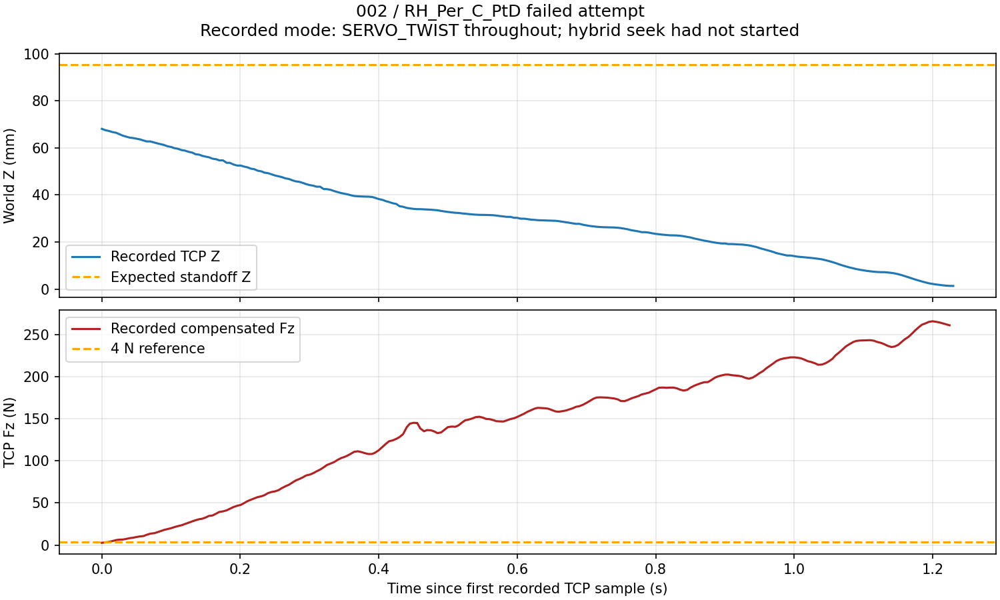

# ICRA acquisition incident, 2026-09-08

Automatic acquisition remains unsuitable for human use until the incident fixes and remaining motion/communication issues are validated off-subject. No robot commands were sent during this investigation. Patient files 001 and 002 were not changed.

## Recorded evidence

The latest session is `uncalibrated/002`. Four RH files completed. The failed fifth attempt is `attempts/RH_Per_C_PtD/001/raw.h5`, with `TCP target timeout` and only `prepare_begin` / `standoff_ready` stages. There is no `seek_begin` or tracking stage.

| Evidence | Measurement |
|---|---:|
| Expected standoff TCP XYZ | 287.717, 159.310, 95.459 mm |
| First recorded TCP XYZ | 284.640, 154.271, 68.061 mm |
| First recorded position error from standoff | 28.027 mm |
| First sample after standoff_ready marker | 130.790 ms |
| Recorded TCP Z displacement | -66.729 mm over 1.230 s |
| Maximum downward speed, ~100 ms linear fit | 82.718 mm/s |
| Maximum single-difference downward speed | 216.159 mm/s |
| Maximum recorded compensated TCP Fz | 266.025 N |
| Force control active | false for all 246 samples |
| Controller mode in force records | 1 / SERVO_TWIST for all 246 samples |
| Mode timing validity | true for all 246 samples |

All streams use the same shared clock. The recorded mode source differs from force time by 0.89–9.00 ms. These values establish a large downward movement in velocity mode, not a normal 4 N approach or curved scan. The force peak is the saved compensated sensor estimate, not an independently calibrated contact-force measurement.

The fourth saved L_PtD segment has Fz 3.08–4.21 N and a gradual -13.40 mm Z change consistent with the taught reverse path. This does not certify its unrecorded transit. The first three saved Fz ranges are 3.65–5.03, 3.69–5.15 and 3.37–4.92 N.

The failed raw starts after the standoff-ready marker; it does not record the preceding full MOVEJ. Therefore its evidence localizes the observed downstroke to the post-standoff interval, without proving the full earlier transit path. The user does not remember whether the gamepad was actuated, so the exact live or retained twist input cannot be reconstructed.

## Confirmed software gaps

1. After finite MOVEJ, the daemon queued its generic idle. With a live gamepad in 8 DOF, this selects SERVO_TWIST and reads the shared twist bus. Completing a scan also used generic idle. This reopened pad control inside an automatic acquisition attempt.
2. The acquisition supervisor did not explicitly protect the standoff while starting the recorder. The next scan call could wait a further second for the TCP target without treating airborne contact as an immediate failure.
3. MOVEJ pose planning checks the target IK with `require_path=False`, then uses a joint-space PTP. A target 30 mm outside the taught surface does not certify intermediate TCP/probe/arm clearance.

The mode evidence agrees with (1); it does not establish the precise twist source or rule out other actuator/feedback issues.

## Candidate corrections installed

- Label acquisition positioning `icra_movej` and propagate that label through the API and MOVEJ compiler.
- On completion of an `icra_` task, enter `TRACK_CARTESIAN` / `icra_wait` with an explicit live pose hold and secondary policy off. This hold has no gamepad twist source. Other tasks retain their previous idle behavior.
- During airborne positioning, reject unexpected abs(Fz) >= 4 N. During recorder readiness, also reject a pad-owned mode, TCP drift over 4 mm, or orientation error over 3 degrees. The existing failure handler requests stop and preserves the failed attempt. These are external supervisory checks, not a certified real-time collision guard.
- Clear the airborne guard only when issuing the intended hybrid seek, or when stopping.

These changes do not certify MOVEJ clearance or hardware braking. They do not reset ESTOP, change force/velocity safety thresholds in the controller, enlarge watchdog deadlines, or automatically recover motion.

## Rail and stop diagnostics still requiring resolution

`FA24 latched without encoder` means a retained nonzero rail velocity command outlived valid encoder feedback by the configured 120 ms threshold. Its emergency-zero operation deliberately closes the main Modbus socket, writes zero through a temporary connection, then reconnects; `not connected` immediately afterward can follow that protection path and is not proof of a broken cable.

The rail protection is distinct from `watchdog_latched`, which indicates loss of the control runner heartbeat. The logged `slow_stop receive error` is not confirmation of successful braking. These events alone do not identify the origin of the recorded downward command. The R3 stop response was not tested in this incident.

## Validation and use restriction

Validation: 107 controller/API/daemon tests passed, including the actual finite MOVEJ completion-to-idle daemon flow and ordinary-task compatibility. Acquisition/geometry validation passed 44 tests: 11 fake-feedback guard tests, 32 geometry/session tests and one synthetic recorder child handshake test. The handshake test needed an ephemeral localhost socket outside the network sandbox; it did not connect to hardware.

Only fake-feedback, geometry, API/compiler and simulated acquisition tests are used for this fix. Physical control stability, full transit clearance, R3 response and hardware collision/stop behavior remain unvalidated. Do not resume human acquisition on the strength of these tests. Updated controller and acquisition code must be loaded together before any supervised off-subject validation.

Detailed measurements: `MD/icra_incident_002_20260908.json`. The failed HDF5 remains in the original patient session and is not a successful training scan.

