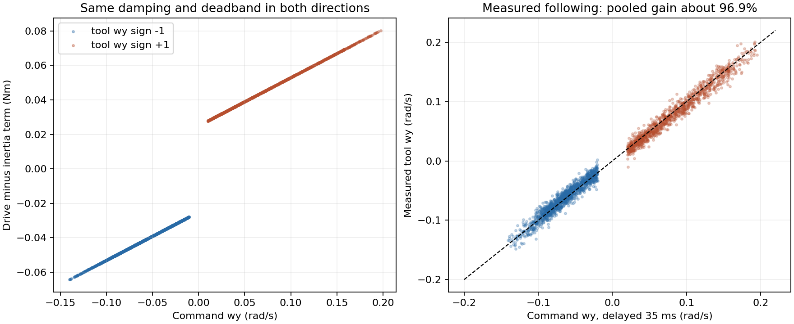
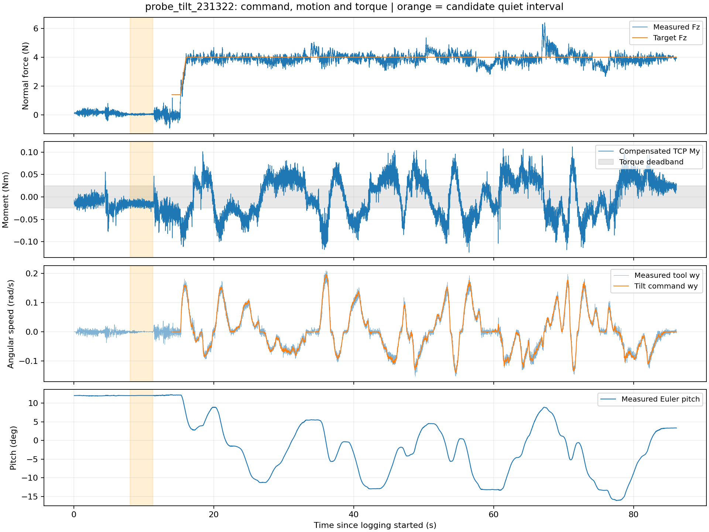

# 231322 探头旋转方向与标定审计

对象：[run_20260907_231322.csv](../rm75_control/apps/logs/peirastic/run_20260907_231322.csv)，17187 行、560 列，约 86.1 秒。其中 15.24 秒起持续记录接触，接触采样 14174 拍。补偿来源 `phi_recommended`，记录哈希 `354c5708`。

**结论：这份日志不支持“某一方向的控制增益/执行能力明显更弱”。非零 My 在接触中可以是正常接触力矩，不能直接判为标定零偏。8–11.3 秒属于 servo_twist、倾角控制未启用，既不能用作死区停转实例，也未被确认是空载零偏样本。当前不修改 TCP、质量、阻尼或死区。**

## 正反方向比较

CSV 的 `twist_achieved_*` 和任务角速度是 base 坐标，已用每拍记录的 TCP 姿态转换回 tool 坐标，再与 `tilt_omega_y_rad_s` 比较。正负指 tool ωy，日志没有标注实物哪一端对应用户描述的“上抬”。

从每拍力矩、前后角速度和实际 dt，分别拟合隐式质量—阻尼—库仑模型：

`drive = M × (ω[k] − ω[k−1])/dt + D × ω[k] + Fc × sign(ω[k])`

拟合仅使用已接触、未冻结、未封顶、相邻日志间隔小于 8 ms、速度/加速度未到上限的样本。

| 项目 | tool ωy 负向 | tool ωy 正向 |
|---|---:|---:|
| 拟合 M | 0.06500006 | 0.06500018 |
| 拟合 D | 0.27999902 | 0.27999976 |
| 拟合 Fc / N·m | 0.02500005 | 0.02500001 |
| 模型残差 RMS / N·m | 0.00000541 | 0.00000538 |
| 实测角速度跟随比例 | 97.11% | 96.77% |
| 拟合执行延迟 | 35 ms | 35 ms |

系数差异与日志舍入量级相当，两边是同一套控制律。35 ms 是这段轨迹的拟合延迟，不是硬件恒定延迟的测量保证。执行比例差约 0.34 个百分点，未见明显单向受限。

原始峰值和速度分布有差异，但施加的力矩也不相同。在 0.03–0.04 N·m、角加速度较小的样本中，两边角速度中位数分别是 0.03408 和 0.03401 rad/s，基本相同。

`tilt_frozen`、`tilt_capped`、`tilt_stalled`、`joint_limited`、`pos_clamped`、QPIK 故障锁存和 fallback 均未触发。总任务残差最大 0.01105，低于倾角冻结阈值 0.05。4005 拍接触采样处于力矩死区，占接触采样 28.26%；这表示输入进入死区，因惯性减速，角速度未必已立即归零。



## 残余力矩与 TCP

8–11.3 秒候选静止片段，共 660 拍：

| 信号 | 平均值 | 标准差 |
|---|---:|---:|
| 补偿、滤波后的 My | −0.01547 N·m | 0.00441 N·m |
| 补偿但未滤波的 My | −0.01547 N·m | 0.00642 N·m |
| Fz | 0.03454 N | 0.02923 N |
| 实测 tool ωy | −0.00035 rad/s | 0.00132 rad/s |

该段姿态几乎固定；Fy 均值约 0.216 N。其运行阶段是 `servo_twist`，`tilt_engaged=0`，没有倾角命令；此时 `contact_present=0` 不等于传感器已确认没有实物接触。约 14.013 秒才切入 `track_hybrid_pad`，约 15.24 秒才记录接触并启用倾角随形。用户指出该段可能已经接触，因此这组均值不能作为已确认的标定偏置，需与正常接触残余力矩区分。

真正的“接触但不转”实例在 33.41–34.16 秒：`track_hybrid_pad`、`contact_present=1`、`tilt_engaged=1`，Fz 均值约 4.17 N，My 均值约 −0.0086 N·m（范围约 −0.022 到 +0.009），角速度指令全为 0，原因全为 `torque_deadband`。这是当前 ±0.025 N·m 死区正常允许的小残余接触力矩，不是零偏故障的证据。死区抑制角速度输出，并不会把传感器记录的 My 人为改成零。

如果 −0.0155 N·m 是进入接触后仍存在的固定残差，当前 ±0.025 N·m 死区对应的真实外力矩起转门槛会偏移：正真实 My 约需超过 +0.0405 N·m，负真实 My 约需低于 −0.0095 N·m。控制参数可以完全对称，同时仍产生明显方向手感差异。这个推导假设偏置在姿态/载荷改变后保持不变，日志不能证明该假设。

从 24 个分散时刻的 `q_meas` 和 TCP pose 反算 `T_link7_tcp`，得到平移约 `[0, −15.229, 121.350] mm`；与现有 `force_id_phi_v2.json/tool_binding` 的 `gripper2` 绑定一致。中位平移差不到 0.001 mm、最大旋转差不到 0.0001°，都在 CSV 舍入量级。没有发现 FK 使用旧 TCP 的证据；这项检查验证软件一致性，不能证明 TCP 的实物定位、载荷重心或力传感器零点绝对正确。

代码链使用 link_7 坐标完成重力补偿，然后按当前 TCP 做一次力臂和旋转变换；TCP 几何标定并不等同于重新识别力传感器零偏、载荷质量和重心。不能从本条带外部接触的日志唯一分离几何偏差、重力补偿残差、传感器零偏和线缆作用力矩。

## 参数判断

实际配置尚保持 `M=0.065`、`D=0.28`、`Fc=0.025 N·m`、`vmax=0.22 rad/s`、`amax=4.5 rad/s²`。正反转不采用不同增益。9 月 8 日的进一步回放支持将 `0.020 N·m` 作为下一步小幅试调值，见下表；本次分析没有修改运行参数。

质量/阻尼决定的时间常数约 0.232 秒，两向实测一致，没有证据要求增加某一方向的增益。死区确实可能使探头尚未几何贴平就停止：4 N 时 0.025 N·m 等效 6.25 mm 力臂。8–11.3 秒的 My 均值幅度达死区约 62%，但尚不能确认其为偏置；只有在确认无外载且偏置持续存在的情况下，降低死区才会把这部分偏置更明显地转成角速度。

用候选静止段 My 重复回放、假设偏置延续且接触门控打开，`Fc=0.025/0.020/0.015 N·m` 时末段平均指令角速度约为 `0.00015/0.00241/0.139°/s`。这是偏置敏感性演示，既不是机器人实际空中漂移，也不是包含曲面反作用力的闭环稳定性验证。

若要判断标定偏置，仍需确认无外载、同样线缆布置下的多个静止姿态：近似常量更像偏置；随姿态变化更需检查载荷质量/重心和补偿。没有将本次接触日志的 My 均值扣除，也没有据此写入任何零偏补偿。

## 9 月 8 日：缩小死区的接触数据回放

回放同一条记录的力矩、实际 dt 和接触标志，保留质量、阻尼、速度/加速度上限以及完整速度历史，只改变死区。基准 `0.025 N·m` 复现记录角速度的最大误差为 `1.89×10⁻⁶ rad/s`，与日志舍入一致。

从原日志选取 13 个“已接触、倾角启用、角速度为零、死区状态”的连续片段，每段至少 150 ms，共 3.82 秒；比较小死区下这些片段产生的角位移。它们包含真实接触力矩变化，不能视为纯传感器噪声。

| 死区 / N·m | 接触采样落在死区内 | 全段累计绝对旋转指令相对原值 | 原静止片段最大角位移 | 主要换向次数 |
|---|---:|---:|---:|---:|
| 0.025 | 28.26% | 基准 | 0° | 17 |
| 0.0225 | 23.48% | +13.24% | 0.0122° | 17 |
| **0.020** | **19.42%** | **+27.18%** | **0.0440°** | **17** |
| 0.0175 | 15.85% | +41.56% | 0.1040° | 17 |
| 0.015 | 12.73% | +56.22% | 0.1821° | 17 |

“主要换向”定义为相反方向角速度超过 0.01 rad/s 并持续至少 50 ms；不包含该阈值以下的小幅摆动。片段角位移继承整段回放的速度状态，包含前一段运动的惯性减速，没有把每个静止片段的人为初速度设为零。

`0.020` 回放的峰值角速度为 12.32°/s，未触及原速度上限 12.61°/s；`0.015` 已有约 55 ms 达到该上限。数据支持 **先试 0.020，暂不一步降至 0.015**；如果希望更保守，0.0225 是较小的中间步。0.020 在 4 N 下对应约 5 mm 力臂，仍保留一定的小力矩容忍范围。

这只是同输入指令回放：实际探头转动改变后，接触反力和后续力矩也会改变。它支持小幅试调的选择，不能保证新参数在真实曲面、延迟和接触刚度下必然稳定。当前质量、阻尼和速度上限没有证据需要同时调整。



完整数值见 [JSON](probe_tilt_231322.json)。本轮只有离线分析及图表生成，未连接或驱动实机。

复现主分析：

```bash
source rm75_control/env.sh
python rm75_control/apps/joint_admittance_8dof/analyze_torque_tilt_log.py \
  rm75_control/apps/logs/peirastic/run_20260907_231322.csv \
  --baseline 8 11.3 \
  --binding-json rm75_control/data/force_compensation/logs/force_id_phi_v2.json \
  --compare-deadbands \
  --output-prefix MD/probe_tilt_231322
```
