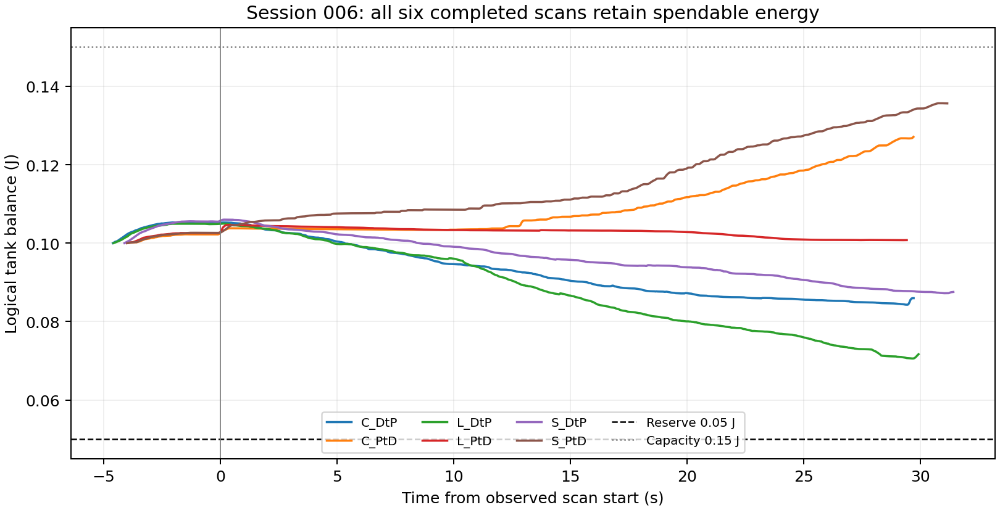

# Session 006 energy audit

Snapshot: 2026-09-11T14:59:05.040316+00:00 through 2026-09-11T14:59:16.866826+00:00 (UTC; Shanghai +08:00). Source: `/media/camp/yameng/icra 2027/uncalibrated/006`.

## Verdict

The new supplied logical command tank was actually active and accounted consistently in all seven recorded attempts. All six completed scans retained energy. The smallest balance was 0.070585 J, with a 0.05 J reserve; the minimum spendable availability after outstanding reservations was 0.020401 J. The energy inequality never reached its boundary in the published reservations (minimum affine margin 0.408016 W). No logged stop or rejection was due to tank depletion. This validates the configured accounting in these trials; it does not exercise empty-tank behavior or prove physical-port passivity.

Balances both decreased and recovered automatically. Recovery is positive completed absolute model-port work; nominal task supply pays the permitted portion of outward work. It does not turn unused task allowance into a tank refill. All exact stepwise checks below passed.

## Completed runs — complete recorded logical contact task

| Path | Minimum E (J) | Final E (J) | Absolute port work (J) | Used task supply (J) | Excess-output debit (J) | Positive-port recovery (J) |
|---|---:|---:|---:|---:|---:|---:|
| RH_Per_C_DtP/001 | 0.084290 | 0.085959 | -0.303036 | 0.288995 | 0.022049 | 0.008009 |
| RH_Per_L_DtP/002 | 0.070585 | 0.071818 | -0.335099 | 0.306917 | 0.035399 | 0.007217 |
| RH_Per_S_DtP/001 | 0.087221 | 0.087551 | -0.349971 | 0.337522 | 0.019669 | 0.007220 |
| RH_Per_C_PtD/001 | 0.099998 | 0.127093 | -0.036844 | 0.063937 | 0.001022 | 0.028115 |
| RH_Per_L_PtD/003 | 0.099997 | 0.100763 | -0.151268 | 0.152032 | 0.004625 | 0.005388 |
| RH_Per_S_PtD/001 | 0.100000 | 0.135635 | -0.022410 | 0.058045 | 0.000636 | 0.036271 |

Each task starts with 0.10 J. In every row `E_final = 0.10 + absolute_work + task_supply`; capacity clipping was zero throughout. Reserve 0.05 J is withheld from spendable energy, not a subtracted work term. The failed L DtP/001 ended at 0.087982 J, still with 0.037982 J above reserve; its logical lease expiry is a timing condition, not an energy-empty condition. L PtD/001 and /002 have failure metadata only and no QP/energy log, so no operational tank claim is made for those attempts.

## Scan interval separately

Scan bounds come from the failure/timeline worker’s `tracking_observed` to `path_done` supervisor stages. Their observation granularity is about 20 ms. Work is integrated only where those bounds overlap actual logical epochs; completed logical output stops a few milliseconds before the supervisor notices path completion. For the failed scan, the end is the final logical epoch end. This table excludes the preceding approach/force-acquisition budget interval. The JSON also supplies the first-positive-reference to first-maximum-reference window and the accepted H5 crop window for comparison.

| Path | Logged scan duration (s) | Absolute work (J) | Used task supply (J) | Net tank change (J) | Recovery (J) | Excess debit (J) |
|---|---:|---:|---:|---:|---:|---:|
| RH_Per_C_DtP/001 | 29.743 | -0.299429 | 0.280218 | -0.019211 | 0.002446 | 0.021657 |
| RH_Per_C_PtD/001 | 29.700 | -0.029418 | 0.053745 | +0.024328 | 0.024989 | 0.000661 |
| RH_Per_L_DtP/002 | 29.946 | -0.330733 | 0.297642 | -0.033091 | 0.002033 | 0.035124 |
| RH_Per_L_PtD/003 | 29.414 | -0.144787 | 0.142757 | -0.002030 | 0.002229 | 0.004258 |
| RH_Per_S_DtP/001 | 31.447 | -0.346725 | 0.328527 | -0.018199 | 0.001240 | 0.019439 |
| RH_Per_S_PtD/001 | 31.175 | -0.015786 | 0.048713 | +0.032928 | 0.033440 | 0.000513 |

Recovery is present during every scan itself, not only before/after scanning. C PtD and S PtD have more recovered input than excess debit and therefore grow during scanning. L/C/S DtP and L PtD have net scan expenditure; L PtD’s final task balance is slightly above 0.10 J because its preceding acquisition interval recovered more energy than the scan spent.

## Independent accounting checks

- 344,015 top-level JSON records; 41,844 committed command epochs; 125,533 work records.
- Every loaded config declares `energy_constraint_enabled=true`, `task_power_source=nominal_command`, `settlement_port=logical_final_model`, `assurance=two_port_command_model`; initial/capacity/reserve are 0.10/0.15/0.05 J. Runtime event fields match, so this is more than a YAML-only setting.
- For each committed epoch recomputed `P=W_tool dot V_final_tool`, `A=max(0,-W_tool dot V_nominal_tool)`, and for every work interval `source_used=min(A,max(0,-P))`, `port_work=P*dt`, `tank_work=port_work+source_used*dt`. All recorded power/work values matched exactly at double precision.
- Recomputed every balance and cumulative port/source/tank/capacity field in chronological order. Every per-record error was 0. The largest independently summed final identity residual was 1.47e-15 J.
- No interval overlap, no gap between successive active logical work intervals, no credited precommit or post-expiry work, and no work assigned to uncommitted IDs were found. No same-attempt tank reset or unexplained balance jump was found. Each new attempt is a distinct study session and legitimately initializes its own stated 0.10 J experiment budget.
- All positive changes came from positive absolute model work. When outward work was entirely funded, the tank stayed unchanged; unused task allowance was not banked. No capacity saturation/clip occurred, so capacity-discard total is exactly zero.
- Reservation liability independently matched `max(0,-P-A)*0.05s` for all committed candidates. Minimum final reservation margin is strictly positive; the maximum simultaneous reservation was about 0.001009 J, far below available energy.
- L DtP/002 has one `logical_candidate_not_sent`; that ID has no work/source credit, its old committed epoch continues, and later publications succeed. L DtP/001 has a source-age review rejection/retry before eventual timing failure, while energy remains sufficient. Detailed timing/root causes belong to the separate failure audit.

## Log integrity and snapshot limitations

- All seven files remained unchanged in size/mtime during the read, end with a newline, contain no malformed JSON lines, have `recording_close`, report `dropped_records=0`, and have no writer error. No partially written QP log was found in this snapshot. Each file SHA256 and timestamp is retained in `energy_audit.json`.
- Whole-task accounting means the complete recorded logical command-budget lifetime, including approach and acquisition until logical stop. It does not integrate unrecorded actual hardware tail after that stop.
- `physical_certified=false`, `actual_tail=unknown` remain appropriate. W is the declared negative raw control wrench, V is final command-model twist, and task allowance is the existing current pre-QP nominal command. It includes prior applied visual state; this is not independently isolated pure visual energy.
- Positive measured-port diagnostic work is nonspendable and never enters this ledger. Passing this arithmetic audit is not a claim that physical sensor tracking/alignment or real device power is exact.
- Removing the declared task supply while keeping the same recorded trajectory would make the simple final balance negative for L/C/S DtP and L PtD. This arithmetic counterfactual illustrates why the new supply matters; it does not predict the trajectory a truly constrained old controller would have executed.

Files: `audit.py`, `energy_audit.json`, per-run downsampled balance JSON, `plot_balance.py`, `completed_balance.png/svg`. Original data and production files were read only; no hardware was connected.
