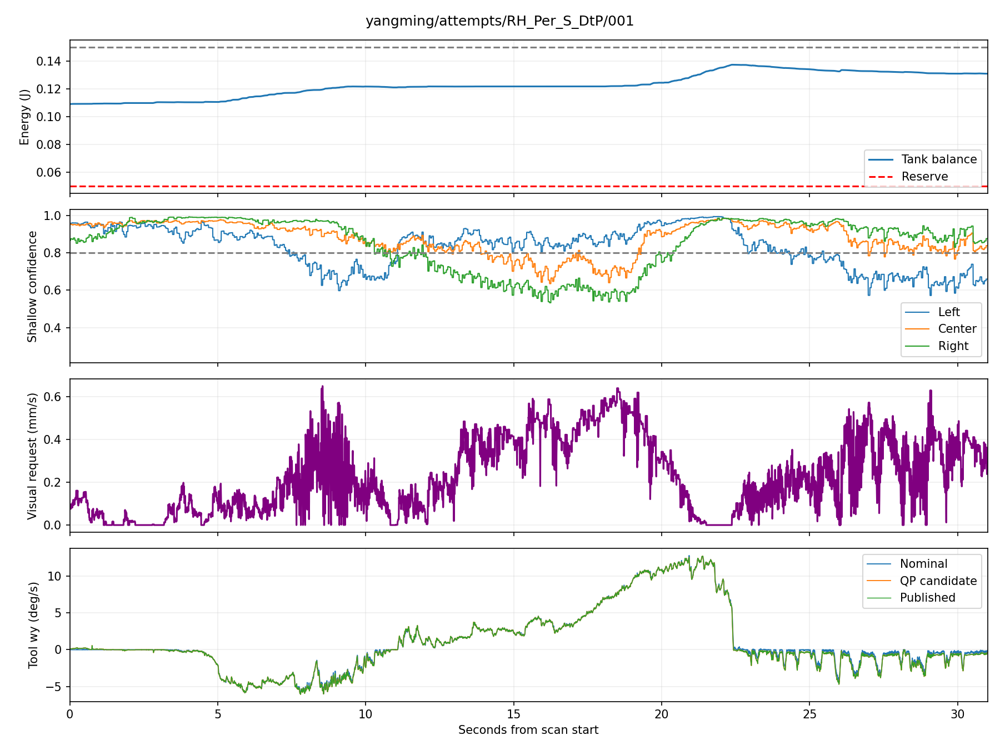

# T7 扫描数据核验 — 2026-09-12

数据：`/media/camp/PEI_T7/icra 2027_contact/uncalibrated`，四个目录 `yangming`、`yuhan_L`、`yuhan_R`、`zhongyao2`。

**结论：confidence 已经参与修正，能量罐有真实运行日志和闭合的模型收支；目前仍有控制器数值/时序故障，图像修复也未普遍完成。** 已有证据不支持把这些有日志的失败解释成图像过期停机或罐耗尽。

本次是数据核验、离线数值复现和独立交叉复核，没有上线实时控制修复。原始数据没有改写。处理后的分析工件在本目录。

## 1. 为什么 recorder 经常报 Stale or missing force feedback

36 条扫描任务共有 58 次尝试：36 次完成、22 次失败，其中 21 次表层错误为 force stale，另一次为 `servo_twist` 结束未确认。

| 能确定的控制器故障 | 次数 | 证据 |
|---|---:|---|
| QP 达到迭代上限、结果被拒绝 | 8 | 全部 `PROXQP_MAX_ITER_REACHED`；图像当时有效，力 3.973–4.336 N，前一拍 tank 0.10116–0.14980 J |
| 力源样本间隔超过声明的 15 ms | 6 | 全部先发生 `wrench_source_expired`，进入未发送重试，再被 `source interval exceeds declared maximum` 拒绝 |
| 证据不足 | 8 | 6 次仅准备阶段；另 2 次已进入扫描，但 attempt 目录缺失 |

采集脚本检查的是控制器发布的**补偿后力样本**，超过 100 ms 无新样本就报这句错。控制器异常可以先使该发布中断。14 次有原始记录的失败中，raw TCP 在故障附近仍有后续更新，而补偿力先停止；raw H5 都正常关闭，力数组无 NaN/Inf。因此这句错误经常是控制器故障的下游表现，不能直接判定力传感器断线。

6 次时间间隔异常不能统一说成传感器丢包：有的 raw TCP 源间隔确实拉长，有的 raw TCP 还在以小于 15 ms 的间隔更新，但控制路径跳过了可用样本。失败拍确切的 `prepare_source` 输入没有完整记录，尚不能区分调度、驱动和接收端延迟各占多少。

QP 离线重放复现了两个与记录相同的失败迭代数 **19303 / 18045**，结果出现 NaN。八个近似重建问题均经独立 LP 检查可行。证据指向求解器对数值状态/预条件的敏感性；仅重建 workspace 或每次重算预条件器都不能覆盖全部案例。失败拍缺少原始六维 wrench 和完整 energy snapshot，重建使用上一成功拍近似，不能称为所有输入完全一致的机器人闭环回放。

具体时间线见 [失败清单](failures/report.md)，数值复现及修改方向见 [求解器报告](solver/REPORT.md)。不应执行失败迭代输出；放宽 recorder 的 100 ms 限制也不能修复已经停止的控制器。

## 2. 图像 warning 在这批数据中的实际影响

48 段进入扫描的有日志尝试中，图像过期共 **5 次，累计 33.13 ms，最长 8.80 ms，全部恢复**。这些暂停拍的力反馈新鲜，视觉请求归零，同时仍有成功命令发布。它们验证了 `pause_visual` 的行为，没有直接触发上述停机。

完整接触控制期另外有启动/扫描前的 missing-image 段；全阶段合计 20 段图像不可用、276.26 ms，均恢复。不能把仅扫描期的 5 次当作全部图像不可用事件。贴出的 301.9→240.4 ms 日志含义就是暂时停止使用旧图像，下一张有效图像到达后恢复。

## 3. Energy tank 是否起作用

49 份 QP 日志（35 次完成、14 次失败）配置一致：continuous、pause_visual、0.100/0.150 J、reserve 0.050 J、nominal_command、shared_total_velocity。另一次完成扫描没有 QP 日志可核验。

- 246,468 个已提交命令，739,419 条能量结算区间，按记录的冻结 wrench、最终模型速度、名义任务源重新计算，账本闭合。
- 全部最低余额 **0.087545 J**；扣除留额及已预留支出后的最低 available **0.035700 J**。没有余额耗尽拒绝，能量约束未逼近边界。
- 同时存在扣款和正模型端口回充，达到容量时有丢弃；不是把初始 0.1 J 单向花完。
- 但这套账是 **command-model + nominal task source**，不是已经验证的物理能量测量。余额增长也可能来自名义任务源对负端口功率的抵偿，不能全称为机器人收回了物理能量。
- 停止尾部的 `logical_epoch_expired_actual_tail_unknown` 表示已提交命令有效期结束后无法确认实际尾部，不等于余额用完。

本批支持“模型能量收支机制正在运行”，没有检验低能量时的限幅效果或物理被动性。

## 4. Confidence 是否真的输出修正、图像是否修好了

48 段有日志扫描共约 1158.15 s，视觉有请求约 **796.01 s**，QP 沿该请求方向增加修正约 **571.67 s**。136,220 个有请求且成功发布的周期中，98.05% 的**发布角速度符号**符合请求；这不是实测转角正确率或图像改善率。

例：`yangming/RH_Per_S_DtP/001`，扫描约 29.10 s，保存帧 242139：

| 左/中/右 confidence | 视觉差分请求 | 名义 ωy | QP ωy | 发布 ωy |
|---|---:|---:|---:|---:|
| 0.572 / 0.812 / 0.907 | 0.630 mm/s | −0.402°/s | −1.106°/s | −1.097°/s |

对应保存图像可见左侧暗带。12 张代表 JPEG 重新计算出的 confidence 与在线同帧记录误差均为零，说明特征与命令链确实接通。该 S 段最后一帧左 confidence 仍约 0.660，说明响应没有完成修复。

完整图像/置信度面板：[S 原图与 confidence](mechanisms/yangming_attempts_RH_Per_S_DtP_001_frames.png)。

扫描期 23,657 张独立视觉帧中，**33.3% 至少一侧 confidence < 0.8**。35 条完成且有日志的扫描中，后半段低 confidence 比例比前半段下降 9 条、上升 20 条、近似不变 6 条。这是沿扫描路径的描述，不是同一位置的开关对照，不能证明视觉使图像变差或变好；它能说明修复没有普遍完成。

左右差分与所声明几何的符号一致，但仍只是质量方向线索。共享总角速度融合保留力矩名义运动，视觉又是软请求，有时不能完全兑现，少数发布方向也与视觉希望相反。顶端 22% 的侧窗均值还不能解释所有深部、窄边缘暗区。不能以“罐有能量”推出“所有黑边都能修复”，也不能以“机器人在转”推出“这次转动由视觉产生”。

详见 [机制统计](mechanisms/REPORT.md)、[当前代码路径](code_path.md)、[独立交叉复核](review.md)。

## 5. 已完成验证与仍需修复的范围

已经保存 8 个离线矩阵快照、触发失败的 20 拍历史片段及可重跑回归。相同约束/容差下两种替代数值设置均能解出这 8 个快照，16 个替代求解检查通过；这不构成对完整实时运行的修复验证。

工程处理重点是：有计算时限的 QP 数值恢复；将当前样本年龄与样本历史间隔分开处理；补全失败输入和控制器原始故障上报。需要保留有限性、完整约束、能量、实际发布时间及硬件停止检查，不能为了不报错而发送失效或 NaN 命令。实时修复还需覆盖历史反例、正常批量回放、低能量/不可行输入以及超时回归。
